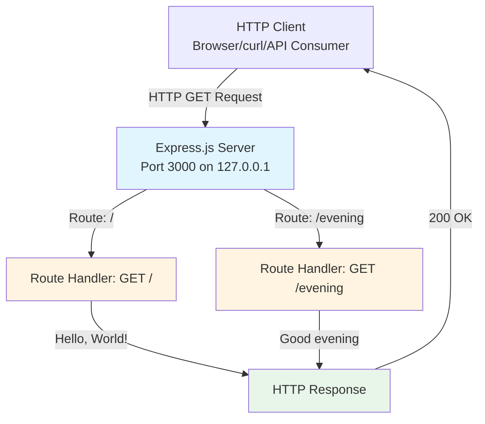
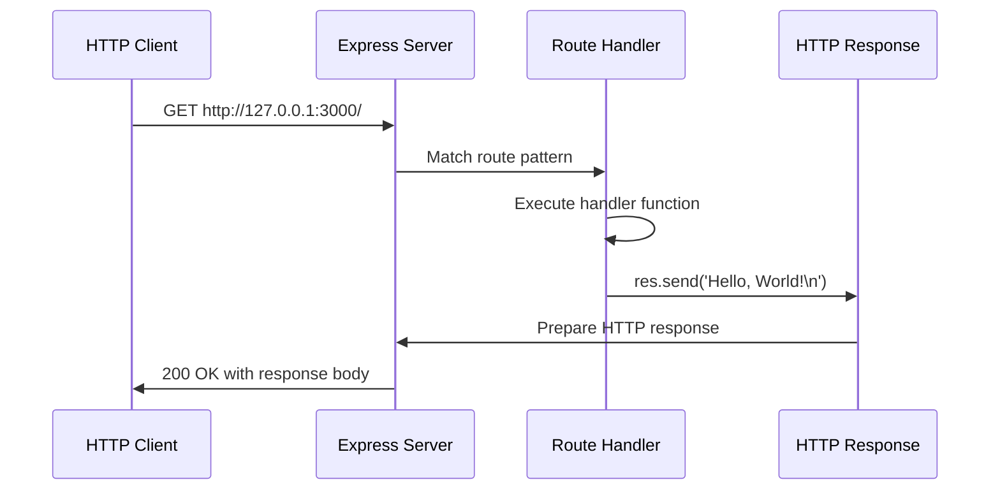

# hao-backprop-test

[](https://nodejs.org/)
[](https://expressjs.com/)
[](https://opensource.org/licenses/MIT)

**Express.js Web Server with Greeting Endpoints**

A simple Node.js web server built with Express.js 5.1.0, demonstrating routing, request handling, and API endpoint implementation. This is a test project for backprop integration, providing a clean, educational codebase for learning Express.js fundamentals.

## Table of Contents

- [Features](#features)
- [Prerequisites](#prerequisites)
- [Installation](#installation)
- [Configuration](#configuration)
- [Usage](#usage)
- [API Documentation](#api-documentation)
- [Architecture Overview](#architecture-overview)
- [Technology Stack](#technology-stack)
- [Development](#development)
- [Troubleshooting](#troubleshooting)
- [Contributing](#contributing)
- [License](#license)

## Features

- **Express.js 5.1.0 Framework Integration**: Modern web framework with robust routing capabilities
- **Two REST API Endpoints**: Simple greeting endpoints demonstrating GET request handling
- **Localhost-Only Development Server**: Secure localhost binding (127.0.0.1) prevents external access during development
- **Educational Codebase**: Clean, well-documented code ideal for learning Express.js patterns
- **Zero-Configuration Quick Start**: Run with `npm start` - no complex setup required

## Prerequisites

Before installing and running this application, ensure you have the following:

- **Node.js**: Version 18.0.0 or higher (tested on v20.19.5)
- **npm**: Version 7.0.0 or higher (tested on v10.8.2)
- **Basic Understanding**: Familiarity with REST APIs and command-line interfaces

Verify your installations:

```bash
node --version
npm --version
```

## Installation

Follow these steps to get the server running on your local machine:

### Step 1: Clone the Repository

```bash
git clone <repository-url>
cd hao-backprop-test
```

### Step 2: Install Dependencies

```bash
npm install
```

This command installs Express.js 5.1.0 and all required dependencies from `package.json`.

### Step 3: Verify Installation

```bash
npm list express
```

**Expected Output**: `express@5.1.0`

## Configuration

### Environment Variables

The application supports optional environment variable configuration. While the server runs with default values, you can customize behavior using environment variables.

| Variable | Description | Format | Default | Required |
|----------|-------------|--------|---------|----------|
| `JWT_SECRET` | Secret key for JWT token signing and verification | String (min 32 chars) | None | No |
| `PORT` | Server listening port | Integer (1024-65535) | 3000 | No |
| `NODE_ENV` | Application environment mode | `development`, `production`, `test` | development | No |

### Configuration Setup

1. Copy the environment template:

```bash
cp .env.example .env
```

2. Edit `.env` and set your values:

```bash
JWT_SECRET=your-secure-jwt-secret-key-here
PORT=3000
NODE_ENV=development
```

**Security Note**: Never commit actual secrets to version control. Generate strong random strings for production environments.

## Usage

### Starting the Server

Start the Express.js server:

```bash
npm start
```

**Expected Console Output**:
```
Server running at http://127.0.0.1:3000/
```

### Verifying Server Operation

Test the root endpoint:

```bash
curl http://127.0.0.1:3000/
```

**Expected Response**: `Hello, World!`

Test the evening endpoint:

```bash
curl http://127.0.0.1:3000/evening
```

**Expected Response**: `Good evening`

### Stopping the Server

Press `Ctrl+C` in the terminal where the server is running to gracefully shut down the application.

## API Documentation

This server provides two simple REST API endpoints for demonstration purposes.

### Endpoint: Root Greeting

**Description**: Returns a friendly greeting message.

- **URL**: `/`
- **Method**: `GET`
- **Authentication**: None required
- **Request Parameters**: None

**Response**:
- **Status Code**: `200 OK`
- **Content-Type**: `text/html; charset=utf-8`
- **Body**: `Hello, World!\n`

**Example Request**:

```bash
curl http://127.0.0.1:3000/
```

**Example Response**:

```
Hello, World!
```

*(Source: server.js:8-10)*

---

### Endpoint: Evening Greeting

**Description**: Returns an evening-specific greeting message.

- **URL**: `/evening`
- **Method**: `GET`
- **Authentication**: None required
- **Request Parameters**: None

**Response**:
- **Status Code**: `200 OK`
- **Content-Type**: `text/html; charset=utf-8`
- **Body**: `Good evening`

**Example Request**:

```bash
curl http://127.0.0.1:3000/evening
```

**Example Response**:

```
Good evening
```

*(Source: server.js:12-14)*

---

### Error Handling

**404 Not Found**: Requests to unmatched routes return Express.js default 404 error responses.

## Architecture Overview

This application follows a simple, single-file Express.js architecture suitable for learning and small projects.

### System Design



### Request Flow

The application processes requests through the following sequence:



### Component Description

- **Express Application**: Central application instance managing all routes and middleware (Source: server.js:6)
- **Route Handlers**: Callback functions processing HTTP requests and generating responses (Source: server.js:8-14)
- **Server Listener**: Binds application to hostname and port, listening for incoming connections (Source: server.js:16-18)

## Technology Stack

This project is built with modern, stable technologies:

| Technology | Version | Purpose | Rationale |
|------------|---------|---------|-----------|
| **Node.js** | v20.19.5 | JavaScript runtime environment | Provides non-blocking I/O for efficient server operations |
| **Express.js** | 5.1.0 | Web application framework | Industry-standard framework with robust routing and middleware support |
| **CommonJS** | ES standard | Module system | Standard Node.js module format using `require()` and `module.exports` |

### Why Express.js?

Express.js was chosen for this project because:
- **Simplicity**: Minimal boilerplate code for basic HTTP servers
- **Flexibility**: Unopinionated framework allows custom architecture
- **Maturity**: Battle-tested in production environments worldwide
- **Community**: Extensive documentation and community support
- **Performance**: Lightweight with minimal overhead

*(Source: package.json for dependency versions)*

## Development

### Local Development Setup

1. Follow the [Installation](#installation) instructions above
2. Review the [Configuration](#configuration) section for environment setup
3. Start the server with `npm start`
4. Make changes to `server.js`
5. Restart the server to see your changes (use `Ctrl+C` then `npm start`)

### Code Syntax Validation

Verify JavaScript syntax before running:

```bash
node -c server.js
```

No output indicates successful validation.

### Adding New Endpoints

To add a new route to the server:

1. Open `server.js`
2. Add a new route handler before the `app.listen()` call:

```javascript
app.get('/your-endpoint', (req, res) => {
  res.send('Your response');
});
```

3. Restart the server
4. Test with: `curl http://127.0.0.1:3000/your-endpoint`

### Development Guidelines

For detailed contribution guidelines, code style standards, and pull request procedures, see [CONTRIBUTING.md](./CONTRIBUTING.md).

## Troubleshooting

### Issue: Port Already in Use

**Symptom**: Error message "EADDRINUSE: address already in use 127.0.0.1:3000"

**Solution**:

1. Find the process using port 3000:

```bash
# On macOS/Linux
lsof -ti:3000

# On Windows
netstat -ano | findstr :3000
```

2. Kill the process or use a different port:

```bash
# Kill the process (macOS/Linux)
kill -9 $(lsof -ti:3000)

# Or set a different port
PORT=3001 npm start
```

---

### Issue: Module Not Found

**Symptom**: Error message "Cannot find module 'express'"

**Solution**: Install dependencies:

```bash
npm install
```

Verify Express installation:

```bash
npm list express
```

---

### Issue: Server Not Responding

**Symptom**: curl requests timeout or connection refused

**Solution**:

1. Verify server is running: Check terminal for "Server running at..." message
2. Check hostname binding: Server binds to 127.0.0.1 (localhost only)
3. Use correct URL: `http://127.0.0.1:3000/` (not `localhost` or external IP)
4. Check firewall settings: Ensure localhost traffic is allowed

---

### Issue: Unexpected Response Content

**Symptom**: Endpoint returns different content than expected

**Solution**: Verify you're using the correct endpoint:
- Root greeting: `curl http://127.0.0.1:3000/`
- Evening greeting: `curl http://127.0.0.1:3000/evening`
- Case-sensitive paths: `/Evening` will return 404

## Contributing

We welcome contributions to improve this project! Whether you're fixing bugs, adding features, or improving documentation, your help is appreciated.

### How to Contribute

1. Fork the repository
2. Create a feature branch (`git checkout -b feature/your-feature`)
3. Make your changes following our [code style guidelines](./CONTRIBUTING.md#code-style-guidelines)
4. Test your changes thoroughly
5. Commit with descriptive messages (see [commit conventions](./CONTRIBUTING.md#commit-message-conventions))
6. Push to your fork and submit a pull request

### Development Resources

For comprehensive development guidelines, see:
- **[CONTRIBUTING.md](./CONTRIBUTING.md)**: Complete contribution guide with setup, code style, and PR process
- **[.env.example](./.env.example)**: Environment variable configuration template

### Code of Conduct

Please be respectful and constructive in all interactions. We're building a welcoming community for developers of all skill levels.

## License

This project is licensed under the **MIT License**.

**Copyright** © 2024 hxu

Permission is hereby granted, free of charge, to any person obtaining a copy of this software and associated documentation files (the "Software"), to deal in the Software without restriction, including without limitation the rights to use, copy, modify, merge, publish, distribute, sublicense, and/or sell copies of the Software, and to permit persons to whom the Software is furnished to do so, subject to the following conditions:

The above copyright notice and this permission notice shall be included in all copies or substantial portions of the Software.

THE SOFTWARE IS PROVIDED "AS IS", WITHOUT WARRANTY OF ANY KIND, EXPRESS OR IMPLIED, INCLUDING BUT NOT LIMITED TO THE WARRANTIES OF MERCHANTABILITY, FITNESS FOR A PARTICULAR PURPOSE AND NONINFRINGEMENT. IN NO EVENT SHALL THE AUTHORS OR COPYRIGHT HOLDERS BE LIABLE FOR ANY CLAIM, DAMAGES OR OTHER LIABILITY, WHETHER IN AN ACTION OF CONTRACT, TORT OR OTHERWISE, ARISING FROM, OUT OF OR IN CONNECTION WITH THE SOFTWARE OR THE USE OR OTHER DEALINGS IN THE SOFTWARE.

---

**Project Status**: Active development for backprop integration testing

For questions or issues, please open an issue in the repository issue tracker.
