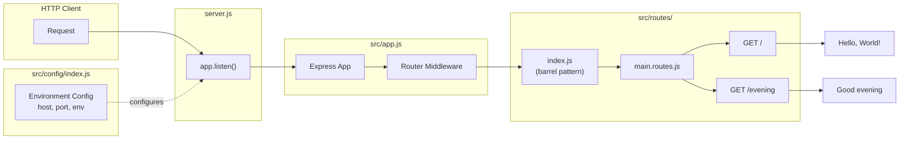

# hao-backprop-test

A Node.js tutorial server demonstrating Express.js integration with multiple HTTP endpoints.

> **Note**: This is a test project for backprop integration.

## Prerequisites

Before running this application, ensure you have the following installed:

| Requirement | Minimum Version | Recommended Version |
|-------------|-----------------|---------------------|
| Node.js | 18.x | 20.19.x (LTS) |
| npm | 8.x | 10.8.x |

### Verify Installation

```bash
node --version
# Expected: v20.x.x or higher

npm --version
# Expected: 10.x.x or higher
```

## Installation

1. Clone the repository:

```bash
git clone <repository-url>
cd hao-backprop-test
```

2. Install dependencies:

```bash
npm install
```

This will install Express.js (^5.1.0) and all required dependencies.

## Usage

### Start the Server

Run the server with default configuration:

```bash
npm start
```

**Expected output:**
```
Server running at http://127.0.0.1:3000/
```

### Custom Configuration

Override default settings using environment variables:

```bash
# Custom host and port
HOST=0.0.0.0 PORT=8080 npm start

# Production mode
NODE_ENV=production npm start

# Combined configuration
HOST=0.0.0.0 PORT=8080 NODE_ENV=production npm start
```

## API Reference

This server exposes two HTTP GET endpoints:

### GET `/`

Returns a greeting message.

**Request:**
```bash
curl -s http://127.0.0.1:3000/
```

**Response:**
- **Status Code:** 200 OK
- **Content-Type:** text/html; charset=utf-8
- **Body:** `Hello, World!\n` (14 characters, includes trailing newline)

**Example:**
```bash
curl -s http://127.0.0.1:3000/
# Output: Hello, World!
```

### GET `/evening`

Returns an evening greeting message.

**Request:**
```bash
curl -s http://127.0.0.1:3000/evening
```

**Response:**
- **Status Code:** 200 OK
- **Content-Type:** text/html; charset=utf-8
- **Body:** `Good evening` (12 characters, no trailing newline)

**Example:**
```bash
curl -s http://127.0.0.1:3000/evening
# Output: Good evening
```

### Health Check

Verify both endpoints are operational:

```bash
curl -s http://127.0.0.1:3000/ && echo " - Root OK"
curl -s http://127.0.0.1:3000/evening && echo " - Evening OK"
```

## Project Structure

```
hao-backprop-test/
├── server.js                    # Entry point - HTTP server binding
├── package.json                 # npm manifest and dependencies
├── package-lock.json            # Dependency lockfile
├── README.md                    # Project documentation (this file)
├── .gitignore                   # Git ignore patterns
├── jest.config.js               # Jest test framework configuration
├── src/                         # Application source root
│   ├── app.js                   # Express application factory
│   ├── config/                  # Configuration module
│   │   └── index.js             # Environment variable management
│   └── routes/                  # Routing surface
│       ├── index.js             # Route aggregator (barrel pattern)
│       └── main.routes.js       # Route handlers implementation
└── tests/                       # Test suite root
    ├── unit/                    # Isolated module tests
    │   ├── config.test.js       # Configuration module tests
    │   └── routes.test.js       # Route handler tests
    ├── integration/             # HTTP endpoint tests
    │   └── endpoints.test.js    # API endpoint contract tests
    └── lifecycle/               # Server lifecycle tests
        └── server.test.js       # Startup/shutdown tests
```

### File Descriptions

| File | Purpose |
|------|---------|
| `server.js` | Entry point that imports the Express app and binds it to the configured host/port |
| `src/app.js` | Express application factory - creates and exports configured Express app with mounted routes |
| `src/config/index.js` | Configuration module - exports `{ host, port, env }` from environment variables |
| `src/routes/index.js` | Route aggregator using barrel pattern - centralizes route exports |
| `src/routes/main.routes.js` | Route handlers - implements GET `/` and GET `/evening` endpoints |

## Environment Variables

The application supports the following environment variables for configuration.

> **Tip**: Copy the `.env.example` file to `.env` for local development:
> ```bash
> cp .env.example .env
> ```

| Variable | Default Value | Description |
|----------|---------------|-------------|
| `HOST` | `'127.0.0.1'` | Server binding address. Use `0.0.0.0` to accept connections from any interface. |
| `PORT` | `3000` | Server binding port number. |
| `NODE_ENV` | `'development'` | Application environment mode (`development`, `production`, `test`). |

### Configuration Examples

**Development (default):**
```bash
npm start
# Binds to http://127.0.0.1:3000/
```

**Production deployment:**
```bash
HOST=0.0.0.0 PORT=80 NODE_ENV=production npm start
# Binds to http://0.0.0.0:80/
```

**Custom port:**
```bash
PORT=8080 npm start
# Binds to http://127.0.0.1:8080/
```

## Architecture

This project follows a modular Express.js architecture with separation of concerns:

```
Request Flow:
Client → server.js → Express App (src/app.js) → Router (src/routes/) → Response
                           ↑
                     Configuration
                   (src/config/index.js)
```

### Request Flow Diagram

The following diagram illustrates how HTTP requests flow through the application:


```mermaid
flowchart LR
    subgraph Client["HTTP Client"]
        Request[Request]
    end
    
    subgraph Server["server.js"]
        Listen["app.listen()"]
    end
    
    subgraph App["src/app.js"]
        Express[Express App]
        Middleware[Router Middleware]
    end
    
    subgraph Config["src/config/index.js"]
        Env["Environment Config<br/>host, port, env"]
    end
    
    subgraph Routes["src/routes/"]
        Aggregator["index.js<br/>(barrel pattern)"]
        MainRoutes["main.routes.js"]
        Root["GET /"]
        Evening["GET /evening"]
    end
    
    Request --> Listen
    Listen --> Express
    Env -.->|"configures"| Listen
    Express --> Middleware
    Middleware --> Aggregator
    Aggregator --> MainRoutes
    MainRoutes --> Root
    MainRoutes --> Evening
    Root --> Response1["Hello, World!"]
    Evening --> Response2["Good evening"]
```

### Design Patterns Used

- **Factory Pattern**: `src/app.js` exports a configured Express app without starting the server, enabling testability
- **Barrel Pattern**: `src/routes/index.js` aggregates route exports for clean imports
- **CommonJS Modules**: Uses `require`/`module.exports` for Node.js compatibility
- **Twelve-Factor App**: Configuration externalized to environment variables

## Dependencies

### Runtime Dependencies

| Package | Version | Purpose |
|---------|---------|---------|
| `express` | ^5.1.0 | Web framework providing HTTP handling, routing, and middleware |

### Dependency Installation

```bash
# Install all dependencies
npm install

# Verify express installation
npm ls express
# Expected: express@5.1.0
```

## Scripts

| Script | Command | Description |
|--------|---------|-------------|
| `start` | `node server.js` | Starts the HTTP server |
| `test` | `jest` | Run the complete test suite |
| `test:watch` | `jest --watch` | Run tests in watch mode for development |
| `test:coverage` | `jest --coverage` | Run tests and generate coverage report |
| `test:ci` | `jest --ci --coverage` | Run tests optimized for CI/CD environments |

## Testing

This project includes a comprehensive test suite built with **Jest 30.x** and **Supertest** for HTTP endpoint testing.

### Test Execution Commands

| Purpose | Command | Description |
|---------|---------|-------------|
| Run all tests | `npm test` | Execute the complete test suite |
| Watch mode | `npm run test:watch` | Re-run tests automatically on file changes |
| Coverage report | `npm run test:coverage` | Generate detailed code coverage metrics |
| CI execution | `npm run test:ci` | Optimized execution for CI/CD pipelines |
| Single file | `npx jest tests/unit/config.test.js` | Run a specific test file |
| Pattern match | `npx jest --testPathPatterns="config"` | Run tests matching a pattern |

### Test Structure

The test suite is organized into three categories based on test scope:

```
tests/
├── unit/                    # Isolated module tests
│   ├── config.test.js       # Configuration defaults and parsing
│   └── routes.test.js       # Route handler exports verification
├── integration/             # HTTP endpoint tests
│   └── endpoints.test.js    # API contract tests using Supertest
└── lifecycle/               # Server lifecycle tests
    └── server.test.js       # Startup and shutdown behavior
```

| Directory | Purpose | Test Approach |
|-----------|---------|---------------|
| `tests/unit/` | Test isolated modules without HTTP | Direct module imports with Jest assertions |
| `tests/integration/` | Test HTTP endpoint responses | Supertest requests against the Express app |
| `tests/lifecycle/` | Test server startup/shutdown | Mock-based lifecycle verification |

### Coverage Targets

The project enforces the following code coverage thresholds:

| Coverage Metric | Target | Description |
|-----------------|--------|-------------|
| Line Coverage | ≥ 80% | Percentage of code lines executed by tests |
| Branch Coverage | ≥ 75% | Percentage of conditional branches tested |
| Function Coverage | ≥ 90% | Percentage of functions called by tests |
| Statement Coverage | ≥ 80% | Percentage of statements executed by tests |

**Generate and view coverage report:**
```bash
npm run test:coverage
# Coverage report generated in ./coverage/
# Open ./coverage/lcov-report/index.html for detailed HTML report
```

### Test Dependencies

| Package | Version | Purpose |
|---------|---------|---------|
| `jest` | ^30.2.0 | JavaScript testing framework and test runner |
| `supertest` | ^7.1.4 | HTTP assertion library for Express endpoint testing |

## Deployment

This section covers production deployment strategies including environment configuration, Docker containerization, and process management.

### Production Configuration

When deploying to production, configure the following environment variables:

```bash
# Production environment configuration
export NODE_ENV=production
export HOST=0.0.0.0    # Accept connections from any interface
export PORT=3000        # Or your desired port
```

**Security Considerations:**

| Binding Address | Use Case | Security Implication |
|-----------------|----------|---------------------|
| `127.0.0.1` | Development, localhost only | Most secure - only local connections accepted |
| `0.0.0.0` | Production (behind proxy) | Accepts connections from any interface - use with firewall/reverse proxy |

**NODE_ENV=production implications:**
- Express.js enables various performance optimizations
- Error messages are less verbose (no stack traces to clients)
- View template caching is enabled
- CSS compilation caching may be enabled (if applicable)

**Recommended production startup:**
```bash
NODE_ENV=production HOST=0.0.0.0 PORT=3000 node server.js
```

### Docker Deployment

#### Dockerfile Example

Create a `Dockerfile` in the project root:

```dockerfile
# Use Node.js 20 LTS as base image
FROM node:20-alpine

# Create app directory
WORKDIR /usr/src/app

# Create non-root user for security
RUN addgroup -g 1001 -S nodejs && \
    adduser -S nodejs -u 1001

# Copy package files first (better layer caching)
COPY package*.json ./

# Install production dependencies only
RUN npm ci --only=production && npm cache clean --force

# Copy application source
COPY . .

# Change ownership to non-root user
RUN chown -R nodejs:nodejs /usr/src/app

# Switch to non-root user
USER nodejs

# Expose the application port
EXPOSE 3000

# Set environment variables
ENV NODE_ENV=production
ENV HOST=0.0.0.0
ENV PORT=3000

# Health check
HEALTHCHECK --interval=30s --timeout=3s --start-period=5s --retries=3 \
    CMD node -e "require('http').get('http://localhost:3000/', (r) => process.exit(r.statusCode === 200 ? 0 : 1))"

# Start the application
CMD ["node", "server.js"]
```

#### docker-compose.yml Example

Create a `docker-compose.yml` for easier deployment:

```yaml
version: '3.8'

services:
  app:
    build:
      context: .
      dockerfile: Dockerfile
    container_name: hao-backprop-server
    restart: unless-stopped
    ports:
      - "3000:3000"
    environment:
      - NODE_ENV=production
      - HOST=0.0.0.0
      - PORT=3000
    healthcheck:
      test: ["CMD", "node", "-e", "require('http').get('http://localhost:3000/', (r) => process.exit(r.statusCode === 200 ? 0 : 1))"]
      interval: 30s
      timeout: 3s
      retries: 3
      start_period: 5s
```

#### Docker Commands

```bash
# Build the Docker image
docker build -t hao-backprop-server .

# Run the container
docker run -d -p 3000:3000 --name hao-backprop-server hao-backprop-server

# View logs
docker logs -f hao-backprop-server

# Stop the container
docker stop hao-backprop-server

# Using docker-compose
docker-compose up -d
docker-compose logs -f
docker-compose down
```

**Container Best Practices Applied:**
- Uses Alpine-based image for smaller footprint
- Runs as non-root user for security
- Includes health check for orchestration compatibility
- Uses `npm ci` for reproducible builds
- Separates package install from source copy for better caching

### Process Management

For production deployments without containers, use a process manager to ensure reliability.

#### PM2 Configuration

Install PM2 globally:
```bash
npm install -g pm2
```

Create `ecosystem.config.js` in the project root:

```javascript
module.exports = {
  apps: [{
    name: 'hao-backprop-server',
    script: 'server.js',
    instances: 'max',           // Use all available CPU cores
    exec_mode: 'cluster',       // Enable cluster mode for load balancing
    env: {
      NODE_ENV: 'development',
      HOST: '127.0.0.1',
      PORT: 3000
    },
    env_production: {
      NODE_ENV: 'production',
      HOST: '0.0.0.0',
      PORT: 3000
    },
    max_memory_restart: '500M', // Restart if memory exceeds limit
    log_date_format: 'YYYY-MM-DD HH:mm:ss Z',
    error_file: './logs/error.log',
    out_file: './logs/output.log',
    merge_logs: true
  }]
};
```

**PM2 Commands:**
```bash
# Start in development mode
pm2 start ecosystem.config.js

# Start in production mode
pm2 start ecosystem.config.js --env production

# View status
pm2 status

# View logs
pm2 logs hao-backprop-server

# Restart application
pm2 restart hao-backprop-server

# Stop application
pm2 stop hao-backprop-server

# Set PM2 to start on system boot
pm2 startup
pm2 save
```

#### systemd Service (Linux)

For Linux servers using systemd, create `/etc/systemd/system/hao-backprop.service`:

```ini
[Unit]
Description=hao-backprop-test Node.js Server
Documentation=https://github.com/your-repo/hao-backprop-test
After=network.target

[Service]
Type=simple
User=nodejs
Group=nodejs
WorkingDirectory=/opt/hao-backprop-test
ExecStart=/usr/bin/node server.js
Restart=on-failure
RestartSec=10

# Environment configuration
Environment=NODE_ENV=production
Environment=HOST=0.0.0.0
Environment=PORT=3000

# Security hardening
NoNewPrivileges=true
PrivateTmp=true
ProtectSystem=strict
ProtectHome=true

# Logging
StandardOutput=syslog
StandardError=syslog
SyslogIdentifier=hao-backprop

[Install]
WantedBy=multi-user.target
```

**systemd Commands:**
```bash
# Reload systemd configuration
sudo systemctl daemon-reload

# Enable service to start on boot
sudo systemctl enable hao-backprop

# Start the service
sudo systemctl start hao-backprop

# Check status
sudo systemctl status hao-backprop

# View logs
sudo journalctl -u hao-backprop -f

# Restart the service
sudo systemctl restart hao-backprop
```

### Health Checks

Verify deployment health using the built-in endpoints:

```bash
# Basic health check
curl -sf http://localhost:3000/ && echo "OK" || echo "FAIL"

# Comprehensive health check script
#!/bin/bash
ROOT_RESPONSE=$(curl -s http://localhost:3000/)
EVENING_RESPONSE=$(curl -s http://localhost:3000/evening)

if [[ "$ROOT_RESPONSE" == "Hello, World!" ]] && [[ "$EVENING_RESPONSE" == "Good evening" ]]; then
    echo "Health check PASSED"
    exit 0
else
    echo "Health check FAILED"
    exit 1
fi
```

**Integration with load balancers:**
- Use `GET /` as the health check endpoint
- Expected response: `200 OK` with body `Hello, World!\n`
- Timeout recommendation: 3 seconds
- Check interval recommendation: 30 seconds

## Troubleshooting

### Common Issues

**Port already in use:**
```bash
# Error: listen EADDRINUSE: address already in use
# Solution: Use a different port
PORT=3001 npm start
```

**Permission denied on port 80:**
```bash
# Error: listen EACCES: permission denied
# Solution: Use a port above 1024 or run with elevated privileges
PORT=8080 npm start
```

**Module not found:**
```bash
# Error: Cannot find module 'express'
# Solution: Install dependencies
npm install
```

## License

This project is licensed under the MIT License.

## Author

hao-backprop-test contributors

---

*This is a tutorial project demonstrating Node.js server development with Express.js framework.*
