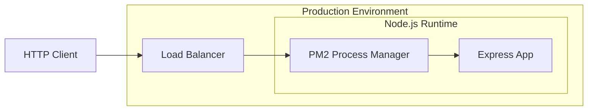

# hao-backprop-test

A Node.js tutorial server demonstrating Express.js integration with multiple HTTP endpoints.

> **Note**: This is a test project for backprop integration.

## Prerequisites

Before running this application, ensure you have the following installed:

| Requirement | Minimum Version | Recommended Version |
|-------------|-----------------|---------------------|
| Node.js | 18.x | 20.19.x (LTS) |
| npm | 8.x | 10.8.x |

### Verify Installation

```bash
node --version
# Expected: v20.x.x or higher

npm --version
# Expected: 10.x.x or higher
```

## Installation

1. Clone the repository:

```bash
git clone <repository-url>
cd hao-backprop-test
```

2. Install dependencies:

```bash
npm install
```

This will install Express.js (^5.1.0) and all required dependencies.

## Usage

### Start the Server

Run the server with default configuration:

```bash
npm start
```

**Expected output:**
```
Server running at http://127.0.0.1:3000/
```

### Custom Configuration

Override default settings using environment variables:

```bash
# Custom host and port
HOST=0.0.0.0 PORT=8080 npm start

# Production mode
NODE_ENV=production npm start

# Combined configuration
HOST=0.0.0.0 PORT=8080 NODE_ENV=production npm start
```

## API Reference

This server exposes two HTTP GET endpoints:

### GET `/`

Returns a greeting message.

**Request:**
```bash
curl -s http://127.0.0.1:3000/
```

**Response:**
- **Status Code:** 200 OK
- **Content-Type:** text/html; charset=utf-8
- **Body:** `Hello, World!\n` (14 characters, includes trailing newline)

**Example:**
```bash
curl -s http://127.0.0.1:3000/
# Output: Hello, World!
```

### GET `/evening`

Returns an evening greeting message.

**Request:**
```bash
curl -s http://127.0.0.1:3000/evening
```

**Response:**
- **Status Code:** 200 OK
- **Content-Type:** text/html; charset=utf-8
- **Body:** `Good evening` (12 characters, no trailing newline)

**Example:**
```bash
curl -s http://127.0.0.1:3000/evening
# Output: Good evening
```

### Health Check

Verify both endpoints are operational:

```bash
curl -s http://127.0.0.1:3000/ && echo " - Root OK"
curl -s http://127.0.0.1:3000/evening && echo " - Evening OK"
```

## Project Structure

```
hao-backprop-test/
├── server.js                    # Entry point - HTTP server binding
├── package.json                 # npm manifest and dependencies
├── package-lock.json            # Dependency lockfile
├── README.md                    # Project documentation (this file)
├── .gitignore                   # Git ignore patterns
└── src/                         # Application source root
    ├── app.js                   # Express application factory
    ├── config/                  # Configuration module
    │   └── index.js             # Environment variable management
    └── routes/                  # Routing surface
        ├── index.js             # Route aggregator (barrel pattern)
        └── main.routes.js       # Route handlers implementation
```

### File Descriptions

| File | Purpose |
|------|---------|
| `server.js` | Entry point that imports the Express app and binds it to the configured host/port |
| `src/app.js` | Express application factory - creates and exports configured Express app with mounted routes |
| `src/config/index.js` | Configuration module - exports `{ host, port, env }` from environment variables |
| `src/routes/index.js` | Route aggregator using barrel pattern - centralizes route exports |
| `src/routes/main.routes.js` | Route handlers - implements GET `/` and GET `/evening` endpoints |

## Environment Variables

The application supports the following environment variables for configuration:

| Variable | Default Value | Description |
|----------|---------------|-------------|
| `HOST` | `'127.0.0.1'` | Server binding address. Use `0.0.0.0` to accept connections from any interface. |
| `PORT` | `3000` | Server binding port number. |
| `NODE_ENV` | `'development'` | Application environment mode (`development`, `production`, `test`). |

### Configuration Examples

**Development (default):**
```bash
npm start
# Binds to http://127.0.0.1:3000/
```

**Production deployment:**
```bash
HOST=0.0.0.0 PORT=80 NODE_ENV=production npm start
# Binds to http://0.0.0.0:80/
```

**Custom port:**
```bash
PORT=8080 npm start
# Binds to http://127.0.0.1:8080/
```

## Architecture

This project follows a modular Express.js architecture with separation of concerns:

```
Request Flow:
Client → server.js → Express App (src/app.js) → Router (src/routes/) → Response
                           ↑
                     Configuration
                   (src/config/index.js)
```

### Design Patterns Used

- **Factory Pattern**: `src/app.js` exports a configured Express app without starting the server, enabling testability
- **Barrel Pattern**: `src/routes/index.js` aggregates route exports for clean imports
- **CommonJS Modules**: Uses `require`/`module.exports` for Node.js compatibility
- **Twelve-Factor App**: Configuration externalized to environment variables

## Deployment Guide

This section covers production deployment strategies for the hello_world Express.js application.


```mermaid
flowchart LR
    subgraph Production["Production Environment"]
        LB[Load Balancer]
        subgraph Node["Node.js Runtime"]
            PM2[PM2 Process Manager]
            App[Express App]
        end
        LB --> PM2
        PM2 --> App
    end
    
    Client[HTTP Client] --> LB
```

### Production Configuration

Configure environment variables for production deployment. Reference: `src/config/index.js`

| Variable | Development | Production | Description |
|----------|-------------|------------|-------------|
| `HOST` | `'127.0.0.1'` | `'0.0.0.0'` | Use `0.0.0.0` to accept connections from all network interfaces |
| `PORT` | `3000` | `80` or `3000` | Production port (use 3000 behind reverse proxy, 80 for direct access) |
| `NODE_ENV` | `'development'` | `'production'` | Enables production optimizations in Express |

**Production environment setup:**

```bash
# Set environment variables
export HOST=0.0.0.0
export PORT=3000
export NODE_ENV=production

# Or inline with the start command
HOST=0.0.0.0 PORT=3000 NODE_ENV=production node server.js
```

### Process Management

#### Direct Node Execution

For simple deployments or containerized environments:

```bash
# Start server directly
node server.js

# With environment variables
HOST=0.0.0.0 PORT=3000 NODE_ENV=production node server.js
```

#### PM2 Process Manager

PM2 provides process management, automatic restarts, and cluster mode for production:

```bash
# Install PM2 globally
npm install -g pm2

# Start application
pm2 start server.js --name "hello-world"

# Start with environment variables
pm2 start server.js --name "hello-world" --env production

# View logs
pm2 logs hello-world

# Monitor processes
pm2 monit

# Restart application
pm2 restart hello-world

# Stop application
pm2 stop hello-world
```

**PM2 Ecosystem Configuration (ecosystem.config.js):**

```javascript
module.exports = {
  apps: [{
    name: 'hello-world',
    script: 'server.js',
    instances: 'max',        // Cluster mode: spawn one instance per CPU core
    exec_mode: 'cluster',
    env: {
      NODE_ENV: 'development',
      HOST: '127.0.0.1',
      PORT: 3000
    },
    env_production: {
      NODE_ENV: 'production',
      HOST: '0.0.0.0',
      PORT: 3000
    },
    error_file: './logs/err.log',
    out_file: './logs/out.log',
    log_date_format: 'YYYY-MM-DD HH:mm:ss Z',
    max_memory_restart: '1G'
  }]
};
```

**Start with ecosystem file:**

```bash
# Development
pm2 start ecosystem.config.js

# Production
pm2 start ecosystem.config.js --env production

# Save process list for auto-restart on reboot
pm2 save
pm2 startup
```

#### Systemd Service Configuration

For Linux systems using systemd, create a service file:

**/etc/systemd/system/hello-world.service:**

```ini
[Unit]
Description=Hello World Express.js Application
Documentation=https://github.com/your-repo/hello-world
After=network.target

[Service]
Type=simple
User=nodejs
Group=nodejs
WorkingDirectory=/opt/hello-world
Environment=NODE_ENV=production
Environment=HOST=0.0.0.0
Environment=PORT=3000
ExecStart=/usr/bin/node server.js
Restart=on-failure
RestartSec=10
StandardOutput=syslog
StandardError=syslog
SyslogIdentifier=hello-world

[Install]
WantedBy=multi-user.target
```

**Systemd commands:**

```bash
# Reload systemd configuration
sudo systemctl daemon-reload

# Enable service to start on boot
sudo systemctl enable hello-world

# Start service
sudo systemctl start hello-world

# Check status
sudo systemctl status hello-world

# View logs
sudo journalctl -u hello-world -f

# Restart service
sudo systemctl restart hello-world

# Stop service
sudo systemctl stop hello-world
```

### Reverse Proxy Setup

#### Nginx Configuration

Configure Nginx as a reverse proxy to handle SSL termination, load balancing, and static file serving:

**/etc/nginx/sites-available/hello-world:**

```nginx
upstream nodejs_app {
    server 127.0.0.1:3000;
    keepalive 64;
}

server {
    listen 80;
    server_name example.com www.example.com;

    # Redirect HTTP to HTTPS (optional, recommended)
    # return 301 https://$server_name$request_uri;

    location / {
        proxy_pass http://nodejs_app;
        proxy_http_version 1.1;
        proxy_set_header Upgrade $http_upgrade;
        proxy_set_header Connection 'upgrade';
        proxy_set_header Host $host;
        proxy_set_header X-Real-IP $remote_addr;
        proxy_set_header X-Forwarded-For $proxy_add_x_forwarded_for;
        proxy_set_header X-Forwarded-Proto $scheme;
        proxy_cache_bypass $http_upgrade;
        proxy_read_timeout 60s;
        proxy_connect_timeout 60s;
    }

    # Health check endpoint
    location /health {
        proxy_pass http://nodejs_app/;
        proxy_http_version 1.1;
        proxy_set_header Host $host;
        access_log off;
    }
}
```

**Enable the site:**

```bash
# Create symbolic link
sudo ln -s /etc/nginx/sites-available/hello-world /etc/nginx/sites-enabled/

# Test configuration
sudo nginx -t

# Reload Nginx
sudo systemctl reload nginx
```

### Health Monitoring

#### Endpoint Verification

Use these commands to verify the application is responding correctly:

```bash
# Check root endpoint
curl -s http://127.0.0.1:3000/
# Expected output: Hello, World!

# Check evening endpoint
curl -s http://127.0.0.1:3000/evening
# Expected output: Good evening

# Check with response headers and status code
curl -i http://127.0.0.1:3000/
# Expected: HTTP/1.1 200 OK with "Hello, World!" body

# Combined health check script
curl -sf http://127.0.0.1:3000/ > /dev/null && echo "Root: OK" || echo "Root: FAIL"
curl -sf http://127.0.0.1:3000/evening > /dev/null && echo "Evening: OK" || echo "Evening: FAIL"
```

#### Load Balancer Health Checks

Configure health checks in your load balancer to monitor application availability:

**AWS Application Load Balancer:**
- Protocol: HTTP
- Path: `/`
- Port: 3000
- Healthy threshold: 2
- Unhealthy threshold: 3
- Timeout: 5 seconds
- Interval: 30 seconds
- Success codes: 200

**Generic Health Check Script (healthcheck.sh):**

```bash
#!/bin/bash
HEALTH_URL="http://127.0.0.1:3000/"
EXPECTED_RESPONSE="Hello, World!"

response=$(curl -sf --max-time 5 "$HEALTH_URL" 2>/dev/null)

if [ "$response" = "$EXPECTED_RESPONSE" ]; then
    echo "Health check passed"
    exit 0
else
    echo "Health check failed"
    exit 1
fi
```

### Security Considerations

#### Network Binding Recommendations

| Environment | HOST Value | Rationale |
|-------------|------------|-----------|
| Development | `127.0.0.1` | Restricts access to local machine only |
| Production (with proxy) | `127.0.0.1` | Only accept connections from local reverse proxy |
| Production (direct) | `0.0.0.0` | Accept connections from all interfaces (use with firewall) |
| Container | `0.0.0.0` | Required for container networking |

**Important:** When binding to `0.0.0.0`, ensure proper firewall rules are in place:

```bash
# Example: Allow only port 80 and 443 from outside, Node.js on internal port
sudo ufw allow 80/tcp
sudo ufw allow 443/tcp
sudo ufw deny 3000/tcp  # Block direct access to Node.js port
```

#### Environment Variable Security

**Best Practices:**

1. **Never commit secrets to version control:**
   ```bash
   # Add to .gitignore
   .env
   .env.local
   .env.production
   ```

2. **Use environment-specific configuration files:**
   ```bash
   # Development
   source .env.development
   
   # Production
   source .env.production
   ```

3. **Use secret management services in production:**
   - AWS Secrets Manager
   - HashiCorp Vault
   - Azure Key Vault
   - Google Cloud Secret Manager

4. **Set restrictive file permissions:**
   ```bash
   chmod 600 .env.production
   ```

5. **Validate environment variables at startup:**
   ```javascript
   // Ensure required variables are set
   if (!process.env.NODE_ENV) {
     console.warn('Warning: NODE_ENV not set, defaulting to development');
   }
   ```

#### Additional Security Recommendations

- **Use HTTPS:** Always terminate SSL/TLS at the reverse proxy level
- **Set security headers:** Configure Nginx to add security headers (X-Frame-Options, X-Content-Type-Options, etc.)
- **Rate limiting:** Implement rate limiting at the reverse proxy or application level
- **Keep dependencies updated:** Regularly run `npm audit` and update packages
- **Use non-root user:** Run the Node.js process as a non-privileged user

## Dependencies

### Runtime Dependencies

| Package | Version | Purpose |
|---------|---------|---------|
| `express` | ^5.1.0 | Web framework providing HTTP handling, routing, and middleware |

### Dependency Installation

```bash
# Install all dependencies
npm install

# Verify express installation
npm ls express
# Expected: express@5.1.0
```

## Scripts

| Script | Command | Description |
|--------|---------|-------------|
| `start` | `node server.js` | Starts the HTTP server |

## Troubleshooting

### Common Issues

**Port already in use:**
```bash
# Error: listen EADDRINUSE: address already in use
# Solution: Use a different port
PORT=3001 npm start
```

**Permission denied on port 80:**
```bash
# Error: listen EACCES: permission denied
# Solution: Use a port above 1024 or run with elevated privileges
PORT=8080 npm start
```

**Module not found:**
```bash
# Error: Cannot find module 'express'
# Solution: Install dependencies
npm install
```

## License

This project is licensed under the MIT License.

## Author

hao-backprop-test contributors

---

*This is a tutorial project demonstrating Node.js server development with Express.js framework.*
