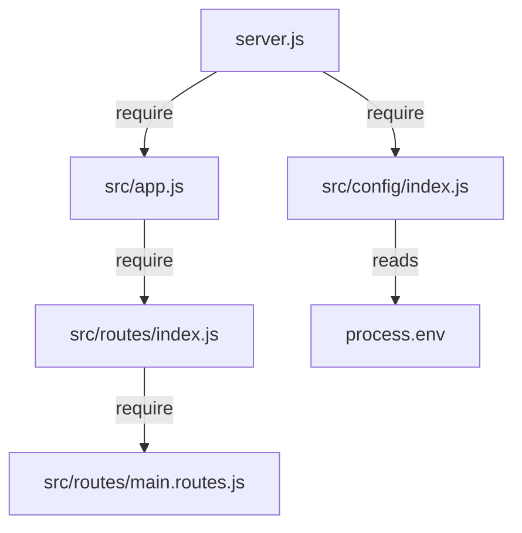
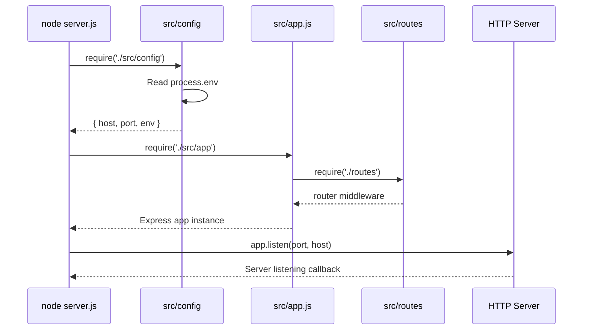

# hao-backprop-test

A Node.js tutorial server demonstrating Express.js integration with multiple HTTP endpoints.

> **Note**: This is a test project for backprop integration.

## Prerequisites

Before running this application, ensure you have the following installed:

| Requirement | Minimum Version | Recommended Version |
|-------------|-----------------|---------------------|
| Node.js | 18.x | 20.19.x (LTS) |
| npm | 8.x | 10.8.x |

### Verify Installation

```bash
node --version
# Expected: v20.x.x or higher

npm --version
# Expected: 10.x.x or higher
```

## Installation

1. Clone the repository:

```bash
git clone <repository-url>
cd hao-backprop-test
```

2. Install dependencies:

```bash
npm install
```

This will install Express.js (^5.1.0) and all required dependencies.

## Usage

### Start the Server

Run the server with default configuration:

```bash
npm start
```

**Expected output:**
```
Server running at http://127.0.0.1:3000/
```

### Custom Configuration

Override default settings using environment variables:

```bash
# Custom host and port
HOST=0.0.0.0 PORT=8080 npm start

# Production mode
NODE_ENV=production npm start

# Combined configuration
HOST=0.0.0.0 PORT=8080 NODE_ENV=production npm start
```

## API Reference

This server exposes two HTTP GET endpoints:

### GET `/`

Returns a greeting message.

**Request:**
```bash
curl -s http://127.0.0.1:3000/
```

**Response:**
- **Status Code:** 200 OK
- **Content-Type:** text/html; charset=utf-8
- **Body:** `Hello, World!\n` (14 characters, includes trailing newline)

**Example:**
```bash
curl -s http://127.0.0.1:3000/
# Output: Hello, World!
```

### GET `/evening`

Returns an evening greeting message.

**Request:**
```bash
curl -s http://127.0.0.1:3000/evening
```

**Response:**
- **Status Code:** 200 OK
- **Content-Type:** text/html; charset=utf-8
- **Body:** `Good evening` (12 characters, no trailing newline)

**Example:**
```bash
curl -s http://127.0.0.1:3000/evening
# Output: Good evening
```

### Health Check

Verify both endpoints are operational:

```bash
curl -s http://127.0.0.1:3000/ && echo " - Root OK"
curl -s http://127.0.0.1:3000/evening && echo " - Evening OK"
```

## Project Structure

```
hao-backprop-test/
├── server.js                    # Entry point - HTTP server binding
├── package.json                 # npm manifest and dependencies
├── package-lock.json            # Dependency lockfile
├── README.md                    # Project documentation (this file)
├── .gitignore                   # Git ignore patterns
├── jest.config.js               # Jest test framework configuration
├── src/                         # Application source root
│   ├── app.js                   # Express application factory
│   ├── config/                  # Configuration module
│   │   └── index.js             # Environment variable management
│   └── routes/                  # Routing surface
│       ├── index.js             # Route aggregator (barrel pattern)
│       └── main.routes.js       # Route handlers implementation
└── tests/                       # Test suite root
    ├── unit/                    # Isolated module tests
    │   ├── config.test.js       # Configuration module tests
    │   └── routes.test.js       # Route handler tests
    ├── integration/             # HTTP endpoint tests
    │   └── endpoints.test.js    # API endpoint contract tests
    └── lifecycle/               # Server lifecycle tests
        └── server.test.js       # Startup/shutdown tests
```

### File Descriptions

| File | Purpose |
|------|---------|
| `server.js` | Entry point that imports the Express app and binds it to the configured host/port |
| `src/app.js` | Express application factory - creates and exports configured Express app with mounted routes |
| `src/config/index.js` | Configuration module - exports `{ host, port, env }` from environment variables |
| `src/routes/index.js` | Route aggregator using barrel pattern - centralizes route exports |
| `src/routes/main.routes.js` | Route handlers - implements GET `/` and GET `/evening` endpoints |

## Environment Variables

The application supports the following environment variables for configuration:

| Variable | Default Value | Description |
|----------|---------------|-------------|
| `HOST` | `'127.0.0.1'` | Server binding address. Use `0.0.0.0` to accept connections from any interface. |
| `PORT` | `3000` | Server binding port number. |
| `NODE_ENV` | `'development'` | Application environment mode (`development`, `production`, `test`). |

### Configuration Examples

**Development (default):**
```bash
npm start
# Binds to http://127.0.0.1:3000/
```

**Production deployment:**
```bash
HOST=0.0.0.0 PORT=80 NODE_ENV=production npm start
# Binds to http://0.0.0.0:80/
```

**Custom port:**
```bash
PORT=8080 npm start
# Binds to http://127.0.0.1:8080/
```

## Architecture

This project follows a modular Express.js architecture with separation of concerns:

```
Request Flow:
Client → server.js → Express App (src/app.js) → Router (src/routes/) → Response
                           ↑
                     Configuration
                   (src/config/index.js)
```

### Design Patterns Used

- **Factory Pattern**: `src/app.js` exports a configured Express app without starting the server, enabling testability
- **Barrel Pattern**: `src/routes/index.js` aggregates route exports for clean imports
- **CommonJS Modules**: Uses `require`/`module.exports` for Node.js compatibility
- **Twelve-Factor App**: Configuration externalized to environment variables

## Deployment Guide

This section covers production deployment considerations for the Hello World Express server, including environment configuration, process management, and containerization.

### Production Environment Configuration

For production deployments, override the default development settings using environment variables. All configuration is managed through `src/config/index.js` following the Twelve-Factor App methodology.

| Variable | Default Value | Production Value | Description |
|----------|---------------|------------------|-------------|
| `HOST` | `'127.0.0.1'` | `'0.0.0.0'` | Bind to all network interfaces to accept external connections |
| `PORT` | `3000` | `80` or `8080` | Use a standard HTTP port or a port assigned by your infrastructure |
| `NODE_ENV` | `'development'` | `'production'` | Enables production optimizations in Express (view caching, less verbose errors) |

> **Important:** The default `HOST` value of `127.0.0.1` only accepts connections from the local machine. Set `HOST=0.0.0.0` in production to allow external traffic.

**Start the server with production settings:**

```bash
HOST=0.0.0.0 PORT=80 NODE_ENV=production node server.js
```

**Expected output:**
```
Server running at http://0.0.0.0:80/
```

> **Note:** Binding to port 80 requires elevated privileges on most systems. Consider using a reverse proxy (e.g., Nginx) in front of the application or binding to a higher port (e.g., 8080) instead.

*Source: `src/config/index.js` for default values and environment variable mapping.*

### Process Management

In production, the Node.js process should be managed by a process supervisor to handle restarts, logging, and monitoring. [PM2](https://pm2.keymetrics.io/) is a popular choice for Node.js applications.

**Install PM2 globally:**

```bash
npm install -g pm2
```

**Start the server with PM2:**

```bash
HOST=0.0.0.0 PORT=3000 NODE_ENV=production pm2 start server.js --name hello-world
```

**Common PM2 management commands:**

```bash
# Check process status
pm2 status

# View application logs
pm2 logs hello-world

# Restart the application
pm2 restart hello-world

# Stop the application
pm2 stop hello-world

# Remove the application from PM2
pm2 delete hello-world
```

**Systemd service file example (Linux):**

For deployments on Linux systems without PM2, create a systemd unit file at `/etc/systemd/system/hello-world.service`:

```ini
[Unit]
Description=Hello World Express Server
After=network.target

[Service]
Type=simple
User=node
WorkingDirectory=/opt/hello-world
Environment=HOST=0.0.0.0
Environment=PORT=3000
Environment=NODE_ENV=production
ExecStart=/usr/bin/node server.js
Restart=on-failure
RestartSec=10

[Install]
WantedBy=multi-user.target
```

**Enable and start the service:**

```bash
sudo systemctl enable hello-world
sudo systemctl start hello-world
sudo systemctl status hello-world
```

**Graceful shutdown considerations:** The server currently does not implement a custom graceful shutdown handler. For production deployments with long-lived connections, consider adding `SIGTERM`/`SIGINT` signal handlers to close the HTTP server gracefully before the process exits.

### Container Deployment

The application can be containerized using Docker for consistent deployment across environments.

**Dockerfile:**

```dockerfile
FROM node:20-alpine

WORKDIR /app

# Copy dependency manifests first (leverages Docker layer caching)
COPY package*.json ./

# Install production dependencies only
RUN npm ci --omit=dev

# Copy application source code
COPY . .

# Document the default port
EXPOSE 3000

# Set production environment variables
ENV HOST=0.0.0.0
ENV PORT=3000
ENV NODE_ENV=production

# Start the server
CMD ["node", "server.js"]
```

**Build and run the container:**

```bash
# Build the Docker image
docker build -t hello-world .

# Run the container, mapping port 3000
docker run -p 3000:3000 hello-world
```

**Override configuration at runtime:**

```bash
# Run on a custom port
docker run -p 8080:8080 -e PORT=8080 hello-world
```

**Verify the deployment with health checks:**

```bash
# Test the root endpoint
curl http://localhost:3000/
# Expected: Hello, World!

# Test the evening endpoint
curl http://localhost:3000/evening
# Expected: Good evening
```

## Code Walkthrough

This section provides an annotated explanation of each source module in the project, covering its purpose, design decisions, and how it fits into the overall architecture.

### server.js — Application Entry Point

The `server.js` file is the entry point for the application. Its sole responsibility is to import the fully configured Express application and bind it to a network interface so that it can accept HTTP connections.

**Key responsibilities:**

1. **Import the Express application** — `require('./src/app')` loads the pre-configured Express instance with all middleware and routes already mounted
2. **Import the configuration** — `require('./src/config')` loads environment-driven configuration values (`host`, `port`, `env`)
3. **Start the HTTP server** — `app.listen(config.port, config.host, callback)` binds the app to the configured network interface and logs a startup message when ready

```javascript
const app = require('./src/app');       // Pre-configured Express app
const config = require('./src/config'); // Environment configuration

app.listen(config.port, config.host, () => {
  console.log(`Server running at http://${config.host}:${config.port}/`);
});
```

By keeping `server.js` minimal, the Express application can be imported independently in tests (via `src/app.js`) without starting an actual HTTP server.

*Source: `server.js`*

**Module Dependency Graph:**


```mermaid
graph TD
    A[server.js] -->|require| B[src/app.js]
    A -->|require| C[src/config/index.js]
    B -->|require| D[src/routes/index.js]
    D -->|require| E[src/routes/main.routes.js]
    C -->|reads| F[process.env]
```

### src/app.js — Express Factory

The `src/app.js` module implements the **Factory Pattern** — it creates and exports a fully configured Express application instance without calling `listen()`.

**Why separate app creation from server binding?**

- **Testability:** Test suites (e.g., Supertest in `tests/integration/endpoints.test.js`) can `require('./src/app')` and send requests to the Express app without opening a real network port
- **Flexibility:** The same app instance can be used in different contexts (HTTP server, serverless function, test harness)

**Middleware pipeline:**

1. `express()` — Creates a new Express application instance
2. `app.use('/', mainRoutes)` — Mounts the main route handlers at the root path, preserving the original route paths (`GET /` and `GET /evening`)

```javascript
const express = require('express');
const { mainRoutes } = require('./routes');

const app = express();
app.use('/', mainRoutes);

module.exports = app;
```

*Source: `src/app.js`*

### src/config/index.js — Configuration Module

The configuration module follows the **Twelve-Factor App** methodology by externalizing all configuration to environment variables with sensible defaults for local development.

**Environment variable mapping:**

| Environment Variable | Config Property | Default Value | Type |
|---------------------|-----------------|---------------|------|
| `HOST` | `config.host` | `'127.0.0.1'` | `string` |
| `PORT` | `config.port` | `3000` | `number` (parsed with `parseInt`) |
| `NODE_ENV` | `config.env` | `'development'` | `string` |

```javascript
module.exports = {
  host: process.env.HOST || '127.0.0.1',
  port: parseInt(process.env.PORT, 10) || 3000,
  env: process.env.NODE_ENV || 'development'
};
```

**Design notes:**

- `PORT` is parsed with `parseInt(value, 10)` to convert the string environment variable to a number, with `3000` as the fallback if the variable is unset or non-numeric
- Node.js module caching ensures that `require('./src/config')` returns the **same object reference** across the entire application, so all consumers share identical configuration values

*Source: `src/config/index.js`*

### src/routes/ — Routing Layer

The routing layer is split into two files that work together: a barrel aggregator and the route handler definitions.

**`src/routes/index.js` — Route Aggregator (Barrel Pattern):**

This file uses the **Barrel Pattern** to centralize route exports. Instead of `src/app.js` importing each route file individually, it imports all routes with a single `require('./routes')` statement. As the application grows, new route modules can be added here without modifying `src/app.js`.

```javascript
const mainRoutes = require('./main.routes');

module.exports = {
  mainRoutes
};
```

**`src/routes/main.routes.js` — Route Handlers:**

This module creates an Express `Router` instance and registers two GET endpoint handlers:

| Endpoint | Response | Content-Type |
|----------|----------|-------------|
| `GET /` | `Hello, World!\n` (with trailing newline) | `text/html; charset=utf-8` |
| `GET /evening` | `Good evening` (no trailing newline) | `text/html; charset=utf-8` |

```javascript
const express = require('express');
const router = express.Router();

router.get('/', (req, res) => {
  res.send('Hello, World!\n');
});

router.get('/evening', (req, res) => {
  res.send('Good evening');
});

module.exports = router;
```

*Source: `src/routes/index.js`, `src/routes/main.routes.js`*

**Server Startup Sequence:**


```mermaid
sequenceDiagram
    participant CLI as node server.js
    participant Config as src/config
    participant App as src/app.js
    participant Routes as src/routes
    participant HTTP as HTTP Server

    CLI->>Config: require('./src/config')
    Config->>Config: Read process.env
    Config-->>CLI: { host, port, env }
    CLI->>App: require('./src/app')
    App->>Routes: require('./routes')
    Routes-->>App: router middleware
    App-->>CLI: Express app instance
    CLI->>HTTP: app.listen(port, host)
    HTTP-->>CLI: Server listening callback
```

## Dependencies

### Runtime Dependencies

| Package | Version | Purpose |
|---------|---------|---------|
| `express` | ^5.1.0 | Web framework providing HTTP handling, routing, and middleware |

### Dependency Installation

```bash
# Install all dependencies
npm install

# Verify express installation
npm ls express
# Expected: express@5.1.0
```

## Scripts

| Script | Command | Description |
|--------|---------|-------------|
| `start` | `node server.js` | Starts the HTTP server |
| `test` | `jest` | Run the complete test suite |
| `test:watch` | `jest --watch` | Run tests in watch mode for development |
| `test:coverage` | `jest --coverage` | Run tests and generate coverage report |
| `test:ci` | `jest --ci --coverage` | Run tests optimized for CI/CD environments |

## Testing

This project includes a comprehensive test suite built with **Jest 30.x** and **Supertest** for HTTP endpoint testing.

### Test Execution Commands

| Purpose | Command | Description |
|---------|---------|-------------|
| Run all tests | `npm test` | Execute the complete test suite |
| Watch mode | `npm run test:watch` | Re-run tests automatically on file changes |
| Coverage report | `npm run test:coverage` | Generate detailed code coverage metrics |
| CI execution | `npm run test:ci` | Optimized execution for CI/CD pipelines |
| Single file | `npx jest tests/unit/config.test.js` | Run a specific test file |
| Pattern match | `npx jest --testPathPatterns="config"` | Run tests matching a pattern |

### Test Structure

The test suite is organized into three categories based on test scope:

```
tests/
├── unit/                    # Isolated module tests
│   ├── config.test.js       # Configuration defaults and parsing
│   └── routes.test.js       # Route handler exports verification
├── integration/             # HTTP endpoint tests
│   └── endpoints.test.js    # API contract tests using Supertest
└── lifecycle/               # Server lifecycle tests
    └── server.test.js       # Startup and shutdown behavior
```

| Directory | Purpose | Test Approach |
|-----------|---------|---------------|
| `tests/unit/` | Test isolated modules without HTTP | Direct module imports with Jest assertions |
| `tests/integration/` | Test HTTP endpoint responses | Supertest requests against the Express app |
| `tests/lifecycle/` | Test server startup/shutdown | Mock-based lifecycle verification |

### Coverage Targets

The project enforces the following code coverage thresholds:

| Coverage Metric | Target | Description |
|-----------------|--------|-------------|
| Line Coverage | ≥ 80% | Percentage of code lines executed by tests |
| Branch Coverage | ≥ 75% | Percentage of conditional branches tested |
| Function Coverage | ≥ 90% | Percentage of functions called by tests |
| Statement Coverage | ≥ 80% | Percentage of statements executed by tests |

**Generate and view coverage report:**
```bash
npm run test:coverage
# Coverage report generated in ./coverage/
# Open ./coverage/lcov-report/index.html for detailed HTML report
```

### Test Dependencies

| Package | Version | Purpose |
|---------|---------|---------|
| `jest` | ^30.2.0 | JavaScript testing framework and test runner |
| `supertest` | ^7.1.4 | HTTP assertion library for Express endpoint testing |

## Troubleshooting

### Common Issues

**Port already in use:**
```bash
# Error: listen EADDRINUSE: address already in use
# Solution: Use a different port
PORT=3001 npm start
```

**Permission denied on port 80:**
```bash
# Error: listen EACCES: permission denied
# Solution: Use a port above 1024 or run with elevated privileges
PORT=8080 npm start
```

**Module not found:**
```bash
# Error: Cannot find module 'express'
# Solution: Install dependencies
npm install
```

## License

This project is licensed under the MIT License.

## Author

hao-backprop-test contributors

---

*This is a tutorial project demonstrating Node.js server development with Express.js framework.*
