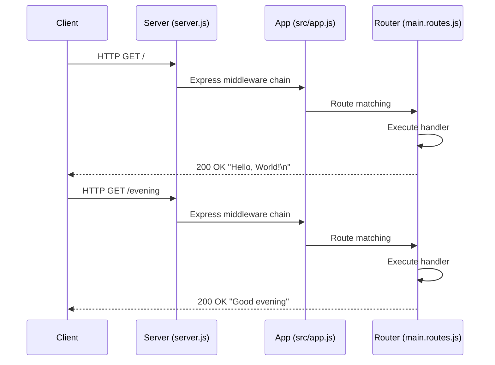
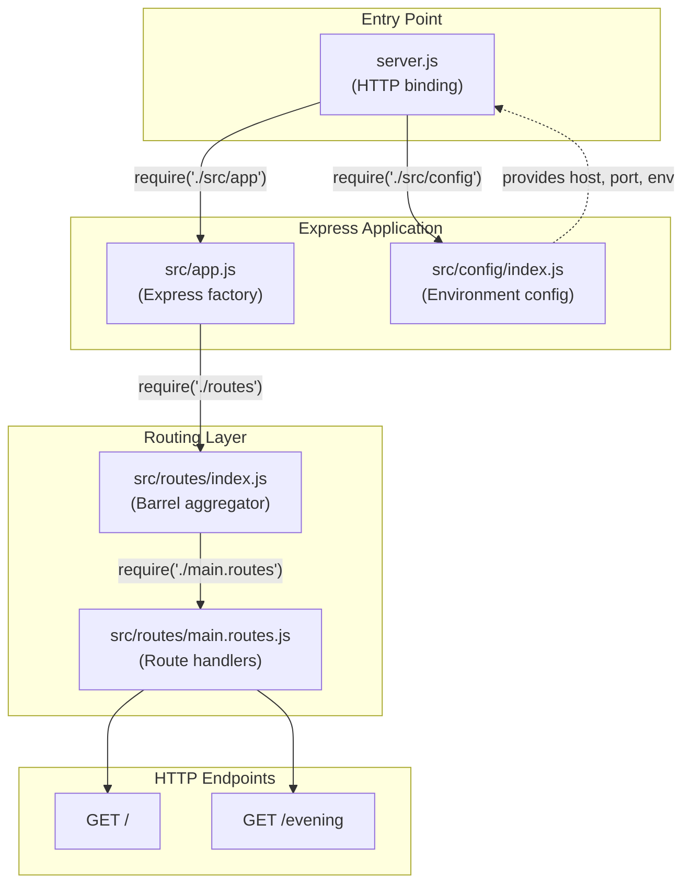
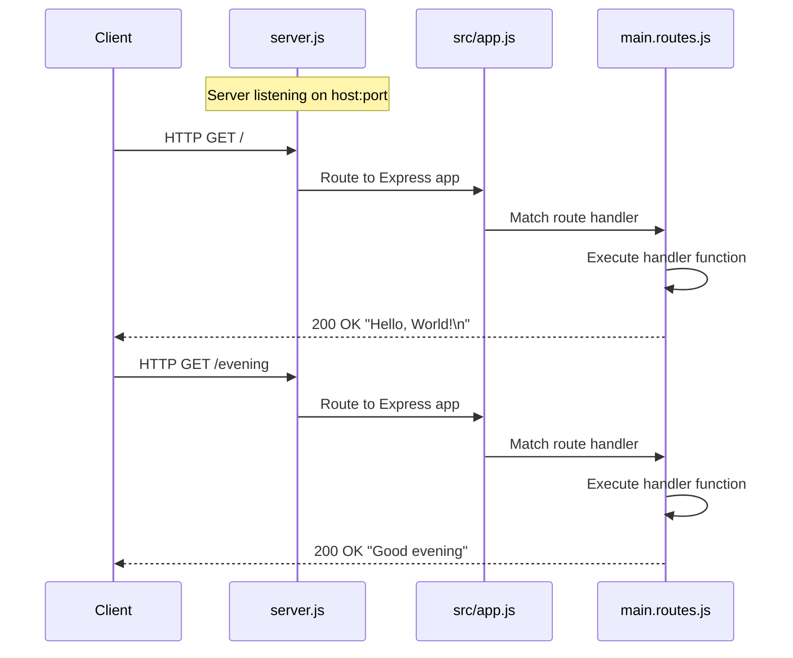

# hao-backprop-test

A Node.js tutorial server demonstrating Express.js integration with multiple HTTP endpoints.

> **Note**: This is a test project for backprop integration.

## Prerequisites

Before running this application, ensure you have the following installed:

| Requirement | Minimum Version | Recommended Version |
|-------------|-----------------|---------------------|
| Node.js | 18.x | 20.19.x (LTS) |
| npm | 8.x | 10.8.x |

### Verify Installation

```bash
node --version
# Expected: v20.x.x or higher

npm --version
# Expected: 10.x.x or higher
```

## Installation

1. Clone the repository:

```bash
git clone <repository-url>
cd hao-backprop-test
```

2. Install dependencies:

```bash
npm install
```

This will install Express.js (^5.1.0) and all required dependencies.

## Usage

### Start the Server

Run the server with default configuration:

```bash
npm start
```

**Expected output:**
```
Server running at http://127.0.0.1:3000/
```

### Custom Configuration

Override default settings using environment variables:

```bash
# Custom host and port
HOST=0.0.0.0 PORT=8080 npm start

# Production mode
NODE_ENV=production npm start

# Combined configuration
HOST=0.0.0.0 PORT=8080 NODE_ENV=production npm start
```

## API Reference

This server exposes two HTTP GET endpoints:

### Request Flow Overview


```mermaid
sequenceDiagram
    participant C as Client
    participant S as Server (server.js)
    participant A as App (src/app.js)
    participant R as Router (main.routes.js)
    
    C->>S: HTTP GET /
    S->>A: Express middleware chain
    A->>R: Route matching
    R->>R: Execute handler
    R-->>C: 200 OK "Hello, World!\n"
    
    C->>S: HTTP GET /evening
    S->>A: Express middleware chain
    A->>R: Route matching
    R->>R: Execute handler
    R-->>C: 200 OK "Good evening"
```

### GET `/`

Returns a greeting message.

**Request:**
```bash
curl -s http://127.0.0.1:3000/
```

**Response:**
- **Status Code:** 200 OK
- **Content-Type:** text/html; charset=utf-8
- **Body:** `Hello, World!\n` (14 characters, includes trailing newline)

**Example:**
```bash
curl -s http://127.0.0.1:3000/
# Output: Hello, World!
```

### GET `/evening`

Returns an evening greeting message.

**Request:**
```bash
curl -s http://127.0.0.1:3000/evening
```

**Response:**
- **Status Code:** 200 OK
- **Content-Type:** text/html; charset=utf-8
- **Body:** `Good evening` (12 characters, no trailing newline)

**Example:**
```bash
curl -s http://127.0.0.1:3000/evening
# Output: Good evening
```

### Health Check

Verify both endpoints are operational:

```bash
curl -s http://127.0.0.1:3000/ && echo " - Root OK"
curl -s http://127.0.0.1:3000/evening && echo " - Evening OK"
```

## Project Structure

```
hao-backprop-test/
├── server.js                    # Entry point - HTTP server binding
├── package.json                 # npm manifest and dependencies
├── package-lock.json            # Dependency lockfile
├── README.md                    # Project documentation (this file)
├── .gitignore                   # Git ignore patterns
└── src/                         # Application source root
    ├── app.js                   # Express application factory
    ├── config/                  # Configuration module
    │   └── index.js             # Environment variable management
    └── routes/                  # Routing surface
        ├── index.js             # Route aggregator (barrel pattern)
        └── main.routes.js       # Route handlers implementation
```

### File Descriptions

| File | Purpose |
|------|---------|
| `server.js` | Entry point that imports the Express app and binds it to the configured host/port |
| `src/app.js` | Express application factory - creates and exports configured Express app with mounted routes |
| `src/config/index.js` | Configuration module - exports `{ host, port, env }` from environment variables |
| `src/routes/index.js` | Route aggregator using barrel pattern - centralizes route exports |
| `src/routes/main.routes.js` | Route handlers - implements GET `/` and GET `/evening` endpoints |

## Environment Variables

The application supports the following environment variables for configuration:

| Variable | Default Value | Description |
|----------|---------------|-------------|
| `HOST` | `'127.0.0.1'` | Server binding address. Use `0.0.0.0` to accept connections from any interface. |
| `PORT` | `3000` | Server binding port number. |
| `NODE_ENV` | `'development'` | Application environment mode (`development`, `production`, `test`). |

### Configuration Examples

**Development (default):**
```bash
npm start
# Binds to http://127.0.0.1:3000/
```

**Production deployment:**
```bash
HOST=0.0.0.0 PORT=80 NODE_ENV=production npm start
# Binds to http://0.0.0.0:80/
```

**Custom port:**
```bash
PORT=8080 npm start
# Binds to http://127.0.0.1:8080/
```

## Deployment Guide

This section provides comprehensive instructions for deploying the application to production environments.

### Production Configuration

Configure environment variables appropriately for production:

| Variable | Development | Production | Notes |
|----------|-------------|------------|-------|
| `HOST` | `127.0.0.1` | `0.0.0.0` | Bind to all interfaces in production for external access |
| `PORT` | `3000` | `80` or `3000` | Use port 80 directly or proxy from nginx |
| `NODE_ENV` | `development` | `production` | Enables production optimizations in Express |

**Production startup command:**
```bash
HOST=0.0.0.0 PORT=3000 NODE_ENV=production node server.js
```

### Process Management

For production deployments, use a process manager to ensure uptime and automatic restarts.

#### PM2 (Recommended)

PM2 provides process management, monitoring, and log aggregation.

**Installation:**
```bash
npm install -g pm2
```

**Ecosystem configuration file (`ecosystem.config.js`):**
```javascript
module.exports = {
  apps: [{
    name: 'hao-backprop-test',
    script: 'server.js',
    instances: 'max',          // Use all CPU cores
    exec_mode: 'cluster',      // Enable cluster mode
    env: {
      NODE_ENV: 'development',
      HOST: '127.0.0.1',
      PORT: 3000
    },
    env_production: {
      NODE_ENV: 'production',
      HOST: '0.0.0.0',
      PORT: 3000
    }
  }]
};
```

**PM2 commands:**
```bash
# Start application
pm2 start ecosystem.config.js --env production

# Monitor processes
pm2 monit

# View logs
pm2 logs hao-backprop-test

# Restart application
pm2 restart hao-backprop-test

# Stop application
pm2 stop hao-backprop-test

# Enable startup script (auto-start on reboot)
pm2 startup
pm2 save
```

#### systemd Service

For Linux systems using systemd, create a service unit file.

**Service file (`/etc/systemd/system/hao-backprop-test.service`):**
```ini
[Unit]
Description=hao-backprop-test Node.js Server
Documentation=https://github.com/your-repo/hao-backprop-test
After=network.target

[Service]
Type=simple
User=nodejs
WorkingDirectory=/opt/hao-backprop-test
ExecStart=/usr/bin/node server.js
Restart=on-failure
RestartSec=10
StandardOutput=syslog
StandardError=syslog
SyslogIdentifier=hao-backprop-test
Environment=NODE_ENV=production
Environment=HOST=0.0.0.0
Environment=PORT=3000

[Install]
WantedBy=multi-user.target
```

**systemd commands:**
```bash
# Reload systemd daemon
sudo systemctl daemon-reload

# Enable service (start on boot)
sudo systemctl enable hao-backprop-test

# Start service
sudo systemctl start hao-backprop-test

# Check status
sudo systemctl status hao-backprop-test

# View logs
sudo journalctl -u hao-backprop-test -f
```

### Docker Deployment

Containerize the application for consistent deployments across environments.

#### Dockerfile

**`Dockerfile`:**
```dockerfile
# Use official Node.js LTS image
FROM node:20-alpine

# Set working directory
WORKDIR /app

# Copy package files first (layer caching optimization)
COPY package*.json ./

# Install production dependencies only
RUN npm ci --only=production

# Copy application source
COPY server.js ./
COPY src/ ./src/

# Create non-root user for security
RUN addgroup -g 1001 -S nodejs && \
    adduser -S nodejs -u 1001

# Switch to non-root user
USER nodejs

# Expose application port
EXPOSE 3000

# Set production environment
ENV NODE_ENV=production
ENV HOST=0.0.0.0
ENV PORT=3000

# Health check
HEALTHCHECK --interval=30s --timeout=3s --start-period=5s --retries=3 \
  CMD wget --no-verbose --tries=1 --spider http://localhost:3000/ || exit 1

# Start application
CMD ["node", "server.js"]
```

#### docker-compose.yml

**`docker-compose.yml`:**
```yaml
version: '3.8'

services:
  app:
    build:
      context: .
      dockerfile: Dockerfile
    container_name: hao-backprop-test
    restart: unless-stopped
    ports:
      - "3000:3000"
    environment:
      - NODE_ENV=production
      - HOST=0.0.0.0
      - PORT=3000
    healthcheck:
      test: ["CMD", "wget", "--no-verbose", "--tries=1", "--spider", "http://localhost:3000/"]
      interval: 30s
      timeout: 3s
      retries: 3
      start_period: 5s
    logging:
      driver: "json-file"
      options:
        max-size: "10m"
        max-file: "3"
```

#### Docker Commands

```bash
# Build image
docker build -t hao-backprop-test:latest .

# Run container
docker run -d \
  --name hao-backprop-test \
  -p 3000:3000 \
  -e NODE_ENV=production \
  --restart unless-stopped \
  hao-backprop-test:latest

# Using docker-compose
docker-compose up -d

# View logs
docker logs -f hao-backprop-test

# Check container health
docker inspect --format='{{.State.Health.Status}}' hao-backprop-test

# Stop container
docker stop hao-backprop-test

# Remove container
docker rm hao-backprop-test
```

### Reverse Proxy Setup

Use nginx as a reverse proxy for SSL termination, load balancing, and static file serving.

#### nginx Configuration

**Server block (`/etc/nginx/sites-available/hao-backprop-test`):**
```nginx
# Upstream configuration for Node.js app
upstream hao_backprop_app {
    server 127.0.0.1:3000;
    keepalive 64;
}

# HTTP server - redirect to HTTPS
server {
    listen 80;
    listen [::]:80;
    server_name your-domain.com;
    
    # Redirect all HTTP to HTTPS
    return 301 https://$server_name$request_uri;
}

# HTTPS server
server {
    listen 443 ssl http2;
    listen [::]:443 ssl http2;
    server_name your-domain.com;

    # SSL certificates (use Let's Encrypt or your certificate provider)
    ssl_certificate /etc/letsencrypt/live/your-domain.com/fullchain.pem;
    ssl_certificate_key /etc/letsencrypt/live/your-domain.com/privkey.pem;

    # SSL security settings
    ssl_protocols TLSv1.2 TLSv1.3;
    ssl_prefer_server_ciphers on;
    ssl_ciphers ECDHE-ECDSA-AES128-GCM-SHA256:ECDHE-RSA-AES128-GCM-SHA256;

    # Security headers
    add_header X-Frame-Options DENY;
    add_header X-Content-Type-Options nosniff;
    add_header X-XSS-Protection "1; mode=block";

    # Logging
    access_log /var/log/nginx/hao-backprop-test.access.log;
    error_log /var/log/nginx/hao-backprop-test.error.log;

    # Proxy settings
    location / {
        proxy_pass http://hao_backprop_app;
        proxy_http_version 1.1;
        proxy_set_header Upgrade $http_upgrade;
        proxy_set_header Connection 'upgrade';
        proxy_set_header Host $host;
        proxy_set_header X-Real-IP $remote_addr;
        proxy_set_header X-Forwarded-For $proxy_add_x_forwarded_for;
        proxy_set_header X-Forwarded-Proto $scheme;
        proxy_cache_bypass $http_upgrade;
        proxy_read_timeout 60s;
        proxy_connect_timeout 60s;
    }
}
```

#### nginx Commands

```bash
# Test configuration
sudo nginx -t

# Enable site
sudo ln -s /etc/nginx/sites-available/hao-backprop-test /etc/nginx/sites-enabled/

# Reload nginx
sudo systemctl reload nginx

# Check nginx status
sudo systemctl status nginx
```

### Health Checks

Implement health monitoring for production deployments.

#### Endpoint Verification

```bash
# Basic health check
curl -s -o /dev/null -w "%{http_code}" http://127.0.0.1:3000/
# Expected: 200

# Full endpoint verification
curl -s http://127.0.0.1:3000/ | grep -q "Hello, World!" && echo "Root: OK" || echo "Root: FAIL"
curl -s http://127.0.0.1:3000/evening | grep -q "Good evening" && echo "Evening: OK" || echo "Evening: FAIL"
```

#### Monitoring Script

**`healthcheck.sh`:**
```bash
#!/bin/bash

HOST="${1:-127.0.0.1}"
PORT="${2:-3000}"
BASE_URL="http://${HOST}:${PORT}"

# Check root endpoint
ROOT_STATUS=$(curl -s -o /dev/null -w "%{http_code}" "${BASE_URL}/")
EVENING_STATUS=$(curl -s -o /dev/null -w "%{http_code}" "${BASE_URL}/evening")

if [ "$ROOT_STATUS" = "200" ] && [ "$EVENING_STATUS" = "200" ]; then
    echo "Health check passed: All endpoints responding"
    exit 0
else
    echo "Health check failed: Root=${ROOT_STATUS}, Evening=${EVENING_STATUS}"
    exit 1
fi
```

#### Usage

```bash
# Make executable
chmod +x healthcheck.sh

# Run health check (default: localhost:3000)
./healthcheck.sh

# Run health check with custom host/port
./healthcheck.sh 0.0.0.0 8080
```

## Architecture

This project follows a modular Express.js architecture with separation of concerns:

```
Request Flow:
Client → server.js → Express App (src/app.js) → Router (src/routes/) → Response
                           ↑
                     Configuration
                   (src/config/index.js)
```

### Module Dependency Diagram

The following diagram illustrates the import relationships between modules:


```mermaid
flowchart TB
    subgraph Entry["Entry Point"]
        SERVER["server.js<br/>(HTTP binding)"]
    end
    
    subgraph Application["Express Application"]
        APP["src/app.js<br/>(Express factory)"]
        CONFIG["src/config/index.js<br/>(Environment config)"]
    end
    
    subgraph Routing["Routing Layer"]
        ROUTES_IDX["src/routes/index.js<br/>(Barrel aggregator)"]
        ROUTES_MAIN["src/routes/main.routes.js<br/>(Route handlers)"]
    end
    
    subgraph Endpoints["HTTP Endpoints"]
        ROOT["GET /"]
        EVENING["GET /evening"]
    end
    
    SERVER -->|"require('./src/app')"| APP
    SERVER -->|"require('./src/config')"| CONFIG
    APP -->|"require('./routes')"| ROUTES_IDX
    ROUTES_IDX -->|"require('./main.routes')"| ROUTES_MAIN
    ROUTES_MAIN --> ROOT
    ROUTES_MAIN --> EVENING
    CONFIG -.->|"provides host, port, env"| SERVER
```

### Request Flow Sequence

The following sequence diagram shows how an HTTP request is processed:


```mermaid
sequenceDiagram
    participant Client
    participant Server as server.js
    participant App as src/app.js
    participant Router as main.routes.js
    
    Note over Server: Server listening on host:port
    
    Client->>Server: HTTP GET /
    Server->>App: Route to Express app
    App->>Router: Match route handler
    Router->>Router: Execute handler function
    Router-->>Client: 200 OK "Hello, World!\n"
    
    Client->>Server: HTTP GET /evening
    Server->>App: Route to Express app
    App->>Router: Match route handler
    Router->>Router: Execute handler function
    Router-->>Client: 200 OK "Good evening"
```

### Design Patterns Used

- **Factory Pattern**: `src/app.js` exports a configured Express app without starting the server, enabling testability
- **Barrel Pattern**: `src/routes/index.js` aggregates route exports for clean imports
- **CommonJS Modules**: Uses `require`/`module.exports` for Node.js compatibility
- **Twelve-Factor App**: Configuration externalized to environment variables ([12factor.net](https://12factor.net/config))

## Dependencies

### Runtime Dependencies

| Package | Version | Purpose |
|---------|---------|---------|
| `express` | ^5.1.0 | Web framework providing HTTP handling, routing, and middleware |

### Dependency Installation

```bash
# Install all dependencies
npm install

# Verify express installation
npm ls express
# Expected: express@5.1.0
```

## Scripts

| Script | Command | Description |
|--------|---------|-------------|
| `start` | `node server.js` | Starts the HTTP server |
| `docs` | `jsdoc -c jsdoc.json` | Generates JSDoc API documentation |
| `docs:serve` | `npx serve docs/api` | Serves generated documentation locally |

### Documentation Generation

Generate API documentation from JSDoc comments:

```bash
# Generate HTML documentation
npm run docs
# Output: docs/api/

# Serve documentation locally (default port 3000, use different port if server running)
npm run docs:serve -- -p 8080
# Opens at http://localhost:8080/
```

> **Note:** Documentation generation requires JSDoc as a dev dependency. Install with `npm install --save-dev jsdoc` if not present.

## Troubleshooting

### Common Issues

**Port already in use:**
```bash
# Error: listen EADDRINUSE: address already in use
# Solution: Use a different port
PORT=3001 npm start
```

**Permission denied on port 80:**
```bash
# Error: listen EACCES: permission denied
# Solution: Use a port above 1024 or run with elevated privileges
PORT=8080 npm start
```

**Module not found:**
```bash
# Error: Cannot find module 'express'
# Solution: Install dependencies
npm install
```

### Deployment Issues

**Docker container not starting:**
```bash
# Error: Container exits immediately
# Diagnosis: Check container logs
docker logs <container_name>

# Solution: Ensure correct working directory and dependencies
docker exec -it <container_name> npm ls
```

**PM2 process crashes on startup:**
```bash
# Error: Process keeps restarting
# Diagnosis: Check PM2 logs
pm2 logs hao-backprop-test

# Solution: Verify environment variables are set
pm2 env 0

# Alternative: Restart with explicit config
pm2 delete hao-backprop-test && pm2 start ecosystem.config.js
```

**Reverse proxy 502 Bad Gateway:**
```bash
# Error: nginx returns 502
# Diagnosis: Check if Node.js server is running
curl -s http://127.0.0.1:3000/ || echo "Server not responding"

# Solution: Verify server is bound to correct address
# Ensure HOST=0.0.0.0 or HOST=127.0.0.1 matches nginx upstream
```

**Health check failures:**
```bash
# Diagnosis: Test endpoints directly
curl -v http://127.0.0.1:3000/
curl -v http://127.0.0.1:3000/evening

# Check server process
ps aux | grep node
netstat -tlnp | grep 3000

# Verify network connectivity
nc -zv 127.0.0.1 3000
```

**SSL/TLS certificate issues:**
```bash
# Error: SSL handshake failed
# Diagnosis: Test certificate chain
openssl s_client -connect your-domain.com:443 -servername your-domain.com

# Solution: Verify nginx SSL configuration and certificate paths
nginx -t
```

## License

This project is licensed under the MIT License.

## Author

hao-backprop-test contributors

---

*This is a tutorial project demonstrating Node.js server development with Express.js framework.*
