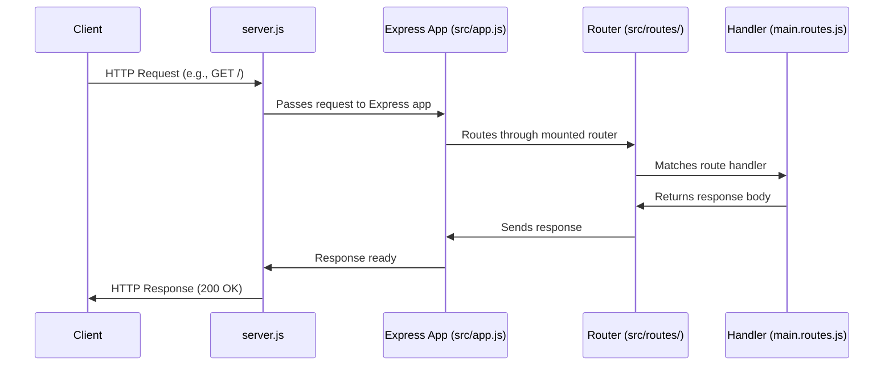
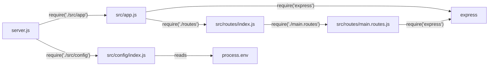

# hao-backprop-test

A Node.js tutorial server demonstrating Express.js integration with multiple HTTP endpoints.

> **Note**: This is a test project for backprop integration.

**📖 Documentation:** [API Documentation](docs/index.html) (generated via JSDoc) | [Deployment Guide](#deployment)

## Prerequisites

Before running this application, ensure you have the following installed:

| Requirement | Minimum Version | Recommended Version | Tested Version |
|-------------|-----------------|---------------------|----------------|
| Node.js | 18.x | 20.19.x (LTS) | 20.20.0 |
| npm | 8.x | 10.8.x | 10.8.x |

### Verify Installation

Run the following commands to confirm your environment is ready:

```bash
node --version
# Expected output: v20.20.0 (or any v18.x+ / v20.x+)

npm --version
# Expected output: 10.8.2 (or any 8.x+)
```

### Environment Verification Checklist

| Check | Command | Expected Result |
|-------|---------|-----------------|
| Node.js installed | `node --version` | `v18.x.x` or higher |
| npm installed | `npm --version` | `8.x.x` or higher |
| Node.js runtime works | `node -e "console.log('OK')"` | Prints `OK` |
| npm registry reachable | `npm ping` | `Ping success: {...}` |

### Platform-Specific Installation Notes

**macOS:**
```bash
# Using Homebrew (recommended)
brew install node@20

# Using nvm (Node Version Manager)
nvm install 20
nvm use 20
```

**Linux (Ubuntu/Debian):**
```bash
# Using NodeSource repository
curl -fsSL https://deb.nodesource.com/setup_20.x | sudo -E bash -
sudo apt-get install -y nodejs

# Using nvm
curl -o- https://raw.githubusercontent.com/nvm-sh/nvm/v0.40.1/install.sh | bash
nvm install 20
```

**Windows:**
- Download the LTS installer from [https://nodejs.org](https://nodejs.org)
- Alternatively, use [nvm-windows](https://github.com/coreybutler/nvm-windows) for version management
- Verify installation in PowerShell: `node --version` and `npm --version`

### Troubleshooting Version Issues

| Symptom | Cause | Solution |
|---------|-------|----------|
| `node: command not found` | Node.js not installed or not in PATH | Install Node.js or add its bin directory to your PATH |
| `npm ERR! engine` | Node.js version too old | Upgrade to Node.js 18.x or higher |
| `SyntaxError: Unexpected token` | Node.js version incompatible with ES features | Ensure Node.js >= 18.x is the active version |
| Multiple Node versions conflict | System Node conflicts with nvm-managed version | Run `nvm use 20` to switch to the correct version |

## Installation

1. Clone the repository:

```bash
git clone <repository-url>
cd hao-backprop-test
```

2. Install dependencies:

```bash
npm install
```

This will install Express.js (^5.1.0) and all required dependencies.

3. Verify installation:

```bash
npm ls express
```

**Expected output:**
```
hello_world@1.0.0
└── express@5.1.0
```

If `express` does not appear or shows an error, run `npm install` again and check for network or permission issues.

## Usage

### Start the Server

Run the server with default configuration:

```bash
npm start
```

**Expected output:**
```
Server running at http://127.0.0.1:3000/
```

### Custom Configuration

Override default settings using environment variables:

```bash
# Custom host and port
HOST=0.0.0.0 PORT=8080 npm start

# Production mode
NODE_ENV=production npm start

# Combined configuration
HOST=0.0.0.0 PORT=8080 NODE_ENV=production npm start
```

## API Reference

This server exposes two HTTP GET endpoints. All other routes and HTTP methods return a 404 response.

### Request Processing Flow


```mermaid
sequenceDiagram
    participant C as Client
    participant S as server.js
    participant A as Express App (src/app.js)
    participant R as Router (src/routes/)
    participant H as Handler (main.routes.js)

    C->>S: HTTP Request (e.g., GET /)
    S->>A: Passes request to Express app
    A->>R: Routes through mounted router
    R->>H: Matches route handler
    H->>R: Returns response body
    R->>A: Sends response
    A->>S: Response ready
    S->>C: HTTP Response (200 OK)
```

### Endpoint Summary

| HTTP Method | Path | Status Code | Content-Type | Response Body | Body Length |
|-------------|------|-------------|--------------|---------------|-------------|
| `GET` | `/` | 200 | `text/html; charset=utf-8` | `Hello, World!\n` | 14 characters |
| `GET` | `/evening` | 200 | `text/html; charset=utf-8` | `Good evening` | 12 characters |
| `GET` | `/nonexistent` | 404 | varies | Error page | varies |
| `POST` | `/` | 404 | varies | Error page | varies |
| `PUT` | `/evening` | 404 | varies | Error page | varies |
| `DELETE` | `/` | 404 | varies | Error page | varies |

### GET `/`

Returns a greeting message.

**Request:**
```bash
curl -s http://127.0.0.1:3000/
```

**Response:**
- **Status Code:** 200 OK
- **Content-Type:** text/html; charset=utf-8
- **Body:** `Hello, World!\n` (14 characters, includes trailing newline)

**Response Headers:**

| Header | Value | Description |
|--------|-------|-------------|
| `Content-Type` | `text/html; charset=utf-8` | Response media type and encoding |
| `Content-Length` | `14` | Response body size in bytes |
| `X-Powered-By` | `Express` | Framework identifier (default Express header) |

**Example:**
```bash
curl -s http://127.0.0.1:3000/
# Output: Hello, World!
```

### GET `/evening`

Returns an evening greeting message.

**Request:**
```bash
curl -s http://127.0.0.1:3000/evening
```

**Response:**
- **Status Code:** 200 OK
- **Content-Type:** text/html; charset=utf-8
- **Body:** `Good evening` (12 characters, no trailing newline)

**Response Headers:**

| Header | Value | Description |
|--------|-------|-------------|
| `Content-Type` | `text/html; charset=utf-8` | Response media type and encoding |
| `Content-Length` | `12` | Response body size in bytes |
| `X-Powered-By` | `Express` | Framework identifier (default Express header) |

**Example:**
```bash
curl -s http://127.0.0.1:3000/evening
# Output: Good evening
```

### Error Responses

Accessing undefined routes or using unsupported HTTP methods returns a **404 Not Found** response.

**Undefined route example:**
```bash
curl -s -o /dev/null -w '%{http_code}' http://127.0.0.1:3000/nonexistent
# Output: 404
```

**Unsupported HTTP method example:**
```bash
curl -s -X POST http://127.0.0.1:3000/
# Returns: 404 Not Found
```

**Error scenarios verified by the test suite:**

| Scenario | Request | Expected Status |
|----------|---------|-----------------|
| Undefined route | `GET /invalid` | 404 |
| POST on root | `POST /` | 404 |
| PUT on evening | `PUT /evening` | 404 |
| DELETE on root | `DELETE /` | 404 |

### Query Parameter Behavior

Query parameters are silently ignored on both endpoints. The response body remains unchanged regardless of any query string provided.

```bash
# Query parameters do not affect the response
curl -s "http://127.0.0.1:3000/?param=value"
# Output: Hello, World!

curl -s "http://127.0.0.1:3000/evening?time=late"
# Output: Good evening

curl -s "http://127.0.0.1:3000/?foo=bar&baz=qux"
# Output: Hello, World!
```

### Health Check

Verify both endpoints are operational:

```bash
curl -s http://127.0.0.1:3000/ && echo " - Root OK"
curl -s http://127.0.0.1:3000/evening && echo " - Evening OK"
```

## Project Structure

```
hao-backprop-test/
├── server.js                    # Entry point - HTTP server binding
├── package.json                 # npm manifest and dependencies
├── package-lock.json            # Dependency lockfile
├── README.md                    # Project documentation (this file)
├── .gitignore                   # Git ignore patterns
├── jest.config.js               # Jest test framework configuration
├── jsdoc.json                   # JSDoc generator configuration
├── docs/                        # Generated JSDoc HTML documentation (gitignored)
├── src/                         # Application source root
│   ├── app.js                   # Express application factory
│   ├── config/                  # Configuration module
│   │   └── index.js             # Environment variable management
│   └── routes/                  # Routing surface
│       ├── index.js             # Route aggregator (barrel pattern)
│       └── main.routes.js       # Route handlers implementation
└── tests/                       # Test suite root
    ├── unit/                    # Isolated module tests
    │   ├── config.test.js       # Configuration module tests
    │   └── routes.test.js       # Route handler tests
    ├── integration/             # HTTP endpoint tests
    │   └── endpoints.test.js    # API endpoint contract tests
    └── lifecycle/               # Server lifecycle tests
        └── server.test.js       # Startup/shutdown tests
```

### File Descriptions

| File | Purpose |
|------|---------|
| `server.js` | Entry point that imports the Express app and binds it to the configured host/port |
| `src/app.js` | Express application factory - creates and exports configured Express app with mounted routes |
| `src/config/index.js` | Configuration module - exports `{ host, port, env }` from environment variables |
| `src/routes/index.js` | Route aggregator using barrel pattern - centralizes route exports |
| `src/routes/main.routes.js` | Route handlers - implements GET `/` and GET `/evening` endpoints |

## Environment Variables

The application supports the following environment variables for configuration:

| Variable | Default Value | Description |
|----------|---------------|-------------|
| `HOST` | `'127.0.0.1'` | Server binding address. Use `0.0.0.0` to accept connections from any interface. |
| `PORT` | `3000` | Server binding port number. |
| `NODE_ENV` | `'development'` | Application environment mode (`development`, `production`, `test`). |

### Configuration Examples

**Development (default):**
```bash
npm start
# Binds to http://127.0.0.1:3000/
```

**Production deployment:**
```bash
HOST=0.0.0.0 PORT=80 NODE_ENV=production npm start
# Binds to http://0.0.0.0:80/
```

**Custom port:**
```bash
PORT=8080 npm start
# Binds to http://127.0.0.1:8080/
```

## Architecture

This project follows a modular Express.js architecture with separation of concerns:

```
Request Flow:
Client → server.js → Express App (src/app.js) → Router (src/routes/) → Response
                           ↑
                     Configuration
                   (src/config/index.js)
```

### Module Dependency Graph


```mermaid
flowchart LR
    A[server.js] -->|"require('./src/app')"| B[src/app.js]
    A -->|"require('./src/config')"| C[src/config/index.js]
    B -->|"require('express')"| D[express]
    B -->|"require('./routes')"| E[src/routes/index.js]
    E -->|"require('./main.routes')"| F[src/routes/main.routes.js]
    F -->|"require('express')"| D
    C -->|reads| G[process.env]
```

**Dependency relationships:**
- `server.js` is the entry point that imports both the Express app and configuration
- `src/app.js` creates the Express application and mounts routes from the route aggregator
- `src/config/index.js` reads environment variables (`HOST`, `PORT`, `NODE_ENV`) with sensible defaults
- `src/routes/index.js` acts as a barrel that re-exports all route modules
- `src/routes/main.routes.js` defines the GET `/` and GET `/evening` route handlers

### Design Patterns Used

- **Factory Pattern**: `src/app.js` exports a configured Express app without starting the server, enabling testability
- **Barrel Pattern**: `src/routes/index.js` aggregates route exports for clean imports
- **CommonJS Modules**: Uses `require`/`module.exports` for Node.js compatibility
- **Twelve-Factor App**: Configuration externalized to environment variables

## Dependencies

### Runtime Dependencies

| Package | Version | Purpose |
|---------|---------|---------|
| `express` | ^5.1.0 | Web framework providing HTTP handling, routing, and middleware |

### Dependency Installation

```bash
# Install all dependencies
npm install

# Verify express installation
npm ls express
# Expected: express@5.1.0
```

## Scripts

| Script | Command | Description |
|--------|---------|-------------|
| `start` | `node server.js` | Starts the HTTP server |
| `test` | `jest` | Run the complete test suite |
| `test:watch` | `jest --watch` | Run tests in watch mode for development |
| `test:coverage` | `jest --coverage` | Run tests and generate coverage report |
| `test:ci` | `jest --ci --coverage` | Run tests optimized for CI/CD environments |

## Testing

This project includes a comprehensive test suite built with **Jest 30.x** and **Supertest** for HTTP endpoint testing.

### Test Execution Commands

| Purpose | Command | Description |
|---------|---------|-------------|
| Run all tests | `npm test` | Execute the complete test suite |
| Watch mode | `npm run test:watch` | Re-run tests automatically on file changes |
| Coverage report | `npm run test:coverage` | Generate detailed code coverage metrics |
| CI execution | `npm run test:ci` | Optimized execution for CI/CD pipelines |
| Single file | `npx jest tests/unit/config.test.js` | Run a specific test file |
| Pattern match | `npx jest --testPathPatterns="config"` | Run tests matching a pattern |

### Test Structure

The test suite is organized into three categories based on test scope:

```
tests/
├── unit/                    # Isolated module tests
│   ├── config.test.js       # Configuration defaults and parsing
│   └── routes.test.js       # Route handler exports verification
├── integration/             # HTTP endpoint tests
│   └── endpoints.test.js    # API contract tests using Supertest
└── lifecycle/               # Server lifecycle tests
    └── server.test.js       # Startup and shutdown behavior
```

| Directory | Purpose | Test Approach |
|-----------|---------|---------------|
| `tests/unit/` | Test isolated modules without HTTP | Direct module imports with Jest assertions |
| `tests/integration/` | Test HTTP endpoint responses | Supertest requests against the Express app |
| `tests/lifecycle/` | Test server startup/shutdown | Mock-based lifecycle verification |

### Coverage Targets

The project enforces the following code coverage thresholds:

| Coverage Metric | Target | Description |
|-----------------|--------|-------------|
| Line Coverage | ≥ 80% | Percentage of code lines executed by tests |
| Branch Coverage | ≥ 75% | Percentage of conditional branches tested |
| Function Coverage | ≥ 90% | Percentage of functions called by tests |
| Statement Coverage | ≥ 80% | Percentage of statements executed by tests |

**Generate and view coverage report:**
```bash
npm run test:coverage
# Coverage report generated in ./coverage/
# Open ./coverage/lcov-report/index.html for detailed HTML report
```

### Test Dependencies

| Package | Version | Purpose |
|---------|---------|---------|
| `jest` | ^30.2.0 | JavaScript testing framework and test runner |
| `supertest` | ^7.1.4 | HTTP assertion library for Express endpoint testing |

## Troubleshooting

### Common Issues

**Port already in use:**
```bash
# Error: listen EADDRINUSE: address already in use
# Solution: Use a different port
PORT=3001 npm start
```

**Permission denied on port 80:**
```bash
# Error: listen EACCES: permission denied
# Solution: Use a port above 1024 or run with elevated privileges
PORT=8080 npm start
```

**Module not found:**
```bash
# Error: Cannot find module 'express'
# Solution: Install dependencies
npm install
```

## Deployment

This section covers production deployment patterns for the hello_world server. While this is a tutorial application, these practices apply to production Express.js deployments.

### Production Environment Variables

Configure the following environment variables for production deployment:

| Variable | Production Value | Purpose |
|----------|-----------------|---------|
| `HOST` | `0.0.0.0` | Bind to all network interfaces to accept external connections |
| `PORT` | `80` or `443` | Standard HTTP/HTTPS ports (requires elevated privileges or reverse proxy) |
| `NODE_ENV` | `production` | Enables Express.js production optimizations (view caching, less verbose errors) |

**Example production startup:**
```bash
HOST=0.0.0.0 PORT=80 NODE_ENV=production node server.js
```

> **Note:** Setting `NODE_ENV=production` signals Express.js to enable production behaviors such as caching compiled view templates and reducing error detail in responses.

### Process Management

In production, use a process manager to keep the application running, handle restarts on failure, and manage log output.

#### PM2

[PM2](https://pm2.keymetrics.io/) is a popular Node.js process manager with built-in load balancing and monitoring.

**Quick start:**
```bash
# Install PM2 globally
npm install -g pm2

# Start the server with PM2
pm2 start server.js --name hello-world

# View running processes
pm2 list

# View logs
pm2 logs hello-world

# Restart the application
pm2 restart hello-world

# Stop the application
pm2 stop hello-world
```

**PM2 ecosystem configuration file (`ecosystem.config.js`):**
```javascript
'use strict';

module.exports = {
  apps: [{
    name: 'hello-world',
    script: 'server.js',
    instances: 1,
    env: {
      NODE_ENV: 'development',
      HOST: '127.0.0.1',
      PORT: 3000
    },
    env_production: {
      NODE_ENV: 'production',
      HOST: '0.0.0.0',
      PORT: 8080
    }
  }]
};
```

```bash
# Start with production environment
pm2 start ecosystem.config.js --env production
```

#### systemd (Linux)

For Linux server deployments, a systemd service unit provides automatic startup on boot and process supervision.

**Example service file (`/etc/systemd/system/hello-world.service`):**
```ini
[Unit]
Description=Hello World Node.js Server
After=network.target

[Service]
Type=simple
User=node
WorkingDirectory=/opt/hello-world
Environment=NODE_ENV=production
Environment=HOST=0.0.0.0
Environment=PORT=8080
ExecStart=/usr/bin/node server.js
Restart=on-failure
RestartSec=10

[Install]
WantedBy=multi-user.target
```

**Manage the service:**
```bash
# Reload systemd configuration after creating the service file
sudo systemctl daemon-reload

# Enable the service to start on boot
sudo systemctl enable hello-world

# Start the service
sudo systemctl start hello-world

# Check service status
sudo systemctl status hello-world

# View logs
sudo journalctl -u hello-world -f
```

### Reverse Proxy

In production, run the Node.js server behind a reverse proxy such as nginx. The reverse proxy handles SSL termination, static asset serving, and load balancing while forwarding application requests to the Node.js process.

**Example nginx configuration (`/etc/nginx/sites-available/hello-world`):**
```nginx
upstream nodejs_backend {
    server 127.0.0.1:8080;
}

server {
    listen 80;
    server_name example.com;

    location / {
        proxy_pass http://nodejs_backend;
        proxy_http_version 1.1;
        proxy_set_header Upgrade $http_upgrade;
        proxy_set_header Connection 'upgrade';
        proxy_set_header Host $host;
        proxy_set_header X-Real-IP $remote_addr;
        proxy_set_header X-Forwarded-For $proxy_add_x_forwarded_for;
        proxy_set_header X-Forwarded-Proto $scheme;
        proxy_cache_bypass $http_upgrade;
    }
}
```

```bash
# Enable the site and reload nginx
sudo ln -s /etc/nginx/sites-available/hello-world /etc/nginx/sites-enabled/
sudo nginx -t
sudo systemctl reload nginx
```

> **Tip:** When using a reverse proxy, set `HOST=127.0.0.1` so the Node.js server only accepts connections from the local machine, and let nginx handle external traffic on port 80/443.

### Docker Containerization

Containerizing the application ensures consistent deployment across environments.

**Example `Dockerfile`:**
```dockerfile
# Use the official Node.js 20 LTS image as the base
FROM node:20-alpine

# Set working directory inside the container
WORKDIR /app

# Copy dependency manifests first (leverages Docker layer caching)
COPY package.json package-lock.json ./

# Install production dependencies only
RUN npm ci --omit=dev

# Copy application source code
COPY server.js ./
COPY src/ ./src/

# Expose the application port
EXPOSE 3000

# Set production environment variables
ENV NODE_ENV=production
ENV HOST=0.0.0.0
ENV PORT=3000

# Start the server
CMD ["node", "server.js"]
```

**Build and run the container:**
```bash
# Build the Docker image
docker build -t hello-world:latest .

# Run the container
docker run -d -p 3000:3000 --name hello-world hello-world:latest

# View container logs
docker logs hello-world

# Stop the container
docker stop hello-world
```

### Health Checks

Implement health checks to monitor whether the server is running and responsive.

**curl-based health check:**
```bash
# Simple health check — returns exit code 0 if server responds with HTTP 200
curl -sf http://127.0.0.1:3000/ > /dev/null && echo "HEALTHY" || echo "UNHEALTHY"
```

**PM2 health check configuration (in `ecosystem.config.js`):**
```javascript
'use strict';

module.exports = {
  apps: [{
    name: 'hello-world',
    script: 'server.js',
    // PM2 will restart the app if it doesn't respond within 10 seconds
    listen_timeout: 10000,
    // Kill timeout for graceful shutdown
    kill_timeout: 5000
  }]
};
```

**Docker health check (add to `Dockerfile`):**
```dockerfile
HEALTHCHECK --interval=30s --timeout=5s --start-period=10s --retries=3 \
  CMD curl -sf http://127.0.0.1:3000/ || exit 1
```

**Monitoring checklist:**

| Check | Method | Frequency | Expected Result |
|-------|--------|-----------|-----------------|
| HTTP response | `curl -sf http://HOST:PORT/` | Every 30s | Exit code 0, HTTP 200 |
| Process running | `pm2 list` or `systemctl status` | Every 60s | Process status `online` |
| Port listening | `ss -tlnp \| grep :PORT` | On demand | Port bound and listening |
| Log errors | `pm2 logs --err` or `journalctl -u hello-world` | Continuous | No unhandled exceptions |

## License

This project is licensed under the MIT License.

## Author

hao-backprop-test contributors

---

*This is a tutorial project demonstrating Node.js server development with Express.js framework.*
