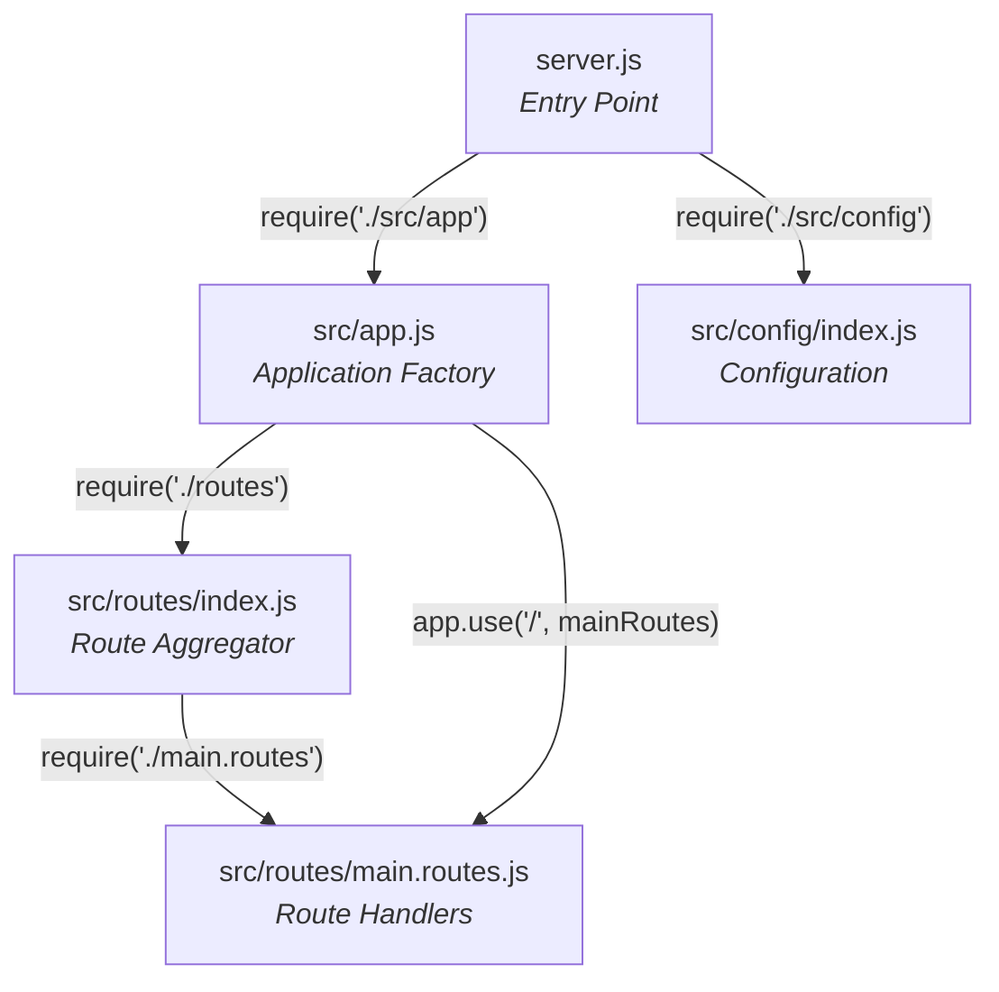
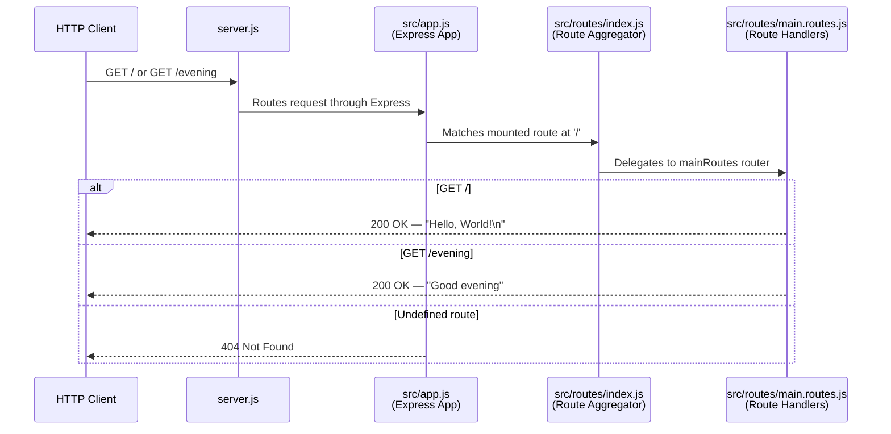
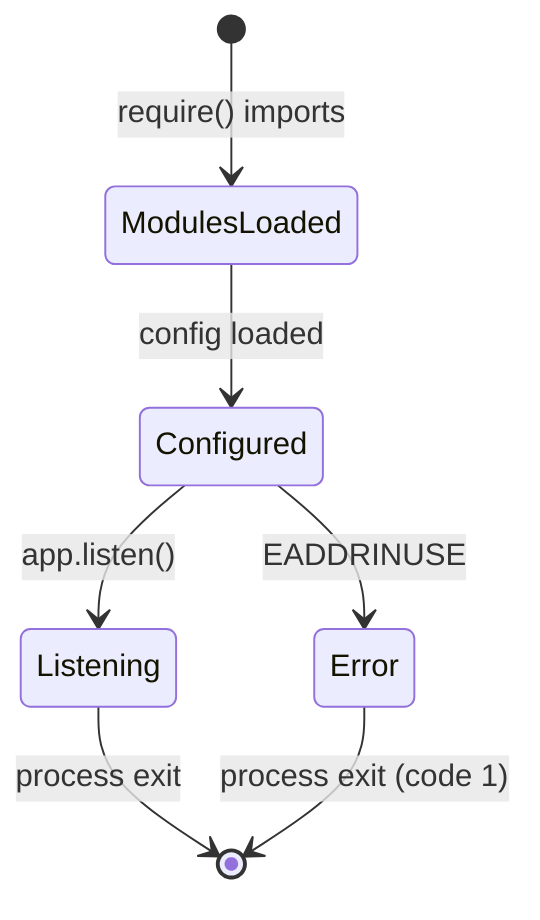

# hao-backprop-test


A Node.js tutorial server demonstrating Express.js integration with multiple HTTP endpoints.

> **Note**: This is a test project for backprop integration. It uses **Express 5.1.0** — the latest major version of Express, which differs from the widely-deployed Express 4.x series. See the [Prerequisites](#prerequisites) section for details.

## Table of Contents

- [Prerequisites](#prerequisites)
- [Installation](#installation)
- [Usage](#usage)
- [API Documentation](#api-documentation)
- [Code Explanations and Architecture](#code-explanations-and-architecture)
- [Environment Variables](#environment-variables)
- [Deployment Guide](#deployment-guide)
- [Testing](#testing)
- [Scripts Reference](#scripts-reference)
- [Project Structure](#project-structure)
- [Dependencies](#dependencies)
- [Troubleshooting](#troubleshooting)
- [Contributing](#contributing)
- [License](#license)

## Prerequisites

Before running this application, ensure you have the following installed:

| Requirement | Minimum Version | Recommended Version |
|-------------|-----------------|---------------------|
| Node.js | 18.x | 20.19.x (LTS) |
| npm | 8.x | 10.8.x |

<!-- Source: package.json engines field and dependencies -->

### Verify Installation

```bash
node --version
# Expected: v20.x.x or higher

npm --version
# Expected: 10.x.x or higher
```

### Express 5.1.0 Notice

This project uses **Express 5.1.0**, which is the latest major version of the Express framework. Express 5 includes several changes from the widely-deployed Express 4.x series that developers should be aware of:

- **Promise-based route handlers** — Express 5 automatically catches rejected promises in route handlers and forwards them to the error-handling middleware. *(Source: [Express 5.x documentation](https://expressjs.com/))*
- **Updated Router API** — `express.Router()` in Express 5 returns an enhanced router with improved path matching. *(Source: `src/routes/main.routes.js` line 17)*
- **`res.send()` behavior** — Response bodies sent via `res.send()` default to `Content-Type: text/html; charset=utf-8` for string arguments. *(Source: `src/routes/main.routes.js` lines 27, 38)*

If you are migrating from an Express 4.x project, consult the [Express 5.x migration guide](https://expressjs.com/en/guide/migrating-5.html) for a complete list of breaking changes.

## Installation

1. **Clone the repository:**

```bash
git clone <repository-url>
cd hao-backprop-test
```

2. **Install dependencies:**

```bash
npm install
```

This will install Express.js (^5.1.0) and all required dependencies. *(Source: `package.json` lines 15–16)*

3. **Verify installation:**

```bash
npm ls express
# Expected output: hello_world@1.0.0 └── express@5.1.0
```

4. **Configure environment (optional):**

The application runs with sensible defaults out of the box. To customize, set environment variables before starting:

```bash
# View default configuration values
# HOST=127.0.0.1  (Source: src/config/index.js line 26)
# PORT=3000       (Source: src/config/index.js line 33)
# NODE_ENV=development (Source: src/config/index.js line 40)

# Example: Override for local network access
export HOST=0.0.0.0
export PORT=8080
```

See the [Environment Variables](#environment-variables) section for the full configuration reference.

## Usage

### Start the Server

Run the server with default configuration:

```bash
npm start
```

**Expected output:**
```
Server running at http://127.0.0.1:3000/
```
*(Source: `server.js` line 51)*

### Custom Configuration

Override default settings using environment variables:

```bash
# Custom host and port
HOST=0.0.0.0 PORT=8080 npm start
# Expected output: Server running at http://0.0.0.0:8080/

# Production mode
NODE_ENV=production npm start
# Expected output: Server running at http://127.0.0.1:3000/

# Combined configuration
HOST=0.0.0.0 PORT=8080 NODE_ENV=production npm start
# Expected output: Server running at http://0.0.0.0:8080/
```

### Quick Verification

Once the server is running, verify the endpoints:

```bash
curl -s http://127.0.0.1:3000/ && echo " - Root OK"
curl -s http://127.0.0.1:3000/evening && echo " - Evening OK"
```

## API Documentation

This server exposes two HTTP GET endpoints defined in `src/routes/main.routes.js`. All endpoints return `text/html; charset=utf-8` content by default (Express 5.1.0 behavior for `res.send()` with string arguments).

### Endpoint Summary

| Method | Path | Status | Response Body | Content-Type |
|--------|------|--------|---------------|--------------|
| GET | `/` | 200 OK | `Hello, World!\n` | `text/html; charset=utf-8` |
| GET | `/evening` | 200 OK | `Good evening` | `text/html; charset=utf-8` |
| GET | `/<any other>` | 404 | Not Found | `text/html; charset=utf-8` |

### GET `/`

Returns a greeting message with a trailing newline character.

**Route definition:** `src/routes/main.routes.js` lines 26–28

**Request:**
```bash
curl -s http://127.0.0.1:3000/
```

**Response Specification:**

| Property | Value |
|----------|-------|
| Status Code | `200 OK` |
| Content-Type | `text/html; charset=utf-8` |
| Body | `Hello, World!\n` (14 characters, includes trailing newline) |
| Transfer-Encoding | `chunked` |

<!-- Source: src/routes/main.routes.js line 27: res.send('Hello, World!\n') -->

**Example with verbose output:**
```bash
curl -v http://127.0.0.1:3000/
```
```
> GET / HTTP/1.1
> Host: 127.0.0.1:3000
>
< HTTP/1.1 200 OK
< Content-Type: text/html; charset=utf-8
< Content-Length: 14
<
Hello, World!
```

### GET `/evening`

Returns an evening greeting message without a trailing newline.

**Route definition:** `src/routes/main.routes.js` lines 37–39

**Request:**
```bash
curl -s http://127.0.0.1:3000/evening
```

**Response Specification:**

| Property | Value |
|----------|-------|
| Status Code | `200 OK` |
| Content-Type | `text/html; charset=utf-8` |
| Body | `Good evening` (12 characters, no trailing newline) |
| Transfer-Encoding | `chunked` |

<!-- Source: src/routes/main.routes.js line 38: res.send('Good evening') -->

**Example with verbose output:**
```bash
curl -v http://127.0.0.1:3000/evening
```
```
> GET /evening HTTP/1.1
> Host: 127.0.0.1:3000
>
< HTTP/1.1 200 OK
< Content-Type: text/html; charset=utf-8
< Content-Length: 12
<
Good evening
```

### Error Responses

#### 404 Not Found

Any request to an undefined route returns a 404 response. This is the default Express 5.1.0 behavior for unmatched routes.

**Example:**
```bash
curl -v http://127.0.0.1:3000/unknown
```
```
> GET /unknown HTTP/1.1
> Host: 127.0.0.1:3000
>
< HTTP/1.1 404 Not Found
< Content-Type: text/html; charset=utf-8
```

*(Source: `tests/integration/endpoints.test.js` — tests verify 404 responses for undefined routes)*

## Code Explanations and Architecture

This project follows a modular Express.js architecture with clear separation of concerns. Each module has a single responsibility, enabling independent testing and maintainability.

### Module Dependency Diagram


```mermaid
flowchart TD
    SERVER["server.js<br/><i>Entry Point</i>"]
    APP["src/app.js<br/><i>Application Factory</i>"]
    CONFIG["src/config/index.js<br/><i>Configuration</i>"]
    ROUTES_BARREL["src/routes/index.js<br/><i>Route Aggregator</i>"]
    ROUTES_MAIN["src/routes/main.routes.js<br/><i>Route Handlers</i>"]

    SERVER -->|"require('./src/app')"| APP
    SERVER -->|"require('./src/config')"| CONFIG
    APP -->|"require('./routes')"| ROUTES_BARREL
    ROUTES_BARREL -->|"require('./main.routes')"| ROUTES_MAIN
    APP -->|"app.use('/', mainRoutes)"| ROUTES_MAIN
```

### Request Processing Flow


```mermaid
sequenceDiagram
    participant Client as HTTP Client
    participant Server as server.js
    participant App as src/app.js<br/>(Express App)
    participant Barrel as src/routes/index.js<br/>(Route Aggregator)
    participant Handler as src/routes/main.routes.js<br/>(Route Handlers)

    Client->>Server: GET / or GET /evening
    Server->>App: Routes request through Express
    App->>Barrel: Matches mounted route at '/'
    Barrel->>Handler: Delegates to mainRoutes router

    alt GET /
        Handler-->>Client: 200 OK — "Hello, World!\n"
    else GET /evening
        Handler-->>Client: 200 OK — "Good evening"
    else Undefined route
        App-->>Client: 404 Not Found
    end
```

### Design Patterns

#### Factory Pattern — `src/app.js`

The application factory pattern separates Express application creation from HTTP server binding. `src/app.js` creates and configures an Express application instance — mounting routes and middleware — but deliberately does **not** call `app.listen()`. This separation enables two distinct consumption modes:

- **Production mode** (`server.js`): Imports the configured app and binds it to a network interface via `app.listen(config.port, config.host, callback)`. *(Source: `server.js` lines 49–52)*
- **Test mode** (`tests/`): Imports the same configured app and passes it to Supertest for HTTP assertion testing without starting an actual server. *(Source: `tests/integration/endpoints.test.js`)*

```javascript
// src/app.js — Factory Pattern (Source: src/app.js lines 14–27)
const express = require('express');
const { mainRoutes } = require('./routes');

const app = express();           // Create Express instance
app.use('/', mainRoutes);        // Mount routes at root path
module.exports = app;            // Export configured app (no listen!)
```

This pattern is a best practice for Express applications because it allows the same application logic to be tested directly via Supertest (`const request = require('supertest')(app)`) without requiring port allocation or network I/O during test execution.

#### Barrel Pattern — `src/routes/index.js`

The barrel pattern aggregates and re-exports route modules through a single entry point, providing a clean import interface for consumers. Instead of importing individual route files, `src/app.js` imports all routes from a single `require('./routes')` statement.

```javascript
// src/routes/index.js — Barrel Pattern (Source: src/routes/index.js lines 15–19)
const mainRoutes = require('./main.routes');

module.exports = {
  mainRoutes
};
```

**Benefits of this pattern:**
- `src/app.js` only needs `const { mainRoutes } = require('./routes')` — one import regardless of how many route files exist *(Source: `src/app.js` line 15)*
- Adding new route modules (e.g., `api.routes.js`, `admin.routes.js`) requires updating only the barrel file, not every consumer
- Encapsulates the internal route module structure from the rest of the application

#### Twelve-Factor Configuration — `src/config/index.js`

The configuration module follows the [Twelve-Factor App](https://12factor.net/config) methodology by externalizing all configuration through environment variables with sensible defaults. No configuration values are hard-coded into application logic.

```javascript
// src/config/index.js — Twelve-Factor Config (Source: src/config/index.js lines 20–41)
module.exports = {
  host: process.env.HOST || '127.0.0.1',          // Default: localhost only
  port: parseInt(process.env.PORT, 10) || 3000,    // Default: port 3000
  env: process.env.NODE_ENV || 'development'       // Default: development mode
};
```

**Configuration resolution order:**
1. Environment variable value (if set and non-empty)
2. Fallback default value (hard-coded in `src/config/index.js`)

The `port` value is explicitly parsed with `parseInt(process.env.PORT, 10)` to ensure numeric type safety, since environment variables are always strings. *(Source: `src/config/index.js` line 33)*

#### Server Lifecycle — `server.js`

The server entry point orchestrates a straightforward startup sequence:

1. **Enable strict mode** — `'use strict'` directive for safer JavaScript execution *(Source: `server.js` line 19)*
2. **Import application** — `const app = require('./src/app')` loads the fully-configured Express application *(Source: `server.js` line 30)*
3. **Import configuration** — `const config = require('./src/config')` loads environment-driven settings *(Source: `server.js` line 37)*
4. **Bind and listen** — `app.listen(config.port, config.host, callback)` binds the Express app to the configured network interface *(Source: `server.js` line 49)*
5. **Log confirmation** — The callback logs `Server running at http://${config.host}:${config.port}/` once the server is ready to accept connections *(Source: `server.js` line 51)*


```mermaid
stateDiagram-v2
    [*] --> ModulesLoaded: require() imports
    ModulesLoaded --> Configured: config loaded
    Configured --> Listening: app.listen()
    Listening --> [*]: process exit

    Configured --> Error: EADDRINUSE
    Error --> [*]: process exit (code 1)
```

## Environment Variables

The application supports the following environment variables for configuration. All values are resolved in `src/config/index.js`.

| Variable | Type | Default Value | Description | Source |
|----------|------|---------------|-------------|--------|
| `HOST` | `string` | `'127.0.0.1'` | Server binding address. Use `0.0.0.0` to accept connections from any interface. | `src/config/index.js` line 26 |
| `PORT` | `number` | `3000` | Server binding port number. Parsed via `parseInt(value, 10)`. | `src/config/index.js` line 33 |
| `NODE_ENV` | `string` | `'development'` | Application environment mode (`development`, `production`, `test`). | `src/config/index.js` line 40 |

### Configuration Examples

**Development (default):**
```bash
npm start
# Binds to http://127.0.0.1:3000/
```

**Production deployment:**
```bash
HOST=0.0.0.0 PORT=80 NODE_ENV=production npm start
# Binds to http://0.0.0.0:80/
```

**Custom port:**
```bash
PORT=8080 npm start
# Binds to http://127.0.0.1:8080/
```

**Using an `.env` file (requires a loader like `dotenv`):**
```bash
# .env (not included in this project)
HOST=0.0.0.0
PORT=8080
NODE_ENV=production
```

> **Note:** This project does not include `dotenv`. Environment variables must be set directly in your shell or through your process manager (see [Deployment Guide](#deployment-guide)).

## Deployment Guide

This section covers best practices for deploying the application in a production environment. These are recommendations — no PM2, nginx, or Docker configuration files are created by this project.

### Production Environment Configuration

Set the following environment variables for production:

```bash
export HOST=0.0.0.0          # Accept connections from all interfaces
export PORT=3000              # Or your preferred port (typically 80/443 behind a proxy)
export NODE_ENV=production    # Enable production optimizations in Express
```

*(Source: `src/config/index.js` lines 26, 33, 40 — all three values are configurable via environment variables)*

Setting `NODE_ENV=production` enables Express performance optimizations including view template caching and reduced error verbosity. *(Source: [Express 5.x documentation](https://expressjs.com/))*

### Process Management with PM2

[PM2](https://pm2.keymetrics.io/) is a production-grade process manager for Node.js that provides automatic restarts, load balancing, and log management.

**Install PM2 globally:**
```bash
npm install -g pm2
```

**Create an ecosystem configuration file (`ecosystem.config.js`):**
```javascript
// ecosystem.config.js (example — not included in this project)
module.exports = {
  apps: [{
    name: 'hao-backprop-test',
    script: 'server.js',
    instances: 'max',           // Use all available CPU cores
    exec_mode: 'cluster',       // Enable cluster mode for load balancing
    env_production: {
      NODE_ENV: 'production',
      HOST: '0.0.0.0',
      PORT: 3000
    }
  }]
};
```

**Start the application with PM2:**
```bash
# Start with ecosystem file
pm2 start ecosystem.config.js --env production

# Or start directly
pm2 start server.js --name "hao-backprop-test" -i max

# Monitor the application
pm2 monit

# View logs
pm2 logs hao-backprop-test

# Enable startup script (auto-restart on system reboot)
pm2 startup
pm2 save
```

### Reverse Proxy with nginx

A reverse proxy sits in front of the Node.js application to handle SSL termination, static file serving, and load balancing. [nginx](https://nginx.org/) is a common choice.

**Example nginx configuration:**
```nginx
# /etc/nginx/sites-available/hao-backprop-test (example — not included in this project)
server {
    listen 80;
    server_name your-domain.com;

    location / {
        proxy_pass http://127.0.0.1:3000;
        proxy_http_version 1.1;
        proxy_set_header Upgrade $http_upgrade;
        proxy_set_header Connection 'upgrade';
        proxy_set_header Host $host;
        proxy_set_header X-Real-IP $remote_addr;
        proxy_set_header X-Forwarded-For $proxy_add_x_forwarded_for;
        proxy_set_header X-Forwarded-Proto $scheme;
        proxy_cache_bypass $http_upgrade;
    }
}
```

**Enable the configuration:**
```bash
sudo ln -s /etc/nginx/sites-available/hao-backprop-test /etc/nginx/sites-enabled/
sudo nginx -t          # Test configuration syntax
sudo systemctl reload nginx
```

### Security Hardening

Consider the following security measures for production deployments:

1. **Helmet middleware** — Adds security-related HTTP headers (Content-Security-Policy, X-Content-Type-Options, etc.):
   ```bash
   npm install helmet
   ```
   ```javascript
   // In src/app.js (example enhancement — not applied in this project)
   const helmet = require('helmet');
   app.use(helmet());
   ```

2. **Rate limiting** — Protect against brute-force attacks and abuse:
   ```bash
   npm install express-rate-limit
   ```
   ```javascript
   // In src/app.js (example enhancement — not applied in this project)
   const rateLimit = require('express-rate-limit');
   app.use(rateLimit({ windowMs: 15 * 60 * 1000, max: 100 }));
   ```

3. **HTTPS** — Always use TLS in production. Terminate SSL at the reverse proxy (nginx) or use Node.js `https` module directly.

4. **Non-root user** — Run the Node.js process as a non-root user for defense in depth.

5. **Keep dependencies updated** — Regularly run `npm audit` and `npm update` to patch security vulnerabilities.

### Health Monitoring

Monitor application health and availability:

```bash
# Simple health check (verify the root endpoint responds)
curl -sf http://127.0.0.1:3000/ > /dev/null && echo "UP" || echo "DOWN"

# PM2 built-in monitoring
pm2 monit

# Check PM2 process status
pm2 status
```

For production monitoring, consider integrating with services like [PM2 Plus](https://pm2.io/), [Datadog](https://www.datadoghq.com/), or [Prometheus](https://prometheus.io/) with a `/health` endpoint (not included in this project).

## Testing

This project includes a comprehensive test suite built with **Jest 30.x** and **Supertest 7.x** for HTTP endpoint testing. The test suite achieves **100% code coverage** across all metrics. *(Source: `package.json` lines 18–21 for test dependencies)*

### Test Results Summary

| Metric | Value |
|--------|-------|
| Total Tests | 41 |
| Total Suites | 4 |
| Passing | 41/41 (100%) |
| Coverage — Statements | 100% |
| Coverage — Branches | 100% |
| Coverage — Functions | 100% |
| Coverage — Lines | 100% |

### Test Execution Commands

| Purpose | Command | Description |
|---------|---------|-------------|
| Run all tests | `npm test` | Execute the complete test suite |
| Watch mode | `npm run test:watch` | Re-run tests automatically on file changes |
| Coverage report | `npm run test:coverage` | Generate detailed code coverage metrics |
| CI execution | `npm run test:ci` | Optimized execution for CI/CD pipelines |
| Single file | `npx jest tests/unit/config.test.js` | Run a specific test file |
| Pattern match | `npx jest --testPathPatterns="config"` | Run tests matching a pattern |

### Test Organization

The test suite is organized into three categories based on test scope:

```
tests/
├── unit/                    # Isolated module tests
│   ├── config.test.js       # Configuration defaults and parsing (12 tests)
│   └── routes.test.js       # Route handler exports verification (7 tests)
├── integration/             # HTTP endpoint tests
│   └── endpoints.test.js    # API endpoint contract tests (14 tests)
└── lifecycle/               # Server lifecycle tests
    └── server.test.js       # Startup and shutdown behavior (8 tests)
```

| Test Suite | File | Tests | Scope | Approach |
|------------|------|-------|-------|----------|
| Configuration | `tests/unit/config.test.js` | 12 | Unit | Direct module imports; tests defaults, env overrides, type parsing |
| Routes | `tests/unit/routes.test.js` | 7 | Unit | Tests route registration, handler exports, barrel pattern |
| Endpoints | `tests/integration/endpoints.test.js` | 14 | Integration | Supertest HTTP assertions against Express app; tests status codes, response bodies, headers |
| Server Lifecycle | `tests/lifecycle/server.test.js` | 8 | Lifecycle | Mock-based; tests startup, shutdown, EADDRINUSE error handling |

### Coverage Thresholds

The project enforces the following minimum code coverage thresholds via Jest configuration. The actual test suite exceeds all thresholds with 100% coverage.

| Coverage Metric | Minimum Threshold | Actual | Source |
|-----------------|-------------------|--------|--------|
| Branch Coverage | ≥ 75% | 100% | `jest.config.js` line 13 |
| Function Coverage | ≥ 90% | 100% | `jest.config.js` line 14 |
| Line Coverage | ≥ 80% | 100% | `jest.config.js` line 15 |
| Statement Coverage | ≥ 80% | 100% | `jest.config.js` line 16 |

<!-- Source: jest.config.js lines 11-18 for threshold configuration -->

**Generate and view coverage report:**
```bash
npm run test:coverage
# Coverage report generated in ./coverage/
# Open ./coverage/lcov-report/index.html for detailed HTML report
```

### Test Dependencies

| Package | Version | Purpose |
|---------|---------|---------|
| `jest` | ^30.2.0 | JavaScript testing framework and test runner |
| `supertest` | ^7.1.4 | HTTP assertion library for Express endpoint testing |

*(Source: `package.json` lines 19–20)*

## Scripts Reference

All npm scripts are defined in `package.json` (lines 7–12):

| Script | Command | Description |
|--------|---------|-------------|
| `start` | `node server.js` | Starts the HTTP server with current environment configuration |
| `test` | `jest` | Run the complete test suite (41 tests across 4 suites) |
| `test:watch` | `jest --watch` | Run tests in watch mode for development (re-runs on file changes) |
| `test:coverage` | `jest --coverage` | Run tests and generate HTML/LCOV coverage report in `./coverage/` |
| `test:ci` | `jest --ci --coverage --reporters=default` | Run tests optimized for CI/CD environments with default reporter output |

**Usage examples:**
```bash
# Start the server
npm start

# Run tests once
npm test

# Run tests with coverage report
npm run test:coverage

# Run tests in CI mode
npm run test:ci
```

## Project Structure

```
hao-backprop-test/
├── server.js                    # Entry point - HTTP server binding
├── package.json                 # npm manifest and dependencies
├── package-lock.json            # Dependency lockfile
├── README.md                    # Project documentation (this file)
├── .gitignore                   # Git ignore patterns
├── jest.config.js               # Jest test framework configuration
├── src/                         # Application source root
│   ├── app.js                   # Express application factory
│   ├── config/                  # Configuration module
│   │   └── index.js             # Environment variable management
│   └── routes/                  # Routing surface
│       ├── index.js             # Route aggregator (barrel pattern)
│       └── main.routes.js       # Route handlers implementation
└── tests/                       # Test suite root
    ├── unit/                    # Isolated module tests
    │   ├── config.test.js       # Configuration module tests
    │   └── routes.test.js       # Route handler tests
    ├── integration/             # HTTP endpoint tests
    │   └── endpoints.test.js    # API endpoint contract tests
    └── lifecycle/               # Server lifecycle tests
        └── server.test.js       # Startup/shutdown tests
```

### File Descriptions

| File | Purpose |
|------|---------|
| `server.js` | Entry point that imports the Express app and binds it to the configured host/port *(Source: `server.js` lines 49–52)* |
| `src/app.js` | Express application factory — creates and exports configured Express app with mounted routes *(Source: `src/app.js` lines 14–27)* |
| `src/config/index.js` | Configuration module — exports `{ host, port, env }` from environment variables with defaults *(Source: `src/config/index.js` lines 20–41)* |
| `src/routes/index.js` | Route aggregator using barrel pattern — centralizes route exports *(Source: `src/routes/index.js` lines 15–19)* |
| `src/routes/main.routes.js` | Route handlers — implements `GET /` and `GET /evening` endpoints *(Source: `src/routes/main.routes.js` lines 26–39)* |

## Dependencies

### Runtime Dependencies

| Package | Version | Purpose |
|---------|---------|---------|
| `express` | ^5.1.0 | Web framework providing HTTP handling, routing, and middleware |

*(Source: `package.json` lines 15–16)*

### Development Dependencies

| Package | Version | Purpose |
|---------|---------|---------|
| `jest` | ^30.2.0 | JavaScript testing framework and test runner |
| `supertest` | ^7.1.4 | HTTP assertion library for Express endpoint testing |

*(Source: `package.json` lines 18–21)*

### Dependency Installation

```bash
# Install all dependencies (runtime + development)
npm install

# Verify express installation
npm ls express
# Expected: hello_world@1.0.0 └── express@5.1.0
```

## Troubleshooting

### Common Issues

**Port already in use (EADDRINUSE):**
```bash
# Error: listen EADDRINUSE: address already in use :::3000
# Cause: Another process is already listening on the configured port

# Solution 1: Use a different port
PORT=3001 npm start

# Solution 2: Find and stop the conflicting process
lsof -i :3000
kill -9 <PID>
```

The server's `EADDRINUSE` error handling is tested in `tests/lifecycle/server.test.js` to ensure the application exits gracefully when the port is unavailable.

**Permission denied on port 80 (EACCES):**
```bash
# Error: listen EACCES: permission denied 0.0.0.0:80
# Cause: Ports below 1024 require elevated privileges on most systems

# Solution: Use a port above 1024 or run behind a reverse proxy
PORT=8080 npm start
```

**Module not found:**
```bash
# Error: Cannot find module 'express'
# Cause: Dependencies not installed

# Solution: Install dependencies
npm install
```

### Express 5 Specific Issues

**Unhandled promise rejections in route handlers:**

Express 5 automatically catches rejected promises in async route handlers. If you see unexpected 500 errors, check for unhandled promise rejections in your route handlers. Express 4.x required explicit `try/catch` blocks or `next(err)` calls — Express 5 handles this automatically.

**Router path matching changes:**

Express 5 uses a new path matching algorithm. If routes that worked in Express 4.x do not match in Express 5, consult the [Express 5.x migration guide](https://expressjs.com/en/guide/migrating-5.html) for path syntax changes.

### Graceful Shutdown

The server can be stopped gracefully by sending a `SIGTERM` or `SIGINT` signal (e.g., pressing `Ctrl+C`). In production deployments using PM2, graceful shutdown is handled automatically by the process manager.

Server lifecycle behavior — including startup confirmation and shutdown — is verified by the test suite in `tests/lifecycle/server.test.js` (8 tests covering startup, shutdown, and error scenarios).

## Contributing

### Development Workflow

1. **Clone and install:**
   ```bash
   git clone <repository-url>
   cd hao-backprop-test
   npm install
   ```

2. **Run tests in watch mode during development:**
   ```bash
   npm run test:watch
   ```

3. **Verify all tests pass before committing:**
   ```bash
   npm test
   ```

4. **Check code coverage:**
   ```bash
   npm run test:coverage
   ```
   Ensure coverage thresholds are met: branches ≥ 75%, functions ≥ 90%, lines ≥ 80%, statements ≥ 80%. *(Source: `jest.config.js` lines 12–17)*

### Code Style Guidelines

- **Strict mode** — All source files use `'use strict'` at the top. *(Source: `server.js` line 19)*
- **CommonJS modules** — Use `require()` and `module.exports` (not ESM `import`/`export`).
- **JSDoc annotations** — Document all public APIs with JSDoc comment blocks including `@module`, `@type`, `@param`, `@returns`, and `@example` tags.
- **Separation of concerns** — Keep application factory (`src/app.js`), configuration (`src/config/`), routes (`src/routes/`), and server binding (`server.js`) in separate modules.
- **Environment-driven configuration** — Never hard-code configuration values in application logic. Use `src/config/index.js` and environment variables.

### Project Conventions

- Route handlers are defined in `src/routes/*.routes.js` files
- Route modules are aggregated through `src/routes/index.js` (barrel pattern)
- Tests are organized by scope: `tests/unit/`, `tests/integration/`, `tests/lifecycle/`
- Test files follow the naming convention `*.test.js`

## License

This project is licensed under the MIT License.

## Author

hao-backprop-test contributors

---

*This is a tutorial project demonstrating Node.js server development with the Express.js framework (v5.1.0).*
