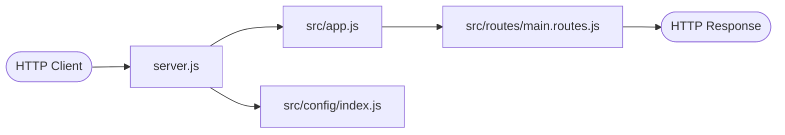
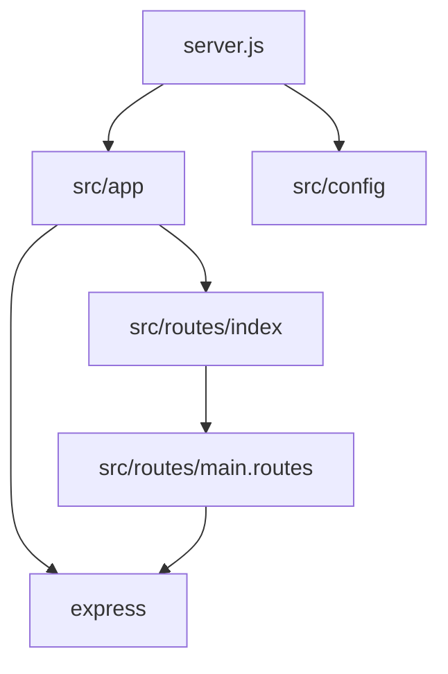
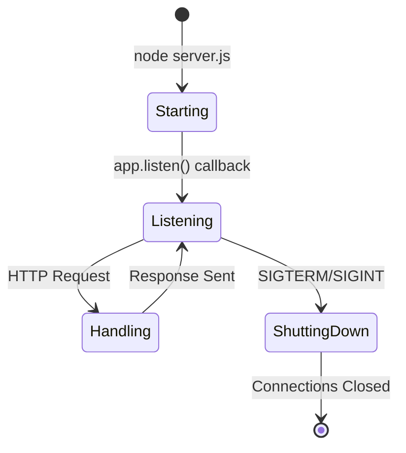

# hao-backprop-test

A Node.js tutorial server demonstrating Express.js integration with multiple HTTP endpoints.

> **Note**: This is a test project for backprop integration.

## Prerequisites

Before running this application, ensure you have the following installed:

| Requirement | Minimum Version | Recommended Version |
|-------------|-----------------|---------------------|
| Node.js | 18.x | 20.19.x (LTS) |
| npm | 8.x | 10.8.x |

### Verify Installation

```bash
node --version
# Expected: v20.x.x or higher

npm --version
# Expected: 10.x.x or higher
```

> **Deployment Note:** For production environments, ensure Node.js is installed via a version manager (such as `nvm`) or a system package manager for streamlined updates and maintenance.

## Installation

1. Clone the repository:

```bash
git clone <repository-url>
cd hao-backprop-test
```

2. Install dependencies:

```bash
npm install
```

This will install Express.js (^5.1.0) and all required dependencies.

3. Verify successful installation:

```bash
npm ls express
# Expected: express@5.1.0
```

## Usage

### Start the Server

Run the server with default configuration:

```bash
npm start
```

**Expected output:**
```
Server running at http://127.0.0.1:3000/
```

### Custom Configuration

Override default settings using environment variables:

```bash
# Custom host and port
HOST=0.0.0.0 PORT=8080 npm start

# Production mode
NODE_ENV=production npm start

# Combined configuration
HOST=0.0.0.0 PORT=8080 NODE_ENV=production npm start
```

## API Reference

This server exposes two HTTP GET endpoints. All endpoints return plain text responses with a `text/html` content type (Express default for `res.send()` with string arguments).

### GET `/`

Returns a greeting message with a trailing newline character.

**Request:**
```bash
curl -s http://127.0.0.1:3000/
```

**Response:**
- **Status Code:** 200 OK
- **Content-Type:** `text/html; charset=utf-8`
- **Body:** `Hello, World!\n` (14 characters, includes trailing newline)

**Response Headers:**

| Header | Value | Description |
|--------|-------|-------------|
| `Content-Type` | `text/html; charset=utf-8` | Express default for string responses via `res.send()` |
| `Content-Length` | `14` | Response body length in bytes |
| `X-Powered-By` | `Express` | Server framework identifier (disable in production) |

**Example:**
```bash
curl -s http://127.0.0.1:3000/
# Output: Hello, World!
```

**Verbose Example (with headers):**
```bash
curl -v http://127.0.0.1:3000/
# < HTTP/1.1 200 OK
# < Content-Type: text/html; charset=utf-8
# < Content-Length: 14
# <
# Hello, World!
```

### GET `/evening`

Returns an evening greeting message without a trailing newline character.

**Request:**
```bash
curl -s http://127.0.0.1:3000/evening
```

**Response:**
- **Status Code:** 200 OK
- **Content-Type:** `text/html; charset=utf-8`
- **Body:** `Good evening` (12 characters, no trailing newline)

**Response Headers:**

| Header | Value | Description |
|--------|-------|-------------|
| `Content-Type` | `text/html; charset=utf-8` | Express default for string responses via `res.send()` |
| `Content-Length` | `12` | Response body length in bytes |
| `X-Powered-By` | `Express` | Server framework identifier (disable in production) |

**Example:**
```bash
curl -s http://127.0.0.1:3000/evening
# Output: Good evening
```

**Verbose Example (with headers):**
```bash
curl -v http://127.0.0.1:3000/evening
# < HTTP/1.1 200 OK
# < Content-Type: text/html; charset=utf-8
# < Content-Length: 12
# <
# Good evening
```

### Error Responses

#### 404 Not Found

Requesting an undefined endpoint returns a 404 error. Express 5.x responds with an HTML error page by default for unrecognized paths.

**Example:**
```bash
curl -v http://127.0.0.1:3000/unknown
# < HTTP/1.1 404 Not Found
# < Content-Type: text/html; charset=utf-8
```

#### Server Bind Failures

If the server fails to start, common error scenarios include:

| Error Code | Cause | Solution |
|------------|-------|----------|
| `EADDRINUSE` | Port is already in use by another process | Use a different port: `PORT=3001 npm start` |
| `EACCES` | Insufficient permissions to bind to the requested port | Use a port above 1024 or run with elevated privileges |

### Health Check

Verify both endpoints are operational:

```bash
curl -s http://127.0.0.1:3000/ && echo " - Root OK"
curl -s http://127.0.0.1:3000/evening && echo " - Evening OK"
```

## Project Structure

```
hao-backprop-test/
├── server.js                    # Entry point - HTTP server binding
├── package.json                 # npm manifest and dependencies
├── package-lock.json            # Dependency lockfile
├── README.md                    # Project documentation (this file)
├── .gitignore                   # Git ignore patterns
├── jest.config.js               # Jest test framework configuration
├── src/                         # Application source root
│   ├── app.js                   # Express application factory
│   ├── config/                  # Configuration module
│   │   └── index.js             # Environment variable management
│   └── routes/                  # Routing surface
│       ├── index.js             # Route aggregator (barrel pattern)
│       └── main.routes.js       # Route handlers implementation
└── tests/                       # Test suite root
    ├── unit/                    # Isolated module tests
    │   ├── config.test.js       # Configuration module tests
    │   └── routes.test.js       # Route handler tests
    ├── integration/             # HTTP endpoint tests
    │   └── endpoints.test.js    # API endpoint contract tests
    └── lifecycle/               # Server lifecycle tests
        └── server.test.js       # Startup/shutdown tests
```

### File Descriptions

| File | Purpose |
|------|---------|
| `server.js` | Entry point that imports the Express app and binds it to the configured host/port |
| `src/app.js` | Express application factory - creates and exports configured Express app with mounted routes |
| `src/config/index.js` | Configuration module - exports `{ host, port, env }` from environment variables |
| `src/routes/index.js` | Route aggregator using barrel pattern - centralizes route exports |
| `src/routes/main.routes.js` | Route handlers - implements GET `/` and GET `/evening` endpoints |

## Architecture

This project follows a modular Express.js architecture with separation of concerns:

```
Request Flow:
Client → server.js → Express App (src/app.js) → Router (src/routes/) → Response
                           ↑
                     Configuration
                   (src/config/index.js)
```

### Request-Response Flow


```mermaid
graph LR
    Client([HTTP Client]) --> Server[server.js]
    Server --> App[src/app.js]
    App --> Routes[src/routes/main.routes.js]
    Routes --> Response([HTTP Response])
    Server --> Config[src/config/index.js]
```

### Module Dependency Graph


```mermaid
graph TD
    server.js --> src/app
    server.js --> src/config
    src/app --> express
    src/app --> src/routes/index
    src/routes/index --> src/routes/main.routes
    src/routes/main.routes --> express
```

### Design Patterns Used

- **Factory Pattern**: `src/app.js` exports a configured Express app without starting the server, enabling testability
- **Barrel Pattern**: `src/routes/index.js` aggregates route exports for clean imports
- **CommonJS Modules**: Uses `require`/`module.exports` for Node.js compatibility
- **Twelve-Factor App**: Configuration externalized to environment variables

## Deployment

This section covers production deployment considerations for the server.

### Production Configuration

For production deployments, configure the server to bind to all network interfaces and set the environment mode:

```bash
HOST=0.0.0.0 PORT=80 NODE_ENV=production node server.js
```

| Variable | Development Default | Production Recommendation | Purpose |
|----------|---------------------|---------------------------|---------|
| `HOST` | `127.0.0.1` | `0.0.0.0` | Bind to all network interfaces for external access |
| `PORT` | `3000` | `80` or `443` | Standard HTTP/HTTPS ports |
| `NODE_ENV` | `development` | `production` | Enables production optimizations in Express |

> **Note:** Binding to `0.0.0.0` makes the server accessible from any network interface. Use `127.0.0.1` (the default) to restrict access to the local machine only.

### Process Management

In production, use a process manager to ensure the server restarts automatically on failure.

#### PM2

```bash
# Install PM2 globally
npm install -g pm2

# Start the server with PM2
pm2 start server.js --name hello-world

# Configure PM2 to start on system boot
pm2 startup
pm2 save

# Common PM2 commands
pm2 status              # View running processes
pm2 logs hello-world    # View server logs
pm2 restart hello-world # Restart the server
pm2 stop hello-world    # Stop the server
```

#### systemd Service Unit

Create a systemd service file at `/etc/systemd/system/hello-world.service`:

```ini
[Unit]
Description=Hello World Express Server
After=network.target

[Service]
Type=simple
User=node
WorkingDirectory=/opt/hello-world
ExecStart=/usr/bin/node server.js
Restart=on-failure
Environment=NODE_ENV=production HOST=0.0.0.0 PORT=3000

[Install]
WantedBy=multi-user.target
```

Enable and start the service:

```bash
sudo systemctl enable hello-world
sudo systemctl start hello-world
sudo systemctl status hello-world
```

### Server Lifecycle


```mermaid
stateDiagram-v2
    [*] --> Starting: node server.js
    Starting --> Listening: app.listen() callback
    Listening --> Handling: HTTP Request
    Handling --> Listening: Response Sent
    Listening --> ShuttingDown: SIGTERM/SIGINT
    ShuttingDown --> [*]: Connections Closed
```

### Reverse Proxy Configuration

For production deployments, place the Node.js server behind a reverse proxy such as nginx to handle SSL termination, static assets, and load balancing.

**Example nginx configuration:**

```nginx
server {
    listen 80;
    server_name example.com;

    location / {
        proxy_pass http://127.0.0.1:3000;
        proxy_http_version 1.1;
        proxy_set_header Upgrade $http_upgrade;
        proxy_set_header Connection 'upgrade';
        proxy_set_header Host $host;
        proxy_cache_bypass $http_upgrade;
    }
}
```

### Security Considerations

When deploying to production, consider the following security practices:

- **Helmet.js**: Install and configure [Helmet](https://helmetjs.github.io/) to set secure HTTP headers and protect against common web vulnerabilities.
- **Rate Limiting**: Implement rate limiting (e.g., with [express-rate-limit](https://www.npmjs.com/package/express-rate-limit)) to mitigate brute-force and denial-of-service attacks.
- **Reverse Proxy**: Always run the server behind a reverse proxy (e.g., nginx) in production rather than exposing Node.js directly to the internet.
- **Non-Root User**: Never run the Node.js process as the root user. Use a dedicated service account with minimal privileges.
- **Disable `X-Powered-By`**: Remove the default Express `X-Powered-By` header to reduce information disclosure: `app.disable('x-powered-by')`.

### Health Check Endpoint Recommendations

For production monitoring, consider implementing a dedicated health check endpoint. In the meantime, you can use the existing root endpoint as a basic health verification:

```bash
# Basic health check using the root endpoint
curl -sf http://127.0.0.1:3000/ > /dev/null && echo "OK" || echo "FAIL"

# Verify all endpoints
curl -sf http://127.0.0.1:3000/ > /dev/null && \
curl -sf http://127.0.0.1:3000/evening > /dev/null && \
echo "All endpoints healthy" || echo "Health check failed"
```

### Graceful Shutdown

For clean server shutdown in production, handle `SIGTERM` and `SIGINT` signals to close active connections before exiting:

```javascript
// Example graceful shutdown pattern (add to server.js for production use)
const server = app.listen(config.port, config.host, () => {
  console.log(`Server running at http://${config.host}:${config.port}/`);
});

process.on('SIGTERM', () => {
  console.log('SIGTERM received. Shutting down gracefully...');
  server.close(() => {
    console.log('Server closed.');
    process.exit(0);
  });
});

process.on('SIGINT', () => {
  console.log('SIGINT received. Shutting down gracefully...');
  server.close(() => {
    console.log('Server closed.');
    process.exit(0);
  });
});
```

## Environment Variables

The application supports the following environment variables for configuration:

| Variable | Default Value | Description |
|----------|---------------|-------------|
| `HOST` | `'127.0.0.1'` | Server binding address. Use `0.0.0.0` to accept connections from any interface. |
| `PORT` | `3000` | Server binding port number. |
| `NODE_ENV` | `'development'` | Application environment mode (`development`, `production`, `test`). |

### Configuration Examples

**Development (default):**
```bash
npm start
# Binds to http://127.0.0.1:3000/
```

**Production deployment:**
```bash
HOST=0.0.0.0 PORT=80 NODE_ENV=production npm start
# Binds to http://0.0.0.0:80/
```

**Custom port:**
```bash
PORT=8080 npm start
# Binds to http://127.0.0.1:8080/
```

## Dependencies

### Runtime Dependencies

| Package | Version | Purpose |
|---------|---------|---------|
| `express` | ^5.1.0 | Web framework providing HTTP handling, routing, and middleware |

### Dependency Installation

```bash
# Install all dependencies
npm install

# Verify express installation
npm ls express
# Expected: express@5.1.0
```

## Scripts

| Script | Command | Description |
|--------|---------|-------------|
| `start` | `node server.js` | Starts the HTTP server |
| `test` | `jest` | Run the complete test suite |
| `test:watch` | `jest --watch` | Run tests in watch mode for development |
| `test:coverage` | `jest --coverage` | Run tests and generate coverage report |
| `test:ci` | `jest --ci --coverage` | Run tests optimized for CI/CD environments |

## Testing

This project includes a comprehensive test suite built with **Jest 30.x** and **Supertest** for HTTP endpoint testing.

### Test Execution Commands

| Purpose | Command | Description |
|---------|---------|-------------|
| Run all tests | `npm test` | Execute the complete test suite |
| Watch mode | `npm run test:watch` | Re-run tests automatically on file changes |
| Coverage report | `npm run test:coverage` | Generate detailed code coverage metrics |
| CI execution | `npm run test:ci` | Optimized execution for CI/CD pipelines |
| Single file | `npx jest tests/unit/config.test.js` | Run a specific test file |
| Pattern match | `npx jest --testPathPatterns="config"` | Run tests matching a pattern |

### Test Structure

The test suite is organized into three categories based on test scope:

```
tests/
├── unit/                    # Isolated module tests
│   ├── config.test.js       # Configuration defaults and parsing
│   └── routes.test.js       # Route handler exports verification
├── integration/             # HTTP endpoint tests
│   └── endpoints.test.js    # API contract tests using Supertest
└── lifecycle/               # Server lifecycle tests
    └── server.test.js       # Startup and shutdown behavior
```

| Directory | Purpose | Test Approach |
|-----------|---------|---------------|
| `tests/unit/` | Test isolated modules without HTTP | Direct module imports with Jest assertions |
| `tests/integration/` | Test HTTP endpoint responses | Supertest requests against the Express app |
| `tests/lifecycle/` | Test server startup/shutdown | Mock-based lifecycle verification |

### Coverage Targets

The project enforces the following code coverage thresholds:

| Coverage Metric | Target | Description |
|-----------------|--------|-------------|
| Line Coverage | ≥ 80% | Percentage of code lines executed by tests |
| Branch Coverage | ≥ 75% | Percentage of conditional branches tested |
| Function Coverage | ≥ 90% | Percentage of functions called by tests |
| Statement Coverage | ≥ 80% | Percentage of statements executed by tests |

**Generate and view coverage report:**
```bash
npm run test:coverage
# Coverage report generated in ./coverage/
# Open ./coverage/lcov-report/index.html for detailed HTML report
```

### Test Dependencies

| Package | Version | Purpose |
|---------|---------|---------|
| `jest` | ^30.2.0 | JavaScript testing framework and test runner |
| `supertest` | ^7.1.4 | HTTP assertion library for Express endpoint testing |

## Troubleshooting

### Common Issues

**Port already in use:**
```bash
# Error: listen EADDRINUSE: address already in use
# Solution: Use a different port
PORT=3001 npm start
```

**Permission denied on port 80:**
```bash
# Error: listen EACCES: permission denied
# Solution: Use a port above 1024 or run with elevated privileges
PORT=8080 npm start
```

**Module not found:**
```bash
# Error: Cannot find module 'express'
# Solution: Install dependencies
npm install
```

## License

This project is licensed under the MIT License.

## Author

hao-backprop-test contributors

---

*This is a tutorial project demonstrating Node.js server development with Express.js framework.*
