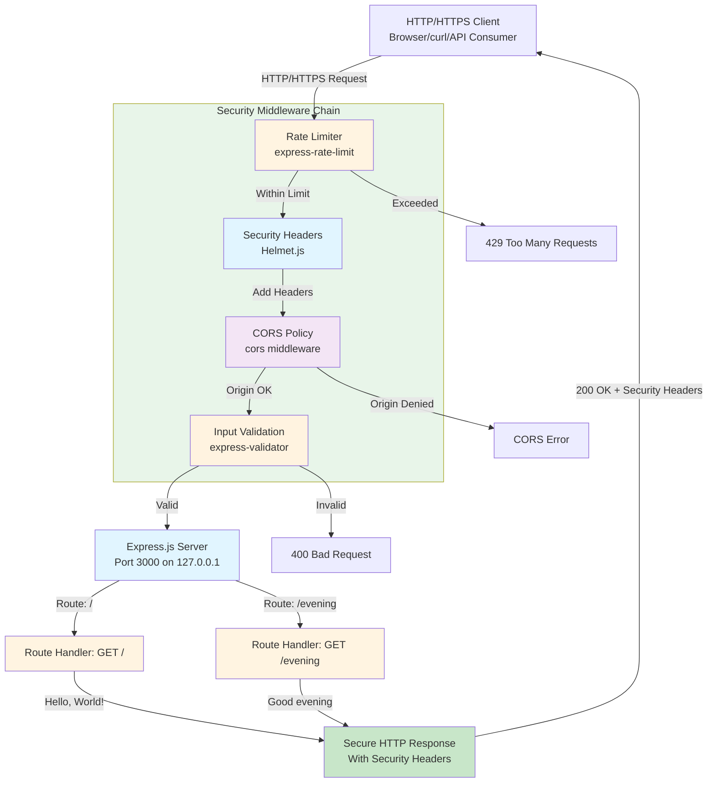
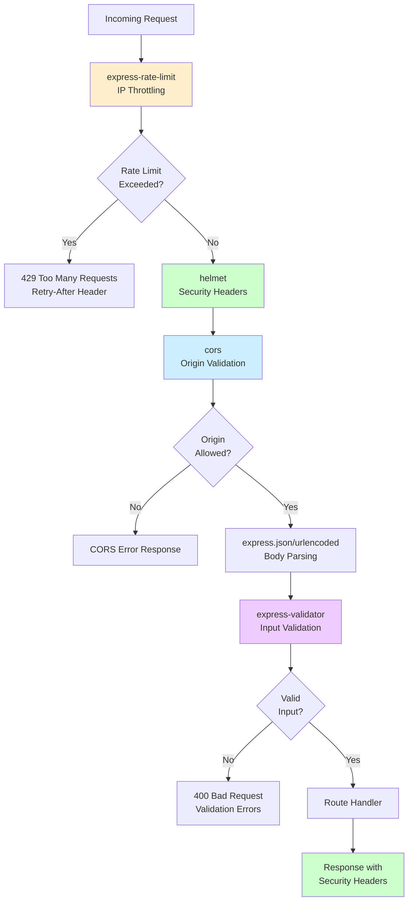

# hao-backprop-test

[](https://nodejs.org/)
[](https://expressjs.com/)
[](https://opensource.org/licenses/MIT)
[](https://owasp.org/)

**Express.js Web Server with Greeting Endpoints**

A simple Node.js web server built with Express.js 5.2.0, demonstrating routing, request handling, security best practices, and API endpoint implementation. This is a test project for backprop integration, providing a clean, educational codebase for learning Express.js fundamentals with production-grade security.

## Table of Contents

- [Features](#features)
- [Security Features](#security-features)
- [Prerequisites](#prerequisites)
- [Installation](#installation)
- [Configuration](#configuration)
- [Usage](#usage)
- [API Documentation](#api-documentation)
- [Security Verification](#security-verification)
- [Security Testing](#security-testing)
- [Architecture Overview](#architecture-overview)
- [Technology Stack](#technology-stack)
- [Development](#development)
- [Troubleshooting](#troubleshooting)
- [Contributing](#contributing)
- [License](#license)

## Features

- **Express.js 5.2.0 Framework Integration**: Modern web framework with robust routing capabilities and security patches
- **Comprehensive Security Middleware**: Production-grade security with Helmet, CORS, rate limiting, and input validation
- **Two REST API Endpoints**: Simple greeting endpoints demonstrating GET request handling
- **Localhost-Only Development Server**: Secure localhost binding (127.0.0.1) prevents external access during development
- **Educational Codebase**: Clean, well-documented code ideal for learning Express.js patterns and security best practices
- **Zero-Configuration Quick Start**: Run with `npm start` - no complex setup required
- **Optional HTTPS Support**: TLS configuration for encrypted communications in production environments

## Security Features

This application implements comprehensive security hardening following OWASP guidelines and Express.js best practices.

### Security Headers (Helmet.js)

The application uses **Helmet.js v8.1.0** to set secure HTTP response headers:

| Header | Purpose | Configuration |
|--------|---------|---------------|
| **Content-Security-Policy** | Prevents XSS attacks by controlling resource loading | `default-src 'self'; script-src 'self'` |
| **Strict-Transport-Security** | Enforces HTTPS connections | `max-age: 31536000` (1 year) |
| **X-Frame-Options** | Prevents clickjacking attacks | `DENY` |
| **X-Content-Type-Options** | Prevents MIME type sniffing | `nosniff` |
| **X-DNS-Prefetch-Control** | Controls browser DNS prefetching | `off` |
| **X-Download-Options** | Prevents IE from executing downloads | `noopen` |
| **X-Permitted-Cross-Domain-Policies** | Restricts Adobe cross-domain policy files | `none` |
| **Referrer-Policy** | Controls referrer information | `no-referrer` |

### CORS Policy Enforcement

Cross-Origin Resource Sharing (CORS) is configured with:

- **Configurable Origins**: Set allowed origins via `CORS_ORIGIN` environment variable
- **Credentials Support**: Enabled for cookie-based authentication scenarios
- **Preflight Caching**: Optimized OPTIONS request handling
- **Default Origin**: `http://localhost:3000` for development

### Rate Limiting

Request rate limiting protects against DoS attacks and brute force attempts:

| Setting | Default Value | Environment Variable |
|---------|---------------|---------------------|
| **Window Duration** | 15 minutes (900,000 ms) | `RATE_LIMIT_WINDOW_MS` |
| **Max Requests** | 100 requests per window | `RATE_LIMIT_MAX` |
| **Headers** | RFC draft-8 standard headers | - |
| **Scope** | Per IP address | - |

**Rate Limit Response**: When exceeded, returns `429 Too Many Requests` with `Retry-After` header.

### Input Validation

The application uses **express-validator v7.2.0** for comprehensive input validation:

- **Query Parameter Sanitization**: Prevents injection attacks via URL parameters
- **Body Content Validation**: Validates JSON and URL-encoded request bodies
- **Type Coercion**: Ensures parameters match expected types
- **Error Response Format**: Consistent JSON error responses with validation details

### HTTPS Support

Optional TLS encryption for production deployments:

- **Certificate Configuration**: Set `SSL_KEY_PATH` and `SSL_CERT_PATH` environment variables
- **Enable Flag**: Set `ENABLE_HTTPS=true` to activate HTTPS server
- **Proxy Support**: Set `TRUST_PROXY=true` when behind a reverse proxy (nginx, load balancer)

### Security Patches Applied

| CVE | Package | Description | Status |
|-----|---------|-------------|--------|
| CVE-2024-51999 | express | Query property manipulation vulnerability | ✅ Patched in v5.2.0 |
| CVE-2025-13466 | body-parser | URL-encoded body DoS vulnerability | ✅ Patched in v2.2.1 |

## Prerequisites

Before installing and running this application, ensure you have the following:

- **Node.js**: Version 18.0.0 or higher (tested on v20.19.5)
- **npm**: Version 7.0.0 or higher (tested on v10.8.2)
- **Basic Understanding**: Familiarity with REST APIs and command-line interfaces

Verify your installations:

```bash
node --version
npm --version
```

## Installation

Follow these steps to get the server running on your local machine:

### Step 1: Clone the Repository

```bash
git clone <repository-url>
cd hao-backprop-test
```

### Step 2: Install Dependencies

```bash
npm install
```

This command installs Express.js 5.2.0 and all security middleware dependencies from `package.json`.

### Step 3: Verify Installation

```bash
npm list express helmet cors express-rate-limit express-validator
```

**Expected Output**:
```
├── cors@2.8.5
├── express-rate-limit@8.2.1
├── express-validator@7.2.0
├── express@5.2.0
└── helmet@8.1.0
```

### Step 4: Verify Security (Optional)

Run a security audit to confirm no vulnerabilities:

```bash
npm audit
```

**Expected Output**: `found 0 vulnerabilities`

## Configuration

### Environment Variables

The application supports extensive environment variable configuration for both application behavior and security settings. While the server runs with default values, you can customize behavior using environment variables.

#### Core Application Variables

| Variable | Description | Format | Default | Required |
|----------|-------------|--------|---------|----------|
| `PORT` | Server listening port | Integer (1024-65535) | 3000 | No |
| `NODE_ENV` | Application environment mode | `development`, `production`, `test` | development | No |
| `JWT_SECRET` | Secret key for JWT token signing and verification | String (min 32 chars) | None | No |

#### Security Configuration Variables

| Variable | Description | Format | Default | Required |
|----------|-------------|--------|---------|----------|
| `CORS_ORIGIN` | Allowed CORS origins (comma-separated for multiple) | URL string | `http://localhost:3000` | No |
| `RATE_LIMIT_WINDOW_MS` | Rate limit window duration in milliseconds | Integer | `900000` (15 min) | No |
| `RATE_LIMIT_MAX` | Maximum requests allowed per window per IP | Integer | `100` | No |
| `ENABLE_HTTPS` | Enable HTTPS server (requires SSL cert) | Boolean | `false` | No |
| `SSL_KEY_PATH` | Absolute path to SSL private key file | File path | None | Only if HTTPS enabled |
| `SSL_CERT_PATH` | Absolute path to SSL certificate file | File path | None | Only if HTTPS enabled |
| `TRUST_PROXY` | Trust X-Forwarded-* headers (for reverse proxy) | Boolean | `false` | No |

### Configuration Setup

1. Copy the environment template:

```bash
cp .env.example .env
```

2. Edit `.env` and set your values:

```bash
# Core Configuration
PORT=3000
NODE_ENV=development
JWT_SECRET=your-secure-jwt-secret-key-here

# Security Configuration
CORS_ORIGIN=http://localhost:3000
RATE_LIMIT_WINDOW_MS=900000
RATE_LIMIT_MAX=100

# HTTPS Configuration (optional)
ENABLE_HTTPS=false
SSL_KEY_PATH=
SSL_CERT_PATH=
TRUST_PROXY=false
```

### Production Configuration Example

For production deployments with HTTPS:

```bash
# Core Configuration
PORT=443
NODE_ENV=production
JWT_SECRET=<generate-strong-random-string>

# Security Configuration
CORS_ORIGIN=https://yourdomain.com,https://api.yourdomain.com
RATE_LIMIT_WINDOW_MS=900000
RATE_LIMIT_MAX=50

# HTTPS Configuration
ENABLE_HTTPS=true
SSL_KEY_PATH=/etc/ssl/private/server.key
SSL_CERT_PATH=/etc/ssl/certs/server.crt
TRUST_PROXY=true
```

**Security Notes**:
- Never commit actual secrets to version control
- Generate strong random strings for `JWT_SECRET` in production
- Use proper SSL certificates from a trusted CA (e.g., Let's Encrypt)
- Set `TRUST_PROXY=true` only when behind a trusted reverse proxy

## Usage

### Starting the Server

Start the Express.js server:

```bash
npm start
```

**Expected Console Output**:
```
Server running at http://127.0.0.1:3000/
```

### Verifying Server Operation

Test the root endpoint:

```bash
curl http://127.0.0.1:3000/
```

**Expected Response**: `Hello, World!`

Test the evening endpoint:

```bash
curl http://127.0.0.1:3000/evening
```

**Expected Response**: `Good evening`

### Stopping the Server

Press `Ctrl+C` in the terminal where the server is running to gracefully shut down the application.

## API Documentation

This server provides two simple REST API endpoints for demonstration purposes.

### Endpoint: Root Greeting

**Description**: Returns a friendly greeting message.

- **URL**: `/`
- **Method**: `GET`
- **Authentication**: None required
- **Request Parameters**: None

**Response**:
- **Status Code**: `200 OK`
- **Content-Type**: `text/html; charset=utf-8`
- **Body**: `Hello, World!\n`

**Example Request**:

```bash
curl http://127.0.0.1:3000/
```

**Example Response**:

```
Hello, World!
```

*(Source: server.js:8-10)*

---

### Endpoint: Evening Greeting

**Description**: Returns an evening-specific greeting message.

- **URL**: `/evening`
- **Method**: `GET`
- **Authentication**: None required
- **Request Parameters**: None

**Response**:
- **Status Code**: `200 OK`
- **Content-Type**: `text/html; charset=utf-8`
- **Body**: `Good evening`

**Example Request**:

```bash
curl http://127.0.0.1:3000/evening
```

**Example Response**:

```
Good evening
```

*(Source: server.js:12-14)*

---

### Error Handling

**404 Not Found**: Requests to unmatched routes return Express.js default 404 error responses.

## Security Verification

After installation, verify that all security features are properly configured.

### 1. Vulnerability Audit

Confirm no known vulnerabilities exist in dependencies:

```bash
npm audit
```

**Expected Output**:
```
found 0 vulnerabilities
```

### 2. Security Headers Verification

Start the server and inspect response headers:

```bash
# Start server
npm start &

# Check security headers
curl -I http://127.0.0.1:3000/
```

**Expected Headers**:
```
HTTP/1.1 200 OK
Content-Security-Policy: default-src 'self';script-src 'self'
Cross-Origin-Embedder-Policy: require-corp
Cross-Origin-Opener-Policy: same-origin
Cross-Origin-Resource-Policy: same-origin
X-Content-Type-Options: nosniff
X-DNS-Prefetch-Control: off
X-Download-Options: noopen
X-Frame-Options: SAMEORIGIN
X-Permitted-Cross-Domain-Policies: none
Referrer-Policy: no-referrer
Strict-Transport-Security: max-age=31536000; includeSubDomains
```

### 3. Rate Limiting Verification

Test that rate limiting activates after exceeding the threshold:

```bash
# Send multiple rapid requests (adjust for your RATE_LIMIT_MAX setting)
for i in {1..105}; do
  response=$(curl -s -o /dev/null -w "%{http_code}" http://127.0.0.1:3000/)
  echo "Request $i: HTTP $response"
done
```

**Expected Behavior**:
- Requests 1-100: `HTTP 200`
- Requests 101+: `HTTP 429` (Too Many Requests)

### 4. CORS Verification

Test CORS policy enforcement:

```bash
# Allowed origin (should succeed)
curl -H "Origin: http://localhost:3000" \
     -H "Access-Control-Request-Method: GET" \
     -X OPTIONS \
     http://127.0.0.1:3000/ -I

# Unauthorized origin (should fail CORS)
curl -H "Origin: http://evil-site.com" \
     -H "Access-Control-Request-Method: GET" \
     -X OPTIONS \
     http://127.0.0.1:3000/ -I
```

**Expected Behavior**:
- Allowed origin: Returns `Access-Control-Allow-Origin: http://localhost:3000`
- Unauthorized origin: No `Access-Control-Allow-Origin` header

### 5. CVE Patch Verification

Verify that specific vulnerabilities are patched:

```bash
# Check Express version (must be 5.2.0+)
npm list express
# Expected: express@5.2.0

# Check body-parser version (must be 2.2.1+)
npm list body-parser
# Expected: body-parser@2.2.1
```

## Security Testing

### Running Security Tests

Execute the security test suite:

```bash
# Run all security tests
npm test -- --testPathPattern=security

# Run with coverage
npm test -- --coverage --testPathPattern=security
```

### Security Test Categories

| Test Category | Description | Command |
|---------------|-------------|---------|
| CVE Regression | Verify CVE patches | `npm test -- test_cve_*.js` |
| Header Tests | Verify security headers | `npm test -- test_headers.js` |
| Rate Limit Tests | Verify rate limiting | `npm test -- test_rate_limit.js` |
| CORS Tests | Verify CORS policy | `npm test -- test_cors.js` |
| Input Validation | Verify input sanitization | `npm test -- test_input_validation.js` |

### Manual Security Testing

#### Test Query Parameter Injection (CVE-2024-51999)

```bash
# Attempt prototype pollution via query string
curl "http://127.0.0.1:3000/?__proto__[admin]=true"
# Should not affect application behavior
```

#### Test Request Body DoS (CVE-2025-13466)

```bash
# Large parameter count should be handled gracefully
curl -X POST \
     -H "Content-Type: application/x-www-form-urlencoded" \
     -d "$(printf 'param%s=value&' {1..1000})" \
     http://127.0.0.1:3000/
# Should return response without server crash
```

#### Test XSS via Response

```bash
# Attempt script injection
curl "http://127.0.0.1:3000/?name=<script>alert(1)</script>"
# CSP header should prevent script execution in browser
```

### Automated Security Scanning

For comprehensive security analysis, use these tools:

```bash
# Snyk vulnerability scanner
npx snyk test

# OWASP Dependency Check (requires Java)
dependency-check --project hello_world --scan .

# Retire.js for JavaScript vulnerabilities
npx retire
```

### Security Verification Script

Run the complete security verification:

```bash
#!/bin/bash
# security-verify.sh

echo "=== Security Verification Suite ==="
echo ""

echo "1. Checking npm audit..."
npm audit
echo ""

echo "2. Checking security headers..."
curl -sI http://127.0.0.1:3000/ | grep -E "(X-Frame-Options|Content-Security-Policy|X-Content-Type-Options|Strict-Transport-Security)"
echo ""

echo "3. Testing rate limiting (5 requests)..."
for i in {1..5}; do
  curl -s -o /dev/null -w "Request $i: HTTP %{http_code}\n" http://127.0.0.1:3000/
done
echo ""

echo "4. Checking package versions..."
echo "Express: $(npm list express --depth=0 2>/dev/null | grep express)"
echo "Helmet: $(npm list helmet --depth=0 2>/dev/null | grep helmet)"
echo "CORS: $(npm list cors --depth=0 2>/dev/null | grep cors)"
echo ""

echo "=== Verification Complete ==="
```

## Architecture Overview

This application follows a secure, modular Express.js architecture with comprehensive security middleware, suitable for learning security best practices and production deployments.

### System Design with Security Middleware


```mermaid
graph TB
    Client[HTTP/HTTPS Client<br/>Browser/curl/API Consumer]
    
    subgraph SecurityLayer[Security Middleware Chain]
        RateLimit[Rate Limiter<br/>express-rate-limit]
        Helmet[Security Headers<br/>Helmet.js]
        CORS[CORS Policy<br/>cors middleware]
        Validation[Input Validation<br/>express-validator]
    end
    
    Server[Express.js Server<br/>Port 3000 on 127.0.0.1]
    RootHandler[Route Handler: GET /]
    EveningHandler[Route Handler: GET /evening]
    Response[Secure HTTP Response<br/>With Security Headers]
    
    Client -->|HTTP/HTTPS Request| RateLimit
    RateLimit -->|Within Limit| Helmet
    RateLimit -->|Exceeded| TooMany[429 Too Many Requests]
    Helmet -->|Add Headers| CORS
    CORS -->|Origin OK| Validation
    CORS -->|Origin Denied| CORSError[CORS Error]
    Validation -->|Valid| Server
    Validation -->|Invalid| BadRequest[400 Bad Request]
    Server -->|Route: /| RootHandler
    Server -->|Route: /evening| EveningHandler
    RootHandler -->|"Hello, World!\n"| Response
    EveningHandler -->|"Good evening"| Response
    Response -->|200 OK + Security Headers| Client
    
    style SecurityLayer fill:#e8f5e9
    style RateLimit fill:#fff4e1
    style Helmet fill:#e1f5ff
    style CORS fill:#f3e5f5
    style Validation fill:#fff3e0
    style Server fill:#e1f5ff
    style RootHandler fill:#fff4e1
    style EveningHandler fill:#fff4e1
    style Response fill:#c8e6c9
```

### Security Middleware Chain Flow

The application processes all requests through a comprehensive security middleware chain:


```mermaid
flowchart TD
    A[Incoming Request] --> B[express-rate-limit<br/>IP Throttling]
    B --> C{Rate Limit<br/>Exceeded?}
    C -->|Yes| D[429 Too Many Requests<br/>Retry-After Header]
    C -->|No| E[helmet<br/>Security Headers]
    E --> F[cors<br/>Origin Validation]
    F --> G{Origin<br/>Allowed?}
    G -->|No| H[CORS Error Response]
    G -->|Yes| I[express.json/urlencoded<br/>Body Parsing]
    I --> J[express-validator<br/>Input Validation]
    J --> K{Valid<br/>Input?}
    K -->|No| L[400 Bad Request<br/>Validation Errors]
    K -->|Yes| M[Route Handler]
    M --> N[Response with<br/>Security Headers]
    
    style B fill:#ffeecc
    style E fill:#ccffcc
    style F fill:#cceeff
    style J fill:#eeccff
    style N fill:#ccffcc
```

### Request Flow Sequence

The application processes requests through the following security-aware sequence:


```mermaid
sequenceDiagram
    participant Client as HTTP Client
    participant RateLimit as Rate Limiter
    participant Helmet as Helmet.js
    participant CORS as CORS Middleware
    participant Validator as Input Validator
    participant Router as Route Handler
    participant Response as HTTP Response
    
    Client->>RateLimit: GET http://127.0.0.1:3000/
    RateLimit->>RateLimit: Check request count for IP
    alt Rate limit exceeded
        RateLimit->>Client: 429 Too Many Requests
    else Within limit
        RateLimit->>Helmet: Forward request
        Helmet->>Helmet: Attach security headers
        Helmet->>CORS: Forward request
        CORS->>CORS: Validate origin
        alt Invalid origin
            CORS->>Client: CORS error
        else Valid origin
            CORS->>Validator: Forward request
            Validator->>Validator: Sanitize input
            Validator->>Router: Forward sanitized request
            Router->>Router: Execute handler function
            Router->>Response: res.send('Hello, World!\n')
            Response->>Response: Include security headers
            Response->>Client: 200 OK with secure response
        end
    end
```

### Component Description

- **Rate Limiter**: Prevents DoS attacks by limiting requests per IP (100 requests/15 min default)
- **Helmet.js**: Adds 11+ security headers to all responses (CSP, HSTS, X-Frame-Options, etc.)
- **CORS Middleware**: Enforces Cross-Origin Resource Sharing policy with configurable origins
- **Input Validator**: Sanitizes and validates all request parameters using express-validator
- **Express Application**: Central application instance managing all routes and middleware
- **Route Handlers**: Callback functions processing HTTP requests and generating responses
- **Server Listener**: Binds application to hostname and port, supporting HTTP or HTTPS

## Technology Stack

This project is built with modern, stable technologies and comprehensive security middleware:

### Core Technologies

| Technology | Version | Purpose | Rationale |
|------------|---------|---------|-----------|
| **Node.js** | v20.19.5 | JavaScript runtime environment | Provides non-blocking I/O for efficient server operations |
| **Express.js** | 5.2.0 | Web application framework | Industry-standard framework with security patches (CVE-2024-51999) |
| **CommonJS** | ES standard | Module system | Standard Node.js module format using `require()` and `module.exports` |

### Security Dependencies

| Package | Version | Purpose | Security Benefit |
|---------|---------|---------|------------------|
| **helmet** | 8.1.0 | HTTP security headers | Protects against XSS, clickjacking, MIME sniffing, and more |
| **cors** | 2.8.5 | CORS policy enforcement | Prevents unauthorized cross-origin access |
| **express-rate-limit** | 8.2.1 | Request rate limiting | Mitigates DoS attacks and brute force attempts |
| **express-validator** | 7.2.0 | Input validation & sanitization | Prevents injection attacks and ensures data integrity |

### Transitive Security Updates

| Package | Version | Updated Via | Security Fix |
|---------|---------|-------------|--------------|
| **body-parser** | 2.2.1 | express | CVE-2025-13466 (DoS vulnerability) |

### Why Express.js?

Express.js was chosen for this project because:
- **Simplicity**: Minimal boilerplate code for basic HTTP servers
- **Flexibility**: Unopinionated framework allows custom architecture
- **Maturity**: Battle-tested in production environments worldwide
- **Community**: Extensive documentation and community support
- **Performance**: Lightweight with minimal overhead
- **Security Ecosystem**: Rich ecosystem of security middleware (Helmet, CORS, etc.)

### Why These Security Packages?

| Package | Selection Rationale |
|---------|---------------------|
| **helmet** | De facto standard for Express security headers; 5.4M+ weekly downloads; Express.js official recommendation |
| **cors** | Most widely used CORS middleware; 21K+ dependent projects; Simple configuration API |
| **express-rate-limit** | 9.2M+ weekly downloads; Standard rate limiting solution; Configurable and extensible |
| **express-validator** | Built on validator.js; Middleware-based; Excellent Express integration |

*(Source: package.json for dependency versions)*

## Development

### Local Development Setup

1. Follow the [Installation](#installation) instructions above
2. Review the [Configuration](#configuration) section for environment setup
3. Start the server with `npm start`
4. Make changes to `server.js`
5. Restart the server to see your changes (use `Ctrl+C` then `npm start`)

### Code Syntax Validation

Verify JavaScript syntax before running:

```bash
node -c server.js
```

No output indicates successful validation.

### Adding New Endpoints

To add a new route to the server:

1. Open `server.js`
2. Add a new route handler before the `app.listen()` call:

```javascript
app.get('/your-endpoint', (req, res) => {
  res.send('Your response');
});
```

3. Restart the server
4. Test with: `curl http://127.0.0.1:3000/your-endpoint`

### Development Guidelines

For detailed contribution guidelines, code style standards, and pull request procedures, see [CONTRIBUTING.md](./CONTRIBUTING.md).

## Troubleshooting

### Issue: Port Already in Use

**Symptom**: Error message "EADDRINUSE: address already in use 127.0.0.1:3000"

**Solution**:

1. Find the process using port 3000:

```bash
# On macOS/Linux
lsof -ti:3000

# On Windows
netstat -ano | findstr :3000
```

2. Kill the process or use a different port:

```bash
# Kill the process (macOS/Linux)
kill -9 $(lsof -ti:3000)

# Or set a different port
PORT=3001 npm start
```

---

### Issue: Module Not Found

**Symptom**: Error message "Cannot find module 'express'"

**Solution**: Install dependencies:

```bash
npm install
```

Verify Express installation:

```bash
npm list express
```

---

### Issue: Server Not Responding

**Symptom**: curl requests timeout or connection refused

**Solution**:

1. Verify server is running: Check terminal for "Server running at..." message
2. Check hostname binding: Server binds to 127.0.0.1 (localhost only)
3. Use correct URL: `http://127.0.0.1:3000/` (not `localhost` or external IP)
4. Check firewall settings: Ensure localhost traffic is allowed

---

### Issue: Unexpected Response Content

**Symptom**: Endpoint returns different content than expected

**Solution**: Verify you're using the correct endpoint:
- Root greeting: `curl http://127.0.0.1:3000/`
- Evening greeting: `curl http://127.0.0.1:3000/evening`
- Case-sensitive paths: `/Evening` will return 404

## Contributing

We welcome contributions to improve this project! Whether you're fixing bugs, adding features, or improving documentation, your help is appreciated.

### How to Contribute

1. Fork the repository
2. Create a feature branch (`git checkout -b feature/your-feature`)
3. Make your changes following our [code style guidelines](./CONTRIBUTING.md#code-style-guidelines)
4. Test your changes thoroughly
5. Commit with descriptive messages (see [commit conventions](./CONTRIBUTING.md#commit-message-conventions))
6. Push to your fork and submit a pull request

### Development Resources

For comprehensive development guidelines, see:
- **[CONTRIBUTING.md](./CONTRIBUTING.md)**: Complete contribution guide with setup, code style, and PR process
- **[.env.example](./.env.example)**: Environment variable configuration template

### Code of Conduct

Please be respectful and constructive in all interactions. We're building a welcoming community for developers of all skill levels.

## License

This project is licensed under the **MIT License**.

**Copyright** © 2024 hxu

Permission is hereby granted, free of charge, to any person obtaining a copy of this software and associated documentation files (the "Software"), to deal in the Software without restriction, including without limitation the rights to use, copy, modify, merge, publish, distribute, sublicense, and/or sell copies of the Software, and to permit persons to whom the Software is furnished to do so, subject to the following conditions:

The above copyright notice and this permission notice shall be included in all copies or substantial portions of the Software.

THE SOFTWARE IS PROVIDED "AS IS", WITHOUT WARRANTY OF ANY KIND, EXPRESS OR IMPLIED, INCLUDING BUT NOT LIMITED TO THE WARRANTIES OF MERCHANTABILITY, FITNESS FOR A PARTICULAR PURPOSE AND NONINFRINGEMENT. IN NO EVENT SHALL THE AUTHORS OR COPYRIGHT HOLDERS BE LIABLE FOR ANY CLAIM, DAMAGES OR OTHER LIABILITY, WHETHER IN AN ACTION OF CONTRACT, TORT OR OTHERWISE, ARISING FROM, OUT OF OR IN CONNECTION WITH THE SOFTWARE OR THE USE OR OTHER DEALINGS IN THE SOFTWARE.

---

**Project Status**: Active development for backprop integration testing

For questions or issues, please open an issue in the repository issue tracker.
