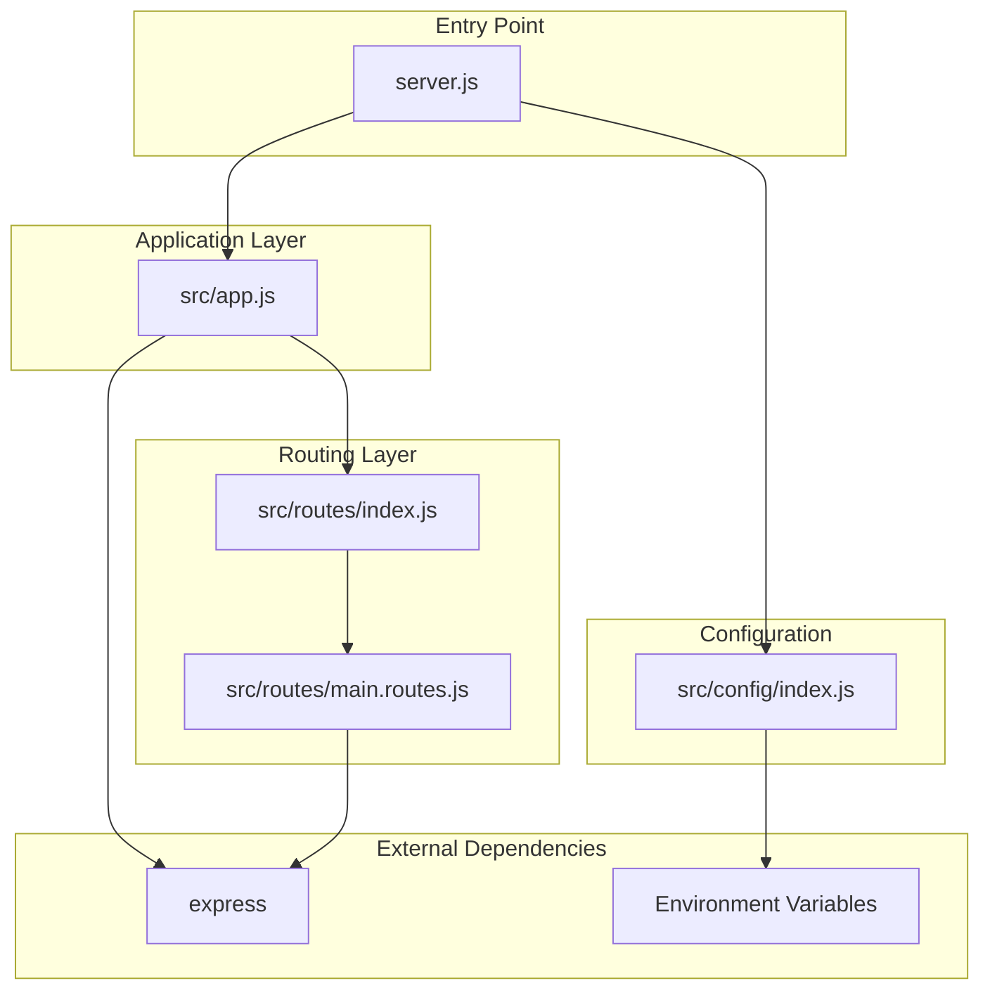
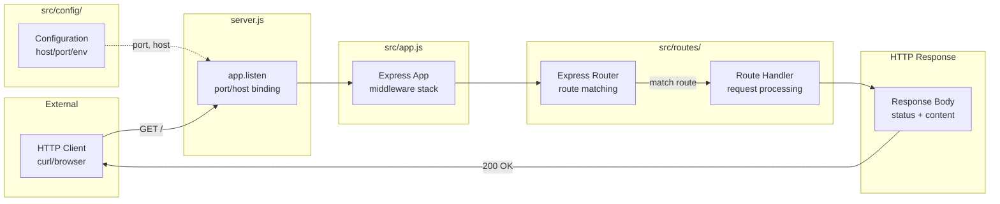
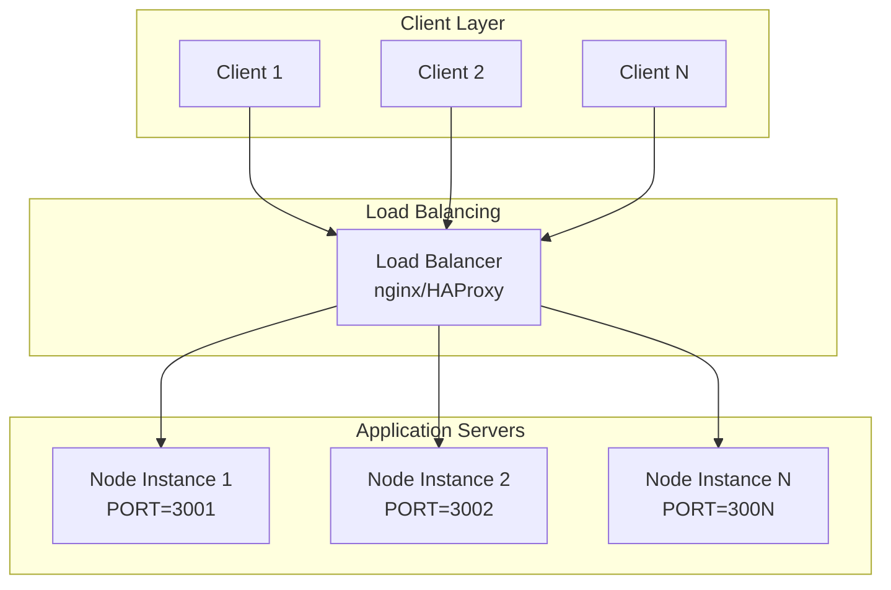

# hao-backprop-test

A Node.js tutorial server demonstrating Express.js integration with multiple HTTP endpoints.

> **Note**: This is a test project for backprop integration.

## Prerequisites

Before running this application, ensure you have the following installed:

| Requirement | Minimum Version | Recommended Version |
|-------------|-----------------|---------------------|
| Node.js | 18.x | 20.19.x (LTS) |
| npm | 8.x | 10.8.x |

### Verify Installation

```bash
node --version
# Expected: v20.x.x or higher

npm --version
# Expected: 10.x.x or higher
```

## Installation

1. Clone the repository:

```bash
git clone <repository-url>
cd hao-backprop-test
```

2. Install dependencies:

```bash
npm install
```

This will install Express.js (^5.1.0) and all required dependencies.

## Usage

### Start the Server

Run the server with default configuration:

```bash
npm start
```

**Expected output:**
```
Server running at http://127.0.0.1:3000/
```

### Custom Configuration

Override default settings using environment variables:

```bash
# Custom host and port
HOST=0.0.0.0 PORT=8080 npm start

# Production mode
NODE_ENV=production npm start

# Combined configuration
HOST=0.0.0.0 PORT=8080 NODE_ENV=production npm start
```

## API Reference

This server exposes two HTTP GET endpoints:

### GET `/`

Returns a greeting message.

**Request:**
```bash
curl -s http://127.0.0.1:3000/
```

**Response:**
- **Status Code:** 200 OK
- **Content-Type:** text/html; charset=utf-8
- **Body:** `Hello, World!\n` (14 characters, includes trailing newline)

**Example:**
```bash
curl -s http://127.0.0.1:3000/
# Output: Hello, World!
```

### GET `/evening`

Returns an evening greeting message.

**Request:**
```bash
curl -s http://127.0.0.1:3000/evening
```

**Response:**
- **Status Code:** 200 OK
- **Content-Type:** text/html; charset=utf-8
- **Body:** `Good evening` (12 characters, no trailing newline)

**Example:**
```bash
curl -s http://127.0.0.1:3000/evening
# Output: Good evening
```

### Health Check

Verify both endpoints are operational:

```bash
curl -s http://127.0.0.1:3000/ && echo " - Root OK"
curl -s http://127.0.0.1:3000/evening && echo " - Evening OK"
```

## Project Structure

```
hao-backprop-test/
├── server.js                    # Entry point - HTTP server binding
├── package.json                 # npm manifest and dependencies
├── package-lock.json            # Dependency lockfile
├── README.md                    # Project documentation (this file)
├── .gitignore                   # Git ignore patterns
└── src/                         # Application source root
    ├── app.js                   # Express application factory
    ├── config/                  # Configuration module
    │   └── index.js             # Environment variable management
    └── routes/                  # Routing surface
        ├── index.js             # Route aggregator (barrel pattern)
        └── main.routes.js       # Route handlers implementation
```

### File Descriptions

| File | Purpose |
|------|---------|
| `server.js` | Entry point that imports the Express app and binds it to the configured host/port |
| `src/app.js` | Express application factory - creates and exports configured Express app with mounted routes |
| `src/config/index.js` | Configuration module - exports `{ host, port, env }` from environment variables |
| `src/routes/index.js` | Route aggregator using barrel pattern - centralizes route exports |
| `src/routes/main.routes.js` | Route handlers - implements GET `/` and GET `/evening` endpoints |

## Code Walkthrough

This section provides detailed explanations of the codebase with annotated code snippets to help developers understand the implementation patterns and architectural decisions.

### Entry Point Walkthrough (server.js)

The `server.js` file serves as the HTTP server entry point, implementing a clean separation between server binding and application logic.

```javascript
// =============================================================================
// Dependencies
// =============================================================================

/**
 * Import the pre-configured Express application instance.
 * The app factory pattern (src/app.js) creates the app with all routes
 * and middleware already mounted, keeping server.js focused solely on
 * HTTP binding.
 */
const app = require('./src/app');

/**
 * Import centralized configuration.
 * All environment-dependent values come from src/config/index.js,
 * following the Twelve-Factor App methodology for configuration
 * externalization.
 */
const config = require('./src/config');

// =============================================================================
// Server Initialization
// =============================================================================

/**
 * Start the HTTP server using Express's listen() method.
 * 
 * Why we pass host and port from config:
 * - Enables environment-based configuration without code changes
 * - config.host: Network interface to bind (127.0.0.1 for local, 0.0.0.0 for all)
 * - config.port: TCP port number (default 3000, configurable via PORT env)
 * 
 * The callback fires once the server is ready to accept connections,
 * providing immediate feedback that startup was successful.
 */
app.listen(config.port, config.host, () => {
  console.log(`Server running at http://${config.host}:${config.port}/`);
});
```

**Key Design Decisions:**
- **Dependency Injection**: Configuration is injected from the config module rather than hardcoded
- **Factory Pattern Usage**: The app is imported fully configured, making server.js a thin binding layer
- **Callback Confirmation**: The startup message in the callback confirms successful binding

### App Factory Walkthrough (src/app.js)

The `src/app.js` module implements the Factory pattern to create and export a configured Express application.

```javascript
/**
 * Express.js provides the web framework.
 * The require('express') call returns a factory function that creates
 * new application instances.
 */
const express = require('express');

/**
 * Import routes using the Barrel pattern.
 * The destructuring { mainRoutes } extracts the specific router
 * from the centralized route aggregator (src/routes/index.js).
 * 
 * Benefits of barrel pattern:
 * - Single import point for all routes
 * - Easy to add new route modules
 * - Clean, readable import statements
 */
const { mainRoutes } = require('./routes');

/**
 * Create the Express application instance.
 * express() is a factory function that returns a new Application object.
 * 
 * Why use a factory pattern here:
 * - Application can be created without starting the server
 * - Enables unit testing of routes without HTTP binding
 * - Separates configuration from runtime concerns
 */
const app = express();

/**
 * Mount the main routes at the root path '/'.
 * app.use() attaches middleware or routers to the application.
 * 
 * By mounting at '/', we preserve the original route paths:
 * - GET '/'        → handled by mainRoutes
 * - GET '/evening' → handled by mainRoutes
 * 
 * This approach allows routes to be defined in separate files
 * while maintaining the expected URL structure.
 */
app.use('/', mainRoutes);

/**
 * Export the configured app (not the server).
 * This is crucial for the Factory pattern - we export the product
 * (configured app) that can be used by consumers (server.js, tests).
 */
module.exports = app;
```

**Key Design Decisions:**
- **Factory Pattern**: Creates configured app without starting the server
- **Testability**: Exported app can be tested without HTTP binding
- **Barrel Import**: Uses centralized route exports for cleaner imports
- **Middleware Mounting**: Routes mounted at root to preserve URL structure

### Route Handler Walkthrough (src/routes/main.routes.js)

The `src/routes/main.routes.js` module defines the HTTP endpoint handlers using Express Router.

```javascript
/**
 * Import Express to access the Router constructor.
 * Express Router is a mini-application that handles routing
 * and can be mounted on the main app.
 */
const express = require('express');

/**
 * Create an isolated router instance.
 * express.Router() returns a new Router object that can:
 * - Define routes independently
 * - Be mounted on any path in the main app
 * - Have its own middleware stack
 */
const router = express.Router();

/**
 * Root route handler: GET /
 * 
 * Handler function signature: (req, res) => { ... }
 * - req: Express Request object with HTTP request details
 * - res: Express Response object with methods to send responses
 * 
 * res.send() automatically:
 * - Sets Content-Type based on the argument type
 * - Converts strings to text/html
 * - Sets Content-Length header
 * - Ends the response
 * 
 * Note: The trailing newline in 'Hello, World!\n' is intentional
 * to match the original implementation's behavior.
 */
router.get('/', (req, res) => {
  res.send('Hello, World!\n');
});

/**
 * Evening route handler: GET /evening
 * 
 * This endpoint returns a different greeting message.
 * No trailing newline is included to demonstrate that
 * response format can vary by endpoint requirement.
 */
router.get('/evening', (req, res) => {
  res.send('Good evening');
});

/**
 * Export the configured router.
 * The router can now be mounted on any Express app
 * at any base path using app.use().
 */
module.exports = router;
```

**Key Design Decisions:**
- **Router Isolation**: Uses Express Router for modular route definition
- **Simple Handlers**: Each handler has a single responsibility
- **Response Consistency**: Response format matches original implementation exactly

### Configuration Walkthrough (src/config/index.js)

The `src/config/index.js` module centralizes all configuration with environment variable support.

```javascript
/**
 * Configuration object following Twelve-Factor App methodology.
 * 
 * The Twelve-Factor App (https://12factor.net/) recommends:
 * - Store config in environment variables
 * - Strict separation of config from code
 * - Never hardcode environment-specific values
 * 
 * This object uses the pattern:
 *   process.env.VARIABLE || 'default_value'
 * 
 * Which means:
 * 1. Check if environment variable is set
 * 2. If set, use its value
 * 3. If not set, use the default value
 */
module.exports = {
  /**
   * host: Network interface binding address
   * 
   * Default: '127.0.0.1' (localhost only)
   * - Only accepts connections from the same machine
   * - Secure for development
   * 
   * Production: '0.0.0.0' (all interfaces)
   * - Accepts connections from any network interface
   * - Required for external access
   */
  host: process.env.HOST || '127.0.0.1',

  /**
   * port: TCP port number for HTTP server
   * 
   * parseInt(string, 10) converts PORT to an integer:
   * - Second argument (10) specifies base-10 parsing
   * - Prevents issues with leading zeros
   * 
   * Default: 3000 (common development port)
   * Production: Often 80 (HTTP) or 443 (HTTPS)
   */
  port: parseInt(process.env.PORT, 10) || 3000,

  /**
   * env: Application runtime environment
   * 
   * Common values:
   * - 'development': Local development with verbose logging
   * - 'production': Optimized for performance and security
   * - 'test': Used during automated testing
   * 
   * Many Express middleware check this value to adjust behavior.
   */
  env: process.env.NODE_ENV || 'development'
};
```

**Key Design Decisions:**
- **Twelve-Factor Compliance**: All configuration externalized to environment variables
- **Sensible Defaults**: Development-friendly defaults that work out of the box
- **Type Coercion**: Port explicitly parsed as integer for type safety
- **Centralization**: Single source of truth for all configuration

### Module Dependency Diagram


```mermaid
flowchart TD
    subgraph EntryPoint[Entry Point]
        SERVER[server.js]
    end
    
    subgraph Application[Application Layer]
        APP[src/app.js]
    end
    
    subgraph Configuration[Configuration]
        CONFIG[src/config/index.js]
    end
    
    subgraph Routing[Routing Layer]
        ROUTES_INDEX[src/routes/index.js]
        MAIN_ROUTES[src/routes/main.routes.js]
    end
    
    subgraph External[External Dependencies]
        EXPRESS[express]
        ENV[Environment Variables]
    end
    
    SERVER --> APP
    SERVER --> CONFIG
    APP --> EXPRESS
    APP --> ROUTES_INDEX
    ROUTES_INDEX --> MAIN_ROUTES
    MAIN_ROUTES --> EXPRESS
    CONFIG --> ENV
```

## Environment Variables

The application supports the following environment variables for configuration:

| Variable | Default Value | Description |
|----------|---------------|-------------|
| `HOST` | `'127.0.0.1'` | Server binding address. Use `0.0.0.0` to accept connections from any interface. |
| `PORT` | `3000` | Server binding port number. |
| `NODE_ENV` | `'development'` | Application environment mode (`development`, `production`, `test`). |

### Configuration Examples

**Development (default):**
```bash
npm start
# Binds to http://127.0.0.1:3000/
```

**Production deployment:**
```bash
HOST=0.0.0.0 PORT=80 NODE_ENV=production npm start
# Binds to http://0.0.0.0:80/
```

**Custom port:**
```bash
PORT=8080 npm start
# Binds to http://127.0.0.1:8080/
```

## Architecture

This project follows a modular Express.js architecture with separation of concerns.

### Request Flow Diagram

The following diagram illustrates how an HTTP request flows through the application:


```mermaid
flowchart LR
    subgraph Client[External]
        HTTP[HTTP Client<br/>curl/browser]
    end
    
    subgraph Server[server.js]
        LISTEN[app.listen<br/>port/host binding]
    end
    
    subgraph App[src/app.js]
        EXPRESS[Express App<br/>middleware stack]
    end
    
    subgraph Routes[src/routes/]
        ROUTER[Express Router<br/>route matching]
        HANDLER[Route Handler<br/>request processing]
    end
    
    subgraph Response[HTTP Response]
        RES[Response Body<br/>status + content]
    end
    
    HTTP -->|"GET /"|LISTEN
    LISTEN --> EXPRESS
    EXPRESS --> ROUTER
    ROUTER -->|"match route"| HANDLER
    HANDLER --> RES
    RES -->|"200 OK"| HTTP
    
    subgraph Config[src/config/]
        CFG[Configuration<br/>host/port/env]
    end
    
    CFG -.->|"port, host"| LISTEN
```

### Architecture Overview

```
Request Flow (simplified):
Client → server.js → Express App (src/app.js) → Router (src/routes/) → Response
                           ↑
                     Configuration
                   (src/config/index.js)
```

### Design Patterns Used

| Pattern | Implementation | Benefit |
|---------|----------------|---------|
| **Factory Pattern** | `src/app.js` exports a configured Express app without starting the server | Enables unit testing, separates configuration from runtime |
| **Barrel Pattern** | `src/routes/index.js` aggregates route exports | Single import point, clean module organization |
| **CommonJS Modules** | Uses `require`/`module.exports` | Node.js native compatibility, synchronous loading |
| **Twelve-Factor App** | Configuration externalized to environment variables | Environment-agnostic code, easy deployment |
| **Separation of Concerns** | Distinct modules for server, app, config, routes | Maintainability, testability, modularity |

### Layer Responsibilities

| Layer | Module | Responsibility |
|-------|--------|----------------|
| **Entry Point** | `server.js` | HTTP server binding, startup logging |
| **Application** | `src/app.js` | Express configuration, middleware stack, route mounting |
| **Configuration** | `src/config/index.js` | Environment variable parsing, default values |
| **Routing** | `src/routes/` | URL pattern matching, request handling, response generation |

## Deployment Guide

This section provides comprehensive guidance for deploying the application to production environments.

### Production Environment Setup

#### Environment Configuration

For production deployments, configure the following environment variables:

```bash
# Required for production
export NODE_ENV=production
export HOST=0.0.0.0      # Accept connections from all interfaces
export PORT=80           # Standard HTTP port (or 443 for HTTPS)
```

**Environment Variable Reference:**

| Variable | Development | Production | Notes |
|----------|-------------|------------|-------|
| `NODE_ENV` | `development` | `production` | Enables Express.js production optimizations |
| `HOST` | `127.0.0.1` | `0.0.0.0` | `0.0.0.0` accepts external connections |
| `PORT` | `3000` | `80` or `8080` | Port 80 requires elevated privileges |

#### Production Startup

```bash
# Direct startup (not recommended for production)
NODE_ENV=production HOST=0.0.0.0 PORT=80 node server.js

# Using npm (respects environment variables)
NODE_ENV=production HOST=0.0.0.0 PORT=80 npm start
```

### Process Management

For production deployments, use a process manager to ensure the application restarts on crashes and system reboots.

#### Using PM2 (Recommended)

PM2 is a production-grade process manager for Node.js applications.

**Installation:**
```bash
npm install -g pm2
```

**Start Application:**
```bash
# Start with environment variables
pm2 start server.js --name "hao-server" \
  --env NODE_ENV=production \
  --env HOST=0.0.0.0 \
  --env PORT=80

# Or use an ecosystem file (recommended)
```

**Create PM2 Ecosystem File (ecosystem.config.js):**
```javascript
module.exports = {
  apps: [{
    name: 'hao-server',
    script: 'server.js',
    instances: 'max',        // Use all CPU cores
    exec_mode: 'cluster',    // Enable cluster mode
    env: {
      NODE_ENV: 'development',
      HOST: '127.0.0.1',
      PORT: 3000
    },
    env_production: {
      NODE_ENV: 'production',
      HOST: '0.0.0.0',
      PORT: 80
    }
  }]
};
```

**PM2 Commands:**
```bash
# Start with ecosystem file
pm2 start ecosystem.config.js --env production

# View running processes
pm2 list

# View logs
pm2 logs hao-server

# Restart application
pm2 restart hao-server

# Stop application
pm2 stop hao-server

# Enable startup script (auto-start on reboot)
pm2 startup
pm2 save
```

#### Using systemd (Linux)

For Linux servers, systemd provides native process management.

**Create Service File (/etc/systemd/system/hao-server.service):**
```ini
[Unit]
Description=Hao Backprop Test Node.js Server
After=network.target

[Service]
Type=simple
User=nodejs
WorkingDirectory=/path/to/hao-backprop-test
Environment=NODE_ENV=production
Environment=HOST=0.0.0.0
Environment=PORT=80
ExecStart=/usr/bin/node server.js
Restart=on-failure
RestartSec=10

[Install]
WantedBy=multi-user.target
```

**systemd Commands:**
```bash
# Reload systemd configuration
sudo systemctl daemon-reload

# Start the service
sudo systemctl start hao-server

# Enable auto-start on boot
sudo systemctl enable hao-server

# Check status
sudo systemctl status hao-server

# View logs
sudo journalctl -u hao-server -f
```

### Health Checks

Implement health monitoring to verify the server is operational.

#### Basic Health Check

```bash
# Check root endpoint
curl -s -o /dev/null -w "%{http_code}" http://localhost:3000/
# Expected: 200

# Check with response body
curl -s http://localhost:3000/
# Expected: Hello, World!

# Check evening endpoint
curl -s http://localhost:3000/evening
# Expected: Good evening
```

#### Health Check Script

Create a health check script (`healthcheck.sh`):

```bash
#!/bin/bash
# Health check script for hao-server

HOST="${1:-localhost}"
PORT="${2:-3000}"
ENDPOINT="${3:-/}"

response=$(curl -s -o /dev/null -w "%{http_code}" "http://${HOST}:${PORT}${ENDPOINT}" 2>/dev/null)

if [ "$response" = "200" ]; then
    echo "OK: Server is healthy (HTTP $response)"
    exit 0
else
    echo "FAIL: Server returned HTTP $response"
    exit 1
fi
```

**Usage:**
```bash
chmod +x healthcheck.sh
./healthcheck.sh localhost 3000 /
```

#### Load Balancer Health Endpoint

For production with load balancers, consider adding a dedicated health endpoint (requires code modification):

```bash
# Example health check for load balancer
curl -s http://localhost:3000/ | grep -q "Hello, World" && echo "healthy" || echo "unhealthy"
```

### Scaling Considerations

#### Horizontal Scaling

The application is stateless by design, making horizontal scaling straightforward:


```mermaid
flowchart TB
    subgraph Clients[Client Layer]
        C1[Client 1]
        C2[Client 2]
        C3[Client N]
    end
    
    subgraph LoadBalancer[Load Balancing]
        LB[Load Balancer<br/>nginx/HAProxy]
    end
    
    subgraph Servers[Application Servers]
        S1[Node Instance 1<br/>PORT=3001]
        S2[Node Instance 2<br/>PORT=3002]
        S3[Node Instance N<br/>PORT=300N]
    end
    
    C1 --> LB
    C2 --> LB
    C3 --> LB
    
    LB --> S1
    LB --> S2
    LB --> S3
```

**Stateless Design Benefits:**
- No session affinity required
- Any instance can handle any request
- Easy horizontal scaling
- Simple load balancer configuration

**PM2 Cluster Mode:**
```bash
# Run multiple instances (one per CPU core)
pm2 start server.js -i max --name "hao-server"

# Or specify instance count
pm2 start server.js -i 4 --name "hao-server"
```

**Nginx Load Balancer Example:**
```nginx
upstream hao_servers {
    server 127.0.0.1:3001;
    server 127.0.0.1:3002;
    server 127.0.0.1:3003;
    server 127.0.0.1:3004;
}

server {
    listen 80;
    server_name example.com;
    
    location / {
        proxy_pass http://hao_servers;
        proxy_http_version 1.1;
        proxy_set_header Upgrade $http_upgrade;
        proxy_set_header Connection 'upgrade';
        proxy_set_header Host $host;
        proxy_set_header X-Real-IP $remote_addr;
        proxy_cache_bypass $http_upgrade;
    }
}
```

### Security Considerations

#### Running as Non-Root User

**Never run Node.js as root in production.** Create a dedicated user:

```bash
# Create nodejs user
sudo useradd -r -s /bin/false nodejs

# Set ownership of application directory
sudo chown -R nodejs:nodejs /path/to/hao-backprop-test

# Run as nodejs user
sudo -u nodejs NODE_ENV=production PORT=3000 node server.js
```

**Port 80 Without Root:**

To use port 80 without root privileges, use a reverse proxy (nginx) or port forwarding:

```bash
# Using iptables (redirect 80 to 3000)
sudo iptables -t nat -A PREROUTING -p tcp --dport 80 -j REDIRECT --to-port 3000

# Or use nginx as reverse proxy (recommended)
```

#### Environment Variable Security

```bash
# DON'T: Export sensitive values in shell history
export SECRET_KEY=mysecretvalue  # Visible in bash history!

# DO: Use a .env file (not committed to git)
echo "NODE_ENV=production" >> .env
echo "PORT=3000" >> .env

# Load .env file
export $(cat .env | xargs)

# Or use a secrets manager in cloud environments
```

**Ensure `.env` is in `.gitignore`:**
```bash
echo ".env" >> .gitignore
```

#### Firewall Configuration

```bash
# Allow HTTP traffic (port 80)
sudo ufw allow 80/tcp

# Allow custom port (if not using 80)
sudo ufw allow 3000/tcp

# Enable firewall
sudo ufw enable
```

### Deployment Checklist

| Step | Action | Command/Check |
|------|--------|---------------|
| 1 | Install Node.js (LTS) | `node --version` ≥ 18.x |
| 2 | Clone repository | `git clone <repo-url>` |
| 3 | Install dependencies | `npm install --production` |
| 4 | Configure environment | Set `NODE_ENV`, `HOST`, `PORT` |
| 5 | Test locally | `npm start` then `curl localhost:3000` |
| 6 | Set up process manager | `pm2 start server.js` |
| 7 | Configure auto-restart | `pm2 startup && pm2 save` |
| 8 | Set up health checks | Configure load balancer health endpoint |
| 9 | Configure firewall | Allow required ports |
| 10 | Test production setup | Verify all endpoints respond correctly |

## Dependencies

### Runtime Dependencies

| Package | Version | Purpose |
|---------|---------|---------|
| `express` | ^5.1.0 | Web framework providing HTTP handling, routing, and middleware |

### Dependency Installation

```bash
# Install all dependencies
npm install

# Verify express installation
npm ls express
# Expected: express@5.1.0
```

## Scripts

| Script | Command | Description |
|--------|---------|-------------|
| `start` | `node server.js` | Starts the HTTP server |

## Troubleshooting

### Common Issues

**Port already in use:**
```bash
# Error: listen EADDRINUSE: address already in use
# Solution: Use a different port
PORT=3001 npm start

# Find what's using the port
lsof -i :3000
# or on Windows
netstat -ano | findstr :3000
```

**Permission denied on port 80:**
```bash
# Error: listen EACCES: permission denied
# Solution: Use a port above 1024 or run with elevated privileges
PORT=8080 npm start

# Or use iptables redirect (Linux)
sudo iptables -t nat -A PREROUTING -p tcp --dport 80 -j REDIRECT --to-port 3000
```

**Module not found:**
```bash
# Error: Cannot find module 'express'
# Solution: Install dependencies
npm install

# For production, install without dev dependencies
npm install --production
```

### Deployment Issues

**Server not accessible externally:**
```bash
# Problem: Server only accessible from localhost
# Cause: HOST is set to 127.0.0.1 (default)
# Solution: Bind to all interfaces
HOST=0.0.0.0 npm start

# Verify binding
curl http://<server-ip>:3000/
```

**PM2 process keeps restarting:**
```bash
# Check PM2 logs for error details
pm2 logs hao-server --lines 100

# Common causes:
# 1. Missing environment variables
pm2 start server.js --env NODE_ENV=production

# 2. Node.js version mismatch
node --version  # Ensure v18+ is installed

# 3. Missing dependencies
npm install --production
pm2 restart hao-server
```

**systemd service fails to start:**
```bash
# Check service status
sudo systemctl status hao-server

# View detailed logs
sudo journalctl -u hao-server -n 50

# Common causes:
# 1. Wrong WorkingDirectory path
# 2. Missing Environment variables
# 3. Incorrect ExecStart path
# 4. User 'nodejs' doesn't exist

# Verify paths in service file
cat /etc/systemd/system/hao-server.service
```

**Environment variables not loading:**
```bash
# Problem: Server uses default values instead of env vars
# Cause: Variables not exported or wrong shell

# Solution 1: Export variables explicitly
export NODE_ENV=production
export HOST=0.0.0.0
export PORT=80
npm start

# Solution 2: Set inline
NODE_ENV=production HOST=0.0.0.0 PORT=80 npm start

# Solution 3: Verify environment in Node.js
node -e "console.log(process.env.NODE_ENV)"
```

**Connection refused behind load balancer:**
```bash
# Problem: Load balancer health checks failing
# Cause: Health check endpoint not responding

# Verify server is running
curl -v http://localhost:3000/

# Check if binding to correct interface
# For load balancers, HOST must be 0.0.0.0
HOST=0.0.0.0 PORT=3000 npm start

# Verify from load balancer's perspective
curl -v http://<private-ip>:3000/
```

**High memory usage with PM2 cluster:**
```bash
# Problem: Each cluster instance uses excessive memory
# Solution: Monitor and limit instances

# Check memory usage
pm2 monit

# Reduce instance count
pm2 scale hao-server 2

# Set max memory restart threshold
pm2 start server.js --max-memory-restart 200M
```

### Diagnostic Commands

| Issue | Diagnostic Command |
|-------|-------------------|
| Check if server running | `curl -s localhost:3000/ && echo "OK"` |
| Verify port binding | `netstat -tlnp \| grep 3000` |
| Check environment | `node -e "console.log(process.env)"` |
| PM2 process status | `pm2 status` |
| PM2 logs | `pm2 logs hao-server --lines 50` |
| systemd status | `sudo systemctl status hao-server` |
| systemd logs | `sudo journalctl -u hao-server -f` |
| Network connectivity | `nc -zv localhost 3000` |
| Find process on port | `lsof -i :3000` |

## License

This project is licensed under the MIT License.

## Author

hao-backprop-test contributors

---

*This is a tutorial project demonstrating Node.js server development with Express.js framework.*
