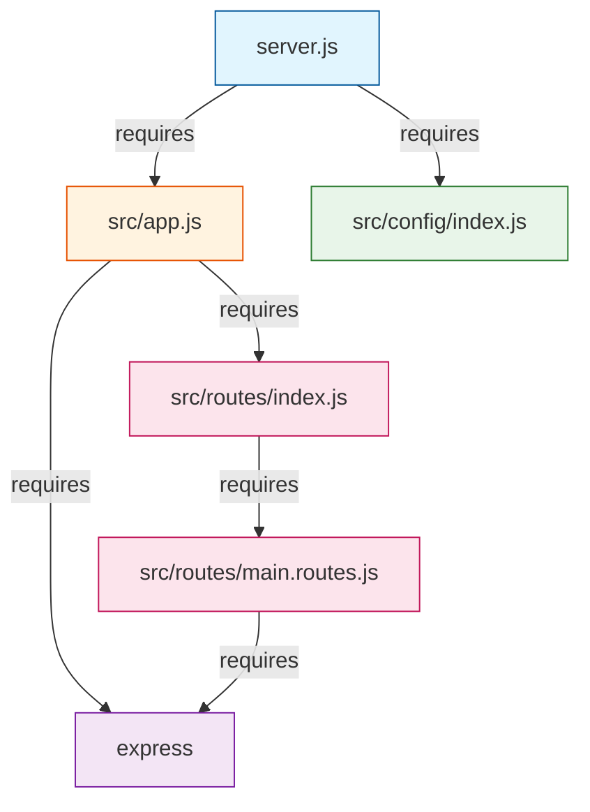
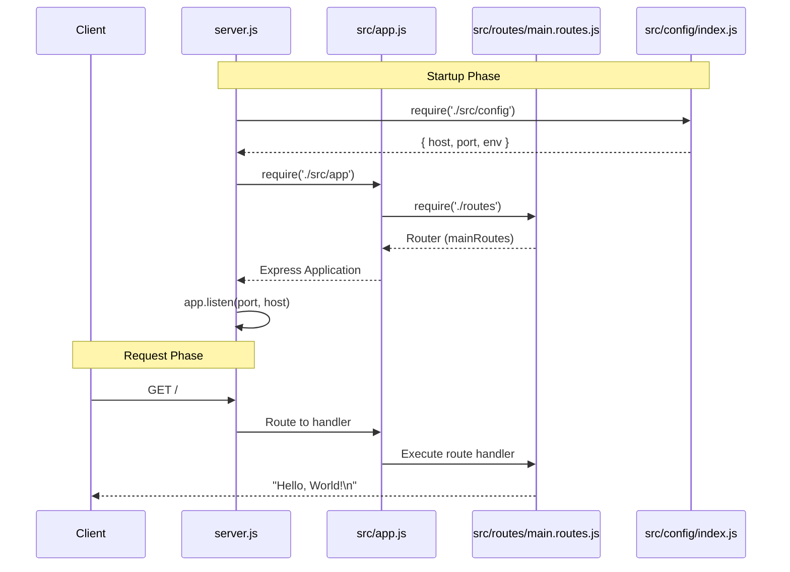

# hao-backprop-test

A Node.js tutorial server demonstrating Express.js integration with multiple HTTP endpoints.

> **Note**: This is a test project for backprop integration.

## Prerequisites

Before running this application, ensure you have the following installed:

| Requirement | Minimum Version | Recommended Version |
|-------------|-----------------|---------------------|
| Node.js | 18.x | 20.19.x (LTS) |
| npm | 8.x | 10.8.x |

### Verify Installation

```bash
node --version
# Expected: v20.x.x or higher

npm --version
# Expected: 10.x.x or higher
```

## Installation

1. Clone the repository:

```bash
git clone <repository-url>
cd hao-backprop-test
```

2. Install dependencies:

```bash
npm install
```

This will install Express.js (^5.1.0) and all required dependencies.

## Usage

### Start the Server

Run the server with default configuration:

```bash
npm start
```

**Expected output:**
```
Server running at http://127.0.0.1:3000/
```

### Custom Configuration

Override default settings using environment variables:

```bash
# Custom host and port
HOST=0.0.0.0 PORT=8080 npm start

# Production mode
NODE_ENV=production npm start

# Combined configuration
HOST=0.0.0.0 PORT=8080 NODE_ENV=production npm start
```

## API Reference

This server exposes two HTTP GET endpoints:

### GET `/`

Returns a greeting message.

**Request:**
```bash
curl -s http://127.0.0.1:3000/
```

**Response:**
- **Status Code:** 200 OK
- **Content-Type:** text/html; charset=utf-8
- **Body:** `Hello, World!\n` (14 characters, includes trailing newline)

**Example:**
```bash
curl -s http://127.0.0.1:3000/
# Output: Hello, World!
```

### GET `/evening`

Returns an evening greeting message.

**Request:**
```bash
curl -s http://127.0.0.1:3000/evening
```

**Response:**
- **Status Code:** 200 OK
- **Content-Type:** text/html; charset=utf-8
- **Body:** `Good evening` (12 characters, no trailing newline)

**Example:**
```bash
curl -s http://127.0.0.1:3000/evening
# Output: Good evening
```

### Health Check

Verify both endpoints are operational:

```bash
curl -s http://127.0.0.1:3000/ && echo " - Root OK"
curl -s http://127.0.0.1:3000/evening && echo " - Evening OK"
```

## Project Structure

```
hao-backprop-test/
├── server.js                    # Entry point - HTTP server binding
├── package.json                 # npm manifest and dependencies
├── package-lock.json            # Dependency lockfile
├── README.md                    # Project documentation (this file)
├── .gitignore                   # Git ignore patterns
└── src/                         # Application source root
    ├── app.js                   # Express application factory
    ├── config/                  # Configuration module
    │   └── index.js             # Environment variable management
    └── routes/                  # Routing surface
        ├── index.js             # Route aggregator (barrel pattern)
        └── main.routes.js       # Route handlers implementation
```

### File Descriptions

| File | Purpose |
|------|---------|
| `server.js` | Entry point that imports the Express app and binds it to the configured host/port |
| `src/app.js` | Express application factory - creates and exports configured Express app with mounted routes |
| `src/config/index.js` | Configuration module - exports `{ host, port, env }` from environment variables |
| `src/routes/index.js` | Route aggregator using barrel pattern - centralizes route exports |
| `src/routes/main.routes.js` | Route handlers - implements GET `/` and GET `/evening` endpoints |

### Module Dependency Graph

The following diagram illustrates the import relationships between modules:


```mermaid
graph TD
    A[server.js] -->|requires| B[src/app.js]
    A -->|requires| C[src/config/index.js]
    B -->|requires| D[src/routes/index.js]
    B -->|requires| E[express]
    D -->|requires| F[src/routes/main.routes.js]
    F -->|requires| E
    
    style A fill:#e1f5fe,stroke:#01579b
    style B fill:#fff3e0,stroke:#e65100
    style C fill:#e8f5e9,stroke:#2e7d32
    style D fill:#fce4ec,stroke:#c2185b
    style F fill:#fce4ec,stroke:#c2185b
    style E fill:#f3e5f5,stroke:#7b1fa2
```

**Legend:**
- **Blue**: Entry point (`server.js`)
- **Orange**: Application factory (`src/app.js`)
- **Green**: Configuration module (`src/config/`)
- **Pink**: Route modules (`src/routes/`)
- **Purple**: External dependency (`express`)

## Environment Variables

The application supports the following environment variables for configuration:

| Variable | Default Value | Description |
|----------|---------------|-------------|
| `HOST` | `'127.0.0.1'` | Server binding address. Use `0.0.0.0` to accept connections from any interface. |
| `PORT` | `3000` | Server binding port number. |
| `NODE_ENV` | `'development'` | Application environment mode (`development`, `production`, `test`). |

### Configuration Examples

**Development (default):**
```bash
npm start
# Binds to http://127.0.0.1:3000/
```

**Production deployment:**
```bash
HOST=0.0.0.0 PORT=80 NODE_ENV=production npm start
# Binds to http://0.0.0.0:80/
```

**Custom port:**
```bash
PORT=8080 npm start
# Binds to http://127.0.0.1:8080/
```

## Architecture

This project follows a modular Express.js architecture with separation of concerns:

```
Request Flow:
Client → server.js → Express App (src/app.js) → Router (src/routes/) → Response
                           ↑
                     Configuration
                   (src/config/index.js)
```

### Design Patterns Used

- **Factory Pattern**: `src/app.js` exports a configured Express app without starting the server, enabling testability
- **Barrel Pattern**: `src/routes/index.js` aggregates route exports for clean imports
- **CommonJS Modules**: Uses `require`/`module.exports` for Node.js compatibility
- **Twelve-Factor App**: Configuration externalized to environment variables

### Request Flow Diagram

The following sequence diagram shows how an HTTP request flows through the application:


```mermaid
sequenceDiagram
    participant Client
    participant server.js
    participant src/app.js
    participant src/routes/main.routes.js
    participant src/config/index.js
    
    Note over server.js,src/config/index.js: Startup Phase
    server.js->>src/config/index.js: require('./src/config')
    src/config/index.js-->>server.js: { host, port, env }
    server.js->>src/app.js: require('./src/app')
    src/app.js->>src/routes/main.routes.js: require('./routes')
    src/routes/main.routes.js-->>src/app.js: Router (mainRoutes)
    src/app.js-->>server.js: Express Application
    server.js->>server.js: app.listen(port, host)
    
    Note over Client,server.js: Request Phase
    Client->>server.js: GET /
    server.js->>src/app.js: Route to handler
    src/app.js->>src/routes/main.routes.js: Execute route handler
    src/routes/main.routes.js-->>Client: "Hello, World!\n"
```

## Dependencies

### Runtime Dependencies

| Package | Version | Purpose |
|---------|---------|---------|
| `express` | ^5.1.0 | Web framework providing HTTP handling, routing, and middleware |

### Dependency Installation

```bash
# Install all dependencies
npm install

# Verify express installation
npm ls express
# Expected: express@5.1.0
```

## Scripts

| Script | Command | Description |
|--------|---------|-------------|
| `start` | `node server.js` | Starts the HTTP server |

## Deployment Guide

This section provides guidance for deploying the application in various environments.

### Local Development

For local development, the default configuration is optimized for developer experience:

```bash
# Start with default settings (localhost only)
npm start

# Enable hot-reload during development (requires nodemon)
npm install --save-dev nodemon
npx nodemon server.js
```

**Development Best Practices:**
- Use `HOST=127.0.0.1` (default) to restrict access to localhost only
- Keep `NODE_ENV=development` for verbose error messages
- Use a port above 1024 to avoid permission issues

### Production Configuration

When deploying to production, configure the following environment variables:

```bash
# Production startup command
HOST=0.0.0.0 PORT=80 NODE_ENV=production node server.js
```

**Production Environment Variables:**

| Variable | Recommended Value | Reason |
|----------|-------------------|--------|
| `HOST` | `0.0.0.0` | Accept connections from all network interfaces |
| `PORT` | `80` or `443` | Standard HTTP/HTTPS ports (or use reverse proxy) |
| `NODE_ENV` | `production` | Enables Express.js production optimizations |

**NODE_ENV=production Benefits:**
- Express.js caches view templates
- Less verbose error messages (security)
- Optimized performance settings
- Reduced memory footprint

### Cloud Hosting Considerations

#### Heroku

```bash
# Procfile content
web: node server.js

# Set environment variables
heroku config:set NODE_ENV=production
heroku config:set HOST=0.0.0.0

# Deploy
git push heroku main
```

> **Note:** Heroku automatically assigns the `PORT` environment variable.

#### Railway

```bash
# railway.json (optional)
{
  "build": {
    "builder": "NIXPACKS"
  },
  "deploy": {
    "startCommand": "node server.js"
  }
}
```

> **Note:** Railway automatically sets `PORT`. Configure `HOST=0.0.0.0` in the dashboard.

#### Vercel

For serverless deployment, this application would require adaptation as it's designed as a long-running server. Consider using Vercel's serverless functions or a different hosting platform for traditional server deployments.

### Docker Deployment

While this project does not include a Dockerfile, here's a reference configuration for containerization:

```dockerfile
# Reference Dockerfile (not included in project)
FROM node:20-alpine

WORKDIR /app
COPY package*.json ./
RUN npm ci --only=production
COPY . .

ENV HOST=0.0.0.0
ENV PORT=3000
ENV NODE_ENV=production

EXPOSE 3000
CMD ["node", "server.js"]
```

**Docker Commands:**
```bash
# Build image
docker build -t hao-backprop-test .

# Run container
docker run -p 3000:3000 -e NODE_ENV=production hao-backprop-test
```

### Health Check Endpoint

Use the root endpoint for health checks in load balancers and orchestration systems:

```bash
# Health check command
curl -sf http://localhost:3000/ || exit 1
```

**Kubernetes Liveness Probe Example:**
```yaml
livenessProbe:
  httpGet:
    path: /
    port: 3000
  initialDelaySeconds: 5
  periodSeconds: 10
```

## Security Considerations

This section documents security-related information for the application.

### Known Vulnerabilities

The application's dependency tree includes a known vulnerability in the `qs` package:

| Package | Affected Versions | Severity | Advisory |
|---------|-------------------|----------|----------|
| `qs` | < 6.14.1 | High | [GHSA-6rw7-vpxm-498p](https://github.com/advisories/GHSA-6rw7-vpxm-498p) |

**Vulnerability Details:**
- **Type:** Denial of Service (DoS) / Memory Exhaustion
- **Impact:** Malicious query strings could cause excessive memory consumption
- **Status:** Transitive dependency through Express.js

### Remediation Steps

To check for and resolve vulnerabilities:

```bash
# Check for vulnerabilities
npm audit

# Apply automatic fixes (when available)
npm audit fix

# Force fix (may include breaking changes)
npm audit fix --force
```

> **Note:** Express.js 5.x is still in active development. Monitor for updates that resolve transitive dependency vulnerabilities.

### Production Security Recommendations

#### Environment Variable Protection

```bash
# Never commit sensitive values - use environment files
echo ".env" >> .gitignore

# Use a process manager to inject environment variables
# Example with PM2:
pm2 start server.js --env production
```

**Best Practices:**
- Store secrets in environment variables, never in code
- Use a secrets manager (AWS Secrets Manager, HashiCorp Vault) for sensitive data
- Restrict access to production environment configurations

#### HTTPS Configuration

This server does not include built-in HTTPS support. For production deployments:

1. **Use a Reverse Proxy** (Recommended)
   ```bash
   # Nginx configuration example
   server {
       listen 443 ssl;
       ssl_certificate /path/to/cert.pem;
       ssl_certificate_key /path/to/key.pem;
       
       location / {
           proxy_pass http://127.0.0.1:3000;
           proxy_set_header Host $host;
           proxy_set_header X-Real-IP $remote_addr;
       }
   }
   ```

2. **Use a Cloud Load Balancer** - Most cloud providers offer managed SSL termination

3. **Use a CDN** - Services like Cloudflare provide free SSL/TLS

#### Additional Security Headers

Consider adding security headers via middleware for production:

```javascript
// Example: helmet middleware (not included in project)
// npm install helmet
const helmet = require('helmet');
app.use(helmet());
```

#### Rate Limiting

For production deployments exposed to the internet, implement rate limiting:

```javascript
// Example: express-rate-limit (not included in project)
// npm install express-rate-limit
const rateLimit = require('express-rate-limit');
app.use(rateLimit({
  windowMs: 15 * 60 * 1000, // 15 minutes
  max: 100 // limit each IP to 100 requests per windowMs
}));
```

## Troubleshooting

### Common Issues

**Port already in use:**
```bash
# Error: listen EADDRINUSE: address already in use
# Solution: Use a different port
PORT=3001 npm start
```

**Permission denied on port 80:**
```bash
# Error: listen EACCES: permission denied
# Solution: Use a port above 1024 or run with elevated privileges
PORT=8080 npm start
```

**Module not found:**
```bash
# Error: Cannot find module 'express'
# Solution: Install dependencies
npm install
```

### Express.js 5 Specific Issues

This project uses Express.js 5.x, which introduces several changes from Express 4.x:

**Deprecated middleware warnings:**
```bash
# If you see: "express.json() is deprecated"
# This is expected in Express 5 - use built-in body parsing:
app.use(express.json());  # Still valid but syntax may change
```

**Router behavior differences:**
```bash
# Express 5 handles route parameter matching more strictly
# Ensure route parameters follow the new patterns:
# Express 4: router.get('/user/:id', ...)
# Express 5: Same syntax, but stricter matching rules
```

**Promise rejection handling:**
```javascript
// Express 5 automatically catches rejected promises in route handlers
// No need for explicit try-catch for async errors:
router.get('/async', async (req, res) => {
  const data = await someAsyncOperation(); // Errors auto-handled
  res.json(data);
});
```

**Path route matching changes:**
```bash
# Express 5 uses a new path-to-regexp version
# Some regex patterns may behave differently
# Test routes thoroughly when migrating from Express 4
```

**Query string parsing:**
```bash
# Express 5 uses updated qs library
# Deep nested query parameters may parse differently
# Test query parsing if your application uses complex queries
```

**Migration Resources:**
- [Express.js 5.x Migration Guide](https://expressjs.com/en/guide/migrating-5.html)
- [Express.js GitHub Releases](https://github.com/expressjs/express/releases)

## License

This project is licensed under the MIT License.

## Author

hao-backprop-test contributors

---

*This is a tutorial project demonstrating Node.js server development with Express.js framework.*
