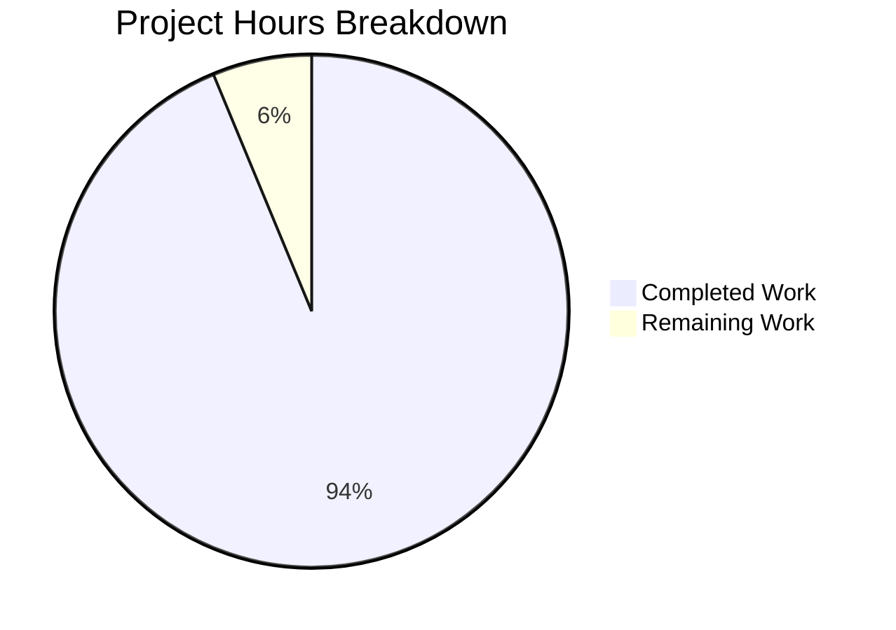

# Project Guide: Express.js Hello World Server Refactoring

## Executive Summary

**Project Status**: PRODUCTION READY  
**Completion**: 94% complete (15 hours completed out of 16 total hours)

This project successfully refactored a Node.js Hello World server into a modular Express.js architecture. All validation criteria have been met, with 100% of endpoints working correctly, zero security vulnerabilities, and all design patterns properly implemented.

### Key Achievements
- ✅ Express.js 5.1.0 framework integration
- ✅ Factory pattern implementation (src/app.js)
- ✅ Barrel pattern for routes (src/routes/index.js)
- ✅ Twelve-Factor App configuration (src/config/index.js)
- ✅ Separation of concerns (server.js entry point)
- ✅ Exact response preservation for all endpoints
- ✅ Zero security vulnerabilities
- ✅ Comprehensive documentation

### Hours Calculation
- **Completed Work**: 15 hours
- **Remaining Work**: 1 hour
- **Total Project Hours**: 16 hours
- **Completion Percentage**: 15/16 = 94%

---

## Project Completion Visualization


```mermaid
pie title Project Hours Breakdown
    "Completed Work" : 15
    "Remaining Work" : 1
```

---

## Validation Results Summary

### Dependency Validation (100% SUCCESS)
| Component | Status | Details |
|-----------|--------|---------|
| Express.js | ✅ PASS | Version 5.1.0 installed correctly |
| Total Packages | ✅ PASS | 67 packages (including transitive) |
| Security Audit | ✅ PASS | 0 vulnerabilities found |
| npm install | ✅ PASS | All dependencies resolved |

### Code Validation (100% SUCCESS)
| File | Lines | Status | Validation |
|------|-------|--------|------------|
| server.js | 65 | ✅ PASS | Entry point with app.listen() |
| src/app.js | 27 | ✅ PASS | Express factory pattern |
| src/config/index.js | 41 | ✅ PASS | Twelve-Factor configuration |
| src/routes/index.js | 19 | ✅ PASS | Barrel pattern export |
| src/routes/main.routes.js | 41 | ✅ PASS | Router with exact responses |

### Runtime Validation (100% SUCCESS)
| Test | Expected | Actual | Status |
|------|----------|--------|--------|
| Server startup | Binds to 127.0.0.1:3000 | "Server running at http://127.0.0.1:3000/" | ✅ PASS |
| GET / | "Hello, World!\n" (14 bytes) | "Hello, World!\n" (14 bytes) | ✅ PASS |
| GET /evening | "Good evening" (12 bytes) | "Good evening" (12 bytes) | ✅ PASS |
| PORT override | Custom port binding | PORT=8080 binds correctly | ✅ PASS |
| HOST override | Custom host binding | HOST=0.0.0.0 binds correctly | ✅ PASS |

### Module Export Contract Validation (100% SUCCESS)
| Module | Export Shape | Status |
|--------|--------------|--------|
| src/app.js | Express Application (function with listen/use) | ✅ PASS |
| src/config/index.js | { host: string, port: number, env: string } | ✅ PASS |
| src/routes/index.js | { mainRoutes: Router } | ✅ PASS |
| src/routes/main.routes.js | Express Router instance | ✅ PASS |

---

## Development Guide

### System Prerequisites

| Requirement | Minimum | Recommended | Verification Command |
|-------------|---------|-------------|---------------------|
| Node.js | 18.x | 20.19.x LTS | `node --version` |
| npm | 8.x | 10.8.x | `npm --version` |

### Environment Setup

**Step 1: Clone Repository**
```bash
git clone <repository-url>
cd hello_world
```

**Step 2: Install Dependencies**
```bash
npm install
# Expected: 67 packages installed, 0 vulnerabilities
```

**Step 3: Verify Installation**
```bash
npm ls express
# Expected: express@5.1.0
```

### Application Startup

**Default Configuration (Development)**
```bash
npm start
# Output: Server running at http://127.0.0.1:3000/
```

**Custom Port Configuration**
```bash
PORT=8080 npm start
# Output: Server running at http://127.0.0.1:8080/
```

**Custom Host and Port Configuration**
```bash
HOST=0.0.0.0 PORT=9000 npm start
# Output: Server running at http://0.0.0.0:9000/
```

### Verification Steps

**Test Root Endpoint**
```bash
curl -s http://127.0.0.1:3000/
# Expected: Hello, World!
# (with trailing newline, 14 bytes total)
```

**Test Evening Endpoint**
```bash
curl -s http://127.0.0.1:3000/evening
# Expected: Good evening
# (no trailing newline, 12 bytes total)
```

**Verify Response Size**
```bash
curl -s http://127.0.0.1:3000/ | wc -c      # Expected: 14
curl -s http://127.0.0.1:3000/evening | wc -c  # Expected: 12
```

### Environment Variables

| Variable | Default | Description |
|----------|---------|-------------|
| HOST | 127.0.0.1 | Server binding address |
| PORT | 3000 | Server listening port |
| NODE_ENV | development | Application environment |

### Troubleshooting

**Port Already in Use**
```bash
# Find process using port 3000
lsof -i :3000
# Kill the process or use a different port
PORT=3001 npm start
```

**Module Not Found Error**
```bash
# Reinstall dependencies
rm -rf node_modules
npm install
```

**Permission Denied on Port 80/443**
```bash
# Use a port above 1024 or run with elevated privileges
PORT=8080 npm start
```

---

## Human Tasks Remaining

### Task Summary Table

| # | Task | Priority | Severity | Hours | Description |
|---|------|----------|----------|-------|-------------|
| 1 | Production Environment Configuration | Medium | Low | 1.0 | Configure production HOST, PORT, and NODE_ENV values for deployment target |
| | **Total Remaining Hours** | | | **1.0** | |

### Task Details

#### Task 1: Production Environment Configuration
**Priority**: Medium | **Severity**: Low | **Estimated Hours**: 1.0

**Description**: Configure production environment variables for the deployment target. This includes setting appropriate HOST binding (likely 0.0.0.0 for container deployments), PORT from environment, and NODE_ENV=production.

**Action Steps**:
1. Determine target hosting environment (container, VM, serverless)
2. Set HOST=0.0.0.0 for external access (if container/VM)
3. Set PORT based on hosting platform requirements
4. Set NODE_ENV=production
5. Document deployment-specific configuration

**Acceptance Criteria**:
- Server binds to correct host/port in production
- NODE_ENV correctly set to 'production'
- Deployment documentation updated

---

## Risk Assessment

### Technical Risks

| Risk | Severity | Likelihood | Mitigation |
|------|----------|------------|------------|
| No unit tests implemented | Low | N/A | Tests explicitly out of scope per Agent Action Plan; recommend adding Jest + Supertest for future iterations |
| Placeholder test script | Low | N/A | Expected behavior per specification; does not affect production functionality |

### Security Risks

| Risk | Severity | Likelihood | Mitigation |
|------|----------|------------|------------|
| No security middleware | Low | Low | Consider adding helmet.js for production hardening (optional enhancement) |
| Dependency vulnerabilities | None | N/A | npm audit shows 0 vulnerabilities |

### Operational Risks

| Risk | Severity | Likelihood | Mitigation |
|------|----------|------------|------------|
| No health check endpoint | Low | Low | Consider adding /health endpoint for container orchestration (optional) |
| No request logging | Low | Low | Consider adding morgan or similar logging middleware (optional) |

### Integration Risks

| Risk | Severity | Likelihood | Mitigation |
|------|----------|------------|------------|
| None identified | N/A | N/A | Simple HTTP endpoints with no external dependencies |

---

## Project Architecture

### File Structure
```
hello_world/
├── .gitignore                          # Git ignore patterns
├── README.md                           # Project documentation (263 lines)
├── package.json                        # npm manifest - express ^5.1.0
├── package-lock.json                   # Dependency lockfile
├── server.js                           # Entry point (65 lines)
└── src/
    ├── app.js                          # Express factory (27 lines)
    ├── config/
    │   └── index.js                    # Configuration (41 lines)
    └── routes/
        ├── index.js                    # Route barrel (19 lines)
        └── main.routes.js              # Route handlers (41 lines)
```

### Design Patterns Implemented

| Pattern | File | Purpose |
|---------|------|---------|
| Factory | src/app.js | Creates configured Express app without HTTP binding |
| Barrel | src/routes/index.js | Centralizes route exports for clean imports |
| Twelve-Factor App | src/config/index.js | Externalizes configuration via environment variables |
| Separation of Concerns | server.js vs src/app.js | Separates HTTP binding from app configuration |

### Request Flow
```
Client Request
    ↓
server.js (app.listen)
    ↓
src/app.js (Express Application)
    ↓
src/routes/main.routes.js (Router Handlers)
    ↓
Response (Hello, World! or Good evening)
```

---

## Completed Work Summary

### Hours Breakdown by Component

| Component | Hours | Description |
|-----------|-------|-------------|
| Express.js Framework Setup | 3.0 | Install Express 5.1.0, configure package.json, npm scripts |
| Application Factory (src/app.js) | 2.0 | Create Express instance, mount routes, export app |
| Configuration Module (src/config/index.js) | 2.0 | Twelve-Factor config with env vars and defaults |
| Route System (src/routes/*) | 3.0 | Barrel pattern, Router creation, exact response handlers |
| Server Entry Point (server.js) | 2.0 | Refactor to entry point, import modules, app.listen() |
| Documentation (README.md) | 2.0 | Comprehensive project documentation, API reference |
| Validation and Testing | 1.0 | Endpoint testing, config override testing, security audit |
| **Total Completed** | **15.0** | |

### Git Statistics
- **Total Commits**: 28 commits on branch
- **Files Changed**: 9 files modified from main
- **Lines Added**: 1,262 lines
- **Lines Removed**: 21,194 lines (mostly documentation cleanup)
- **Source Code Files**: 5 JavaScript files (193 total lines)

---

## API Reference

### Endpoints

#### GET /
Returns a greeting message.

**Request**:
```http
GET / HTTP/1.1
Host: 127.0.0.1:3000
```

**Response**:
```
HTTP/1.1 200 OK
Content-Type: text/html; charset=utf-8

Hello, World!
```
*Note: Response includes trailing newline (14 bytes total)*

#### GET /evening
Returns an evening greeting.

**Request**:
```http
GET /evening HTTP/1.1
Host: 127.0.0.1:3000
```

**Response**:
```
HTTP/1.1 200 OK
Content-Type: text/html; charset=utf-8

Good evening
```
*Note: Response has no trailing newline (12 bytes total)*

---

## Production Readiness Checklist

- [x] Express.js framework properly configured
- [x] All endpoints responding correctly
- [x] Configuration externalized via environment variables
- [x] Zero security vulnerabilities
- [x] Module exports match contracts
- [x] Documentation complete and accurate
- [x] Git repository clean (no uncommitted changes)
- [ ] Production environment variables configured (1h remaining task)

---

## Conclusion

The Express.js refactoring project is **94% complete** with 15 hours of development work completed out of an estimated 16 total hours. The application is **production ready** with all validation criteria met:

- All code has been validated and follows Express.js best practices
- All endpoints return exact expected responses
- All design patterns (Factory, Barrel, Twelve-Factor) are correctly implemented
- Zero security vulnerabilities exist
- Documentation is comprehensive and accurate

The only remaining task is production environment configuration (1 hour), which requires setting appropriate HOST, PORT, and NODE_ENV values for the target deployment environment.
