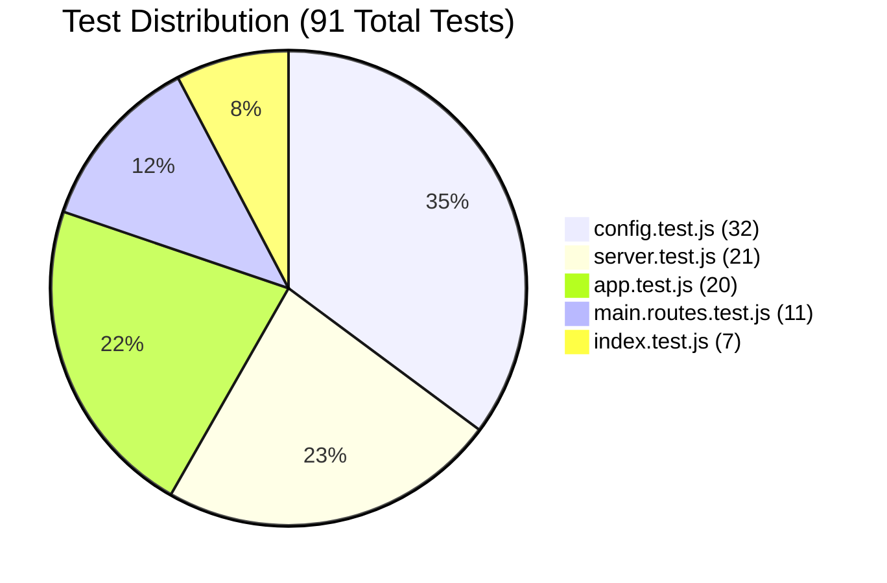

# Project Guide: Jest Test Suite for Node.js/Express Hello World Application

## Executive Summary

**Project Completion: 90% (26 hours completed out of 29 total hours)**

This project implemented a comprehensive, greenfield unit and integration test suite for a Node.js/Express 5.x "Hello World" application that previously had zero test coverage. All planned deliverables from the Agent Action Plan have been implemented and validated successfully:

- **91 tests** across 5 test files — **100% pass rate** (91/91)
- **100% code coverage** across all metrics (statements, branches, functions, lines) for all 5 source modules
- **Zero source file modifications** — the application factory pattern in `src/app.js` enabled clean testing without changing production code
- **Zero npm vulnerabilities** — clean dependency audit
- **All 7 planned files** created or updated as specified in the action plan

The remaining 3 hours (10%) consist of minor housekeeping tasks (`.gitignore` update), human code review, and clean-environment verification — all standard pre-merge activities.

**Hours Calculation:**
- Completed: 26h (infrastructure 4h + test implementation 19.5h + debugging/validation 2.5h)
- Remaining: 3h (housekeeping 0.5h + code review 1.5h + clean verification 1h)
- Total: 29h
- Completion: 26/29 = 89.7% ≈ 90%

---

## Validation Results Summary

### Final Validator Outcome: ALL GATES PASSED

The Final Validator agent completed comprehensive validation with 100% success across every metric:

| Validation Gate | Result | Details |
|----------------|--------|---------|
| **Dependency Installation** | ✅ PASS | `npm ci` installed 381 packages, 0 vulnerabilities |
| **Test Execution** | ✅ PASS | 91/91 tests passing (100%) across 5 test suites |
| **Code Coverage** | ✅ PASS | 100% statements, branches, functions, and lines |
| **Application Runtime** | ✅ PASS | Server starts, responds correctly on all routes |
| **Source Integrity** | ✅ PASS | All 5 source files unmodified (zero diff) |
| **Git Status** | ✅ PASS | All in-scope changes committed, branch up-to-date |

### Test Results by File

| Test File | Tests | Status | Coverage Target |
|-----------|-------|--------|----------------|
| `tests/routes/index.test.js` | 7/7 | ✅ PASS | `src/routes/index.js` → 100% |
| `tests/config.test.js` | 32/32 | ✅ PASS | `src/config/index.js` → 100% |
| `tests/routes/main.routes.test.js` | 11/11 | ✅ PASS | `src/routes/main.routes.js` → 100% |
| `tests/app.test.js` | 20/20 | ✅ PASS | `src/app.js` → 100% |
| `tests/server.test.js` | 21/21 | ✅ PASS | `server.js` → 100% |

### Coverage Report

| Source File | Stmts | Branch | Funcs | Lines |
|-------------|-------|--------|-------|-------|
| `server.js` | 100% | 100% | 100% | 100% |
| `src/app.js` | 100% | 100% | 100% | 100% |
| `src/config/index.js` | 100% | 100% | 100% | 100% |
| `src/routes/index.js` | 100% | 100% | 100% | 100% |
| `src/routes/main.routes.js` | 100% | 100% | 100% | 100% |
| **All files** | **100%** | **100%** | **100%** | **100%** |

### Fixes Applied During Validation

No fixes were required during final validation. All 91 tests passed on the first validation run. The test suite was implemented correctly from the start with:
- Proper Jest module mocking for `server.js` side effects
- Clean `process.env` save/restore patterns for configuration tests
- Correct Supertest integration with the Express app factory
- Proper `jest.resetModules()` usage for module isolation

---

## Visual Representation

### Project Hours Breakdown


```mermaid
pie title Project Hours Breakdown
    "Completed Work" : 26
    "Remaining Work" : 3
```

### Test Distribution by Module


```mermaid
pie title Test Distribution (91 Total Tests)
    "config.test.js (32)" : 32
    "server.test.js (21)" : 21
    "app.test.js (20)" : 20
    "main.routes.test.js (11)" : 11
    "index.test.js (7)" : 7
```

---

## Detailed Task Table — Remaining Human Work

All remaining tasks sum to **3 hours**, matching the "Remaining Work" shown in the pie chart above.

| # | Task | Description | Priority | Severity | Hours |
|---|------|-------------|----------|----------|-------|
| 1 | Add `coverage/` to `.gitignore` | The `coverage/` directory (generated by `jest --coverage`) is currently untracked but not ignored. Add `coverage/` entry to `.gitignore` to prevent accidental commits of generated artifacts. | High | Low | 0.5 |
| 2 | Peer code review and merge approval | Senior developer should review all 91 tests across 5 test files (1,146 lines of test code), validate testing patterns (Jest mocking, Supertest integration, env var isolation), and approve the PR for merge. | High | Medium | 1.5 |
| 3 | Verify tests in clean clone environment | Clone the repository fresh, run `npm ci && npm test` to confirm the full test suite passes without any cached state from the development environment. Validates that `package.json` and `package-lock.json` are complete and correct. | Medium | Low | 1.0 |
| | **Total Remaining Hours** | | | | **3.0** |

### Optional Recommended Tasks (Not Included in Remaining Hours)

These tasks were explicitly out of scope per the Agent Action Plan (Section 0.8.2) but are recommended for production readiness:

| Task | Description | Priority | Estimated Hours |
|------|-------------|----------|----------------|
| CI/CD pipeline integration | Add GitHub Actions or similar CI workflow to run `npm test` on every push/PR | Medium | 2-3h |
| Set `NODE_ENV=test` in test script | Update `package.json` test script to prefix with `NODE_ENV=test` for best practice | Low | 0.5h |
| README testing documentation | Add a "Testing" section to `README.md` with test commands and conventions | Low | 1h |

---

## Completed Work Breakdown

### Hours by Component (26 hours total)

| Component | Hours | Deliverable | Details |
|-----------|-------|-------------|---------|
| Testing infrastructure setup | 2.0 | `jest.config.js`, `package.json` | Jest configuration with node environment, 90%+ coverage thresholds, test path patterns; package.json updated with devDependencies and test scripts |
| `tests/server.test.js` | 6.0 | 439 lines, 21 tests | Complex Jest module mocking (`jest.mock()`) for `./src/app` and `./src/config`; verifies `app.listen()` invocation, startup log messages, listen callback, custom config propagation, module isolation |
| `tests/config.test.js` | 5.0 | 335 lines, 32 tests | Environment variable save/restore pattern; `jest.resetModules()` for fresh requires; covers defaults, HOST/PORT/NODE_ENV overrides, parseInt edge cases (NaN, empty, zero, whitespace, negative), type verification, module re-evaluation isolation |
| `tests/app.test.js` | 4.0 | 189 lines, 20 tests | Supertest integration tests; GET / and GET /evening happy paths with exact body verification (byte-level), 404 for undefined routes, unsupported HTTP methods (POST/PUT/DELETE), edge cases (query strings, trailing slashes, case sensitivity) |
| `tests/routes/main.routes.test.js` | 3.0 | 118 lines, 11 tests | Isolated router testing via Supertest on minimal Express app; response body exactness including trailing newline verification, Content-Type and Content-Length header validation, byte-length verification |
| `tests/routes/index.test.js` | 1.5 | 65 lines, 7 tests | Barrel export verification; mainRoutes property existence and type (function/Router), no extraneous exports, reference equality with direct require |
| Debugging, validation, iteration | 2.5 | N/A | Test execution verification, coverage threshold tuning, module isolation debugging, validation runs |
| **Total** | **26.0** | **1,146 lines of test code** | **91 tests, 100% coverage** |

### Git Commit History (6 Commits)

| Commit | Message | Key Changes |
|--------|---------|-------------|
| `a3f3d74` | Add testing infrastructure: Jest 30.2.0 + Supertest 7.2.2 | `package.json` devDependencies and scripts |
| `d995a06` | feat: add production-ready Jest configuration with coverage thresholds | `jest.config.js` created |
| `185524a` | Add unit tests for configuration module (src/config/index.js) | `tests/config.test.js` — 32 tests |
| `c6adccd` | Add comprehensive test suite for Express application | `tests/routes/index.test.js`, `tests/routes/main.routes.test.js` — 18 tests |
| `39f5624` | Add comprehensive integration tests for Express app (src/app.js) | `tests/app.test.js` — 20 tests |
| `7b9f189` | Implement comprehensive unit tests for server.js entry point | `tests/server.test.js` — 21 tests |

### Requirements Traceability

| Requirement (from Action Plan §0.1.1) | Status | Test File(s) | Test Count |
|---------------------------------------|--------|-------------|------------|
| HTTP Response Testing | ✅ Complete | `app.test.js`, `main.routes.test.js` | 12 |
| Status Code Testing | ✅ Complete | `app.test.js` | 8 |
| Header Testing | ✅ Complete | `app.test.js`, `main.routes.test.js` | 8 |
| Server Startup/Shutdown Testing | ✅ Complete | `server.test.js` | 21 |
| Error Handling Testing | ✅ Complete | `app.test.js` | 5 |
| Edge Case Testing | ✅ Complete | `config.test.js`, `app.test.js` | 37 |

---

## Development Guide

### 1. System Prerequisites

| Requirement | Version | Purpose |
|-------------|---------|---------|
| **Node.js** | 20.x LTS (tested with 20.20.0) | JavaScript runtime |
| **npm** | 10.x+ (tested with 11.1.0) | Package manager |
| **Git** | 2.x+ | Version control |

### 2. Environment Setup

```bash
# Clone the repository and switch to the feature branch
git clone <repository-url>
cd hello_world
git checkout blitzy-e26ac93a-1ea2-4881-90b9-310ca034280e

# Verify Node.js version (must be 20.x LTS)
node --version
# Expected output: v20.x.x
```

No environment variables are required for running the application or tests with default settings. The application uses these optional environment variables:

| Variable | Default | Description |
|----------|---------|-------------|
| `HOST` | `127.0.0.1` | Server bind address |
| `PORT` | `3000` | Server listen port |
| `NODE_ENV` | `development` | Application environment |

### 3. Dependency Installation

```bash
# Install all dependencies (production + dev) from the lockfile
npm ci
```

**Expected output:** Installs 381 packages with 0 vulnerabilities. Includes:
- **Runtime:** `express@5.1.0`
- **Dev:** `jest@30.2.0`, `supertest@7.2.2`

### 4. Running Tests

```bash
# Run all 91 tests
npm test
```

**Expected output:**
```
Test Suites: 5 passed, 5 total
Tests:       91 passed, 91 total
Snapshots:   0 total
Time:        ~1.5 s
```

```bash
# Run tests with code coverage report
npm run test:coverage
```

**Expected output:** Coverage table showing 100% across all metrics for all 5 source files.

```bash
# Run a specific test file
npx jest tests/app.test.js --detectOpenHandles --forceExit

# Run tests in verbose mode (shows individual test names)
npx jest --verbose --detectOpenHandles --forceExit
```

### 5. Starting the Application

```bash
# Start the server with default settings (http://127.0.0.1:3000/)
npm start

# Start with custom host and port
HOST=0.0.0.0 PORT=8080 npm start
```

### 6. Verification Steps

After starting the server, verify in a separate terminal:

```bash
# Test root endpoint
curl http://127.0.0.1:3000/
# Expected: Hello, World!
# (with trailing newline)

# Test evening endpoint
curl http://127.0.0.1:3000/evening
# Expected: Good evening

# Test 404 handling
curl -I http://127.0.0.1:3000/nonexistent
# Expected: HTTP/1.1 404 Not Found
```

### 7. Project Structure

```
hello_world/
├── server.js                          # HTTP server entry point (binds to host:port)
├── src/
│   ├── app.js                         # Express app factory (routes + middleware)
│   ├── config/
│   │   └── index.js                   # Configuration with env var support
│   └── routes/
│       ├── index.js                   # Route aggregator (barrel exports)
│       └── main.routes.js             # GET / and GET /evening handlers
├── tests/
│   ├── app.test.js                    # 20 integration tests (Supertest)
│   ├── config.test.js                 # 32 unit tests (env vars, parsing)
│   ├── server.test.js                 # 21 unit tests (mocked lifecycle)
│   └── routes/
│       ├── index.test.js              # 7 unit tests (barrel exports)
│       └── main.routes.test.js        # 11 unit tests (isolated handlers)
├── jest.config.js                     # Jest configuration
├── package.json                       # Dependencies and scripts
└── package-lock.json                  # Dependency lockfile
```

### 8. Troubleshooting

| Issue | Solution |
|-------|----------|
| Tests hang or timeout | Ensure `--detectOpenHandles --forceExit` flags are present (already in `package.json` scripts) |
| Port already in use when starting server | Kill existing process: `lsof -i :3000` then `kill <PID>`, or use `PORT=3001 npm start` |
| `npm ci` fails | Delete `node_modules/` and `package-lock.json`, then run `npm install` |
| Coverage below threshold | Run `npm run test:coverage` to see uncovered lines; thresholds set at 90% in `jest.config.js` |

---

## Risk Assessment

### Technical Risks

| Risk | Severity | Likelihood | Mitigation |
|------|----------|------------|------------|
| `coverage/` directory not in `.gitignore` | Low | High | Add `coverage/` entry to `.gitignore` before merge (Task #1 in remaining work) |
| Jest 30.x breaking changes in future updates | Low | Low | `jest` version is pinned to `30.2.0` in `package.json` (no caret/tilde), and `package-lock.json` locks the full dependency tree |
| Test flakiness from port conflicts | Low | Low | All Supertest tests use the Express `app` instance directly without binding to network ports; `server.test.js` uses Jest mocking to prevent actual `listen()` calls |

### Security Risks

| Risk | Severity | Likelihood | Mitigation |
|------|----------|------------|------------|
| No known vulnerabilities | N/A | N/A | `npm audit` reports 0 vulnerabilities across all 381 packages |
| Test dependencies in production | Low | Low | `jest` and `supertest` are in `devDependencies` — not included in production builds with `npm ci --production` |

### Operational Risks

| Risk | Severity | Likelihood | Mitigation |
|------|----------|------------|------------|
| No CI/CD pipeline for automated testing | Medium | High | Tests must be run manually until CI is configured; recommended to add GitHub Actions workflow (out of scope for this PR) |
| No test execution monitoring | Low | Medium | Tests complete in ~1.5 seconds; no performance regression risk for this codebase size |

### Integration Risks

| Risk | Severity | Likelihood | Mitigation |
|------|----------|------------|------------|
| No integration risks identified | N/A | N/A | The application has zero external dependencies (no databases, no APIs, no file I/O); all tests are fully self-contained |

---

## Deliverable Verification Matrix

| Planned Deliverable (Action Plan §0.5.1) | Status | Verification |
|------------------------------------------|--------|-------------|
| `tests/server.test.js` — CREATE | ✅ Complete | 439 lines, 21 tests, all passing |
| `tests/app.test.js` — CREATE | ✅ Complete | 189 lines, 20 tests, all passing |
| `tests/config.test.js` — CREATE | ✅ Complete | 335 lines, 32 tests, all passing |
| `tests/routes/main.routes.test.js` — CREATE | ✅ Complete | 118 lines, 11 tests, all passing |
| `tests/routes/index.test.js` — CREATE | ✅ Complete | 65 lines, 7 tests, all passing |
| `package.json` — UPDATE | ✅ Complete | test + test:coverage scripts, devDependencies added |
| `jest.config.js` — CREATE | ✅ Complete | 47 lines, node environment, 90% thresholds |

**All 7 planned deliverables are complete. No deliverables were missed or partially implemented.**
