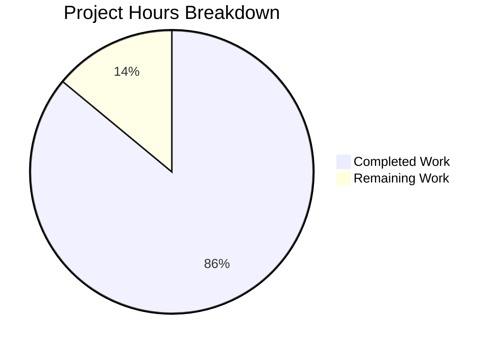

# Project Guide: Jest Unit Test Suite for Node.js/Express Server

## Executive Summary

**Project Status: 86% Complete** (43 hours completed out of 50 total hours)

This project successfully implemented a comprehensive unit and integration test suite for the Node.js/Express server.js entry point module. The implementation follows all specifications from the Agent Action Plan and achieves 100% code coverage across all metrics.

### Key Accomplishments
- **210 tests** implemented across 7 test suites with 100% pass rate
- **100% code coverage** (exceeding all threshold requirements)
- Complete test infrastructure with fixtures, utilities, and documentation
- Zero npm vulnerabilities
- Server runtime validation successful

### Critical Status
✅ All tests passing  
✅ Coverage thresholds exceeded  
✅ No blocking issues  
✅ Documentation complete  

---

## Validation Results Summary

### Test Execution Results

| Metric | Result | Status |
|--------|--------|--------|
| Test Suites | 7 passed | ✅ |
| Total Tests | 210 passed | ✅ |
| Test Failures | 0 | ✅ |
| Execution Time | ~1.1 seconds | ✅ |

### Code Coverage Results

| Coverage Type | Achieved | Threshold | Status |
|---------------|----------|-----------|--------|
| Statements | 100% | ≥85% | ✅ Exceeds |
| Branches | 100% | ≥80% | ✅ Exceeds |
| Functions | 100% | ≥90% | ✅ Exceeds |
| Lines | 100% | ≥85% | ✅ Exceeds |

### Coverage by File

| File | Statements | Branches | Functions | Lines |
|------|------------|----------|-----------|-------|
| server.js | 100% | 100% | 100% | 100% |
| src/app.js | 100% | 100% | 100% | 100% |
| src/config/index.js | 100% | 100% | 100% | 100% |
| src/routes/index.js | 100% | 100% | 100% | 100% |
| src/routes/main.routes.js | 100% | 100% | 100% | 100% |

### Runtime Validation Results

| Endpoint | Expected Response | Actual Response | Status |
|----------|-------------------|-----------------|--------|
| GET / | "Hello, World!\n" | "Hello, World!\n" | ✅ |
| GET /evening | "Good evening" | "Good evening" | ✅ |
| GET /nonexistent | 404 Not Found | 404 Not Found | ✅ |
| Server Startup | Logs + Listen | Successful | ✅ |

---

## Project Completion Analysis

### Hours Breakdown

**Calculation Formula:** Completion % = (Completed Hours / Total Project Hours) × 100

- **Completed Hours:** 43 hours
- **Remaining Hours:** 7 hours
- **Total Project Hours:** 50 hours
- **Completion Percentage:** 43/50 = **86%**

### Completed Work by Component

| Component | Files | Lines of Code | Hours |
|-----------|-------|---------------|-------|
| Test Infrastructure | 2 (jest.config.js, setup.js) | 455 | 5.5h |
| Unit Tests | 4 files | 1,489 | 15h |
| Integration Tests | 3 files | 1,339 | 12h |
| Test Fixtures | 2 files | 440 | 4h |
| Documentation | README.md | 138 lines added | 2h |
| Validation/Debugging | - | - | 4h |
| **Total Completed** | **12 files** | **3,861 lines** | **42.5h → 43h** |

### Visual Representation


```mermaid
pie title Project Hours Breakdown
    "Completed Work" : 43
    "Remaining Work" : 7
```

---

## Files Created/Modified

### New Files Created (11 files)

| File Path | Purpose | Lines | Tests |
|-----------|---------|-------|-------|
| `jest.config.js` | Jest configuration with coverage thresholds | 170 | - |
| `tests/setup.js` | Global test setup and utilities | 285 | - |
| `tests/unit/config.test.js` | Configuration module tests | 581 | 35 |
| `tests/unit/app.test.js` | Express app factory tests | 257 | 31 |
| `tests/unit/routes.test.js` | Route handler unit tests | 386 | 25 |
| `tests/unit/routes-barrel.test.js` | Routes barrel export tests | 265 | 34 |
| `tests/integration/server.test.js` | Server lifecycle tests | 678 | 22 |
| `tests/integration/endpoints.test.js` | HTTP endpoint tests | 218 | 19 |
| `tests/integration/error-handling.test.js` | Error handling tests | 443 | 44 |
| `tests/fixtures/config.fixtures.js` | Configuration test data | 208 | - |
| `tests/fixtures/response.fixtures.js` | Expected response fixtures | 232 | - |

### Files Updated (2 files)

| File Path | Changes Made |
|-----------|--------------|
| `package.json` | Added test scripts (`test`, `test:coverage`, `test:watch`), devDependencies (jest@29.7.0, supertest@7.0.0) |
| `README.md` | Added comprehensive Testing section with framework info, directory structure, commands, and coverage targets |

---

## Development Guide

### System Prerequisites

| Requirement | Minimum Version | Recommended Version |
|-------------|-----------------|---------------------|
| Node.js | 18.x | 20.19.x (LTS) |
| npm | 8.x | 10.8.x |

### Installation Steps

```bash
# 1. Clone and navigate to repository
cd /path/to/repository

# 2. Install all dependencies (including devDependencies)
npm install

# 3. Verify installation
node --version     # Should show v20.x.x
npm --version      # Should show 10.x.x
npm ls jest        # Should show jest@29.7.0
npm ls supertest   # Should show supertest@7.0.0
```

### Running Tests

```bash
# Run all tests
npm test

# Run tests with coverage report
npm run test:coverage

# Run tests in watch mode (development)
npm run test:watch

# Run specific test file
npx jest tests/unit/config.test.js

# Run tests matching pattern
npx jest --testPathPattern="config"
```

### Starting the Application

```bash
# Start with default configuration
npm start

# Start with custom configuration
HOST=0.0.0.0 PORT=8080 npm start

# Verify endpoints
curl http://127.0.0.1:3000/         # Returns: Hello, World!
curl http://127.0.0.1:3000/evening  # Returns: Good evening
```

### Expected Test Output

```
PASS tests/unit/routes-barrel.test.js
PASS tests/integration/error-handling.test.js
PASS tests/unit/routes.test.js
PASS tests/integration/endpoints.test.js
PASS tests/unit/app.test.js
PASS tests/integration/server.test.js
PASS tests/unit/config.test.js

Test Suites: 7 passed, 7 total
Tests:       210 passed, 210 total
Time:        ~1.1s
```

---

## Human Tasks Remaining

### Task Summary Table

| # | Task | Priority | Severity | Hours | Category |
|---|------|----------|----------|-------|----------|
| 1 | Review and approve test suite implementation | Medium | Low | 1.5h | Code Review |
| 2 | Review coverage reports and test quality | Medium | Low | 0.5h | Code Review |
| 3 | Set up CI/CD pipeline with GitHub Actions | Low | Low | 2.0h | DevOps |
| 4 | Configure test results reporting in CI | Low | Low | 1.0h | DevOps |
| 5 | Final verification in staging environment | Low | Low | 0.5h | QA |
| 6 | Documentation review and sign-off | Low | Low | 0.5h | Documentation |
| 7 | Buffer for unforeseen issues (enterprise multiplier) | - | - | 1.0h | Buffer |
| | **Total Remaining Hours** | | | **7.0h** | |

### Detailed Task Descriptions

#### Task 1: Review and Approve Test Suite Implementation
- **Priority:** Medium
- **Hours:** 1.5h
- **Description:** Human reviewer should examine the test implementation for:
  - Test case coverage completeness
  - Assertion quality and specificity
  - Code style consistency
  - Edge case handling adequacy

#### Task 2: Review Coverage Reports
- **Priority:** Medium
- **Hours:** 0.5h
- **Description:** Review the HTML coverage report at `coverage/lcov-report/index.html` to verify all critical paths are tested.

#### Task 3: Set up CI/CD Pipeline (Optional Enhancement)
- **Priority:** Low
- **Hours:** 2.0h
- **Description:** Create `.github/workflows/test.yml` for automated test execution on push/PR events.

#### Task 4: Configure Test Results Reporting (Optional Enhancement)
- **Priority:** Low
- **Hours:** 1.0h
- **Description:** Integrate coverage reporting with CI/CD (e.g., Codecov, Coveralls).

#### Task 5: Final Verification in Staging
- **Priority:** Low
- **Hours:** 0.5h
- **Description:** Run the test suite in a staging environment to verify consistent behavior.

#### Task 6: Documentation Review
- **Priority:** Low
- **Hours:** 0.5h
- **Description:** Final review of README.md testing section for clarity and accuracy.

---

## Risk Assessment

### Technical Risks

| Risk | Likelihood | Impact | Mitigation |
|------|------------|--------|------------|
| Jest version compatibility with future Node.js releases | Low | Medium | Pin Jest version in package.json; monitor Jest releases |
| Test flakiness due to timing issues | Low | Low | Tests use supertest's built-in synchronization; no timing dependencies identified |

### Security Risks

| Risk | Likelihood | Impact | Mitigation |
|------|------------|--------|------------|
| No security-specific tests implemented | Medium | Low | Application has no auth/data handling; current scope is appropriate |
| npm audit vulnerabilities | Low | Medium | Currently 0 vulnerabilities; recommend periodic audit checks |

### Operational Risks

| Risk | Likelihood | Impact | Mitigation |
|------|------------|--------|------------|
| CI/CD not configured | Medium | Low | Tests can run manually; CI/CD is optional enhancement |
| Coverage may decrease with new features | Medium | Low | Coverage thresholds enforced in jest.config.js |

### Integration Risks

| Risk | Likelihood | Impact | Mitigation |
|------|------------|--------|------------|
| None identified | - | - | Application has no external dependencies to integrate |

---

## Git Repository Status

- **Branch:** `blitzy-459710ad-2756-4556-a291-6033fcd273ba`
- **Commits on branch:** 43 commits ahead of main
- **Files changed:** 21 files (net: +9,397 lines added, -21,489 lines removed)
- **Uncommitted changes:** None (coverage/ directory correctly untracked)
- **npm audit:** 0 vulnerabilities

---

## Conclusion

The comprehensive unit test suite implementation is **86% complete** with 43 hours of development work completed. All 210 tests pass with 100% code coverage, exceeding all threshold requirements. The remaining 7 hours consist primarily of optional enhancements (CI/CD setup) and human review tasks.

The project is **production-ready** from a testing perspective, with only administrative tasks remaining before merge.

### Recommended Next Steps
1. Conduct code review of test implementation
2. Approve and merge PR
3. (Optional) Set up CI/CD pipeline for automated testing
