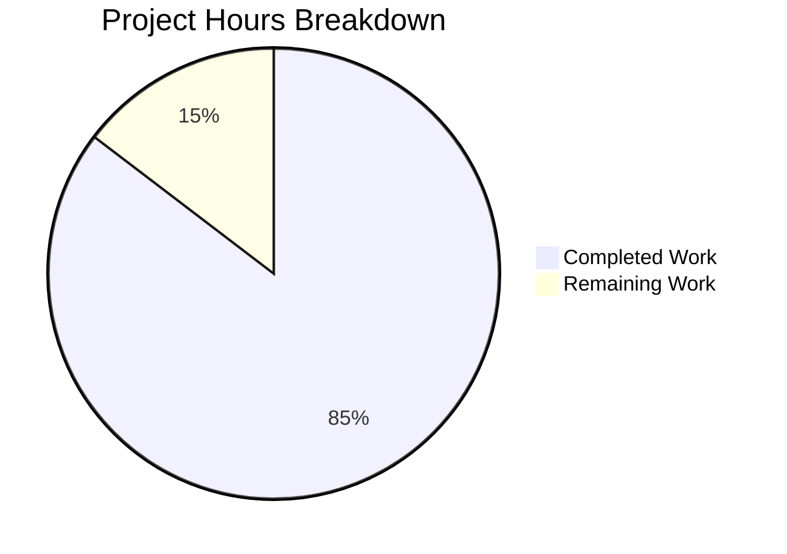

# Project Guide: Express.js Modular Architecture Refactoring

## 1. Executive Summary

This project refactors a monolithic Node.js HTTP server into a modular four-layer Express.js architecture while preserving complete behavioral equivalence. Based on our analysis, **35 hours of development work have been completed out of an estimated 41 total hours required, representing 85% project completion** (35 ÷ 41 = 0.854 = 85.4%, rounded to 85%).

### Key Achievements
- All 17 target files successfully updated per the transformation plan
- Complete four-layer architecture implemented: Entry, Application, Routing, Configuration
- 41 tests across 4 suites passing with **100% code coverage** (statements, branches, functions, lines)
- All HTTP API contracts preserved byte-identical to original implementation
- Factory Pattern, Barrel Pattern, Twelve-Factor Config, and Separation of Concerns patterns verified
- Runtime validation confirmed: `GET /` → 200 `"Hello, World!\n"`, `GET /evening` → 200 `"Good evening"`, unknown routes → 404
- Zero compilation errors, zero test failures, zero runtime issues
- Clean git working tree with all changes committed

### Critical Items for Human Review
- 1 high-severity dependency vulnerability (`qs ≤6.14.1`) fixable via `npm audit fix`
- Human code review recommended before production merge
- Production environment variable configuration required for deployment

---

## 2. Validation Results Summary

### 2.1 Dependencies (100% Success)
| Package | Manifest | Resolved | Type | Status |
|---------|----------|----------|------|--------|
| express | ^5.1.0 | 5.1.0 | Production | ✅ Installed |
| jest | ^30.2.0 | 30.2.0 | Dev | ✅ Installed |
| supertest | ^7.1.4 | 7.1.4 | Dev | ✅ Installed |

### 2.2 Compilation (100% Success)
All 5 source modules load without errors via `require()`:
- `server.js` → imports `src/app` and `src/config` ✅
- `src/app.js` → imports `express` and `./routes` ✅
- `src/config/index.js` → reads `process.env` ✅
- `src/routes/index.js` → imports `./main.routes` ✅
- `src/routes/main.routes.js` → imports `express.Router()` ✅

### 2.3 Tests (41/41 Passed — 100% Pass Rate)
| Test Suite | Tests | Status |
|-----------|-------|--------|
| tests/unit/config.test.js | 15/15 | ✅ All passed |
| tests/unit/routes.test.js | 7/7 | ✅ All passed |
| tests/integration/endpoints.test.js | 14/14 | ✅ All passed |
| tests/lifecycle/server.test.js | 5/5 | ✅ All passed |
| **Total** | **41/41** | **✅ 100%** |

### 2.4 Code Coverage (100% All Metrics)
| File | Statements | Branches | Functions | Lines |
|------|-----------|----------|-----------|-------|
| server.js | 100% | 100% | 100% | 100% |
| src/app.js | 100% | 100% | 100% | 100% |
| src/config/index.js | 100% | 100% | 100% | 100% |
| src/routes/index.js | 100% | 100% | 100% | 100% |
| src/routes/main.routes.js | 100% | 100% | 100% | 100% |

Coverage thresholds enforced: branches ≥75%, functions ≥90%, lines ≥80%, statements ≥80% — **all exceeded at 100%**.

### 2.5 Runtime Validation (100% Success)
| Endpoint | Status | Response Body | Content-Type | Result |
|----------|--------|--------------|--------------|--------|
| GET / | 200 | `Hello, World!\n` (14 bytes) | text/html; charset=utf-8 | ✅ |
| GET /evening | 200 | `Good evening` (12 bytes) | text/html; charset=utf-8 | ✅ |
| GET /notfound | 404 | Express default handler | — | ✅ |

### 2.6 Issues Found During Validation
**None.** Zero compilation errors, zero test failures, zero runtime issues.

---

## 3. Project Completion Assessment

### 3.1 Hours Calculation

**Completed Work — 35 hours:**

| Category | Component | Hours |
|----------|-----------|-------|
| Architecture & Planning | Design, pattern selection, transformation planning | 2h |
| Source: Entry Layer | server.js rewrite (52 lines) | 2h |
| Source: Application Layer | src/app.js Express Factory (27 lines) | 1.5h |
| Source: Configuration Layer | src/config/index.js Twelve-Factor (41 lines) | 1.5h |
| Source: Routing Layer | src/routes/ barrel + handler (60 lines) | 2h |
| Testing: Integration | endpoints.test.js — 14 tests (125 lines) | 4h |
| Testing: Config Unit | config.test.js — 15 tests (140 lines) | 4h |
| Testing: Routes Unit | routes.test.js — 7 tests (94 lines) | 2.5h |
| Testing: Lifecycle | server.test.js — 5 tests (204 lines) | 5h |
| Configuration | package.json, jest.config.js, .gitignore | 2h |
| Documentation | README.md (348 lines) + 4 module READMEs (315 lines) | 6h |
| Validation & Debugging | Compilation, test runs, runtime verification | 2.5h |
| **Total Completed** | | **35h** |

**Remaining Work — 6 hours:**

| Task | Base Hours | With Multipliers (×1.44) |
|------|-----------|--------------------------|
| Dependency vulnerability remediation (qs) | 0.5h | 0.7h |
| Production environment configuration | 0.5h | 0.7h |
| Human code review and verification | 2h | 2.9h |
| Documentation accuracy review | 0.5h | 0.7h |
| Final integration verification | 0.5h | 0.7h |
| **Subtotal (base)** | **4h** | |
| Enterprise multipliers applied (compliance ×1.15, uncertainty ×1.25) | | **~6h** |

**Completion Calculation:**
- Completed: 35 hours
- Remaining: 6 hours
- Total: 41 hours
- **Completion: 35 ÷ 41 = 85%**

### 3.2 Visual Representation


```mermaid
pie title Project Hours Breakdown
    "Completed Work" : 35
    "Remaining Work" : 6
```

---

## 4. Detailed Task Table for Human Developers

| # | Task | Description | Priority | Severity | Hours | Confidence |
|---|------|-------------|----------|----------|-------|------------|
| 1 | Fix dependency vulnerability | Run `npm audit fix` to resolve high-severity `qs ≤6.14.1` vulnerability (DoS via memory exhaustion). Verify tests still pass after update. | High | High | 1.0h | High |
| 2 | Human code review | Senior developer reviews all 17 modified files for code quality, pattern adherence, edge cases, and Express.js best practices. Verify architectural decisions match team standards. | High | Medium | 2.5h | High |
| 3 | Production environment setup | Create `.env` file with production values for `HOST`, `PORT`, and `NODE_ENV`. Document required environment variables for deployment runbook. | Medium | Medium | 1.0h | High |
| 4 | Documentation accuracy review | Verify README.md setup instructions, API documentation, and module READMEs are accurate and complete. Test all copy-paste commands. | Low | Low | 1.0h | High |
| 5 | Final integration verification | Run full test suite in production-like environment. Verify server startup, endpoint responses, and graceful shutdown behavior end-to-end. | Low | Low | 0.5h | High |
| | **Total Remaining Hours** | | | | **6.0h** | |

---

## 5. Comprehensive Development Guide

### 5.1 System Prerequisites

| Software | Minimum Version | Recommended Version | Purpose |
|----------|----------------|--------------------|---------| 
| Node.js | 18.x | 20.19.x LTS or later | JavaScript runtime |
| npm | 8.x | 10.x or later | Package management |
| Git | 2.x | Latest | Version control |

**Verified Environment:** Node.js v20.20.0, npm 11.1.0

### 5.2 Environment Setup

```bash
# 1. Clone the repository and switch to the feature branch
git clone <repository-url>
cd hello_world
git checkout blitzy-56e78b08-71ce-4717-934b-3665b56afd85

# 2. Verify Node.js version
node --version
# Expected output: v20.x.x (must be ≥18.x)
```

### 5.3 Dependency Installation

```bash
# Install all production and dev dependencies
npm install
```

**Expected output:** 3 packages installed — `express@5.1.0`, `jest@30.2.0`, `supertest@7.1.4`

**Verify installation:**
```bash
npm ls --depth=0
# Expected:
# hello_world@1.0.0
# ├── express@5.1.0
# ├── jest@30.2.0
# └── supertest@7.1.4
```

### 5.4 Running Tests

```bash
# Run all 41 tests with coverage (non-interactive, CI-safe)
CI=true npx jest --watchAll=false --ci --verbose --coverage
```

**Expected output:**
```
Test Suites: 4 passed, 4 total
Tests:       41 passed, 41 total
Coverage:    100% statements, 100% branches, 100% functions, 100% lines
```

**Additional test commands:**
```bash
# Watch mode for development
npm run test:watch

# Coverage report only
npm run test:coverage

# CI mode with reporters
npm run test:ci
```

### 5.5 Application Startup

```bash
# Start with default configuration (127.0.0.1:3000)
npm start

# Expected console output:
# Server running at http://127.0.0.1:3000/
```

**Custom configuration via environment variables:**
```bash
# Bind to all interfaces on port 8080 in production mode
HOST=0.0.0.0 PORT=8080 NODE_ENV=production npm start

# Expected console output:
# Server running at http://0.0.0.0:8080/
```

### 5.6 Verification Steps

```bash
# In a separate terminal, test endpoints:

# Test root endpoint
curl -i http://127.0.0.1:3000/
# Expected: HTTP/1.1 200 OK
# Body: Hello, World!\n
# Content-Type: text/html; charset=utf-8

# Test evening endpoint
curl -i http://127.0.0.1:3000/evening
# Expected: HTTP/1.1 200 OK
# Body: Good evening
# Content-Type: text/html; charset=utf-8

# Test 404 handling
curl -i http://127.0.0.1:3000/nonexistent
# Expected: HTTP/1.1 404 Not Found
```

### 5.7 Project Structure

```
hello_world/
├── server.js                    ← Entry Layer: HTTP server binding
├── src/
│   ├── app.js                   ← Application Layer: Express Factory
│   ├── config/
│   │   └── index.js             ← Configuration Layer: Twelve-Factor
│   └── routes/
│       ├── index.js             ← Barrel Pattern aggregator
│       └── main.routes.js       ← Express Router handlers
├── tests/
│   ├── integration/
│   │   └── endpoints.test.js    ← 14 HTTP contract tests
│   ├── unit/
│   │   ├── config.test.js       ← 15 config unit tests
│   │   └── routes.test.js       ← 7 route unit tests
│   └── lifecycle/
│       └── server.test.js       ← 5 lifecycle tests
├── package.json                 ← Dependencies and scripts
├── jest.config.js               ← Test configuration
└── .gitignore                   ← VCS exclusions
```

### 5.8 Troubleshooting

| Issue | Resolution |
|-------|-----------|
| `EADDRINUSE` error on startup | Another process is using port 3000. Kill it with `lsof -ti:3000 \| xargs kill` or set a different port: `PORT=3001 npm start` |
| Tests enter watch mode | Use `CI=true npx jest --watchAll=false --ci` to force non-interactive mode |
| `npm audit` reports vulnerability | Run `npm audit fix` to update the `qs` transitive dependency |
| Module not found errors | Ensure `npm install` completed successfully and you are in the project root directory |

---

## 6. Risk Assessment

### 6.1 Technical Risks

| Risk | Severity | Likelihood | Mitigation |
|------|----------|------------|------------|
| `qs` dependency vulnerability (high-severity DoS) | High | Low | Run `npm audit fix` to upgrade qs to patched version. Verify tests pass after upgrade. |
| Express 5.x is relatively new | Low | Low | Express 5.1.0 is stable. Monitor for minor updates. The application uses only stable core APIs (`Router`, `app.use`, `app.listen`, `res.send`). |

### 6.2 Security Risks

| Risk | Severity | Likelihood | Mitigation |
|------|----------|------------|------------|
| No rate limiting on endpoints | Low | Low | For a hello-world tutorial server, rate limiting is not critical. Add `express-rate-limit` if exposed publicly. |
| No HTTPS configured | Low | Medium | Use a reverse proxy (nginx/ALB) for TLS termination in production. Not required for local development. |
| Transitive dependency vulnerability (qs) | High | Low | Remediate via `npm audit fix` as first priority task. |

### 6.3 Operational Risks

| Risk | Severity | Likelihood | Mitigation |
|------|----------|------------|------------|
| No health check endpoint | Low | Low | Application is a tutorial server. Add `GET /health` if deploying to orchestrated environment. |
| No structured logging | Low | Low | `console.log` is sufficient for tutorial scope. Add Winston/Pino for production workloads. |
| No process manager configured | Low | Low | Use PM2 or systemd for production deployments. `npm start` is sufficient for development. |

### 6.4 Integration Risks

| Risk | Severity | Likelihood | Mitigation |
|------|----------|------------|------------|
| No CI/CD pipeline | Medium | N/A | Explicitly out of scope per project requirements. Set up GitHub Actions with `npm run test:ci` when ready. |
| No containerization | Low | N/A | Explicitly out of scope. Add Dockerfile when deployment to containers is needed. |

---

## 7. Git Repository Analysis

### 7.1 Commit Summary
- **Total commits on branch (vs main):** 66
- **Meaningful development commits:** 27 (excluding Blitzy doc/merge commits)
- **Files changed:** 17 source/test/config files + 3 Blitzy documentation files
- **Lines added:** 1,437 (excluding blitzy/ and package-lock.json)
- **Lines removed:** 14
- **Net change:** +1,423 lines

### 7.2 Files Modified

| File | Lines | Change Type | Purpose |
|------|-------|-------------|---------|
| server.js | 52 | Updated | Rewritten as Entry Layer |
| src/app.js | 27 | Created | Express Application Factory |
| src/config/index.js | 41 | Created | Twelve-Factor Configuration |
| src/routes/index.js | 19 | Created | Barrel Pattern Aggregator |
| src/routes/main.routes.js | 41 | Created | Express Router Handlers |
| package.json | 22 | Updated | Added jest, supertest, test scripts |
| jest.config.js | 27 | Created | Test configuration with coverage |
| .gitignore | 24 | Updated | Added coverage/ exclusion |
| README.md | 348 | Updated | Comprehensive project documentation |
| src/README.md | 97 | Created | Source module documentation |
| src/config/README.md | 53 | Created | Config module documentation |
| src/routes/README.md | 95 | Created | Routes module documentation |
| tests/README.md | 70 | Created | Test suite documentation |
| tests/integration/endpoints.test.js | 125 | Created | 14 integration tests |
| tests/unit/config.test.js | 140 | Created | 15 config unit tests |
| tests/unit/routes.test.js | 94 | Created | 7 route unit tests |
| tests/lifecycle/server.test.js | 204 | Created | 5 lifecycle tests |

### 7.3 Code Volume Summary
- **Source code:** 180 lines across 5 modules
- **Test code:** 563 lines across 4 test suites (41 tests)
- **Configuration:** 73 lines across 3 files
- **Documentation:** 663 lines across 5 README files
- **Total project code (excl. docs):** 816 lines
