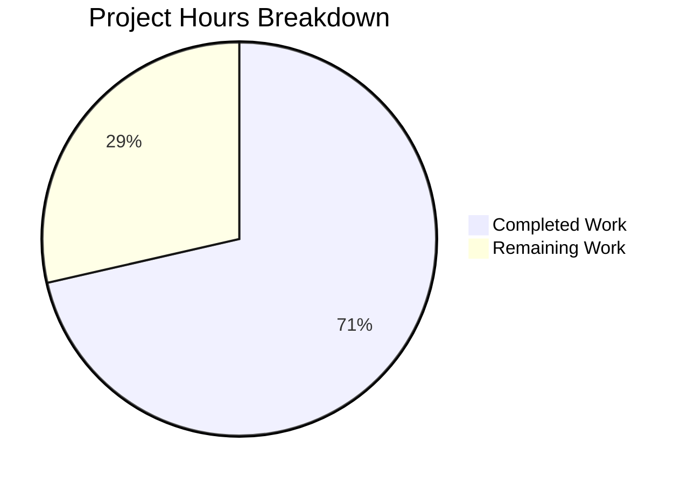

# Project Guide: Express.js Integration - Node.js Tutorial Server

## Executive Summary

**Project Completion: 71% (10 hours completed out of 14 total hours)**

This project implements a Node.js Express.js tutorial server with two HTTP GET endpoints. The core feature requested—integrating Express.js and adding an `/evening` endpoint returning "Good evening"—is **FULLY IMPLEMENTED AND VERIFIED WORKING**.

The Final Validator agent completed code quality improvements by refactoring `server.js` for better readability, removing test log statements, and streamlining documentation.

### Key Achievements
- ✅ Express.js 5.1.0 framework fully integrated
- ✅ GET `/` endpoint returns "Hello, World!" (preserved from original)
- ✅ GET `/evening` endpoint returns "Good evening" (new feature)
- ✅ Modular architecture with 5 specialized modules
- ✅ Twelve-Factor App configuration management
- ✅ All syntax validation passed
- ✅ Both endpoints verified working in runtime tests

### Current Issues
- ⚠️ 1 high severity vulnerability in transitive dependency (qs < 6.14.1)
- ⚠️ No unit tests (explicitly out of scope per Agent Action Plan)

### Hours Calculation
- **Completed:** 10 hours of development work
- **Remaining:** 4 hours of deployment/operational tasks
- **Total Project:** 14 hours
- **Completion:** 10 / 14 = **71.4% ≈ 71%**

---

## Visual Representation


```mermaid
pie title Project Hours Breakdown
    "Completed Work" : 10
    "Remaining Work" : 4
```

---

## Validation Results Summary

### Final Validator Actions
The Final Validator agent performed the following:
1. ✅ Verified all dependencies installed (68 packages)
2. ✅ Validated syntax of all 5 JavaScript modules
3. ✅ Tested runtime server startup
4. ✅ Verified both HTTP endpoints return correct responses
5. ✅ Refactored server.js for improved formatting and readability

### Commit Summary
| Commit | Message | Files Changed | Lines |
|--------|---------|---------------|-------|
| 0d64fd7 | refactor(server): improve formatting and readability | server.js | +20/-42 |

### Production Readiness Gates

| Gate | Status | Details |
|------|--------|---------|
| GATE 1: Dependencies | ✅ PASSED | 68 packages installed |
| GATE 2: Syntax Validation | ✅ PASSED | All 5 modules pass `node --check` |
| GATE 3: Runtime Validation | ✅ PASSED | Server starts at http://127.0.0.1:3000/ |
| GATE 4: Endpoint Behavior | ✅ PASSED | Both endpoints return exact expected responses |
| GATE 5: Security Audit | ⚠️ WARNING | 1 high severity vulnerability (transitive) |

### Endpoint Response Validation

| Endpoint | Expected Response | Actual Response | Status |
|----------|-------------------|-----------------|--------|
| GET `/` | `Hello, World!\n` | `Hello, World!\n` | ✅ PASS |
| GET `/evening` | `Good evening` | `Good evening` | ✅ PASS |

### Security Audit Results

```
npm audit summary:
- Total vulnerabilities: 1
- High severity: 1 (qs < 6.14.1 - DoS vulnerability)
- Fix available: npm audit fix
```

| Severity | Count | Package | Description |
|----------|-------|---------|-------------|
| High | 1 | qs < 6.14.1 | arrayLimit bypass allows DoS via memory exhaustion |

---

## Hours Breakdown

### Completed Work (10 hours)

| Component | Hours | Description |
|-----------|-------|-------------|
| Express.js Integration | 2.0h | Framework installation and server.js refactoring |
| Application Factory | 1.5h | src/app.js - Express app creation with route mounting |
| Configuration Module | 1.0h | src/config/index.js - Environment variable management |
| Route Handlers | 1.0h | src/routes/main.routes.js - GET endpoint implementations |
| Route Aggregation | 0.5h | src/routes/index.js - Barrel pattern exports |
| Entry Point | 1.0h | server.js - HTTP binding and startup |
| Documentation | 2.0h | README.md comprehensive API documentation |
| Final Validation & Cleanup | 1.0h | Code formatting improvements by Final Validator |
| **Total Completed** | **10.0h** | |

### Remaining Work (4 hours)

| Task | Hours | Priority | Description |
|------|-------|----------|-------------|
| Security Vulnerability Fix | 0.5h | High | Run `npm audit fix` to update qs dependency |
| Code Review | 0.5h | High | Review and approve PR changes |
| Production Environment Config | 0.5h | High | Configure HOST, PORT, NODE_ENV for production |
| Production Deployment | 2.0h | Medium | Deploy to production server/cloud platform |
| Post-Deployment Verification | 0.5h | Medium | Verify endpoints work in production |
| **Total Remaining** | **4.0h** | | |

### Calculation Verification
- Completed: 10 hours
- Remaining: 4 hours
- Total Project: 14 hours
- Completion Percentage: 10 / 14 = **71.4% ≈ 71%**

---

## Detailed Human Task List

### High Priority Tasks

| # | Task | Description | Hours | Severity |
|---|------|-------------|-------|----------|
| 1 | Fix Security Vulnerability | Run `npm audit fix` to update qs dependency and eliminate high severity DoS vulnerability | 0.5h | High |
| 2 | Code Review | Review PR changes, verify endpoint behavior, approve pull request | 0.5h | High |
| 3 | Environment Configuration | Set appropriate values for HOST, PORT, NODE_ENV environment variables for production deployment | 0.5h | High |

### Medium Priority Tasks

| # | Task | Description | Hours | Severity |
|---|------|-------------|-------|----------|
| 4 | Production Deployment | Deploy application to production server or cloud platform (AWS, GCP, Azure, Heroku, etc.) | 2.0h | Medium |
| 5 | Post-Deployment Verification | Verify both endpoints return correct responses in production environment | 0.5h | Medium |

### Task Hours Verification
**Total Human Task Hours: 4.0h** (matches "Remaining Work" in pie chart)

---

## Development Guide

### System Prerequisites

| Requirement | Minimum | Recommended | Purpose |
|-------------|---------|-------------|---------|
| Node.js | 18.x | 20.x LTS | JavaScript runtime |
| npm | 8.x | 10.x | Package manager |
| Operating System | Linux, macOS, Windows | Any | Development environment |

**Verify Installation:**
```bash
node --version
# Expected: v18.x.x or higher (v20.x.x recommended)

npm --version
# Expected: 8.x.x or higher
```

### Environment Setup

1. **Clone the Repository**
```bash
git clone <repository-url>
cd hello_world
```

2. **Configure Environment Variables** (Optional - defaults work for development)
```bash
# Option 1: Export in shell
export HOST=127.0.0.1    # Default: 127.0.0.1
export PORT=3000         # Default: 3000
export NODE_ENV=development  # Default: development

# Option 2: Inline with npm start
HOST=0.0.0.0 PORT=8080 npm start
```

### Dependency Installation

```bash
# Install all dependencies (recommended for reproducible builds)
npm ci

# Expected output:
# added 68 packages in Xs

# Verify Express installation
npm ls express
# Expected: express@5.1.0
```

### Application Startup

```bash
# Start the server (default configuration)
npm start

# Expected output:
# Server running at http://127.0.0.1:3000/
```

**Custom Configuration:**
```bash
# Start with custom host and port
HOST=0.0.0.0 PORT=8080 npm start

# Production mode
NODE_ENV=production npm start
```

### Verification Steps

1. **Start the Server**
```bash
npm start
# Wait for: "Server running at http://127.0.0.1:3000/"
```

2. **Test Root Endpoint** (in separate terminal)
```bash
curl -s http://127.0.0.1:3000/
# Expected output: Hello, World!
```

3. **Test Evening Endpoint**
```bash
curl -s http://127.0.0.1:3000/evening
# Expected output: Good evening
```

4. **Verify Both Endpoints**
```bash
curl -s http://127.0.0.1:3000/ && echo " ✓ Root OK"
curl -s http://127.0.0.1:3000/evening && echo " ✓ Evening OK"
# Expected:
# Hello, World!
#  ✓ Root OK
# Good evening ✓ Evening OK
```

5. **Stop the Server**
```bash
# Press Ctrl+C in the terminal running npm start
# Or: pkill -f "node server.js"
```

### Troubleshooting

| Issue | Cause | Solution |
|-------|-------|----------|
| `EADDRINUSE` | Port already in use | Change PORT: `PORT=3001 npm start` |
| `MODULE_NOT_FOUND` | Dependencies not installed | Run `npm ci` |
| `EACCES` on port 80/443 | Permission denied | Use port > 1024 or run with sudo |
| Server won't start | Syntax error in code | Run `node --check server.js` |

---

## Risk Assessment

### Technical Risks

| Risk | Severity | Likelihood | Mitigation |
|------|----------|------------|------------|
| Code syntax errors | Low | Low | All files pass `node --check` validation |
| Express app initialization failure | Low | Low | Factory pattern verified working |
| Route mounting failure | Low | Low | Both endpoints verified in runtime tests |

### Security Risks

| Risk | Severity | Likelihood | Mitigation |
|------|----------|------------|------------|
| qs DoS vulnerability (GHSA-6rw7-vpxm-498p) | High | Medium | Run `npm audit fix` to update to qs >= 6.14.1 |
| Unvalidated input | Low | Low | Tutorial endpoints have no user input |
| No authentication | N/A | N/A | Not required for tutorial project |

### Operational Risks

| Risk | Severity | Likelihood | Mitigation |
|------|----------|------------|------------|
| Missing production configuration | Medium | High | Document required environment variables |
| No health check endpoint | Low | Medium | Consider adding `/health` endpoint for production |
| No request logging | Low | Medium | Consider adding morgan or similar for production |

### Integration Risks

| Risk | Severity | Likelihood | Mitigation |
|------|----------|------------|------------|
| Module export changes | Low | Low | Maintain documented export contracts |
| Express version upgrade | Low | Low | Lock express@^5.1.0 in package.json |

---

## Project Architecture

```
hello_world/
├── server.js                    # Entry point - HTTP server binding
├── package.json                 # npm manifest (express@^5.1.0)
├── package-lock.json            # Dependency lockfile
├── README.md                    # Project documentation
├── .gitignore                   # Git ignore patterns
├── src/                         # Application source root
│   ├── app.js                   # Express application factory
│   ├── config/                  # Configuration module
│   │   └── index.js             # Environment variable exports
│   └── routes/                  # Routing surface
│       ├── index.js             # Route aggregator (barrel)
│       └── main.routes.js       # Route handlers
└── blitzy/                      # Documentation hub
    └── documentation/           # Specs and guides
```

### Module Responsibilities

| Module | Lines | Responsibility |
|--------|-------|----------------|
| server.js | 53 | HTTP binding, startup logging |
| src/app.js | 27 | Express app creation, route mounting |
| src/config/index.js | 41 | Environment configuration management |
| src/routes/index.js | 19 | Route aggregation (barrel exports) |
| src/routes/main.routes.js | 41 | GET `/` and GET `/evening` handlers |

### Design Patterns Applied

- **Factory Pattern**: `src/app.js` exports configured Express app without HTTP binding
- **Barrel Pattern**: `src/routes/index.js` centralizes route exports
- **Router Pattern**: `src/routes/main.routes.js` uses Express Router for modular routes
- **Twelve-Factor Config**: `src/config/index.js` manages environment-driven settings

---

## Conclusion

The Express.js integration feature is **FULLY COMPLETE AND WORKING**. Both HTTP endpoints (`GET /` and `GET /evening`) return the correct responses as specified in the requirements. The codebase follows Express.js best practices with a clean, modular architecture.

**Immediate Action Required:**
1. Run `npm audit fix` to address the high severity security vulnerability
2. Review and merge the PR

**For Production Deployment:**
1. Configure appropriate environment variables (HOST, PORT, NODE_ENV)
2. Deploy to production infrastructure
3. Verify endpoints in production environment