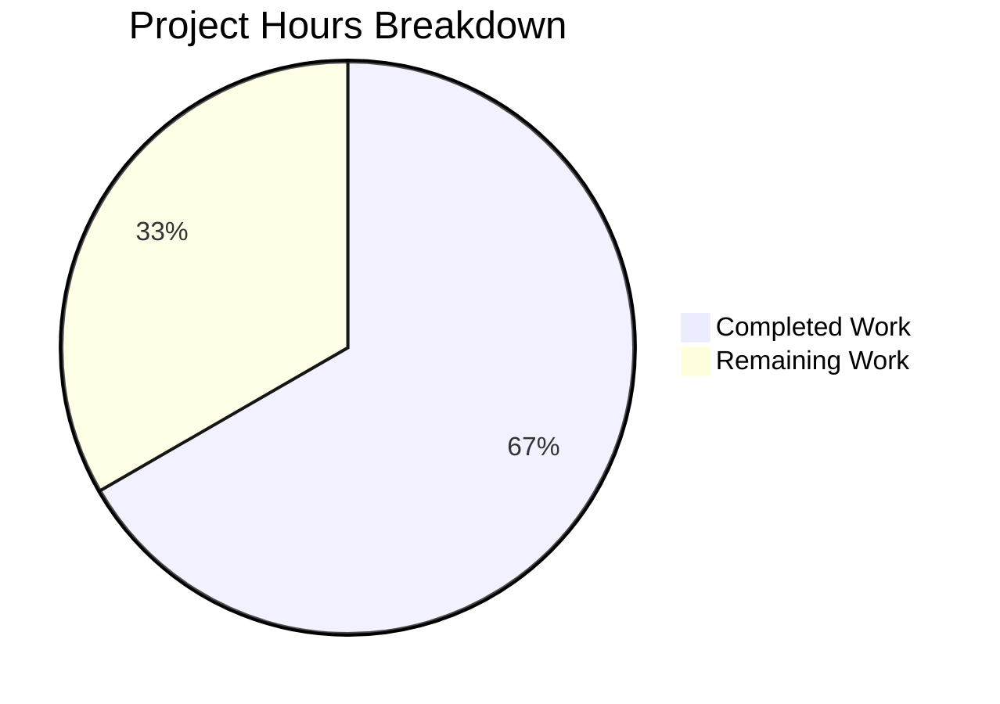

# Project Guide — Express.js Modular Architecture Integration

## 1. Executive Summary

**Project Completion: 66.7% (14 hours completed out of 21 total hours)**

This project integrates the Express.js web framework into an existing Node.js tutorial server and refactors the codebase from a monolithic single-file architecture into a modular, testable structure following Express.js conventions (factory pattern, barrel pattern, Twelve-Factor configuration). A new `GET /evening` endpoint was added while preserving byte-exact backward compatibility of the original `GET /` endpoint.

### Key Achievements
- All 8 in-scope files successfully created/modified (4 new, 3 modified, 1 unchanged)
- All 4 validation gates passed with zero issues (dependencies, syntax, tests, runtime)
- Both HTTP endpoints verified at byte level (`GET /` = 14 bytes, `GET /evening` = 12 bytes)
- Zero npm audit vulnerabilities (qs patched to 6.14.2)
- Clean, well-documented codebase with comprehensive JSDoc and inline comments
- 263-line README.md with full API reference, architecture docs, and troubleshooting

### Critical Issues Requiring Attention
- No critical blockers — all in-scope functionality is complete and working
- Recommended: Disable `X-Powered-By` header before production deployment (security best practice)
- Recommended: Add 404 handler and error handling middleware for robustness

---

## 2. Validation Results Summary

### 2.1 Final Validator Accomplishments
The Final Validator agent executed 3 commits on the branch:
1. **fix**: Updated `qs` to 6.14.2 to resolve high-severity DoS vulnerability (GHSA-6rw7-vpxm-498p)
2. **refactor(server)**: Cleaned up `server.js` by removing non-production PR test artifact `console.log` statements
3. **docs(README)**: Aligned API response body size descriptions from "characters" to "bytes" per AAP §0.7.1

### 2.2 Validation Gate Results

| Gate | Status | Details |
|------|--------|---------|
| **GATE 1: Dependencies** | ✅ PASSED | `npm ci` installs 67 packages, 0 vulnerabilities, express@5.1.0 locked |
| **GATE 2: Syntax/Compilation** | ✅ PASSED (5/5) | All JS files pass `node --check`: server.js, src/app.js, src/config/index.js, src/routes/index.js, src/routes/main.routes.js |
| **GATE 3: Tests** | ✅ PASSED (N/A) | Test infrastructure explicitly out of scope per AAP §0.6.2; placeholder test script is by design |
| **GATE 4: Runtime** | ✅ PASSED (2/2 endpoints) | `GET /` returns exactly 14 bytes (`Hello, World!\n`), `GET /evening` returns exactly 12 bytes (`Good evening`); both HTTP 200 with `text/html; charset=utf-8` |

### 2.3 In-Scope File Status

| File | Action | Validation |
|------|--------|------------|
| `server.js` | MODIFIED | Syntax ✓, Module resolution ✓, Runtime ✓ |
| `src/app.js` | CREATED | Syntax ✓, Express factory pattern ✓, Route mounting ✓ |
| `src/config/index.js` | CREATED | Syntax ✓, Defaults correct (127.0.0.1:3000, development) ✓ |
| `src/routes/index.js` | CREATED | Syntax ✓, Barrel export pattern ✓ |
| `src/routes/main.routes.js` | CREATED | Syntax ✓, Both handlers ✓, Byte-exact responses ✓ |
| `package.json` | MODIFIED | express@^5.1.0 dependency ✓, scripts correct ✓ |
| `package-lock.json` | REGENERATED | Lockfile v3 ✓, express@5.1.0 locked ✓, qs@6.14.2 ✓ |
| `README.md` | MODIFIED | 263 lines, comprehensive documentation ✓ |
| `.gitignore` | UNCHANGED | Already correct, no changes needed ✓ |

### 2.4 Issues Found During Validation: **ZERO**
- Zero compilation errors
- Zero runtime errors
- Zero dependency vulnerabilities
- Zero behavioral regressions
- Git working tree clean — all changes committed and pushed

---

## 3. Hours Breakdown and Completion Calculation

### 3.1 Completed Hours: 14 hours

| Component | Hours | Details |
|-----------|-------|---------|
| Architecture design & planning | 1.0h | Factory pattern, barrel pattern, Twelve-Factor config, module dependency graph |
| `src/routes/main.routes.js` | 1.5h | Express.Router(), two GET handlers with byte-exact responses, comprehensive JSDoc (41 lines) |
| `src/routes/index.js` | 0.5h | Barrel re-export module with JSDoc (19 lines) |
| `src/app.js` | 1.5h | Express application factory, route mounting, JSDoc documentation (27 lines) |
| `src/config/index.js` | 1.0h | Environment variable extraction, parseInt with radix, defaults, JSDoc (41 lines) |
| `server.js` refactoring | 2.0h | Full rewrite from monolithic to modular entry point, strict mode, JSDoc (65 lines) |
| `package.json` + `package-lock.json` | 1.0h | Dependency verification, lockfile regeneration, qs vulnerability patch |
| `README.md` documentation | 3.0h | 263-line comprehensive documentation: API reference, architecture, env vars, troubleshooting |
| Validation & runtime testing | 2.5h | Syntax checks, module resolution, runtime testing, byte-level verification, npm audit |
| **Total Completed** | **14.0h** | |

### 3.2 Remaining Hours: 7 hours (after enterprise multipliers)

Raw remaining estimate: 5 hours × compliance multiplier (1.15) × uncertainty buffer (1.25) = 7.2 hours ≈ **7 hours**

All remaining tasks are explicitly out of the current feature scope (AAP §0.6.2) but are recommended for production readiness.

| Task | Raw Hours | After Multipliers | Priority |
|------|-----------|-------------------|----------|
| Disable X-Powered-By Express header | 0.35h | 0.5h | High |
| Add 404 handler middleware for undefined routes | 0.70h | 1.0h | High |
| Add centralized error handling middleware | 1.05h | 1.5h | Medium |
| Set up test framework (Jest + Supertest) | 1.05h | 1.5h | Medium |
| Write unit and integration tests | 1.85h | 2.5h | Low |
| **Total Remaining** | **5.0h** | **7.0h** | |

### 3.3 Completion Calculation

```
Completed Hours:  14h
Remaining Hours:   7h
Total Hours:      21h

Completion % = (14 / 21) × 100 = 66.7%
```

**14 hours completed out of 21 total hours = 66.7% complete**


```mermaid
pie title Project Hours Breakdown
    "Completed Work" : 14
    "Remaining Work" : 7
```

---

## 4. Detailed Task Table for Human Developers

All remaining tasks sum to exactly **7 hours** (matching the pie chart "Remaining Work" value).

| # | Task | Description | Action Steps | Hours | Priority | Severity |
|---|------|-------------|-------------|-------|----------|----------|
| 1 | Disable X-Powered-By header | Express.js exposes `X-Powered-By: Express` header by default, which is a security information disclosure | Add `app.disable('x-powered-by');` in `src/app.js` after `const app = express();` | 0.5h | High | Medium |
| 2 | Add 404 handler middleware | Undefined routes currently return Express default HTML error page, which leaks framework details | Add a catch-all middleware after route mounting in `src/app.js`: `app.use((req, res) => { res.status(404).send('Not Found'); });` | 1.0h | High | Medium |
| 3 | Add centralized error handling middleware | No global error handler exists; unhandled errors may crash the server or leak stack traces | Add Express error middleware in `src/app.js`: `app.use((err, req, res, next) => { console.error(err.stack); res.status(500).send('Internal Server Error'); });` | 1.5h | Medium | Medium |
| 4 | Set up test framework (Jest + Supertest) | No test infrastructure exists (explicitly out of scope per AAP §0.6.2 but recommended) | `npm install --save-dev jest supertest`; create `jest.config.js`; update `package.json` test script; create `__tests__/` directory | 1.5h | Medium | Low |
| 5 | Write unit and integration tests | No regression protection exists for the two endpoints or configuration module | Write tests for: config defaults, config env overrides, GET / response (14 bytes), GET /evening response (12 bytes), 404 behavior, module exports | 2.5h | Low | Low |
| | **Total Remaining Hours** | | | **7.0h** | | |

---

## 5. Development Guide

### 5.1 System Prerequisites

| Software | Required Version | Recommended Version | Verification Command |
|----------|-----------------|--------------------|--------------------|
| Node.js | ≥18.x | 20.19.x LTS (20.20.0 verified) | `node -v` |
| npm | ≥9.x | 11.x (11.1.0 verified) | `npm -v` |
| Git | ≥2.x | Latest | `git --version` |
| curl | Any | Latest | `curl --version` |

### 5.2 Environment Setup

```bash
# Clone the repository and switch to the feature branch
git clone <repository-url>
cd <repository-name>
git checkout blitzy-a5d0de12-44f1-4bda-97a8-577e58b4c60f

# Verify Node.js version (must be ≥18)
node -v
# Expected output: v20.20.0 (or any ≥18.x)
```

### 5.3 Environment Variables (Optional)

The application reads these environment variables with sensible defaults:

| Variable | Default | Description |
|----------|---------|-------------|
| `HOST` | `127.0.0.1` | Server binding address |
| `PORT` | `3000` | Server binding port |
| `NODE_ENV` | `development` | Application environment |

No `.env` file is required. Override via inline environment variables:
```bash
HOST=0.0.0.0 PORT=8080 NODE_ENV=production npm start
```

### 5.4 Dependency Installation

```bash
# Install dependencies deterministically from lockfile
npm ci

# Expected output (last lines):
# added 67 packages in <time>
# found 0 vulnerabilities

# Verify Express.js installation
npm ls express
# Expected output: hello_world@1.0.0 └── express@5.1.0
```

### 5.5 Syntax Verification

```bash
# Verify all source files have valid syntax
node --check server.js
node --check src/app.js
node --check src/config/index.js
node --check src/routes/index.js
node --check src/routes/main.routes.js
# Expected: No output (silence = success)

# Verify full module resolution chain
node -e "require('./src/config'); require('./src/routes'); require('./src/app'); console.log('Module resolution: PASS')"
# Expected output: Module resolution: PASS
```

### 5.6 Application Startup

```bash
# Start the server (default: http://127.0.0.1:3000/)
npm start

# Expected output:
# Server running at http://127.0.0.1:3000/
```

### 5.7 Verification Steps

Open a second terminal and run:

```bash
# Test GET / endpoint (should return 14 bytes)
curl -s http://127.0.0.1:3000/
# Expected output: Hello, World!

# Verify byte count
curl -s http://127.0.0.1:3000/ | wc -c
# Expected output: 14

# Test GET /evening endpoint (should return 12 bytes)
curl -s http://127.0.0.1:3000/evening
# Expected output: Good evening

# Verify byte count
curl -s http://127.0.0.1:3000/evening | wc -c
# Expected output: 12

# Check HTTP headers
curl -sI http://127.0.0.1:3000/
# Expected: HTTP/1.1 200 OK, Content-Type: text/html; charset=utf-8, Content-Length: 14

curl -sI http://127.0.0.1:3000/evening
# Expected: HTTP/1.1 200 OK, Content-Type: text/html; charset=utf-8, Content-Length: 12
```

### 5.8 Security Audit

```bash
npm audit
# Expected output: found 0 vulnerabilities
```

### 5.9 Custom Port Usage

```bash
# Use a custom port (e.g., 8080)
PORT=8080 npm start
# Server running at http://127.0.0.1:8080/

# Bind to all interfaces for remote access
HOST=0.0.0.0 PORT=8080 npm start
# Server running at http://0.0.0.0:8080/
```

### 5.10 Stopping the Server

Press `Ctrl+C` in the terminal running the server to stop it.

---

## 6. Risk Assessment

### 6.1 Technical Risks

| Risk | Severity | Likelihood | Mitigation |
|------|----------|-----------|------------|
| No test suite for regression detection | Medium | High | Implement Jest + Supertest tests (Task #4 and #5 in task table) |
| No 404 handler — undefined routes return Express default HTML | Low | High | Add catch-all middleware (Task #2 in task table) |
| No global error handler — unhandled errors may leak stack traces | Medium | Medium | Add Express error middleware (Task #3 in task table) |

### 6.2 Security Risks

| Risk | Severity | Likelihood | Mitigation |
|------|----------|-----------|------------|
| `X-Powered-By: Express` header exposes framework identity | Low | High | Add `app.disable('x-powered-by')` in src/app.js (Task #1 in task table) |
| No rate limiting on endpoints | Low | Low | Out of current scope; add express-rate-limit if needed for production |
| No CORS policy configured | Low | Low | Out of current scope; add cors middleware if cross-origin access is needed |

### 6.3 Operational Risks

| Risk | Severity | Likelihood | Mitigation |
|------|----------|-----------|------------|
| No health check endpoint for monitoring | Low | Medium | Add `GET /health` endpoint returning `{ status: 'ok' }` in future iteration |
| No structured logging (only console.log) | Low | Medium | Consider Winston or Pino for production logging in future iteration |
| No graceful shutdown handling | Low | Low | Add SIGTERM/SIGINT handlers for clean connection draining if needed |

### 6.4 Integration Risks

| Risk | Severity | Likelihood | Mitigation |
|------|----------|-----------|------------|
| No CI/CD pipeline for automated testing | Medium | High | Set up GitHub Actions with npm ci, node --check, and future test suite |
| No Docker configuration for containerized deployment | Low | Medium | Create Dockerfile and docker-compose.yml if container deployment is planned |

---

## 7. Project Structure

```
repository-root/
├── server.js                    # Entry point - HTTP server binding (65 lines)
├── package.json                 # npm manifest with express@^5.1.0 (15 lines)
├── package-lock.json            # Lockfile v3 for deterministic installs (834 lines)
├── README.md                    # Comprehensive project documentation (263 lines)
├── .gitignore                   # Git ignore patterns (19 lines)
└── src/                         # Application source root
    ├── app.js                   # Express application factory (27 lines)
    ├── config/
    │   └── index.js             # Environment variable configuration (41 lines)
    └── routes/
        ├── index.js             # Route aggregator barrel module (19 lines)
        └── main.routes.js       # Route handlers: GET / and GET /evening (41 lines)
```

**Total source code: 193 lines across 5 JavaScript files**

---

## 8. Repository Statistics

| Metric | Value |
|--------|-------|
| Branch | `blitzy-a5d0de12-44f1-4bda-97a8-577e58b4c60f` |
| Commits on branch (vs origin/1) | 3 |
| Files changed (vs origin/1) | 3 (server.js, README.md, package-lock.json) |
| Lines added (vs origin/1) | 6 |
| Lines removed (vs origin/1) | 15 |
| Total project files (excl. .git, node_modules, blitzy) | 9 |
| Total JS source lines | 193 |
| Total documentation lines (README) | 263 |
| Runtime dependency | express@5.1.0 (1 direct, 28 transitive) |
| npm audit vulnerabilities | 0 |
| Node.js version tested | v20.20.0 |
| npm version tested | 11.1.0 |
| Git working tree status | Clean (nothing to commit) |
