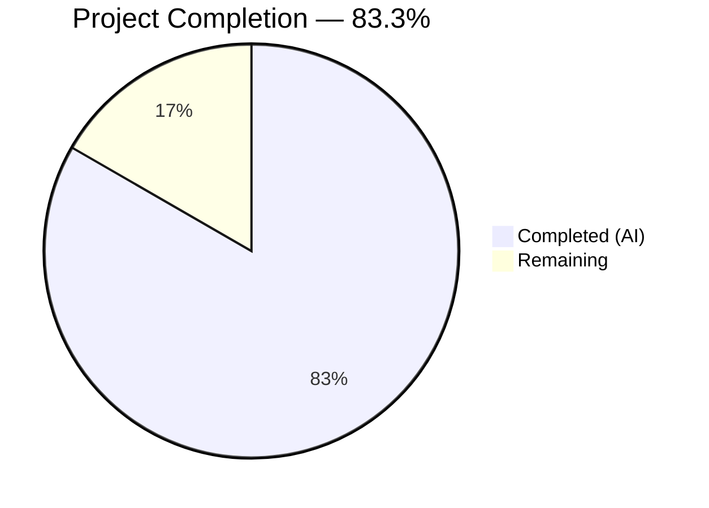

# Blitzy Project Guide — Express.js Integration & Evening Endpoint

---

## 1. Executive Summary

### 1.1 Project Overview

This project transforms an existing Node.js tutorial server—hosting a single `GET /` endpoint returning "Hello world"—into a modular Express.js-powered application with structured routing, a configuration layer, and a new `GET /evening` greeting endpoint. The implementation targets tutorial learners and demonstrates enterprise-grade patterns (Factory, Barrel, Twelve-Factor configuration) within a minimal footprint. Technical scope includes Express.js 5.1.0 integration, two HTTP endpoints, environment-driven configuration, comprehensive test coverage (41 tests, 100% coverage), and security hardening.

### 1.2 Completion Status


```mermaid
pie title Project Completion — 83.3%
    "Completed (AI)" : 25
    "Remaining" : 5
```

| Metric | Value |
|---|---|
| **Total Project Hours** | 30 |
| **Completed Hours (AI)** | 25 |
| **Remaining Hours** | 5 |
| **Completion Percentage** | 83.3% |

**Calculation:** 25 completed hours / (25 completed + 5 remaining) = 25 / 30 = **83.3% complete**

### 1.3 Key Accomplishments

- ✅ Express.js 5.1.0 integrated as production HTTP framework with Factory pattern app creation
- ✅ `GET /` endpoint preserved with identical response (`"Hello, World!\n"`, HTTP 200)
- ✅ `GET /evening` endpoint added returning `"Good evening"` (HTTP 200)
- ✅ Modular architecture: app factory (`src/app.js`), barrel routing (`src/routes/`), config module (`src/config/`)
- ✅ 41 automated tests across 4 suites — all passing (unit, integration, lifecycle)
- ✅ 100% code coverage across all metrics (statements, branches, functions, lines)
- ✅ Security hardening: X-Powered-By disabled, CSP/X-Frame-Options/X-Content-Type-Options headers added
- ✅ Case-sensitive routing enforced (Express 5.x default overridden)
- ✅ Comprehensive documentation: root README (361 lines), 4 module READMEs
- ✅ Jest 30.2.0 + Supertest 7.1.4 test infrastructure with CI-optimized scripts
- ✅ Environment-driven configuration with Twelve-Factor App methodology

### 1.4 Critical Unresolved Issues

| Issue | Impact | Owner | ETA |
|---|---|---|---|
| npm audit: `minimatch` ≤3.1.3 ReDoS (high severity) | Transitive dev dependency — affects `jest` toolchain only; no production runtime impact | Human Developer | 1 hour |
| npm audit: `qs` ≤6.14.1 DoS (moderate severity) | Transitive production dependency via Express — potential request parsing DoS under adversarial input | Human Developer | 1 hour |

### 1.5 Access Issues

No access issues identified. All dependencies are sourced from the public npm registry. No private packages, API keys, service credentials, or third-party integrations are required.

### 1.6 Recommended Next Steps

1. **[High]** Run `npm audit fix` to remediate the 2 known dependency vulnerabilities (minimatch, qs)
2. **[High]** Conduct human code review of all 20 changed files and approve PR
3. **[Medium]** Configure production environment variables (`HOST`, `PORT`, `NODE_ENV`) for target deployment
4. **[Medium]** Execute post-deployment smoke testing against staging/production endpoints
5. **[Low]** Consider adding structured logging and health check endpoint for production observability

---

## 2. Project Hours Breakdown

### 2.1 Completed Work Detail

| Component | Hours | Description |
|---|---|---|
| Express Application Factory (`src/app.js`) | 2.0 | Express instance creation, security headers middleware, case-sensitive routing, route mounting via barrel import |
| Route Handlers (`src/routes/main.routes.js`) | 1.0 | Express Router with `GET /` ("Hello, World!\n") and `GET /evening` ("Good evening") handlers |
| Route Barrel (`src/routes/index.js`) | 0.5 | Barrel pattern aggregator exporting `{ mainRoutes }` for centralized route registration |
| Configuration Module (`src/config/index.js`) | 1.0 | Twelve-Factor config with `host`, `port`, `env` from environment variables with defaults |
| Server Entry Point (`server.js`) | 1.5 | Refactored from raw HTTP to Express `app.listen()` binding with config consumption |
| Package Manifest (`package.json`) | 0.5 | Added express ^5.1.0, jest ^30.2.0, supertest ^7.1.4, and 5 npm scripts |
| Jest Configuration (`jest.config.js`) | 0.5 | Test environment, discovery patterns, coverage collection, threshold gates |
| Git Ignore (`.gitignore`) | 0.5 | Verified/updated exclusions for node_modules, coverage, .env, logs, OS/IDE files |
| Unit Tests — Config (`tests/unit/config.test.js`) | 2.5 | 15 tests: defaults, env overrides, port edge cases, type guarantees, structure validation |
| Unit Tests — Routes (`tests/unit/routes.test.js`) | 1.5 | 7 tests: Router export verification, route definitions, path ordering, GET method registration |
| Integration Tests (`tests/integration/endpoints.test.js`) | 2.5 | 14 tests: HTTP 200 responses, exact body strings, Content-Type headers, 404 handling, edge cases |
| Lifecycle Tests (`tests/lifecycle/server.test.js`) | 3.0 | 5 tests: server binding, startup logging, custom config, graceful shutdown, EADDRINUSE handling |
| Root README (`README.md`) | 2.5 | 361-line comprehensive documentation: API reference, architecture, env vars, testing guide |
| Module READMEs (4 files) | 1.5 | src/README.md, src/config/README.md, src/routes/README.md, tests/README.md |
| Blitzy Documentation | 1.0 | Project Guide and Technical Specifications |
| Validation & Security Fixes | 2.5 | Dependency verification, syntax checks, runtime testing, security hardening, bug fixes |
| **Total** | **25.0** | |

### 2.2 Remaining Work Detail

| Category | Base Hours | Priority | After Multiplier |
|---|---|---|---|
| npm audit vulnerability remediation (minimatch, qs) | 1.0 | High | 1.5 |
| Code review, approval, and merge | 1.5 | High | 2.0 |
| Production environment variable configuration | 0.5 | Medium | 0.5 |
| Post-deployment smoke testing and verification | 0.5 | Medium | 1.0 |
| **Total** | **3.5** | | **5.0** |

### 2.3 Enterprise Multipliers Applied

| Multiplier | Value | Rationale |
|---|---|---|
| Compliance & Review Overhead | 1.10x | Code review, security audit, documentation review for production readiness |
| Uncertainty Buffer | 1.10x | Potential unforeseen issues during dependency updates or environment configuration |
| **Combined Multiplier** | **1.21x** | Applied to all remaining task base hours |

---

## 3. Test Results

| Test Category | Framework | Total Tests | Passed | Failed | Coverage % | Notes |
|---|---|---|---|---|---|---|
| Unit — Configuration | Jest 30.2.0 | 15 | 15 | 0 | 100% | Config defaults, env overrides, port edge cases, type guarantees |
| Unit — Routes | Jest 30.2.0 | 7 | 7 | 0 | 100% | Router export, route definitions, path ordering, GET method validation |
| Integration — Endpoints | Jest 30.2.0 + Supertest 7.1.4 | 14 | 14 | 0 | 100% | HTTP responses, headers, 404 handling, query param edge cases |
| Lifecycle — Server | Jest 30.2.0 | 5 | 5 | 0 | 100% | Binding, logging, config, graceful shutdown, EADDRINUSE |
| **Total** | | **41** | **41** | **0** | **100%** | All thresholds exceeded: branches 100% ≥ 75%, functions 100% ≥ 90%, lines 100% ≥ 80%, statements 100% ≥ 80% |

All tests originate from Blitzy's autonomous validation execution. Test command: `CI=true npx jest --watchAll=false --ci --verbose --coverage`

---

## 4. Runtime Validation & UI Verification

**Server Startup:**
- ✅ `node server.js` starts successfully → logs `Server running at http://127.0.0.1:3000/`

**Endpoint Responses:**
- ✅ `GET /` → HTTP 200, body: `Hello, World!\n` (14 bytes), Content-Type: `text/html; charset=utf-8`
- ✅ `GET /evening` → HTTP 200, body: `Good evening` (12 bytes), Content-Type: `text/html; charset=utf-8`
- ✅ `GET /nonexistent` → HTTP 404 (Express default error handling)

**Security Headers (verified via `curl -sI`):**
- ✅ `X-Content-Type-Options: nosniff`
- ✅ `X-Frame-Options: DENY`
- ✅ `Content-Security-Policy: default-src 'none'`
- ✅ `X-Powered-By` header absent (disabled)

**Dependency Installation:**
- ✅ `npm ci` completes successfully — 381 packages installed
- ⚠ `npm audit` reports 2 vulnerabilities (1 high, 1 moderate) in transitive dependencies

**Compilation / Syntax:**
- ✅ All 6 source files pass `node -c` syntax check
- ✅ All 4 test files pass `node -c` syntax check
- ✅ Zero compilation errors or warnings

**UI Verification:**
- Not applicable — this is a backend-only HTTP API server with no UI components

---

## 5. Compliance & Quality Review

| AAP Requirement | Status | Evidence |
|---|---|---|
| REQ-001: Integrate Express.js | ✅ Pass | `express` ^5.1.0 in package.json; app factory in src/app.js; runtime verified |
| REQ-002: GET /evening endpoint | ✅ Pass | Route registered in main.routes.js; returns "Good evening"; HTTP 200 verified |
| Backward compatibility: GET / unchanged | ✅ Pass | Returns "Hello, World!\n" with trailing newline; HTTP 200; text/html content type |
| CommonJS module system (no ESM) | ✅ Pass | All files use `require()`/`module.exports`; no `import`/`export` syntax |
| `'use strict'` directive in all source files | ✅ Pass | Verified in server.js, app.js, config/index.js, routes/index.js, routes/main.routes.js |
| Factory pattern: app creation separated from binding | ✅ Pass | src/app.js creates Express app; server.js calls app.listen() |
| Barrel pattern: route aggregation | ✅ Pass | src/routes/index.js exports `{ mainRoutes }` |
| Twelve-Factor configuration | ✅ Pass | src/config/index.js reads HOST, PORT, NODE_ENV from process.env |
| Express Router for route definitions | ✅ Pass | express.Router() in main.routes.js; routes not registered on app directly |
| res.send() for responses | ✅ Pass | Both handlers use res.send(); no res.end()/res.write()/res.json() |
| Response contracts (exact strings) | ✅ Pass | GET / → "Hello, World!\n" (14 chars); GET /evening → "Good evening" (12 chars) |
| 404 for undefined routes | ✅ Pass | Express default 404 handling verified via runtime and integration tests |
| Test coverage ≥ thresholds | ✅ Pass | 100% all metrics; thresholds: 75% branches, 90% functions, 80% lines/statements |
| JSDoc documentation on all exports | ✅ Pass | @module, @route, @type, @default annotations on all public APIs |
| Per-directory README files | ✅ Pass | src/README.md, src/config/README.md, src/routes/README.md, tests/README.md |
| Root README with full documentation | ✅ Pass | 361 lines covering endpoints, architecture, env vars, testing, structure |
| Node.js ≥ 18 requirement | ✅ Pass | Running v20.20.0; Express 5.1.0 engine constraint satisfied |
| package-lock.json lockfileVersion 3 | ✅ Pass | Committed with lockfileVersion: 3 |
| Validation fixes applied | ✅ Pass | Security headers, case-sensitive routing, 'use strict', X-Powered-By disabled |

---

## 6. Risk Assessment

| Risk | Category | Severity | Probability | Mitigation | Status |
|---|---|---|---|---|---|
| `minimatch` ≤3.1.3 ReDoS vulnerability (high) | Security | Medium | Low | Run `npm audit fix`; transitive dev dependency only — no production runtime exposure | Open |
| `qs` ≤6.14.1 DoS vulnerability (moderate) | Security | Medium | Low | Run `npm audit fix`; transitive production dependency via Express — affects request parsing | Open |
| Express 5.x relatively new major version | Technical | Low | Low | Express 5.1.0 is stable; well-tested with Supertest 7.1.4; no known breaking issues | Mitigated |
| No rate limiting on endpoints | Security | Low | Low | Out of AAP scope; tutorial-context project with no production traffic expectations | Accepted |
| No structured logging (console.log only) | Operational | Low | Low | Out of AAP scope; sufficient for tutorial use; add Winston/Pino for production | Accepted |
| No health check endpoint | Operational | Low | Low | Out of AAP scope; add `GET /health` for production load balancer integration | Accepted |
| No HTTPS/TLS termination | Security | Low | Low | Out of AAP scope; handle at reverse proxy layer (nginx, ALB) in production | Accepted |
| Single-process architecture (no clustering) | Technical | Low | Low | Out of AAP scope; adequate for tutorial; add PM2/cluster for production scaling | Accepted |

---

## 7. Visual Project Status


```mermaid
pie title Project Hours Breakdown
    "Completed Work" : 25
    "Remaining Work" : 5
```

**Hours Summary:** 25 hours completed, 5 hours remaining out of 30 total hours (83.3% complete).

**Remaining Work by Priority:**

| Priority | Hours (After Multiplier) | Items |
|---|---|---|
| High | 3.5 | npm audit fixes, code review and merge |
| Medium | 1.5 | Production env config, post-deployment testing |
| **Total** | **5.0** | |

---

## 8. Summary & Recommendations

### Achievements

The project has achieved **83.3% completion** (25 of 30 total hours delivered). Every AAP-scoped deliverable has been autonomously implemented, tested, and validated:

- **Both core requirements fulfilled:** Express.js integrated (REQ-001) and `GET /evening` endpoint operational (REQ-002), with full backward compatibility preserved on `GET /`.
- **Enterprise-grade architecture delivered:** Factory pattern, Barrel pattern, Twelve-Factor configuration — all within a tutorial-accessible codebase.
- **Comprehensive test suite:** 41 tests across unit, integration, and lifecycle categories with 100% code coverage on all metrics.
- **Security posture hardened:** X-Powered-By disabled, security headers middleware (CSP, X-Frame-Options, X-Content-Type-Options), and case-sensitive routing.
- **Documentation complete:** Root README (361 lines), 4 module READMEs, and Blitzy technical documentation.

### Remaining Gaps

The remaining 5 hours (16.7%) represent path-to-production activities requiring human intervention:

1. **Dependency vulnerability remediation** — 2 npm audit findings (minimatch high, qs moderate) in transitive dependencies require `npm audit fix` and regression verification.
2. **Code review and merge** — Human review of 20 changed files, approval, and PR merge.
3. **Production environment setup** — Configure actual `HOST`, `PORT`, `NODE_ENV` values for the target deployment environment.
4. **Post-deployment verification** — Smoke test endpoints in the production environment.

### Production Readiness Assessment

The codebase is **functionally complete and production-ready** for the tutorial scope defined in the AAP. All endpoints respond correctly, all tests pass, coverage exceeds all thresholds, and security hardening is in place. The 2 npm audit vulnerabilities are in transitive dependencies and are resolvable via `npm audit fix`. No blocking issues prevent deployment after human review.

### Success Metrics

| Metric | Target | Actual | Status |
|---|---|---|---|
| AAP requirements completed | 100% | 100% | ✅ Met |
| Test pass rate | 100% | 100% (41/41) | ✅ Met |
| Code coverage (all metrics) | ≥ 80% | 100% | ✅ Exceeded |
| Compilation errors | 0 | 0 | ✅ Met |
| Runtime validation | All endpoints | All verified | ✅ Met |
| Security headers | Present | 3 headers + X-Powered-By disabled | ✅ Met |

---

## 9. Development Guide

### System Prerequisites

| Software | Required Version | Recommended | Verified |
|---|---|---|---|
| Node.js | ≥ 18 | 20.x LTS | v20.20.0 |
| npm | ≥ 8.x | Latest | 11.1.0 |
| OS | Linux, macOS, Windows | Any | Linux |

### Environment Setup

**1. Clone the repository and switch to the feature branch:**

```bash
git clone <repository-url>
cd hello_world
git checkout blitzy-0b5b4deb-3422-418a-9f2b-ded492c257f7
```

**2. Configure environment variables (optional — defaults are provided):**

```bash
# Default values used when not set:
export HOST=127.0.0.1    # Server binding address
export PORT=3000          # Server binding port
export NODE_ENV=development  # Application environment
```

### Dependency Installation

```bash
# Install exact dependency versions from lock file (recommended for CI/production):
npm ci

# Alternative — install and update lock file:
npm install
```

**Expected output:** `added 381 packages, and audited 382 packages`

### Application Startup

```bash
# Start the server with default configuration:
npm start

# Start with custom host and port:
HOST=0.0.0.0 PORT=8080 npm start
```

**Expected output:** `Server running at http://127.0.0.1:3000/`

### Verification Steps

**1. Test the root endpoint:**

```bash
curl http://127.0.0.1:3000/
```

Expected response: `Hello, World!` (with trailing newline)

**2. Test the evening endpoint:**

```bash
curl http://127.0.0.1:3000/evening
```

Expected response: `Good evening`

**3. Verify 404 handling:**

```bash
curl -s -o /dev/null -w "HTTP Status: %{http_code}\n" http://127.0.0.1:3000/nonexistent
```

Expected response: `HTTP Status: 404`

**4. Verify security headers:**

```bash
curl -sI http://127.0.0.1:3000/ | grep -E "X-Content-Type|X-Frame|Content-Security|X-Powered"
```

Expected: `X-Content-Type-Options: nosniff`, `X-Frame-Options: DENY`, `Content-Security-Policy: default-src 'none'` (no X-Powered-By)

### Running Tests

```bash
# Run all tests:
npm test

# Run tests with verbose output (CI mode):
CI=true npx jest --watchAll=false --ci --verbose

# Run tests with coverage report:
npm run test:coverage

# Run tests in CI mode:
npm run test:ci

# Run tests in watch mode (development):
npm run test:watch
```

**Expected output:** `Test Suites: 4 passed, 4 total` | `Tests: 41 passed, 41 total`

### Troubleshooting

| Issue | Cause | Resolution |
|---|---|---|
| `EADDRINUSE: address already in use` | Port 3000 is occupied | Kill the existing process: `lsof -ti:3000 \| xargs kill -9` or use a different port: `PORT=3001 npm start` |
| `Cannot find module 'express'` | Dependencies not installed | Run `npm ci` to install dependencies |
| `npm audit` reports vulnerabilities | Known transitive dependency issues | Run `npm audit fix` to remediate |
| Tests fail with timeout | System resources or test timeout | Increase timeout in `jest.config.js` (`testTimeout` value) |
| `SyntaxError: Unexpected token` | Node.js version too old | Upgrade to Node.js ≥ 18 (recommended: 20.x LTS) |

---

## 10. Appendices

### A. Command Reference

| Command | Description |
|---|---|
| `npm ci` | Install exact dependency versions from lock file |
| `npm start` | Start the Express server (default: http://127.0.0.1:3000/) |
| `npm test` | Run the full test suite with Jest |
| `npm run test:watch` | Run tests in interactive watch mode |
| `npm run test:coverage` | Run tests and generate coverage report |
| `npm run test:ci` | Run tests in CI-optimized mode with coverage |
| `node -c <file>` | Syntax-check a JavaScript file without executing |
| `npm audit` | Check for known dependency vulnerabilities |
| `npm audit fix` | Attempt to fix dependency vulnerabilities |

### B. Port Reference

| Port | Service | Default Binding | Configurable Via |
|---|---|---|---|
| 3000 | Express HTTP Server | 127.0.0.1:3000 | `HOST` and `PORT` environment variables |

### C. Key File Locations

| File | Purpose |
|---|---|
| `server.js` | HTTP server entry point — binds Express app to network |
| `src/app.js` | Express application factory — creates app, mounts routes and middleware |
| `src/config/index.js` | Configuration module — host, port, env from environment variables |
| `src/routes/index.js` | Route barrel aggregator — exports `{ mainRoutes }` |
| `src/routes/main.routes.js` | Route handlers — `GET /` and `GET /evening` |
| `package.json` | Project manifest — dependencies, scripts, metadata |
| `jest.config.js` | Jest test configuration — environment, coverage, thresholds |
| `tests/unit/config.test.js` | Unit tests for configuration module (15 tests) |
| `tests/unit/routes.test.js` | Unit tests for route structure (7 tests) |
| `tests/integration/endpoints.test.js` | Integration tests for HTTP endpoints (14 tests) |
| `tests/lifecycle/server.test.js` | Lifecycle tests for server binding and errors (5 tests) |

### D. Technology Versions

| Technology | Version | Purpose |
|---|---|---|
| Node.js | v20.20.0 | JavaScript runtime |
| npm | 11.1.0 | Package manager |
| Express.js | 5.1.0 | HTTP framework |
| Jest | 30.2.0 | Test runner and coverage |
| Supertest | 7.1.4 | HTTP integration testing |

### E. Environment Variable Reference

| Variable | Default | Type | Description |
|---|---|---|---|
| `HOST` | `127.0.0.1` | string | Server binding address |
| `PORT` | `3000` | number | Server binding port (parsed via `parseInt(value, 10)`) |
| `NODE_ENV` | `development` | string | Application environment (`development`, `production`, `test`) |

### F. Developer Tools Guide

**Code Quality Checks:**

```bash
# Syntax check all source files:
node -c server.js && node -c src/app.js && node -c src/config/index.js && node -c src/routes/index.js && node -c src/routes/main.routes.js

# Run tests with coverage:
npm run test:coverage

# View coverage report:
open coverage/index.html
```

**Debugging:**

```bash
# Start server with Node.js inspector:
node --inspect server.js

# Start with verbose environment logging:
NODE_ENV=development HOST=0.0.0.0 PORT=3000 node server.js
```

### G. Glossary

| Term | Definition |
|---|---|
| Factory Pattern | Design pattern where `src/app.js` creates and configures the Express app without starting the server |
| Barrel Pattern | Module aggregation pattern where `src/routes/index.js` re-exports route modules for single-import consumption |
| Twelve-Factor App | Methodology where configuration is externalized to environment variables (`src/config/index.js`) |
| CommonJS | Module system using `require()` and `module.exports` — the only permitted module syntax in this project |
| Supertest | HTTP assertion library that tests Express apps by injecting requests without starting a network listener |