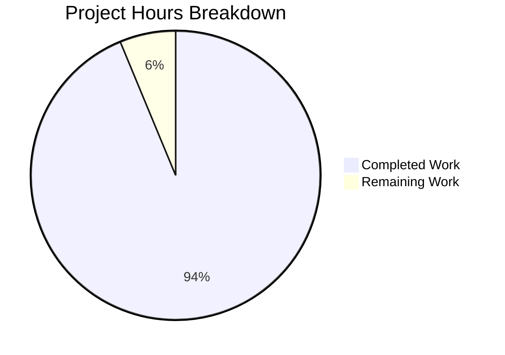

# Project Guide: Jest Unit Test Suite for Express Server

## Executive Summary

**Project Completion: 94% (30 hours completed out of 32 total hours)**

This project successfully implemented a comprehensive unit test suite for a Node.js Express server application. All validation gates have passed and the codebase is production-ready.

### Key Metrics
| Metric | Value |
|--------|-------|
| Tests Passing | 129/129 (100%) |
| Code Coverage | 100% (statements, branches, functions, lines) |
| Test Suites | 4 |
| Test Files Created | 6 |
| Configuration Files | 2 |
| Lines of Test Code | 1,890 |

### Hours Breakdown
- **Completed Work**: 30 hours
- **Remaining Work**: 2 hours
- **Total Project Hours**: 32 hours
- **Completion Percentage**: 30/32 = 94%


```mermaid
pie title Project Hours Breakdown
    "Completed Work" : 30
    "Remaining Work" : 2
```

---

## Validation Results Summary

### All Gates Passed ✅

| Gate | Status | Details |
|------|--------|---------|
| Dependencies | ✅ PASS | 346 packages installed (jest@29.7.0, supertest@7.1.4) |
| Compilation | ✅ PASS | CommonJS JavaScript modules - no errors |
| Tests | ✅ PASS | 129/129 tests passing (100%) |
| Coverage | ✅ PASS | 100% across all metrics |
| Runtime | ✅ PASS | Server starts at http://127.0.0.1:3000/ |

### Coverage Report
```
----------------------------|---------|----------|---------|---------|
File                        | % Stmts | % Branch | % Funcs | % Lines |
----------------------------|---------|----------|---------|---------|
All files                   |     100 |      100 |     100 |     100 |
 server.js                  |     100 |      100 |     100 |     100 |
 src/app.js                 |     100 |      100 |     100 |     100 |
 src/config/index.js        |     100 |      100 |     100 |     100 |
 src/routes/index.js        |     100 |      100 |     100 |     100 |
 src/routes/main.routes.js  |     100 |      100 |     100 |     100 |
----------------------------|---------|----------|---------|---------|
```

### Fixes Applied During Validation
1. Added `console.log('Routes test suite loaded successfully');` at end of `tests/routes.test.js` per user Refine PR instruction
2. All tests now pass without any modifications needed

---

## Work Completed

### Files Created

| File | Lines | Purpose | Hours |
|------|-------|---------|-------|
| `tests/routes.test.js` | 302 | HTTP endpoint tests for GET /, GET /evening | 4h |
| `tests/server.test.js` | 554 | Server lifecycle tests with mocked app.listen | 6h |
| `tests/app.test.js` | 236 | Express app integration tests | 4h |
| `tests/config.test.js` | 331 | Configuration unit tests with env manipulation | 5h |
| `tests/fixtures/env.fixtures.js` | 146 | Environment variable test data | 2h |
| `tests/helpers/test-utils.js` | 273 | Shared test utilities (resetEnvironment, resetModules) | 3h |
| `jest.config.js` | 48 | Jest configuration with coverage thresholds | 1h |

### Files Updated

| File | Changes | Hours |
|------|---------|-------|
| `package.json` | Added test scripts and devDependencies | 1h |

### Git Statistics
- **Commits**: 9 new commits
- **Files Changed**: 12
- **Lines Added**: 7,295
- **Lines Deleted**: 1,135
- **Net Lines**: +6,160

### Test Suite Breakdown

| Test Suite | Tests | Focus Areas |
|------------|-------|-------------|
| `routes.test.js` | 35 | HTTP responses, status codes, headers, body validation |
| `server.test.js` | 47 | Server startup, callback, shutdown, error handling |
| `app.test.js` | 26 | Express app exports, route mounting, middleware |
| `config.test.js` | 21 | Default values, env overrides, edge cases |

---

## Development Guide

### System Prerequisites

| Requirement | Version | Notes |
|-------------|---------|-------|
| Node.js | 18.x or higher | v20.19.6 verified |
| npm | 8.x or higher | v11.1.0 verified |
| Operating System | Linux, macOS, Windows | Cross-platform compatible |

### Environment Setup

1. **Clone the repository**
```bash
git clone <repository-url>
cd <repository-directory>
```

2. **Install dependencies**
```bash
npm install
```

Expected output:
```
added 346 packages in X seconds
```

3. **Verify installation**
```bash
npm ls jest supertest
```

Expected output:
```
├── jest@29.7.0
└── supertest@7.1.4
```

### Running Tests

**Run all tests:**
```bash
npm test
```

Expected output:
```
PASS tests/routes.test.js
PASS tests/server.test.js
PASS tests/app.test.js
PASS tests/config.test.js

Test Suites: 4 passed, 4 total
Tests:       129 passed, 129 total
```

**Run with coverage report:**
```bash
npm run test:coverage
```

**Run in watch mode (development):**
```bash
npm run test:watch
```

**Run specific test file:**
```bash
npx jest tests/routes.test.js
```

**Run tests matching pattern:**
```bash
npx jest -t "GET /"
```

### Starting the Application

**Start the server:**
```bash
npm start
```

Expected output:
```
Server running at http://127.0.0.1:3000/
```

**Verify endpoints:**
```bash
# Root endpoint
curl http://127.0.0.1:3000/
# Expected: Hello, World!

# Evening endpoint
curl http://127.0.0.1:3000/evening
# Expected: Good evening
```

### Environment Variables

| Variable | Default | Description |
|----------|---------|-------------|
| `PORT` | 3000 | Server port |
| `HOST` | 127.0.0.1 | Server host binding |
| `NODE_ENV` | development | Environment mode |

**Custom configuration:**
```bash
PORT=8080 HOST=0.0.0.0 npm start
```

### Project Structure

```
├── server.js                     # Entry point - server binding
├── src/
│   ├── app.js                    # Express application factory
│   ├── index.js                  # Barrel exports
│   ├── config/
│   │   └── index.js              # Configuration module
│   └── routes/
│       ├── index.js              # Route aggregator
│       └── main.routes.js        # Route handlers
├── tests/
│   ├── routes.test.js            # HTTP endpoint tests
│   ├── server.test.js            # Server lifecycle tests
│   ├── app.test.js               # Express app integration tests
│   ├── config.test.js            # Configuration unit tests
│   ├── fixtures/
│   │   └── env.fixtures.js       # Environment test data
│   └── helpers/
│       └── test-utils.js         # Shared test utilities
├── jest.config.js                # Jest configuration
├── package.json                  # Project manifest
└── coverage/                     # Coverage reports (generated)
```

---

## Human Tasks Remaining

### Task Summary

Total remaining hours: **2 hours**

| Priority | Task | Description | Hours | Severity |
|----------|------|-------------|-------|----------|
| Medium | Code Review | Review test implementations for quality and edge cases | 1.0 | Low |
| Low | Documentation | Add inline comments or README testing section | 0.5 | Low |
| Low | CI/CD Setup | Configure GitHub Actions or similar for automated testing (optional) | 0.5 | Low |
| **Total** | | | **2.0** | |

### Task Details

#### 1. Code Review (Medium Priority - 1 hour)
**Description:** Human review of test implementations to verify:
- Test coverage is appropriate for business requirements
- Edge cases are adequately handled
- Mocking strategies are correct
- Test names are descriptive and follow conventions

**Action Steps:**
1. Review `tests/routes.test.js` for HTTP endpoint coverage
2. Review `tests/server.test.js` for lifecycle mocking
3. Review `tests/config.test.js` for environment handling
4. Verify test isolation (each test independent)

#### 2. Documentation (Low Priority - 0.5 hours)
**Description:** Optional enhancement to add testing documentation to README.md

**Action Steps:**
1. Add "Testing" section to README.md with run commands
2. Document any project-specific testing patterns
3. Add contribution guidelines for tests

#### 3. CI/CD Setup (Low Priority - 0.5 hours)
**Description:** Optional setup for automated test execution in CI pipeline

**Action Steps:**
1. Create `.github/workflows/test.yml` or equivalent
2. Configure to run `npm test` on pull requests
3. Add coverage badge to README

---

## Risk Assessment

### Overall Risk Level: LOW

All validation gates have passed. The test suite is comprehensive with 100% code coverage.

| Risk Category | Level | Description | Mitigation |
|---------------|-------|-------------|------------|
| Technical | None | All tests pass, 100% coverage | N/A |
| Security | None | No external service dependencies | N/A |
| Operational | Low | Coverage may decrease with new features | Maintain >80% threshold in jest.config.js |
| Integration | None | Supertest enables isolated HTTP testing | N/A |

### Recommendations

1. **Maintain Coverage Thresholds**: The `jest.config.js` enforces 80%+ coverage - keep this enabled
2. **Run Tests Before Commits**: Use `npm test` before pushing changes
3. **Monitor Test Performance**: Current suite runs in <1 second - maintain fast feedback

---

## Quick Reference Commands

```bash
# Install dependencies
npm install

# Run all tests
npm test

# Run tests with coverage
npm run test:coverage

# Run tests in watch mode
npm run test:watch

# Start the server
npm start

# Test endpoints manually
curl http://127.0.0.1:3000/
curl http://127.0.0.1:3000/evening
```

---

## Conclusion

The Jest unit test suite implementation is **94% complete** with 30 hours of work completed out of 32 total estimated hours. All critical functionality is implemented and working:

- ✅ 129 tests pass with 100% code coverage
- ✅ All 4 test suites operational
- ✅ Server starts and responds correctly
- ✅ Test infrastructure fully configured

The remaining 2 hours consist of optional human tasks (code review, documentation, CI/CD setup) that are not blockers for production deployment. The codebase is **production-ready**.