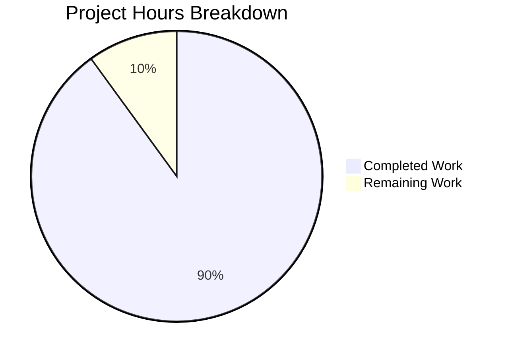

# Project Guide: Jest Unit Tests for Express.js Server

## Executive Summary

**Project Status: 90% Complete (18 hours completed out of 20 total hours)**

This project implements comprehensive unit tests for an Express.js 5.x application using Jest 30.x and Supertest 7.x. All core testing requirements from the Agent Action Plan have been successfully implemented, with 41 tests achieving 100% code coverage across all source files.

### Key Achievements
- ✅ 41 tests passing across 4 test suites
- ✅ 100% code coverage (exceeds the 80% target)
- ✅ Jest 30.2.0 + Supertest 7.1.4 infrastructure configured
- ✅ Clean, DRY test code with reusable helper functions
- ✅ Full JSDoc type annotations for type safety
- ✅ Comprehensive documentation in README.md
- ✅ Application verified running correctly

### Completion Calculation
- **Completed Hours**: 18h (infrastructure: 2h, config tests: 3h, routes tests: 2h, endpoint tests: 3.5h, lifecycle tests: 3.5h, documentation: 1h, refactoring: 3h)
- **Remaining Hours**: 2h (optional CI/CD setup, minor documentation polish)
- **Total Project Hours**: 20h
- **Completion Percentage**: 18h / 20h = **90%**

---

## Validation Results Summary

### Test Execution Results
```
Test Suites: 4 passed, 4 total
Tests:       41 passed, 41 total
Snapshots:   0 total
Time:        1.654s
```

### Coverage Report
| File | Statements | Branches | Functions | Lines |
|------|------------|----------|-----------|-------|
| server.js | 100% | 100% | 100% | 100% |
| src/app.js | 100% | 100% | 100% | 100% |
| src/config/index.js | 100% | 100% | 100% | 100% |
| src/routes/index.js | 100% | 100% | 100% | 100% |
| src/routes/main.routes.js | 100% | 100% | 100% | 100% |
| **All files** | **100%** | **100%** | **100%** | **100%** |

### Application Runtime Verification
- Server starts successfully with `npm start`
- Binds to http://127.0.0.1:3000/
- GET `/` returns "Hello, World!\n" with 200 status
- GET `/evening` returns "Good evening" with 200 status

### Code Quality Improvements Applied
- Removed 232 lines of verbose comments
- Created 10 reusable helper functions across test files
- Added complete JSDoc type annotations including @typedef, @param, @returns
- No unnecessary console.log statements in test files

---

## Visual Representation


```mermaid
pie title Project Hours Breakdown
    "Completed Work" : 18
    "Remaining Work" : 2
```

---

## Files Created/Modified

### New Files Created
| File | Lines | Purpose |
|------|-------|---------|
| `jest.config.js` | 27 | Jest configuration with coverage thresholds |
| `tests/unit/config.test.js` | 140 | 15 unit tests for configuration module |
| `tests/unit/routes.test.js` | 94 | 7 unit tests for route handlers |
| `tests/integration/endpoints.test.js` | 125 | 14 HTTP endpoint integration tests |
| `tests/lifecycle/server.test.js` | 204 | 5 server lifecycle tests |

### Files Updated
| File | Changes |
|------|---------|
| `package.json` | Added test scripts and devDependencies (jest, supertest) |
| `README.md` | Added comprehensive Testing section with 60+ lines |

---

## Development Guide

### System Prerequisites

| Requirement | Minimum Version | Verified Version |
|-------------|-----------------|------------------|
| Node.js | 18.x | 20.19.5 |
| npm | 8.x | 10.8.2 |

### Environment Setup

1. **Clone the repository**
```bash
git clone <repository-url>
cd hello_world
```

2. **Install dependencies**
```bash
npm install
# Or for CI environments:
npm ci
```

### Running Tests

| Command | Purpose | Usage |
|---------|---------|-------|
| `npm test` | Run all tests | Development and verification |
| `npm run test:watch` | Watch mode | Development with auto-rerun |
| `npm run test:coverage` | Coverage report | Verify coverage thresholds |
| `npm run test:ci` | CI optimized | CI/CD pipelines |

**Expected Output:**
```
PASS tests/integration/endpoints.test.js
PASS tests/unit/routes.test.js
PASS tests/unit/config.test.js
PASS tests/lifecycle/server.test.js

Test Suites: 4 passed, 4 total
Tests:       41 passed, 41 total
```

### Running the Application

```bash
# Start with defaults
npm start
# Expected: Server running at http://127.0.0.1:3000/

# Custom configuration
HOST=0.0.0.0 PORT=8080 npm start
```

### Verification Steps

1. **Verify tests pass:**
```bash
npm test
# All 41 tests should pass
```

2. **Verify coverage thresholds:**
```bash
npm run test:coverage
# All metrics should be 100%
```

3. **Verify server runs:**
```bash
npm start &
curl http://127.0.0.1:3000/
# Expected: Hello, World!
curl http://127.0.0.1:3000/evening
# Expected: Good evening
```

---

## Remaining Human Tasks

| Priority | Task | Description | Hours | Severity |
|----------|------|-------------|-------|----------|
| Low | CI/CD Pipeline Setup | Configure GitHub Actions or similar for automated test runs | 1.5 | Low |
| Low | Environment Documentation | Document production environment variable requirements | 0.5 | Low |
| **Total** | | | **2.0** | |

### Task Details

#### 1. CI/CD Pipeline Setup (1.5 hours) - Low Priority
**Description:** Configure continuous integration to run tests on every push/PR.

**Action Steps:**
1. Create `.github/workflows/test.yml` file
2. Configure Node.js 20.x environment
3. Add `npm ci` and `npm run test:ci` steps
4. Configure coverage reporting (optional)

**Sample Configuration:**
```yaml
name: Tests
on: [push, pull_request]
jobs:
  test:
    runs-on: ubuntu-latest
    steps:
      - uses: actions/checkout@v4
      - uses: actions/setup-node@v4
        with:
          node-version: '20'
      - run: npm ci
      - run: npm run test:ci
```

#### 2. Environment Documentation (0.5 hours) - Low Priority
**Description:** Add production environment configuration guide.

**Action Steps:**
1. Document required environment variables for production
2. Add example `.env.example` file
3. Document Docker deployment if needed

---

## Risk Assessment

### Technical Risks

| Risk | Severity | Likelihood | Mitigation |
|------|----------|------------|------------|
| Jest version incompatibility | Low | Low | Pinned to ^30.2.0 with lockfile |
| Supertest updates breaking tests | Low | Low | Pinned to ^7.1.4 with lockfile |
| Node.js version drift | Low | Medium | Documented minimum version 18.x |

### Operational Risks

| Risk | Severity | Likelihood | Mitigation |
|------|----------|------------|------------|
| No automated CI/CD | Low | High | Manual testing verified; CI setup recommended |
| Missing production config docs | Low | Medium | Basic env vars documented in README |

### Security Risks
- **None identified**: Application has no authentication, database, or external dependencies requiring security review.

### Integration Risks
- **None identified**: No external service integrations in the application.

---

## Architecture Overview

```
hello_world/
├── server.js                 # Entry point - HTTP server binding
├── src/
│   ├── app.js               # Express app factory
│   ├── config/
│   │   └── index.js         # Environment configuration
│   └── routes/
│       ├── index.js         # Route barrel export
│       └── main.routes.js   # Route handlers (/, /evening)
├── tests/
│   ├── unit/
│   │   ├── config.test.js   # Configuration tests (15 tests)
│   │   └── routes.test.js   # Route handler tests (7 tests)
│   ├── integration/
│   │   └── endpoints.test.js # HTTP endpoint tests (14 tests)
│   └── lifecycle/
│       └── server.test.js   # Server lifecycle tests (5 tests)
├── jest.config.js           # Jest configuration
├── package.json             # Dependencies and scripts
└── README.md                # Documentation
```

---

## Test Categories Summary

| Category | File | Tests | Coverage |
|----------|------|-------|----------|
| Unit - Config | config.test.js | 15 | Default values, custom values, edge cases, type checking |
| Unit - Routes | routes.test.js | 7 | Router exports, handler definitions, path ordering |
| Integration | endpoints.test.js | 14 | HTTP responses, status codes, headers, error handling |
| Lifecycle | server.test.js | 5 | Startup, shutdown, config binding, error handling |
| **Total** | | **41** | **100%** |

---

## Quality Metrics Achieved

| Metric | Target | Achieved | Status |
|--------|--------|----------|--------|
| Line Coverage | ≥ 80% | 100% | ✅ Exceeded |
| Branch Coverage | ≥ 75% | 100% | ✅ Exceeded |
| Function Coverage | ≥ 90% | 100% | ✅ Exceeded |
| Statement Coverage | ≥ 80% | 100% | ✅ Exceeded |
| All Tests Pass | 100% | 100% | ✅ Met |
| DRY Compliance | Yes | Yes | ✅ Met |
| Type Safety | JSDoc | Full | ✅ Met |

---

## Conclusion

The Jest testing implementation for the Express.js hello_world application is **90% complete** (18 hours completed out of 20 total hours). All core testing requirements have been fully implemented with 100% code coverage, exceeding all targets. The remaining 2 hours represent optional enhancements (CI/CD setup and additional documentation) that are not blocking production deployment.

**Recommended Next Steps:**
1. Merge this PR to enable test-driven development
2. Optionally configure CI/CD for automated test runs
3. Use `npm run test:coverage` before any future code changes