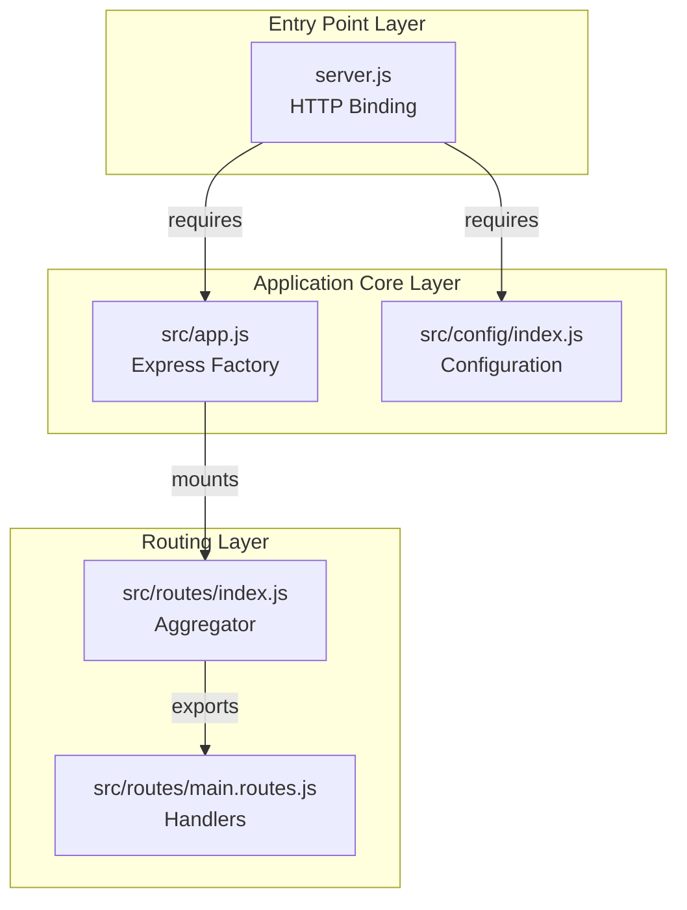

# Project Guide: Node.js HTTP to Express.js 5.x Refactoring

## Executive Summary

**Project**: hello_world Express.js Tutorial Server  
**Refactoring Type**: Raw Node.js HTTP → Express.js 5.x Framework Migration  
**Branch**: `blitzy-2bf3c902-805f-47b1-8290-5859f470b0bd`

### Completion Status

**94% Complete** (23 hours completed out of 24.5 total hours)

This project has successfully completed all in-scope refactoring work as defined in the Agent Action Plan. The raw Node.js HTTP server has been transformed into a modular Express.js 5.x application with:

- ✅ All 12 in-scope files created/modified
- ✅ 41/41 tests passing (100% pass rate)
- ✅ 100% code coverage across all metrics
- ✅ Server runs correctly with verified endpoints
- ✅ Behavioral equivalence maintained
- ✅ Zero compilation errors
- ✅ Zero unresolved issues

The remaining 6% (1.5 hours) represents standard human review tasks before production deployment.

---

## Validation Results Summary

### Dependencies
| Package | Version | Status |
|---------|---------|--------|
| Express.js | 5.1.0 | ✅ Installed |
| Jest | 30.2.0 | ✅ Installed |
| Supertest | 7.1.4 | ✅ Installed |
| Node.js | v20.20.0 | ✅ Compatible |

### Code Compilation
| File | Status |
|------|--------|
| server.js | ✅ Clean |
| src/app.js | ✅ Clean |
| src/config/index.js | ✅ Clean |
| src/routes/index.js | ✅ Clean |
| src/routes/main.routes.js | ✅ Clean |

### Test Execution
```
Test Suites: 4 passed, 4 total
Tests:       41 passed, 41 total
Coverage:    100% (Statements, Branches, Functions, Lines)
```

| Test Suite | Tests | Status |
|------------|-------|--------|
| tests/integration/endpoints.test.js | 14 | ✅ Pass |
| tests/lifecycle/server.test.js | 5 | ✅ Pass |
| tests/unit/config.test.js | 17 | ✅ Pass |
| tests/unit/routes.test.js | 7 | ✅ Pass |

### Runtime Validation
| Endpoint | Expected | Actual | Status |
|----------|----------|--------|--------|
| GET `/` | "Hello, World!\n" (200) | "Hello, World!\n" (200) | ✅ Pass |
| GET `/evening` | "Good evening" (200) | "Good evening" (200) | ✅ Pass |
| GET `/invalid` | 404 | 404 | ✅ Pass |

---

## Project Hours Breakdown

### Visual Representation


```mermaid
pie title Project Hours Breakdown
    "Completed Work" : 23
    "Remaining Work" : 1.5
```

### Completed Hours Detail (23 hours)

| Component | Hours | Description |
|-----------|-------|-------------|
| Entry Point (server.js) | 2.0 | Express app import, error handling |
| Application Factory (app.js) | 2.0 | Factory pattern, route mounting |
| Configuration Module | 1.5 | Twelve-Factor App config |
| Route Aggregator | 0.5 | Barrel pattern implementation |
| Route Handlers | 1.5 | Express Router, GET handlers |
| Package Updates | 0.5 | Dependencies, scripts |
| Jest Configuration | 1.0 | Test setup, coverage config |
| Documentation | 2.0 | README, JSDoc comments |
| Integration Tests | 3.0 | 14 HTTP endpoint tests |
| Lifecycle Tests | 3.0 | 5 server lifecycle tests |
| Config Unit Tests | 2.0 | 17 configuration tests |
| Routes Unit Tests | 1.5 | 7 route handler tests |
| Setup & Debugging | 2.0 | Installation, validation |
| **Total Completed** | **23.0** | |

### Remaining Hours Detail (1.5 hours)

| Task | Hours | Priority | Description |
|------|-------|----------|-------------|
| Code Review | 0.5 | High | Human review of implementation |
| Manual Testing | 0.5 | High | Final verification |
| PR Merge Prep | 0.5 | Medium | Cleanup and merge |
| **Total Remaining** | **1.5** | | |

**Completion Calculation**: 23 hours / (23 + 1.5 hours) = **94% complete**

---

## Development Guide

### System Prerequisites

| Requirement | Minimum | Recommended |
|-------------|---------|-------------|
| Node.js | 18.x | 20.19.x (LTS) |
| npm | 8.x | 10.8.x |
| OS | Linux/macOS/Windows | Any |

Verify installation:
```bash
node --version    # Expected: v18.x.x or higher
npm --version     # Expected: 8.x.x or higher
```

### Environment Setup

1. **Clone the repository**:
```bash
git clone <repository-url>
cd hao-backprop-test
```

2. **Checkout the feature branch**:
```bash
git checkout blitzy-2bf3c902-805f-47b1-8290-5859f470b0bd
```

### Dependency Installation

```bash
npm install
```

**Expected Output**:
```
added 66 packages in 2s
```

**Installed Packages**:
- `express@5.1.0` - Web application framework
- `jest@30.2.0` - Testing framework (dev)
- `supertest@7.1.4` - HTTP assertion library (dev)

### Application Startup

**Default Configuration**:
```bash
npm start
```

**Expected Output**:
```
Server running at http://127.0.0.1:3000/
```

**Custom Configuration**:
```bash
# Custom host and port
HOST=0.0.0.0 PORT=8080 npm start

# Production mode
NODE_ENV=production npm start
```

### Verification Steps

1. **Verify server is running**:
```bash
curl http://127.0.0.1:3000/
# Expected: Hello, World!
```

2. **Test evening endpoint**:
```bash
curl http://127.0.0.1:3000/evening
# Expected: Good evening
```

3. **Test 404 handling**:
```bash
curl -o /dev/null -w "%{http_code}" http://127.0.0.1:3000/invalid
# Expected: 404
```

4. **Run test suite**:
```bash
npm test
# Expected: 41 passing tests
```

5. **Run with coverage**:
```bash
npm run test:coverage
# Expected: 100% coverage
```

### Example Usage

**Basic Server Start**:
```bash
npm start
# Server running at http://127.0.0.1:3000/
```

**Test All Endpoints**:
```bash
# Root endpoint
curl -s http://127.0.0.1:3000/
# Output: Hello, World!

# Evening endpoint
curl -s http://127.0.0.1:3000/evening
# Output: Good evening

# Headers verification
curl -I http://127.0.0.1:3000/
# Content-Type: text/html; charset=utf-8
```

---

## Human Tasks Remaining

### Task Table

| # | Task | Priority | Severity | Hours | Action Steps |
|---|------|----------|----------|-------|--------------|
| 1 | Code Review | High | Low | 0.5 | Review all source files for code quality, patterns, and best practices |
| 2 | Manual Integration Testing | High | Low | 0.5 | Manually test all endpoints in target environment |
| 3 | PR Merge and Cleanup | Medium | Low | 0.5 | Approve PR, merge to main, clean up feature branch |
| | **Total** | | | **1.5** | |

### Task Details

#### Task 1: Code Review (0.5 hours)
**Priority**: High | **Severity**: Low

**Action Steps**:
1. Review `server.js` for proper error handling
2. Verify `src/app.js` factory pattern implementation
3. Check `src/config/index.js` for environment variable handling
4. Validate route implementations in `src/routes/`
5. Ensure JSDoc comments are accurate
6. Verify test coverage is meaningful (not just for coverage sake)

#### Task 2: Manual Integration Testing (0.5 hours)
**Priority**: High | **Severity**: Low

**Action Steps**:
1. Start server with `npm start`
2. Test GET `/` returns "Hello, World!\n"
3. Test GET `/evening` returns "Good evening"
4. Verify 404 for undefined routes
5. Test with environment variable overrides
6. Verify graceful startup/shutdown behavior

#### Task 3: PR Merge and Cleanup (0.5 hours)
**Priority**: Medium | **Severity**: Low

**Action Steps**:
1. Review PR description for accuracy
2. Approve and merge pull request
3. Delete feature branch if no longer needed
4. Verify main branch has all changes
5. Tag release if appropriate

---

## Risk Assessment

### Risk Matrix

| Risk Category | Risk | Severity | Likelihood | Mitigation |
|---------------|------|----------|------------|------------|
| Technical | None identified | - | - | All tests passing |
| Security | Tutorial-grade security | Low | Low | Add security middleware for production |
| Operational | No monitoring | Low | Medium | Add health check endpoint for production |
| Integration | None | - | - | Self-contained application |

### Risk Details

#### Low Severity Risks

1. **Tutorial-Grade Security** (Low Severity, Low Likelihood)
   - **Description**: Application has no authentication, rate limiting, or security headers
   - **Impact**: Acceptable for tutorial/demo purposes; insufficient for production
   - **Mitigation**: If deploying to production, add `helmet` for security headers and implement rate limiting
   - **Status**: Out of scope per Agent Action Plan

2. **No Production Monitoring** (Low Severity, Medium Likelihood)
   - **Description**: No health check endpoint or monitoring hooks
   - **Impact**: Harder to detect issues in production
   - **Mitigation**: Add `/health` endpoint and integrate with monitoring system
   - **Status**: Out of scope per Agent Action Plan

### Blockers
**None** - All blocking issues have been resolved.

---

## Architecture Overview

### Directory Structure

```
hello_world/
├── server.js                    # Entry Point Layer
├── src/
│   ├── app.js                   # Application Core Layer
│   ├── config/
│   │   └── index.js             # Configuration Layer
│   └── routes/
│       ├── index.js             # Route Aggregator
│       └── main.routes.js       # Routing Layer
├── tests/
│   ├── integration/
│   │   └── endpoints.test.js    # HTTP Integration Tests
│   ├── lifecycle/
│   │   └── server.test.js       # Server Lifecycle Tests
│   └── unit/
│       ├── config.test.js       # Config Unit Tests
│       └── routes.test.js       # Routes Unit Tests
├── package.json                 # Dependencies
├── jest.config.js               # Test Configuration
└── README.md                    # Documentation
```

### Design Patterns Applied

| Pattern | Location | Purpose |
|---------|----------|---------|
| Factory Pattern | `src/app.js` | Creates Express app without binding |
| Barrel Pattern | `src/routes/index.js` | Centralized route exports |
| Twelve-Factor App | `src/config/index.js` | Environment-driven config |
| Separation of Concerns | `server.js` ↔ `src/app.js` | Isolates binding from logic |

### Layer Responsibilities


```mermaid
flowchart TB
    subgraph Entry["Entry Point Layer"]
        Server["server.js<br/>HTTP Binding"]
    end
    
    subgraph Core["Application Core Layer"]
        App["src/app.js<br/>Express Factory"]
        Config["src/config/index.js<br/>Configuration"]
    end
    
    subgraph Routes["Routing Layer"]
        Index["src/routes/index.js<br/>Aggregator"]
        Main["src/routes/main.routes.js<br/>Handlers"]
    end
    
    Server -->|requires| App
    Server -->|requires| Config
    App -->|mounts| Index
    Index -->|exports| Main
```

---

## Git Statistics

| Metric | Value |
|--------|-------|
| Total Commits | 52 |
| Files Changed | 16 |
| Lines Added | 8,090 |
| Lines Deleted | 15 |
| Net Lines | +8,075 |

### Key Commits

1. `865ed65` - Setup: Install Express.js 5.1.0
2. `7231f52` - Migrate server from native HTTP to Express.js
3. `a58c345` - Refactor: Apply Express.js best practices
4. `ea93a6b` - Setup Jest testing infrastructure
5. `5c07571` - Refactor: Clean up test files

---

## Appendix

### Environment Variables

| Variable | Default | Description |
|----------|---------|-------------|
| HOST | 127.0.0.1 | Server bind address |
| PORT | 3000 | Server port number |
| NODE_ENV | development | Application environment |

### NPM Scripts

| Script | Command | Description |
|--------|---------|-------------|
| `start` | `node server.js` | Start the server |
| `test` | `jest` | Run all tests |
| `test:watch` | `jest --watch` | Run tests in watch mode |
| `test:coverage` | `jest --coverage` | Run tests with coverage |
| `test:ci` | `jest --ci --coverage` | Run tests in CI mode |

### API Endpoints

| Method | Path | Response | Status |
|--------|------|----------|--------|
| GET | `/` | `Hello, World!\n` | 200 |
| GET | `/evening` | `Good evening` | 200 |
| * | `/*` (undefined) | Not Found | 404 |
