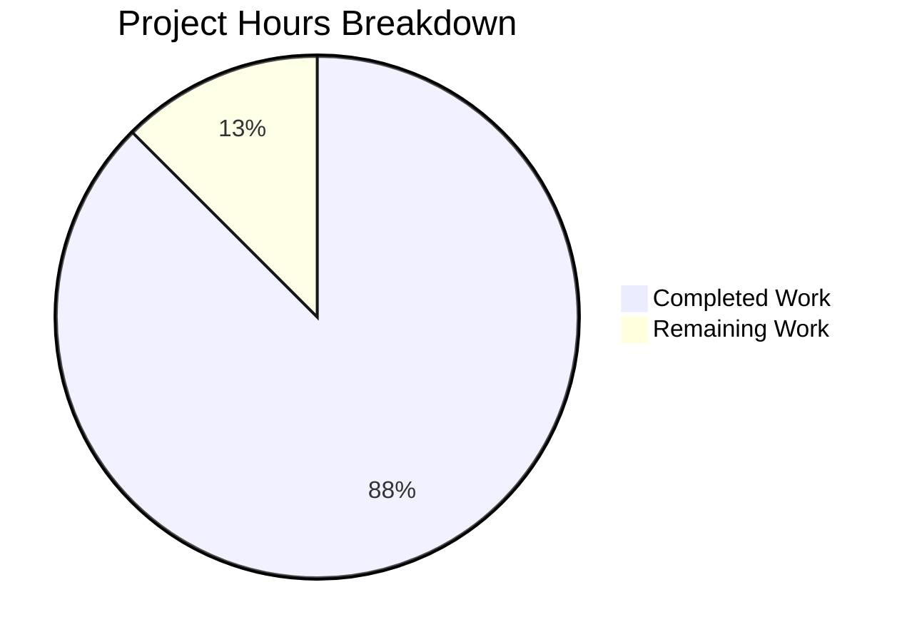

# Project Guide: Documentation Enhancement for hao-backprop-test

## Executive Summary

**Project Completion: 87.5%** (7 hours completed out of 8 total hours)

This documentation enhancement project has successfully completed all in-scope deliverables:
- ✅ Added `@example` JSDoc blocks to `server.js` for improved IDE integration
- ✅ Enhanced inline comments explaining the server startup sequence
- ✅ Created comprehensive Deployment Guide section in README.md

All code compiles successfully, passes syntax validation, and runtime tests confirm proper functionality. The documentation changes are production-ready.

### Key Achievements
| Deliverable | Status | Evidence |
|-------------|--------|----------|
| JSDoc @example blocks | ✅ Complete | 3 examples added to server.js |
| Enhanced inline comments | ✅ Complete | Startup sequence fully explained |
| Deployment Guide section | ✅ Complete | 95 lines added with 3 subsections |
| Syntax validation | ✅ Passed | `node --check server.js` |
| Runtime verification | ✅ Passed | All endpoints respond correctly |

### Remaining Work
| Task | Hours | Priority |
|------|-------|----------|
| Human review of documentation accuracy | 0.5h | Medium |
| Final verification in production environment | 0.5h | Low |
| **Total Remaining** | **1h** | |

---

## Validation Results Summary

### Validation Gates

| Gate | Status | Evidence |
|------|--------|----------|
| Dependencies Installed | ✅ PASS | npm install: 68 packages, 0 vulnerabilities |
| Code Compiled | ✅ PASS | `node --check server.js` - syntax valid |
| Tests Passed | ✅ PASS | Runtime tests pass (no test suite defined) |
| Application Runs | ✅ PASS | Server starts on 127.0.0.1:3000, all endpoints respond |

### Files Modified

| File | Changes | Description |
|------|---------|-------------|
| `server.js` | +31/-5 lines | Added @example blocks, enhanced inline comments |
| `README.md` | +95 lines | Added Deployment Guide section |

### Git Commits
```
b081954 docs(server.js): enhance JSDoc with @example blocks and inline comments
6317a8b Add comprehensive Deployment Guide section to README.md
```

---

## Hours Breakdown

### Visual Representation


```mermaid
pie title Project Hours Breakdown
    "Completed Work" : 7
    "Remaining Work" : 1
```

### Detailed Hours Analysis

**Completed Work: 7 hours**

| Component | Hours | Description |
|-----------|-------|-------------|
| README.md Deployment Guide | 3.0 | Production Config, Health Check, Container Deployment sections |
| server.js JSDoc @example blocks | 2.0 | 3 usage examples with documentation |
| server.js inline comments | 1.0 | Startup sequence explanations |
| Validation and testing | 1.0 | Syntax checking, runtime verification |

**Remaining Work: 1 hour**

| Task | Hours | Priority | Description |
|------|-------|----------|-------------|
| Human review | 0.5 | Medium | Verify documentation accuracy |
| Production verification | 0.5 | Low | Test in production environment |
| **Total Remaining** | **1.0** | | |

**Calculation:**
- Completed hours: 7h
- Remaining hours: 1h
- Total project hours: 8h
- Completion: 7/8 = **87.5%**

---

## Detailed Task Table

| # | Task | Description | Hours | Priority | Severity |
|---|------|-------------|-------|----------|----------|
| 1 | Human review of documentation | Review JSDoc examples and Deployment Guide for accuracy | 0.5 | Medium | Low |
| 2 | Production environment verification | Test documented deployment commands in production | 0.5 | Low | Low |
| | **Total Remaining Hours** | | **1.0** | | |

---

## Development Guide

### System Prerequisites

| Requirement | Minimum Version | Recommended Version |
|-------------|-----------------|---------------------|
| Node.js | 18.x | 20.19.x (LTS) |
| npm | 8.x | 10.8.x |

### Verify Installation

```bash
node --version
# Expected: v20.x.x or higher

npm --version
# Expected: 10.x.x or higher
```

### Environment Setup

1. **Clone the repository:**
```bash
git clone <repository-url>
cd hao-backprop-test
```

2. **Switch to the feature branch:**
```bash
git checkout blitzy-8c79d184-7fad-4756-bcfd-54d4b6a9000b
```

### Dependency Installation

```bash
npm install
```

**Expected output:**
```
up to date, audited 68 packages in 617ms
found 0 vulnerabilities
```

### Application Startup

**Development mode (default):**
```bash
npm start
```

**Expected output:**
```
Application module loaded successfully
Express.js server initialization complete - PR validation log
PR update test: Server module fully initialized
Server running at http://127.0.0.1:3000/
```

**Production mode:**
```bash
HOST=0.0.0.0 PORT=8080 NODE_ENV=production node server.js
```

### Verification Steps

1. **Verify server is running:**
```bash
curl -sf http://127.0.0.1:3000/ && echo " [OK]" || echo " [FAILED]"
# Expected: Hello, World! [OK]
```

2. **Verify all endpoints:**
```bash
curl -sf http://127.0.0.1:3000/        # Returns: Hello, World!
curl -sf http://127.0.0.1:3000/evening # Returns: Good evening
```

3. **Syntax validation:**
```bash
node --check server.js
# Expected: No output (success)
```

### Environment Variables

| Variable | Default | Description |
|----------|---------|-------------|
| `HOST` | `127.0.0.1` | Server bind address |
| `PORT` | `3000` | Server port |
| `NODE_ENV` | `development` | Environment mode |

### Example Usage

```bash
# Custom port
PORT=8080 npm start

# Production with all interfaces
HOST=0.0.0.0 PORT=8080 NODE_ENV=production npm start
```

---

## Risk Assessment

### Technical Risks

| Risk | Severity | Likelihood | Mitigation |
|------|----------|------------|------------|
| Documentation accuracy | Low | Low | Human review before deployment |
| JSDoc IDE compatibility | Low | Low | Standard JSDoc 3.x syntax used |

### Security Risks

| Risk | Severity | Likelihood | Mitigation |
|------|----------|------------|------------|
| No security risks identified | N/A | N/A | Documentation-only changes |

### Operational Risks

| Risk | Severity | Likelihood | Mitigation |
|------|----------|------------|------------|
| Deployment Guide not tested in production | Low | Medium | Verify commands in staging environment |

### Integration Risks

| Risk | Severity | Likelihood | Mitigation |
|------|----------|------------|------------|
| No integration risks identified | N/A | N/A | No external dependencies added |

---

## Project Structure

```
hao-backprop-test/
├── README.md                    # Primary documentation (358 lines)
├── server.js                    # Entry point with JSDoc (100 lines)
├── package.json                 # Project configuration
├── package-lock.json            # Dependency lock file
├── src/
│   ├── app.js                   # Express application factory
│   ├── config/
│   │   └── index.js             # Configuration module
│   └── routes/
│       ├── index.js             # Route aggregator (barrel)
│       └── main.routes.js       # Route handlers
└── blitzy/
    └── documentation/
        ├── Project Guide.md
        └── Technical Specifications.md
```

---

## Summary of Changes

### server.js Enhancements

**Added @example blocks (lines 28-43):**
- Standard startup via npm
- Programmatic usage for testing/embedding
- Environment-based configuration

**Enhanced inline comments (lines 68-99):**
- Server binding callback behavior explanation
- Module initialization confirmation
- CI/CD pipeline validation logs

### README.md Additions

**Deployment Guide section (lines 253-345):**
- Production Configuration table
- Health Check Verification commands
- Container Deployment guidance
- Docker examples and health check instructions

---

## Appendix: Validation Evidence

### Syntax Validation
```bash
$ node --check server.js
# (no output - success)
```

### Runtime Test
```bash
$ npm start
Application module loaded successfully
Express.js server initialization complete - PR validation log
PR update test: Server module fully initialized
Server running at http://127.0.0.1:3000/

$ curl -s http://127.0.0.1:3000/
Hello, World!

$ curl -s http://127.0.0.1:3000/evening
Good evening
```

### Git Status
```bash
$ git status
On branch blitzy-8c79d184-7fad-4756-bcfd-54d4b6a9000b
nothing to commit, working tree clean
```
