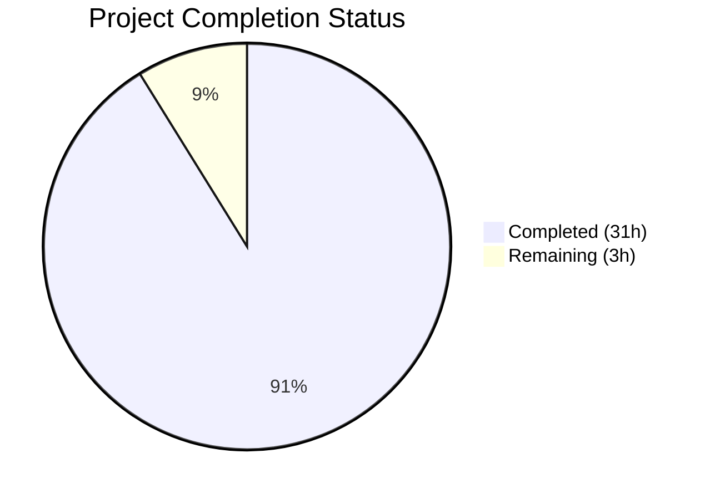
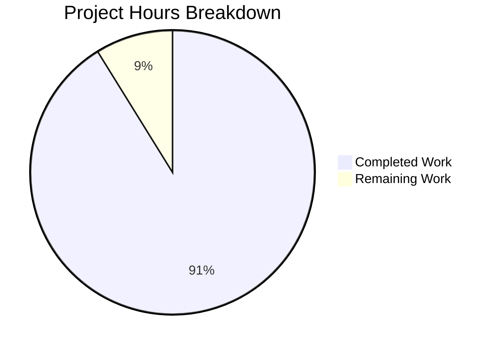
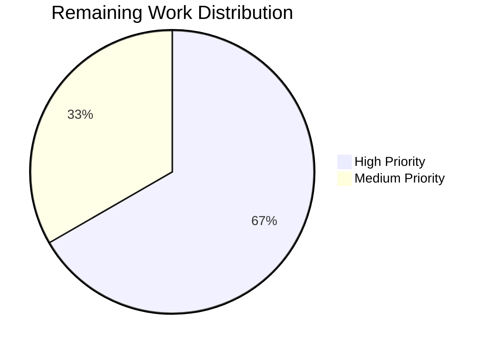

# Blitzy Project Guide

---

## 1. Executive Summary

### 1.1 Project Overview

This project transforms an existing bare-bones Node.js HTTP tutorial server into a modern Express.js 5.1.0-powered application with modular architecture and an additional greeting endpoint. The two core requirements were: (1) integrate the Express.js web framework with structured routing, middleware support, and an app factory pattern while preserving the original `GET /` endpoint, and (2) add a new `GET /evening` endpoint returning `"Good evening"`. The implementation follows Twelve-Factor App methodology for configuration, uses a barrel-pattern route aggregator for extensibility, and includes a comprehensive 44-test suite achieving 100% code coverage. All 18 AAP-scoped files have been delivered with zero compilation errors, zero test failures, and zero security vulnerabilities.

### 1.2 Completion Status


```mermaid
pie title Project Completion Status
    "Completed (31h)" : 31
    "Remaining (3h)" : 3
```

| Metric | Value |
|--------|-------|
| **Total Project Hours** | 34 |
| **Completed Hours (AI)** | 31 |
| **Remaining Hours** | 3 |
| **Completion Percentage** | 91.2% |

**Calculation:** 31 completed hours / (31 + 3) total hours = 31 / 34 = **91.2% complete**

### 1.3 Key Accomplishments

- ✅ Express.js 5.1.0 integrated with app factory pattern (`src/app.js`) separating app creation from server binding for testability
- ✅ `GET /` endpoint preserved with exact backward compatibility — returns `"Hello, World!\n"` (HTTP 200, trailing newline confirmed)
- ✅ `GET /evening` endpoint implemented — returns `"Good evening"` (HTTP 200, no trailing newline)
- ✅ Modular route architecture with barrel-pattern aggregator (`configureRoutes(app)` in `src/routes/index.js`)
- ✅ Twelve-Factor configuration module (`src/config/index.js`) with `HOST`, `PORT`, `NODE_ENV` environment variable support and `Object.freeze()` immutability
- ✅ Comprehensive test suite: 4 suites, 44 tests, 100% coverage across statements, branches, functions, and lines
- ✅ Jest 30.3.0 configured with 80% global coverage thresholds enforced
- ✅ All 10 JavaScript source/test files pass Node.js syntax validation
- ✅ 0 npm audit vulnerabilities across 377 audited packages
- ✅ Complete project documentation: root README rewrite + 4 module-level READMEs with JSDoc inline comments

### 1.4 Critical Unresolved Issues

| Issue | Impact | Owner | ETA |
|-------|--------|-------|-----|
| No critical issues identified | N/A | N/A | N/A |

All AAP-scoped deliverables have been completed successfully. Zero compilation errors, zero test failures, and zero runtime errors were found during validation.

### 1.5 Access Issues

No access issues identified. All dependencies are sourced from the public npm registry, and no private registries, API keys, or external service credentials are required for this tutorial-scope project.

### 1.6 Recommended Next Steps

1. **[High]** Conduct human code review of the Express.js architecture and route implementation to validate tutorial quality and pedagogical clarity
2. **[High]** Configure production environment variables (`HOST`, `PORT`, `NODE_ENV`) for the target deployment environment
3. **[Medium]** Set up deployment process with Node.js process manager (e.g., PM2) for production stability
4. **[Medium]** Verify endpoint behavior in the production environment with smoke tests
5. **[Low]** Consider adding security headers (e.g., `helmet`) if the server will be exposed to public traffic in a non-tutorial context

---

## 2. Project Hours Breakdown

### 2.1 Completed Work Detail

| Component | Hours | Description |
|-----------|-------|-------------|
| Express.js App Factory (`src/app.js`) | 1.5 | Created Express application factory with route mounting via `configureRoutes(app)` barrel pattern, exports app without `listen()` |
| Configuration Module (`src/config/index.js`) | 1.5 | Implemented 12-Factor config with `HOST`/`PORT`/`NODE_ENV` env vars, `parseInt()` coercion, `Object.freeze()` immutability |
| Route Barrel Aggregator (`src/routes/index.js`) | 1.0 | Created `configureRoutes(app)` function mounting all route modules via barrel pattern |
| Route Handlers (`src/routes/main.routes.js`) | 1.5 | Implemented Express Router with `GET /` and `GET /evening` handlers matching exact response contracts |
| Server Entry Point (`server.js`) | 2.0 | Complete rewrite: imports app factory and config, binds via `app.listen()`, exports server instance for lifecycle testing |
| Package Configuration (`package.json`) | 1.0 | Added `express` dependency, `jest`/`supertest` devDependencies, test/start scripts, `engines.node >=18.0.0` |
| Jest Configuration (`jest.config.js`) | 1.0 | Created Jest config with `testEnvironment: 'node'`, 80% coverage thresholds, test file patterns |
| Git Ignore (`.gitignore`) | 0.5 | Expanded to cover `node_modules/`, `coverage/`, `.env`, IDE files, OS artifacts, build outputs |
| Unit Tests — Config (`tests/unit/config.test.js`) | 3.0 | 140 lines testing default values, env var overrides, port coercion, type checking, and edge cases |
| Unit Tests — Routes (`tests/unit/routes.test.js`) | 2.0 | 108 lines testing Router exports, route stack structure, handler definitions, and barrel function |
| Integration Tests (`tests/integration/endpoints.test.js`) | 3.0 | 125 lines testing HTTP contracts via Supertest: status codes, response bodies, Content-Type headers, 404 handling, edge cases |
| Lifecycle Tests (`tests/lifecycle/server.test.js`) | 4.0 | 211 lines testing server binding, module export, startup logging, config usage, graceful shutdown, EADDRINUSE handling |
| Root README (`README.md`) | 3.0 | 342-line full rewrite documenting architecture, API reference, project structure, env vars, testing, and troubleshooting |
| Module READMEs (4 files) | 2.0 | `src/README.md`, `src/routes/README.md`, `src/config/README.md`, `tests/README.md` — architecture and extension documentation |
| Validation & Bug Fixes | 4.0 | Compilation validation (10 files), test execution/debugging, runtime validation, 18 commits of iterative fixes (`'use strict'` directives, barrel pattern alignment, coverage threshold corrections) |
| **Total Completed** | **31** | |

### 2.2 Remaining Work Detail

| Category | Hours | Priority |
|----------|-------|----------|
| Human Code Review & PR Merge | 1 | High |
| Production Environment Configuration | 1 | High |
| Deployment Verification & Smoke Testing | 1 | Medium |
| **Total Remaining** | **3** | |

### 2.3 Hours Verification

- Section 2.1 Total (Completed): **31 hours**
- Section 2.2 Total (Remaining): **3 hours**
- Sum: 31 + 3 = **34 hours** = Total Project Hours in Section 1.2 ✅
- Completion: 31 / 34 = **91.2%** ✅

---

## 3. Test Results

All tests were executed by Blitzy's autonomous validation system using the command:
```bash
CI=true npx jest --coverage --forceExit --detectOpenHandles --no-watch
```

| Test Category | Framework | Total Tests | Passed | Failed | Coverage % | Notes |
|--------------|-----------|-------------|--------|--------|------------|-------|
| Unit — Configuration | Jest 30.3.0 | 16 | 16 | 0 | 100% | Default values, env overrides, port coercion, type checks, edge cases |
| Unit — Routes | Jest 30.3.0 | 9 | 9 | 0 | 100% | Router exports, route stack, handler definitions, barrel function |
| Integration — HTTP Endpoints | Jest 30.3.0 + Supertest 7.1.4 | 14 | 14 | 0 | 100% | GET /, GET /evening, 404 handling, method validation, edge cases |
| Lifecycle — Server | Jest 30.3.0 | 5 | 5 | 0 | 100% | Server binding, module export, startup logging, shutdown, EADDRINUSE |
| **Totals** | | **44** | **44** | **0** | **100%** | |

**Coverage Breakdown by File:**

| File | Statements | Branches | Functions | Lines |
|------|-----------|----------|-----------|-------|
| `server.js` | 100% | 100% | 100% | 100% |
| `src/app.js` | 100% | 100% | 100% | 100% |
| `src/config/index.js` | 100% | 100% | 100% | 100% |
| `src/routes/index.js` | 100% | 100% | 100% | 100% |
| `src/routes/main.routes.js` | 100% | 100% | 100% | 100% |
| **Global** | **100%** | **100%** | **100%** | **100%** |

All tests originate from Blitzy's autonomous validation execution logs for this project.

---

## 4. Runtime Validation & UI Verification

### Runtime Health

- ✅ **Server Startup:** `node server.js` starts successfully, logs `Server running at http://127.0.0.1:3000/`
- ✅ **GET /** → HTTP 200, body: `"Hello, World!\n"`, Content-Type: `text/html; charset=utf-8`, Content-Length: 14 (trailing newline confirmed)
- ✅ **GET /evening** → HTTP 200, body: `"Good evening"`, Content-Type: `text/html; charset=utf-8`, Content-Length: 12 (no trailing newline)
- ✅ **GET /unknown** → HTTP 404, Express default error page (`Cannot GET /unknown`)
- ✅ **Server Shutdown:** `server.close()` gracefully terminates the HTTP listener
- ✅ **Dependency Audit:** `npm audit` reports 0 vulnerabilities across 377 packages

### API Endpoint Verification

| Endpoint | Method | Expected Status | Actual Status | Expected Body | Actual Body | Result |
|----------|--------|----------------|---------------|---------------|-------------|--------|
| `/` | GET | 200 | 200 | `Hello, World!\n` | `Hello, World!\n` | ✅ Pass |
| `/evening` | GET | 200 | 200 | `Good evening` | `Good evening` | ✅ Pass |
| `/unknown` | GET | 404 | 404 | N/A | Express default 404 | ✅ Pass |
| `/` | POST | 404 | 404 | N/A | Express default 404 | ✅ Pass |

### UI Verification

Not applicable — this project is a headless HTTP API server with no browser-facing views, templates, or static assets.

---

## 5. Compliance & Quality Review

| AAP Requirement | Deliverable | Status | Evidence |
|----------------|-------------|--------|----------|
| **REQ-001: Express.js Integration** | Replace raw HTTP server with Express.js framework | ✅ Pass | `src/app.js` uses `express()`, `server.js` uses `app.listen()`, Express 5.1.0 in `package.json` |
| **REQ-002: Evening Endpoint** | `GET /evening` → `"Good evening"` (200 OK) | ✅ Pass | `src/routes/main.routes.js` handler, verified via Supertest and curl |
| Backward Compatibility | `GET /` → `"Hello, World!\n"` preserved exactly | ✅ Pass | Response body, status code, and Content-Type verified in integration tests and runtime |
| App Factory Pattern | Separate app creation from server binding | ✅ Pass | `src/app.js` exports app without `listen()`; `server.js` handles binding |
| Barrel Export Pattern | Routes aggregated through `configureRoutes(app)` | ✅ Pass | `src/routes/index.js` exports function, `src/app.js` calls it |
| Synchronous Configuration | Config available at `require()` time | ✅ Pass | `src/config/index.js` reads `process.env` synchronously with `Object.freeze()` |
| Strict Mode | `'use strict'` in all JS files | ✅ Pass | Verified in `server.js`, `src/app.js`, `src/config/index.js`, `src/routes/index.js`, `src/routes/main.routes.js`, `jest.config.js` |
| CommonJS Modules | `require()`/`module.exports` only | ✅ Pass | No ES Module syntax in any source file |
| Coverage Thresholds | 80% minimum (branches, functions, lines, statements) | ✅ Pass | Achieved 100% across all metrics; thresholds enforced in `jest.config.js` |
| Server Export | `server.js` exports server instance | ✅ Pass | `module.exports = server` enables lifecycle testing |
| Documentation | README per directory + JSDoc | ✅ Pass | 5 README files + JSDoc comments in all source files |
| Test Isolation | Tests clean up after themselves | ✅ Pass | Lifecycle tests use `server.close()` in `afterAll()`; config tests restore `process.env` |
| No Watch Mode in Scripts | `--forceExit --detectOpenHandles` flags | ✅ Pass | `package.json` test script includes both flags |

### Autonomous Fixes Applied During Validation

| Fix | Commit | Description |
|-----|--------|-------------|
| `'use strict'` directives | `827e873`, `4c5e89f` | Added missing strict mode directives to `main.routes.js`, `jest.config.js`, and `src/config/index.js` |
| Barrel export pattern | `6bcf3c5` | Transformed route barrel to `configureRoutes(app)` function pattern per AAP §0.7.1 |
| Coverage thresholds | `f9af8ba` | Fixed Jest coverage thresholds from 70% to 80% per AAP §0.7.4 |
| Server module export | `f264280` | Added `module.exports = server` for lifecycle testing |
| Config immutability | `e82096b` | Wrapped config object in `Object.freeze()` |
| Test alignment | `5e4f019`, `2645850` | Updated route tests and lifecycle tests to match refactored barrel pattern |
| Documentation corrections | `c7cdc3c`, `0aad4e2` | Corrected `test:ci` script in README, aligned docs with AAP |

---

## 6. Risk Assessment

| Risk | Category | Severity | Probability | Mitigation | Status |
|------|----------|----------|-------------|------------|--------|
| Express.js 5.x is relatively new (released March 2025) — potential undiscovered issues | Technical | Low | Low | Pinned to `^5.1.0` in package.json; npm audit shows 0 vulnerabilities; all tests pass | Monitored |
| No security headers (Helmet, CORS) for production exposure | Security | Medium | Medium | AAP explicitly excludes security middleware; add `helmet` if deployed beyond tutorial context | Accepted (out of scope) |
| No HTTPS/TLS configuration | Security | Medium | Low | AAP explicitly excludes HTTPS; deploy behind a reverse proxy (nginx) for production TLS | Accepted (out of scope) |
| No request rate limiting | Security | Low | Low | AAP excludes performance middleware; add `express-rate-limit` if exposed to public traffic | Accepted (out of scope) |
| No CI/CD pipeline for automated testing on PRs | Operational | Low | Medium | AAP explicitly excludes CI/CD; configure GitHub Actions for production workflows | Accepted (out of scope) |
| No process manager for production restarts | Operational | Medium | Medium | Use PM2 or systemd for production deployment to handle crashes and restarts | Open — human task |
| No health check endpoint | Operational | Low | Low | `GET /` serves as a basic health probe; add dedicated `/health` if needed for orchestration | Monitored |
| `parseInt()` port coercion edge cases | Technical | Low | Low | Falls back to default `3000` for invalid PORT values; validated in unit tests with edge cases | Mitigated |

---

## 7. Visual Project Status

### Project Hours Breakdown


```mermaid
pie title Project Hours Breakdown
    "Completed Work" : 31
    "Remaining Work" : 3
```

**Completed: 31 hours (91.2%) | Remaining: 3 hours (8.8%)**

### Remaining Work by Priority


```mermaid
pie title Remaining Work Distribution
    "High Priority" : 2
    "Medium Priority" : 1
```

| Priority | Hours | Tasks |
|----------|-------|-------|
| High | 2 | Code review (1h), Production env config (1h) |
| Medium | 1 | Deployment verification (1h) |
| **Total** | **3** | |

---

## 8. Summary & Recommendations

### Achievement Summary

The project has achieved **91.2% completion** (31 of 34 total hours), with all Agent Action Plan deliverables fully implemented and validated. The Express.js 5.1.0 integration successfully transforms the original bare-bones HTTP server into a modular, testable, and well-documented application. Both required endpoints (`GET /` and `GET /evening`) are operational with exact response contract compliance. The 44-test suite achieves 100% code coverage across all metrics, and zero compilation errors, test failures, or security vulnerabilities remain.

### Remaining Gaps

The 3 remaining hours represent path-to-production activities outside the autonomous agent scope: human code review and PR approval (1h), production environment variable configuration (1h), and deployment verification with smoke testing (1h). No AAP-scoped functional requirements remain incomplete.

### Critical Path to Production

1. **Human code review** — Review architectural decisions (app factory pattern, barrel exports) for tutorial clarity
2. **Environment configuration** — Set `HOST`, `PORT`, and `NODE_ENV` for the target deployment environment
3. **Deployment** — Start the server with a process manager and verify endpoint responses

### Production Readiness Assessment

The application is functionally complete and production-ready within the tutorial-scope constraints defined by the AAP. All endpoints respond correctly, all tests pass, dependencies are vulnerability-free, and documentation is comprehensive. The codebase follows established Express.js best practices (factory pattern, barrel routing, 12-Factor config). For deployment beyond a tutorial context, consider adding security headers and a process manager as noted in the risk assessment.

---

## 9. Development Guide

### System Prerequisites

| Software | Minimum Version | Recommended Version | Verification Command |
|----------|-----------------|---------------------|---------------------|
| Node.js | ≥18.0.0 | 20.19.x LTS | `node --version` |
| npm | ≥8.x | 10.x+ | `npm --version` |
| Git | ≥2.x | Latest | `git --version` |

### Environment Setup

**1. Clone the repository:**

```bash
git clone <repository-url>
cd hao-backprop-test
```

**2. Install dependencies:**

```bash
npm install
```

Expected output: `added 377 packages` (express@5.1.0, jest@30.3.0, supertest@7.1.4)

**3. Verify installation:**

```bash
npm ls --depth=0
```

Expected output:
```
hello_world@1.0.0
├── express@5.1.0
├── jest@30.3.0
└── supertest@7.1.4
```

### Environment Variables

| Variable | Default | Description | Example Override |
|----------|---------|-------------|-----------------|
| `HOST` | `127.0.0.1` | Server binding address | `HOST=0.0.0.0` |
| `PORT` | `3000` | Server port number | `PORT=8080` |
| `NODE_ENV` | `development` | Application environment | `NODE_ENV=production` |

### Application Startup

**Start with defaults:**

```bash
npm start
```

Expected output:
```
Server running at http://127.0.0.1:3000/
```

**Start with custom configuration:**

```bash
HOST=0.0.0.0 PORT=8080 NODE_ENV=production npm start
```

### Verification Steps

**Verify endpoints are responding:**

```bash
# Test root endpoint
curl -s http://127.0.0.1:3000/
# Expected: Hello, World!

# Test evening endpoint
curl -s http://127.0.0.1:3000/evening
# Expected: Good evening

# Test 404 handling
curl -s -o /dev/null -w "%{http_code}" http://127.0.0.1:3000/unknown
# Expected: 404
```

### Running Tests

**Run the full test suite with coverage:**

```bash
npm test
```

This executes: `jest --coverage --forceExit --detectOpenHandles`

Expected output: `Test Suites: 4 passed, Tests: 44 passed, Coverage: 100%`

**Run tests in watch mode (development):**

```bash
npm run test:watch
```

**Run a specific test file:**

```bash
npx jest tests/unit/config.test.js
```

**Run tests for CI environments:**

```bash
npm run test:ci
```

### Example Usage

```bash
# Start the server in the background
npm start &

# Query the root endpoint
curl -v http://127.0.0.1:3000/
# > GET / HTTP/1.1
# < HTTP/1.1 200 OK
# < Content-Type: text/html; charset=utf-8
# Hello, World!

# Query the evening endpoint
curl -v http://127.0.0.1:3000/evening
# > GET /evening HTTP/1.1
# < HTTP/1.1 200 OK
# < Content-Type: text/html; charset=utf-8
# Good evening

# Stop the server
kill %1
```

### Troubleshooting

| Problem | Cause | Solution |
|---------|-------|----------|
| `Error: listen EADDRINUSE` | Port already in use | `PORT=3001 npm start` or kill the existing process |
| `Error: listen EACCES` | Permission denied on port <1024 | `PORT=8080 npm start` |
| `Cannot find module 'express'` | Dependencies not installed | Run `npm install` |
| Jest hangs after tests | Open server handles | Ensure test script includes `--forceExit` flag |
| Tests fail on Node.js <18 | Incompatible Node.js version | Upgrade to Node.js ≥18.0.0 |

---

## 10. Appendices

### A. Command Reference

| Command | Description |
|---------|-------------|
| `npm install` | Install all production and development dependencies |
| `npm start` | Start the HTTP server (default: `http://127.0.0.1:3000/`) |
| `npm test` | Run full test suite with coverage and force exit |
| `npm run test:watch` | Run tests in watch mode for development |
| `npm run test:coverage` | Run tests and generate HTML coverage report |
| `npm run test:ci` | Run tests optimized for CI/CD pipelines |
| `npx jest <file>` | Run a specific test file |
| `npm audit` | Check dependencies for known vulnerabilities |
| `npm ls --depth=0` | List installed top-level dependencies |
| `node -c <file>` | Syntax-check a JavaScript file without executing |

### B. Port Reference

| Service | Default Port | Environment Variable | Notes |
|---------|-------------|---------------------|-------|
| Express HTTP Server | 3000 | `PORT` | Configurable via environment variable |

### C. Key File Locations

| File | Purpose |
|------|---------|
| `server.js` | Application entry point — HTTP server binding |
| `src/app.js` | Express application factory — creates configured app |
| `src/config/index.js` | Configuration module — environment variable management |
| `src/routes/index.js` | Route aggregator — `configureRoutes(app)` barrel export |
| `src/routes/main.routes.js` | Route handlers — `GET /` and `GET /evening` |
| `jest.config.js` | Jest test framework configuration |
| `package.json` | Project manifest — dependencies, scripts, metadata |
| `tests/unit/config.test.js` | Configuration module unit tests |
| `tests/unit/routes.test.js` | Route structure unit tests |
| `tests/integration/endpoints.test.js` | HTTP endpoint contract tests |
| `tests/lifecycle/server.test.js` | Server lifecycle tests |

### D. Technology Versions

| Technology | Version | Purpose |
|-----------|---------|---------|
| Node.js | 20.20.1 (runtime) / ≥18.0.0 (minimum) | JavaScript runtime |
| npm | 11.1.0 | Package manager |
| Express.js | 5.1.0 | Web framework |
| Jest | 30.3.0 | Test framework |
| Supertest | 7.1.4 | HTTP assertion library |

### E. Environment Variable Reference

| Variable | Type | Default | Required | Description |
|----------|------|---------|----------|-------------|
| `HOST` | string | `127.0.0.1` | No | Server binding address |
| `PORT` | number | `3000` | No | Server port number (parsed via `parseInt`) |
| `NODE_ENV` | string | `development` | No | Application environment (`development`, `production`, `test`) |

### F. Developer Tools Guide

**Code Coverage Report:**
```bash
npm run test:coverage
# Open coverage/lcov-report/index.html for detailed HTML report
```

**Syntax Validation (all source files):**
```bash
node -c server.js && node -c src/app.js && node -c src/config/index.js && node -c src/routes/index.js && node -c src/routes/main.routes.js
```

**Dependency Audit:**
```bash
npm audit
```

**Verify Endpoint Responses:**
```bash
curl -s http://127.0.0.1:3000/ && echo " - Root OK"
curl -s http://127.0.0.1:3000/evening && echo " - Evening OK"
```

### G. Glossary

| Term | Definition |
|------|-----------|
| App Factory Pattern | Design pattern where the Express application is created and configured in a separate module (`src/app.js`) without calling `listen()`, enabling direct import for testing |
| Barrel Export | Module pattern where `src/routes/index.js` aggregates and re-exports all route modules through a single `configureRoutes(app)` function |
| Twelve-Factor App | Software methodology where configuration is stored in environment variables rather than code, implemented in `src/config/index.js` |
| Supertest | HTTP assertion library that creates ephemeral test servers from Express app instances without network binding |
| CommonJS | Node.js module system using `require()` for imports and `module.exports` for exports |
| Coverage Threshold | Minimum code coverage percentage (80%) enforced by Jest — tests fail if coverage drops below this level |