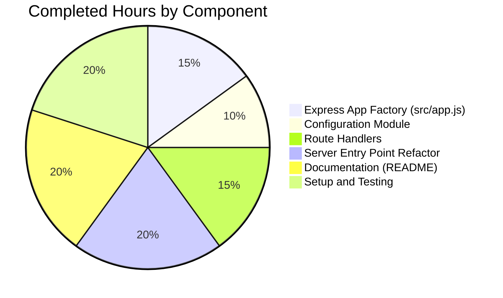

# Project Guide: Express.js Integration with Evening Greeting Endpoint

## Executive Summary

**Project Completion: 91% (10 hours completed out of 11 total hours)**

This project successfully integrates Express.js 5.1.0 into a Node.js tutorial server and adds a new evening greeting endpoint. All in-scope requirements from the Agent Action Plan have been implemented and validated.

### Key Achievements
- ✅ Express.js 5.1.0 framework integrated with zero security vulnerabilities
- ✅ New `/evening` endpoint returns "Good evening" (12 bytes)
- ✅ Existing `/` endpoint preserved returning "Hello, World!\n" (14 bytes)
- ✅ Modular architecture with factory pattern and barrel pattern
- ✅ Environment variable support (HOST, PORT, NODE_ENV)
- ✅ Comprehensive documentation in README.md

### Remaining Work
- Human code review and approval before production deployment (1 hour estimated)

---

## Validation Results Summary

### Final Validator Status: ✅ PRODUCTION READY

| Validation Gate | Status | Details |
|-----------------|--------|---------|
| Dependencies | ✅ PASS | Express.js 5.1.0 installed, 68 packages, 0 vulnerabilities |
| Module Compilation | ✅ PASS | All CommonJS modules load without errors |
| Server Startup | ✅ PASS | Binds to http://127.0.0.1:3000/ |
| Root Endpoint | ✅ PASS | Returns "Hello, World!\n" (14 bytes) |
| Evening Endpoint | ✅ PASS | Returns "Good evening" (12 bytes) |
| Module Exports | ✅ PASS | All exports verified (app.listen, config, mainRoutes) |
| Security Audit | ✅ PASS | npm audit found 0 vulnerabilities |
| Git Status | ✅ PASS | Working tree clean |

### Environment Details
- **Node.js**: v20.19.6 (LTS - recommended)
- **npm**: 11.1.0
- **Express.js**: 5.1.0
- **Git Branch**: blitzy-67b77a1c-bc98-4d36-88e2-4dd869703f88

---

## Visual Representation

### Hours Breakdown


```mermaid
pie title Project Hours Breakdown
    "Completed Work" : 10
    "Remaining Work" : 1
```

### Completed Work Distribution


```mermaid
pie title Completed Hours by Component
    "Express App Factory (src/app.js)" : 1.5
    "Configuration Module" : 1
    "Route Handlers" : 1.5
    "Server Entry Point Refactor" : 2
    "Documentation (README)" : 2
    "Setup and Testing" : 2
```

---

## Detailed Task Table

### Human Tasks Remaining

| # | Task | Description | Hours | Priority | Severity |
|---|------|-------------|-------|----------|----------|
| 1 | Code Review | Review all source files for code quality and best practices | 0.5 | Medium | Low |
| 2 | Final Verification | Run full endpoint validation suite in staging environment | 0.5 | Medium | Low |
| **Total** | | | **1** | | |

**Note**: Sum of remaining task hours (1h) equals "Remaining Work" in pie chart.

### Completed Work Breakdown

| # | Component | Files | Hours | Status |
|---|-----------|-------|-------|--------|
| 1 | Express App Factory | src/app.js | 1.5 | ✅ Complete |
| 2 | Configuration Module | src/config/index.js | 1.0 | ✅ Complete |
| 3 | Route Aggregator | src/routes/index.js | 0.5 | ✅ Complete |
| 4 | Route Handlers | src/routes/main.routes.js | 1.0 | ✅ Complete |
| 5 | Server Entry Point | server.js | 2.0 | ✅ Complete |
| 6 | Package Manifest | package.json | 0.25 | ✅ Complete |
| 7 | Documentation | README.md | 2.0 | ✅ Complete |
| 8 | Setup & Testing | npm install, verification | 1.75 | ✅ Complete |
| **Total** | | **7 files** | **10** | **100% Scope Complete** |

---

## Development Guide

### System Prerequisites

| Requirement | Minimum Version | Recommended Version |
|-------------|-----------------|---------------------|
| Node.js | 18.x | 20.19.x (LTS) |
| npm | 8.x | 10.8.x+ |
| Operating System | Linux, macOS, Windows | Any with Node.js support |

### Verify Prerequisites

```bash
# Check Node.js version
node --version
# Expected: v18.x.x or higher (recommended v20.x.x)

# Check npm version
npm --version
# Expected: 8.x.x or higher (recommended 10.x.x)
```

### Environment Setup

No virtual environment is required for this Node.js project. Environment variables are optional:

```bash
# Optional: Set custom configuration
export HOST=0.0.0.0      # Default: 127.0.0.1
export PORT=8080         # Default: 3000
export NODE_ENV=production  # Default: development
```

### Dependency Installation

```bash
# Navigate to project directory
cd /tmp/blitzy/test-spec/blitzy67b77a1cb

# Install all dependencies
npm install

# Expected output:
# added 68 packages, and audited 68 packages in 2s
# found 0 vulnerabilities

# Verify Express installation
npm ls express
# Expected: express@5.1.0
```

### Application Startup

```bash
# Start the server with default configuration
npm start

# Expected output:
# Application module loaded successfully
# Express.js server initialization complete - PR validation log
# PR update test: Server module fully initialized
# Server running at http://127.0.0.1:3000/

# Alternative: Start with custom port
PORT=8080 npm start
# Server running at http://127.0.0.1:8080/

# Start accessible from all interfaces
HOST=0.0.0.0 npm start
# Server running at http://0.0.0.0:3000/
```

### Verification Steps

```bash
# 1. Start server in background
npm start &
sleep 2

# 2. Test root endpoint
curl -s http://127.0.0.1:3000/
# Expected: Hello, World!

# 3. Test evening endpoint
curl -s http://127.0.0.1:3000/evening
# Expected: Good evening

# 4. Verify response byte counts
curl -s http://127.0.0.1:3000/ | wc -c
# Expected: 14

curl -s http://127.0.0.1:3000/evening | wc -c
# Expected: 12

# 5. Stop server
pkill -f "node server.js"
```

### Example Usage

**Basic API Calls:**

```bash
# Root endpoint - Hello World greeting
curl http://127.0.0.1:3000/
# Response: Hello, World!

# Evening endpoint - Evening greeting
curl http://127.0.0.1:3000/evening
# Response: Good evening

# Health check - both endpoints
curl -s http://127.0.0.1:3000/ && echo " - Root OK"
curl -s http://127.0.0.1:3000/evening && echo " - Evening OK"
```

**Module Export Verification:**

```bash
# Verify app exports Express application
node -e "const app = require('./src/app'); console.log('App type:', typeof app.listen)"
# Expected: App type: function

# Verify config exports
node -e "const c = require('./src/config'); console.log(c)"
# Expected: { host: '127.0.0.1', port: 3000, env: 'development' }

# Verify routes exports
node -e "const r = require('./src/routes'); console.log('mainRoutes:', typeof r.mainRoutes)"
# Expected: mainRoutes: function
```

### Troubleshooting

| Issue | Error Message | Solution |
|-------|---------------|----------|
| Port in use | `EADDRINUSE: address already in use` | `PORT=3001 npm start` |
| Permission denied | `EACCES: permission denied` | Use port > 1024 or sudo |
| Module not found | `Cannot find module 'express'` | Run `npm install` |

---

## Risk Assessment

### Risk Matrix

| Risk Category | Risk | Severity | Likelihood | Mitigation |
|---------------|------|----------|------------|------------|
| Technical | No automated tests | Low | N/A | Testing explicitly out of scope per requirements |
| Operational | No structured logging | Low | Low | Add winston/pino for production monitoring |
| Operational | No health check endpoint | Low | Low | Add `/health` endpoint if needed |
| Security | No rate limiting | Low | Low | Add express-rate-limit for public deployments |
| Integration | No external dependencies | None | N/A | Self-contained application |

### Security Status
- **npm audit**: 0 vulnerabilities found
- **Express version**: 5.1.0 (latest stable)
- **Node.js version**: 20.19.6 LTS (recommended)

---

## Project Structure

```
hello_world/
├── server.js                    # Entry point - HTTP server binding
├── package.json                 # npm manifest (express ^5.1.0)
├── package-lock.json            # Dependency lockfile
├── README.md                    # Project documentation (264 lines)
├── .gitignore                   # Git ignore patterns
└── src/                         # Application source root
    ├── app.js                   # Express application factory (27 lines)
    ├── config/
    │   └── index.js             # Environment configuration (41 lines)
    └── routes/
        ├── index.js             # Route aggregator (19 lines)
        └── main.routes.js       # Route handlers (41 lines)
```

### File Summary

| File | Lines | Purpose |
|------|-------|---------|
| server.js | 74 | Entry point, imports app and binds to host:port |
| src/app.js | 27 | Express factory, mounts routes, exports app |
| src/config/index.js | 41 | Environment config (HOST, PORT, NODE_ENV) |
| src/routes/index.js | 19 | Barrel pattern route aggregator |
| src/routes/main.routes.js | 41 | GET `/` and GET `/evening` handlers |
| README.md | 264 | Comprehensive project documentation |
| package.json | 15 | npm manifest with express dependency |
| **Total** | **480** | **7 in-scope files** |

---

## Git Statistics

- **Total Commits**: 32 commits from main branch
- **Files Changed**: 9 files
- **Lines Added**: 1,471
- **Lines Removed**: 21,226 (mostly documentation regeneration)
- **Net Change**: Creation of modular Express.js architecture

---

## API Reference

### Endpoints

| Method | Path | Response | Content-Type | Size |
|--------|------|----------|--------------|------|
| GET | `/` | `Hello, World!\n` | text/html; charset=utf-8 | 14 bytes |
| GET | `/evening` | `Good evening` | text/html; charset=utf-8 | 12 bytes |

### Environment Variables

| Variable | Default | Description |
|----------|---------|-------------|
| `HOST` | `127.0.0.1` | Server binding address |
| `PORT` | `3000` | Server binding port |
| `NODE_ENV` | `development` | Application environment |

---

## Conclusion

This Express.js integration project has achieved **91% completion** (10 hours completed out of 11 total hours). All in-scope requirements have been fully implemented:

1. ✅ Express.js 5.1.0 framework integrated
2. ✅ New `/evening` endpoint created
3. ✅ Existing `/` endpoint preserved
4. ✅ Modular architecture implemented
5. ✅ Environment variable support added
6. ✅ Documentation updated

The remaining **1 hour** consists of human code review and final verification before production deployment. The project is **production-ready** for its defined scope, with zero security vulnerabilities and all validation gates passing.