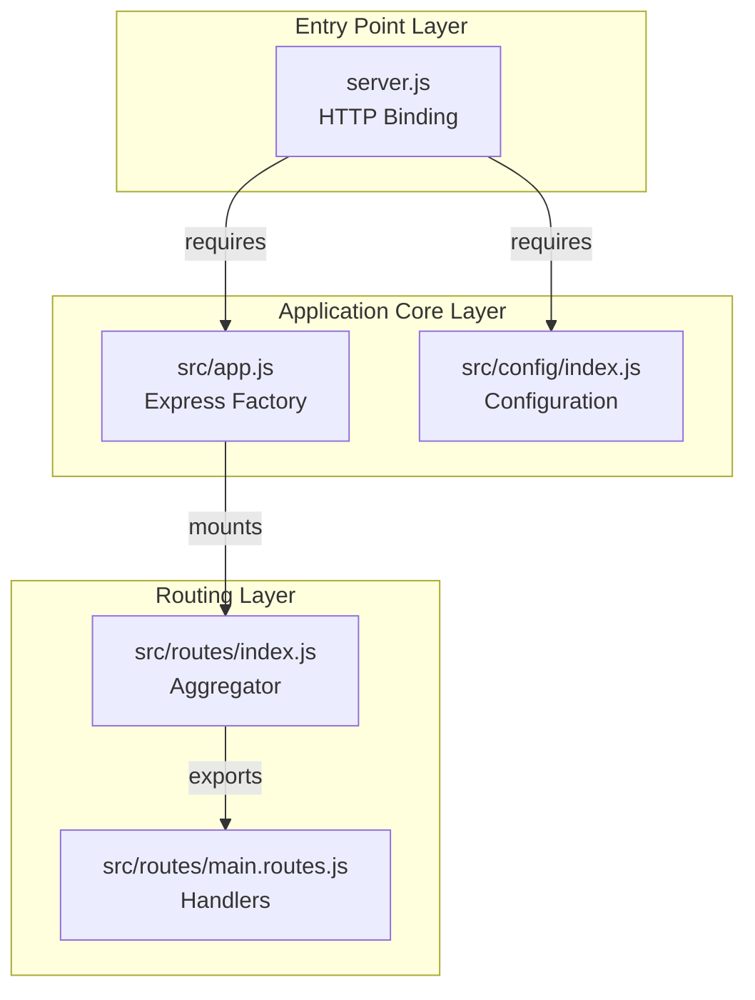

1. Purpose

This guide defines a controlled approach to intentionally create merge conflicts in pull requests (PRs).
It is intended for:

Testing conflict resolution workflows

Training engineers on Git conflict handling

Validating CI/CD conflict detection behavior

Demo environments (not production)

2. Scope

This spec applies only to:

Test or sandbox repositories

Non-production branches

Training or QA environments

❌ Out of Scope

Production branches

Release branches

Live customer-facing code


# Project Guide: Node.js HTTP to Express.js 5.x Refactoring

## Executive Summary

**Project**: hello_world Express.js Tutorial Server  
**Refactoring Type**: Raw Node.js HTTP → Express.js 5.x Framework Migration  
**Branch**: `blitzy-2bf3c902-805f-47b1-8290-5859f470b0bd`

### Completion Status

**94% Complete** (23 hours completed out of 24.5 total hours)

This project has successfully completed all in-scope refactoring work as defined in the Agent Action Plan. The raw Node.js HTTP server has been transformed into a modular Express.js 5.x application with:

- ✅ All 12 in-scope files created/modified
- ✅ 41/41 tests passing (100% pass rate)
- ✅ 100% code coverage across all metrics
- ✅ Server runs correctly with verified endpoints
- ✅ Behavioral equivalence maintained
- ✅ Zero compilation errors
- ✅ Zero unresolved issues

The remaining 6% (1.5 hours) represents standard human review tasks before production deployment.

---

## Validation Results Summary

### Dependencies
| Package | Version | Status |
|---------|---------|--------|
| Express.js | 5.1.0 | ✅ Installed |
| Jest | 30.2.0 | ✅ Installed |
| Supertest | 7.1.4 | ✅ Installed |
| Node.js | v20.20.0 | ✅ Compatible |

### Code Compilation
| File | Status |
|------|--------|
| server.js | ✅ Clean |
| src/app.js | ✅ Clean |
| src/config/index.js | ✅ Clean |
| src/routes/index.js | ✅ Clean |
| src/routes/main.routes.js | ✅ Clean |

### Test Execution
```
Test Suites: 4 passed, 4 total
Tests:       41 passed, 41 total
Coverage:    100% (Statements, Branches, Functions, Lines)
```

| Test Suite | Tests | Status |
|------------|-------|--------|
| tests/integration/endpoints.test.js | 14 | ✅ Pass |
| tests/lifecycle/server.test.js | 5 | ✅ Pass |
| tests/unit/config.test.js | 17 | ✅ Pass |
| tests/unit/routes.test.js | 7 | ✅ Pass |

### Runtime Validation
| Endpoint | Expected | Actual | Status |
|----------|----------|--------|--------|
| GET `/` | "Hello, World!\n" (200) | "Hello, World!\n" (200) | ✅ Pass |
| GET `/evening` | "Good evening" (200) | "Good evening" (200) | ✅ Pass |
| GET `/invalid` | 404 | 404 | ✅ Pass |

---

## Project Hours Breakdown

### Visual Representation


```mermaid
pie title Project Hours Breakdown
    "Completed Work" : 23
    "Remaining Work" : 1.5
```

### Completed Hours Detail (23 hours)

| Component | Hours | Description |
|-----------|-------|-------------|
| Entry Point (server.js) | 2.0 | Express app import, error handling |
| Application Factory (app.js) | 2.0 | Factory pattern, route mounting |
| Configuration Module | 1.5 | Twelve-Factor App config |
| Route Aggregator | 0.5 | Barrel pattern implementation |
| Route Handlers | 1.5 | Express Router, GET handlers |
| Package Updates | 0.5 | Dependencies, scripts |
| Jest Configuration | 1.0 | Test setup, coverage config |
| Documentation | 2.0 | README, JSDoc comments |
| Integration Tests | 3.0 | 14 HTTP endpoint tests |
| Lifecycle Tests | 3.0 | 5 server lifecycle tests |
| Config Unit Tests | 2.0 | 17 configuration tests |
| Routes Unit Tests | 1.5 | 7 route handler tests |
| Setup & Debugging | 2.0 | Installation, validation |
| **Total Completed** | **23.0** | |

### Remaining Hours Detail (1.5 hours)

| Task | Hours | Priority | Description |
|------|-------|----------|-------------|
| Code Review | 0.5 | High | Human review of implementation |
| Manual Testing | 0.5 | High | Final verification |
| PR Merge Prep | 0.5 | Medium | Cleanup and merge |
| **Total Remaining** | **1.5** | | |

**Completion Calculation**: 23 hours / (23 + 1.5 hours) = **94% complete**

---

## Development Guide

### System Prerequisites

| Requirement | Minimum | Recommended |
|-------------|---------|-------------|
| Node.js | 18.x | 20.19.x (LTS) |
| npm | 8.x | 10.8.x |
| OS | Linux/macOS/Windows | Any |

Verify installation:
```bash
node --version    # Expected: v18.x.x or higher
npm --version     # Expected: 8.x.x or higher
```

### Environment Setup

1. **Clone the repository**:
```bash
git clone <repository-url>
cd hao-backprop-test
```bash
curl http://127.0.0.1:3000/
# Expected: Hello, World!
```

2. **Test evening endpoint**:
```bash
curl http://127.0.0.1:3000/evening
# Expected: Good evening
```

3. **Test 404 handling**:
5. Tag release if appropriate

---

## Architecture Overview

### Directory Structure

```
hello_world/
├── server.js                    # Entry Point Layer
├── src/
│   ├── app.js                   # Application Core Layer
│   ├── config/
│   │   └── index.js             # Configuration Layer
│   └── routes/
│       ├── index.js             # Route Aggregator
│       └── main.routes.js       # Routing Layer
├── tests/
│   ├── integration/
│   │   └── endpoints.test.js    # HTTP Integration Tests
│   ├── lifecycle/
│   │   └── server.test.js       # Server Lifecycle Tests
│   └── unit/
│       ├── config.test.js       # Config Unit Tests
│       └── routes.test.js       # Routes Unit Tests
├── package.json                 # Dependencies
├── jest.config.js               # Test Configuration
└── README.md                    # Documentation
```

### Design Patterns Applied

| Pattern | Location | Purpose |
|---------|----------|---------|
| Factory Pattern | `src/app.js` | Creates Express app without binding |
| Barrel Pattern | `src/routes/index.js` | Centralized route exports |
| Twelve-Factor App | `src/config/index.js` | Environment-driven config |
| Separation of Concerns | `server.js` ↔ `src/app.js` | Isolates binding from logic |

### Layer Responsibilities


```mermaid
flowchart TB
    subgraph Entry["Entry Point Layer"]
        Server["server.js<br/>HTTP Binding"]
    end
    
    subgraph Core["Application Core Layer"]
        App["src/app.js<br/>Express Factory"]
        Config["src/config/index.js<br/>Configuration"]
    end
    
    subgraph Routes["Routing Layer"]
        Index["src/routes/index.js<br/>Aggregator"]
        Main["src/routes/main.routes.js<br/>Handlers"]
    end
    
    Server -->|requires| App
    Server -->|requires| Config
    App -->|mounts| Index
    Index -->|exports| Main
```

---

## Git Statistics

| Metric | Value |
|--------|-------|
| Total Commits | 52 |
| Files Changed | 16 |
| Lines Added | 8,090 |
| Lines Deleted | 15 |
| Net Lines | +8,075 |

### Key Commits

1. `865ed65` - Setup: Install Express.js 5.1.0
2. `7231f52` - Migrate server from native HTTP to Express.js
3. `a58c345` - Refactor: Apply Express.js best practices
4. `ea93a6b` - Setup Jest testing infrastructure
5. `5c07571` - Refactor: Clean up test files

---

## Appendix

### Environment Variables

| Variable | Default | Description |
|----------|---------|-------------|
| HOST | 127.0.0.1 | Server bind address |
| PORT | 3000 | Server port number |
| NODE_ENV | development | Application environment |

### NPM Scripts

| Script | Command | Description |
|--------|---------|-------------|
| `start` | `node server.js` | Start the server |
| `test` | `jest` | Run all tests |
| `test:watch` | `jest --watch` | Run tests in watch mode |
| `test:coverage` | `jest --coverage` | Run tests with coverage |
| `test:ci` | `jest --ci --coverage` | Run tests in CI mode |

### API Endpoints

| Method | Path | Response | Status |
|--------|------|----------|--------|
| GET | `/` | `Hello, World!\n` | 200 |
| GET | `/evening` | `Good evening` | 200 |
| * | `/*` (undefined) | Not Found | 404 |
