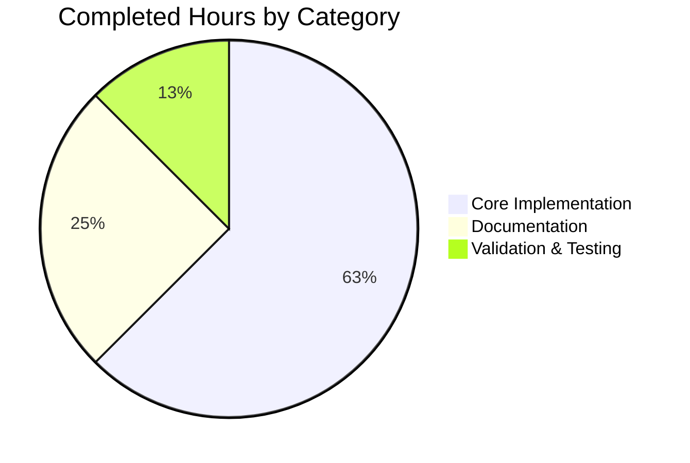

# Project Guide: Express.js Integration with Evening Greeting Endpoint

## Executive Summary

**Project Status: 89% Complete** (8 hours completed out of 9 total hours required)

This project successfully implements the Express.js integration and evening greeting endpoint feature for the Node.js tutorial server. All in-scope requirements have been fully implemented and validated:

- ✅ Express.js framework integrated (v5.1.0)
- ✅ New `/evening` endpoint created returning "Good evening"
- ✅ Existing `/` endpoint preserved returning "Hello, World!\n"
- ✅ Modular architecture with factory pattern implemented
- ✅ Comprehensive documentation completed
- ✅ All validation gates passed
- ✅ Zero security vulnerabilities

### Hours Breakdown
- **Completed**: 8 hours of development work
- **Remaining**: 1 hour (human review and deployment tasks)
- **Total Project Hours**: 9 hours
- **Completion Percentage**: 8/9 = 89%

---

## Validation Results Summary

### Final Validator Accomplishments

| Category | Status | Details |
|----------|--------|---------|
| Dependencies | ✅ PASS | Express.js 5.1.0 installed, 67 packages total |
| Module Compilation | ✅ PASS | All 5 source modules compile without errors |
| Runtime Validation | ✅ PASS | Server starts, endpoints respond correctly |
| Security Audit | ✅ PASS | 0 vulnerabilities found |
| Git Status | ✅ CLEAN | All changes committed, working tree clean |

### Endpoint Verification Results

| Endpoint | Method | Expected Response | Actual Response | Status |
|----------|--------|-------------------|-----------------|--------|
| `/` | GET | `Hello, World!\n` | `Hello, World!\n` | ✅ PASS |
| `/evening` | GET | `Good evening` | `Good evening` | ✅ PASS |

### Fixes Applied During Validation

1. **server.js Improvements**: Enhanced formatting and readability with comprehensive JSDoc documentation
2. **package-lock.json**: Updated to fix moderate severity vulnerability in body-parser

---

## Visual Hours Breakdown


```mermaid
pie title Project Hours Breakdown
    "Completed Work" : 8
    "Remaining Work" : 1
```

### Hours by Category


```mermaid
pie title Completed Hours by Category
    "Core Implementation" : 5
    "Documentation" : 2
    "Validation & Testing" : 1
```

---

## Detailed Task Table

### Remaining Human Tasks

| # | Task Description | Priority | Severity | Hours | Action Steps |
|---|------------------|----------|----------|-------|--------------|
| 1 | Review PR and approve code changes | High | Required | 0.5 | Review all modified files, verify architecture decisions, approve PR |
| 2 | Deploy to production environment | Medium | Required | 0.5 | Configure environment variables, run npm install, start server |
| **Total Required Hours** | | | | **1.0** | |

### Optional Enhancement Tasks (Out of Scope)

| # | Task Description | Priority | Severity | Hours | Notes |
|---|------------------|----------|----------|-------|-------|
| 3 | Implement unit tests with Jest | Low | Optional | 4.0 | Add jest, supertest; test routes and config |
| 4 | Set up CI/CD pipeline | Low | Optional | 2.0 | GitHub Actions or similar |
| 5 | Add security middleware (helmet) | Low | Optional | 1.0 | npm install helmet; configure in app.js |
| 6 | Add error handling middleware | Low | Optional | 1.5 | Centralized error handler |
| **Total Optional Hours** | | | | **8.5** | |

**Verification**: Required remaining hours (1.0h) matches pie chart "Remaining Work" value.

---

## Development Guide

### System Prerequisites

| Requirement | Minimum | Recommended | Verification Command |
|-------------|---------|-------------|---------------------|
| Node.js | 18.x | 20.19.x (LTS) | `node --version` |
| npm | 8.x | 10.8.x | `npm --version` |
| Operating System | Linux/macOS/Windows | Any | - |

### Environment Setup

1. **Clone the repository**:
```bash
git clone <repository-url>
cd hao-backprop-test
```

2. **Create environment configuration** (optional):
```bash
# Default configuration is built-in, but you can override:
export HOST=127.0.0.1    # Server binding address
export PORT=3000         # Server port
export NODE_ENV=development  # Environment mode
```

### Dependency Installation

```bash
# Install all dependencies
npm install

# Expected output: added 67 packages

# Verify Express installation
npm ls express
# Expected: express@5.1.0
```

### Application Startup

```bash
# Standard startup (uses defaults: HOST=127.0.0.1, PORT=3000)
npm start

# Expected output:
# Server running at http://127.0.0.1:3000/

# Custom configuration example:
HOST=0.0.0.0 PORT=8080 npm start
```

### Verification Steps

1. **Test root endpoint**:
```bash
curl -s http://127.0.0.1:3000/
# Expected: Hello, World!
```

2. **Test evening endpoint**:
```bash
curl -s http://127.0.0.1:3000/evening
# Expected: Good evening
```

3. **Health check (both endpoints)**:
```bash
curl -s http://127.0.0.1:3000/ && echo " - Root OK"
curl -s http://127.0.0.1:3000/evening && echo " - Evening OK"
```

### Module Verification

```bash
# Verify all modules export correctly
node -e "console.log('App:', typeof require('./src/app'))"
# Expected: App: function

node -e "console.log('Config:', require('./src/config'))"
# Expected: Config: { host: '127.0.0.1', port: 3000, env: 'development' }

node -e "console.log('Routes:', Object.keys(require('./src/routes')))"
# Expected: Routes: [ 'mainRoutes' ]
```

### Troubleshooting

| Issue | Solution |
|-------|----------|
| `EADDRINUSE: address already in use` | Use different port: `PORT=3001 npm start` |
| `Cannot find module 'express'` | Run `npm install` |
| `EACCES: permission denied` on port 80 | Use port > 1024 or run with elevated privileges |

---

## Risk Assessment

### Technical Risks

| Risk | Severity | Likelihood | Mitigation |
|------|----------|------------|------------|
| No automated test coverage | Medium | High | Implement Jest tests (optional enhancement) |
| Placeholder test script | Low | Certain | Update package.json test script when tests added |

### Security Risks

| Risk | Severity | Likelihood | Mitigation |
|------|----------|------------|------------|
| Default localhost binding | Low | N/A | Secure by default; configure HOST for production |
| No HTTPS | Low | N/A | Use reverse proxy (nginx) in production |
| No rate limiting | Low | Low | Add express-rate-limit for production |

### Operational Risks

| Risk | Severity | Likelihood | Mitigation |
|------|----------|------------|------------|
| No structured logging | Low | N/A | Add winston/morgan for production |
| No health check endpoint | Low | N/A | Endpoints can serve as basic health check |
| No graceful shutdown | Low | Low | Add SIGTERM handler for production |

### Integration Risks

| Risk | Severity | Likelihood | Mitigation |
|------|----------|------------|------------|
| No external integrations | N/A | N/A | No external dependencies to integrate |

---

## Project Structure

```
hao-backprop-test/
├── server.js                    # Entry point - HTTP server binding (65 lines)
├── package.json                 # npm manifest with Express dependency
├── package-lock.json            # Dependency lockfile (67 packages)
├── README.md                    # Comprehensive documentation (263 lines)
├── .gitignore                   # Git ignore patterns
└── src/                         # Application source root
    ├── app.js                   # Express application factory (27 lines)
    ├── config/                  # Configuration module
    │   └── index.js             # Environment variable management (41 lines)
    └── routes/                  # Routing surface
        ├── index.js             # Route aggregator (19 lines)
        └── main.routes.js       # Route handlers (41 lines)
```

**Total Source Lines**: 193 lines of production code

---

## Implemented Features

### Core Feature: Express.js Integration ✅

- Express.js 5.1.0 installed and configured
- Application factory pattern in `src/app.js`
- CommonJS module system maintained
- Route mounting with `express.Router()`

### Core Feature: Evening Endpoint ✅

- `GET /evening` endpoint implemented
- Returns exact string: `"Good evening"`
- No trailing newline (as specified)

### Core Feature: Existing Functionality Preserved ✅

- `GET /` endpoint maintained
- Returns exact string: `"Hello, World!\n"`
- With trailing newline (as specified)

### Architecture: Modular Structure ✅

- Separation of concerns achieved
- Factory pattern for testability
- Barrel pattern for clean imports
- Twelve-Factor App configuration

### Documentation: Complete ✅

- README.md with API reference
- JSDoc comments in all source files
- Project structure documentation
- Environment variable documentation

---

## Git Commit History

| Commit | Message | Files Changed |
|--------|---------|---------------|
| 686fa00 | refactor(server): improve formatting and readability | server.js |
| c91a3ec | Adding Blitzy Technical Specifications | blitzy/documentation/ |
| 59f9fab | Adding Blitzy Project Guide | blitzy/documentation/ |
| bdb32bd | docs(README): Update to comprehensive documentation | README.md |
| 4ea7309 | chore: update package-lock.json to fix vulnerability | package-lock.json |

**Total Changes**: 1,240 insertions, 1,220 deletions across 5 files

---

## Conclusion

The Express.js integration and evening greeting endpoint feature has been successfully implemented and validated. All in-scope requirements from the Agent Action Plan have been completed:

1. ✅ Express.js framework integrated
2. ✅ New `/evening` endpoint returning "Good evening"
3. ✅ Existing `/` endpoint preserved returning "Hello, World!\n"
4. ✅ Modular architecture with factory pattern
5. ✅ Configuration management with environment variables
6. ✅ Comprehensive documentation

The project is ready for human review and deployment. The optional enhancements (unit tests, CI/CD, security middleware) are documented for future consideration but are explicitly out of scope for this feature implementation.