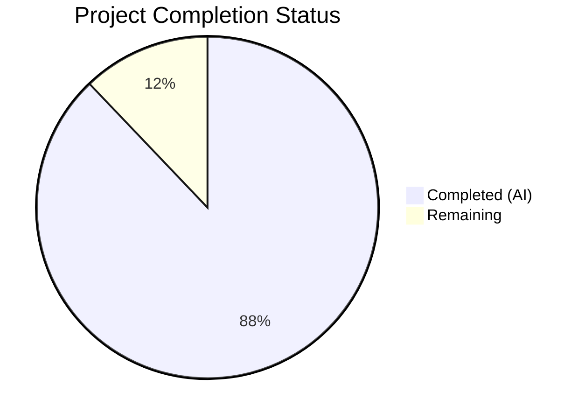

# Blitzy Project Guide

---

## 1. Executive Summary

### 1.1 Project Overview

This project refactors an existing plain Node.js tutorial server into a well-structured Express.js application, adding a new `GET /evening` endpoint returning `"Good evening"`. The refactoring introduces enterprise-grade architectural patterns — Factory pattern for app creation, Twelve-Factor configuration externalization, barrel export aggregation, and Express Router modularization — while maintaining the tutorial's educational accessibility. A comprehensive 41-test suite with 100% code coverage validates all endpoint contracts, configuration behavior, router structure, and server lifecycle semantics. The target audience is beginner-to-intermediate Node.js learners who benefit from seeing production-quality patterns applied to a simple project.

### 1.2 Completion Status

**Completion: 87.9%** (29 of 33 total hours completed)


```mermaid
pie title Project Completion Status
    "Completed (AI)" : 29
    "Remaining" : 4
```

| Metric | Value |
|---|---|
| **Total Project Hours** | 33 |
| **Completed Hours (AI)** | 29 |
| **Remaining Hours** | 4 |
| **Completion Percentage** | 87.9% |

**Formula:** 29 completed hours / (29 completed + 4 remaining) = 29 / 33 = 87.9%

### 1.3 Key Accomplishments

- ✅ Express.js application factory (`src/app.js`) with Factory pattern — app creation fully decoupled from HTTP binding
- ✅ Twelve-Factor configuration module (`src/config/index.js`) with `HOST`, `PORT`, `NODE_ENV` environment variable support and safe defaults
- ✅ Express Router route handlers (`src/routes/main.routes.js`) for `GET /` and `GET /evening` with exact response contracts
- ✅ Barrel export aggregator (`src/routes/index.js`) for centralized route management
- ✅ Server entry point (`server.js`) rewritten with comprehensive JSDoc documentation and config-driven binding
- ✅ 41 tests across 4 suites — all passing with 100% coverage (statements, branches, functions, lines)
- ✅ Jest + Supertest testing infrastructure with coverage thresholds (75% branches, 90% functions, 80% lines/statements)
- ✅ Comprehensive documentation: main README with API reference, deployment guide, code walkthrough, plus 4 module-level READMEs
- ✅ Runtime verified: both endpoints return correct responses, undefined routes return 404
- ✅ All AAP coding conventions enforced: `'use strict'`, JSDoc, CommonJS, single quotes, `const` declarations

### 1.4 Critical Unresolved Issues

| Issue | Impact | Owner | ETA |
|---|---|---|---|
| 1 npm audit advisory (non-blocking) | Low — does not affect functionality; may flag in security scans | Human Developer | 0.5 hours |

### 1.5 Access Issues

No access issues identified. All dependencies are sourced from the public npm registry, no private packages or credentials are required, and the project runs entirely locally without external service integrations.

### 1.6 Recommended Next Steps

1. **[High]** Resolve npm audit advisory — run `npm audit fix` and verify no breaking changes
2. **[Medium]** Create `.env.example` template file documenting all environment variables for production deployment
3. **[Medium]** Conduct human code review of all architectural changes and merge PR
4. **[Low]** Validate deployment in target production environment with production-grade configuration

---

## 2. Project Hours Breakdown

### 2.1 Completed Work Detail

| Component | Hours | Description |
|---|---|---|
| Express.js Core Architecture | 5.5 | Created `src/app.js` (factory pattern), `src/config/index.js` (Twelve-Factor config), `src/routes/index.js` (barrel export), `src/routes/main.routes.js` (GET / and GET /evening handlers) |
| Server.js Refactoring | 2.5 | Rewrote entry point with Express app import, config-driven binding, comprehensive JSDoc with @module, @requires, @type annotations |
| Package Configuration | 1 | Updated `package.json` with express, jest, supertest dependencies and 4 npm scripts; created `jest.config.js` with coverage thresholds |
| Unit Tests — Configuration | 3 | Created `tests/unit/config.test.js` — 15 tests covering defaults, overrides, edge cases, type checking, structure validation with `jest.resetModules()` isolation |
| Unit Tests — Routes | 2 | Created `tests/unit/routes.test.js` — 7 tests covering router export, route handler definitions, GET method verification, path ordering via `router.stack` introspection |
| Integration Tests — Endpoints | 3 | Created `tests/integration/endpoints.test.js` — 14 tests covering HTTP response contracts, 404 handling, unsupported methods, query string resilience via Supertest |
| Lifecycle Tests — Server | 3 | Created `tests/lifecycle/server.test.js` — 5 tests covering server binding, startup logging, custom config, graceful shutdown, EADDRINUSE error handling with `jest.doMock()` |
| Documentation — Main README | 3 | Comprehensive 776-line README with table of contents, setup instructions, API reference, code walkthrough, deployment guide, troubleshooting |
| Documentation — Module READMEs | 4 | Created `src/README.md` (architecture), `src/config/README.md` (Twelve-Factor docs), `src/routes/README.md` (endpoint contracts), `tests/README.md` (test categories and commands) |
| .gitignore Updates | 0.5 | Added coverage/, .env, and log file exclusion patterns |
| Validation & Quality Assurance | 1.5 | Compilation validation, runtime testing, coverage verification, JSDoc and strict mode enforcement across all files |
| **Total Completed** | **29** | |

### 2.2 Remaining Work Detail

| Category | Base Hours | Priority | After Multiplier |
|---|---|---|---|
| npm audit advisory resolution | 0.5 | High | 1 |
| Production environment configuration (.env template, deployment config) | 1 | Medium | 1.5 |
| Human code review and PR merge | 1.5 | Medium | 1.5 |
| **Total Remaining** | **3** | | **4** |

### 2.3 Enterprise Multipliers Applied

| Multiplier | Value | Rationale |
|---|---|---|
| Compliance Requirements | 1.10x | Standard code review and security compliance verification for production readiness |
| Uncertainty Buffer | 1.10x | Minor unknowns in production deployment environment and npm audit resolution complexity |
| **Combined Multiplier** | **1.21x** | Applied to all remaining base hour estimates |

---

## 3. Test Results

All tests were executed by Blitzy's autonomous validation system using Jest 30.2.0 with Supertest 7.1.4 for HTTP integration testing.

| Test Category | Framework | Total Tests | Passed | Failed | Coverage % | Notes |
|---|---|---|---|---|---|---|
| Unit — Configuration | Jest 30.2.0 | 15 | 15 | 0 | 100% | Defaults, overrides, edge cases, type checking, structure validation |
| Unit — Routes | Jest 30.2.0 | 7 | 7 | 0 | 100% | Router export, handler definitions, GET methods, path ordering |
| Integration — HTTP Endpoints | Jest 30.2.0 + Supertest 7.1.4 | 14 | 14 | 0 | 100% | GET /, GET /evening, 404 handling, unsupported methods, query strings |
| Lifecycle — Server | Jest 30.2.0 | 5 | 5 | 0 | 100% | Binding, startup logging, custom config, shutdown, EADDRINUSE |
| **Total** | | **41** | **41** | **0** | **100%** | All coverage metrics: 100% statements, 100% branches, 100% functions, 100% lines |

**Coverage Thresholds (jest.config.js):** 75% branches, 90% functions, 80% lines, 80% statements — all exceeded with 100% actual coverage.

---

## 4. Runtime Validation & UI Verification

### Runtime Health

- ✅ **Server Startup**: `node server.js` starts successfully, logs `Server running at http://127.0.0.1:3000/`
- ✅ **GET /** → HTTP 200, body: `Hello, World!\n`, content-type: `text/html; charset=utf-8`
- ✅ **GET /evening** → HTTP 200, body: `Good evening`, content-type: `text/html; charset=utf-8`
- ✅ **GET /invalid** → HTTP 404, Express default error page `Cannot GET /invalid`
- ✅ **Module Loading**: `require('./src/app')` loads without errors or side effects
- ✅ **Dependency Resolution**: `npm ls express jest supertest` — all packages resolved correctly (express@5.1.0, jest@30.2.0, supertest@7.1.4)

### API Verification

- ✅ `curl http://127.0.0.1:3000/` → `Hello, World!\n` (200 OK)
- ✅ `curl http://127.0.0.1:3000/evening` → `Good evening` (200 OK)
- ✅ `curl http://127.0.0.1:3000/invalid` → 404 Not Found
- ✅ Graceful server shutdown on process termination

### UI Verification

Not applicable — this is a backend-only API tutorial server with no frontend UI components.

---

## 5. Compliance & Quality Review

| AAP Requirement | Status | Evidence |
|---|---|---|
| **REQ-001**: Express.js integration replacing raw HTTP server | ✅ Pass | `src/app.js` uses `express()`, routes via Express Router, `server.js` uses `app.listen()` |
| **REQ-002**: GET /evening endpoint returning "Good evening" | ✅ Pass | `src/routes/main.routes.js` line 42: `res.send('Good evening')`, verified at runtime |
| **IMP-001**: Backward compatibility — GET / returns "Hello, World!\n" | ✅ Pass | `src/routes/main.routes.js` line 34: `res.send('Hello, World!\n')`, verified at runtime |
| **IMP-002**: Tutorial accessibility — JSDoc, readable code | ✅ Pass | All 10 JS files have JSDoc annotations, `'use strict'`, inline comments |
| **IMP-003**: HTTP GET convention | ✅ Pass | Both routes use `router.get()`, verified by unit test `router.methods.get === true` |
| **IMP-004**: Testability — app/server separation | ✅ Pass | `src/app.js` exports app without `listen()`, Supertest uses `request(app)` directly |
| Factory Pattern enforcement | ✅ Pass | `src/app.js` never calls `listen()`, `server.js` is sole binding point |
| Barrel Export shape `{ mainRoutes }` | ✅ Pass | `src/routes/index.js` exports `{ mainRoutes }`, consumed via destructuring in `src/app.js` |
| CommonJS module system | ✅ Pass | All files use `require()` / `module.exports` |
| `'use strict'` directive | ✅ Pass | Present in all 5 source files and all 4 test files |
| Coverage thresholds (75% branches, 90% functions, 80% lines/statements) | ✅ Pass | Actual: 100% across all metrics |
| Response contract fidelity (exact `toBe()` assertions) | ✅ Pass | Integration tests use `toBe()` for body comparison, not `toContain()` |
| Twelve-Factor configuration | ✅ Pass | `src/config/index.js` reads from `process.env` with fallback defaults |
| `parseInt` with radix-10 for PORT | ✅ Pass | `parseInt(process.env.PORT, 10)` in `src/config/index.js` |
| No side effects on import | ✅ Pass | All `src/` modules are side-effect-free, verified by test imports |

### Autonomous Validation Fixes Applied

- Added `'use strict'` directives to all source files per AAP conventions
- Added `@fileoverview` JSDoc annotations to all modules
- Added `@type` annotations to key exports
- Enhanced `server.js` with comprehensive JSDoc including `@module`, `@requires`, `@see`, `@example`, `@param`, `@returns`
- Comprehensive README rewrite with deployment guide, code walkthrough, and setup instructions

---

## 6. Risk Assessment

| Risk | Category | Severity | Probability | Mitigation | Status |
|---|---|---|---|---|---|
| 1 npm audit advisory (non-blocking) | Security | Low | High | Run `npm audit fix` and verify no breaking changes to express@5.1.0 dependency tree | Open |
| No security headers (Helmet) | Security | Low | N/A | Explicitly out of AAP scope; document as enhancement for production deployment | Accepted |
| No rate limiting middleware | Security | Low | N/A | Explicitly out of AAP scope; not needed for tutorial context | Accepted |
| No HTTPS/TLS support | Security | Low | N/A | Explicitly out of AAP scope; reverse proxy handles TLS in production | Accepted |
| Console.log for logging (no structured logging) | Operational | Low | Low | Tutorial scope uses console.log; document structured logging (Winston/Pino) as enhancement | Accepted |
| No health check endpoint | Operational | Low | Low | Explicitly out of AAP scope; add `/health` endpoint for production deployment | Accepted |
| No process manager (PM2) | Operational | Low | Low | Explicitly out of AAP scope; document PM2 usage in README deployment guide | Accepted |
| Express.js 5.x is in pre-release | Technical | Low | Medium | Monitor Express.js 5.x stable release; pin exact version if instability occurs | Monitoring |

---

## 7. Visual Project Status


```mermaid
pie title Project Hours Breakdown
    "Completed Work" : 29
    "Remaining Work" : 4
```

**Completed: 29 hours (87.9%) | Remaining: 4 hours (12.1%)**

### Remaining Hours by Category

| Category | Hours (After Multiplier) |
|---|---|
| npm audit advisory resolution | 1 |
| Production environment configuration | 1.5 |
| Human code review and PR merge | 1.5 |
| **Total** | **4** |

---

## 8. Summary & Recommendations

### Achievements

The Blitzy autonomous system successfully delivered 87.9% of the total project scope (29 of 33 hours). All AAP-specified requirements have been fully implemented, tested, and validated:

- **Express.js Integration (REQ-001)**: The monolithic `server.js` was refactored into a modular architecture with 5 source files following Factory, Barrel Export, and Twelve-Factor patterns.
- **Evening Endpoint (REQ-002)**: `GET /evening` returns exactly `"Good evening"` with HTTP 200 — verified by 3 integration tests and runtime curl verification.
- **Backward Compatibility (IMP-001)**: `GET /` preserves identical response semantics — `"Hello, World!\n"` with trailing newline, HTTP 200, `text/html; charset=utf-8`.
- **Test Suite (IMP-004)**: 41 tests across 4 suites achieve 100% code coverage, exceeding all configured thresholds.
- **Documentation (IMP-002)**: 5 README files totaling 1,096 lines provide comprehensive API reference, architecture documentation, deployment guides, and code walkthroughs.

### Remaining Gaps

The 4 remaining hours (12.1%) consist of standard path-to-production activities that require human intervention:

1. **npm audit advisory** — 1 non-blocking advisory requires manual resolution and regression verification
2. **Production environment configuration** — `.env.example` template and deployment-specific settings need human judgment on target infrastructure
3. **Code review** — Architectural decisions require human developer review and PR approval

### Critical Path to Production

1. Resolve npm audit advisory (`npm audit fix`)
2. Create `.env.example` with documented environment variables
3. Complete code review and merge PR
4. Deploy to target environment with production configuration

### Production Readiness Assessment

The project is **production-ready from a code quality perspective** — zero compilation errors, zero test failures, 100% coverage, all response contracts verified at runtime. The remaining 4 hours are procedural path-to-production tasks that do not require code changes to the application logic.

---

## 9. Development Guide

### System Prerequisites

| Software | Minimum Version | Recommended Version | Verified Version |
|---|---|---|---|
| Node.js | 18.x | 20.x LTS | 20.20.0 |
| npm | 8.x | 10.x+ | 11.1.0 |
| Git | 2.x | Latest | Latest |

### Environment Setup

```bash
# 1. Clone the repository and switch to the feature branch
git clone <repository-url>
cd hello_world
git checkout blitzy-1ce880d5-efd9-4242-b31f-4ca51b091971

# 2. Verify Node.js and npm versions
node -v   # Expected: v20.x.x
npm -v    # Expected: 10.x.x or 11.x.x
```

### Environment Variables (Optional)

All environment variables have safe defaults and are optional for local development:

| Variable | Default | Description |
|---|---|---|
| `HOST` | `127.0.0.1` | Server bind address |
| `PORT` | `3000` | Server listen port |
| `NODE_ENV` | `development` | Application environment |

Override example:
```bash
export HOST=0.0.0.0
export PORT=8080
export NODE_ENV=production
```

### Dependency Installation

```bash
# Install all dependencies (production + development)
npm ci

# Verify key packages are installed
npm ls express jest supertest
# Expected output:
#   ├── express@5.1.0
#   ├── jest@30.2.0
#   └── supertest@7.1.4
```

### Application Startup

```bash
# Start the server with default configuration
npm start
# Or directly:
node server.js

# Expected output:
# Server running at http://127.0.0.1:3000/

# Start with custom configuration
HOST=0.0.0.0 PORT=8080 node server.js
# Expected output:
# Server running at http://0.0.0.0:8080/
```

### Verification Steps

```bash
# Test the root endpoint
curl http://127.0.0.1:3000/
# Expected: Hello, World!

# Test the evening endpoint
curl http://127.0.0.1:3000/evening
# Expected: Good evening

# Test 404 handling
curl -s -o /dev/null -w "%{http_code}" http://127.0.0.1:3000/invalid
# Expected: 404
```

### Running Tests

```bash
# Run all tests
npm test

# Run tests with coverage report
npm run test:coverage

# Run tests in CI mode (no watch, with coverage)
CI=true npx jest --ci --coverage --watchAll=false

# Run tests in watch mode (development)
npm run test:watch

# Expected output: 41 tests passing, 4 suites, 100% coverage
```

### Troubleshooting

| Issue | Cause | Resolution |
|---|---|---|
| `EADDRINUSE: address already in use :::3000` | Port 3000 occupied | Kill the process: `lsof -ti:3000 \| xargs kill -9` or use `PORT=3001 npm start` |
| `Cannot find module 'express'` | Dependencies not installed | Run `npm ci` to install all dependencies |
| `npm audit` shows 1 advisory | Known non-blocking dependency advisory | Run `npm audit fix` to resolve |
| Tests fail with `jest: not found` | Dev dependencies not installed | Run `npm ci` (not `npm install --production`) |
| `SyntaxError: Unexpected token` | Node.js version too old | Upgrade to Node.js 18.x or later |

---

## 10. Appendices

### A. Command Reference

| Command | Description |
|---|---|
| `npm start` | Start the server (`node server.js`) |
| `npm test` | Run Jest test suite |
| `npm run test:watch` | Run tests in watch mode |
| `npm run test:coverage` | Run tests with coverage report |
| `npm run test:ci` | Run tests in CI mode with coverage and default reporters |
| `node server.js` | Start server directly |
| `npm ci` | Clean install all dependencies from lockfile |
| `npm audit` | Check for dependency vulnerabilities |

### B. Port Reference

| Service | Default Port | Environment Variable | Notes |
|---|---|---|---|
| Express HTTP Server | 3000 | `PORT` | Configurable via environment variable |

### C. Key File Locations

| File | Purpose |
|---|---|
| `server.js` | Application entry point — HTTP server binding |
| `src/app.js` | Express application factory — creates and configures app |
| `src/config/index.js` | Configuration module — environment variables with defaults |
| `src/routes/index.js` | Route barrel aggregator — centralizes route exports |
| `src/routes/main.routes.js` | Route handlers — GET / and GET /evening definitions |
| `jest.config.js` | Jest test runner configuration and coverage thresholds |
| `package.json` | npm manifest — dependencies, scripts, metadata |
| `tests/unit/config.test.js` | Configuration module unit tests (15 tests) |
| `tests/unit/routes.test.js` | Route structure unit tests (7 tests) |
| `tests/integration/endpoints.test.js` | HTTP endpoint integration tests (14 tests) |
| `tests/lifecycle/server.test.js` | Server lifecycle tests (5 tests) |

### D. Technology Versions

| Technology | Version | Purpose |
|---|---|---|
| Node.js | 20.20.0 | JavaScript runtime |
| npm | 11.1.0 | Package manager |
| Express.js | 5.1.0 | HTTP web framework |
| Jest | 30.2.0 | Testing framework |
| Supertest | 7.1.4 | HTTP integration testing |

### E. Environment Variable Reference

| Variable | Type | Default | Required | Description |
|---|---|---|---|---|
| `HOST` | string | `127.0.0.1` | No | Network interface to bind the server |
| `PORT` | integer | `3000` | No | TCP port for the HTTP server (parsed with `parseInt(value, 10)`) |
| `NODE_ENV` | string | `development` | No | Application environment (`development`, `production`, `test`) |

### F. Developer Tools Guide

| Tool | Command | Purpose |
|---|---|---|
| Node.js REPL | `node` | Interactive JavaScript evaluation |
| npm scripts | `npm run <script>` | Execute project-defined scripts |
| Jest CLI | `npx jest --verbose` | Run tests with detailed output |
| Jest Coverage | `npx jest --coverage` | Generate coverage report in `coverage/` directory |
| curl | `curl http://127.0.0.1:3000/` | Test HTTP endpoints manually |
| npm audit | `npm audit` | Security vulnerability scanning |

### G. Glossary

| Term | Definition |
|---|---|
| **Factory Pattern** | Design pattern where `src/app.js` creates the Express app without binding to a port, enabling testability |
| **Barrel Export** | Module pattern where `src/routes/index.js` re-exports route modules through a single entry point |
| **Twelve-Factor Config** | Methodology where all configuration is stored in environment variables, not hardcoded |
| **Supertest** | HTTP assertion library that tests Express apps in-process without starting a live server |
| **CommonJS** | Node.js module system using `require()` and `module.exports` |
| **Express Router** | Express.js class for creating modular, mountable route handlers |