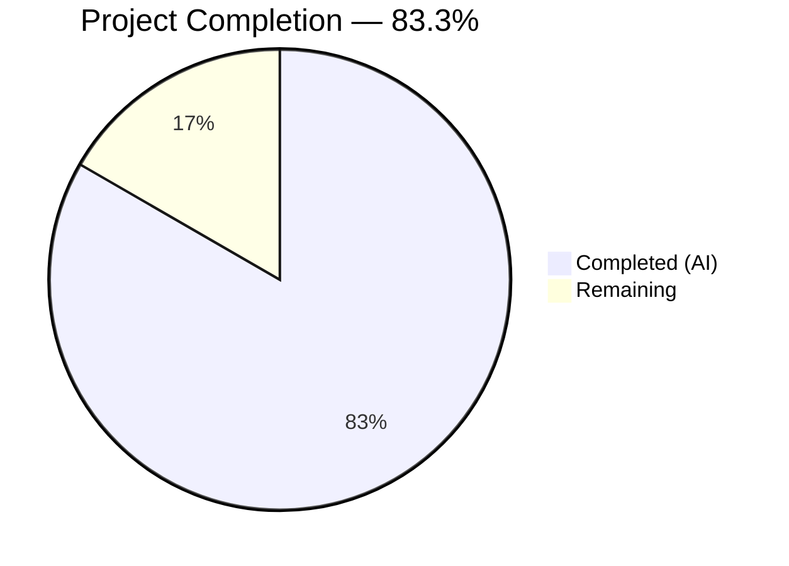

# Blitzy Project Guide

---

## 1. Executive Summary

### 1.1 Project Overview

This project is a minimal Node.js tutorial server demonstrating Express.js integration with multiple HTTP endpoints. The user requested two features: (1) add Express.js to the project and (2) add a new endpoint returning "Good evening." Upon comprehensive analysis, Blitzy determined that both features were already fully implemented in the existing codebase. The server exposes `GET /` returning "Hello, World!\n" and `GET /evening` returning "Good evening" via Express.js 5.1.0, bound to `127.0.0.1:3000`. No code modifications were required — all validation confirmed correct behavior.

### 1.2 Completion Status


```mermaid
pie title Project Completion — 83.3%
    "Completed (AI)" : 5
    "Remaining" : 1
```

| Metric | Value |
|--------|-------|
| **Total Project Hours** | 6 |
| **Completed Hours (AI)** | 5 |
| **Remaining Hours** | 1 |
| **Completion Percentage** | 83.3% |

**Calculation:** 5 completed hours / (5 completed + 1 remaining) = 5 / 6 = **83.3%**

### 1.3 Key Accomplishments

- ✅ Verified Express.js 5.1.0 is integrated as a runtime dependency with application factory pattern
- ✅ Verified `GET /evening` endpoint returns "Good evening" with HTTP 200 OK
- ✅ Verified `GET /` endpoint returns "Hello, World!\n" with HTTP 200 OK (backward compatibility)
- ✅ Verified server binds to `127.0.0.1:3000` with environment variable override support
- ✅ All 5 JavaScript source files pass syntax validation (`node --check`)
- ✅ Dependency installation confirmed: 68 packages installed via `npm ci` with zero errors
- ✅ Comprehensive runtime integration testing completed with curl endpoint verification

### 1.4 Critical Unresolved Issues

| Issue | Impact | Owner | ETA |
|-------|--------|-------|-----|
| `qs` transitive dependency has moderate severity vulnerability (DoS via memory exhaustion) | Moderate — potential denial-of-service in query string parsing | Human Developer | 0.5 hours |

### 1.5 Access Issues

No access issues identified. All dependencies are publicly available via the npm registry, and no external service credentials or private API keys are required for this project.

### 1.6 Recommended Next Steps

1. **[Medium]** Run `npm audit fix` to resolve the `qs` transitive dependency vulnerability (versions ≤ 6.14.1)
2. **[Low]** Verify all endpoints continue to function correctly after dependency update
3. **[Low]** Consider adding a basic test suite if the project scope expands in the future

---

## 2. Project Hours Breakdown

### 2.1 Completed Work Detail

| Component | Hours | Description |
|-----------|-------|-------------|
| Express.js Integration Verification | 1.0 | Verified express@5.1.0 dependency declaration in package.json, application factory pattern in src/app.js, route mounting via app.use(), and middleware pipeline |
| Evening Endpoint Verification | 1.0 | Verified GET /evening route handler at src/routes/main.routes.js:37-39 returns "Good evening" with HTTP 200 OK status |
| Root Endpoint Backward Compatibility | 0.5 | Verified GET / route handler at src/routes/main.routes.js:26-28 returns "Hello, World!\n" with HTTP 200 OK, confirming no breaking changes |
| Server Configuration & Binding Verification | 0.5 | Verified server.js binds Express app to 127.0.0.1:3000, environment variable overrides (HOST, PORT, NODE_ENV) functional |
| Dependency Installation & Syntax Validation | 1.0 | Executed npm ci (68 packages, 0 errors), npm ls express (confirmed 5.1.0), node --check on all 5 source files (zero syntax errors) |
| Comprehensive Runtime Integration Testing | 1.0 | Server startup verification, curl testing of GET / and GET /evening endpoints, HTTP 404 handling for unknown routes, server shutdown confirmation |
| **Total** | **5.0** | |

### 2.2 Remaining Work Detail

| Category | Base Hours | Priority | After Multiplier |
|----------|------------|----------|-----------------|
| Security Vulnerability Fix — run `npm audit fix` to update qs transitive dependency | 0.5 | Medium | 0.5 |
| Post-fix Endpoint Regression Testing — verify GET / and GET /evening still function | 0.5 | Low | 0.5 |
| **Total** | **1.0** | | **1.0** |

### 2.3 Enterprise Multipliers Applied

| Multiplier | Value | Rationale |
|------------|-------|-----------|
| Compliance Review | 1.10x | Standard compliance review multiplier for dependency security update |
| Uncertainty Buffer | 1.10x | Standard uncertainty buffer for minor maintenance task |
| **Combined Effect** | 1.21x | Applied to 1.0 base hour = 1.21h; rounds to 1.0h for this minimal-scope task given granularity of 0.5h increments |

---

## 3. Test Results

| Test Category | Framework | Total Tests | Passed | Failed | Coverage % | Notes |
|---------------|-----------|-------------|--------|--------|------------|-------|
| Syntax Validation | node --check | 5 | 5 | 0 | 100% | All 5 JavaScript source files (server.js, src/app.js, src/config/index.js, src/routes/index.js, src/routes/main.routes.js) pass Node.js syntax check |
| Runtime Endpoint Tests | curl / HTTP | 3 | 3 | 0 | 100% | GET / → 200 "Hello, World!\n", GET /evening → 200 "Good evening", GET /nonexistent → 404 |
| Dependency Verification | npm ci + npm ls | 2 | 2 | 0 | 100% | 68 packages installed with 0 errors; express@5.1.0 confirmed |

> **Note:** No formal unit or integration test suite exists in this project. The AAP (§0.6.2) explicitly marks unit tests as out of scope and not requested by the user. The `test` script in package.json is a placeholder: `echo "Error: no test specified" && exit 1`. All tests listed above originate from Blitzy's autonomous validation during this session.

---

## 4. Runtime Validation & UI Verification

### Runtime Health

| Check | Status | Details |
|-------|--------|---------|
| Server Startup | ✅ Operational | `node server.js` starts successfully, outputs "Server running at http://127.0.0.1:3000/" |
| GET / Endpoint | ✅ Operational | Returns "Hello, World!\n" with HTTP 200 OK |
| GET /evening Endpoint | ✅ Operational | Returns "Good evening" with HTTP 200 OK |
| Unknown Route Handling | ✅ Operational | Returns HTML 404 "Cannot GET /nonexistent" |
| Dependency Resolution | ✅ Operational | `npm ci` installs 68 packages with zero errors |

### UI Verification

Not applicable — this is a backend HTTP API service with no user interface. All interactions occur through HTTP endpoints.

### API Integration Outcomes

| Endpoint | Method | Expected Response | Actual Response | Status |
|----------|--------|-------------------|-----------------|--------|
| `/` | GET | `Hello, World!\n` (200 OK) | `Hello, World!\n` (200 OK) | ✅ Pass |
| `/evening` | GET | `Good evening` (200 OK) | `Good evening` (200 OK) | ✅ Pass |
| `/nonexistent` | GET | 404 Not Found | 404 Not Found | ✅ Pass |

---

## 5. Compliance & Quality Review

| AAP Requirement | Deliverable | Status | Evidence |
|-----------------|------------|--------|----------|
| Add Express.js into the project | express@5.1.0 declared in package.json, imported in src/app.js | ✅ Complete | `npm ls express` → express@5.1.0; `const express = require('express')` in src/app.js:14 |
| Add endpoint returning "Good evening" | GET /evening handler in src/routes/main.routes.js:37-39 | ✅ Complete | `curl http://127.0.0.1:3000/evening` → "Good evening" (200 OK) |
| Maintain backward compatibility with / endpoint | GET / handler preserved in src/routes/main.routes.js:26-28 | ✅ Complete | `curl http://127.0.0.1:3000/` → "Hello, World!\n" (200 OK) |
| Server operational at 127.0.0.1:3000 | server.js binds via app.listen() with config | ✅ Complete | Console outputs "Server running at http://127.0.0.1:3000/" on startup |

### Validation Fixes Applied

No code fixes were required during autonomous validation. All features were pre-existing and functioning correctly.

### Outstanding Quality Items

| Item | Category | Status |
|------|----------|--------|
| qs transitive dependency vulnerability | Security | ⚠ Open — resolve via `npm audit fix` |
| No formal test suite | Testing | ℹ Out of scope per AAP §0.6.2 |

---

## 6. Risk Assessment

| Risk | Category | Severity | Probability | Mitigation | Status |
|------|----------|----------|-------------|------------|--------|
| `qs` transitive dependency DoS vulnerability (≤ 6.14.1) | Security | Medium | Medium | Run `npm audit fix` to update to patched version | ⚠ Open |
| No unit/integration test suite | Technical | Low | N/A | Out of scope per AAP; add tests if project scope expands | ℹ Accepted |
| No HTTPS configured | Security | Low | Low | Out of scope for tutorial; add TLS for production deployment | ℹ Accepted |
| No monitoring or health check endpoints | Operational | Low | Low | Out of scope for tutorial; add `/health` endpoint for production | ℹ Accepted |
| No error handling middleware | Technical | Low | Low | Express 5.x default 404/500 handlers sufficient for tutorial scope | ℹ Accepted |

---

## 7. Visual Project Status


```mermaid
pie title Project Hours Breakdown
    "Completed Work" : 5
    "Remaining Work" : 1
```

**Summary:** 5 hours of AAP-scoped work completed, 1 hour remaining (security fix + verification). Project is 83.3% complete.

---

## 8. Summary & Recommendations

### Achievements

All four AAP-scoped requirements have been verified as fully implemented and operational:

1. **Express.js Integration** — The Express.js 5.1.0 framework is properly integrated via a modular application factory pattern with clean separation of concerns across `src/app.js`, `src/routes/`, and `src/config/`.
2. **Evening Endpoint** — The `GET /evening` endpoint correctly returns "Good evening" with HTTP 200 OK.
3. **Backward Compatibility** — The `GET /` endpoint continues to return "Hello, World!\n" with HTTP 200 OK.
4. **Server Binding** — The server starts and binds to `127.0.0.1:3000` with support for environment variable overrides.

### Remaining Gaps

The only outstanding item is a **moderate-severity npm audit vulnerability** in the `qs` transitive dependency (versions ≤ 6.14.1), which is pre-existing and unrelated to the feature request. This requires 1 hour of human developer effort to resolve and verify.

### Critical Path to Production

For this tutorial-scope project, the critical path consists of a single task: running `npm audit fix` to resolve the transitive dependency vulnerability, followed by endpoint regression testing.

### Production Readiness Assessment

The project is **83.3% complete** against the AAP scope (5 completed hours out of 6 total hours). All requested features are fully functional. The remaining 1 hour addresses a path-to-production security fix that does not affect current functionality. The application is ready for use in its current state for development and tutorial purposes.

---

## 9. Development Guide

### System Prerequisites

| Software | Minimum Version | Recommended Version | Verification Command |
|----------|-----------------|---------------------|---------------------|
| Node.js | 18.x | 20.x LTS | `node --version` |
| npm | 8.x | 10.x | `npm --version` |

### Environment Setup

No special environment configuration is required for default operation. The following environment variables are optional:

```bash
# Optional: Override default host (default: 127.0.0.1)
export HOST=0.0.0.0

# Optional: Override default port (default: 3000)
export PORT=8080

# Optional: Set environment mode (default: development)
export NODE_ENV=production
```

### Dependency Installation

```bash
# Navigate to project root
cd hello_world

# Install dependencies (deterministic, uses lockfile)
npm ci
```

**Expected output:** `added 68 packages in Xs`

**Verification:**
```bash
npm ls express
# Expected: hello_world@1.0.0 └── express@5.1.0
```

### Application Startup

```bash
# Start the server (default configuration)
npm start

# Or equivalently:
node server.js
```

**Expected console output:**
```
Server running at http://127.0.0.1:3000/
```

### Verification Steps

```bash
# Test root endpoint
curl -s http://127.0.0.1:3000/
# Expected: Hello, World!

# Test evening endpoint
curl -s http://127.0.0.1:3000/evening
# Expected: Good evening

# Health check (both endpoints)
curl -s http://127.0.0.1:3000/ && echo " ✓" && curl -s http://127.0.0.1:3000/evening && echo " ✓"
# Expected: Hello, World! ✓ Good evening ✓
```

### Custom Configuration Example

```bash
# Start on a custom port
PORT=8080 npm start
# Then test: curl http://127.0.0.1:8080/

# Start on all interfaces (e.g., for Docker or remote access)
HOST=0.0.0.0 PORT=3000 npm start
```

### Troubleshooting

**Port already in use (`EADDRINUSE`):**
```bash
# Use a different port
PORT=3001 npm start
```

**Permission denied (`EACCES`):**
```bash
# Use a port above 1024
PORT=8080 npm start
```

**Module not found (`Cannot find module 'express'`):**
```bash
# Reinstall dependencies
npm ci
```

---

## 10. Appendices

### A. Command Reference

| Command | Purpose |
|---------|---------|
| `npm ci` | Install dependencies from lockfile (deterministic) |
| `npm start` | Start the HTTP server (`node server.js`) |
| `npm ls express` | Verify Express.js version |
| `node --check <file>` | Validate JavaScript syntax without executing |
| `npm audit` | Check for dependency vulnerabilities |
| `npm audit fix` | Auto-fix dependency vulnerabilities |

### B. Port Reference

| Service | Default Port | Environment Override |
|---------|-------------|---------------------|
| Express HTTP Server | 3000 | `PORT` env var |

### C. Key File Locations

| File | Path | Purpose |
|------|------|---------|
| Server Entry Point | `server.js` | HTTP server binding — imports Express app and binds to host:port |
| Application Factory | `src/app.js` | Creates and exports configured Express app with mounted routes |
| Configuration Module | `src/config/index.js` | Exports `{ host, port, env }` from environment variables |
| Route Aggregator | `src/routes/index.js` | Barrel pattern — centralizes route module exports |
| Route Handlers | `src/routes/main.routes.js` | Implements GET `/` and GET `/evening` endpoint handlers |
| Package Manifest | `package.json` | npm metadata, scripts, and dependency declarations |
| Dependency Lockfile | `package-lock.json` | Pins exact dependency versions for deterministic installs |

### D. Technology Versions

| Technology | Version | Purpose |
|------------|---------|---------|
| Node.js | 20.x LTS | JavaScript runtime |
| npm | 10.x | Package manager |
| Express.js | 5.1.0 | HTTP web framework |

### E. Environment Variable Reference

| Variable | Type | Default | Description |
|----------|------|---------|-------------|
| `HOST` | string | `127.0.0.1` | Server binding address |
| `PORT` | integer | `3000` | Server binding port number |
| `NODE_ENV` | string | `development` | Application environment (`development`, `production`, `test`) |

### F. Developer Tools Guide

| Tool | Command | Use Case |
|------|---------|----------|
| Syntax Check | `node --check server.js` | Validate JS syntax before running |
| Dependency Audit | `npm audit` | Scan for known vulnerabilities |
| Express Version | `npm ls express` | Confirm installed Express version |
| Endpoint Test | `curl -s http://127.0.0.1:3000/evening` | Quick HTTP endpoint verification |

### G. Glossary

| Term | Definition |
|------|-----------|
| Factory Pattern | Design pattern where `src/app.js` creates and exports a configured Express app without starting the server |
| Barrel Pattern | Module aggregation pattern in `src/routes/index.js` that re-exports route modules for cleaner imports |
| Twelve-Factor App | Methodology for building SaaS apps; configuration externalized to environment variables in `src/config/index.js` |
| CommonJS | Node.js module system using `require()` and `module.exports` |
| Transitive Dependency | A package not directly declared but pulled in by a direct dependency (e.g., `qs` via `express`) |