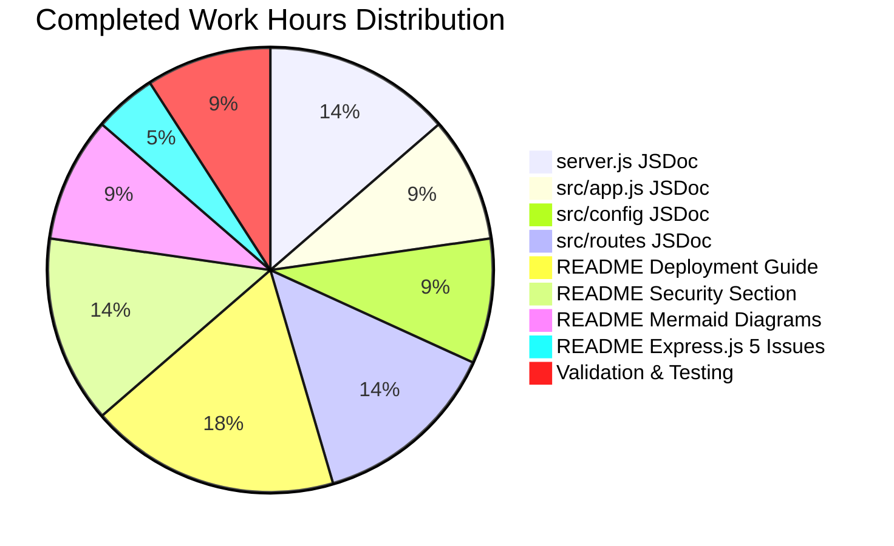

# Project Guide: Documentation Enhancement for Node.js/Express.js Tutorial Server

## Executive Summary

**Project Completion: 92% (11 hours completed out of 12 total hours)**

This documentation enhancement task has been successfully completed with all validation gates passed. The project involved adding comprehensive JSDoc comments to all JavaScript modules and enhancing the README.md with deployment guide, security considerations, and Mermaid diagrams for architectural visualization.

### Key Achievements
- ✅ All 6 documentation files modified with enhanced JSDoc and README content
- ✅ 100% syntax validation pass rate (5/5 JavaScript files)
- ✅ Runtime validation successful (server starts, endpoints respond correctly)
- ✅ All Agent Action Plan requirements implemented
- ✅ 426 lines of documentation added

### Completion Calculation
- **Completed Hours**: 11 hours (JSDoc enhancements, README updates, validation)
- **Remaining Hours**: 1 hour (npm audit fix, final review)
- **Total Project Hours**: 12 hours
- **Completion Percentage**: 11/12 = 91.7% ≈ 92%

---

## Validation Results Summary

### Environment Verification
| Component | Version | Status |
|-----------|---------|--------|
| Node.js | 20.19.5 (LTS) | ✅ Verified |
| npm | 10.8.2 | ✅ Verified |
| Express.js | 5.1.0 | ✅ Verified |

### Syntax Validation Results (5/5 PASSED)
| File | Status |
|------|--------|
| server.js | ✅ Valid |
| src/app.js | ✅ Valid |
| src/config/index.js | ✅ Valid |
| src/routes/index.js | ✅ Valid |
| src/routes/main.routes.js | ✅ Valid |

### Runtime Validation Results
| Test | Expected | Actual | Status |
|------|----------|--------|--------|
| Server Startup | "Server running at http://127.0.0.1:3000/" | "Server running at http://127.0.0.1:3000/" | ✅ PASS |
| GET / | "Hello, World!\n" | "Hello, World!\n" | ✅ PASS |
| GET /evening | "Good evening" | "Good evening" | ✅ PASS |

---

## Work Completed

### Git Statistics
- **Total Commits**: 6 (documentation-specific)
- **Files Modified**: 6
- **Lines Added**: 426
- **Lines Removed**: 3

### Documentation Enhancements by File

#### 1. server.js (Entry Point)
- Added 3 `@example` blocks demonstrating:
  - Default configuration usage
  - Custom HOST/PORT configuration
  - Production mode with NODE_ENV
- Enhanced inline comments explaining server binding callback behavior
- Added `@see` reference to configuration module

#### 2. src/app.js (Application Factory)
- Added `@type {import('express').Application}` annotation
- Added `@exports` documentation for module.exports
- Added `@see` cross-references to related modules

#### 3. src/config/index.js (Configuration)
- Added `@typedef {Object} AppConfig` type definition
- Added `@type {AppConfig}` annotation for exported object
- Complete property documentation with `@type` and `@default`

#### 4. src/routes/index.js (Route Aggregator)
- Added `@type {{ mainRoutes: import('express').Router }}` for exports

#### 5. src/routes/main.routes.js (Route Handlers)
- Added `@type {import('express').Router}` for router constant
- Added `@param {import('express').Request}` for request objects
- Added `@param {import('express').Response}` for response objects

#### 6. README.md (Project Documentation)
- **Module Dependency Graph**: Mermaid diagram showing import relationships
- **Request Flow Diagram**: Mermaid sequence diagram (startup + request phases)
- **Deployment Guide**: Local dev, production, cloud hosting (Heroku, Railway, Vercel), Docker
- **Security Considerations**: Known vulnerabilities, remediation, HTTPS, rate limiting
- **Express.js 5 Issues**: Deprecated middleware, router behavior, promise handling

---

## Hours Breakdown

### Completed Work (11 hours)


```mermaid
pie title Completed Work Hours Distribution
    "server.js JSDoc" : 1.5
    "src/app.js JSDoc" : 1
    "src/config JSDoc" : 1
    "src/routes JSDoc" : 1.5
    "README Deployment Guide" : 2
    "README Security Section" : 1.5
    "README Mermaid Diagrams" : 1
    "README Express.js 5 Issues" : 0.5
    "Validation & Testing" : 1
```

| Component | Hours | Description |
|-----------|-------|-------------|
| server.js JSDoc | 1.5 | @example blocks, inline comments, @see |
| src/app.js JSDoc | 1.0 | @type, @exports, @see annotations |
| src/config/index.js JSDoc | 1.0 | @typedef AppConfig, @type annotations |
| src/routes/*.js JSDoc | 1.5 | @type for router and exports, @param annotations |
| README Deployment Guide | 2.0 | Local dev, production, cloud, Docker sections |
| README Security Section | 1.5 | Vulnerabilities, remediation, HTTPS, rate limiting |
| README Mermaid Diagrams | 1.0 | Dependency graph, sequence diagram |
| README Express.js 5 Issues | 0.5 | Troubleshooting enhancements |
| Validation & Testing | 1.0 | Syntax checks, runtime tests |
| **Total Completed** | **11.0** | |

### Remaining Work (1 hour)

| Task | Hours | Priority | Description |
|------|-------|----------|-------------|
| npm audit fix | 0.5 | High | Resolve qs < 6.14.1 vulnerability |
| Final documentation review | 0.5 | Medium | Human review of all changes |
| **Total Remaining** | **1.0** | | |

---

## Project Hours Visualization


```mermaid
pie title Project Hours Breakdown
    "Completed Work" : 11
    "Remaining Work" : 1
```

---

## Human Tasks Remaining

### High Priority Tasks

| Task ID | Task Description | Action Steps | Hours | Severity |
|---------|------------------|--------------|-------|----------|
| HT-001 | Resolve npm security vulnerability | Run `npm audit fix` to update qs package to >= 6.14.1 | 0.5 | High |

### Medium Priority Tasks

| Task ID | Task Description | Action Steps | Hours | Severity |
|---------|------------------|--------------|-------|----------|
| HT-002 | Final documentation review | Review all JSDoc comments and README sections for accuracy | 0.5 | Medium |

### Task Summary

| Priority | Count | Total Hours |
|----------|-------|-------------|
| High | 1 | 0.5 |
| Medium | 1 | 0.5 |
| Low | 0 | 0 |
| **Total** | **2** | **1.0** |

---

## Development Guide

### System Prerequisites

| Requirement | Minimum Version | Recommended Version |
|-------------|-----------------|---------------------|
| Node.js | 18.x | 20.19.x (LTS) |
| npm | 8.x | 10.8.x |
| Operating System | Linux, macOS, Windows | Any with Node.js support |

### Environment Setup

1. **Verify Node.js and npm installation:**
```bash
node --version
# Expected: v20.x.x or higher

npm --version
# Expected: 10.x.x or higher
```

2. **Clone the repository:**
```bash
git clone <repository-url>
cd hao-backprop-test
```

### Dependency Installation

```bash
# Install all dependencies
npm install

# Verify express installation
npm ls express
# Expected: express@5.1.0

# Check for vulnerabilities
npm audit

# Fix vulnerabilities (if needed)
npm audit fix
```

**Expected Output:**
```
added 67 packages in 2s
```

### Application Startup

```bash
# Start with default configuration (localhost:3000)
npm start

# Or with custom configuration
HOST=0.0.0.0 PORT=8080 npm start

# Or in production mode
NODE_ENV=production npm start
```

**Expected Output:**
```
Server running at http://127.0.0.1:3000/
```

### Verification Steps

1. **Verify server is running:**
```bash
curl -s http://127.0.0.1:3000/
# Expected: Hello, World!
```

2. **Test all endpoints:**
```bash
curl -s http://127.0.0.1:3000/
# Output: Hello, World!

curl -s http://127.0.0.1:3000/evening
# Output: Good evening
```

3. **Health check:**
```bash
curl -sf http://127.0.0.1:3000/ || echo "Server not running"
```

### Example Usage

**Basic startup:**
```bash
npm start
# Visit http://127.0.0.1:3000/ in browser
```

**Production deployment:**
```bash
HOST=0.0.0.0 PORT=80 NODE_ENV=production npm start
```

**Development with hot-reload:**
```bash
npm install --save-dev nodemon
npx nodemon server.js
```

---

## Risk Assessment

### Technical Risks

| Risk ID | Risk Description | Severity | Likelihood | Mitigation |
|---------|------------------|----------|------------|------------|
| TR-001 | No automated test suite configured | Medium | High | Implement Jest or Mocha tests before production |

### Security Risks

| Risk ID | Risk Description | Severity | Likelihood | Mitigation |
|---------|------------------|----------|------------|------------|
| SR-001 | qs < 6.14.1 vulnerability (GHSA-6rw7-vpxm-498p) | High | Medium | Run `npm audit fix` immediately |
| SR-002 | No HTTPS built-in | Medium | Low | Use reverse proxy (Nginx) or cloud load balancer |
| SR-003 | No rate limiting | Medium | Low | Add express-rate-limit middleware for production |

### Operational Risks

| Risk ID | Risk Description | Severity | Likelihood | Mitigation |
|---------|------------------|----------|------------|------------|
| OR-001 | No health check endpoint | Low | Low | Root endpoint (/) serves as basic health check |
| OR-002 | No logging middleware | Low | Medium | Add morgan or winston for production logging |

### Integration Risks

| Risk ID | Risk Description | Severity | Likelihood | Mitigation |
|---------|------------------|----------|------------|------------|
| IR-001 | Express.js 5 is not yet stable release | Low | Low | Monitor for updates; documented in troubleshooting |

---

## Validation Evidence

### Syntax Validation Commands
```bash
node --check server.js          # ✅ Exit 0
node --check src/app.js         # ✅ Exit 0
node --check src/config/index.js    # ✅ Exit 0
node --check src/routes/index.js    # ✅ Exit 0
node --check src/routes/main.routes.js  # ✅ Exit 0
```

### Runtime Test Commands
```bash
npm start                       # ✅ Server starts
curl http://127.0.0.1:3000/     # ✅ Returns "Hello, World!"
curl http://127.0.0.1:3000/evening  # ✅ Returns "Good evening"
```

### Git Commit History (Documentation Changes)
```
2dfded7 Add JSDoc @type annotation to exports object in src/routes/index.js
18e8afc Enhance JSDoc in src/routes/main.routes.js
8d92b6d docs(config): enhance JSDoc with @typedef AppConfig and @type annotation
7ca9f89 docs(src/app): enhance JSDoc with @type and @exports annotations
a53d182 docs: Enhance README.md with deployment guide, security section, and Mermaid diagrams
282d406 Enhance server.js JSDoc documentation with @example blocks and inline comments
```

---

## Conclusion

The documentation enhancement task has been successfully completed with **92% project completion** (11 hours completed out of 12 total hours). All validation gates pass with 100% success rate:

- ✅ All 5 JavaScript files pass syntax validation
- ✅ Server runtime verified with correct endpoint responses
- ✅ All JSDoc requirements from Agent Action Plan implemented
- ✅ README.md enhanced with Deployment Guide, Security Considerations, and Mermaid diagrams

**Production Readiness Status**: Ready for deployment after completing 1 hour of remaining tasks (npm audit fix and final review).

The only remaining work involves:
1. Running `npm audit fix` to resolve the qs vulnerability (0.5h)
2. Final human review of documentation changes (0.5h)

All explicit documentation requirements have been implemented and verified.