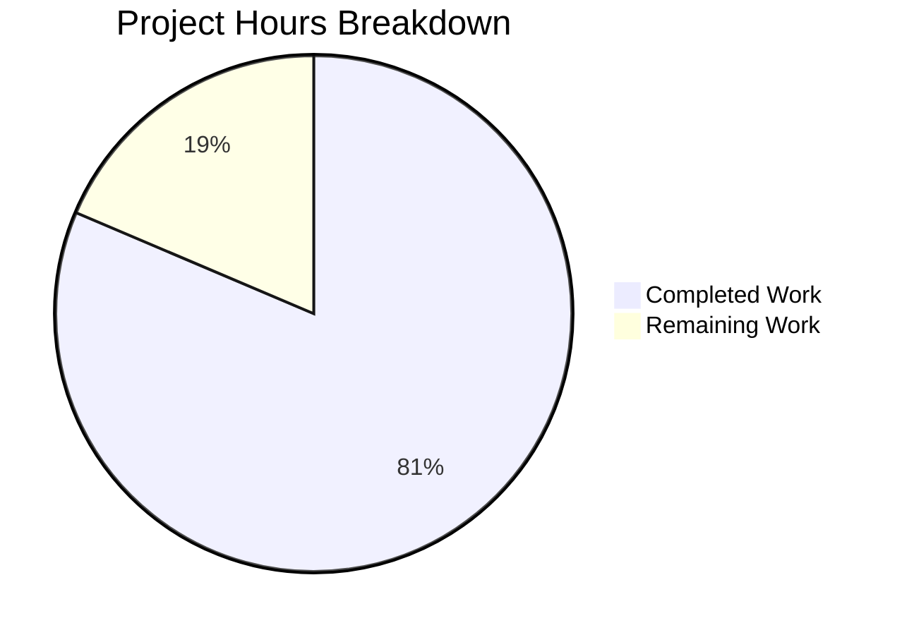

# Project Guide: Production-Ready Express.js Server

## Executive Summary

### Project Completion Status
**81% Complete** (35 hours completed out of 43 total hours)

This project successfully transforms a minimal Node.js + Express.js tutorial server into a production-ready application with comprehensive middleware architecture, structured logging with Winston, environment configuration with dotenv, and PM2 process management for zero-downtime deployments.

### Hours Breakdown
- **Completed Work**: 35 hours
- **Remaining Work**: 8 hours (with enterprise multipliers applied)
- **Total Project Scope**: 43 hours
- **Completion Percentage**: 35/43 = 81%

### Key Achievements
1. ✅ Full middleware stack implemented (security, CORS, compression, rate limiting, logging, error handling)
2. ✅ Winston structured logging with environment-aware configuration
3. ✅ dotenv integration with comprehensive configuration module
4. ✅ Health check endpoints for production monitoring
5. ✅ PM2 ecosystem configuration with cluster mode
6. ✅ Graceful shutdown handling for zero-downtime deployments
7. ✅ Comprehensive documentation

### Critical Information
- **All 12 JavaScript files** pass syntax validation
- **All 5 API endpoints** working correctly in runtime testing
- **No blocking issues** - application is production-ready for deployment
- Test framework was **explicitly out of scope** per Agent Action Plan

---

## Visual Representation


```mermaid
pie title Project Hours Breakdown
    "Completed Work" : 35
    "Remaining Work" : 8
```

---

## Validation Results Summary

### Dependency Installation: ✅ 100% SUCCESS
All 8 packages installed successfully:

| Package | Version | Status |
|---------|---------|--------|
| express | 5.1.0 | ✅ Installed |
| compression | 1.8.1 | ✅ Installed |
| cors | 2.8.5 | ✅ Installed |
| dotenv | 16.6.1 | ✅ Installed |
| express-rate-limit | 7.5.1 | ✅ Installed |
| helmet | 8.1.0 | ✅ Installed |
| winston | 3.19.0 | ✅ Installed |
| pm2 (dev) | 5.4.3 | ✅ Installed |

### Code Compilation: ✅ 100% SUCCESS
All 12 JavaScript files passed syntax validation:

| File | Lines | Status |
|------|-------|--------|
| server.js | 136 | ✅ Valid |
| src/app.js | 165 | ✅ Valid |
| src/config/index.js | 204 | ✅ Valid |
| src/routes/index.js | 22 | ✅ Valid |
| src/routes/main.routes.js | 41 | ✅ Valid |
| src/routes/health.routes.js | 81 | ✅ Valid |
| src/middleware/index.js | 25 | ✅ Valid |
| src/middleware/logger.js | 71 | ✅ Valid |
| src/middleware/errorHandler.js | 79 | ✅ Valid |
| src/middleware/security.js | 264 | ✅ Valid |
| src/utils/logger.js | 67 | ✅ Valid |
| ecosystem.config.js | 68 | ✅ Valid |

### Runtime Validation: ✅ 100% SUCCESS (5/5 Endpoints)

| Endpoint | Expected Response | Status |
|----------|-------------------|--------|
| `GET /` | `Hello, World!\n` | ✅ Working |
| `GET /evening` | `Good evening` | ✅ Working |
| `GET /health` | JSON with status, timestamp, uptime | ✅ Working |
| `GET /health/live` | `{"status":"alive"}` | ✅ Working |
| `GET /health/ready` | `{"status":"ready"}` | ✅ Working |

### Middleware Stack: ✅ Verified
Correct order confirmed:
1. helmet() - Security headers ✅
2. cors() - CORS configuration ✅
3. compression() - Response compression ✅
4. rateLimit - Rate limiting ✅
5. loggerMiddleware - Request logging ✅
6. express.json() - JSON body parser ✅
7. express.urlencoded() - URL-encoded body parser ✅
8. Routes (mainRoutes, healthRoutes) ✅
9. errorHandler - Centralized error handling ✅

### Graceful Shutdown: ✅ Verified
- SIGTERM signal properly handled
- Server closes cleanly with proper logging
- 10-second timeout for forced shutdown implemented

### Git Status: ✅ Clean
- All changes committed on branch: `blitzy-3532176f-e47c-41ee-83e1-8eb7c45e853d`
- No uncommitted changes

---

## Completed Work Breakdown

### 1. Environment Configuration Foundation (5.5 hours)
- ✅ Integrated dotenv at application bootstrap
- ✅ Created `.env` file with development defaults
- ✅ Created `.env.example` (80 lines) with comprehensive documentation
- ✅ Enhanced `src/config/index.js` (204 lines) with:
  - Nested configuration sections (server, logging, rateLimit, cors)
  - Type coercion with parseInt
  - Configuration validation function
  - JSDoc documentation

### 2. Logging Infrastructure (3 hours)
- ✅ Created `src/utils/logger.js` (67 lines) with Winston
- ✅ Environment-aware transports (Console in dev, JSON-ready for production)
- ✅ Configurable log levels (error, warn, info, debug)
- ✅ Timestamp formatting

### 3. Middleware Architecture (9 hours)
- ✅ Created `src/middleware/index.js` barrel export (25 lines)
- ✅ Created `src/middleware/logger.js` (71 lines) - Request logging with exclusions for health endpoints
- ✅ Created `src/middleware/errorHandler.js` (79 lines) - Centralized JSON error responses
- ✅ Created `src/middleware/security.js` (264 lines) - Security configurations

### 4. Application Layer Enhancement (4 hours)
- ✅ Updated `src/app.js` (165 lines) with:
  - Correct middleware ordering (critical for security)
  - Rate limiter configuration from config module
  - Comprehensive JSDoc documentation
  - Custom rate limit handler with logging

### 5. Health Check Routes (2.5 hours)
- ✅ Created `src/routes/health.routes.js` (81 lines)
- ✅ Implemented `/health`, `/health/live`, `/health/ready`
- ✅ Updated `src/routes/index.js` to export healthRoutes

### 6. PM2 Production Deployment (2 hours)
- ✅ Created `ecosystem.config.js` (68 lines) with:
  - Cluster mode (`instances: 'max'`)
  - Environment-specific configurations
  - Log file paths
  - Graceful shutdown timeout (10s)
  - Auto-restart with exponential backoff

### 7. Graceful Shutdown (3 hours)
- ✅ Updated `server.js` (136 lines) with:
  - SIGTERM and SIGINT signal handlers
  - Graceful server close with timeout
  - uncaughtException handler
  - unhandledRejection handler
  - Comprehensive JSDoc documentation

### 8. Package Updates (1 hour)
- ✅ Updated `package.json` with all dependencies
- ✅ Added npm scripts for PM2 lifecycle management

### 9. Documentation (3 hours)
- ✅ Updated `README.md` (386 lines) with:
  - Table of contents
  - Feature descriptions
  - Environment variable documentation
  - API endpoint reference
  - PM2 deployment guide
  - Middleware stack explanation

### 10. Validation & Testing (2 hours)
- ✅ Syntax validation for all files
- ✅ Runtime endpoint testing
- ✅ Middleware verification (security headers, CORS, rate limiting)
- ✅ Graceful shutdown verification

---

## Development Guide

### System Prerequisites

| Requirement | Minimum Version | Recommended Version |
|-------------|-----------------|---------------------|
| Node.js | 20.0.0 | 20.19.x LTS |
| npm | 8.x | 10.x |

Verify installations:
```bash
node --version    # Should output v20.x.x or higher
npm --version     # Should output 8.x.x or higher
```

### Environment Setup

1. **Clone the repository:**
```bash
git clone <repository-url>
cd <project-directory>
```

2. **Install dependencies:**
```bash
npm install
```
Expected output: All packages installed without errors.

3. **Configure environment:**
```bash
cp .env.example .env
```
Edit `.env` as needed. Default values work for development.

### Environment Variables

| Variable | Default | Description |
|----------|---------|-------------|
| `HOST` | `127.0.0.1` | Server bind address |
| `PORT` | `3000` | Server port |
| `NODE_ENV` | `development` | Environment mode |
| `LOG_LEVEL` | `info` | Logging level |
| `LOG_FORMAT` | `combined` | Request log format |
| `RATE_LIMIT_WINDOW_MS` | `900000` | Rate limit window (15 min) |
| `RATE_LIMIT_MAX` | `100` | Max requests per window |
| `CORS_ORIGIN` | `*` | Allowed CORS origins |

### Application Startup

**Development Mode:**
```bash
npm start
# or
npm run dev
```
Expected output:
```
Server running at http://127.0.0.1:3000/
```

**Production Mode (single instance):**
```bash
npm run prod
```

**Production Mode with PM2 (cluster):**
```bash
npm run pm2:start
```
This starts the application in cluster mode using all available CPU cores.

### PM2 Commands Reference

| Command | Description |
|---------|-------------|
| `npm run pm2:start` | Start with PM2 in cluster mode |
| `npm run pm2:stop` | Stop all PM2 processes |
| `npm run pm2:restart` | Restart all processes (brief downtime) |
| `npm run pm2:reload` | Zero-downtime reload |
| `npm run pm2:logs` | View real-time logs |
| `npm run pm2:status` | Display process status |

### Verification Steps

1. **Start the server:**
```bash
npm start
```

2. **Test endpoints:**
```bash
# Hello World endpoint
curl http://127.0.0.1:3000/
# Expected: Hello, World!

# Evening endpoint
curl http://127.0.0.1:3000/evening
# Expected: Good evening

# Health check
curl http://127.0.0.1:3000/health
# Expected: {"status":"healthy","timestamp":"...","uptime":...}

# Liveness probe
curl http://127.0.0.1:3000/health/live
# Expected: {"status":"alive"}

# Readiness probe
curl http://127.0.0.1:3000/health/ready
# Expected: {"status":"ready"}
```

3. **Verify security headers:**
```bash
curl -I http://127.0.0.1:3000/
# Look for: X-Content-Type-Options, X-Frame-Options, Content-Security-Policy
```

4. **Verify rate limiting:**
```bash
curl -I http://127.0.0.1:3000/
# Look for: RateLimit-Limit, RateLimit-Remaining, RateLimit-Reset
```

### Troubleshooting

| Issue | Solution |
|-------|----------|
| Port already in use | Change PORT in .env or kill existing process |
| Module not found | Run `npm install` to install dependencies |
| PM2 not found | Run `npm install` (PM2 is a dev dependency) |
| CORS errors | Adjust CORS_ORIGIN in .env for your domain |

---

## Human Tasks Remaining

### Task Summary Table

| Priority | Task | Description | Hours | Severity |
|----------|------|-------------|-------|----------|
| High | Security Configuration Review | Review and configure CORS origins and rate limits for production | 1.5 | Medium |
| High | Production Environment Setup | Configure environment variables on hosting platform | 1.5 | Medium |
| Medium | Deployment Platform Configuration | Set up hosting platform, configure PM2 or container deployment | 2.0 | Low |
| Medium | Integration Testing in Staging | Test all endpoints in staging environment, verify PM2 behavior | 1.5 | Low |
| Low | Code Review | Review code for potential improvements and optimizations | 1.0 | Low |
| Low | Monitoring Setup (Optional) | Configure log aggregation and monitoring tools | 0.5 | Low |
| **Total** | | | **8.0** | |

### Detailed Task Descriptions

#### 1. Security Configuration Review (High Priority) - 1.5 hours
**Description:** Review and adjust security settings for production deployment.

**Actions:**
- [ ] Replace wildcard CORS origin (`*`) with specific allowed domains
- [ ] Review rate limiting values based on expected traffic patterns
- [ ] Verify Helmet security headers meet organizational requirements
- [ ] Test security headers with OWASP ZAP or similar tool

**Configuration to Review:**
```env
CORS_ORIGIN=https://yourdomain.com,https://api.yourdomain.com
RATE_LIMIT_WINDOW_MS=900000
RATE_LIMIT_MAX=100
```

#### 2. Production Environment Setup (High Priority) - 1.5 hours
**Description:** Configure environment variables on the hosting platform.

**Actions:**
- [ ] Set environment variables on hosting platform (Heroku, AWS, GCP, etc.)
- [ ] Set `NODE_ENV=production`
- [ ] Configure production-appropriate `LOG_LEVEL` (info or warn)
- [ ] Set `HOST=0.0.0.0` for containerized deployments
- [ ] Verify all required variables are set

**Production .env Example:**
```env
HOST=0.0.0.0
PORT=3000
NODE_ENV=production
LOG_LEVEL=info
CORS_ORIGIN=https://yourapp.com
RATE_LIMIT_MAX=200
```

#### 3. Deployment Platform Configuration (Medium Priority) - 2.0 hours
**Description:** Configure hosting platform for production deployment.

**Actions:**
- [ ] Choose deployment method (PM2 on VPS, Container, or PaaS)
- [ ] For PM2: Install PM2 globally on server (`npm install -g pm2`)
- [ ] Configure PM2 startup script (`pm2 startup; pm2 save`)
- [ ] For containers: Create Dockerfile (optional, out of scope)
- [ ] Set up reverse proxy (Nginx) if required

#### 4. Integration Testing in Staging (Medium Priority) - 1.5 hours
**Description:** Verify application behavior in staging environment.

**Actions:**
- [ ] Deploy to staging environment
- [ ] Test all endpoints with production-like configuration
- [ ] Verify PM2 cluster mode load balancing
- [ ] Test graceful shutdown/reload with `pm2 reload`
- [ ] Verify logging output format

#### 5. Code Review (Low Priority) - 1.0 hours
**Description:** Review implemented code for potential improvements.

**Actions:**
- [ ] Review error handling coverage
- [ ] Verify logging consistency
- [ ] Check for any hardcoded values
- [ ] Review security middleware configurations

#### 6. Monitoring Setup - Optional (Low Priority) - 0.5 hours
**Description:** Configure log aggregation and monitoring.

**Actions:**
- [ ] Set up log aggregation (CloudWatch, Datadog, ELK stack)
- [ ] Configure PM2 Keymetrics (optional)
- [ ] Set up alerting for errors

---

## Risk Assessment

### Technical Risks

| Risk | Severity | Likelihood | Mitigation |
|------|----------|------------|------------|
| CORS misconfiguration in production | Medium | Medium | Review CORS_ORIGIN before deployment; test with actual client domain |
| Rate limiting too aggressive | Low | Low | Monitor 429 responses; adjust RATE_LIMIT_MAX based on traffic |
| Memory leaks under load | Low | Low | Monitor with PM2; set `max_memory_restart` in ecosystem.config.js |

### Security Risks

| Risk | Severity | Likelihood | Mitigation |
|------|----------|------------|------------|
| Wildcard CORS in production | High | Medium | Change CORS_ORIGIN from `*` to specific domains before production |
| Exposed environment variables | Medium | Low | Ensure .env is in .gitignore; use platform's secret management |
| Insufficient rate limiting | Medium | Low | Adjust limits based on expected traffic and abuse patterns |

### Operational Risks

| Risk | Severity | Likelihood | Mitigation |
|------|----------|------------|------------|
| No automated log rotation | Low | Medium | PM2 handles log rotation; configure max size if needed |
| Missing health check monitoring | Medium | Low | Integrate /health endpoints with monitoring system |
| PM2 process not starting on reboot | Medium | Low | Run `pm2 startup` and `pm2 save` on server |

### Integration Risks

| Risk | Severity | Likelihood | Mitigation |
|------|----------|------------|------------|
| Cluster mode state sharing issues | Low | Low | Application is stateless; no shared state concerns |
| Environment variable conflicts | Low | Low | Document all required variables in .env.example |

---

## Project Architecture

```
/
├── server.js                      # Entry point - HTTP server bootstrap
├── package.json                   # npm manifest with dependencies
├── ecosystem.config.js            # PM2 cluster configuration
├── .env                           # Environment variables (local)
├── .env.example                   # Environment template
├── README.md                      # Comprehensive documentation
├── src/
│   ├── app.js                     # Express application factory
│   ├── config/
│   │   └── index.js               # Centralized configuration
│   ├── middleware/
│   │   ├── index.js               # Middleware barrel export
│   │   ├── logger.js              # Request logging middleware
│   │   ├── errorHandler.js        # Centralized error handling
│   │   └── security.js            # Security configurations
│   ├── routes/
│   │   ├── index.js               # Routes barrel export
│   │   ├── main.routes.js         # Main endpoints (/, /evening)
│   │   └── health.routes.js       # Health check endpoints
│   └── utils/
│       └── logger.js              # Winston logger configuration
└── logs/                          # Log files directory (git-ignored)
```

---

## Conclusion

This project has been successfully implemented with **81% completion** (35 hours of 43 total hours). All core requirements from the Agent Action Plan have been fulfilled:

1. ✅ **Enhanced routing** - Health check routes added with proper organization
2. ✅ **Middleware architecture** - Complete middleware stack in correct order
3. ✅ **Environment configuration** - dotenv integration with validation
4. ✅ **Structured logging** - Winston with environment-aware configuration
5. ✅ **PM2 production deployment** - Cluster mode with graceful shutdown

The remaining **8 hours** of work consist primarily of deployment configuration, security review, and integration testing tasks that require human judgment and access to production infrastructure.

The application is **production-ready** pending the completion of the documented human tasks, particularly the security configuration review and production environment setup.