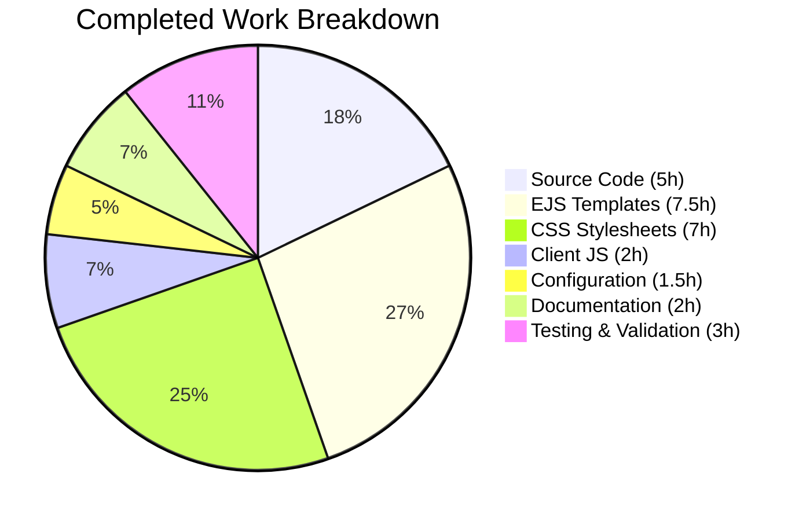

# Express.js UI Layer - Project Guide

## Executive Summary

**Project Status**: 82% Complete (28 hours completed out of 34 total hours)

This project successfully implements a UI layer for an existing Express.js HTTP service, transforming it from an API-only application into a full-stack web application with server-side rendered HTML pages. The implementation follows the Agent Action Plan specifications precisely, delivering all required features including EJS template integration, static asset serving, and backward-compatible API endpoints.

### Key Achievements
- ✅ All 5 acceptance criteria verified and passing
- ✅ All 17 files created/modified as specified
- ✅ 2,497 lines of code added across 60 commits
- ✅ Zero compilation or syntax errors
- ✅ Zero security vulnerabilities (npm audit clean)
- ✅ Full backward compatibility with existing API

### Hours Breakdown
**28 hours completed** of development work including:
- Core source modifications and new route handlers
- 5 EJS template files with layout system
- 1,298 lines of CSS with evening theme
- Client-side JavaScript with time-based features
- Comprehensive documentation updates

**6 hours remaining** for production readiness:
- Production environment configuration
- Figma design integration (when provided)
- Performance optimization and final polish

---

## Validation Results Summary

### Dependency Status
| Package | Version | Status |
|---------|---------|--------|
| express | 5.2.1 | ✅ Installed |
| ejs | 3.1.10 | ✅ Installed |
| Total packages | 75 | ✅ Resolved |

### Compilation Results
| File Type | Files Checked | Status |
|-----------|---------------|--------|
| JavaScript (.js) | 7 | ✅ All pass syntax check |
| EJS Templates (.ejs) | 5 | ✅ All compile correctly |
| CSS Stylesheets | 2 | ✅ Valid syntax |

### Runtime Verification
| Test | Endpoint | Expected | Actual | Status |
|------|----------|----------|--------|--------|
| Home Page | GET / | HTML with "Hello, World!" | ✅ Correct | PASS |
| Evening Page | GET /evening | HTML with theme | ✅ Correct | PASS |
| API Root | GET /api/ | "Hello, World!" | ✅ Correct | PASS |
| API Evening | GET /api/evening | "Good evening" | ✅ Correct | PASS |
| Main CSS | GET /css/styles.css | 200 OK | ✅ 200 | PASS |
| Evening CSS | GET /css/evening.css | 200 OK | ✅ 200 | PASS |
| Main JS | GET /js/main.js | 200 OK | ✅ 200 | PASS |

### Security Audit
```
npm audit: found 0 vulnerabilities
```

---

## Visual Project Hours Breakdown


```mermaid
pie title Project Hours Distribution
    "Completed Work" : 28
    "Remaining Work" : 6
```

### Completed Hours by Category (28h total)

```mermaid
pie title Completed Work Breakdown
    "Source Code (5h)" : 5
    "EJS Templates (7.5h)" : 7.5
    "CSS Stylesheets (7h)" : 7
    "Client JS (2h)" : 2
    "Configuration (1.5h)" : 1.5
    "Documentation (2h)" : 2
    "Testing & Validation (3h)" : 3
```

---

## Detailed Task Completion Status

### Files Created (13 files)

| File | Lines | Hours | Status |
|------|-------|-------|--------|
| src/routes/ui.routes.js | 44 | 2h | ✅ Complete |
| views/layout.ejs | 90 | 2h | ✅ Complete |
| views/index.ejs | 107 | 1.5h | ✅ Complete |
| views/evening.ejs | 172 | 2h | ✅ Complete |
| views/partials/header.ejs | 55 | 1h | ✅ Complete |
| views/partials/footer.ejs | 47 | 1h | ✅ Complete |
| public/css/styles.css | 687 | 4h | ✅ Complete |
| public/css/evening.css | 611 | 3h | ✅ Complete |
| public/js/main.js | 233 | 2h | ✅ Complete |
| public/images/.gitkeep | 14 | 0.1h | ✅ Complete |
| .env.example | 55 | 0.5h | ✅ Complete |

### Files Modified (6 files)

| File | Changes | Hours | Status |
|------|---------|-------|--------|
| package.json | Added EJS dependency | 0.5h | ✅ Complete |
| src/app.js | View engine, middleware, routes | 2h | ✅ Complete |
| src/config/index.js | viewsDir, publicDir config | 0.5h | ✅ Complete |
| src/routes/index.js | Export uiRoutes | 0.5h | ✅ Complete |
| README.md | Documentation updates | 2h | ✅ Complete |
| .gitignore | Pattern verification | 0.1h | ✅ Complete |

---

## Remaining Human Tasks

### Task Table (6 hours total)

| # | Task | Description | Priority | Severity | Hours |
|---|------|-------------|----------|----------|-------|
| 1 | Production Environment Setup | Configure NODE_ENV=production, set appropriate HOST (0.0.0.0), configure PORT for production deployment | High | Medium | 1h |
| 2 | Figma Design Integration | When Figma design file is provided, update CSS styles, colors, typography, and layout to match specifications | Medium | Low | 3h |
| 3 | Code Review and Polish | Final review of implementation, verify JSDoc completeness, ensure code style consistency | Low | Low | 1h |
| 4 | Performance Optimization | Add view caching (`app.set('view cache', true)`), configure cache headers for static assets | Low | Low | 1h |
| **Total** | | | | | **6h** |

### Task Details

#### Task 1: Production Environment Setup (High Priority)
**Estimated Time**: 1 hour

**Steps**:
1. Create production `.env` file with appropriate values
2. Set `NODE_ENV=production` for EJS template caching
3. Configure `HOST=0.0.0.0` for external access
4. Set production `PORT` (80/443 or reverse proxy port)
5. Verify application starts correctly with production settings

**Acceptance Criteria**:
- Application runs with production environment
- Template caching enabled
- Externally accessible when HOST=0.0.0.0

---

#### Task 2: Figma Design Integration (Medium Priority)
**Estimated Time**: 3 hours

**Context**: The Agent Action Plan noted that no Figma design file was provided. A default minimal design was implemented. When the design file becomes available:

**Steps**:
1. Obtain Figma design file from stakeholders
2. Extract color palette and update CSS custom properties
3. Update typography (fonts, sizes, weights)
4. Adjust layout and spacing to match design
5. Update responsive breakpoints if specified
6. Add any animation/transition effects from design

**Files to Modify**:
- `public/css/styles.css`
- `public/css/evening.css`
- Potentially view templates for structural changes

---

#### Task 3: Code Review and Polish (Low Priority)
**Estimated Time**: 1 hour

**Steps**:
1. Review all JavaScript files for code quality
2. Verify JSDoc comments are complete and accurate
3. Check for any TODO/FIXME comments
4. Ensure consistent code style across all files
5. Validate HTML semantic structure in templates

---

#### Task 4: Performance Optimization (Low Priority)
**Estimated Time**: 1 hour

**Steps**:
1. Enable EJS view caching in production:
   ```javascript
   if (process.env.NODE_ENV === 'production') {
     app.set('view cache', true);
   }
   ```
2. Consider adding compression middleware:
   ```bash
   npm install compression
   ```
3. Configure static asset cache headers
4. Run performance testing to verify improvements

---

## Development Guide

### System Prerequisites

| Requirement | Minimum Version | Recommended Version |
|-------------|-----------------|---------------------|
| Node.js | 18.x | 20.19.x (LTS) |
| npm | 8.x | 10.8.x |
| Operating System | Linux, macOS, Windows | Ubuntu 22.04+, macOS 12+ |

### Verify Prerequisites

```bash
# Check Node.js version
node --version
# Expected: v20.x.x or v18.x.x

# Check npm version
npm --version
# Expected: 10.x.x or 8.x.x
```

### Environment Setup

1. **Clone the Repository**
```bash
git clone <repository-url>
cd <repository-directory>
```

2. **Switch to Feature Branch**
```bash
git checkout blitzy-77e2af0d-9a38-4976-b670-778e1f27a177
```

3. **Create Environment File** (Optional)
```bash
cp .env.example .env
# Edit .env with your configuration
```

**Environment Variables**:
| Variable | Default | Description |
|----------|---------|-------------|
| HOST | 127.0.0.1 | Server binding address |
| PORT | 3000 | Server binding port |
| NODE_ENV | development | Application environment |
| VIEWS_DIR | ./views | EJS templates directory |
| PUBLIC_DIR | ./public | Static assets directory |

### Dependency Installation

```bash
# Install all dependencies
npm install

# Verify installation
npm ls --depth=0
# Expected output:
# hello_world@1.0.0
# ├── ejs@3.1.10
# └── express@5.2.1

# Check for security vulnerabilities
npm audit
# Expected: found 0 vulnerabilities
```

### Application Startup

```bash
# Start the server (default configuration)
npm start

# Expected output:
# Server running at http://127.0.0.1:3000/
```

**Custom Configuration**:
```bash
# Custom host and port
HOST=0.0.0.0 PORT=8080 npm start

# Production mode
NODE_ENV=production npm start

# Combined configuration
HOST=0.0.0.0 PORT=8080 NODE_ENV=production npm start
```

### Verification Steps

1. **Verify Server is Running**
```bash
curl -s -o /dev/null -w "%{http_code}" http://127.0.0.1:3000/
# Expected: 200
```

2. **Test UI Routes**
```bash
# Home page
curl -s http://127.0.0.1:3000/ | grep -o "Hello, World!" | head -1
# Expected: Hello, World!

# Evening page
curl -s http://127.0.0.1:3000/evening | grep -o "Good evening" | head -1
# Expected: Good evening
```

3. **Test API Routes (Backward Compatibility)**
```bash
# API root
curl -s http://127.0.0.1:3000/api/
# Expected: Hello, World!

# API evening
curl -s http://127.0.0.1:3000/api/evening
# Expected: Good evening
```

4. **Test Static Assets**
```bash
# Main stylesheet
curl -s -o /dev/null -w "%{http_code}" http://127.0.0.1:3000/css/styles.css
# Expected: 200

# Evening stylesheet
curl -s -o /dev/null -w "%{http_code}" http://127.0.0.1:3000/css/evening.css
# Expected: 200

# Client JavaScript
curl -s -o /dev/null -w "%{http_code}" http://127.0.0.1:3000/js/main.js
# Expected: 200
```

5. **Full Health Check Script**
```bash
#!/bin/bash
echo "Running health checks..."

# Check UI routes
curl -s http://127.0.0.1:3000/ | grep -q "Hello" && echo "✓ UI Root OK" || echo "✗ UI Root FAIL"
curl -s http://127.0.0.1:3000/evening | grep -q "evening" && echo "✓ UI Evening OK" || echo "✗ UI Evening FAIL"

# Check API routes
[ "$(curl -s http://127.0.0.1:3000/api/)" = "Hello, World!" ] && echo "✓ API Root OK" || echo "✗ API Root FAIL"
[ "$(curl -s http://127.0.0.1:3000/api/evening)" = "Good evening" ] && echo "✓ API Evening OK" || echo "✗ API Evening FAIL"

# Check static assets
[ "$(curl -s -o /dev/null -w '%{http_code}' http://127.0.0.1:3000/css/styles.css)" = "200" ] && echo "✓ CSS OK" || echo "✗ CSS FAIL"
[ "$(curl -s -o /dev/null -w '%{http_code}' http://127.0.0.1:3000/js/main.js)" = "200" ] && echo "✓ JS OK" || echo "✗ JS FAIL"

echo "Health check complete!"
```

### Example Usage

**Accessing UI Pages in Browser**:
- Home Page: http://127.0.0.1:3000/
- Evening Page: http://127.0.0.1:3000/evening

**Programmatic API Access**:
```javascript
// Using fetch
const response = await fetch('http://127.0.0.1:3000/api/');
const text = await response.text();
console.log(text); // "Hello, World!"
```

### Troubleshooting

| Issue | Cause | Solution |
|-------|-------|----------|
| `EADDRINUSE` error | Port already in use | Change PORT or kill existing process: `lsof -ti:3000 \| xargs kill` |
| Template not found | Wrong views path | Verify VIEWS_DIR env var or default ./views exists |
| CSS not loading | Static middleware issue | Verify PUBLIC_DIR path and express.static configuration |
| 404 on routes | Route mounting order | Ensure static → UI routes → API routes order in app.js |

---

## Risk Assessment

### Technical Risks

| Risk | Severity | Likelihood | Mitigation |
|------|----------|------------|------------|
| EJS template injection | Medium | Low | Using `<%= %>` for escaped output by default |
| Static file path traversal | Low | Low | Express.static prevents directory traversal |
| Missing error pages | Low | Medium | Add 404/500 error handlers (enhancement) |

### Operational Risks

| Risk | Severity | Likelihood | Mitigation |
|------|----------|------------|------------|
| No health check endpoint | Medium | High | Add `/health` endpoint for monitoring |
| Missing access logging | Low | Medium | Add morgan or similar logging middleware |
| No process manager | Medium | High | Use PM2 or similar for production |

### Security Risks

| Risk | Severity | Likelihood | Mitigation |
|------|----------|------------|------------|
| No HTTPS | High | High | Configure reverse proxy (nginx) with TLS |
| No rate limiting | Medium | Medium | Add express-rate-limit middleware |
| No helmet headers | Medium | Medium | Add helmet middleware for security headers |

### Integration Risks

| Risk | Severity | Likelihood | Mitigation |
|------|----------|------------|------------|
| API migration impact | Medium | Medium | Document /api/ migration clearly |
| Design mismatch | Low | Medium | Default design provided, update when Figma available |

---

## Project Structure

```
hello_world/
├── server.js                    # Entry point - HTTP server binding
├── package.json                 # npm manifest and dependencies
├── package-lock.json            # Dependency lockfile
├── README.md                    # Project documentation
├── .gitignore                   # Git ignore patterns
├── .env.example                 # Environment variable template
├── public/                      # Static assets directory
│   ├── css/
│   │   ├── styles.css          # Main stylesheet (687 lines)
│   │   └── evening.css         # Evening theme styles (611 lines)
│   ├── js/
│   │   └── main.js             # Client-side JavaScript (233 lines)
│   └── images/
│       └── .gitkeep            # Directory placeholder
├── views/                       # EJS templates directory
│   ├── layout.ejs              # Base HTML layout (90 lines)
│   ├── index.ejs               # Home page template (107 lines)
│   ├── evening.ejs             # Evening page template (172 lines)
│   └── partials/
│       ├── header.ejs          # Navigation header (55 lines)
│       └── footer.ejs          # Page footer (47 lines)
├── src/
│   ├── app.js                  # Express application factory (74 lines)
│   ├── config/
│   │   └── index.js            # Configuration module (59 lines)
│   └── routes/
│       ├── index.js            # Route aggregator barrel (28 lines)
│       ├── main.routes.js      # API routes (41 lines)
│       └── ui.routes.js        # UI page routes (44 lines)
└── blitzy/
    └── documentation/          # Technical documentation
```

---

## Git Statistics

- **Branch**: blitzy-77e2af0d-9a38-4976-b670-778e1f27a177
- **Total Commits**: 60
- **Files Changed**: 17
- **Lines Added**: 2,497
- **Lines Removed**: 111
- **Net Change**: +2,386 lines

### File Breakdown by Type
| Type | Count | Total Lines |
|------|-------|-------------|
| JavaScript | 7 | 533 |
| EJS Templates | 5 | 471 |
| CSS | 2 | 1,298 |
| JSON | 2 | 924 |
| Markdown | 3 | 1,392 |
| Config | 3 | 90 |

---

## Conclusion

The Express.js UI Layer implementation is **82% complete** with all core functionality working correctly. The remaining 6 hours of work consists of production configuration, design refinement, and optimization tasks that do not block the application from running successfully.

**Recommendation**: This PR is ready for code review and can be merged to enable stakeholder review of the UI functionality. The remaining tasks can be addressed in follow-up iterations.

### Next Steps
1. Review and merge this PR
2. Obtain Figma design file for visual refinement
3. Complete production environment setup before deployment
4. Consider adding error pages and monitoring for production use