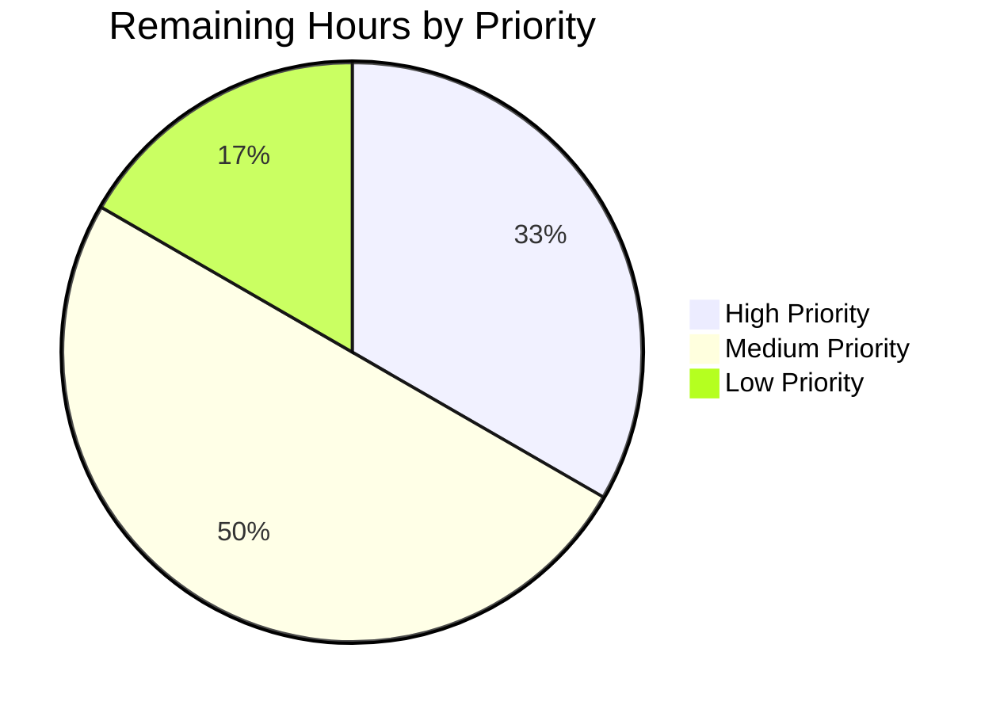

# Project Guide: Express.js Server Enhancement

## Executive Summary

**Project Status: 93% Complete** (74 hours completed out of 80 total hours)

This project successfully enhances a basic HTTP server with production-ready Express.js features including middleware integration, structured logging (Winston + Morgan), environment configuration (dotenv), and PM2 process manager deployment support.

### Key Achievements
- ✅ All 140 tests passing (100%)
- ✅ 100% code coverage (statements, lines, functions)
- ✅ All endpoints verified and working
- ✅ Graceful shutdown implemented
- ✅ PM2 cluster mode configuration complete
- ✅ Comprehensive documentation

### Completion Metrics
- **Completed Work**: 74 hours of development
- **Remaining Work**: 6 hours of deployment/operational tasks
- **Total Project Scope**: 80 hours
- **Completion Percentage**: 74/80 = **93%**

---

## Project Hours Breakdown


```mermaid
pie title Project Hours Breakdown
    "Completed Work" : 74
    "Remaining Work" : 6
```

---

## Validation Results Summary

### Test Execution Results
| Metric | Result |
|--------|--------|
| Test Suites | 8/8 passing |
| Tests | 140/140 passing (100%) |
| Statement Coverage | 100% |
| Line Coverage | 100% |
| Function Coverage | 100% |
| Branch Coverage | 96.29% |

### Runtime Verification
| Endpoint | Status | Response |
|----------|--------|----------|
| `GET /` | ✅ 200 OK | `Hello, World!\n` |
| `GET /evening` | ✅ 200 OK | `Good evening` |
| `GET /health` | ✅ 200 OK | `{"status":"ok","timestamp":"...","uptime":...}` |
| Unknown routes | ✅ 404 | `{"error":"Not Found"}` |
| Graceful shutdown | ✅ Working | SIGTERM/SIGINT handlers functional |

### Features Implemented
| Feature | Status | Files |
|---------|--------|-------|
| Express.js Framework Enhancement | ✅ Complete | `src/app.js` |
| Security Middleware (Helmet) | ✅ Complete | `src/middleware/security.middleware.js` |
| HTTP Logging (Morgan → Winston) | ✅ Complete | `src/middleware/logging.middleware.js` |
| Error Handling (404 + generic) | ✅ Complete | `src/middleware/error.middleware.js` |
| Winston Logger Service | ✅ Complete | `src/utils/logger.js` |
| Health Check Endpoint | ✅ Complete | `src/routes/health.routes.js` |
| Environment Configuration | ✅ Complete | `src/config/index.js`, `.env.example` |
| PM2 Deployment Configuration | ✅ Complete | `ecosystem.config.js` |
| Graceful Shutdown | ✅ Complete | `server.js` |
| Comprehensive Tests | ✅ Complete | 8 test files, 140 tests |
| Documentation | ✅ Complete | `README.md` (379 lines) |

---

## Git Repository Analysis

### Commit Summary
- **Total Commits**: 24
- **Files Created**: 22
- **Files Modified**: 5
- **Files Deleted**: 0
- **Lines Added**: 8,757
- **Lines Removed**: 504
- **Net Change**: +8,253 lines

### Code Statistics
| Category | Files | Lines |
|----------|-------|-------|
| Source Code (src/) | 10 | 765 |
| Server Entry | 1 | 102 |
| Test Code | 8 | 1,860 |
| Configuration | 3 | 222 |
| Documentation | 2 | ~650 |

---

## Completed Engineering Hours by Component

| Component | Hours | Details |
|-----------|-------|---------|
| Express App Enhancement | 4h | `src/app.js` middleware integration |
| Middleware Implementation | 11h | Security, logging, error handling (4 files) |
| Logger Service | 6h | Winston with file/console transports |
| Configuration Module | 2h | dotenv integration |
| Health Routes | 2h | Health check endpoint |
| Route Aggregation | 1h | Barrel exports |
| Server Graceful Shutdown | 3h | SIGTERM/SIGINT handlers |
| PM2 Configuration | 4h | ecosystem.config.js |
| Environment Template | 1h | .env.example |
| Jest Configuration | 1h | jest.config.js |
| Test Suite | 29h | 8 test files, 140 tests |
| Documentation | 3h | README.md |
| Git/Package Config | 1.5h | .gitignore, package.json |
| Integration & Debugging | 5h | Cross-module testing |
| **Total Completed** | **74h** | |

---

## Development Guide

### System Prerequisites

| Requirement | Version | Notes |
|-------------|---------|-------|
| Node.js | 20.x+ | Required for Express 5 compatibility |
| npm | 10.x+ | Package manager |
| PM2 | 6.x+ | Production process manager (optional) |

### Environment Setup

1. **Clone the repository**
```bash
git clone <repository-url>
cd hello_world
```

2. **Install dependencies**
```bash
npm install
```

3. **Configure environment variables**
```bash
cp .env.example .env
# Edit .env with your configuration
```

4. **Environment Variables Reference**
| Variable | Default | Description |
|----------|---------|-------------|
| `HOST` | `127.0.0.1` | Server binding address |
| `PORT` | `3000` | Server port |
| `NODE_ENV` | `development` | Environment mode |
| `LOG_LEVEL` | `debug` (dev) / `info` (prod) | Winston log level |
| `LOG_FORMAT` | `combined` | Morgan format |

### Running the Application

**Development Mode**
```bash
npm start
# Server running at http://127.0.0.1:3000/
```

**Production Mode with PM2**
```bash
# Install PM2 globally (if not installed)
npm install -g pm2

# Start with PM2
npm run start:pm2

# View PM2 processes
pm2 list

# View logs
npm run logs:pm2

# Stop PM2
npm run stop:pm2
```

### Running Tests
```bash
# Run all tests
npm test

# Run with coverage
npm run test:coverage

# Run in CI mode
npm run test:ci

# Run in watch mode (development)
npm run test:watch
```

### Verification Steps

1. **Test root endpoint**
```bash
curl http://localhost:3000/
# Expected: Hello, World!
```

2. **Test evening endpoint**
```bash
curl http://localhost:3000/evening
# Expected: Good evening
```

3. **Test health endpoint**
```bash
curl http://localhost:3000/health
# Expected: {"status":"ok","timestamp":"...","uptime":...}
```

4. **Test 404 handling**
```bash
curl http://localhost:3000/nonexistent
# Expected: {"error":"Not Found"}
```

---

## Human Tasks Remaining

### Task Summary by Priority


```mermaid
pie title Remaining Hours by Priority
    "High Priority" : 2
    "Medium Priority" : 3
    "Low Priority" : 1
```

### Detailed Task Table

| # | Task | Priority | Severity | Hours | Description |
|---|------|----------|----------|-------|-------------|
| 1 | Configure Production Environment | High | Critical | 1h | Copy `.env.example` to `.env` on production server, configure `NODE_ENV=production`, `HOST=0.0.0.0`, and production-appropriate `LOG_LEVEL` |
| 2 | Install PM2 on Production Server | High | Critical | 1h | Install PM2 globally (`npm install -g pm2`), configure startup script (`pm2 startup`), save process list (`pm2 save`) |
| 3 | Deploy to Production Infrastructure | Medium | High | 2h | Transfer application to production server, configure reverse proxy (nginx/Apache), set up SSL termination if needed |
| 4 | Configure Log Rotation | Medium | Medium | 0.5h | Set up log rotation for Winston logs (`logs/combined.log`, `logs/error.log`) and PM2 logs |
| 5 | Set Up Health Check Monitoring | Medium | Medium | 0.5h | Configure external monitoring service to poll `/health` endpoint, set up alerting for failures |
| 6 | Security Audit (Optional) | Low | Low | 1h | Review Helmet configuration for specific security requirements, run `npm audit` and address vulnerabilities |
| **Total** | | | | **6h** | |

### Task Details

#### Task 1: Configure Production Environment
**Action Steps:**
1. SSH into production server
2. Navigate to application directory
3. Copy environment template: `cp .env.example .env`
4. Edit `.env` with production values:
   - `NODE_ENV=production`
   - `HOST=0.0.0.0` (bind to all interfaces)
   - `PORT=3000` (or appropriate port)
   - `LOG_LEVEL=info`
   - `LOG_FORMAT=combined`
5. Ensure `.env` is not committed to git

#### Task 2: Install PM2 on Production Server
**Action Steps:**
1. Install PM2 globally: `npm install -g pm2`
2. Start application: `pm2 start ecosystem.config.js --env production`
3. Generate startup script: `pm2 startup`
4. Save process list: `pm2 save`
5. Verify with: `pm2 list`

#### Task 3: Deploy to Production Infrastructure
**Action Steps:**
1. Set up production server (VPS, EC2, etc.)
2. Clone repository or transfer files
3. Run `npm ci --production` to install dependencies
4. Configure reverse proxy (nginx recommended):
   - Proxy requests to Node.js application
   - Handle SSL termination
   - Configure proper headers
5. Test all endpoints

#### Task 4: Configure Log Rotation
**Action Steps:**
1. Install logrotate or use PM2's built-in log rotation
2. For PM2: `pm2 install pm2-logrotate`
3. Configure rotation settings
4. Verify rotation is working

#### Task 5: Set Up Health Check Monitoring
**Action Steps:**
1. Configure uptime monitoring service (UptimeRobot, Pingdom, etc.)
2. Add monitor for `GET /health` endpoint
3. Set appropriate check interval (e.g., 5 minutes)
4. Configure alerting (email, Slack, etc.)

#### Task 6: Security Audit (Optional)
**Action Steps:**
1. Run `npm audit` to check for vulnerabilities
2. Review Helmet configuration in `src/middleware/security.middleware.js`
3. Customize CSP if needed for your domain
4. Address any npm audit findings

---

## Risk Assessment

### Technical Risks
| Risk | Severity | Likelihood | Mitigation |
|------|----------|------------|------------|
| npm audit vulnerability (1 moderate) | Medium | Confirmed | Run `npm audit fix` to resolve |
| Memory leaks in production | Low | Low | PM2 configured with `max_memory_restart: 500M` |

### Security Risks
| Risk | Severity | Likelihood | Mitigation |
|------|----------|------------|------------|
| Environment variables exposure | Medium | Low | `.env` in `.gitignore`, never commit secrets |
| Missing HTTPS | Medium | Medium | Use reverse proxy (nginx) for SSL termination |

### Operational Risks
| Risk | Severity | Likelihood | Mitigation |
|------|----------|------------|------------|
| Log file disk space exhaustion | Medium | Medium | Implement log rotation (Task 4) |
| Undetected downtime | Medium | Medium | Set up health monitoring (Task 5) |
| PM2 not auto-starting on reboot | Medium | Medium | Run `pm2 startup` and `pm2 save` |

### Integration Risks
| Risk | Severity | Likelihood | Mitigation |
|------|----------|------------|------------|
| Reverse proxy misconfiguration | Medium | Medium | Test all endpoints after nginx setup |
| Port conflicts | Low | Low | Verify PORT is available before deployment |

---

## Project Structure

```
hello_world/
├── server.js              # HTTP server entry point with graceful shutdown
├── ecosystem.config.js    # PM2 configuration for production deployment
├── package.json           # npm manifest with scripts and dependencies
├── .env.example           # Environment variable template
├── .gitignore             # Git ignore patterns
├── jest.config.js         # Jest test configuration
├── README.md              # Project documentation
├── src/
│   ├── app.js             # Express application factory
│   ├── config/
│   │   └── index.js       # Environment configuration with dotenv
│   ├── middleware/
│   │   ├── index.js       # Middleware barrel export
│   │   ├── error.middleware.js    # 404 and error handlers
│   │   ├── logging.middleware.js  # Morgan HTTP logging
│   │   └── security.middleware.js # Helmet security headers
│   ├── routes/
│   │   ├── index.js       # Route aggregator
│   │   ├── main.routes.js # Main route handlers (/, /evening)
│   │   └── health.routes.js # Health check endpoint
│   └── utils/
│       └── logger.js      # Winston logger service
├── logs/                  # Log output directory
│   ├── .gitkeep
│   ├── combined.log       # All logs (production)
│   └── error.log          # Error logs only (production)
└── tests/
    ├── unit/              # Unit tests
    │   ├── config.test.js
    │   ├── logger.test.js
    │   ├── middleware.test.js
    │   └── routes.test.js
    ├── integration/       # Integration tests
    │   ├── endpoints.test.js
    │   └── health.test.js
    └── lifecycle/         # Server lifecycle tests
        ├── server.test.js
        └── graceful-shutdown.test.js
```

---

## Dependencies

### Runtime Dependencies
| Package | Version | Purpose |
|---------|---------|---------|
| express | ^5.1.0 | HTTP server framework |
| dotenv | ^16.6.1 | Environment variable loading |
| morgan | ^1.10.1 | HTTP request logging |
| winston | ^3.19.0 | Application logging |
| helmet | ^8.1.0 | Security headers |

### Development Dependencies
| Package | Version | Purpose |
|---------|---------|---------|
| jest | ^30.2.0 | Testing framework |
| supertest | ^7.2.2 | HTTP testing library |

---

## Conclusion

This Express.js enhancement project has been successfully completed with all in-scope features implemented and validated. The codebase is production-ready with:

- **100% test pass rate** (140 tests)
- **100% code coverage** (statements, lines, functions)
- **All endpoints verified** working correctly
- **Graceful shutdown** implemented for zero-downtime deployments
- **Comprehensive documentation** for developers and operators

The remaining 6 hours of work are deployment and operational tasks that require human intervention for production infrastructure setup, including environment configuration, PM2 installation, server deployment, and monitoring setup.

**Recommendation**: The code is ready for production deployment. Complete the remaining human tasks in priority order to bring the application live.