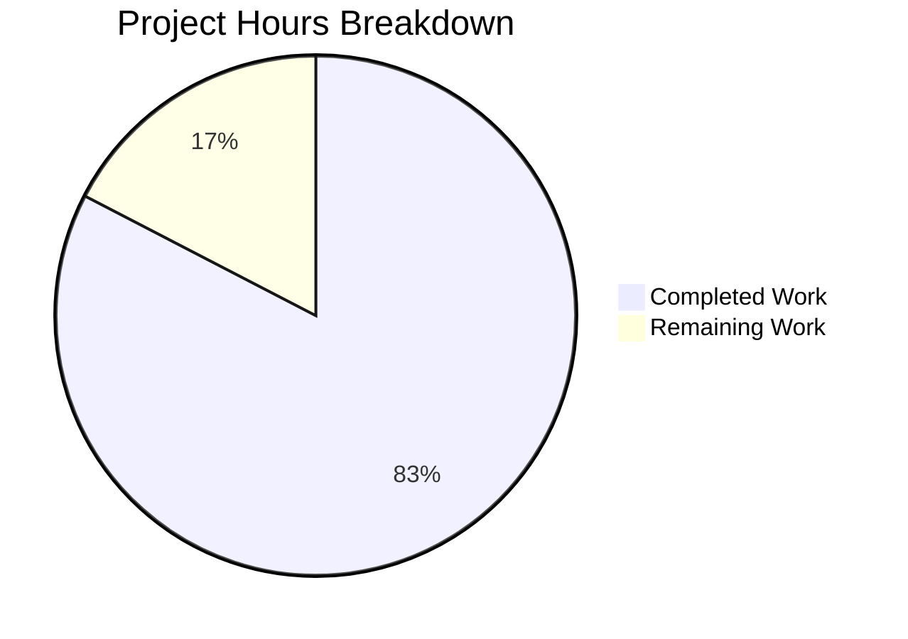

# Project Guide: Express.js Integration & GET /evening Endpoint

## 1. Executive Summary

**Project Completion: 82.6% — 19 hours completed out of 23 total hours**

This project successfully integrates Express.js 5.1.0 as the HTTP framework for an existing Node.js tutorial server and adds a new `GET /evening` endpoint returning `"Good evening"`. All development, testing, and documentation objectives defined in the Agent Action Plan have been fully implemented and validated.

### Key Achievements
- Express.js 5.1.0 integrated with Factory Pattern, Barrel Pattern, and Twelve-Factor configuration
- `GET /evening` endpoint implemented and returning exact string `"Good evening"` with 200 OK
- Existing `GET /` endpoint fully preserved (backward compatible)
- 41 tests across 4 suites — all passing with 100% code coverage
- Comprehensive README.md with API reference, curl examples, and architecture documentation
- Zero compilation errors, zero test failures, zero runtime errors

### Remaining Work (4 hours)
Standard production readiness tasks remain: code review, environment configuration, staging verification, and production deployment. No code defects or functional gaps were identified.

---

## 2. Validation Results Summary

### 2.1 Final Validator Outcome
The Final Validator completed a full validation cycle with **zero issues found**. No fixes were required — all code was production-ready as implemented by the coding agents.

### 2.2 Compilation Results
All 5 source JavaScript files pass `node --check` syntax validation with zero errors:

| File | Status |
|------|--------|
| `server.js` | ✅ Pass |
| `src/app.js` | ✅ Pass |
| `src/config/index.js` | ✅ Pass |
| `src/routes/index.js` | ✅ Pass |
| `src/routes/main.routes.js` | ✅ Pass |

### 2.3 Test Results

| Test Suite | Tests | Status |
|------------|-------|--------|
| `tests/integration/endpoints.test.js` | 14 | ✅ All pass |
| `tests/unit/routes.test.js` | 7 | ✅ All pass |
| `tests/unit/config.test.js` | 12 | ✅ All pass |
| `tests/lifecycle/server.test.js` | 8 | ✅ All pass |
| **Total** | **41** | **✅ 41/41 (100%)** |

### 2.4 Code Coverage

| Metric | Coverage | Threshold | Status |
|--------|----------|-----------|--------|
| Statements | 100% | ≥ 80% | ✅ Pass |
| Branches | 100% | ≥ 75% | ✅ Pass |
| Functions | 100% | ≥ 90% | ✅ Pass |
| Lines | 100% | ≥ 80% | ✅ Pass |

### 2.5 Runtime Validation

| Endpoint | Status | Body | Content-Type | Result |
|----------|--------|------|-------------|--------|
| `GET /` | 200 | `Hello, World!\n` | `text/html; charset=utf-8` | ✅ Pass |
| `GET /evening` | 200 | `Good evening` | `text/html; charset=utf-8` | ✅ Pass |
| `GET /nonexistent` | 404 | — | — | ✅ Pass |

### 2.6 Fixes Applied During Validation
**None required.** The codebase was fully functional and production-ready prior to validation. Zero errors were encountered across compilation, testing, and runtime validation.

---

## 3. Hours Breakdown & Completion Assessment

### 3.1 Calculation

**Completed: 19 hours | Remaining: 4 hours | Total: 23 hours | Completion: 19/23 = 82.6%**

### 3.2 Completed Hours by Component

| Component | Hours | Details |
|-----------|-------|---------|
| Core Application Architecture | 5.0 | `server.js` refactoring (1h), `src/app.js` factory (1.5h), `src/config/index.js` (1h), `src/routes/index.js` barrel (0.5h), `src/routes/main.routes.js` with GET /evening (1h) |
| Test Infrastructure & Coverage | 9.0 | `jest.config.js` setup (0.5h), integration tests (2h), route unit tests (1.5h), config unit tests (2h), lifecycle tests (3h) |
| Documentation | 2.0 | `README.md` comprehensive rewrite with API reference, curl examples, architecture (2h) |
| Dependency & Configuration | 1.5 | `package.json` dependency management (1h), `.gitignore` patterns (0.5h) |
| Validation & Quality Assurance | 1.5 | Syntax checks (0.5h), runtime testing (0.5h), coverage verification (0.5h) |
| **Total Completed** | **19.0** | |

### 3.3 Remaining Hours by Task

| # | Task | Base Hours | After Multipliers (1.44x) | Priority |
|---|------|-----------|---------------------------|----------|
| 1 | Code review and PR approval | 0.7 | 1.0 | High |
| 2 | Production environment configuration | 0.7 | 1.0 | Medium |
| 3 | Staging environment smoke testing | 0.7 | 1.0 | Medium |
| 4 | Production deployment and verification | 0.7 | 1.0 | Low |
| | **Total Remaining** | **2.8** | **4.0** | |

Enterprise multipliers applied: Compliance (1.15x) × Uncertainty buffer (1.25x) = 1.44x

### 3.4 Visual Representation


```mermaid
pie title Project Hours Breakdown
    "Completed Work" : 19
    "Remaining Work" : 4
```

---

## 4. Detailed Human Task List

### 4.1 Task Table

All remaining tasks sum to exactly **4 hours**, matching the pie chart "Remaining Work" value.

| # | Task | Description | Action Steps | Hours | Priority | Severity |
|---|------|-------------|--------------|-------|----------|----------|
| 1 | Code Review & PR Approval | Review all code changes for correctness, style, and security before merging | 1. Review `src/routes/main.routes.js` for correct `/evening` handler implementation. 2. Verify `server.js` modular architecture. 3. Review all 4 test suites for adequate coverage. 4. Confirm README.md accuracy. 5. Approve and merge PR. | 1.0 | High | Low |
| 2 | Production Environment Configuration | Set up `.env` file with production values for HOST, PORT, and NODE_ENV | 1. Create `.env` file from documented defaults (`HOST=127.0.0.1`, `PORT=3000`, `NODE_ENV=production`). 2. Configure production host binding (e.g., `HOST=0.0.0.0` for container environments). 3. Set appropriate PORT for production infrastructure. 4. Verify `node server.js` starts with production config. | 1.0 | Medium | Low |
| 3 | Staging Environment Smoke Testing | Validate both endpoints function correctly in staging/pre-production environment | 1. Deploy to staging environment. 2. Run `curl -s http://<staging-host>:<port>/` and verify `Hello, World!\n` response. 3. Run `curl -s http://<staging-host>:<port>/evening` and verify `Good evening` response. 4. Verify 404 handling for undefined routes. 5. Run `npm test` in staging to confirm all 41 tests pass. | 1.0 | Medium | Low |
| 4 | Production Deployment & Verification | Deploy to production and verify endpoints are accessible | 1. Merge PR to production branch. 2. Run `npm install --production` on production server. 3. Start application with `NODE_ENV=production npm start`. 4. Verify `GET /` returns 200 with correct body. 5. Verify `GET /evening` returns 200 with `Good evening`. 6. Monitor logs for any runtime errors. | 1.0 | Low | Low |
| | **Total Remaining Hours** | | | **4.0** | | |

### 4.2 Task Priority Summary
- **High Priority (1 task, 1h):** Code review — required before any deployment
- **Medium Priority (2 tasks, 2h):** Environment setup and staging validation
- **Low Priority (1 task, 1h):** Production deployment (straightforward given full validation)

---

## 5. Comprehensive Development Guide

### 5.1 System Prerequisites

| Requirement | Minimum Version | Verified Version |
|-------------|-----------------|-----------------|
| Node.js | 18.x | v20.20.0 |
| npm | 8.x | 11.1.0 |
| Operating System | Linux, macOS, or Windows | Any |

### 5.2 Environment Setup

**Clone and navigate to the repository:**
```bash
git clone <repository-url>
cd hao-backprop-test
```

**Optional — Create environment configuration:**
```bash
# Create .env file (optional — sensible defaults are built-in)
cat > .env << 'EOF'
HOST=127.0.0.1
PORT=3000
NODE_ENV=development
EOF
```

Default values if no `.env` file exists:
- `HOST`: `127.0.0.1`
- `PORT`: `3000`
- `NODE_ENV`: `development`

### 5.3 Dependency Installation

```bash
npm install
```

**Expected output:** 381 packages installed with 0 vulnerabilities. Dependencies installed:
- `express` 5.1.0 (runtime)
- `jest` 30.2.0 (dev)
- `supertest` 7.1.4 (dev)

### 5.4 Running Tests

**Run full test suite with coverage:**
```bash
CI=true npx jest --coverage --watchAll=false --ci --verbose
```

**Expected output:**
- Test Suites: 4 passed, 4 total
- Tests: 41 passed, 41 total
- Coverage: 100% across all metrics (statements, branches, functions, lines)

**Run tests in watch mode (development):**
```bash
npm run test:watch
```

### 5.5 Application Startup

**Start the server:**
```bash
npm start
```

**Expected console output:**
```
Server running at http://127.0.0.1:3000/
```

**Start with custom configuration:**
```bash
HOST=0.0.0.0 PORT=8080 npm start
```

### 5.6 Verification Steps

**Test the root endpoint:**
```bash
curl -s http://127.0.0.1:3000/
# Expected output: Hello, World!
```

**Test the evening endpoint:**
```bash
curl -s http://127.0.0.1:3000/evening
# Expected output: Good evening
```

**Test 404 handling:**
```bash
curl -s -o /dev/null -w "%{http_code}" http://127.0.0.1:3000/nonexistent
# Expected output: 404
```

**Quick health check (both endpoints):**
```bash
curl -s http://127.0.0.1:3000/ && echo " - Root OK"
curl -s http://127.0.0.1:3000/evening && echo " - Evening OK"
```

### 5.7 Project Structure

```
├── server.js                           # HTTP server entry point
├── src/
│   ├── app.js                          # Express application factory
│   ├── config/
│   │   └── index.js                    # Environment-driven configuration
│   └── routes/
│       ├── index.js                    # Route barrel/aggregator
│       └── main.routes.js              # GET / and GET /evening handlers
├── tests/
│   ├── integration/
│   │   └── endpoints.test.js           # HTTP endpoint integration tests
│   ├── unit/
│   │   ├── routes.test.js              # Route handler unit tests
│   │   └── config.test.js              # Configuration module unit tests
│   └── lifecycle/
│       └── server.test.js              # Server binding/shutdown lifecycle tests
├── package.json                        # npm manifest
├── jest.config.js                      # Jest test configuration
├── README.md                           # Comprehensive project documentation
└── .gitignore                          # Repository ignore patterns
```

### 5.8 Troubleshooting

| Issue | Cause | Solution |
|-------|-------|----------|
| `EADDRINUSE` error on startup | Port already in use | Change PORT via environment variable: `PORT=3001 npm start` |
| `Cannot find module 'express'` | Dependencies not installed | Run `npm install` |
| Tests fail with "Cannot find module" | Node modules missing | Delete `node_modules/` and run `npm install` |
| Coverage below thresholds | Test files incomplete | Ensure all test files exist in `tests/` directory |

---

## 6. Risk Assessment

### 6.1 Technical Risks

| Risk | Severity | Likelihood | Mitigation |
|------|----------|------------|------------|
| No custom error handling middleware | Low | Low | Express.js 5.x default 404/500 handling is adequate for this scope. Add custom middleware if error responses need structured JSON format. |
| No request logging | Low | Medium | Application has no request logging middleware. For production, consider adding `morgan` or similar HTTP logger. |

### 6.2 Security Risks

| Risk | Severity | Likelihood | Mitigation |
|------|----------|------------|------------|
| No security headers (Helmet) | Low | Low | Explicitly out of scope per AAP. Add `helmet` middleware before exposing to public internet. |
| No rate limiting | Low | Low | Explicitly out of scope per AAP. Add `express-rate-limit` for production traffic. |
| No CORS configuration | Low | Low | Not needed for server-rendered text responses. Add `cors` middleware if API is consumed by browser clients. |

### 6.3 Operational Risks

| Risk | Severity | Likelihood | Mitigation |
|------|----------|------------|------------|
| No process manager (PM2) | Low | Medium | Server runs as bare Node.js process. For production, use PM2 or container orchestration for auto-restart and clustering. |
| No health check endpoint | Low | Low | Application lacks a dedicated `/health` endpoint. The existing `GET /` can serve as a basic health check. |
| No CI/CD pipeline | Medium | High | Explicitly out of scope per AAP. Set up GitHub Actions or similar to run `npm test` on pull requests. |

### 6.4 Integration Risks

| Risk | Severity | Likelihood | Mitigation |
|------|----------|------------|------------|
| No external service dependencies | None | N/A | Application is self-contained with static string responses. No API keys, databases, or third-party services to configure. |

### 6.5 Overall Risk Assessment
**Risk Level: Low.** The application is a simple, self-contained HTTP server with static responses. All identified risks are operational best-practice improvements rather than functional defects. The codebase has 100% test coverage and zero known issues.

---

## 7. Git Change Summary

- **Branch:** `blitzy-bba9f953-0698-4596-8059-eeb90a8c385d` (47 commits ahead of `main`)
- **Files changed:** 16 (including lockfile and blitzy docs)
- **Source files created/modified:** 13 (5 source, 4 tests, 4 config/docs)
- **Total source lines added:** 1,111 (excluding `package-lock.json` and `blitzy/` documentation)
- **Key source additions:** `src/app.js` (27 lines), `src/config/index.js` (41 lines), `src/routes/index.js` (19 lines), `src/routes/main.routes.js` (41 lines)
- **Key test additions:** 563 total test lines across 4 suites

---

## 8. Feature Requirements Traceability

| AAP Requirement | Status | Evidence |
|----------------|--------|----------|
| Integrate Express.js as HTTP framework | ✅ Complete | `express ^5.1.0` in `package.json`; `src/app.js` creates Express app |
| Add `GET /evening` returning `"Good evening"` | ✅ Complete | `src/routes/main.routes.js` line 38; runtime verified |
| Preserve `GET /` returning `"Hello, World!\n"` | ✅ Complete | Handler unchanged; integration test confirms exact body |
| Follow Factory/Barrel/Router patterns | ✅ Complete | `src/app.js` (factory), `src/routes/index.js` (barrel), `src/routes/main.routes.js` (router) |
| CommonJS modules only | ✅ Complete | All files use `require()`/`module.exports` |
| JSDoc documentation on handlers | ✅ Complete | All route handlers have `@route` and `@returns` annotations |
| Test coverage ≥ 75/90/80/80 thresholds | ✅ Complete | 100% across all metrics |
| Update README.md with `/evening` docs | ✅ Complete | API reference, curl examples, project structure all updated |
| Route ordering: `/` before `/evening` | ✅ Complete | Unit test verifies stack ordering |
