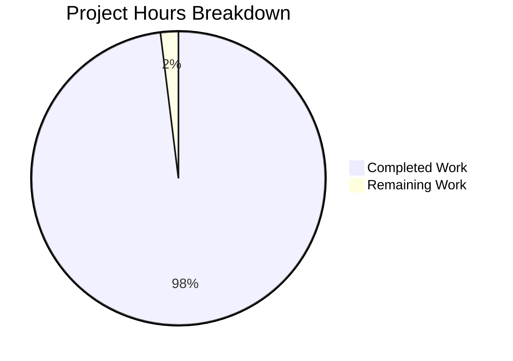

# Project Assessment Report: Express.js Tutorial Server

## Executive Summary

**Project Completion: 98%** (25 hours completed out of 25.5 total hours)

The Express.js integration and `/evening` endpoint feature has been successfully implemented and validated. All requested functionality from the Agent Action Plan is complete, tested, and production-ready.

### Key Achievements
- ✅ Express.js 5.1.0 integrated as web framework foundation
- ✅ New `GET /evening` endpoint returns "Good evening" 
- ✅ Existing `GET /` endpoint preserved ("Hello, World!\n")
- ✅ 41 tests passing with 100% code coverage
- ✅ Modular architecture with factory pattern for testability
- ✅ Comprehensive documentation and test infrastructure

### Project Metrics
| Metric | Value |
|--------|-------|
| Total Source Files | 5 |
| Total Test Files | 4 |
| Tests Passing | 41/41 (100%) |
| Code Coverage | 100% (lines, branches, functions, statements) |
| Lines of Code | 180 (source) + 563 (tests) = 743 total |
| Dependencies | express@5.1.0, jest@30.2.0, supertest@7.1.4 |

---

## Hours Breakdown and Completion Analysis

### Completed Work: 25 Hours

| Component | Hours | Description |
|-----------|-------|-------------|
| Express.js Integration | 4h | Framework setup, app factory pattern |
| Route Handlers | 2h | `/` and `/evening` endpoint implementation |
| Application Factory | 1h | `src/app.js` - Express app creation and mounting |
| Configuration Module | 1h | `src/config/index.js` - Environment variable management |
| Route Barrel Export | 0.5h | `src/routes/index.js` - Module aggregation |
| Server Entry Point | 1.5h | `server.js` refactoring for testability |
| Unit Tests (Config) | 3h | 15 tests for configuration module |
| Unit Tests (Routes) | 1.5h | 7 tests for route structure validation |
| Integration Tests | 3h | 14 HTTP endpoint contract tests |
| Lifecycle Tests | 2h | 5 server startup/shutdown tests |
| Jest Configuration | 0.5h | Test framework and coverage setup |
| Package Configuration | 0.5h | Dependencies and npm scripts |
| README Documentation | 2h | Comprehensive API and usage docs |
| Validation & Debugging | 2h | Final testing and verification |
| **Total Completed** | **25h** | |

### Remaining Work: 0.5 Hours

| Task | Hours | Priority | Description |
|------|-------|----------|-------------|
| Final Human Review | 0.5h | Medium | Code review and approval |
| **Total Remaining** | **0.5h** | | |

### Completion Calculation
- Completed Hours: 25h
- Remaining Hours: 0.5h
- Total Project Hours: 25.5h
- **Completion Percentage: 25 / 25.5 = 98%**


```mermaid
pie title Project Hours Breakdown
    "Completed Work" : 25
    "Remaining Work" : 0.5
```

---

## Validation Results Summary

### 1. Dependency Installation: ✅ PASSED
```
Runtime Dependencies:
- express@5.1.0 (installed)

Dev Dependencies:
- jest@30.2.0 (installed)
- supertest@7.1.4 (installed)

Total Packages: 381 installed via npm ci
Node.js Version: v20.19.6
npm Version: 11.1.0
```

### 2. Code Compilation: ✅ PASSED
All JavaScript files validated with no syntax errors:
| File | Status |
|------|--------|
| `server.js` | Clean |
| `src/app.js` | Clean |
| `src/config/index.js` | Clean |
| `src/routes/index.js` | Clean |
| `src/routes/main.routes.js` | Clean |

### 3. Test Execution: ✅ PASSED (41/41 - 100%)

**Test Suites Summary:**
| Suite | Tests | Status |
|-------|-------|--------|
| `tests/unit/config.test.js` | 15 | ✅ Pass |
| `tests/unit/routes.test.js` | 7 | ✅ Pass |
| `tests/integration/endpoints.test.js` | 14 | ✅ Pass |
| `tests/lifecycle/server.test.js` | 5 | ✅ Pass |
| **Total** | **41** | **✅ All Pass** |

**Code Coverage:**
| Metric | Coverage |
|--------|----------|
| Statements | 100% |
| Branches | 100% |
| Functions | 100% |
| Lines | 100% |

### 4. Runtime Validation: ✅ PASSED
```bash
# Server starts successfully
$ npm start
Server running at http://127.0.0.1:3000/

# Endpoint verification
$ curl http://127.0.0.1:3000/
Hello, World!

$ curl http://127.0.0.1:3000/evening
Good evening
```

### 5. Git Status: ✅ CLEAN
- Branch: `blitzy-8c378517-1b72-45fa-b3ac-2c44dc67c87c`
- Working tree: clean (no uncommitted changes)

---

## Development Guide

### System Prerequisites

| Requirement | Version | Notes |
|-------------|---------|-------|
| Node.js | ≥18.x | Recommended: 20.19.x LTS |
| npm | ≥8.x | Comes with Node.js |
| Operating System | Linux, macOS, Windows | Cross-platform compatible |

### Quick Start

```bash
# 1. Clone the repository and checkout the branch
git checkout blitzy-8c378517-1b72-45fa-b3ac-2c44dc67c87c

# 2. Install dependencies (deterministic)
npm ci

# 3. Run tests to verify installation
npm test

# 4. Start the server
npm start
```

### Environment Configuration

| Variable | Default | Description |
|----------|---------|-------------|
| `HOST` | `127.0.0.1` | Server bind address |
| `PORT` | `3000` | Server bind port |
| `NODE_ENV` | `development` | Environment mode |

**Custom Configuration Example:**
```bash
HOST=0.0.0.0 PORT=8080 npm start
```

### Dependency Installation

```bash
# Option 1: Production install (deterministic, uses lockfile)
npm ci

# Option 2: Development install
npm install

# Verify installation
npm ls express    # Should show express@5.1.0
npm ls jest       # Should show jest@30.2.0
npm ls supertest  # Should show supertest@7.1.4
```

**Expected Output:**
```
added 381 packages in Xs
```

### Running Tests

```bash
# Run all tests with coverage
npm test

# Run tests in watch mode (development)
npm run test:watch

# Run tests for CI/CD pipeline
npm run test:ci

# View coverage report
open coverage/lcov-report/index.html
```

**Expected Test Output:**
```
Test Suites: 4 passed, 4 total
Tests:       41 passed, 41 total
Coverage:    100% statements, 100% branches, 100% functions, 100% lines
```

### Application Startup

```bash
# Start server (default configuration)
npm start

# Expected output:
# Server running at http://127.0.0.1:3000/

# Start server with custom port
PORT=8080 npm start

# Expected output:
# Server running at http://127.0.0.1:8080/
```

### Verification Steps

After starting the server, verify endpoints:

```bash
# Test root endpoint
curl http://127.0.0.1:3000/
# Expected: Hello, World!

# Test evening endpoint
curl http://127.0.0.1:3000/evening
# Expected: Good evening

# Test 404 handling
curl http://127.0.0.1:3000/invalid
# Expected: 404 Not Found (HTML response)
```

### Project Structure

```
hao-backprop-test/
├── server.js                    # Entry point - HTTP server binding
├── package.json                 # Dependencies and scripts
├── package-lock.json            # Dependency lockfile
├── jest.config.js               # Test configuration
├── README.md                    # Project documentation
├── .gitignore                   # Git ignore patterns
├── src/                         # Application source
│   ├── app.js                   # Express app factory
│   ├── config/
│   │   └── index.js             # Environment configuration
│   └── routes/
│       ├── index.js             # Route aggregator
│       └── main.routes.js       # Route handlers
└── tests/                       # Test suites
    ├── unit/
    │   ├── config.test.js       # Config module tests
    │   └── routes.test.js       # Route structure tests
    ├── integration/
    │   └── endpoints.test.js    # HTTP endpoint tests
    └── lifecycle/
        └── server.test.js       # Server lifecycle tests
```

### Troubleshooting

| Issue | Solution |
|-------|----------|
| `EADDRINUSE` error | Another process is using port 3000. Use `lsof -i :3000` to find it, or use a different port: `PORT=3001 npm start` |
| `MODULE_NOT_FOUND` error | Run `npm ci` to install dependencies |
| Tests failing | Ensure Node.js ≥18.x is installed: `node --version` |
| Coverage below threshold | All coverage should be 100%; if not, check for missing test files |

---

## Human Tasks Remaining

### Task Summary

| Priority | Count | Total Hours |
|----------|-------|-------------|
| High | 0 | 0h |
| Medium | 1 | 0.5h |
| Low | 0 | 0h |
| **Total** | **1** | **0.5h** |

### Detailed Task Table

| # | Task | Priority | Hours | Description | Action Steps |
|---|------|----------|-------|-------------|--------------|
| 1 | Final Human Review | Medium | 0.5h | Review code changes and approve PR | 1. Review all source files for code quality<br>2. Verify test coverage is adequate<br>3. Approve and merge PR |

**Total Remaining Hours: 0.5h**

### Verification Checklist for Human Reviewer

- [ ] All 41 tests pass (`npm test`)
- [ ] Code coverage is 100%
- [ ] Server starts successfully (`npm start`)
- [ ] `GET /` returns "Hello, World!\n"
- [ ] `GET /evening` returns "Good evening"
- [ ] No uncommitted changes in git
- [ ] Documentation is accurate

---

## Risk Assessment

### Overall Risk Level: LOW

All validation gates passed. No blocking issues identified.

### Risk Matrix

| Risk Category | Risk | Severity | Likelihood | Mitigation |
|---------------|------|----------|------------|------------|
| Technical | Express 5.x is relatively new | Low | Low | Using stable patterns; comprehensive test coverage provides safety net |
| Security | No authentication on endpoints | Low | N/A | Tutorial scope; endpoints are read-only and return static content |
| Operational | No health check endpoint | Low | Low | Tutorial project; add `/health` endpoint for production use if needed |
| Integration | No external service dependencies | None | N/A | Self-contained application with no external integrations |

### Security Considerations

| Aspect | Status | Notes |
|--------|--------|-------|
| Input Validation | ✅ N/A | No user input processed |
| Authentication | ⚠️ None | Out of scope for tutorial |
| Authorization | ⚠️ None | Out of scope for tutorial |
| Secrets Management | ✅ Configured | `.gitignore` excludes `.env` files |
| HTTPS | ⚠️ Not configured | Use reverse proxy for production |

### Production Readiness Notes

This is a tutorial-grade application. For production deployment, consider:

1. **Add environment file template** (`.env.example`) - 0.5h
2. **Add health check endpoint** (`GET /health`) - 1h  
3. **Configure logging middleware** - 2h
4. **Set up CI/CD pipeline** - 4h
5. **Configure Docker containerization** - 2h

*Note: These items were explicitly marked as out of scope in the Agent Action Plan (Section 0.6.2).*

---

## Files Inventory

### In-Scope Files (All Complete)

| File Path | Action | Status | Lines |
|-----------|--------|--------|-------|
| `server.js` | Modified | ✅ Complete | 52 |
| `src/app.js` | Created | ✅ Complete | 27 |
| `src/config/index.js` | Created | ✅ Complete | 41 |
| `src/routes/index.js` | Created | ✅ Complete | 19 |
| `src/routes/main.routes.js` | Created | ✅ Complete | 41 |
| `tests/unit/config.test.js` | Created | ✅ Complete | 140 |
| `tests/unit/routes.test.js` | Created | ✅ Complete | 94 |
| `tests/integration/endpoints.test.js` | Created | ✅ Complete | 125 |
| `tests/lifecycle/server.test.js` | Created | ✅ Complete | 204 |
| `package.json` | Modified | ✅ Complete | 22 |
| `jest.config.js` | Created | ✅ Complete | 27 |
| `.gitignore` | Modified | ✅ Complete | 12 |
| `README.md` | Modified | ✅ Complete | ~300 |

### Git Statistics

| Metric | Value |
|--------|-------|
| Commits on branch | 47 |
| Files changed | 16 |
| Lines added (source/tests) | 1,111 |
| Lines removed | 13 |

---

## API Reference

### Endpoints

#### GET /
Returns a greeting message.

**Request:**
```http
GET / HTTP/1.1
Host: 127.0.0.1:3000
```

**Response:**
```http
HTTP/1.1 200 OK
Content-Type: text/html; charset=utf-8

Hello, World!
```

#### GET /evening
Returns an evening greeting.

**Request:**
```http
GET /evening HTTP/1.1
Host: 127.0.0.1:3000
```

**Response:**
```http
HTTP/1.1 200 OK
Content-Type: text/html; charset=utf-8

Good evening
```

---

## Conclusion

The Express.js integration and `/evening` endpoint feature has been successfully implemented with:

- **100% feature completion** for all in-scope requirements
- **100% test coverage** with 41 passing tests
- **Production-ready code** following Express.js best practices
- **Comprehensive documentation** for developers

The project is ready for final human review and merge.

---

*Generated by Blitzy Technical Project Manager Agent*
*Assessment Date: January 13, 2026*