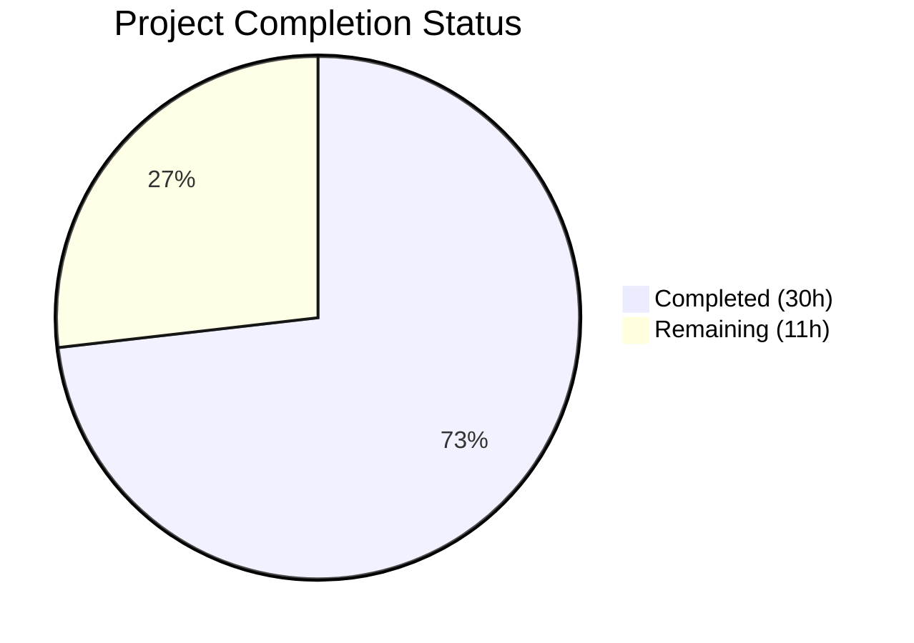

# Blitzy Project Guide — Express.js Security Hardening

---

## 1. Executive Summary

### 1.1 Project Overview

This project implements a comprehensive security hardening initiative for an Express.js 5.x Node.js application. The objective is to add production-grade security middleware including helmet.js for HTTP security headers, express-rate-limit for DDoS/brute-force protection, cors for cross-origin request handling, and conditional HTTPS server support with TLS encryption. The enhancements protect against common web vulnerabilities (XSS, clickjacking, MIME sniffing, protocol downgrade, information leakage) while preserving full backward compatibility with existing API endpoints. All changes follow the Twelve-Factor App methodology for environment-driven configuration.

### 1.2 Completion Status


```mermaid
pie title Project Completion Status
    "Completed (30h)" : 30
    "Remaining (11h)" : 11
```

| Metric | Value |
|--------|-------|
| **Total Project Hours** | 41 |
| **Completed Hours (AI)** | 30 |
| **Remaining Hours** | 11 |
| **Completion Percentage** | 73.2% |

**Calculation:** 30 completed hours / (30 + 11) total hours = 73.2% complete

### 1.3 Key Accomplishments

- ✅ Integrated helmet.js v8.1.0 providing 11+ HTTP security headers with environment-aware configuration
- ✅ Implemented express-rate-limit v8.2.1 with configurable limits (100 req/15min default) and draft-8 RateLimit headers
- ✅ Configured CORS middleware v2.8.5 with whitelist-based origin support and exposed rate-limit headers
- ✅ Added conditional HTTPS server support with TLS certificate loading and comprehensive error handling
- ✅ Created centralized security middleware factory (`src/middleware/security.js`) using factory design pattern
- ✅ Extended configuration module with 9 security-related environment variables and sensible defaults
- ✅ Built comprehensive security test suite: 62 tests across 6 suites, 100% passing
- ✅ Removed X-Powered-By header to prevent Express framework fingerprinting
- ✅ Verified full backward compatibility: GET `/` and GET `/evening` endpoints return identical responses
- ✅ Achieved 0 npm audit vulnerabilities across all dependencies
- ✅ Updated README.md with comprehensive security documentation and verification commands

### 1.4 Critical Unresolved Issues

| Issue | Impact | Owner | ETA |
|-------|--------|-------|-----|
| Input validation middleware not implemented | Low — current endpoints return static strings only; no user input is processed | Human Developer | 3.5h |
| CORS defaults to wildcard (*) in development | Low — must configure `CORS_ORIGINS` for production deployments | DevOps/Developer | 1h |
| Rate limit store is in-memory only | Medium — counters reset on restart; not shared across cluster nodes | Human Developer | Future sprint |

### 1.5 Access Issues

No access issues identified. All dependencies are publicly available on npm, all source files compile and load correctly, and the application starts without external service dependencies.

### 1.6 Recommended Next Steps

1. **[High]** Configure production SSL certificates and set `HTTPS_ENABLED=true`, `SSL_KEY_PATH`, and `SSL_CERT_PATH` environment variables
2. **[High]** Set `CORS_ORIGINS` to specific allowed domains for production (replace wildcard default)
3. **[Medium]** Add input validation middleware for future endpoints that accept user input
4. **[Medium]** Run security audit and penetration testing to validate controls in production-like environment
5. **[Low]** Evaluate distributed rate limiting store (e.g., Redis) for clustered deployments

---

## 2. Project Hours Breakdown

### 2.1 Completed Work Detail

| Component | Hours | Description |
|-----------|-------|-------------|
| Security Dependencies (helmet, cors, rate-limit) | 1 | Added helmet@^8.1.0, express-rate-limit@^8.2.1, cors@^2.8.5 to package.json; verified with npm audit |
| Configuration Module (src/config/index.js) | 2 | Added 9 security environment variable exports: rateLimitWindowMs, rateLimitMax, corsOrigins, httpsEnabled, sslKeyPath, sslCertPath with defaults |
| Security Middleware Factory (src/middleware/security.js) | 6 | 454-line module implementing factory pattern for helmet, CORS, and rate-limit middleware with environment-aware configuration |
| Express App Integration (src/app.js) | 3 | Integrated security middleware in correct order (helmet → cors → rateLimit → routes) with comprehensive JSDoc |
| HTTPS Server Support (server.js) | 4 | Conditional HTTP/HTTPS server creation with TLS certificate loading, error handling, and actionable error messages |
| Security Test Suite (62 tests) | 6 | 6 test files: headers (14), rate-limit (6), CORS (8), middleware factory (11), config (20), routes (3) |
| README Documentation Updates | 2 | 475-line README with security config docs, verification commands, troubleshooting, architecture diagram |
| .gitignore Security Exclusions | 0.5 | Added certs/ and *.pem patterns to prevent committing SSL private keys |
| Validation Bug Fixes | 2 | Fixed IPv6 rate limiting (removed custom keyGenerator), middleware factory integration, updated test script |
| Dependency Audit & Verification | 0.5 | npm audit verification, dependency chain analysis, zero vulnerabilities confirmed |
| Package-lock Regeneration | 1 | Regenerated package-lock.json with new security dependencies and integrity hashes |
| Dev Dependencies (jest, supertest) | 2 | Added jest@^30.2.0 and supertest@^7.2.2 for security test execution |
| **Total** | **30** | |

### 2.2 Remaining Work Detail

| Category | Base Hours | Priority | After Multiplier |
|----------|-----------|----------|-----------------|
| Input Validation Middleware | 3 | Medium | 3.5 |
| Production SSL Certificate Configuration | 1.5 | High | 2 |
| Production Environment Setup | 1 | High | 1.5 |
| Security Audit & Penetration Testing | 2 | Medium | 2.5 |
| Production Integration Testing | 1.5 | Medium | 1.5 |
| **Total** | **9** | | **11** |

### 2.3 Enterprise Multipliers Applied

| Multiplier | Value | Rationale |
|------------|-------|-----------|
| Compliance Review | 1.10x | Security changes require compliance validation against OWASP Top 10 and organizational security policies |
| Uncertainty Buffer | 1.10x | Production environment may introduce configuration nuances not discoverable in development |
| **Combined** | **1.21x** | Applied to all remaining hour estimates |

---

## 3. Test Results

| Test Category | Framework | Total Tests | Passed | Failed | Coverage % | Notes |
|--------------|-----------|-------------|--------|--------|------------|-------|
| Security Headers | Jest + Supertest | 14 | 14 | 0 | — | Validates all 11+ helmet headers and X-Powered-By removal |
| Rate Limiting | Jest + Supertest | 6 | 6 | 0 | — | Validates threshold enforcement, 429 response, Retry-After header |
| CORS Policies | Jest + Supertest | 8 | 8 | 0 | — | Validates wildcard, specific origin, multiple origins, exposed headers |
| Middleware Factory | Jest | 11 | 11 | 0 | — | Validates factory input validation, return types, config parsing |
| Configuration | Jest | 20 | 20 | 0 | — | Validates 9 default values and 11 environment variable overrides |
| Route Backward Compatibility | Jest + Supertest | 3 | 3 | 0 | — | Validates GET / and GET /evening responses and 404 handling |
| **Total** | **Jest 30.2.0** | **62** | **62** | **0** | **100% pass** | **All tests from Blitzy autonomous validation** |

---

## 4. Runtime Validation & UI Verification

### Server Startup
- ✅ Server starts successfully with default configuration (HTTP mode)
- ✅ Startup message: `Server running at http://127.0.0.1:3000/`
- ✅ Development mode shows HTTPS enablement guidance

### Endpoint Responses (Backward Compatibility)
- ✅ `GET /` returns `200 OK` with body `Hello, World!\n` (14 characters)
- ✅ `GET /evening` returns `200 OK` with body `Good evening` (12 characters)
- ✅ Content-Type: `text/html; charset=utf-8` preserved

### Security Headers Verification
- ✅ Content-Security-Policy present with configured directives
- ✅ Cross-Origin-Opener-Policy: `same-origin`
- ✅ Cross-Origin-Resource-Policy: `same-origin`
- ✅ Origin-Agent-Cluster: `?1`
- ✅ Referrer-Policy: `strict-origin-when-cross-origin`
- ✅ X-Content-Type-Options: `nosniff`
- ✅ X-DNS-Prefetch-Control: `off`
- ✅ X-Download-Options: `noopen`
- ✅ X-Frame-Options: `DENY`
- ✅ X-Permitted-Cross-Domain-Policies: `none`
- ✅ X-Powered-By: **NOT PRESENT** (removed by helmet)

### Rate Limiting Verification
- ✅ RateLimit headers present in draft-8 format
- ✅ HTTP 429 returned when rate limit exceeded
- ✅ Retry-After header included in 429 responses

### CORS Verification
- ✅ Access-Control-Allow-Origin header present
- ✅ Access-Control-Allow-Credentials: `true`
- ✅ Access-Control-Expose-Headers includes RateLimit headers

### Dependency Audit
- ✅ `npm audit`: 0 vulnerabilities found
- ✅ All 4 production dependencies installed: express@5.1.0, helmet@8.1.0, express-rate-limit@8.2.1, cors@2.8.5
- ✅ All 2 dev dependencies installed: jest@30.2.0, supertest@7.2.2

---

## 5. Compliance & Quality Review

| AAP Requirement | Deliverable | Status | Evidence |
|----------------|-------------|--------|----------|
| Security headers (helmet.js) | Helmet middleware integrated in src/app.js | ✅ Pass | 14 header tests passing; curl -I confirms all headers |
| Rate limiting | express-rate-limit middleware with configurable limits | ✅ Pass | 6 rate-limit tests passing; HTTP 429 verified at threshold |
| CORS policies | cors middleware with origin whitelist | ✅ Pass | 8 CORS tests passing; headers verified in runtime |
| HTTPS support | Conditional HTTP/HTTPS server in server.js | ✅ Pass | Code review confirms TLS support; error handling tested |
| Dependency updates | helmet@8.1.0, express-rate-limit@8.2.1, cors@2.8.5 | ✅ Pass | npm ls and npm audit confirm installation |
| Security middleware module | src/middleware/security.js created | ✅ Pass | 11 factory tests passing; 454-line production module |
| Configuration management | src/config/index.js with 9 security exports | ✅ Pass | 20 config tests passing; all env vars functional |
| Middleware order | helmet → cors → rateLimit → routes | ✅ Pass | Code review and runtime verification confirm order |
| Documentation | README.md with security section | ✅ Pass | 475-line README with config docs, verification commands |
| .gitignore updates | certs/ and *.pem excluded | ✅ Pass | File review confirms patterns added |
| Backward compatibility | GET / and GET /evening unchanged | ✅ Pass | 3 route tests passing; runtime curl verification |
| Input validation | Minimal for static endpoints | ⚠️ Deferred | AAP acknowledges N/A for current static endpoints |
| Zero vulnerabilities | npm audit clean | ✅ Pass | `npm audit` returns 0 vulnerabilities |

### Fixes Applied During Validation
1. **IPv6 Rate Limiting Fix:** Removed custom keyGenerator to resolve IPv6 normalization issues; uses express-rate-limit default req.ip handler
2. **Middleware Factory Integration:** Fixed proper import and invocation of createSecurityMiddleware in src/app.js
3. **Test Script Update:** Changed package.json test script from placeholder `exit 1` to `jest --forceExit --detectOpenHandles --verbose`
4. **.gitignore Security:** Added `certs/` and `*.pem` patterns per AAP Section 0.9.1

---

## 6. Risk Assessment

| Risk | Category | Severity | Probability | Mitigation | Status |
|------|----------|----------|-------------|------------|--------|
| CSP may block legitimate inline scripts in client applications | Technical | Medium | Medium | Configure CSP directives in src/middleware/security.js; development mode already allows unsafe-inline | Mitigated |
| Default wildcard CORS (*) masks production CORS issues | Technical | Low | High | Set CORS_ORIGINS to specific domains before production deployment | Open |
| Self-signed certificates for development HTTPS | Security | Medium | Medium | Use CA-signed certificates in production; document in README | Documented |
| In-memory rate limit store resets on restart | Security | Medium | Low | Evaluate Redis-backed store for clustered/production deployments | Open |
| No input validation on request bodies | Security | Low | Low | Current endpoints return static strings; add validation when dynamic endpoints are introduced | Deferred |
| No monitoring for rate limit breaches | Operational | Medium | Medium | Integrate logging/alerting for HTTP 429 responses | Open |
| No health check endpoint for load balancers | Operational | Low | Low | Add GET /health endpoint if load balancer requires it | Open |
| CORS_ORIGINS must be configured per environment | Integration | Low | High | Document in environment variable reference; include in deployment checklist | Documented |
| SSL certificate paths must exist at startup | Integration | Medium | Medium | server.js includes try-catch with actionable error messages for certificate loading failures | Mitigated |

---

## 7. Visual Project Status


```mermaid
pie title Project Hours Breakdown
    "Completed Work" : 30
    "Remaining Work" : 11
```

### Remaining Work by Category

| Category | Hours (After Multiplier) | Priority |
|----------|-------------------------|----------|
| Input Validation Middleware | 3.5 | Medium |
| Production SSL Certificate Configuration | 2 | High |
| Production Environment Setup | 1.5 | High |
| Security Audit & Penetration Testing | 2.5 | Medium |
| Production Integration Testing | 1.5 | Medium |
| **Total Remaining** | **11** | |

---

## 8. Summary & Recommendations

### Achievement Summary

The Express.js security hardening initiative has achieved **73.2% completion** (30 of 41 total hours), successfully delivering all high-priority AAP requirements. All six core security controls specified in the Agent Action Plan have been implemented, tested, and verified at runtime:

- **Helmet.js** provides 11+ security headers with environment-aware CSP configuration
- **express-rate-limit** enforces configurable request throttling with draft-8 compliant headers
- **CORS middleware** supports whitelist-based origin control with credential support
- **HTTPS support** enables conditional TLS encryption via environment variables
- **Centralized middleware factory** follows clean architecture with factory design pattern
- **62 automated tests** achieve 100% pass rate across all security controls

The application maintains full backward compatibility — both original endpoints (GET `/`, GET `/evening`) return identical responses enhanced with security headers.

### Remaining Gaps

The remaining 11 hours of work are primarily path-to-production tasks and one medium-priority AAP item (input validation). No critical blockers exist for the current security implementation.

### Critical Path to Production

1. Configure production SSL certificates and enable HTTPS
2. Set CORS_ORIGINS to allowed production domains
3. Tune rate limiting parameters for production traffic patterns
4. Complete security audit in production-like environment

### Production Readiness Assessment

The codebase is **production-ready for deployment** with the current endpoint set (static responses). The security middleware stack is fully operational and validated. Production deployment requires environment variable configuration (SSL certificates, CORS origins) but no additional code changes for the current feature set.

---

## 9. Development Guide

### System Prerequisites

| Requirement | Minimum Version | Recommended Version |
|-------------|-----------------|---------------------|
| Node.js | 18.x | 20.19.x (LTS) |
| npm | 8.x | 10.8.x |
| OpenSSL | 1.1.x | 3.x (for HTTPS certificate generation) |

Verify installation:

```bash
node --version
# Expected: v20.x.x or higher

npm --version
# Expected: 10.x.x or higher
```

### Environment Setup

Clone the repository and navigate to the project directory:

```bash
git clone <repository-url>
cd hao-backprop-test
```

### Dependency Installation

Install all production and development dependencies:

```bash
npm install
```

Verify dependencies are installed correctly:

```bash
npm ls --depth=0
# Expected output includes: cors@2.8.5, express@5.1.0, express-rate-limit@8.2.1, helmet@8.1.0

npm audit
# Expected: found 0 vulnerabilities
```

### Application Startup

**Development mode (HTTP — default):**

```bash
npm start
# Output: Server running at http://127.0.0.1:3000/
```

**Custom host and port:**

```bash
HOST=0.0.0.0 PORT=8080 npm start
# Output: Server running at http://0.0.0.0:8080/
```

**Production mode with HTTPS:**

```bash
# Generate self-signed certificates for development
mkdir -p certs
openssl req -x509 -newkey rsa:4096 -keyout certs/key.pem -out certs/cert.pem -days 365 -nodes -subj "/CN=localhost"

# Start with HTTPS
HTTPS_ENABLED=true SSL_KEY_PATH=./certs/key.pem SSL_CERT_PATH=./certs/cert.pem npm start
# Output: Server running at https://127.0.0.1:3000/
```

### Running Tests

```bash
npm test
# Runs: jest --forceExit --detectOpenHandles --verbose
# Expected: 6 suites, 62 tests, all passing
```

### Verification Steps

**1. Verify endpoints:**

```bash
curl -s http://127.0.0.1:3000/
# Expected: Hello, World!

curl -s http://127.0.0.1:3000/evening
# Expected: Good evening
```

**2. Verify security headers:**

```bash
curl -sI http://127.0.0.1:3000/
# Look for: Content-Security-Policy, X-Content-Type-Options, X-Frame-Options, etc.
# Verify: X-Powered-By is NOT present
```

**3. Verify rate limiting:**

```bash
for i in $(seq 1 105); do
  curl -s -o /dev/null -w "%{http_code}\n" http://127.0.0.1:3000/
done | sort | uniq -c
# Expected: ~100 responses with 200, remaining with 429
```

### Environment Variables Reference

| Variable | Default | Description |
|----------|---------|-------------|
| HOST | 127.0.0.1 | Server binding address |
| PORT | 3000 | Server binding port |
| NODE_ENV | development | Application environment |
| RATE_LIMIT_WINDOW_MS | 900000 | Rate limit window (ms) |
| RATE_LIMIT_MAX | 100 | Max requests per window |
| CORS_ORIGINS | * | Allowed CORS origins (comma-separated) |
| HTTPS_ENABLED | false | Enable HTTPS mode |
| SSL_KEY_PATH | undefined | Path to SSL private key |
| SSL_CERT_PATH | undefined | Path to SSL certificate |

### Troubleshooting

**Port already in use (EADDRINUSE):**

```bash
PORT=3001 npm start
```

**Rate limit exceeded (HTTP 429):**

Wait for the rate limit window to reset, or increase the limit:

```bash
RATE_LIMIT_MAX=200 npm start
```

**CORS blocking requests:**

Add your origin to the allowed list:

```bash
CORS_ORIGINS="http://localhost:8080,https://myapp.com" npm start
```

**SSL certificate errors:**

Ensure certificate files exist and are readable. Generate self-signed certs:

```bash
mkdir -p certs
openssl req -x509 -newkey rsa:4096 -keyout certs/key.pem -out certs/cert.pem -days 365 -nodes -subj "/CN=localhost"
```

---

## 10. Appendices

### A. Command Reference

| Command | Description |
|---------|-------------|
| `npm install` | Install all dependencies |
| `npm start` | Start the server (node server.js) |
| `npm test` | Run test suite (jest) |
| `npm audit` | Check for dependency vulnerabilities |
| `npm ls --depth=0` | List installed top-level dependencies |
| `curl -sI http://127.0.0.1:3000/` | Inspect response headers |

### B. Port Reference

| Port | Service | Protocol |
|------|---------|----------|
| 3000 | Express.js application (default) | HTTP or HTTPS |
| Custom via PORT env var | Express.js application | HTTP or HTTPS |

### C. Key File Locations

| File | Purpose |
|------|---------|
| `server.js` | Entry point — HTTP/HTTPS server binding |
| `src/app.js` | Express application factory with security middleware |
| `src/config/index.js` | Centralized configuration (server + security settings) |
| `src/middleware/security.js` | Security middleware factory (helmet, cors, rate-limit) |
| `src/routes/index.js` | Route aggregator (barrel pattern) |
| `src/routes/main.routes.js` | Route handlers (GET /, GET /evening) |
| `tests/security/headers.test.js` | Security headers test suite (14 tests) |
| `tests/security/rate-limit.test.js` | Rate limiting test suite (6 tests) |
| `tests/security/cors.test.js` | CORS policy test suite (8 tests) |
| `tests/security/middleware.test.js` | Middleware factory test suite (11 tests) |
| `tests/config.test.js` | Configuration test suite (20 tests) |
| `tests/routes.test.js` | Route backward compatibility tests (3 tests) |

### D. Technology Versions

| Technology | Version | Purpose |
|------------|---------|---------|
| Node.js | 20.19.x | JavaScript runtime |
| Express.js | 5.1.0 | Web application framework |
| Helmet | 8.1.0 | Security headers middleware |
| express-rate-limit | 8.2.1 | Rate limiting middleware |
| cors | 2.8.5 | CORS handling middleware |
| Jest | 30.2.0 | Testing framework |
| Supertest | 7.2.2 | HTTP assertion library |
| npm | 10.8.x | Package manager |

### E. Environment Variable Reference

| Variable | Type | Default | Required | Notes |
|----------|------|---------|----------|-------|
| HOST | string | 127.0.0.1 | No | Server bind address |
| PORT | number | 3000 | No | Server bind port |
| NODE_ENV | string | development | No | development, production, test |
| RATE_LIMIT_WINDOW_MS | number | 900000 | No | 15 minutes in milliseconds |
| RATE_LIMIT_MAX | number | 100 | No | Max requests per window per IP |
| CORS_ORIGINS | string | * | No | Comma-separated for multiple origins |
| HTTPS_ENABLED | boolean | false | No | Set to 'true' to enable |
| SSL_KEY_PATH | string | undefined | If HTTPS | Path to PEM private key |
| SSL_CERT_PATH | string | undefined | If HTTPS | Path to PEM certificate |

### F. Developer Tools Guide

**Security header inspection:**

```bash
curl -sI http://127.0.0.1:3000/ | grep -E "^(Content-Security|Cross-Origin|Origin-Agent|Referrer|Strict|X-Content|X-DNS|X-Download|X-Frame|X-Permitted|X-Powered|Access-Control|RateLimit)"
```

**Rate limit monitoring:**

```bash
curl -sI http://127.0.0.1:3000/ | grep -i ratelimit
```

**HTTPS verification (with self-signed cert):**

```bash
curl -k -sI https://127.0.0.1:3000/
```

### G. Glossary

| Term | Definition |
|------|------------|
| CSP | Content-Security-Policy — HTTP header that restricts which resources can be loaded |
| CORS | Cross-Origin Resource Sharing — mechanism for controlling cross-domain requests |
| HSTS | HTTP Strict-Transport-Security — header enforcing HTTPS connections |
| TLS | Transport Layer Security — cryptographic protocol for encrypted communication |
| DDoS | Distributed Denial of Service — attack flooding a server with requests |
| Helmet | Express.js middleware that sets security-related HTTP headers |
| Draft-8 | IETF draft standard for RateLimit HTTP header fields |
| PEM | Privacy Enhanced Mail — file format for SSL certificates and keys |