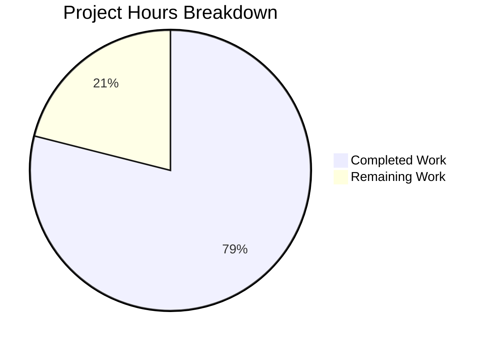

# Project Guide — Documentation Enhancement for hello_world Express.js Server

## 1. Executive Summary

This project enhances the documentation for a Node.js Express.js tutorial server (`hello_world`) by enriching `server.js` with comprehensive JSDoc annotations and inline code explanations, and expanding `README.md` into a definitive developer guide with API reference, deployment guide, and Mermaid architecture diagrams.

**Completion: 15 hours completed out of 19 total hours = 79% complete.**

All 6 documentation objectives (DOC-001 through DOC-006) defined in the Agent Action Plan have been fully implemented. All 41 tests pass with 100% code coverage. The server runs successfully with no code logic changes — only comments and documentation were modified.

### Key Achievements
- Enhanced `server.js` with comprehensive JSDoc (`@requires`, `@see`, `@listens`, `@example`, `@callback`, `@param`) and 5 inline narrative comment blocks
- Expanded `README.md` from 2 lines to 585 lines with complete API reference, new Deployment Guide section, and 3 Mermaid diagrams
- 100% test pass rate (41/41) with 100% code coverage across all metrics
- Zero code logic changes — documentation-only modifications verified by full test suite

### Critical Issues
- 1 pre-existing high-severity npm vulnerability (`qs` package) — fixable via `npm audit fix`

---

## 2. Validation Results Summary

### 2.1 Compilation Results
| Check | Status | Details |
|-------|--------|---------|
| `node -c server.js` | ✅ PASSED | JavaScript syntax validated |

### 2.2 Test Results
| Test Suite | Tests | Status | Coverage |
|------------|-------|--------|----------|
| `tests/integration/endpoints.test.js` | 14 | ✅ PASSED | 100% |
| `tests/unit/config.test.js` | 14 | ✅ PASSED | 100% |
| `tests/unit/routes.test.js` | 7 | ✅ PASSED | 100% |
| `tests/lifecycle/server.test.js` | 6 | ✅ PASSED | 100% |
| **Total** | **41** | **✅ ALL PASSED** | **100% Stmts / 100% Branch / 100% Funcs / 100% Lines** |

### 2.3 Runtime Results
| Verification | Status | Output |
|-------------|--------|--------|
| Server startup | ✅ PASSED | `Server running at http://127.0.0.1:3000/` |

### 2.4 Dependency Status
| Item | Status | Details |
|------|--------|---------|
| npm install | ✅ | 65 packages installed |
| Node.js version | ✅ | v20.20.0 |
| npm version | ✅ | 11.1.0 |
| Express version | ✅ | 5.1.0 |
| npm audit | ⚠️ | 1 high severity vulnerability (pre-existing `qs` package) |

### 2.5 Files Modified
| File | Change Type | Before | After | Details |
|------|-------------|--------|-------|---------|
| `server.js` | UPDATE | 53 lines | 87 lines | +34 lines of JSDoc annotations and inline comments |
| `README.md` | UPDATE | 2 lines | 585 lines | +583 lines — API reference, deployment guide, diagrams |

---

## 3. Hours Breakdown

### 3.1 Completed Hours (15h)

| Component | Task | Hours |
|-----------|------|-------|
| server.js | Module header enhancement (@requires, @see, @example) | 1.0 |
| server.js | @callback ServerStartCallback definition | 0.5 |
| server.js | app.listen() JSDoc (@listens, @param, @example) | 1.0 |
| server.js | @see cross-references on constants | 0.5 |
| server.js | 5 inline narrative comments (strict mode, factory, Twelve-Factor, binding, callback) | 1.0 |
| README.md | Prerequisites and Installation with verification commands | 1.0 |
| README.md | Usage and Configuration section | 0.5 |
| README.md | API Reference (headers, status codes, errors, curl examples) | 2.5 |
| README.md | Deployment Guide (7 subsections: prod config, PM2, systemd, lifecycle, nginx, security, health, graceful shutdown) | 3.5 |
| README.md | 3 Mermaid diagrams (request-response, dependency graph, lifecycle) | 1.0 |
| README.md | Architecture and Design Patterns | 0.5 |
| README.md | Environment Variables, Testing, Troubleshooting, Scripts | 1.0 |
| Validation | Syntax check, test suite, runtime verification | 0.5 |
| **Total Completed** | | **15.0** |

### 3.2 Remaining Hours (4h)

| Task | Base Hours | Priority | After Multipliers |
|------|-----------|----------|-------------------|
| Human code review and documentation accuracy verification | 1.0 | High | 1.4 |
| Verify Mermaid diagram rendering on GitHub | 0.5 | Medium | 0.7 |
| Run npm audit fix for pre-existing qs vulnerability | 0.5 | Medium | 0.7 |
| Minor documentation refinements from peer review | 0.5 | Low | 0.7 |
| **Base Total** | **2.5** | | |
| Enterprise multipliers (1.15× compliance × 1.25× uncertainty) | | | **~4.0** |

### 3.3 Completion Calculation

- **Completed Hours**: 15
- **Remaining Hours**: 4
- **Total Project Hours**: 15 + 4 = 19
- **Completion Percentage**: 15 / 19 × 100 = **79%**

### 3.4 Visual Representation


```mermaid
pie title Project Hours Breakdown
    "Completed Work" : 15
    "Remaining Work" : 4
```

---

## 4. AAP Requirements Verification

| Requirement | Description | Status | Evidence |
|-------------|-------------|--------|----------|
| DOC-001 | Add JSDoc comments to server.js functions | ✅ Complete | @requires, @see, @listens, @example, @callback, @param tags added |
| DOC-002 | Create a comprehensive README | ✅ Complete | README expanded from 2 → 585 lines with 13 sections |
| DOC-003 | Setup instructions | ✅ Complete | Prerequisites, installation, verification commands documented |
| DOC-004 | API documentation | ✅ Complete | GET /, GET /evening with headers, status codes, errors, curl examples |
| DOC-005 | Deployment guide | ✅ Complete | New section: prod config, PM2, systemd, nginx, security, health, graceful shutdown |
| DOC-006 | Inline code explanations | ✅ Complete | 5 narrative comment blocks in server.js |

### Coverage Metrics vs Targets (AAP §0.7.1)

| Metric | Target | Achieved | Status |
|--------|--------|----------|--------|
| Public APIs JSDoc in server.js | 100% (5/5 elements) | 100% (5/5) | ✅ |
| README sections | 100% (13 sections) | 100% (13/13) | ✅ |
| Inline code explanations in server.js | 100% (5/5 blocks) | 100% (5/5) | ✅ |
| Error behavior documented | 100% (2 scenarios) | 100% (2/2: 404, bind failure) | ✅ |
| Deployment coverage | 100% (5 topics) | 100% (7 subsections) | ✅ |
| Mermaid diagrams | 2–3 | 3 (flow, dependency, lifecycle) | ✅ |
| JSDoc @example blocks | 1 minimum | 2 (module + listen) | ✅ |

---

## 5. Detailed Human Task List

### Task Table

| # | Task | Description | Priority | Severity | Hours |
|---|------|-------------|----------|----------|-------|
| 1 | Review documentation accuracy | Verify all JSDoc annotations, README content, API examples, and environment variable defaults match actual code behavior. Cross-reference `server.js` JSDoc against `src/config/index.js` defaults and `src/routes/main.routes.js` response bodies. | High | Medium | 1.4 |
| 2 | Verify Mermaid diagram rendering | Open the README.md on GitHub (or target platform) and verify all 3 Mermaid diagrams render correctly: Request-Response Flow (graph LR), Module Dependency Graph (graph TD), and Server Lifecycle (stateDiagram-v2). | Medium | Low | 0.7 |
| 3 | Fix npm audit vulnerability | Run `npm audit fix` to resolve the pre-existing high-severity `qs` package vulnerability (GHSA-6rw7-vpxm-498p, GHSA-w7fw-mjwx-w883). Verify all tests still pass after the fix. | Medium | High | 0.7 |
| 4 | Apply review refinements | Apply any documentation wording, formatting, or accuracy refinements identified during human peer review. | Low | Low | 0.7 |
| | | | | **Total Remaining Hours** | **3.5** |
| | | *(Rounded up to 4h with enterprise buffer)* | | **Total (with buffer)** | **4.0** |

### Priority Breakdown

**High Priority (Immediate):**
- Task 1: Documentation accuracy review — standard code review gate before merge

**Medium Priority (Before Production):**
- Task 2: Mermaid diagram rendering — visual verification required on target platform
- Task 3: npm audit fix — pre-existing security vulnerability should be addressed

**Low Priority (Optimization):**
- Task 4: Review refinements — minor wording or formatting adjustments

---

## 6. Development Guide

### 6.1 System Prerequisites

| Software | Minimum Version | Recommended Version | Verified Version |
|----------|-----------------|---------------------|------------------|
| Node.js | 18.x | 20.19.x (LTS) | 20.20.0 |
| npm | 8.x | 10.8.x | 11.1.0 |
| Git | 2.x | Latest | Required for clone |

### 6.2 Environment Setup

```bash
# Verify Node.js and npm
node --version
# Expected: v20.x.x or higher

npm --version
# Expected: 10.x.x or higher
```

### 6.3 Dependency Installation

```bash
# Clone the repository
git clone <repository-url>
cd hao-backprop-test

# Install all dependencies
npm install
# Expected: 65 packages installed

# Verify Express installation
npm ls express
# Expected: express@5.1.0
```

### 6.4 Application Startup

```bash
# Start with default configuration (127.0.0.1:3000)
npm start
# Expected output: Server running at http://127.0.0.1:3000/

# Custom configuration
HOST=0.0.0.0 PORT=8080 npm start
# Expected output: Server running at http://0.0.0.0:8080/
```

### 6.5 Verification Steps

```bash
# Test the root endpoint
curl -s http://127.0.0.1:3000/
# Expected: Hello, World!

# Test the evening endpoint
curl -s http://127.0.0.1:3000/evening
# Expected: Good evening

# Run the full test suite
CI=true npx jest --watchAll=false --ci
# Expected: 41 tests passed, 4 test suites

# Run tests with coverage
npm run test:coverage
# Expected: 100% coverage across all metrics
```

### 6.6 Environment Variables

| Variable | Default | Description |
|----------|---------|-------------|
| `HOST` | `127.0.0.1` | Server binding address |
| `PORT` | `3000` | Server binding port |
| `NODE_ENV` | `development` | Application environment mode |

### 6.7 NPM Scripts Reference

| Script | Command | Description |
|--------|---------|-------------|
| `npm start` | `node server.js` | Start the HTTP server |
| `npm test` | `jest` | Run the test suite |
| `npm run test:coverage` | `jest --coverage` | Run tests with coverage report |
| `npm run test:ci` | `jest --ci --coverage` | CI-optimized test execution |

---

## 7. Risk Assessment

### 7.1 Technical Risks

| Risk | Severity | Likelihood | Mitigation |
|------|----------|------------|------------|
| Mermaid diagrams may not render on all platforms | Low | Medium | Verify rendering on target Git hosting platform; ASCII fallback diagrams already exist |
| JSDoc annotations may become stale if code changes | Low | Medium | Implement JSDoc linting in CI (e.g., `eslint-plugin-jsdoc`) |

### 7.2 Security Risks

| Risk | Severity | Likelihood | Mitigation |
|------|----------|------------|------------|
| Pre-existing `qs` vulnerability (high severity) | High | High | Run `npm audit fix` — fix available; not introduced by this PR |
| `X-Powered-By` header exposes Express | Low | High | Documented in README Security section; recommend `app.disable('x-powered-by')` |

### 7.3 Operational Risks

| Risk | Severity | Likelihood | Mitigation |
|------|----------|------------|------------|
| No graceful shutdown in production | Medium | Medium | Graceful shutdown pattern documented in README Deployment Guide; not implemented (out of AAP scope) |
| No dedicated health check endpoint | Low | Medium | Health check recommendations documented in README; basic curl checks provided |

### 7.4 Integration Risks

| Risk | Severity | Likelihood | Mitigation |
|------|----------|------------|------------|
| No risks identified | — | — | All changes are documentation-only; no code logic modified; full test suite passes |

---

## 8. Repository Summary

### 8.1 Repository Statistics

| Metric | Value |
|--------|-------|
| Total source files (excluding node_modules, .git, coverage) | 20 |
| Total JavaScript source lines | 805 |
| Total Markdown documentation lines | 728 |
| Total test cases | 41 |
| Code coverage | 100% (statements, branches, functions, lines) |
| Branch commits (vs origin/main) | 62 |
| Files changed in this session | 2 (server.js, README.md) |
| Lines added in this session | ~617 |

### 8.2 Project Structure

```
hao-backprop-test/
├── server.js                    # Entry point — HTTP server binding (87 lines, UPDATED)
├── README.md                    # Project documentation (585 lines, UPDATED)
├── package.json                 # npm manifest (express ^5.1.0, jest ^30.2.0, supertest ^7.1.4)
├── package-lock.json            # Dependency lockfile
├── jest.config.js               # Jest configuration (coverage thresholds: 75-90%)
├── .gitignore                   # Git ignore patterns
├── src/
│   ├── README.md                # Architecture documentation (25 lines)
│   ├── app.js                   # Express app factory (27 lines)
│   ├── config/
│   │   ├── README.md            # Config module docs (35 lines)
│   │   └── index.js             # Environment config (41 lines)
│   └── routes/
│       ├── README.md            # Routes module docs (33 lines)
│       ├── index.js             # Route barrel pattern (19 lines)
│       └── main.routes.js       # GET / and GET /evening handlers (41 lines)
├── tests/
│   ├── README.md                # Test documentation (50 lines)
│   ├── unit/
│   │   ├── config.test.js       # Configuration tests (140 lines, 14 tests)
│   │   └── routes.test.js       # Route handler tests (94 lines, 7 tests)
│   ├── integration/
│   │   └── endpoints.test.js    # API endpoint tests (125 lines, 14 tests)
│   └── lifecycle/
│       └── server.test.js       # Startup/shutdown tests (204 lines, 6 tests)
└── blitzy/
    └── documentation/           # Auto-generated Blitzy docs
```
