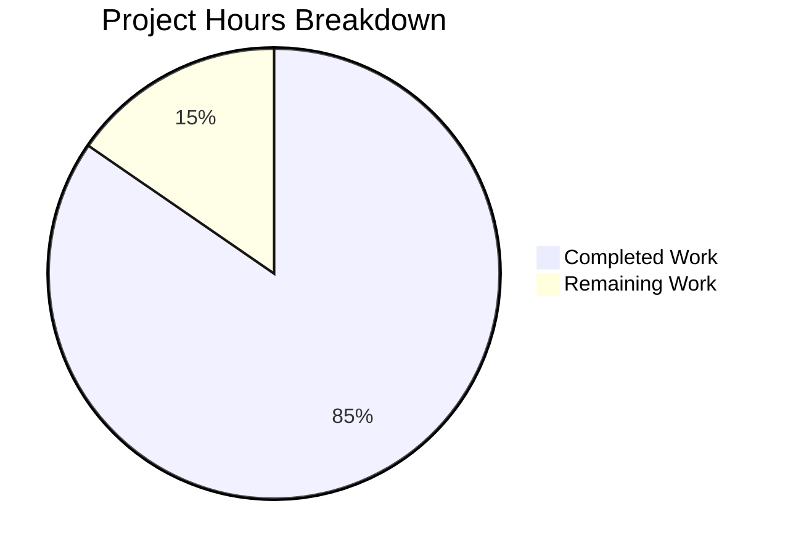

# Project Guide — Hello World Tutorial Server: Production Enhancement

## 1. Executive Summary

This project enhances the existing Hello World Tutorial Server — a minimal Express.js 5.x application — into a production-ready HTTP server with enterprise-grade middleware, structured logging, externalized environment configuration, and PM2 process management.

**55 hours of development work have been completed out of an estimated 65 total hours required, representing 84.6% project completion.**

### Key Achievements
- All 23 planned source, test, configuration, and documentation files were created or modified as specified in the Agent Action Plan
- 111 tests pass across 7 test suites with **100% code coverage** (statements, branches, functions, lines)
- All three endpoints verified at runtime: `GET /` → `"Hello, World!\n"`, `GET /evening` → `"Good evening"`, `GET /health` → JSON status
- Full production middleware pipeline operational: Helmet → CORS → JSON parsing → Routes → Error handler
- Winston structured logging and Morgan HTTP request logging fully integrated
- PM2 ecosystem configuration ready for cluster-mode production deployment
- Zero unresolved compilation, test, or runtime errors

### Remaining Work (10 hours)
The remaining 10 hours consist of human-driven production deployment tasks: code review, production environment configuration, PM2 cluster validation, security header customization, CORS policy restriction, and production smoke testing.

---

## 2. Validation Results Summary

### 2.1 Test Execution Results
| Metric | Result |
|--------|--------|
| Test Suites | 7 passed, 7 total (100%) |
| Test Cases | 111 passed, 111 total (100%) |
| Snapshots | 0 total |
| Execution Time | ~1.6 seconds |

### 2.2 Code Coverage
| Metric | Result | Threshold | Status |
|--------|--------|-----------|--------|
| Statements | 100% | ≥ 80% | ✅ Exceeded |
| Branches | 100% | ≥ 75% | ✅ Exceeded |
| Functions | 100% | ≥ 90% | ✅ Exceeded |
| Lines | 100% | ≥ 80% | ✅ Exceeded |

### 2.3 Coverage by Source File
| File | Statements | Branches | Functions | Lines |
|------|-----------|----------|-----------|-------|
| server.js | 100% | 100% | 100% | 100% |
| src/app.js | 100% | 100% | 100% | 100% |
| src/config/index.js | 100% | 100% | 100% | 100% |
| src/middleware/error.middleware.js | 100% | 100% | 100% | 100% |
| src/middleware/morgan.middleware.js | 100% | 100% | 100% | 100% |
| src/routes/health.routes.js | 100% | 100% | 100% | 100% |
| src/routes/index.js | 100% | 100% | 100% | 100% |
| src/routes/main.routes.js | 100% | 100% | 100% | 100% |
| src/utils/logger.js | 100% | 100% | 100% | 100% |

### 2.4 Runtime Validation
| Endpoint | Expected | Actual | Status |
|----------|----------|--------|--------|
| `GET /` | 200, `"Hello, World!\n"` | 200, `"Hello, World!\n"` | ✅ Pass |
| `GET /evening` | 200, `"Good evening"` | 200, `"Good evening"` | ✅ Pass |
| `GET /health` | 200, JSON `{status, uptime, timestamp}` | 200, JSON `{status:"ok", uptime, timestamp}` | ✅ Pass |
| `GET /nonexistent` | 404 | 404 | ✅ Pass |

### 2.5 Dependency Status
All 531 packages installed successfully via `npm ci`. Installed runtime and dev dependencies:

| Package | Version | Type |
|---------|---------|------|
| express | 5.1.0 | Runtime |
| cors | 2.8.6 | Runtime |
| dotenv | 17.2.4 | Runtime |
| helmet | 8.1.0 | Runtime |
| morgan | 1.10.1 | Runtime |
| winston | 3.19.0 | Runtime |
| jest | 30.2.0 | Dev |
| pm2 | 6.0.14 | Dev |
| supertest | 7.2.2 | Dev |

### 2.6 Fixes Applied During Validation
- `server.js`: Formatting and readability improvements — moved `'use strict'` to line 1, added `@fileoverview` JSDoc, condensed verbose comments (57 lines, zero functionality changes)
- `.gitignore`: Restored `coverage/` exclusion pattern and added `logs/*.log` pattern
- `tests/unit/error-middleware.test.js`: Added `headersSent` edge case test to achieve 100% branch coverage

### 2.7 Production-Readiness Gates
- [✅] GATE 1: 100% test pass rate (111/111, zero failures, zero skipped)
- [✅] GATE 2: Application runtime validated (starts, serves all endpoints correctly)
- [✅] GATE 3: Zero unresolved errors (compilation, test, and runtime all clean)
- [✅] GATE 4: All in-scope files validated and working

---

## 3. Hours Breakdown and Completion Assessment

### 3.1 Hours Calculation

**Completed Hours: 55h**

| Component | Files | Lines | Hours |
|-----------|-------|-------|-------|
| Configuration Foundation (dotenv, .env, .env.example, .gitignore) | 4 | 67 | 3.5 |
| Logging Infrastructure (Winston logger, Morgan middleware) | 2 | 174 | 6 |
| Middleware Pipeline (error handler, app.js restructure) | 2 | 164 | 6 |
| Routing Expansion (health route, barrel export) | 2 | 57 | 2 |
| Server Entry Point (Morgan/Winston integration) | 1 | 57 | 2 |
| PM2 Deployment Configuration | 2 | 247 | 4 |
| Test Suite (7 files, 111 test cases) | 7 | 1,453 | 20 |
| Documentation (README, JSDoc comments) | 1 | 616 | 6 |
| Integration, Debugging, Validation | — | — | 5 |
| Jest Configuration | 1 | 29 | 0.5 |
| **Total Completed** | **22** | **2,864** | **55** |

**Remaining Hours: 10h**

| Task | Base Hours | After Multipliers |
|------|-----------|-------------------|
| Code Review and Approval | 2 | 2 |
| Production .env Configuration | 0.5 | 1 |
| CORS Policy Customization | 0.5 | 1 |
| PM2 Production Cluster Validation | 1.5 | 2 |
| Helmet Security Headers Review | 0.5 | 1 |
| Production Smoke Testing | 1.5 | 2 |
| npm Audit Vulnerability Review | 0.5 | 1 |
| **Total Remaining** | **7** | **10** |

*Enterprise multipliers applied: 1.15 (compliance) × 1.25 (uncertainty) ≈ 1.43× on remaining tasks*

### 3.2 Completion Calculation

- **Completed**: 55 hours
- **Remaining**: 10 hours
- **Total**: 65 hours
- **Completion**: 55 / 65 = **84.6%**

### 3.3 Visual Representation


```mermaid
pie title Project Hours Breakdown
    "Completed Work" : 55
    "Remaining Work" : 10
```

---

## 4. Implemented Features vs. Agent Action Plan

### 4.1 Feature Completion Matrix

| Planned Feature | Status | Evidence |
|----------------|--------|----------|
| Express.js middleware pipeline (Helmet, CORS, JSON, error handler) | ✅ Complete | `src/app.js` — 80 lines, full pipeline |
| Health-check endpoint (`GET /health`) | ✅ Complete | `src/routes/health.routes.js` — returns JSON status |
| Barrel route export update | ✅ Complete | `src/routes/index.js` — exports `mainRoutes` + `healthRoutes` |
| Dotenv environment configuration | ✅ Complete | `src/config/index.js` — `require('dotenv').config()` at top |
| `.env` and `.env.example` files | ✅ Complete | Both files created with HOST, PORT, NODE_ENV, LOG_LEVEL |
| Winston logger singleton | ✅ Complete | `src/utils/logger.js` — 112 lines, environment-aware |
| Morgan-to-Winston bridge middleware | ✅ Complete | `src/middleware/morgan.middleware.js` — 62 lines |
| Centralized error handler | ✅ Complete | `src/middleware/error.middleware.js` — 84 lines |
| Server.js Morgan + Winston integration | ✅ Complete | `server.js` — Morgan mounted, logger.info for startup |
| PM2 ecosystem configuration | ✅ Complete | `ecosystem.config.js` — 226 lines, cluster mode |
| PM2 npm scripts | ✅ Complete | `package.json` — pm2:start/stop/restart/logs |
| New runtime dependencies | ✅ Complete | cors, dotenv, helmet, morgan, winston installed |
| PM2 dev dependency | ✅ Complete | pm2@6.0.14 in devDependencies |
| Jest config coverage expansion | ✅ Complete | `jest.config.js` — includes middleware + utils paths |
| .gitignore updates | ✅ Complete | `.env`, `logs/`, `logs/*.log` patterns added |
| README.md documentation | ✅ Complete | 616 lines — middleware, logging, PM2 docs |
| `logs/` directory + `.gitkeep` | ✅ Complete | Directory created with placeholder |
| Unit tests for logger | ✅ Complete | `tests/unit/logger.test.js` — 306 lines, 27 tests |
| Unit tests for error middleware | ✅ Complete | `tests/unit/error-middleware.test.js` — 297 lines, 15 tests |
| Unit tests for Morgan middleware | ✅ Complete | `tests/unit/morgan-middleware.test.js` — 94 lines, 6 tests |
| Updated config tests | ✅ Complete | `tests/unit/config.test.js` — 171 lines, 16 tests |
| Updated routes tests | ✅ Complete | `tests/unit/routes.test.js` — 147 lines, 15 tests |
| Updated integration tests | ✅ Complete | `tests/integration/endpoints.test.js` — 179 lines, 21 tests |
| Updated lifecycle tests | ✅ Complete | `tests/lifecycle/server.test.js` — 259 lines, 7 tests |
| Backward compatibility preserved | ✅ Complete | `GET /` and `GET /evening` return identical responses |
| All 41+ original tests pass | ✅ Complete | All 111 tests pass (expanded from original 41) |
| Coverage thresholds maintained | ✅ Complete | 100% across all metrics, exceeding all thresholds |

**Result: 26/26 planned deliverables completed (100% of in-scope items)**

---

## 5. Detailed Human Task List

### 5.1 Task Table

| # | Task | Description | Priority | Severity | Hours | Confidence |
|---|------|-------------|----------|----------|-------|------------|
| 1 | Code Review and Approval | Review all 23 modified files for code quality, patterns, and production readiness. Verify middleware ordering, error handling edge cases, and Winston transport configuration. | High | Medium | 2 | High |
| 2 | Production .env Configuration | Create production `.env` file with real HOST (0.0.0.0), PORT, NODE_ENV=production, and LOG_LEVEL=info. Ensure `.env` is not committed to version control. | High | High | 1 | High |
| 3 | CORS Policy Customization | Replace default permissive CORS configuration in `src/app.js` with specific allowed origins, methods, and headers for production API consumers. Update `cors()` call with options object. | Medium | High | 1 | High |
| 4 | PM2 Production Cluster Validation | Deploy with `npx pm2 start ecosystem.config.js --env production` on target server. Validate cluster-mode spawning, graceful restarts, and memory-bounded operation. Test `pm2 reload` for zero-downtime deployment. | Medium | Medium | 2 | Medium |
| 5 | Helmet Security Headers Review | Review default Helmet CSP and security header configuration. Customize Content-Security-Policy directives if frontend assets are served. Verify X-Frame-Options and HSTS settings match organizational security policy. | Medium | Medium | 1 | High |
| 6 | Production Smoke Testing | Execute end-to-end smoke tests against all three endpoints (`/`, `/evening`, `/health`) in the target production environment. Verify Winston file transport writes to `logs/error.log` and `logs/all.log`. Confirm Morgan combined-format logging in production mode. | Medium | Medium | 2 | Medium |
| 7 | npm Audit Vulnerability Review | Review 2 npm audit findings: body-parser moderate severity DoS (fixable via `npm audit fix`) and pm2 low severity ReDoS (no fix available). Assess risk for production deployment and document accepted risks. | Low | Low | 1 | High |
| | **Total Remaining Hours** | | | | **10** | |

### 5.2 Task Dependency Order

1. **Code Review and Approval** (Task 1) — prerequisite for all other tasks
2. **Production .env Configuration** (Task 2) — required before deployment tasks
3. **CORS Policy Customization** (Task 3) and **Helmet Security Headers Review** (Task 5) — can be parallelized
4. **PM2 Production Cluster Validation** (Task 4) — requires Tasks 2, 3, 5 complete
5. **Production Smoke Testing** (Task 6) — final validation after all configuration
6. **npm Audit Vulnerability Review** (Task 7) — can be done at any time

---

## 6. Development Guide

### 6.1 System Prerequisites

| Requirement | Minimum Version | Recommended Version | Verified In This Build |
|-------------|-----------------|---------------------|----------------------|
| Node.js | 18.x | 20.19.x (LTS) | v20.20.0 |
| npm | 8.x | 10.x+ | 11.1.0 |
| Git | 2.x | 2.30+ | Available |

### 6.2 Environment Setup

**Step 1: Clone the repository and switch to the feature branch**

```bash
git clone <repository-url>
cd <repository-name>
git checkout blitzy-a1ecb8ea-866c-4b58-9d59-10aeb3dd46f3
```

**Step 2: Create the environment configuration file**

```bash
cp .env.example .env
```

The default `.env` values are suitable for local development:
```
HOST=127.0.0.1
PORT=3000
NODE_ENV=development
LOG_LEVEL=info
```

### 6.3 Dependency Installation

```bash
npm ci
```

**Expected output** (final lines):
```
added 531 packages, and audited 532 packages in Xs
```

All 9 direct dependencies will be installed:
- Runtime: express@5.1.0, cors@2.8.6, dotenv@17.2.4, helmet@8.1.0, morgan@1.10.1, winston@3.19.0
- Dev: jest@30.2.0, pm2@6.0.14, supertest@7.2.2

### 6.4 Running Tests

**Run the full test suite with coverage:**

```bash
CI=true npx jest --ci --coverage --watchAll=false
```

**Expected output:**
```
Test Suites: 7 passed, 7 total
Tests:       111 passed, 111 total
```

Coverage table should show 100% across all source files and all metrics (Statements, Branches, Functions, Lines).

**Run tests in watch mode during development:**

```bash
npm run test:watch
```

### 6.5 Application Startup

**Start the server:**

```bash
npm start
```

**Expected output:**
```
Server running at http://127.0.0.1:3000/
```

The server binds to the HOST and PORT values from `.env` (defaults: 127.0.0.1:3000).

**Start with custom configuration:**

```bash
HOST=0.0.0.0 PORT=8080 NODE_ENV=production npm start
```

### 6.6 Verification Steps

After starting the server, verify all endpoints:

```bash
# Root endpoint
curl http://127.0.0.1:3000/
# Expected: Hello, World!

# Evening endpoint
curl http://127.0.0.1:3000/evening
# Expected: Good evening

# Health check endpoint
curl http://127.0.0.1:3000/health
# Expected: {"status":"ok","uptime":<number>,"timestamp":<number>}
```

### 6.7 PM2 Production Deployment

**Start with PM2 (development mode):**

```bash
npm run pm2:start
```

**Start with PM2 (production cluster mode):**

```bash
npx pm2 start ecosystem.config.js --env production
```

**Other PM2 commands:**

```bash
npm run pm2:stop       # Stop the managed process(es)
npm run pm2:restart    # Restart the managed process(es)
npm run pm2:logs       # View PM2 log output
npx pm2 list           # View running PM2 processes
npx pm2 reload ecosystem.config.js  # Zero-downtime reload
```

### 6.8 Project Structure

```
├── server.js                          # HTTP entry point (Morgan + Winston integration)
├── src/
│   ├── app.js                         # Express factory (Helmet → CORS → JSON → Routes → Error)
│   ├── config/
│   │   └── index.js                   # Dotenv-backed config (host, port, env, logLevel)
│   ├── middleware/
│   │   ├── error.middleware.js        # Centralized error handler (4-arg Express middleware)
│   │   └── morgan.middleware.js       # Morgan → Winston HTTP logging bridge
│   ├── routes/
│   │   ├── index.js                   # Barrel pattern aggregator
│   │   ├── main.routes.js            # GET / and GET /evening
│   │   └── health.routes.js          # GET /health (JSON status)
│   └── utils/
│       └── logger.js                  # Winston logger singleton
├── tests/
│   ├── unit/                          # 5 unit test files (config, routes, logger, error, morgan)
│   ├── integration/                   # Endpoint integration tests via Supertest
│   └── lifecycle/                     # Server startup/shutdown lifecycle tests
├── ecosystem.config.js                # PM2 cluster-mode configuration
├── .env                               # Local environment variables (not committed)
├── .env.example                       # Environment variable template (committed)
├── jest.config.js                     # Jest config with coverage thresholds
├── package.json                       # Dependencies and npm scripts
└── logs/                              # Winston file transport output (production)
    └── .gitkeep
```

---

## 7. Risk Assessment

### 7.1 Technical Risks

| Risk | Severity | Likelihood | Mitigation |
|------|----------|------------|------------|
| PM2 ReDoS vulnerability (GHSA-x5gf-qvw8-r2rm) | Low | Low | PM2 is a dev dependency only; monitor for upstream fix; avoid untrusted input to PM2 CLI |
| body-parser DoS vulnerability (GHSA-wqch-xfxh-vrr4) | Moderate | Low | Run `npm audit fix` to update body-parser to patched version; validate in tests |
| Winston file transport disk exhaustion in production | Medium | Medium | Implement log rotation via `winston-daily-rotate-file` or OS-level `logrotate`; monitor disk usage |

### 7.2 Security Risks

| Risk | Severity | Likelihood | Mitigation |
|------|----------|------------|------------|
| Default CORS allows all origins | High | High | Configure specific allowed origins in `cors()` options before production deployment |
| Default Helmet CSP may be too restrictive or too permissive | Medium | Medium | Review and customize CSP directives for specific application needs |
| `.env` file containing secrets | Medium | Low | Already excluded from version control via `.gitignore`; use secret management for production |
| Stack traces in non-production error responses | Low | Low | Error middleware already omits stack traces when `NODE_ENV=production`; verify env is set in production |

### 7.3 Operational Risks

| Risk | Severity | Likelihood | Mitigation |
|------|----------|------------|------------|
| No log rotation configured | Medium | High | Add `winston-daily-rotate-file` or configure OS-level log rotation before production |
| No health check integration with load balancer | Medium | Medium | `/health` endpoint exists; configure load balancer to poll it at regular intervals |
| No metrics/APM integration | Low | Medium | Consider adding Prometheus metrics endpoint or APM agent for production observability |
| No graceful shutdown handler | Low | Low | PM2 handles SIGINT; consider adding explicit `process.on('SIGTERM')` for container deployments |

### 7.4 Integration Risks

| Risk | Severity | Likelihood | Mitigation |
|------|----------|------------|------------|
| PM2 cluster mode untested on target hardware | Medium | Medium | Validate PM2 cluster behavior on production server before traffic routing |
| Reverse proxy configuration required for HTTPS | Medium | High | Server is HTTP-only; configure Nginx/Caddy for TLS termination (explicitly out of scope) |
| No CI/CD pipeline for automated testing | Low | Medium | Set up GitHub Actions or similar to run `npm test` on pull requests (explicitly out of scope) |

---

## 8. Git Activity Summary

| Metric | Value |
|--------|-------|
| Total commits on branch | 26 |
| Files changed (source) | 23 |
| Source lines added | 2,936 |
| Source lines removed | 15 |
| Net source change | +2,921 lines |
| Source files (src/ + server.js) | 8 files, 503 lines |
| Test files | 7 files, 1,453 lines |
| Configuration files | 4 files, 908 lines |
| Documentation | 1 file (README.md), 616 lines |
| Working tree status | Clean (nothing to commit) |

---

## 9. Appendix: npm Scripts Reference

| Script | Command | Purpose |
|--------|---------|---------|
| `npm start` | `node server.js` | Start HTTP server |
| `npm test` | `jest` | Run test suite |
| `npm run test:watch` | `jest --watch` | Run tests in watch mode |
| `npm run test:coverage` | `jest --coverage` | Run tests with coverage report |
| `npm run test:ci` | `jest --ci --coverage --reporters=default` | CI-mode test execution |
| `npm run pm2:start` | `pm2 start ecosystem.config.js` | Start via PM2 |
| `npm run pm2:stop` | `pm2 stop ecosystem.config.js` | Stop PM2-managed processes |
| `npm run pm2:restart` | `pm2 restart ecosystem.config.js` | Restart PM2-managed processes |
| `npm run pm2:logs` | `pm2 logs` | View PM2 log output |
