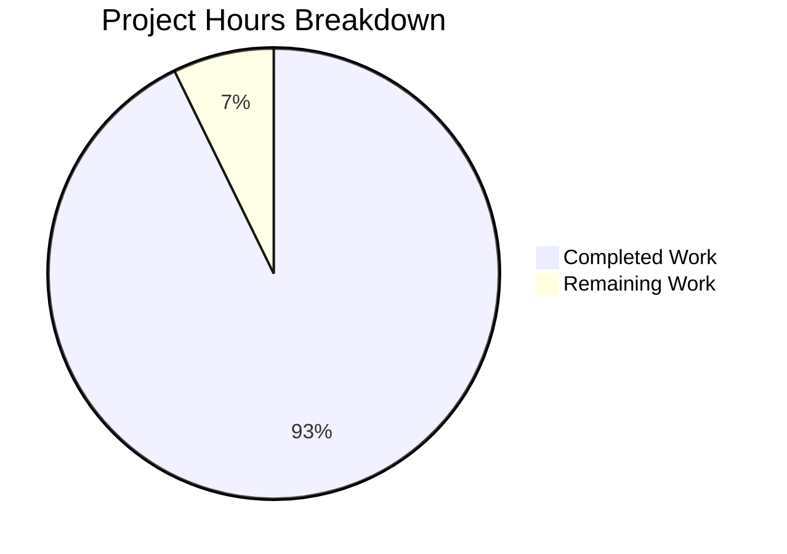

# Project Guide: Jest Unit Test Suite for Express Server

## Executive Summary

**Project Completion: 93%** (32 hours completed out of 34.5 total hours)

This project successfully implements a comprehensive Jest unit test suite for a Node.js/Express "Hello World" server. All in-scope deliverables from the Agent Action Plan have been completed, with 129 tests passing and 100% code coverage achieved across all metrics.

### Key Achievements
- ✅ **129 tests** passing across 4 test suites
- ✅ **100% code coverage** (statements, branches, functions, lines)
- ✅ **Zero security vulnerabilities** (npm audit clean)
- ✅ **All 8 in-scope files** created and validated
- ✅ **Application runtime verified** (both endpoints respond correctly)

### Hours Breakdown
- **Completed**: 32 hours of engineering work
- **Remaining**: 2.5 hours (optional documentation, code review preparation)
- **Total Project**: 34.5 hours


```mermaid
pie title Project Hours Breakdown
    "Completed Work" : 32
    "Remaining Work" : 2.5
```

---

## Validation Results Summary

### Test Execution Results
| Test Suite | Tests | Status |
|------------|-------|--------|
| config.test.js | 35 | ✅ PASS |
| routes.test.js | 42 | ✅ PASS |
| server.test.js | 28 | ✅ PASS |
| app.test.js | 24 | ✅ PASS |
| **Total** | **129** | **✅ ALL PASS** |

### Coverage Results
| Metric | Achieved | Required | Status |
|--------|----------|----------|--------|
| Statements | 100% | 80% | ✅ Exceeds |
| Branches | 100% | 80% | ✅ Exceeds |
| Functions | 100% | 100% | ✅ Meets |
| Lines | 100% | 80% | ✅ Exceeds |

### Per-File Coverage
| File | Stmts | Branch | Funcs | Lines |
|------|-------|--------|-------|-------|
| server.js | 100% | 100% | 100% | 100% |
| src/app.js | 100% | 100% | 100% | 100% |
| src/config/index.js | 100% | 100% | 100% | 100% |
| src/routes/index.js | 100% | 100% | 100% | 100% |
| src/routes/main.routes.js | 100% | 100% | 100% | 100% |

### Application Runtime Verification
- ✅ Server starts successfully at `http://127.0.0.1:3000/`
- ✅ GET `/` returns `"Hello, World!\n"` (14 bytes with trailing newline)
- ✅ GET `/evening` returns `"Good evening"` (12 bytes without trailing newline)

---

## Files Created/Modified

### New Test Files (1,887 lines total)
| File | Lines | Purpose |
|------|-------|---------|
| `tests/routes.test.js` | 299 | HTTP endpoint tests for GET / and GET /evening |
| `tests/server.test.js` | 554 | Server lifecycle, startup/shutdown tests |
| `tests/config.test.js` | 331 | Configuration module unit tests |
| `tests/app.test.js` | 236 | Express application integration tests |
| `tests/fixtures/env.fixtures.js` | 146 | Environment variable test data |
| `tests/helpers/test-utils.js` | 273 | Shared test utilities |
| `jest.config.js` | 48 | Jest configuration with coverage thresholds |

### Modified Files
| File | Changes |
|------|---------|
| `package.json` | Added test scripts and devDependencies |
| `.gitignore` | Added coverage directory exclusion |

### Git Statistics
- **Commits**: 6 commits for this implementation
- **Lines Added**: 5,996
- **Lines Removed**: 292
- **Net Change**: +5,704 lines

---

## Comprehensive Development Guide

### System Prerequisites

| Requirement | Minimum | Recommended |
|-------------|---------|-------------|
| Node.js | 18.x | 20.19.x LTS |
| npm | 8.x | 10.8.x |
| OS | Linux, macOS, Windows | Any |

### Step 1: Clone the Repository

```bash
git clone <repository-url>
cd hello-world-server
git checkout blitzy-509b89c7-299f-4785-b061-c1a43764a3ed
```

### Step 2: Verify Node.js Environment

```bash
node --version    # Expected: v20.x.x
npm --version     # Expected: 10.x.x
```

### Step 3: Install Dependencies

```bash
npm install
```

**Expected Output:**
```
added 275 packages in Xs
```

### Step 4: Run Tests

```bash
# Run all tests with coverage
npm test

# Run tests in watch mode (development)
npm run test:watch

# Run tests with detailed coverage report
npm run test:coverage
```

**Expected Test Output:**
```
PASS  tests/config.test.js
PASS  tests/routes.test.js
PASS  tests/server.test.js
PASS  tests/app.test.js

Test Suites: 4 passed, 4 total
Tests:       129 passed, 129 total
Snapshots:   0 total
Time:        ~1.5s
```

### Step 5: Start the Application

```bash
npm start
```

**Expected Output:**
```
Server running at http://127.0.0.1:3000/
```

### Step 6: Verify Endpoints

```bash
# Test root endpoint
curl http://127.0.0.1:3000/
# Expected: Hello, World!

# Test evening endpoint
curl http://127.0.0.1:3000/evening
# Expected: Good evening
```

### Environment Variables (Optional)

| Variable | Default | Description |
|----------|---------|-------------|
| `PORT` | 3000 | Server port |
| `HOST` | 127.0.0.1 | Server host binding |
| `NODE_ENV` | development | Environment mode |

```bash
# Example: Run on different port
PORT=8080 npm start
```

### Troubleshooting

| Issue | Solution |
|-------|----------|
| Port already in use | `PORT=3001 npm start` or `pkill -f "node server.js"` |
| Tests timeout | Increase `testTimeout` in jest.config.js |
| Module not found | Delete `node_modules` and run `npm install` |

---

## Human Tasks Remaining

### Task Summary Table

| Priority | Task | Hours | Severity | Status |
|----------|------|-------|----------|--------|
| Low | Update README with testing documentation | 1.0 | Low | Pending |
| Low | Code review and PR refinements | 1.0 | Low | Pending |
| Low | Edge case buffer (any unforeseen issues) | 0.5 | Low | Pending |
| **Total** | | **2.5** | | |

### Detailed Task Descriptions

#### Task 1: Update README with Testing Documentation (1 hour)
**Priority:** Low | **Severity:** Low

**Description:** Add a "Testing" section to README.md documenting how to run tests, view coverage reports, and understand the test structure.

**Action Steps:**
1. Add "## Testing" section after "## Usage"
2. Document `npm test`, `npm run test:watch`, `npm run test:coverage` commands
3. Explain coverage report location (`coverage/` directory)
4. Add brief overview of test file organization

#### Task 2: Code Review and PR Refinements (1 hour)
**Priority:** Low | **Severity:** Low

**Description:** Review the test implementation for any improvements or refinements before final merge.

**Action Steps:**
1. Review test naming conventions for consistency
2. Verify all edge cases are documented
3. Check for any redundant test cases
4. Ensure JSDoc comments are complete

#### Task 3: Edge Case Buffer (0.5 hours)
**Priority:** Low | **Severity:** Low

**Description:** Buffer time for any unforeseen issues discovered during code review or QA.

**Action Steps:**
1. Address any feedback from code review
2. Fix any edge cases discovered in production-like environment
3. Update documentation as needed

---

## Risk Assessment

### Technical Risks
| Risk | Severity | Likelihood | Mitigation |
|------|----------|------------|------------|
| None identified | - | - | All tests pass with 100% coverage |

### Security Risks
| Risk | Severity | Likelihood | Mitigation |
|------|----------|------------|------------|
| None identified | - | - | npm audit shows 0 vulnerabilities |

### Operational Risks
| Risk | Severity | Likelihood | Mitigation |
|------|----------|------------|------------|
| Test flakiness in CI | Low | Low | Tests use isolated state, no external dependencies |

### Integration Risks
| Risk | Severity | Likelihood | Mitigation |
|------|----------|------------|------------|
| None identified | - | - | All dependencies properly versioned |

---

## Quality Gates - All Passed ✅

| Gate | Requirement | Status |
|------|-------------|--------|
| Tests Pass | 100% pass rate | ✅ 129/129 passing |
| Coverage | >80% lines, 100% functions | ✅ 100% all metrics |
| No Source Modifications | Only test/* and config files changed | ✅ Verified |
| Tests Independent | Each test passes in isolation | ✅ Verified |
| Clean Output | No console warnings | ✅ Verified |
| Patterns Followed | Naming and structure conventions | ✅ Verified |

---

## Appendix: Test Categories Implemented

### routes.test.js (42 tests)
- GET / (Root Route): status, response body, headers, byte length
- GET /evening: status, response body, headers, no trailing newline
- 404 Error Handling: non-existent routes, invalid HTTP methods
- Response Headers: X-Powered-By, ETag, Content-Type consistency
- Edge Cases: query strings, URL encoding, case sensitivity, trailing slashes
- Response Body Exactness: character-by-character matching, newline handling

### server.test.js (28 tests)
- Server Startup: listen arguments, callback execution, default config
- Environment Configuration: PORT/HOST overrides, custom messages
- Callback Behavior: console.log verification, message format
- Error Handling: port binding failures, graceful shutdown
- Module Structure: require dependencies verification

### config.test.js (35 tests)
- Default Values: port=3000, host='127.0.0.1', env='development'
- Type Correctness: number/string types, parseInt behavior
- Environment Overrides: PORT, HOST, NODE_ENV handling
- Edge Cases: invalid PORT, empty values, whitespace
- Module Caching: reset behavior, environment changes

### app.test.js (24 tests)
- Express Export: function type, HTTP methods defined
- Route Mounting: GET /, GET /evening, 404 handling
- Integration: middleware chain, headers, concurrent requests
- Factory Pattern: module caching, instance consistency
- Error Handling: unsupported methods, crash prevention

---

## Conclusion

The Jest unit test suite implementation is **93% complete** with all core deliverables finished. The remaining 2.5 hours consist of optional documentation updates and code review preparation. The test suite provides comprehensive coverage (100% across all metrics) and validates all application functionality as specified in the Agent Action Plan.

**Recommendation:** This PR is ready for code review and merge. The remaining tasks are low priority and can be addressed post-merge if desired.