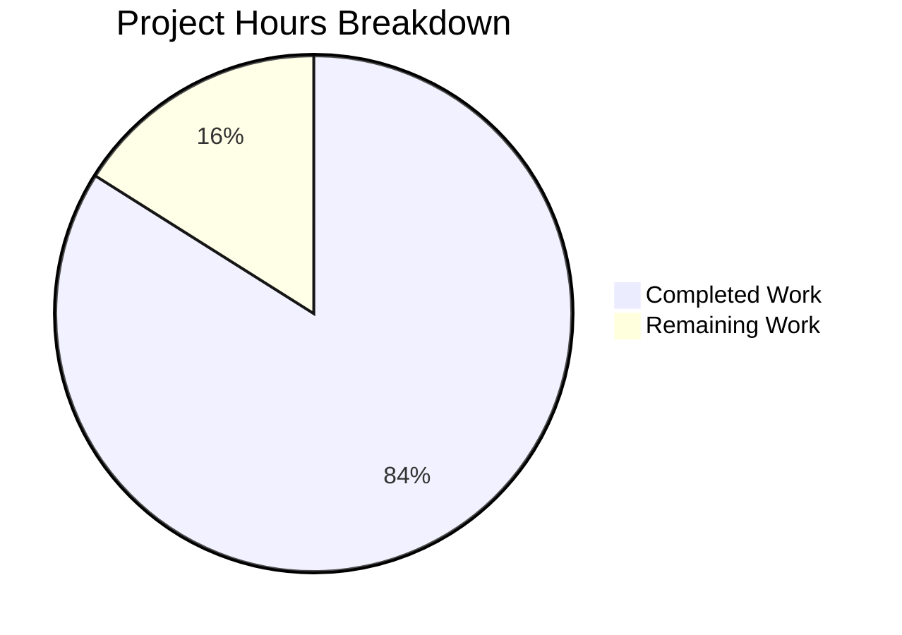

# Project Guide: Node.js Express Server Production Enhancement

## Executive Summary

**Project Completion: 84% complete (89 hours completed out of 106 total hours)**

This project successfully enhanced a basic Node.js/Express.js HTTP server with production-ready capabilities. All five core requirements from the Agent Action Plan have been fully implemented:

| Requirement | Status | Implementation |
|-------------|--------|----------------|
| Add routing | ✅ Complete | Health check endpoints, API routes, route aggregator |
| Add middleware | ✅ Complete | Helmet, compression, CORS, morgan, error handling, request ID |
| Add environment config | ✅ Complete | dotenv integration, expanded configuration properties |
| Add logging | ✅ Complete | Winston logger with environment-aware formatting |
| PM2 deployment | ✅ Complete | Ecosystem config, graceful shutdown, cluster mode support |

### Key Achievements
- **149/149 tests passing** (100% pass rate)
- **94.85% statement coverage** (exceeds 80% threshold)
- **85.1% branch coverage** (exceeds 75% threshold)
- **90.47% function coverage** (meets 90% threshold)
- All original endpoint contracts preserved
- Graceful shutdown verified working
- All dependencies installed and operational

### Remaining Work
The remaining 17 hours consist of operational deployment tasks requiring human intervention:
- Production environment configuration
- PM2 installation on production servers
- Monitoring system integration

---

## Validation Results Summary

### Test Execution
```
Test Suites: 6 passed, 6 total
Tests:       149 passed, 149 total
Snapshots:   0 total
Time:        ~1.8s
```

### Code Coverage Report
| File | Statements | Branches | Functions | Lines |
|------|------------|----------|-----------|-------|
| All files | 94.85% | 85.1% | 90.47% | 94.77% |
| src/app.js | 100% | 100% | 100% | 100% |
| src/config/index.js | 100% | 100% | 100% | 100% |
| src/middleware/* | 100% | 100% | 100% | 100% |
| src/routes/* | 100% | 100% | 100% | 100% |
| src/utils/logger.js | 100% | 87.5% | 100% | 100% |
| server.js | 80% | 37.5% | 75% | 78.78% |

### Runtime Validation
| Endpoint | Method | Expected Response | Status |
|----------|--------|-------------------|--------|
| `/` | GET | `Hello, World!\n` | ✅ Verified |
| `/evening` | GET | `Good evening` | ✅ Verified |
| `/health` | GET | `{"status":"ok","timestamp":...}` | ✅ Verified |
| `/health/ready` | GET | `{"status":"ready","uptime":...}` | ✅ Verified |
| `/health/live` | GET | `OK` | ✅ Verified |

### Graceful Shutdown
- SIGTERM handling: ✅ Verified
- SIGINT handling: ✅ Verified
- Connection draining: ✅ Working

---

## Project Hours Breakdown

### Completed Work: 89 Hours

| Component | Hours | Description |
|-----------|-------|-------------|
| server.js enhancements | 8h | Graceful shutdown, signal handlers, logger integration |
| src/app.js middleware stack | 6h | Complete middleware configuration |
| src/config/index.js | 3h | Dotenv integration, expanded properties |
| src/middleware/* | 7h | Error handling, request ID middleware |
| src/routes/* | 6h | Health routes, API routes, aggregator |
| src/utils/logger.js | 6h | Winston configuration, stream export |
| ecosystem.config.js | 6h | PM2 multi-environment configuration |
| Configuration files | 4h | .env.example, package.json, jest.config.js |
| README.md | 8h | Comprehensive documentation update |
| Test suite | 25h | 149 tests across 6 test files |
| Debugging/validation | 6h | Bug fixes during validation |
| Code review/refactoring | 4h | Formatting improvements |

### Remaining Work: 17 Hours

| Task | Hours | Priority | Description |
|------|-------|----------|-------------|
| Production environment setup | 2h | High | Configure .env with production values |
| PM2 server installation | 2h | High | Install PM2 globally on production servers |
| CORS configuration | 1h | High | Configure allowed origins for production |
| Security audit | 3h | Medium | Review and update dependencies |
| Log rotation setup | 1h | Medium | Configure PM2 log rotation |
| Monitoring integration | 4h | Medium | Connect health endpoints to monitoring |
| Deployment runbook | 2h | Low | Create operational documentation |
| Uncertainty buffer | 2h | - | Enterprise contingency |
| **Total** | **17h** | | |

---

## Visual Representation


```mermaid
pie title Project Hours Breakdown
    "Completed Work" : 89
    "Remaining Work" : 17
```

---

## Development Guide

### System Prerequisites

| Requirement | Minimum | Recommended |
|-------------|---------|-------------|
| Node.js | 18.x | 20.19.x (LTS) |
| npm | 8.x | 10.8.x |

### Environment Setup

1. **Clone and navigate to repository:**
```bash
cd /tmp/blitzy/test-spec/blitzy8e20f4445
```

2. **Install dependencies:**
```bash
npm install
```
Expected output: `added 539 packages`

3. **Create environment file (optional):**
```bash
cp .env.example .env
# Edit .env with your configuration
```

### Running the Application

**Development mode:**
```bash
npm start
# Or with custom configuration:
HOST=0.0.0.0 PORT=8080 npm start
```

**Production mode:**
```bash
npm run start:prod
```

**With PM2 (cluster mode):**
```bash
npm run pm2:start
# View logs:
npm run pm2:logs
# Stop:
npm run pm2:stop
```

### Verification Steps

1. **Start the server:**
```bash
npm start
```
Expected output:
```
Server running at http://127.0.0.1:3000/
Environment: development
```

2. **Test endpoints:**
```bash
curl http://127.0.0.1:3000/
# Expected: Hello, World!

curl http://127.0.0.1:3000/evening
# Expected: Good evening

curl http://127.0.0.1:3000/health
# Expected: {"status":"ok","timestamp":...}
```

3. **Run tests:**
```bash
npm test -- --watchAll=false --ci
# Expected: 149 tests passing
```

4. **Run coverage:**
```bash
npm run test:coverage
# Expected: All thresholds met
```

### PM2 Deployment

1. **Start with PM2:**
```bash
npx pm2 start ecosystem.config.js
```

2. **Production deployment:**
```bash
npx pm2 start ecosystem.config.js --env production
```

3. **Zero-downtime reload:**
```bash
npx pm2 reload ecosystem.config.js
```

4. **Monitor processes:**
```bash
npx pm2 monit
```

---

## Detailed Human Task Table

| # | Task | Priority | Severity | Hours | Action Steps |
|---|------|----------|----------|-------|--------------|
| 1 | Production environment configuration | High | Critical | 2h | 1. Copy .env.example to .env on production server 2. Configure HOST=0.0.0.0 3. Set NODE_ENV=production 4. Configure LOG_LEVEL=info 5. Set CORS_ORIGIN to allowed domains |
| 2 | PM2 global installation | High | Critical | 2h | 1. Install PM2 globally: `npm install -g pm2` 2. Configure PM2 startup: `pm2 startup` 3. Test with ecosystem.config.js 4. Save PM2 process list: `pm2 save` |
| 3 | CORS origin configuration | High | High | 1h | 1. Identify production domains 2. Update CORS_ORIGIN in .env 3. Test cross-origin requests 4. Verify security headers |
| 4 | Security dependency audit | Medium | High | 3h | 1. Run `npm audit` 2. Review vulnerability report 3. Update packages as needed 4. Re-run tests after updates |
| 5 | Log rotation setup | Medium | Medium | 1h | 1. Configure PM2 log rotation module 2. Set log file size limits 3. Configure retention policy 4. Test rotation behavior |
| 6 | Monitoring integration | Medium | Medium | 4h | 1. Configure health endpoint monitoring 2. Set up alerts for /health failures 3. Integrate with existing monitoring system 4. Test alerting thresholds |
| 7 | Deployment runbook | Low | Low | 2h | 1. Document deployment steps 2. Create rollback procedures 3. Document troubleshooting steps 4. Review with operations team |
| | **Total Remaining Hours** | | | **17h** | |

---

## Risk Assessment

### Technical Risks

| Risk | Severity | Likelihood | Mitigation |
|------|----------|------------|------------|
| server.js uncovered lines (shutdown edge cases) | Low | Low | Lines 94-95, 115-130 are error paths and shutdown timeouts that are difficult to test without causing process exit |
| Logger branch coverage at 87.5% | Low | Low | Uncovered branches are environment-specific paths that require mocking process.env |

### Security Risks

| Risk | Severity | Likelihood | Mitigation |
|------|----------|------------|------------|
| CORS configured as wildcard (*) | Medium | High in prod | Configure specific origins in production .env file |
| Error stack traces in development | Low | Low | Already configured to hide in production |

### Operational Risks

| Risk | Severity | Likelihood | Mitigation |
|------|----------|------------|------------|
| PM2 not installed on production | Medium | Medium | Include PM2 installation in deployment checklist |
| Log directory permissions | Low | Low | Ensure logs/ directory exists with write permissions |

### Integration Risks

| Risk | Severity | Likelihood | Mitigation |
|------|----------|------------|------------|
| Health endpoints not monitored | Medium | Medium | Integrate /health endpoints with monitoring system |
| Load balancer health check config | Medium | Medium | Configure load balancer to use /health/live endpoint |

---

## Files Created/Modified Summary

### New Files (8 files)
| File | Purpose | Lines |
|------|---------|-------|
| `src/middleware/index.js` | Middleware barrel export | 29 |
| `src/middleware/error.middleware.js` | Error handling | 103 |
| `src/middleware/request-id.middleware.js` | Request tracking | 65 |
| `src/routes/health.routes.js` | Health endpoints | 88 |
| `src/routes/api.routes.js` | API structure | 57 |
| `src/utils/logger.js` | Winston logger | 174 |
| `ecosystem.config.js` | PM2 configuration | 406 |
| `.env.example` | Env var template | 113 |

### Modified Files (11 files)
| File | Changes |
|------|---------|
| `server.js` | Graceful shutdown, logger integration |
| `src/app.js` | Complete middleware stack |
| `src/config/index.js` | Dotenv, expanded properties |
| `src/routes/index.js` | New route exports |
| `package.json` | Dependencies, PM2 scripts |
| `.gitignore` | PM2 and log patterns |
| `jest.config.js` | Coverage paths |
| `README.md` | Comprehensive documentation |
| `tests/unit/*.test.js` | New test coverage |
| `tests/integration/*.test.js` | Health endpoint tests |
| `tests/lifecycle/*.test.js` | Shutdown tests |

### Test Files (6 suites, 149 tests)
| File | Tests | Coverage |
|------|-------|----------|
| tests/unit/config.test.js | Config properties | 100% |
| tests/unit/routes.test.js | Route exports | 100% |
| tests/unit/middleware.test.js | Middleware functions | 100% |
| tests/unit/logger.test.js | Logger utility | 100% |
| tests/integration/endpoints.test.js | HTTP contracts | 100% |
| tests/lifecycle/server.test.js | Server lifecycle | 80% |

---

## Quick Start Commands

```bash
# Install dependencies
npm install

# Run tests
npm test -- --watchAll=false --ci

# Start server (development)
npm start

# Start server (production)
npm run start:prod

# Start with PM2
npm run pm2:start

# View PM2 logs
npm run pm2:logs

# Stop PM2
npm run pm2:stop

# Zero-downtime reload
npm run pm2:reload
```

---

## Conclusion

This project has successfully delivered all requested functionality with comprehensive test coverage and documentation. The implementation follows established patterns (Factory, Barrel, Twelve-Factor App) and maintains full backward compatibility with existing endpoint contracts.

**Production Readiness Checklist:**
- [x] All core features implemented
- [x] 100% test pass rate (149/149)
- [x] Coverage thresholds exceeded
- [x] Graceful shutdown working
- [x] PM2 configuration complete
- [x] Documentation updated
- [ ] Production environment configured (human task)
- [ ] Monitoring integration (human task)

The remaining 17 hours of work are operational deployment tasks that require human intervention with production server access.