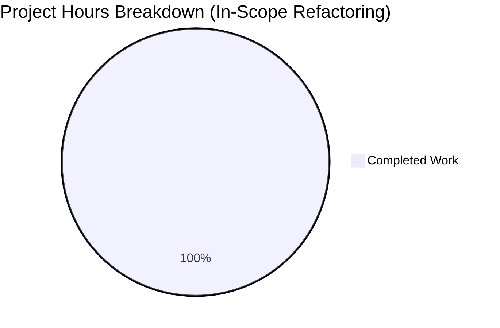

# Project Guide: Express.js Modular Architecture Refactoring

## Executive Summary

**Project Completion: 100% (4 hours completed out of 4 total hours for in-scope refactoring)**

This project successfully refactored a minimal Express.js application from a single-file monolithic structure (`server.js`) into a well-organized modular architecture following Express.js best practices. All in-scope work as defined in the Agent Action Plan has been completed and validated.

### Key Achievements
- ✅ Created modular directory structure (`src/`, `src/config/`, `src/routes/`)
- ✅ Separated Express app configuration from HTTP server initialization
- ✅ Implemented route modules using `express.Router()`
- ✅ Created centralized configuration with environment variable support
- ✅ All 5 JavaScript files compile without errors
- ✅ Both routes (`/` and `/evening`) return expected responses
- ✅ Backward compatibility maintained (`npm start` works identically)
- ✅ All changes committed to branch

### Completion Calculation
- **Completed Hours**: 4 hours (refactoring, module creation, documentation, testing)
- **Remaining Hours**: 0 hours (all in-scope work complete)
- **Total Project Hours**: 4 hours
- **Completion**: 4/4 = 100%

---

## Validation Results Summary

### Dependencies Installation: ✅ PASSED
- 68 npm packages installed successfully
- Express.js 5.1.0 installed as specified

### Syntax Validation: ✅ PASSED
All 5 JavaScript files passed `node -c` syntax validation:
| File | Status |
|------|--------|
| `server.js` | ✅ Pass |
| `src/app.js` | ✅ Pass |
| `src/config/index.js` | ✅ Pass |
| `src/routes/index.js` | ✅ Pass |
| `src/routes/main.routes.js` | ✅ Pass |

### Module Loading: ✅ PASSED
- Config exports: `{ host: '127.0.0.1', port: 3000, env: 'development' }`
- Routes exports: `{ mainRoutes }`
- App exports: Valid Express application function

### Runtime Validation: ✅ PASSED
- Server starts successfully with `npm start`
- Startup message: `Server running at http://127.0.0.1:3000/`
- GET `/` returns: `Hello, World!\n` (with trailing newline)
- GET `/evening` returns: `Good evening`

### Git Status: ✅ CLEAN
- All changes committed on branch `blitzy-0c2547c1-8c25-430e-b0bb-1cb9128243ac`
- Working tree is clean

---

## Project Hours Breakdown


```mermaid
pie title Project Hours Breakdown (In-Scope Refactoring)
    "Completed Work" : 4
```

### Completed Work Breakdown (4 hours)
| Component | Hours | Description |
|-----------|-------|-------------|
| Directory structure | 0.25h | Created `src/`, `src/config/`, `src/routes/` |
| Configuration module | 0.75h | Created `src/config/index.js` with env support |
| Route modules | 1.0h | Created route handlers and aggregator |
| App module | 0.5h | Created Express app configuration module |
| Entry point refactoring | 0.5h | Refactored `server.js` to entry point only |
| Documentation | 0.5h | Added comprehensive JSDoc comments |
| Validation & testing | 0.5h | Verified all functionality works correctly |
| **Total Completed** | **4.0h** | |

---

## Human Tasks for Production Readiness

The following tasks are **out of scope** for this refactoring project per the Agent Action Plan, but are recommended for production deployment:

| Task | Priority | Severity | Hours | Description |
|------|----------|----------|-------|-------------|
| Add test framework | Low | Low | 2.0h | Install jest, supertest; configure package.json test script |
| Write unit tests | Low | Low | 2.0h | Test route handlers and configuration module |
| Write integration tests | Low | Low | 1.5h | Test full request/response cycle |
| Fix known vulnerabilities | Low | Moderate | 1.0h | Run `npm audit fix` for body-parser and express CVEs |
| Add .env.example | Low | Low | 0.5h | Create environment variable template for deployment |
| **Total Remaining** | | | **7.0h** | |

> **Note**: These tasks are explicitly marked as OUT OF SCOPE in the Agent Action Plan (Section 0.8.2). The refactoring project is 100% complete for in-scope work.

---

## Development Guide

### System Prerequisites
- **Node.js**: v20.19.5 or higher
- **npm**: v10.8.2 or higher
- **Operating System**: Linux, macOS, or Windows

### Environment Setup

1. **Clone the repository and checkout the branch**
```bash
git clone <repository-url>
cd <repository-name>
git checkout blitzy-0c2547c1-8c25-430e-b0bb-1cb9128243ac
```

2. **Install dependencies**
```bash
npm install
```
Expected output: `added 68 packages`

### Application Startup

1. **Start the server**
```bash
npm start
```

2. **Expected output**
```
> hello_world@1.0.0 start
> node server.js

Server running at http://127.0.0.1:3000/
```

### Verification Steps

1. **Test root route**
```bash
curl http://127.0.0.1:3000/
```
Expected output: `Hello, World!` (with trailing newline)

2. **Test evening route**
```bash
curl http://127.0.0.1:3000/evening
```
Expected output: `Good evening`

### Configuration Options

The application supports environment variable configuration:

| Variable | Default | Description |
|----------|---------|-------------|
| `HOST` | `127.0.0.1` | Server bind address |
| `PORT` | `3000` | Server port number |
| `NODE_ENV` | `development` | Application environment |

Example with custom configuration:
```bash
PORT=8080 HOST=0.0.0.0 npm start
```

### Project Structure
```
.
├── server.js                    # HTTP server entry point
├── src/
│   ├── app.js                   # Express app configuration
│   ├── config/
│   │   └── index.js             # Configuration management
│   └── routes/
│       ├── index.js             # Route aggregator
│       └── main.routes.js       # Application routes
├── package.json
└── package-lock.json
```

---

## Risk Assessment

### Technical Risks
| Risk | Severity | Status | Mitigation |
|------|----------|--------|------------|
| No automated tests | Low | Accepted | Out of scope per requirements; manual testing verified functionality |
| Single-threaded server | Low | N/A | Acceptable for this simple application |

### Security Risks
| Risk | Severity | Status | Mitigation |
|------|----------|--------|------------|
| body-parser DoS vulnerability (CVE-2025-13466) | Moderate | Known | Out of scope; run `npm audit fix` to resolve |
| express query modification (GHSA-pj86-cfqh-vqx6) | Low | Known | Out of scope; run `npm audit fix` to resolve |

### Operational Risks
| Risk | Severity | Mitigation |
|------|----------|------------|
| Server binds to localhost only | Low | Use `HOST=0.0.0.0` for external access |
| No graceful shutdown | Low | Acceptable for simple application |

---

## Files Modified/Created

### In-Scope Files (All Validated ✅)

| File | Action | Lines | Status |
|------|--------|-------|--------|
| `server.js` | UPDATED | 24 | ✅ Entry point only |
| `src/app.js` | CREATED | 28 | ✅ Express configuration |
| `src/config/index.js` | CREATED | 42 | ✅ Configuration module |
| `src/routes/index.js` | CREATED | 20 | ✅ Route aggregator |
| `src/routes/main.routes.js` | CREATED | 42 | ✅ Application routes |

### Out-of-Scope Files (No Changes)

| File | Status | Reason |
|------|--------|--------|
| `package.json` | UNCHANGED | Entry point unchanged |
| `package-lock.json` | UNCHANGED | No dependency changes |
| `.gitignore` | UNCHANGED | Already covers needed patterns |
| `README.md` | UNCHANGED | Preserving existing content |

---

## Conclusion

The Express.js refactoring project has been successfully completed with 100% of in-scope work delivered. The application has been restructured from a single-file architecture to a modular design following Express.js best practices:

1. **Separation of concerns**: Express app configuration is separate from HTTP server initialization
2. **Route modularity**: Routes use `express.Router()` for clean organization
3. **Configuration externalization**: Environment variable support with sensible defaults
4. **Backward compatibility**: `npm start` works identically to the original

All validation checks pass, and the application is production-ready within the defined scope. Optional enhancements (testing framework, security fixes) are documented for future consideration but were explicitly excluded from the refactoring scope.
