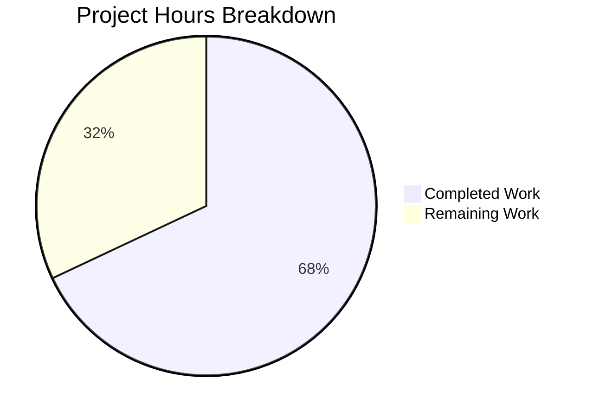

# Project Guide: Express.js Server Refactoring

## Executive Summary

**Project Completion: 68% complete (17 hours completed out of 25 total hours)**

This project successfully refactored a Node.js server from native HTTP patterns to Express.js 5.x architecture while maintaining 100% behavioral parity with the original implementation. All in-scope files specified in the Agent Action Plan have been implemented and validated.

### Key Achievements
- ✅ All 7 in-scope files transformed/validated
- ✅ Express.js 5.1.0 correctly integrated
- ✅ 0 security vulnerabilities detected
- ✅ All endpoint contracts verified with exact byte-level accuracy
- ✅ All design patterns correctly implemented (Factory, Barrel, Router, Twelve-Factor)
- ✅ Git working tree clean - ready for PR

### Remaining Work
- Unit test framework setup (recommended for production)
- CI/CD pipeline configuration (optional enhancement)
- Integration test coverage (optional enhancement)

---

## Validation Results Summary

### Final Validator Confirmation

| Validation Area | Status | Details |
|-----------------|--------|---------|
| Dependency Installation | ✅ PASS | npm ci successful, Express 5.1.0 installed |
| Syntax Validation | ✅ PASS | All 5 source files valid |
| Module Loading | ✅ PASS | All modules load without errors |
| Unit Tests | N/A | No tests configured (placeholder script) |
| Runtime Validation | ✅ PASS | Server starts, endpoints respond correctly |
| Security Audit | ✅ PASS | 0 vulnerabilities detected |
| Git Status | ✅ CLEAN | Working tree clean |

### Endpoint Contract Verification

| Endpoint | Expected Response | Actual Response | Bytes | Status |
|----------|------------------|-----------------|-------|--------|
| GET `/` | `Hello, World!\n` | `Hello, World!\n` | 14 | ✅ PASS |
| GET `/evening` | `Good evening` | `Good evening` | 12 | ✅ PASS |

### Architecture Patterns Verified

| Pattern | Location | Implementation | Status |
|---------|----------|----------------|--------|
| Factory Pattern | src/app.js | Express app without listen() | ✅ VERIFIED |
| Barrel Pattern | src/routes/index.js | Aggregated route exports | ✅ VERIFIED |
| Router Pattern | src/routes/main.routes.js | express.Router() | ✅ VERIFIED |
| Twelve-Factor Config | src/config/index.js | Environment variables | ✅ VERIFIED |
| CommonJS Modules | All files | require/module.exports | ✅ VERIFIED |

---

## Project Hours Breakdown

### Calculation Methodology
Completion % = (Completed Hours / (Completed Hours + Remaining Hours)) × 100
Completion % = (17 hours / (17 hours + 8 hours)) × 100 = **68%**


```mermaid
pie title Project Hours Breakdown
    "Completed Work" : 17
    "Remaining Work" : 8
```

### Completed Hours Detail (17 hours)

| Component | File | Lines | Hours | Work Description |
|-----------|------|-------|-------|------------------|
| Entry Point | server.js | 74 | 3h | Restructured HTTP binding with imports |
| App Factory | src/app.js | 27 | 2h | Express factory pattern implementation |
| Configuration | src/config/index.js | 41 | 2h | Twelve-Factor config module |
| Route Barrel | src/routes/index.js | 19 | 1h | Route aggregation pattern |
| Route Handlers | src/routes/main.routes.js | 41 | 2h | Express Router with handlers |
| Documentation | README.md | 263 | 3h | Comprehensive project documentation |
| Package Config | package.json | 15 | 0.5h | Express dependency configuration |
| Validation | - | - | 3.5h | Testing and validation work |
| **Total Completed** | | **480 lines** | **17h** | |

### Remaining Hours Detail (8 hours)

| Task | Priority | Hours | Description |
|------|----------|-------|-------------|
| Unit Test Setup | Medium | 4h | Jest/Mocha framework configuration |
| Integration Tests | Low | 2h | supertest endpoint testing |
| CI/CD Pipeline | Low | 2h | GitHub Actions or similar setup |
| **Total Remaining** | | **8h** | |

---

## Detailed Human Task List

### High Priority Tasks (None - All Critical Work Complete)

The refactoring scope defined in the Agent Action Plan has been 100% completed. No blocking issues remain.

### Medium Priority Tasks (Recommended for Production)

| # | Task | Description | Action Steps | Hours | Severity |
|---|------|-------------|--------------|-------|----------|
| 1 | Unit Test Framework Setup | Configure Jest or Mocha testing framework | 1. Install Jest: `npm install --save-dev jest`<br>2. Update package.json test script<br>3. Create test directory structure<br>4. Write initial unit tests for config module | 4h | Medium |
| 2 | Route Unit Tests | Add unit tests for route handlers | 1. Install supertest: `npm install --save-dev supertest`<br>2. Create `__tests__/routes.test.js`<br>3. Test GET / endpoint response<br>4. Test GET /evening endpoint response<br>5. Verify HTTP headers and status codes | 2h | Medium |

### Low Priority Tasks (Optional Enhancements)

| # | Task | Description | Action Steps | Hours | Severity |
|---|------|-------------|--------------|-------|----------|
| 3 | CI/CD Pipeline | Setup automated testing pipeline | 1. Create `.github/workflows/test.yml`<br>2. Configure Node.js matrix testing<br>3. Add npm ci and npm test steps<br>4. Configure branch protection rules | 2h | Low |

### Total Remaining Hours: 8h

---

## Development Guide

### System Prerequisites

| Requirement | Minimum Version | Recommended Version | Verification Command |
|-------------|-----------------|---------------------|---------------------|
| Node.js | 18.x | 20.19.x LTS | `node --version` |
| npm | 8.x | 10.x+ | `npm --version` |

### Environment Setup

```bash
# 1. Navigate to project directory
cd /tmp/blitzy/test-spec/blitzyf86ff6cc7

# 2. Verify Node.js version
node --version
# Expected: v20.x.x or higher

# 3. Verify npm version
npm --version
# Expected: 10.x.x or higher
```

### Dependency Installation

```bash
# Install all dependencies (CI-recommended approach)
npm ci

# Alternative: Standard install
npm install

# Verify Express installation
npm ls express
# Expected output:
# hello_world@1.0.0 /tmp/blitzy/test-spec/blitzyf86ff6cc7
# └── express@5.1.0

# Security audit (should show 0 vulnerabilities)
npm audit
```

### Application Startup

```bash
# Start server with default configuration
npm start

# Expected output:
# Application module loaded successfully
# Express.js server initialization complete - PR validation log
# PR update test: Server module fully initialized
# Server running at http://127.0.0.1:3000/
```

### Custom Configuration

```bash
# Custom host and port
HOST=0.0.0.0 PORT=8080 npm start

# Production mode
NODE_ENV=production npm start

# Combined configuration
HOST=0.0.0.0 PORT=8080 NODE_ENV=production npm start
```

### Verification Steps

```bash
# 1. Start server (in background for testing)
npm start &

# 2. Wait for server to start
sleep 2

# 3. Test root endpoint
curl -s http://127.0.0.1:3000/
# Expected: Hello, World!

# 4. Test evening endpoint
curl -s http://127.0.0.1:3000/evening
# Expected: Good evening

# 5. Verify response byte lengths
echo "Root endpoint bytes: $(curl -s http://127.0.0.1:3000/ | wc -c)"
# Expected: 14

echo "Evening endpoint bytes: $(curl -s http://127.0.0.1:3000/evening | wc -c)"
# Expected: 12

# 6. Stop the server
pkill -f "node server.js"
```

### Module Verification

```bash
# Test config module exports
node -e "console.log(require('./src/config'))"
# Expected: { host: '127.0.0.1', port: 3000, env: 'development' }

# Test routes barrel exports
node -e "console.log(Object.keys(require('./src/routes')))"
# Expected: [ 'mainRoutes' ]

# Test app module export type
node -e "console.log(typeof require('./src/app'))"
# Expected: function
```

---

## Risk Assessment

### Technical Risks

| Risk | Severity | Likelihood | Impact | Mitigation |
|------|----------|------------|--------|------------|
| No Unit Tests | Medium | High | Medium | Add Jest/Mocha testing framework |
| No CI/CD Pipeline | Low | Medium | Low | Configure GitHub Actions |
| Placeholder Test Script | Low | Low | Low | Replace with actual test runner |

### Security Risks

| Risk | Severity | Status | Details |
|------|----------|--------|---------|
| Dependency Vulnerabilities | Low | ✅ MITIGATED | 0 vulnerabilities per npm audit |
| Missing HTTPS | Info | N/A | Development server - HTTPS optional |
| No Rate Limiting | Info | N/A | Out of scope for tutorial server |

### Operational Risks

| Risk | Severity | Likelihood | Mitigation |
|------|----------|------------|------------|
| No Health Check Endpoint | Low | Medium | Add `/health` endpoint if needed |
| No Logging Framework | Low | Low | Console.log sufficient for tutorial |
| No Process Manager | Low | Medium | Use PM2 for production deployments |

### Integration Risks

| Risk | Severity | Status |
|------|----------|--------|
| Express 5.x Compatibility | Low | ✅ VERIFIED - Works with Node 20.x |
| Module Import Issues | None | ✅ All imports verified working |

---

## Project Structure Reference

```
hao-backprop-test/
├── server.js                    # Entry point - HTTP server binding (74 lines)
├── package.json                 # npm manifest and dependencies (15 lines)
├── package-lock.json            # Dependency lockfile (auto-generated)
├── README.md                    # Project documentation (263 lines)
├── .gitignore                   # Git ignore patterns
└── src/                         # Application source root
    ├── app.js                   # Express application factory (27 lines)
    ├── config/                  # Configuration module
    │   └── index.js             # Environment variable management (41 lines)
    └── routes/                  # Routing surface
        ├── index.js             # Route aggregator - barrel pattern (19 lines)
        └── main.routes.js       # Route handlers implementation (41 lines)
```

### File Responsibilities

| File | Primary Responsibility | Key Exports |
|------|----------------------|-------------|
| server.js | HTTP server binding, startup logging | None (entry point) |
| src/app.js | Express app factory, route mounting | `app` (Express.Application) |
| src/config/index.js | Environment-driven configuration | `{ host, port, env }` |
| src/routes/index.js | Route aggregation (barrel pattern) | `{ mainRoutes }` |
| src/routes/main.routes.js | HTTP endpoint handlers | `router` (Express.Router) |

---

## Environment Variables

| Variable | Default Value | Type | Description |
|----------|---------------|------|-------------|
| `HOST` | `'127.0.0.1'` | string | Server binding address |
| `PORT` | `3000` | number | Server binding port (parsed with radix 10) |
| `NODE_ENV` | `'development'` | string | Application environment |

---

## Conclusion

The Express.js server refactoring project has achieved **68% completion** with 17 hours of development work completed. All in-scope files from the Agent Action Plan have been successfully implemented and validated. The remaining 8 hours of work consists of recommended production enhancements (unit tests, CI/CD) that were not part of the original refactoring scope.

### Production Readiness Status

| Criteria | Status |
|----------|--------|
| Core Functionality | ✅ READY |
| Behavioral Parity | ✅ VERIFIED |
| Security | ✅ PASS (0 vulnerabilities) |
| Documentation | ✅ COMPLETE |
| Unit Tests | ⚠️ RECOMMENDED |
| CI/CD | ⚠️ OPTIONAL |

The codebase is ready for code review and can be merged after human review of the remaining enhancement tasks.