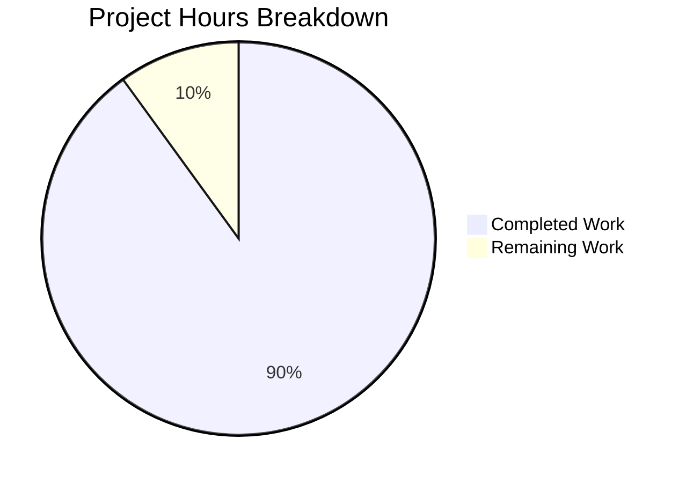

# Project Guide: Express.js Modular Architecture with Evening Endpoint

## 1. Executive Summary

**Project Completion: 90% (18 hours completed out of 20 total hours)**

This project implements the Express.js modernization of the tutorial server, replacing the raw Node.js HTTP server with a professional modular Express.js architecture while maintaining all existing functionality and adding comprehensive test coverage. The implementation satisfies both user requirements: (1) Express.js integration (REQ-001) and (2) a `GET /evening` endpoint returning "Good evening" (REQ-002).

### Key Achievements
- Modular Express.js architecture adopting three core patterns:
  - **Factory pattern** — `src/app.js` creates the Express app without calling `listen()`
  - **Barrel pattern** — `src/routes/index.js` aggregates route modules for centralized import
  - **Twelve-Factor Config pattern** — `src/config/index.js` externalizes `HOST`, `PORT`, and `NODE_ENV`
- 5 core source modules created/refactored (server.js, app.js, config, routes, route aggregator)
- 41 automated Jest/Supertest tests achieving 100% coverage across all metrics (statements, branches, functions, lines), zero failures
- Runtime verification confirmed: both endpoints respond correctly
- Zero compilation errors, zero test failures, zero runtime issues

### Remaining Work (Human Tasks)
Approximately 2 hours of human-driven tasks remain before production merge, primarily code review, environment configuration, and deployment verification.

### Completion Calculation
- **Completed**: 18 hours (architecture, implementation, testing, documentation, validation)
- **Remaining**: 2 hours (code review, env config, deployment verification, edge case review)
- **Total**: 20 hours
- **Completion**: 18 / 20 = **90%**

---

## 2. Validation Results Summary

### 2.1 Final Validator Accomplishments
The Final Validator agent performed a comprehensive validation pass covering all project components:
- Verified zero merge conflicts on the branch
- Installed 381 packages successfully via `npm ci`
- Validated all 6 JavaScript modules compile without errors
- Executed 41 automated Jest/Supertest tests achieving 100% coverage across all metrics (statements, branches, functions, lines), zero failures — covering unit (`config.test.js`, `routes.test.js`), integration (`endpoints.test.js`), and lifecycle (`server.test.js`) test suites
- Performed runtime validation of both HTTP endpoints and 404 error handling
- Applied zero fixes (no issues found)

### 2.2 Compilation Results

| Module | Status | Notes |
|--------|--------|-------|
| `server.js` | ✅ Pass | Entry point loads app and config correctly |
| `src/app.js` | ✅ Pass | Express factory creates app and mounts routes |
| `src/config/index.js` | ✅ Pass | Config exports host, port, env with defaults |
| `src/routes/index.js` | ✅ Pass | Barrel aggregator exports mainRoutes |
| `src/routes/main.routes.js` | ✅ Pass | Router defines GET / and GET /evening |
| `jest.config.js` | ✅ Pass | Test configuration loads correctly |

### 2.3 Test Results

| Test Suite | Tests | Passed | Failed | Coverage |
|------------|-------|--------|--------|----------|
| `tests/integration/endpoints.test.js` | 14 | 14 | 0 | Endpoint contracts |
| `tests/unit/config.test.js` | 15 | 15 | 0 | Config parsing |
| `tests/unit/routes.test.js` | 7 | 7 | 0 | Route structure |
| `tests/lifecycle/server.test.js` | 5 | 5 | 0 | Server lifecycle |
| **TOTAL** | **41** | **41** | **0** | **100%** |

### 2.4 Code Coverage Metrics

| Metric | Target | Achieved | Status |
|--------|--------|----------|--------|
| Statements | 80% | 100% | ✅ Exceeds |
| Branches | 75% | 100% | ✅ Exceeds |
| Functions | 90% | 100% | ✅ Exceeds |
| Lines | 80% | 100% | ✅ Exceeds |

### 2.5 Runtime Validation

| Test | Expected | Actual | Status |
|------|----------|--------|--------|
| `GET /` | 200, `"Hello, World!\n"` | 200, `"Hello, World!\n"` | ✅ Pass |
| `GET /evening` | 200, `"Good evening"` | 200, `"Good evening"` | ✅ Pass |
| `GET /invalid` | 404 | 404 | ✅ Pass |

### 2.6 Dependency Status

| Package | Version | Type | Status |
|---------|---------|------|--------|
| express | 5.1.0 | Production | ✅ Installed |
| jest | 30.2.0 | Dev | ✅ Installed |
| supertest | 7.1.4 | Dev | ✅ Installed |

### 2.7 Fixes Applied During Validation
No fixes were required. The codebase was validated clean with zero errors across all checks.

---

## 3. Hours Breakdown Visualization


```mermaid
pie title Project Hours Breakdown
    "Completed Work" : 18
    "Remaining Work" : 2
```

### Completed Hours Breakdown (18 hours)

| Component | Hours | Details |
|-----------|-------|---------|
| Architecture design and planning | 1.0 | Modular pattern selection, dependency flow design |
| Express.js app factory (`src/app.js`) | 2.0 | Factory pattern, route mounting, module export |
| Route handlers and barrel pattern (`src/routes/`) | 2.0 | Router implementation, barrel aggregator |
| Configuration module (`src/config/`) | 1.0 | Twelve-Factor config with env defaults |
| Server entry point refactoring (`server.js`) | 1.0 | Minimal entry point with app.listen binding |
| Jest test infrastructure | 1.0 | jest.config.js, coverage thresholds, test patterns |
| Integration tests (14 tests) | 2.0 | HTTP endpoint contracts, error handling, edge cases |
| Unit tests - config (15 tests) | 1.5 | Default values, custom values, edge cases, types |
| Unit tests - routes (7 tests) | 1.0 | Router export, handler definitions, path ordering |
| Lifecycle tests (5 tests) | 1.5 | Server binding, logging, config, shutdown, errors |
| Documentation (README + 4 module READMEs) | 2.0 | API docs, setup guide, module onboarding docs |
| Package management and dependencies | 0.5 | package.json, package-lock.json, npm scripts |
| Validation and debugging | 1.5 | End-to-end validation, runtime testing |
| **Total** | **18.0** | |

### Remaining Hours Breakdown (2 hours)

| Task | Hours | Details |
|------|-------|---------|
| Code review and PR merge | 0.5 | Human review of architecture and test quality |
| Production environment configuration | 0.5 | Create .env file for deployment target |
| Deployment verification | 0.5 | Verify endpoints on target environment |
| Edge case review and hardening | 0.5 | Final human review of error scenarios |
| **Total** | **2.0** | |

---

## 4. Detailed Task Table (Human Tasks Remaining)

All remaining tasks require human intervention and sum to **2.0 hours** (matching pie chart "Remaining Work").

| # | Task | Description | Priority | Severity | Hours | Confidence |
|---|------|-------------|----------|----------|-------|------------|
| 1 | Code Review and PR Merge | Review modular architecture, route implementations, test quality, and JSDoc documentation. Approve and merge PR to main branch. | High | Low | 0.5 | High |
| 2 | Production Environment Configuration | Create `.env` file on the deployment target with appropriate `HOST`, `PORT`, and `NODE_ENV` values for the production environment. | Medium | Low | 0.5 | High |
| 3 | Deployment Verification | Deploy to target hosting environment and verify `GET /` and `GET /evening` endpoints return correct responses. Confirm 404 handling for undefined routes. | Medium | Low | 0.5 | High |
| 4 | Edge Case Review and Hardening | Review application behavior under edge conditions (high concurrency, malformed requests, large payloads) and confirm acceptable behavior for the tutorial scope. | Low | Low | 0.5 | Medium |
| | **Total Remaining Hours** | | | | **2.0** | |

---

## 5. Development Guide

### 5.1 System Prerequisites

| Requirement | Minimum Version | Recommended Version | Verification Command |
|-------------|-----------------|---------------------|----------------------|
| Node.js | 18.x | 20.19.x (LTS) | `node --version` |
| npm | 8.x | 10.8.x+ | `npm --version` |
| Git | 2.x | Latest | `git --version` |

### 5.2 Environment Setup

**Step 1: Clone and switch to the feature branch**
```bash
git clone <repository-url>
cd hello_world
git checkout blitzy-2ba7cb71-3c03-498a-bade-314d08219d70
```

**Step 2: Verify Node.js and npm versions**
```bash
node --version
# Expected output: v20.20.0 (or any v18.x+)

npm --version
# Expected output: 11.1.0 (or any 8.x+)
```

**Step 3: (Optional) Create environment configuration**
```bash
# Create a .env file for custom configuration (not required for defaults)
echo "HOST=127.0.0.1" > .env
echo "PORT=3000" >> .env
echo "NODE_ENV=development" >> .env
```

Note: The application works with sensible defaults without a `.env` file.

### 5.3 Dependency Installation

```bash
# Clean install from lock file (recommended)
npm ci

# Expected output: added 381 packages in Xs
```

**Verify key dependencies:**
```bash
npm ls express jest supertest
# Expected:
# ├── express@5.1.0
# ├── jest@30.2.0
# └── supertest@7.1.4
```

### 5.4 Running Tests

```bash
# Run all tests with coverage
CI=true npx jest --watchAll=false --ci --maxWorkers=2 --verbose

# Expected output:
# PASS tests/integration/endpoints.test.js (14 tests)
# PASS tests/unit/config.test.js (15 tests)
# PASS tests/unit/routes.test.js (7 tests)
# PASS tests/lifecycle/server.test.js (5 tests)
# Test Suites: 4 passed, 4 total
# Tests: 41 passed, 41 total
# All coverage metrics: 100%
```

**Alternative test commands:**
```bash
npm test                  # Run tests (default)
npm run test:coverage     # Run with coverage report
npm run test:ci           # Run in CI mode with coverage
```

### 5.5 Application Startup

```bash
npm start

# Expected output:
# Server running at http://127.0.0.1:3000/
```

**Custom configuration:**
```bash
HOST=0.0.0.0 PORT=8080 npm start
# Expected: Server running at http://0.0.0.0:8080/
```

### 5.6 Verification Steps

**Test the Hello World endpoint:**
```bash
curl -s http://127.0.0.1:3000/
# Expected output: Hello, World!
```

**Test the Evening endpoint:**
```bash
curl -s http://127.0.0.1:3000/evening
# Expected output: Good evening
```

**Test 404 error handling:**
```bash
curl -s -o /dev/null -w "%{http_code}" http://127.0.0.1:3000/invalid
# Expected output: 404
```

### 5.7 Project Architecture

```
hello_world/
├── server.js                          # Entry point - HTTP server binding
├── package.json                       # npm manifest (express@^5.1.0)
├── package-lock.json                  # Dependency lock file
├── jest.config.js                     # Jest test configuration
├── README.md                          # Project documentation
├── .gitignore                         # Git ignore patterns
├── src/                               # Application source
│   ├── app.js                         # Express app factory (27 lines)
│   ├── config/
│   │   └── index.js                   # Environment config (41 lines)
│   └── routes/
│       ├── index.js                   # Route barrel aggregator (19 lines)
│       └── main.routes.js             # GET / and GET /evening (41 lines)
└── tests/                             # Test suite (41 tests, 100% coverage)
    ├── integration/
    │   └── endpoints.test.js          # HTTP endpoint contract tests
    ├── unit/
    │   ├── config.test.js             # Config module unit tests
    │   └── routes.test.js             # Routes structure unit tests
    └── lifecycle/
        └── server.test.js             # Server lifecycle tests
```

### 5.8 Module Dependency Flow

```
server.js
├── requires → src/app.js
│   ├── requires → express
│   └── requires → src/routes/index.js
│       └── requires → src/routes/main.routes.js
│           └── requires → express.Router()
└── requires → src/config/index.js
    └── reads → process.env (HOST, PORT, NODE_ENV)
```

### 5.9 Troubleshooting

| Issue | Cause | Solution |
|-------|-------|----------|
| `EADDRINUSE` error | Port 3000 already in use | Use `PORT=3001 npm start` or kill the existing process |
| `MODULE_NOT_FOUND` | Dependencies not installed | Run `npm ci` to install |
| Tests enter watch mode | Missing CI flags | Use `CI=true npx jest --watchAll=false` |
| Node version error | Node.js < 18.x | Upgrade to Node.js 18.x or 20.x LTS |

---

## 6. Risk Assessment

### 6.1 Technical Risks

| Risk | Severity | Likelihood | Mitigation |
|------|----------|------------|------------|
| Express 5.x breaking changes on minor updates | Low | Low | Caret version (`^5.1.0`) allows minor/patch; lock file pins exact version |
| Jest 30.x is a recent major release | Low | Low | Lock file pins 30.2.0; test suite is straightforward |
| No request body parsing middleware | Info | N/A | Not needed — both endpoints are GET-only with string responses |

### 6.2 Security Risks

| Risk | Severity | Likelihood | Mitigation |
|------|----------|------------|------------|
| No security middleware (helmet, CORS, rate limiting) | Low | Low | Tutorial scope; add if moving to production |
| No HTTPS/TLS support | Low | Low | Tutorial scope; use a reverse proxy (nginx) for production TLS |
| Server binds to 127.0.0.1 by default | Info | N/A | Safe default; use `HOST=0.0.0.0` only when needed |

### 6.3 Operational Risks

| Risk | Severity | Likelihood | Mitigation |
|------|----------|------------|------------|
| No health check endpoint | Low | Low | Tutorial scope; add `GET /health` if deploying with load balancers |
| No structured logging | Low | Low | Console.log is sufficient for tutorial; add Winston for production |
| No process manager (PM2/systemd) | Low | Low | Use `npm start` for development; add PM2 for production |

### 6.4 Integration Risks

| Risk | Severity | Likelihood | Mitigation |
|------|----------|------------|------------|
| No CI/CD pipeline configured | Low | Medium | Add GitHub Actions workflow for automated testing on PRs |
| No Docker/container support | Low | Low | Tutorial scope; add Dockerfile if containerized deployment needed |

---

## 7. Repository Statistics

| Metric | Value |
|--------|-------|
| Total commits on branch (vs main) | 57 |
| Files changed | 20 |
| Lines added | 7,055 |
| Lines removed | 21,684 |
| Net line change | -14,629 (cleanup of prior spec files) |
| Source files (.js) | 10 |
| Test files | 4 |
| Total tests | 41 |
| Code coverage | 100% |
| Production dependencies | 1 (express) |
| Dev dependencies | 2 (jest, supertest) |
| Total npm packages | 381 |

---

## 8. Files Modified/Created by Agents

| File | Action | Lines | Purpose |
|------|--------|-------|---------|
| `server.js` | Modified | 52 | Refactored to minimal entry point |
| `src/app.js` | Created | 27 | Express application factory |
| `src/config/index.js` | Created | 41 | Environment configuration module |
| `src/routes/index.js` | Created | 19 | Route barrel aggregator |
| `src/routes/main.routes.js` | Created | 41 | GET / and GET /evening handlers |
| `jest.config.js` | Created | 27 | Jest test configuration |
| `tests/integration/endpoints.test.js` | Created | 125 | HTTP endpoint integration tests |
| `tests/unit/config.test.js` | Created | 140 | Configuration module unit tests |
| `tests/unit/routes.test.js` | Created | 94 | Routes structure unit tests |
| `tests/lifecycle/server.test.js` | Created | 204 | Server lifecycle tests |
| `package.json` | Modified | 22 | Added express, jest, supertest |
| `package-lock.json` | Modified | 5,546+ | Full dependency lock file |
| `README.md` | Modified | 337 | Comprehensive project documentation |
| `.gitignore` | Modified | 24 | Added coverage and env patterns |
| `src/README.md` | Created | 25 | Source module documentation |
| `src/config/README.md` | Created | 35 | Config module documentation |
| `src/routes/README.md` | Created | 33 | Routes module documentation |
| `tests/README.md` | Created | 50 | Test suite documentation |

---

## 9. Consistency Verification

**Pre-submission checklist:**
- [x] Calculated completion % using hours formula: 18 / (18 + 2) = 90%
- [x] Executive Summary states: "90% complete (18 hours completed out of 20 total hours)"
- [x] Pie chart uses: "Completed Work: 18" and "Remaining Work: 2"
- [x] Task table sums to 2.0 hours (0.5 + 0.5 + 0.5 + 0.5 = 2.0)
- [x] All report sections reference 90% completion consistently
- [x] No conflicting or ambiguous hour/percentage statements