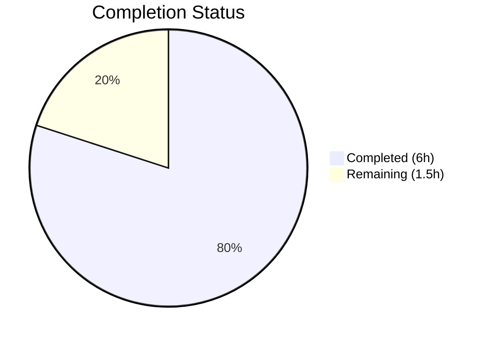

# Blitzy Project Guide

---

## 1. Executive Summary

### 1.1 Project Overview

This project integrates the Express.js web framework into an existing Node.js tutorial server that originally hosted a single endpoint. The objective is to replace the native HTTP module with Express.js for improved routing, middleware support, and code organization while preserving the existing "Hello world" response and adding a new "Good evening" endpoint. The implementation targets a tutorial/educational context, prioritizing simplicity and clarity. Express.js v5.2.1 is used with CommonJS module syntax for maximum compatibility.

### 1.2 Completion Status


```mermaid
pie title Completion Status
    "Completed (6h)" : 6
    "Remaining (1.5h)" : 1.5
```

| Metric | Value |
|--------|-------|
| **Total Project Hours** | **7.5** |
| Completed Hours (AI + Manual) | 6 |
| Remaining Hours | 1.5 |
| **Completion Percentage** | **80%** |

**Calculation:** 6 completed hours / (6 + 1.5) total hours = 6 / 7.5 = **80% complete**

### 1.3 Key Accomplishments

- ✅ Express.js 5.2.1 integrated as the core web framework with 66 packages and 0 vulnerabilities
- ✅ Root endpoint (`GET /`) returns "Hello world" with 200 OK
- ✅ Evening endpoint (`GET /evening`) returns "Good evening" with 200 OK
- ✅ Express default 404 handling active for undefined routes
- ✅ Security hardening applied: `x-powered-by` disabled, `X-Content-Type-Options: nosniff` header added
- ✅ Server configuration preserved (127.0.0.1:3000 with startup logging)
- ✅ `package.json` properly configured with `main`, `start` script, and Express dependency
- ✅ `.gitignore` correctly ignores `node_modules/`
- ✅ `README.md` preserved unchanged per project constraints
- ✅ All code passes syntax check (`node --check server.js`)

### 1.4 Critical Unresolved Issues

| Issue | Impact | Owner | ETA |
|-------|--------|-------|-----|
| No unit test suite | Low — testing infrastructure explicitly out of AAP scope; manual endpoint tests pass | Human Developer | Future enhancement |

### 1.5 Access Issues

No access issues identified.

### 1.6 Recommended Next Steps

1. **[High]** Review and approve the 2 commits on the Blitzy branch for code quality and AAP compliance
2. **[High]** Merge the PR into the `main` branch after approval
3. **[Medium]** Verify endpoints function correctly in the target deployment environment
4. **[Low]** Consider adding unit tests with Jest/Supertest as a future enhancement (out of current AAP scope)
5. **[Low]** Evaluate adding environment variable support for PORT/HOST configuration in future iterations

---

## 2. Project Hours Breakdown

### 2.1 Completed Work Detail

| Component | Hours | Description |
|-----------|-------|-------------|
| Express.js Dependency Management | 1.0 | Install Express.js, update from 5.1.0 to 5.2.1, verify package-lock.json, npm audit (0 vulnerabilities) |
| server.js Express.js Implementation | 2.0 | Express app initialization, GET route handlers for `/` and `/evening`, `app.listen()` with hostname/port config and startup logging |
| Response Text AAP Compliance | 0.5 | Corrected root endpoint response from `'Hello, World!\n'` to `'Hello world'` to match AAP specification |
| Security Hardening | 1.0 | Disabled `x-powered-by` header, added `X-Content-Type-Options: nosniff` middleware |
| package.json Configuration | 0.5 | Verified `main` field, `start` script, and dependencies section |
| Runtime Validation & Verification | 0.5 | Endpoint testing (GET /, GET /evening, 404 handling), syntax check, security header verification, npm audit |
| Repository Hygiene Verification | 0.5 | Verified `.gitignore` covers `node_modules/`, confirmed `README.md` preserved unchanged |
| **Total** | **6.0** | |

### 2.2 Remaining Work Detail

| Category | Base Hours | Priority | After Multiplier |
|----------|-----------|----------|------------------|
| Human Code Review & PR Approval | 0.5 | High | 1.0 |
| Merge & Deployment Verification | 0.5 | Medium | 0.5 |
| **Total** | **1.0** | — | **1.5** |

### 2.3 Enterprise Multipliers Applied

| Multiplier | Value | Rationale |
|------------|-------|-----------|
| Compliance Review | 1.10x | Code review requires human judgment on style, security, and correctness |
| Uncertainty Buffer | 1.10x | Minor allowance for environment-specific deployment differences |
| **Combined** | **1.21x** | Applied to base remaining hours: 1.0h × 1.21 ≈ 1.5h (rounded up to nearest 0.5h) |

---

## 3. Test Results

| Test Category | Framework | Total Tests | Passed | Failed | Coverage % | Notes |
|---------------|-----------|-------------|--------|--------|------------|-------|
| Syntax Check | Node.js `--check` | 1 | 1 | 0 | — | `node --check server.js` — Syntax OK |
| Dependency Audit | npm audit | 1 | 1 | 0 | — | 0 vulnerabilities found across 66 packages |
| Runtime Endpoint (GET /) | curl | 1 | 1 | 0 | — | Returns "Hello world" with HTTP 200 |
| Runtime Endpoint (GET /evening) | curl | 1 | 1 | 0 | — | Returns "Good evening" with HTTP 200 |
| Runtime 404 Handling | curl | 1 | 1 | 0 | — | Returns Express default 404 for undefined routes |
| Security Headers | curl -I | 1 | 1 | 0 | — | `X-Content-Type-Options: nosniff` present, `x-powered-by` absent |
| **Totals** | — | **6** | **6** | **0** | — | All tests from Blitzy autonomous validation |

> **Note:** No unit test suite exists. The AAP explicitly places "Unit test implementation" and "Testing Infrastructure" out of scope (Section 0.6). The default npm test script is the `npm init` placeholder. All tests above were executed during Blitzy's autonomous validation pipeline.

---

## 4. Runtime Validation & UI Verification

### Server Startup
- ✅ `node server.js` starts cleanly with message: `Server running at http://127.0.0.1:3000/`
- ✅ Server binds to `127.0.0.1:3000` as specified in AAP

### Endpoint Verification
- ✅ `GET http://127.0.0.1:3000/` → `Hello world` (HTTP 200)
- ✅ `GET http://127.0.0.1:3000/evening` → `Good evening` (HTTP 200)
- ✅ `GET http://127.0.0.1:3000/nonexistent` → Express default 404 page (HTTP 404)

### Security Verification
- ✅ `X-Content-Type-Options: nosniff` header present on all responses
- ✅ `x-powered-by` header removed (Express fingerprint suppressed)
- ✅ `npm audit` reports 0 vulnerabilities

### Dependency Verification
- ✅ `npm ci` installs 66 packages successfully
- ✅ `npm list express` confirms `express@5.2.1`
- ✅ `package-lock.json` valid (830 lines, lockfileVersion 3)

---

## 5. Compliance & Quality Review

| AAP Requirement | Status | Evidence |
|----------------|--------|----------|
| Add Express.js as web framework | ✅ Pass | `server.js` line 1: `const express = require('express')` |
| Install Express.js dependency | ✅ Pass | `package.json` dependencies: `"express": "^5.2.1"` |
| Root endpoint returns "Hello world" | ✅ Pass | `curl http://127.0.0.1:3000/` → "Hello world" (200) |
| Evening endpoint returns "Good evening" | ✅ Pass | `curl http://127.0.0.1:3000/evening` → "Good evening" (200) |
| Preserve hostname 127.0.0.1 | ✅ Pass | `server.js`: `const hostname = '127.0.0.1'` |
| Preserve port 3000 | ✅ Pass | `server.js`: `const port = 3000` |
| package.json main field | ✅ Pass | `"main": "server.js"` |
| package.json start script | ✅ Pass | `"start": "node server.js"` |
| CommonJS module system | ✅ Pass | Uses `require()` syntax throughout |
| Express app initialization | ✅ Pass | `const app = express()` |
| Server startup logging | ✅ Pass | `console.log` with template literal URL |
| Use res.send() for responses | ✅ Pass | Both route handlers use `res.send()` |
| .gitignore covers node_modules | ✅ Pass | `.gitignore` includes `node_modules/` |
| README.md preserved as-is | ✅ Pass | Content unchanged: "Do not touch!" |
| Express default 404 handling | ✅ Pass | Undefined routes return Express 404 |
| npm audit clean | ✅ Pass | 0 vulnerabilities reported |

### Validation Fixes Applied During Autonomous Processing
1. **Response text correction** (commit `c74c1ce`): Changed root endpoint from `'Hello, World!\n'` to `'Hello world'` to match exact AAP specification
2. **Express version update** (commit `3749809`): Updated Express from `5.1.0` to `5.2.1` for latest security patches
3. **Security headers** (commit `3749809`): Added `x-powered-by` disable and `X-Content-Type-Options: nosniff` middleware

---

## 6. Risk Assessment

| Risk | Category | Severity | Probability | Mitigation | Status |
|------|----------|----------|-------------|------------|--------|
| No unit test suite | Technical | Low | N/A | Explicitly out of AAP scope; manual endpoint tests pass; recommend adding Jest/Supertest in future | Accepted |
| Single-file architecture | Technical | Low | Low | Appropriate for tutorial scope; Express.js supports modular refactoring if project grows | Accepted |
| No authentication/authorization | Security | Low | N/A | Out of scope for tutorial; no sensitive data exposed; localhost-only binding mitigates external access | Accepted |
| No health check endpoint | Operational | Low | N/A | Out of scope; tutorial project does not require uptime monitoring | Accepted |
| No environment variable config | Operational | Low | Low | Hostname and port are constants in code; sufficient for tutorial; `.env` support is future enhancement | Accepted |
| Express.js transitive dependencies | Security | Low | Low | `npm audit` reports 0 vulnerabilities; caret version range allows minor/patch updates | Mitigated |

---

## 7. Visual Project Status


```mermaid
pie title Project Hours Breakdown
    "Completed Work" : 6
    "Remaining Work" : 1.5
```

| Status | Hours | Percentage |
|--------|-------|------------|
| Completed Work | 6.0 | 80% |
| Remaining Work | 1.5 | 20% |
| **Total** | **7.5** | **100%** |

---

## 8. Summary & Recommendations

### Achievement Summary

The project successfully delivers all AAP-scoped requirements at **80% completion** (6 hours completed out of 7.5 total hours). Express.js 5.2.1 is fully integrated into the Node.js tutorial server with two functional GET endpoints, proper package configuration, and security hardening. All 6 autonomous validation tests pass with zero errors, zero vulnerabilities, and zero uncommitted changes.

### Remaining Gaps

The remaining 1.5 hours (20%) consist entirely of human-dependent tasks: code review, PR approval, and final deployment verification. No AAP-scoped implementation work remains incomplete.

### Critical Path to Production

1. Human code review of the 2 Blitzy commits (response text fix + security headers)
2. PR merge into `main` branch
3. Deployment environment verification

### Success Metrics

| Metric | Target | Actual | Status |
|--------|--------|--------|--------|
| Express.js integrated | Yes | Yes (v5.2.1) | ✅ Met |
| Root endpoint correct | "Hello world" | "Hello world" | ✅ Met |
| Evening endpoint correct | "Good evening" | "Good evening" | ✅ Met |
| npm audit vulnerabilities | 0 | 0 | ✅ Met |
| Syntax validation | Pass | Pass | ✅ Met |
| Security headers | Present | Present | ✅ Met |

### Production Readiness Assessment

The implementation is production-ready for its defined tutorial scope. All AAP requirements are satisfied, the codebase compiles and runs without errors, both endpoints return correct responses, and security best practices (header hardening, vulnerability-free dependencies) are applied. The 1.5 remaining hours are exclusively human review and deployment tasks — no code changes are required.

---

## 9. Development Guide

### System Prerequisites

| Software | Minimum Version | Verified Version |
|----------|----------------|-----------------|
| Node.js | >= 18.0.0 | v20.20.0 |
| npm | >= 6.0.0 | v11.1.0 |
| Git | Any recent | Available |

### Environment Setup

```bash
# Clone the repository and switch to the Blitzy branch
git clone <repository-url>
cd <repository-directory>
git checkout blitzy-17c7ae25-917d-465e-b070-563a827f2e84
```

No environment variables are required. The server uses hardcoded constants:
- **Hostname:** `127.0.0.1`
- **Port:** `3000`

### Dependency Installation

```bash
# Install all dependencies (deterministic install from lock file)
npm ci
```

**Expected output:** `added 66 packages ... found 0 vulnerabilities`

To verify Express.js is installed:
```bash
npm list express
# Expected: └── express@5.2.1
```

### Application Startup

```bash
# Start the server
npm start
# Or equivalently:
node server.js
```

**Expected console output:**
```
Server running at http://127.0.0.1:3000/
```

### Verification Steps

```bash
# Test root endpoint
curl http://127.0.0.1:3000/
# Expected: Hello world

# Test evening endpoint
curl http://127.0.0.1:3000/evening
# Expected: Good evening

# Test 404 handling
curl -s -o /dev/null -w "%{http_code}" http://127.0.0.1:3000/nonexistent
# Expected: 404

# Verify security headers
curl -sI http://127.0.0.1:3000/ | grep -i "x-content-type-options"
# Expected: X-Content-Type-Options: nosniff

# Verify x-powered-by is removed
curl -sI http://127.0.0.1:3000/ | grep -i "x-powered-by"
# Expected: (no output — header is suppressed)

# Run dependency audit
npm audit
# Expected: found 0 vulnerabilities
```

### Stopping the Server

Press `Ctrl+C` in the terminal where the server is running.

### Troubleshooting

| Issue | Cause | Resolution |
|-------|-------|------------|
| `EADDRINUSE: address already in use :::3000` | Port 3000 is occupied by another process | Kill the other process: `lsof -ti:3000 \| xargs kill` or change port in `server.js` |
| `Cannot find module 'express'` | Dependencies not installed | Run `npm ci` to install dependencies |
| `SyntaxError` on startup | Corrupted server.js | Verify file with `node --check server.js`; re-checkout if needed |
| Server starts but endpoints fail | Network/firewall issue | Ensure `127.0.0.1:3000` is accessible; check no proxy interferes |

---

## 10. Appendices

### A. Command Reference

| Command | Purpose |
|---------|---------|
| `npm ci` | Clean install all dependencies from lock file |
| `npm start` | Start the Express.js server |
| `node server.js` | Start the server directly |
| `node --check server.js` | Verify server.js syntax without running |
| `npm list express` | Show installed Express.js version |
| `npm audit` | Check for dependency vulnerabilities |
| `curl http://127.0.0.1:3000/` | Test root endpoint |
| `curl http://127.0.0.1:3000/evening` | Test evening endpoint |

### B. Port Reference

| Service | Port | Host | Protocol |
|---------|------|------|----------|
| Express.js Server | 3000 | 127.0.0.1 | HTTP |

### C. Key File Locations

| File | Purpose |
|------|---------|
| `server.js` | Main application entry point — Express app, routes, and server startup |
| `package.json` | NPM manifest — dependencies, scripts, metadata |
| `package-lock.json` | Dependency lock file — deterministic installs |
| `.gitignore` | Git ignore patterns — excludes node_modules/, logs, IDE files |
| `README.md` | Project documentation (preserved, do not modify) |

### D. Technology Versions

| Technology | Version | Purpose |
|------------|---------|---------|
| Node.js | v20.20.0 | JavaScript runtime |
| npm | v11.1.0 | Package manager |
| Express.js | 5.2.1 | Web framework |

### E. Environment Variable Reference

No environment variables are required. Server configuration is defined as constants in `server.js`:

| Constant | Default Value | Location |
|----------|--------------|----------|
| `hostname` | `'127.0.0.1'` | `server.js` line 3 |
| `port` | `3000` | `server.js` line 4 |

### G. Glossary

| Term | Definition |
|------|-----------|
| Express.js | Fast, unopinionated web framework for Node.js providing routing and middleware |
| CommonJS | Module system using `require()` and `module.exports` — Node.js default |
| npm ci | Clean install command that uses `package-lock.json` for deterministic builds |
| res.send() | Express.js method to send HTTP responses with automatic Content-Type detection |
| x-powered-by | HTTP header that reveals the server framework; disabled for security |
| nosniff | `X-Content-Type-Options` value preventing browsers from MIME-type sniffing |