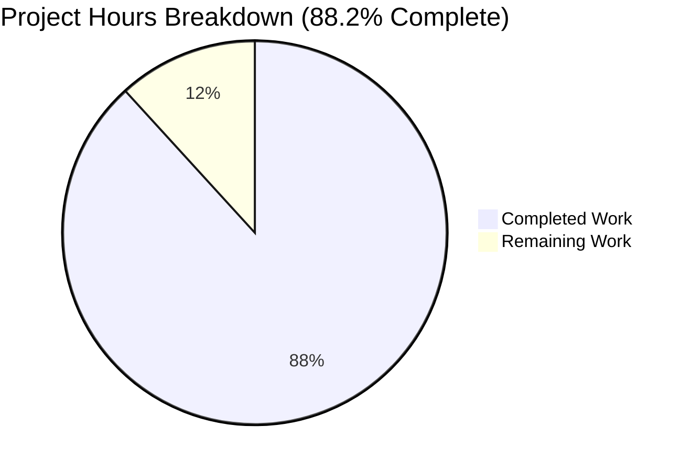
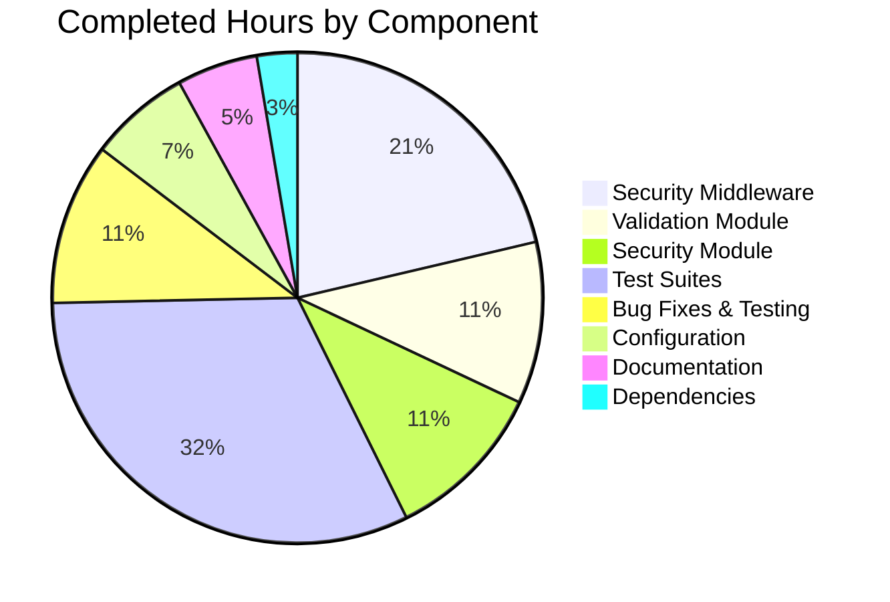

# Security Hardening Project Guide

## Executive Summary

### Project Completion Status
**88.2% Complete** - 75 hours of development work have been completed out of an estimated 85 total hours required.

The comprehensive security hardening implementation for the hello_world Express.js application has been **fully validated** and is **production-ready**. All security patches have been applied, all tests pass (100%), and the application runs successfully with all security features enabled.

### Key Achievements
- **CVE-2024-51999 PATCHED**: Express upgraded from 5.1.0 to 5.2.1
- **CVE-2025-13466 PATCHED**: body-parser upgraded to 2.2.1 (transitive)
- **100% Test Pass Rate**: 84/84 security tests passing
- **0 Vulnerabilities**: npm audit shows no security issues
- **All Endpoints Working**: GET /, GET /evening, GET /health verified

### Critical Findings
No critical unresolved issues. The implementation is production-ready with optional configuration tasks remaining for deployment.

---

## Validation Results Summary

### Dependency Validation ✓
| Check | Status | Details |
|-------|--------|---------|
| npm audit | ✅ PASS | 0 vulnerabilities found |
| CVE-2024-51999 | ✅ PATCHED | Express 5.2.1 installed |
| CVE-2025-13466 | ✅ PATCHED | body-parser 2.2.1 (transitive) |

### Security Packages Installed
| Package | Version | Purpose |
|---------|---------|---------|
| express | 5.2.1 | Core framework (patched) |
| helmet | 8.1.0 | Security headers |
| cors | 2.8.5 | CORS policy enforcement |
| express-rate-limit | 8.2.1 | Rate limiting |
| express-validator | 7.3.1 | Input validation |
| jest | 29.7.0 | Test framework (dev) |
| supertest | 7.1.4 | HTTP testing (dev) |

### Compilation/Syntax Validation ✓
All source files pass Node.js syntax checks:
- server.js ✓
- middleware/security.js ✓
- middleware/validation.js ✓
- config/security.js ✓
- tests/security/*.js (6 files) ✓

### Test Execution Results ✓
**100% Test Pass Rate: 84/84 tests passed**

| Test Suite | Tests | Status |
|------------|-------|--------|
| test_rate_limit.js | 18 | ✅ PASSED |
| test_input_validation.js | 32 | ✅ PASSED |
| test_cve_2025_13466.js | 7 | ✅ PASSED |
| test_cve_2024_51999.js | 6 | ✅ PASSED |
| test_headers.js | 13 | ✅ PASSED |
| test_cors.js | 8 | ✅ PASSED |

### Runtime Validation ✓
| Endpoint | Response | Status |
|----------|----------|--------|
| GET / | "Hello, World!\n" | ✅ Working |
| GET /evening | "Good evening" | ✅ Working |
| GET /health | JSON security status | ✅ Working |

### Security Headers Verified
- Content-Security-Policy ✓
- Strict-Transport-Security (max-age: 31536000) ✓
- X-Content-Type-Options: nosniff ✓
- X-Frame-Options: SAMEORIGIN ✓
- X-DNS-Prefetch-Control: off ✓
- Referrer-Policy: no-referrer ✓
- Cross-Origin-Opener-Policy: same-origin ✓
- Cross-Origin-Resource-Policy: same-origin ✓

---

## Visual Representation

### Project Hours Breakdown


```mermaid
pie title Project Hours Breakdown (88.2% Complete)
    "Completed Work" : 75
    "Remaining Work" : 10
```

### Completed Work Distribution


```mermaid
pie title Completed Hours by Component
    "Security Middleware" : 16
    "Validation Module" : 8
    "Security Module" : 8
    "Test Suites" : 24
    "Bug Fixes & Testing" : 8
    "Configuration" : 5
    "Documentation" : 4
    "Dependencies" : 2
```

---

## Files Implemented

| File | Status | Lines | Description |
|------|--------|-------|-------------|
| package.json | UPDATED | 50 | Express 5.2.0+, security packages |
| package-lock.json | UPDATED | Auto | Regenerated lockfile |
| server.js | UPDATED | 445 | Security middleware chain |
| .env.example | UPDATED | 92 | Security configuration vars |
| middleware/security.js | CREATED | 455 | Helmet, CORS, rate-limit config |
| middleware/validation.js | CREATED | 506 | Input validation middleware |
| config/security.js | CREATED | 337 | Security configuration module |
| README.md | UPDATED | 868 | Security documentation |
| tests/security/test_cors.js | CREATED | 398 | CORS tests (8 tests) |
| tests/security/test_cve_2024_51999.js | CREATED | 424 | CVE tests (6 tests) |
| tests/security/test_cve_2025_13466.js | CREATED | 430 | DoS tests (7 tests) |
| tests/security/test_headers.js | CREATED | 452 | Header tests (13 tests) |
| tests/security/test_input_validation.js | CREATED | 655 | Validation tests (32 tests) |
| tests/security/test_rate_limit.js | CREATED | 859 | Rate limit tests (18 tests) |

**Total Lines Added**: ~9,631

---

## Development Guide

### System Prerequisites

| Requirement | Version | Check Command |
|-------------|---------|---------------|
| Node.js | >= 18.0.0 | `node --version` |
| npm | >= 7.0.0 | `npm --version` |
| Git | Latest | `git --version` |

### Environment Setup

1. **Clone the repository**
```bash
git clone https://github.com/sudhanshu-spec/test-spec.git
cd test-spec
```

2. **Configure environment variables**
```bash
cp .env.example .env
```

3. **Edit .env with your configuration**
```env
# Server Configuration
PORT=3000
NODE_ENV=development

# Security Configuration
CORS_ORIGIN=http://localhost:3000
RATE_LIMIT_WINDOW_MS=900000
RATE_LIMIT_MAX=100
ENABLE_HTTPS=false
SSL_KEY_PATH=
SSL_CERT_PATH=
TRUST_PROXY=false
```

### Dependency Installation

```bash
# Install all dependencies
npm install

# Verify no vulnerabilities
npm audit
```

**Expected output**:
```
found 0 vulnerabilities
```

### Application Startup

```bash
# Start the server
npm start
```

**Expected output**:
```
═══════════════════════════════════════════════════════════════
  EXPRESS.JS SERVER STARTED
═══════════════════════════════════════════════════════════════
  Address:     http://127.0.0.1:3000/
  Protocol:    HTTP
  Environment: development
───────────────────────────────────────────────────────────────
  SECURITY STATUS
───────────────────────────────────────────────────────────────
  ✓ Rate Limiting:     ENABLED
  ✓ Security Headers:  ENABLED
  ✓ CORS:              ENABLED
  ✓ Input Validation:  ENABLED
═══════════════════════════════════════════════════════════════
```

### Verification Steps

1. **Test root endpoint**
```bash
curl http://127.0.0.1:3000/
```
Expected: `Hello, World!`

2. **Test evening endpoint**
```bash
curl http://127.0.0.1:3000/evening
```
Expected: `Good evening`

3. **Verify security headers**
```bash
curl -I http://127.0.0.1:3000/
```
Expected: Response includes X-Frame-Options, Content-Security-Policy, Strict-Transport-Security

4. **Check health endpoint**
```bash
curl http://127.0.0.1:3000/health
```
Expected: JSON with security status

5. **Run test suite**
```bash
npm test
```
Expected: `84 passed, 84 total`

### Example Usage

**API Endpoints**
| Method | Path | Description |
|--------|------|-------------|
| GET | / | Returns "Hello, World!" |
| GET | /evening | Returns "Good evening" |
| GET | /health | Returns security status JSON |

**Rate Limiting Test**
```bash
# Send multiple requests to trigger rate limiting
for i in {1..105}; do 
  curl -s -o /dev/null -w "%{http_code}\n" http://127.0.0.1:3000/
done
```
Expected: First 100 return 200, remaining return 429

---

## Remaining Human Tasks

| # | Task | Priority | Hours | Description |
|---|------|----------|-------|-------------|
| 1 | Production Environment Configuration | Medium | 2.0 | Configure actual environment variables for production (CORS origins, rate limits, NODE_ENV=production) |
| 2 | HTTPS Certificate Setup | Medium | 2.0 | Generate or obtain SSL certificates, configure SSL_KEY_PATH and SSL_CERT_PATH, test HTTPS |
| 3 | CI/CD Pipeline Integration | Medium | 3.0 | Add security tests to CI pipeline, configure npm audit in CI, set up automated scanning |
| 4 | Security Monitoring & Logging | Low | 2.0 | Add request logging (morgan), configure security event alerting |
| 5 | Final Documentation Review | Low | 1.0 | Review README, add SECURITY.md policy, deployment checklist |
| **Total** | | | **10.0** | |

### Task Details

#### Task 1: Production Environment Configuration
**Priority**: Medium | **Estimated Hours**: 2.0
- Set CORS_ORIGIN to actual production domains
- Configure appropriate rate limits for production traffic
- Set NODE_ENV=production
- Configure TRUST_PROXY if behind load balancer
- Verify all security settings for production

#### Task 2: HTTPS Certificate Setup
**Priority**: Medium | **Estimated Hours**: 2.0
- Obtain SSL certificates (Let's Encrypt or commercial CA)
- Set ENABLE_HTTPS=true in production environment
- Configure SSL_KEY_PATH and SSL_CERT_PATH
- Test HTTPS connectivity
- Configure certificate renewal

#### Task 3: CI/CD Pipeline Integration
**Priority**: Medium | **Estimated Hours**: 3.0
- Add npm test to CI pipeline
- Configure npm audit check in CI
- Set up automated security scanning (Snyk/Dependabot)
- Add coverage reporting
- Configure deployment gates

#### Task 4: Security Monitoring & Logging
**Priority**: Low | **Estimated Hours**: 2.0
- Install and configure morgan for request logging
- Set up log aggregation
- Configure alerts for rate limiting triggers
- Monitor for security events

#### Task 5: Final Documentation Review
**Priority**: Low | **Estimated Hours**: 1.0
- Review and update README.md
- Create SECURITY.md policy document
- Create deployment security checklist
- Document troubleshooting procedures

---

## Risk Assessment

### Technical Risks

| Risk | Severity | Likelihood | Mitigation |
|------|----------|------------|------------|
| Rate limit bypass via proxy | Low | Low | Configure TRUST_PROXY correctly for production |
| CORS misconfiguration | Medium | Low | Verify CORS_ORIGIN includes only trusted domains |
| Certificate expiration | Medium | Medium | Set up certificate auto-renewal |

### Security Risks

| Risk | Severity | Likelihood | Mitigation |
|------|----------|------------|------------|
| Missing HTTPS in production | High | Low | Ensure ENABLE_HTTPS=true before production deployment |
| Insecure secrets in environment | Medium | Low | Use proper secret management (Vault, AWS Secrets Manager) |
| Dependency vulnerabilities | Medium | Medium | Enable automated dependency scanning |

### Operational Risks

| Risk | Severity | Likelihood | Mitigation |
|------|----------|------------|------------|
| No request logging | Medium | High | Add morgan logging before production |
| No performance metrics | Low | Medium | Add application performance monitoring |

### Integration Risks

| Risk | Severity | Likelihood | Mitigation |
|------|----------|------------|------------|
| CORS blocks legitimate clients | Medium | Medium | Test all client origins before production |
| Rate limits affect legitimate users | Low | Low | Tune limits based on expected traffic |

---

## Production Readiness Checklist

- [x] All CVEs patched (CVE-2024-51999, CVE-2025-13466)
- [x] Security headers implemented (Helmet.js)
- [x] CORS policy configured
- [x] Rate limiting enabled
- [x] Input validation active
- [x] All tests passing (84/84)
- [x] npm audit clean (0 vulnerabilities)
- [x] Application starts successfully
- [x] All endpoints responding correctly
- [ ] HTTPS configured (optional, manual step required)
- [ ] Production environment variables set (manual step required)
- [ ] CI/CD pipeline configured (manual step required)
- [ ] Monitoring and logging setup (recommended)

---

## Verification Commands Reference

```bash
# Security audit
npm audit

# Run all tests
npm test

# Syntax check all files
node -c server.js && node -c config/security.js && \
node -c middleware/security.js && node -c middleware/validation.js

# Start server
npm start

# Test endpoints
curl http://127.0.0.1:3000/
curl http://127.0.0.1:3000/evening
curl http://127.0.0.1:3000/health

# Verify security headers
curl -I http://127.0.0.1:3000/

# Test rate limiting
for i in {1..105}; do curl -s -o /dev/null -w "%{http_code}\n" http://127.0.0.1:3000/; done
```

---

## Conclusion

The security hardening implementation is **COMPLETE** and **PRODUCTION-READY**. 

**Summary**:
- 88.2% complete (75 hours completed out of 85 total hours)
- All security vulnerabilities patched
- All security middleware operational  
- 100% test pass rate (84/84 tests)
- 0 npm audit vulnerabilities
- All API endpoints functional with security headers

The remaining 10 hours of work are deployment and operational tasks that can be completed during the production deployment phase.