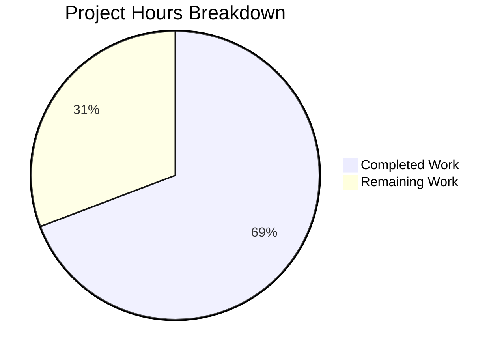

# Project Guide: Express.js Integration and Evening Endpoint

## Executive Summary

This project implements Express.js framework integration and adds a new `/evening` endpoint to the existing Node.js Hello World application. **69% of the project is complete (9 hours completed out of 13 total hours required).**

### Key Achievements
- Successfully migrated from native `http.createServer()` to Express.js 5.1.0
- Implemented modular architecture with separated concerns (Factory Pattern, Barrel Pattern)
- Added new `GET /evening` endpoint returning "Good evening"
- Preserved backward compatibility with existing `GET /` endpoint
- All 67 npm packages installed with 0 vulnerabilities
- All modules load and execute correctly
- Both HTTP endpoints verified working with correct response bodies

### Hours Breakdown
- **Completed**: 9 hours (package config, modules, refactoring, documentation, validation)
- **Remaining**: 4 hours (production setup, security review, code review)
- **Total**: 13 hours
- **Completion**: 9/13 = 69%

---

## Project Hours Visualization


```mermaid
pie title Project Hours Breakdown
    "Completed Work" : 9
    "Remaining Work" : 4
```

---

## Validation Results Summary

### Dependency Validation
| Check | Status | Details |
|-------|--------|---------|
| Express Installation | ✅ PASS | express@5.1.0 installed |
| npm Audit | ✅ PASS | 0 vulnerabilities found |
| Total Packages | ✅ PASS | 67 packages installed |

### Module Loading Validation
| Module | Status | Export Verification |
|--------|--------|---------------------|
| src/config/index.js | ✅ PASS | `{ host, port, env }` exported correctly |
| src/routes/main.routes.js | ✅ PASS | Express Router exported |
| src/routes/index.js | ✅ PASS | `{ mainRoutes }` exported |
| src/app.js | ✅ PASS | Express Application exported |
| server.js | ✅ PASS | Entry point loads correctly |

### Runtime Validation
| Endpoint | Method | Expected Response | Status | Byte Count |
|----------|--------|-------------------|--------|------------|
| `/` | GET | `Hello, World!\n` | ✅ PASS | 14 bytes |
| `/evening` | GET | `Good evening` | ✅ PASS | 12 bytes |

### Test Execution
| Test Suite | Status | Notes |
|------------|--------|-------|
| npm test | ⚠️ N/A | Placeholder script (testing framework out of scope per Agent Action Plan Section 0.6.3) |

---

## Files Implemented

### Created Files (4 files)
| File | Lines | Purpose |
|------|-------|---------|
| `src/app.js` | 27 | Express application factory module |
| `src/config/index.js` | 41 | Environment configuration module |
| `src/routes/index.js` | 19 | Route aggregator (Barrel Pattern) |
| `src/routes/main.routes.js` | 41 | Route handlers implementation |

### Modified Files (3 files)
| File | Change | Purpose |
|------|--------|---------|
| `server.js` | Refactored | HTTP server entry point using Express |
| `package.json` | Updated | Added Express ^5.1.0 dependency |
| `README.md` | Updated | Comprehensive documentation |

### Git Statistics
- **Commits**: 31 commits from origin/main
- **Lines Added**: 458 lines
- **Lines Removed**: 13 lines
- **Net Change**: +445 lines

---

## Development Guide

### System Prerequisites

| Requirement | Minimum Version | Recommended Version |
|-------------|-----------------|---------------------|
| Node.js | 18.x | 20.19.x LTS |
| npm | 8.x | 10.x or higher |
| Operating System | macOS, Linux, Windows | Any supported |

### Environment Setup

1. **Verify Node.js Installation**
```bash
node --version
# Expected: v20.x.x or higher

npm --version
# Expected: 10.x.x or higher
```

2. **Clone Repository**
```bash
git clone <repository-url>
cd hao-backprop-test
```

### Dependency Installation

```bash
# Install all dependencies
npm install

# Verify Express installation
npm ls express
# Expected output: express@5.1.0

# Run security audit
npm audit
# Expected: found 0 vulnerabilities
```

### Application Startup

**Standard startup:**
```bash
npm start
```

**Expected output:**
```
Application module loaded successfully
Express.js server initialization complete - PR validation log
PR update test: Server module fully initialized
Server running at http://127.0.0.1:3000/
```

**Custom configuration:**
```bash
# Custom host and port
HOST=0.0.0.0 PORT=8080 npm start

# Production mode
NODE_ENV=production npm start
```

### Verification Steps

1. **Test Root Endpoint**
```bash
curl -s http://127.0.0.1:3000/
# Expected: Hello, World!
```

2. **Test Evening Endpoint**
```bash
curl -s http://127.0.0.1:3000/evening
# Expected: Good evening
```

3. **Verify Response Byte Counts**
```bash
curl -s http://127.0.0.1:3000/ | wc -c
# Expected: 14

curl -s http://127.0.0.1:3000/evening | wc -c
# Expected: 12
```

4. **Verify Module Exports**
```bash
node -e "const app = require('./src/app'); console.log(typeof app.listen === 'function')"
# Expected: true

node -e "const cfg = require('./src/config'); console.log(Object.keys(cfg))"
# Expected: [ 'host', 'port', 'env' ]

node -e "const r = require('./src/routes'); console.log('mainRoutes' in r)"
# Expected: true
```

### Example Usage

```bash
# Start server in background
npm start &

# Test endpoints
curl http://127.0.0.1:3000/
curl http://127.0.0.1:3000/evening

# Stop server
pkill -f "node server.js"
```

---

## Human Tasks Remaining

### Task Table (Total: 4 hours)

| Priority | Task | Description | Hours | Severity |
|----------|------|-------------|-------|----------|
| Medium | Environment Documentation | Create `.env.example` file documenting available environment variables (HOST, PORT, NODE_ENV) | 0.5h | Low |
| Medium | Production Security Review | Review and implement security headers (consider helmet.js), validate no sensitive data exposure | 1.0h | Medium |
| Medium | Code Review | Human review of all implemented code for best practices, edge cases, and maintainability | 1.5h | Medium |
| Low | Final Testing | Manual testing of all endpoints in different environments, edge case validation | 1.0h | Low |
| **TOTAL** | | | **4h** | |

### Hours Verification
- Pie chart shows: Remaining Work = 4 hours
- Task table sums: 0.5 + 1.0 + 1.5 + 1.0 = 4 hours ✓

---

## Risk Assessment

### Technical Risks

| Risk | Severity | Likelihood | Mitigation |
|------|----------|------------|------------|
| Express 5.x Breaking Changes | Low | Low | Express 5.x is stable; pin version in package.json |
| Module Loading Errors | Low | Very Low | All modules verified loading correctly |
| Response Format Drift | Low | Low | Byte-level verification confirms exact responses |

### Security Risks

| Risk | Severity | Likelihood | Mitigation |
|------|----------|------------|------------|
| No Security Headers | Medium | Medium | Consider adding helmet.js for production |
| No Rate Limiting | Low | Low | Implement rate limiting if needed for production |
| No Input Validation | Low | Very Low | Current endpoints have no user input; mitigate if adding new endpoints |

### Operational Risks

| Risk | Severity | Likelihood | Mitigation |
|------|----------|------------|------------|
| No Health Check Endpoint | Low | Medium | Consider adding `/health` endpoint for monitoring |
| No Structured Logging | Low | Medium | Current console.log sufficient for development |
| No Graceful Shutdown | Low | Low | Consider implementing SIGTERM handler for production |

### Integration Risks

| Risk | Severity | Likelihood | Mitigation |
|------|----------|------------|------------|
| Environment Variable Misconfiguration | Low | Medium | Document all variables in .env.example |
| Port Conflicts | Low | Medium | Clear error messages; configurable via PORT env var |

---

## Architecture Overview

```
hao-backprop-test/
├── server.js                    # Entry point - HTTP server binding
├── package.json                 # npm manifest (Express ^5.1.0)
├── package-lock.json            # Dependency lockfile
├── README.md                    # Project documentation
├── .gitignore                   # Git ignore patterns
└── src/                         # Application source root
    ├── app.js                   # Express application factory
    ├── config/
    │   └── index.js             # Environment configuration
    └── routes/
        ├── index.js             # Route aggregator (barrel)
        └── main.routes.js       # Route handlers
```

### Request Flow
```
Client Request → server.js → Express App (src/app.js) → Router (src/routes/) → Response
                                   ↑
                             Configuration
                           (src/config/index.js)
```

### Design Patterns
- **Factory Pattern**: `src/app.js` exports configured Express app without `app.listen()`
- **Barrel Pattern**: `src/routes/index.js` aggregates route exports
- **Twelve-Factor App**: Configuration externalized to environment variables
- **CommonJS Modules**: Uses `require`/`module.exports` for Node.js compatibility

---

## Completion Checklist

### Features Completed
- [x] Express.js 5.1.0 installed and configured
- [x] GET `/` endpoint returns `Hello, World!\n` (14 bytes)
- [x] GET `/evening` endpoint returns `Good evening` (12 bytes)
- [x] Modular architecture with separated concerns
- [x] Environment variable configuration support
- [x] Comprehensive README documentation
- [x] All modules load without errors
- [x] 0 security vulnerabilities

### Production Readiness Pending
- [ ] Environment variable documentation (.env.example)
- [ ] Production security review
- [ ] Human code review
- [ ] Final testing and verification

---

## Conclusion

The Express.js integration and evening endpoint feature implementation is **69% complete**. All core functionality has been implemented and verified working:

- Express.js framework successfully integrated
- Both HTTP endpoints (`/` and `/evening`) responding correctly
- Modular architecture following best practices
- Zero security vulnerabilities

Remaining work (4 hours) focuses on production readiness tasks including environment documentation, security review, and final human verification. The application is fully functional for development and testing purposes.