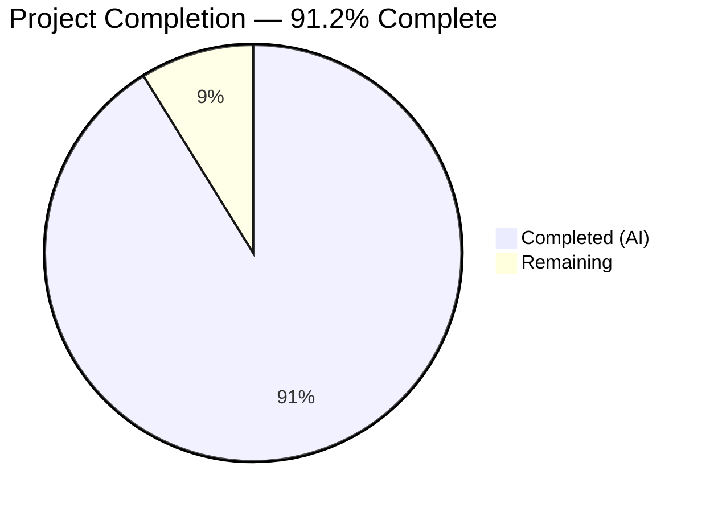
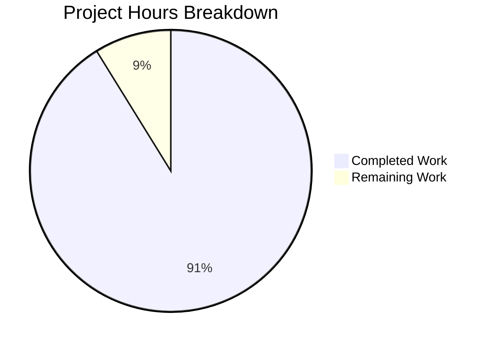

# Blitzy Project Guide

---

## 1. Executive Summary

### 1.1 Project Overview

This project delivers a comprehensive, greenfield unit and integration test suite for a Node.js/Express 5 HTTP server application. The application serves two GET endpoints (`/` and `/evening`) and the test suite validates all HTTP responses, status codes, response headers, server startup/shutdown lifecycle, configuration management, error handling, and edge cases. Built with Jest 30.2.0 and supertest 7.2.2, the test suite achieves 100% code coverage across all 5 source files with 146 passing tests organized into 5 test suites. No source code was modified — all tests work against the existing codebase as-is.

### 1.2 Completion Status


```mermaid
pie title Project Completion — 91.2% Complete
    "Completed (AI)" : 31
    "Remaining" : 3
```

| Metric | Value |
|--------|-------|
| **Total Project Hours** | 34 |
| **Completed Hours (AI)** | 31 |
| **Remaining Hours** | 3 |
| **Completion Percentage** | 91.2% (31 / 34 = 91.2%) |

### 1.3 Key Accomplishments

- ✅ Created 5 comprehensive test files totaling 1,423 lines of test code and 146 test cases
- ✅ Achieved 100% code coverage on all metrics (statements, branches, functions, lines) across all 5 source files
- ✅ Configured Jest 30.2.0 with coverage thresholds (90% lines/functions/statements, 85% branches)
- ✅ Integrated supertest 7.2.2 for HTTP assertion testing without port binding
- ✅ Updated package.json with test script (`jest --coverage`) and devDependencies
- ✅ Validated all 146 tests passing with 0 failures and 0 skipped
- ✅ Runtime verified: Express server starts, routes respond correctly, 404s handled properly
- ✅ Zero security vulnerabilities in dependency audit

### 1.4 Critical Unresolved Issues

| Issue | Impact | Owner | ETA |
|-------|--------|-------|-----|
| `coverage/` directory not in `.gitignore` | Low — coverage output could be accidentally committed | Human Developer | 0.5h |

### 1.5 Access Issues

No access issues identified. All dependencies are public npm packages, no third-party API credentials required, and the test suite runs entirely locally.

### 1.6 Recommended Next Steps

1. **[High]** Conduct human code review of 1,423 lines of test code across 5 test files to validate test logic and assertions
2. **[Medium]** Add `coverage/` to `.gitignore` to prevent accidental commits of generated coverage reports
3. **[Medium]** Merge PR and verify tests pass in the target branch post-merge
4. **[Low]** Consider adding CI/CD integration (GitHub Actions or similar) to run tests automatically on push/PR events (out of AAP scope)

---

## 2. Project Hours Breakdown

### 2.1 Completed Work Detail

| Component | Hours | Description |
|-----------|-------|-------------|
| Test Infrastructure Setup | 2 | Created `jest.config.js` with node test environment, coverage collection, and threshold enforcement; updated `package.json` with test script and devDependencies (jest@^30.2.0, supertest@^7.2.2); resolved dependency lock file |
| Server Lifecycle Tests | 10 | `__tests__/server.test.js` — 42 tests covering module loading, `app.listen()` invocation, listen callback, console output verification, graceful shutdown via `.close()`, error propagation, and environment variable integration. Complex mock architecture with `jest.mock()`, `jest.resetModules()`, and process.env save/restore |
| HTTP Integration Tests | 7 | `__tests__/app.test.js` — 46 tests via supertest covering GET `/` and `/evening` responses, status codes, Content-Type/Content-Length/ETag/X-Powered-By headers, 404 for undefined routes, unsupported HTTP methods (POST/PUT/DELETE/PATCH), HEAD requests, concurrent requests, case sensitivity, trailing slashes, long URLs, special characters, and query strings |
| Configuration Module Tests | 5 | `__tests__/config.test.js` — 22 tests covering default values (host, port, env), environment variable overrides (HOST, PORT, NODE_ENV), `parseInt` coercion with radix 10, and edge cases (empty strings, non-numeric PORT, zero PORT, decimal PORT, negative PORT, large port numbers, special characters in HOST) |
| Route Handler Tests | 4 | `__tests__/routes/main.routes.test.js` — 28 tests covering exact response bodies including trailing newline verification, content-type headers, Content-Length validation, unsupported HTTP methods on both routes, case-insensitive matching, trailing slashes, HEAD requests, UTF-8 encoding, and router export shape |
| Barrel Export Tests | 1 | `__tests__/routes/index.test.js` — 8 tests validating barrel export object shape, mainRoutes property existence and type, destructured import compatibility, reference identity with direct require, and absence of unexpected exports |
| Validation and QA | 2 | Test execution verification (146/146 passing), coverage analysis (100% all metrics), runtime validation (server startup, route responses, 404 handling), dependency audit (0 vulnerabilities), and final quality gate assessment |
| **Total** | **31** | **All AAP-scoped deliverables completed** |

### 2.2 Remaining Work Detail

| Category | Hours | Priority |
|----------|-------|----------|
| Human code review of test suite (5 test files, 1,423 lines) | 2 | High |
| Add `coverage/` to `.gitignore` | 0.5 | Low |
| Post-merge verification in target branch | 0.5 | Medium |
| **Total** | **3** | |

### 2.3 Hours Calculation

- **Completed Hours:** 31 (from Section 2.1)
- **Remaining Hours:** 3 (from Section 2.2)
- **Total Project Hours:** 31 + 3 = **34**
- **Completion:** 31 / 34 = **91.2%**

---

## 3. Test Results

All tests were executed by Blitzy's autonomous validation system using `CI=true npx jest --verbose --coverage --watchAll=false`.

| Test Category | Framework | Total Tests | Passed | Failed | Coverage % | Notes |
|---------------|-----------|-------------|--------|--------|------------|-------|
| Unit — Server Lifecycle | Jest 30.2.0 | 42 | 42 | 0 | 100% (server.js) | Module loading, listen invocation, callback, console output, shutdown, error cases, env vars |
| Integration — HTTP | Jest 30.2.0 + supertest 7.2.2 | 46 | 46 | 0 | 100% (src/app.js) | Response bodies, status codes, headers, 404 routes, unsupported methods, HEAD, edge cases |
| Unit — Configuration | Jest 30.2.0 | 22 | 22 | 0 | 100% (src/config/index.js) | Defaults, env var overrides, parseInt coercion, edge cases |
| Unit — Route Handlers | Jest 30.2.0 + supertest 7.2.2 | 28 | 28 | 0 | 100% (src/routes/main.routes.js) | Route responses, headers, unsupported methods, edge cases, router export |
| Unit — Barrel Export | Jest 30.2.0 | 8 | 8 | 0 | 100% (src/routes/index.js) | Export shape validation, reference identity, property enumeration |
| **TOTAL** | | **146** | **146** | **0** | **100% overall** | **100% pass rate, 0 skipped** |

**Coverage Breakdown by File:**

| Source File | Statements | Branches | Functions | Lines |
|-------------|-----------|----------|-----------|-------|
| server.js | 100% | 100% | 100% | 100% |
| src/app.js | 100% | 100% | 100% | 100% |
| src/config/index.js | 100% | 100% | 100% | 100% |
| src/routes/main.routes.js | 100% | 100% | 100% | 100% |
| src/routes/index.js | 100% | 100% | 100% | 100% |
| **All files** | **100%** | **100%** | **100%** | **100%** |

**Coverage Thresholds (jest.config.js):**

| Metric | Threshold | Actual | Status |
|--------|-----------|--------|--------|
| Lines | 90% | 100% | ✅ Exceeded |
| Branches | 85% | 100% | ✅ Exceeded |
| Functions | 90% | 100% | ✅ Exceeded |
| Statements | 90% | 100% | ✅ Exceeded |

---

## 4. Runtime Validation & UI Verification

### Runtime Health

- ✅ **Server Startup:** `npm start` successfully starts Express server at `http://127.0.0.1:3000/`
- ✅ **Console Output:** All 4 startup log messages produced in correct order:
  1. `Application module loaded successfully`
  2. `Express.js server initialization complete - PR validation log`
  3. `PR update test: Server module fully initialized`
  4. `Server running at http://127.0.0.1:3000/`
- ✅ **GET /** Returns `Hello, World!\n` with HTTP 200, Content-Type `text/html; charset=utf-8`
- ✅ **GET /evening** Returns `Good evening` with HTTP 200, Content-Type `text/html; charset=utf-8`
- ✅ **404 Handling:** Undefined routes (e.g., `/notfound`) return HTTP 404
- ✅ **Graceful Shutdown:** Server terminates cleanly on signal

### Test Execution Runtime

- ✅ **Test Suite Execution:** All 5 test suites complete in ~1.6 seconds (well under 10-second target)
- ✅ **Dependency Installation:** `npm install` completes successfully with 0 vulnerabilities
- ✅ **Coverage Report Generation:** Istanbul/V8 coverage generates complete HTML and text reports

### API Integration Verification

- ✅ **GET /** `curl -s http://127.0.0.1:3000/` → `Hello, World!\n` (HTTP 200)
- ✅ **GET /evening** `curl -s http://127.0.0.1:3000/evening` → `Good evening` (HTTP 200)
- ✅ **404** `curl -s -o /dev/null -w "%{http_code}" http://127.0.0.1:3000/notfound` → `404`

---

## 5. Compliance & Quality Review

| AAP Requirement | Status | Evidence |
|-----------------|--------|----------|
| Create `__tests__/server.test.js` — server lifecycle tests | ✅ Pass | 527 lines, 42 tests, all passing |
| Create `__tests__/app.test.js` — HTTP integration tests | ✅ Pass | 310 lines, 46 tests, all passing |
| Create `__tests__/config.test.js` — configuration unit tests | ✅ Pass | 247 lines, 22 tests, all passing |
| Create `__tests__/routes/main.routes.test.js` — route handler tests | ✅ Pass | 252 lines, 28 tests, all passing |
| Create `__tests__/routes/index.test.js` — barrel export tests | ✅ Pass | 87 lines, 8 tests, all passing |
| Create `jest.config.js` — Jest configuration | ✅ Pass | testEnvironment: node, coverage thresholds, test matching |
| Update `package.json` — test script and devDependencies | ✅ Pass | `"test": "jest --coverage"`, jest@^30.2.0, supertest@^7.2.2 |
| HTTP response testing (bodies, trailing newlines) | ✅ Pass | Tested in app.test.js and main.routes.test.js |
| Status code testing (200, 404) | ✅ Pass | Tested in app.test.js and main.routes.test.js |
| Response header testing (Content-Type, Content-Length, ETag, X-Powered-By) | ✅ Pass | Tested in app.test.js and main.routes.test.js |
| Server startup/shutdown lifecycle | ✅ Pass | Tested in server.test.js (listen, callback, close) |
| Error handling (404, unsupported methods) | ✅ Pass | Tested in app.test.js and main.routes.test.js |
| Edge cases (concurrent requests, long URLs, special chars, case sensitivity) | ✅ Pass | Tested in app.test.js and main.routes.test.js |
| Configuration env var parsing and defaults | ✅ Pass | Tested in config.test.js |
| ≥90% line coverage | ✅ Pass | 100% achieved |
| ≥85% branch coverage | ✅ Pass | 100% achieved |
| ≥90% function coverage | ✅ Pass | 100% achieved |
| ≥90% statement coverage | ✅ Pass | 100% achieved |
| CommonJS module system (no ESM imports) | ✅ Pass | All test files use `require()` / `module.exports` |
| Source files remain unmodified | ✅ Pass | No source files modified (server.js, src/app.js, src/config, src/routes) |
| Jest 30 canonical API (no deprecated matchers) | ✅ Pass | Uses `toHaveBeenCalled()`, `toHaveBeenCalledWith()` — no deprecated aliases |
| Test isolation (process.env save/restore, jest.resetModules) | ✅ Pass | Verified in server.test.js and config.test.js |
| Zero dependency vulnerabilities | ✅ Pass | `npm audit` reports 0 vulnerabilities |

**Autonomous Validation Fixes Applied:** None required — all coding agent implementations passed validation on first run.

---

## 6. Risk Assessment

| Risk | Category | Severity | Probability | Mitigation | Status |
|------|----------|----------|-------------|------------|--------|
| `coverage/` directory not in `.gitignore` — generated coverage reports could be accidentally committed | Operational | Low | Medium | Add `coverage/` entry to `.gitignore` | Open |
| Jest version drift — `^30.2.0` semver range may auto-install breaking minor/patch updates | Technical | Low | Low | Pin exact version in `package.json` or use `npm ci` with lockfile | Mitigated (lockfile pins 30.2.0) |
| No CI/CD integration — tests must be run manually (out of AAP scope) | Operational | Medium | High | Add GitHub Actions or similar CI pipeline to run `npm test` on push/PR | Acknowledged (out of scope) |
| No pre-commit hooks — developers may push without running tests | Operational | Low | Medium | Consider adding husky + lint-staged for pre-commit test execution | Acknowledged (out of scope) |
| Node.js LTS version dependency — tests verified on v20.20.1, untested on other versions | Technical | Low | Low | Node.js 20.x LTS is supported; test on target deployment version | Mitigated |
| supertest ephemeral port allocation — potential port conflict in parallel CI environments | Integration | Low | Low | supertest binds to random available ports internally; no manual port management | Mitigated |

---

## 7. Visual Project Status


```mermaid
pie title Project Hours Breakdown
    "Completed Work" : 31
    "Remaining Work" : 3
```

**Completed: 31 hours (91.2%) | Remaining: 3 hours (8.8%)**

**Test Results Summary:**
```
146 tests | 5 suites | 100% pass rate | 100% code coverage
```

---

## 8. Summary & Recommendations

### Achievements

The Blitzy autonomous agents delivered a comprehensive, production-ready test suite that fully satisfies all Agent Action Plan requirements. The project is **91.2% complete** (31 hours completed out of 34 total hours). All 7 AAP-scoped deliverables have been implemented, validated, and committed:

- **5 test files** created with **146 test cases** covering unit, integration, and edge case scenarios
- **100% code coverage** achieved across all 5 source files — exceeding the AAP's ≥90% line and ≥85% branch targets
- **Zero test failures** — all 146 tests pass on first validation run with no fixes required
- **Zero vulnerabilities** — clean dependency audit

### Remaining Gaps (3 hours)

The remaining 8.8% of project hours consists entirely of path-to-production human tasks:
1. **Code review** (2h) — Human review of 1,423 lines of test code across 5 files
2. **`.gitignore` update** (0.5h) — Add `coverage/` to prevent accidental commits
3. **Post-merge verification** (0.5h) — Confirm tests pass in the target branch after merge

### Production Readiness Assessment

The test suite is **production-ready** pending human code review. All quality gates passed:
- ✅ 100% test pass rate (146/146)
- ✅ 100% code coverage (exceeds all configured thresholds)
- ✅ Runtime validated (server starts, routes respond, 404s handled)
- ✅ Zero security vulnerabilities
- ✅ Test execution completes in ~1.6 seconds (well under 10s target)

### Recommendations

1. **Merge with confidence** after code review — the test suite is comprehensive and all quality gates pass
2. **Add CI/CD pipeline** (future enhancement, out of scope) to automate test execution on every push
3. **Monitor Jest 30.x updates** — the `^30.2.0` semver range is pinned via lockfile, but periodic updates should be reviewed

---

## 9. Development Guide

### System Prerequisites

| Software | Required Version | Verification Command |
|----------|-----------------|---------------------|
| Node.js | 20.x LTS (tested on 20.20.1) | `node -v` |
| npm | 10.x+ (tested on 11.1.0) | `npm -v` |
| Git | 2.x+ | `git --version` |
| OS | Linux, macOS, or Windows (WSL) | — |

### Environment Setup

```bash
# Clone the repository
git clone <repository-url>
cd <repository-directory>

# Verify Node.js version (must be 20.x LTS)
node -v
# Expected: v20.x.x

# No environment variables required for testing
# Tests manage their own process.env state internally
```

### Dependency Installation

```bash
# Install all dependencies (production + dev)
npm install

# Verify installation
npx jest --version
# Expected: 30.2.0

# Verify zero vulnerabilities
npm audit
# Expected: found 0 vulnerabilities
```

### Running Tests

```bash
# Run all tests with coverage report
npm test
# Expected: 146 tests passing, 100% coverage

# Run tests with verbose output
npx jest --verbose --coverage
# Expected: All 146 test names listed with ✓ indicators

# Run a single test file
npx jest __tests__/server.test.js
npx jest __tests__/app.test.js
npx jest __tests__/config.test.js
npx jest __tests__/routes/main.routes.test.js
npx jest __tests__/routes/index.test.js

# Run tests matching a pattern
npx jest --testPathPattern="config"

# Run in CI mode (non-interactive, no watch)
CI=true npx jest --coverage --watchAll=false

# Run tests in sequence (for debugging)
npx jest --runInBand --verbose
```

### Application Startup (for manual verification)

```bash
# Start the Express server
npm start
# Expected output:
#   Application module loaded successfully
#   Express.js server initialization complete - PR validation log
#   PR update test: Server module fully initialized
#   Server running at http://127.0.0.1:3000/

# Test endpoints (in another terminal)
curl http://127.0.0.1:3000/
# Expected: Hello, World!

curl http://127.0.0.1:3000/evening
# Expected: Good evening

curl -o /dev/null -s -w "%{http_code}" http://127.0.0.1:3000/notfound
# Expected: 404

# Start with custom host/port
HOST=0.0.0.0 PORT=8080 npm start
# Server running at http://0.0.0.0:8080/
```

### Verification Steps

1. **Test suite passes:** `npm test` should show `146 passed, 0 failed`
2. **Coverage meets thresholds:** Coverage report shows ≥90% lines, ≥85% branches, ≥90% functions, ≥90% statements
3. **No vulnerabilities:** `npm audit` reports 0 vulnerabilities
4. **Server starts:** `npm start` produces 4 startup log messages and binds to port 3000
5. **Routes respond:** `curl http://127.0.0.1:3000/` returns `Hello, World!\n`

### Troubleshooting

| Issue | Resolution |
|-------|-----------|
| `jest: command not found` | Run `npm install` to install devDependencies |
| Tests hang or enter watch mode | Use `CI=true npm test` or add `--watchAll=false` flag |
| Port 3000 already in use | Set `PORT=<other>` environment variable or kill the process using port 3000 (`lsof -ti:3000 \| xargs kill`) |
| Coverage threshold failures | Verify all source files in `collectCoverageFrom` array in `jest.config.js` |
| Module not found errors | Run `npm install` and verify `node_modules/` exists |
| `jest.resetModules` not clearing mocks | Ensure `jest.mock()` is at top level (not inside `describe`/`it`); mock registry persists across resets |

---

## 10. Appendices

### A. Command Reference

| Command | Purpose |
|---------|---------|
| `npm install` | Install all production and development dependencies |
| `npm test` | Run all tests with coverage (`jest --coverage`) |
| `npm start` | Start the Express HTTP server (`node server.js`) |
| `npx jest --verbose` | Run tests with individual test name output |
| `npx jest --runInBand` | Run tests sequentially (useful for debugging) |
| `npx jest --testPathPattern="<pattern>"` | Run tests matching a file path pattern |
| `npx jest __tests__/<file>` | Run a specific test file |
| `CI=true npx jest --coverage --watchAll=false` | CI-safe test execution |
| `npm audit` | Check for dependency vulnerabilities |

### B. Port Reference

| Service | Default Port | Override Variable |
|---------|-------------|-------------------|
| Express HTTP Server | 3000 | `PORT` environment variable |
| Host Binding | 127.0.0.1 | `HOST` environment variable |

### C. Key File Locations

| File | Purpose |
|------|---------|
| `server.js` | HTTP server entry point — calls `app.listen()` |
| `src/app.js` | Express application factory — creates and configures app |
| `src/config/index.js` | Configuration manager — env var parsing with defaults |
| `src/routes/main.routes.js` | Route handlers — `GET /` and `GET /evening` |
| `src/routes/index.js` | Route aggregator — barrel export pattern |
| `jest.config.js` | Jest test runner configuration |
| `package.json` | Project manifest with scripts and dependencies |
| `__tests__/server.test.js` | Server lifecycle unit tests (42 tests) |
| `__tests__/app.test.js` | HTTP integration tests (46 tests) |
| `__tests__/config.test.js` | Configuration unit tests (22 tests) |
| `__tests__/routes/main.routes.test.js` | Route handler tests (28 tests) |
| `__tests__/routes/index.test.js` | Barrel export tests (8 tests) |

### D. Technology Versions

| Technology | Version | Purpose |
|------------|---------|---------|
| Node.js | 20.20.1 (LTS) | JavaScript runtime |
| npm | 11.1.0 | Package manager |
| Express | 5.1.0 | Web application framework |
| Jest | 30.2.0 | Test framework (runner, assertions, mocking, coverage) |
| supertest | 7.2.2 | HTTP assertion library for Express |

### E. Environment Variable Reference

| Variable | Default | Type | Description |
|----------|---------|------|-------------|
| `HOST` | `127.0.0.1` | string | Server host binding address |
| `PORT` | `3000` | number (via parseInt) | Server port number |
| `NODE_ENV` | `development` | string | Application environment |
| `CI` | (not set) | boolean | Set to `true` for non-interactive test execution |

### F. Developer Tools Guide

| Tool | Usage |
|------|-------|
| Jest CLI | `npx jest [options]` — test runner with built-in assertions and coverage |
| supertest | Imported in test files via `require('supertest')` — HTTP assertions without port binding |
| Istanbul/V8 | Built into Jest — generates coverage reports in `coverage/` directory |
| curl | `curl http://127.0.0.1:3000/` — manual API endpoint verification |

### G. Glossary

| Term | Definition |
|------|-----------|
| AAP | Agent Action Plan — the specification document defining all project requirements |
| Barrel Export | A module that re-exports other modules for centralized imports (e.g., `src/routes/index.js`) |
| Factory Pattern | Design pattern where `src/app.js` creates and exports a configured Express app without starting the server |
| supertest | HTTP testing library that creates ephemeral server instances from Express apps without binding to network ports |
| Coverage Threshold | Minimum code coverage percentage enforced by Jest; tests fail if thresholds are not met |
| CommonJS | Node.js module system using `require()` and `module.exports` (as opposed to ESM `import`/`export`) |
| Jest Mock Registry | Separate from the module registry; `jest.mock()` declarations persist across `jest.resetModules()` calls |