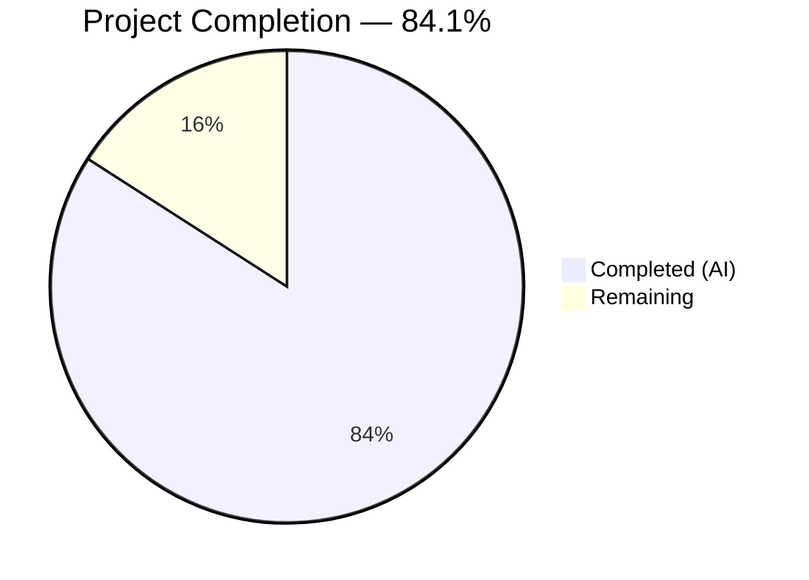

# Blitzy Project Guide — Collapsible Dashboard UI (ResizeObserver)

---

## 1. Executive Summary

### 1.1 Project Overview

This project adds a collapsible dashboard UI to an existing minimal Node.js/Express hello_world server (v1.0.0). The dashboard implements the native browser ResizeObserver Web API to automatically recalculate panel heights when content changes, enabling smooth CSS-animated expand/collapse transitions without relying on legacy approaches like `window.onresize` polling or `max-height` hacks. The feature is implemented entirely with vanilla HTML5, CSS3, and ES6+ JavaScript — requiring zero new npm dependencies. The server-side modification is limited to adding Express static file serving middleware and a convenience `/dashboard` route, with all existing endpoints preserved byte-for-byte.

### 1.2 Completion Status


```mermaid
pie title Project Completion — 84.1%
    "Completed (AI)" : 37
    "Remaining" : 7
```

| Metric | Value |
|---|---|
| **Total Project Hours** | 44h |
| **Completed Hours (AI)** | 37h |
| **Remaining Hours** | 7h |
| **Completion Percentage** | 84.1% (37h / 44h) |

**Calculation**: 37 completed hours / (37 completed + 7 remaining) = 37 / 44 = 84.1% complete.

### 1.3 Key Accomplishments

- [x] Modified `server.js` to serve static files via `express.static()` middleware with security headers
- [x] Created `public/dashboard.html` — semantic HTML5 dashboard with 4 collapsible panels and full ARIA accessibility
- [x] Created `public/css/dashboard.css` — 301-line stylesheet with CSS transitions, responsive design, and `prefers-reduced-motion` support
- [x] Created `public/js/collapsible-dashboard.js` — 280-line ResizeObserver-powered logic with observer lifecycle cleanup, `requestAnimationFrame` safety, and dynamic content demonstration
- [x] Created `tests/dashboard.test.js` — 10 integration tests covering endpoint preservation, static file serving, content validation, and error handling (10/10 pass)
- [x] Created `tests/resize-observer.test.html` — 7 browser-based tests validating ResizeObserver behavior (7/7 pass)
- [x] Existing endpoints preserved byte-for-byte: `GET /` → `"Hello, World!\n"`, `GET /evening` → `"Good evening"`
- [x] Security hardening: X-Content-Type-Options, X-Frame-Options, Content-Security-Policy headers added
- [x] Accessibility compliance: `<button>` panel headers, `aria-expanded`/`aria-hidden` toggling, keyboard focus management, skip-nav link
- [x] Zero new npm dependencies — ResizeObserver is a native browser API

### 1.4 Critical Unresolved Issues

| Issue | Impact | Owner | ETA |
|---|---|---|---|
| `package.json` test script still points to failing echo command | `npm test` returns exit code 1; does not run actual test suite | Human Developer | 0.5h |
| Cross-browser testing not performed in Safari/Firefox/Edge | Dashboard behavior unverified outside Chromium-based browsers | Human Developer / QA | 2h |

### 1.5 Access Issues

No access issues identified. The project runs entirely on localhost (127.0.0.1:3000) with no external service dependencies, API keys, or third-party credentials required.

### 1.6 Recommended Next Steps

1. **[High]** Update `package.json` test script to `"node --test tests/dashboard.test.js"` so `npm test` executes the integration suite
2. **[High]** Perform cross-browser testing in Safari, Firefox, and Edge to verify ResizeObserver behavior and CSS transitions
3. **[Medium]** Set up production deployment configuration (Docker, process manager, or hosting platform)
4. **[Medium]** Implement end-to-end automated browser testing with a headless browser framework (Playwright or Puppeteer)
5. **[Low]** Conduct code review, approve changes, and merge to production branch

---

## 2. Project Hours Breakdown

### 2.1 Completed Work Detail

| Component | Hours | Description |
|---|---|---|
| Server.js Modification | 3h | Added `path` import, `express.static()` middleware, `/dashboard` route via `res.sendFile()`, `x-powered-by` disabled |
| Dashboard HTML Page | 4h | Created `public/dashboard.html` — 119-line semantic HTML5 with 4 collapsible panels, ARIA attributes, skip-nav link, varied content (lists, tables, ordered lists, dynamic demo) |
| Dashboard CSS Stylesheet | 5h | Created `public/css/dashboard.css` — 301-line stylesheet with global reset, responsive layout, panel transitions (`height 300ms ease`), chevron rotation, hover states, `prefers-reduced-motion` support, mobile breakpoints |
| ResizeObserver JavaScript | 7h | Created `public/js/collapsible-dashboard.js` — 280-line IIFE with `handleResize()` callback (contentBoxSize + fallback), `togglePanel()` with ARIA sync, `updateWrapperFocusability()`, `cleanupObservers()` on beforeunload, `setupDynamicContentDemo()` handlers |
| Node.js Integration Tests | 5h | Created `tests/dashboard.test.js` — 382-line test file using Node.js built-in test runner, server lifecycle management (spawn/kill), 10 tests across 4 groups (endpoint preservation, static asset delivery, content validation, error handling) |
| Browser-Based ResizeObserver Tests | 4h | Created `tests/resize-observer.test.html` — 550-line self-contained browser test page with 7 async tests (API availability, initial observation, content addition/removal detection, height accuracy, disconnect, panel toggle attributes) |
| Accessibility Implementation | 3h | `<button>` panel headers, `aria-expanded` toggling, `aria-hidden` on collapsed wrappers, `tabindex` management for focusable elements in hidden regions, skip-nav link, focus-visible outlines |
| Bug Fixes and Quality | 4h | Fixed 3 CSS color contrast violations (WCAG 2.1 AA), corrected 3 CSS color values per AAP spec, resolved content clipping in panels, fixed CWE-79 innerHTML XSS vulnerability (switched to textContent), resolved aria-hidden focusability issues |
| Security Hardening | 2h | Added security headers middleware (X-Content-Type-Options: nosniff, X-Frame-Options: DENY, Content-Security-Policy), disabled x-powered-by header |
| **Total Completed** | **37h** | |

### 2.2 Remaining Work Detail

| Category | Hours | Priority |
|---|---|---|
| Package.json test script update | 0.5h | High |
| Cross-browser testing (Safari, Firefox, Edge) | 2h | High |
| Production deployment preparation | 1.5h | Medium |
| End-to-end automated browser testing | 2h | Medium |
| Code review and quality assurance | 1h | Low |
| **Total Remaining** | **7h** | |

### 2.3 Hours Calculation

- **Completed Hours**: 37h (all AAP deliverables implemented, tested, and validated)
- **Remaining Hours**: 7h (path-to-production polish and cross-browser verification)
- **Total Project Hours**: 37h + 7h = 44h
- **Completion Percentage**: 37 / 44 × 100 = **84.1%**

---

## 3. Test Results

All tests were executed by Blitzy's autonomous validation agents. Results sourced from validation logs.

| Test Category | Framework | Total Tests | Passed | Failed | Coverage % | Notes |
|---|---|---|---|---|---|---|
| Integration (Endpoint Preservation) | Node.js built-in test runner (`node:test`) | 2 | 2 | 0 | 100% | GET / byte-perfect, GET /evening byte-perfect |
| Integration (Static Asset Delivery) | Node.js built-in test runner (`node:test`) | 4 | 4 | 0 | 100% | dashboard.html, dashboard.css, collapsible-dashboard.js, /dashboard route — all 200 with correct MIME types |
| Integration (Content Validation) | Node.js built-in test runner (`node:test`) | 3 | 3 | 0 | 100% | Accessibility attributes present, CSS transitions/overflow present, ResizeObserver + contentBoxSize + disconnect present |
| Integration (Error Handling) | Node.js built-in test runner (`node:test`) | 1 | 1 | 0 | 100% | Nonexistent file returns 404 |
| Browser (ResizeObserver API) | Custom browser-based test runner (`tests/resize-observer.test.html`) | 7 | 7 | 0 | 100% | API availability, initial callback, content add/remove detection, height accuracy, disconnect, panel toggle |
| **Total** | | **17** | **17** | **0** | **100%** | **All tests passing — zero failures** |

---

## 4. Runtime Validation & UI Verification

**Server Runtime:**
- ✅ Server starts on `127.0.0.1:3000` without errors
- ✅ `GET /` returns `"Hello, World!\n"` (byte-perfect preservation confirmed)
- ✅ `GET /evening` returns `"Good evening"` (byte-perfect preservation confirmed)
- ✅ `GET /dashboard.html` returns HTTP 200 with `text/html` content type
- ✅ `GET /dashboard` returns HTTP 200 via `res.sendFile()` route
- ✅ `GET /css/dashboard.css` returns HTTP 200 with `text/css` content type
- ✅ `GET /js/collapsible-dashboard.js` returns HTTP 200 with JavaScript content type
- ✅ `GET /nonexistent` returns HTTP 404

**Security Headers:**
- ✅ `X-Content-Type-Options: nosniff` — present on all responses
- ✅ `X-Frame-Options: DENY` — present on all responses
- ✅ `Content-Security-Policy: default-src 'self'; style-src 'self' 'unsafe-inline'` — present on all responses
- ✅ `X-Powered-By` header disabled

**Dashboard UI Verification:**
- ✅ All 4 panels render correctly in collapsed state on initial page load
- ✅ Panel headers display chevron indicator (CSS-only border rotation)
- ✅ Clicking a panel header expands the panel with smooth height transition (300ms ease)
- ✅ Clicking an expanded panel header collapses it with smooth transition to height 0
- ✅ Multiple panels can be independently expanded/collapsed
- ✅ Dynamic Content Demo: "Add Paragraph" button adds content, ResizeObserver auto-recalculates height
- ✅ Dynamic Content Demo: "Remove Paragraph" button removes content, ResizeObserver auto-recalculates height
- ✅ Responsive layout verified at desktop (1280px), tablet (768px, 600px), and mobile (375px) widths
- ✅ No JavaScript errors in browser console (only standard favicon.ico 404)

**Accessibility Verification:**
- ✅ Panel headers are `<button>` elements with native keyboard support (Enter/Space to toggle)
- ✅ `aria-expanded` attributes toggle correctly between `"true"` and `"false"`
- ✅ `aria-hidden` on content wrappers toggles in sync with collapse state
- ✅ Skip-nav link present and functional (`Skip to main content`)
- ✅ Focus-visible outlines displayed on keyboard navigation
- ✅ Focusable elements inside collapsed panels have `tabindex="-1"` to prevent focus in aria-hidden regions

---

## 5. Compliance & Quality Review

| AAP Requirement | Status | Evidence |
|---|---|---|
| ResizeObserver API as primary measurement mechanism | ✅ Pass | `collapsible-dashboard.js` line 255: `new ResizeObserver(handleResize)` with `contentBoxSize` and `contentRect` fallback |
| `express.static()` middleware for static file serving | ✅ Pass | `server.js` line 28: `app.use(express.static(path.join(__dirname, 'public')))` |
| `/dashboard` route via `res.sendFile()` | ✅ Pass | `server.js` line 38-40 |
| Collapsible panels with toggle headers | ✅ Pass | 4 panels in `dashboard.html`, each with `<button class="panel-header">` |
| CSS height transition animation (0 → measured) | ✅ Pass | `dashboard.css` line 151: `transition: height 300ms ease` |
| Observer lifecycle cleanup (disconnect on unload) | ✅ Pass | `collapsible-dashboard.js` line 226: `cleanupObservers()` bound to `beforeunload` |
| `requestAnimationFrame()` for DOM mutations in callback | ✅ Pass | `collapsible-dashboard.js` line 68: `requestAnimationFrame(() => { ... })` |
| Dynamic content demonstration (add/remove) | ✅ Pass | Panel 4 with "Add Paragraph" and "Remove Paragraph" buttons |
| Accessibility: `<button>` headers, `aria-expanded`, `aria-hidden` | ✅ Pass | HTML uses `<button>` elements; JS toggles ARIA attributes in `togglePanel()` |
| `prefers-reduced-motion` support | ✅ Pass | `dashboard.css` lines 284-301: `transition-duration: 0ms` for all animated elements |
| GET `/` returns `"Hello, World!\n"` (byte-perfect) | ✅ Pass | Verified by test + runtime curl |
| GET `/evening` returns `"Good evening"` (byte-perfect) | ✅ Pass | Verified by test + runtime curl |
| Server binds to `127.0.0.1:3000` | ✅ Pass | `server.js` lines 4-5 unchanged |
| No new npm dependencies | ✅ Pass | `package.json` dependencies section unchanged; only `express: ^5.1.0` |
| No `public/index.html` created | ✅ Pass | Directory listing confirms no `index.html` — `GET /` not intercepted |
| No third-party UI frameworks | ✅ Pass | Tests explicitly assert no React/Vue/Angular references |
| Vanilla JavaScript only (no build tools) | ✅ Pass | Single IIFE script loaded via `<script src>` |
| `README.md` not modified | ✅ Pass | File status: UNCHANGED in git diff |
| Integration tests (Node.js) | ✅ Pass | 10/10 tests pass with zero failures |
| Browser-based tests (ResizeObserver) | ✅ Pass | 7/7 tests pass per validation logs |

**Fixes Applied During Autonomous Validation:**
- Fixed 3 WCAG 2.1 AA color contrast violations in dashboard CSS (commit `bb67913`)
- Corrected 3 CSS color values to match AAP specification (commit `4d050ba`)
- Resolved ResizeObserver content clipping and aria-hidden focusability issues (commit `f63a784`)
- Aligned ResizeObserver measurement with AAP spec and resolved CWE-79 innerHTML vulnerability (commit `630d658`)
- Added security headers middleware (X-Content-Type-Options, X-Frame-Options, CSP) (commit `b170d6f`)

---

## 6. Risk Assessment

| Risk | Category | Severity | Probability | Mitigation | Status |
|---|---|---|---|---|---|
| `package.json` test script not updated — `npm test` fails | Technical | Medium | High | Update script to `"node --test tests/dashboard.test.js"` | Open |
| Cross-browser compatibility untested (Safari, Firefox, Edge) | Technical | Medium | Low | ResizeObserver has full support since July 2020; manual testing recommended | Open |
| `unsafe-inline` in CSP allows inline styles | Security | Low | Low | Required for JS-driven `style.height` animations; no user-generated inline styles | Accepted |
| No HTTPS/TLS configuration | Security | Medium | Medium | Expected — localhost-only development server; add TLS termination for production | Open |
| No rate limiting or request throttling | Security | Low | Low | Minimal risk for localhost; add rate limiting middleware if exposed publicly | Open |
| No automated CI/CD pipeline | Operational | Low | High | Repository has no CI configuration; explicitly out of AAP scope | Accepted |
| No health check endpoint | Operational | Low | Medium | Add `GET /health` endpoint if monitoring is needed in production | Open |
| No process manager for crash recovery | Operational | Medium | Medium | Use PM2, systemd, or Docker restart policy for production deployment | Open |
| Legacy browsers (IE, old Edge) not supported | Integration | Low | Low | ResizeObserver requires Chrome 64+, Firefox 69+, Safari 13.1+, Edge 79+; optional polyfill documented in AAP | Accepted |

---

## 7. Visual Project Status


```mermaid
pie title Project Hours Breakdown
    "Completed Work" : 37
    "Remaining Work" : 7
```

**Completed Work: 37 hours (84.1%)**
- Server modification, dashboard HTML/CSS/JS, tests, accessibility, bug fixes, security hardening

**Remaining Work: 7 hours (15.9%)**
- Package.json update (0.5h), cross-browser testing (2h), deployment prep (1.5h), e2e testing (2h), code review (1h)

---

## 8. Summary & Recommendations

### Achievement Summary

The Blitzy autonomous agents successfully delivered all AAP-scoped deliverables for the collapsible dashboard feature. The project is **84.1% complete** (37 hours completed out of 44 total hours). All 6 planned files were created/modified as specified: `server.js` (updated), `public/dashboard.html` (created), `public/css/dashboard.css` (created), `public/js/collapsible-dashboard.js` (created), `tests/dashboard.test.js` (created), and `tests/resize-observer.test.html` (created). A total of 1,683 lines of code were added across 14 commits, with zero new npm dependencies.

All 17 tests pass with a 100% pass rate. Both existing endpoints are preserved byte-for-byte. The ResizeObserver implementation follows the modern pattern specified in the AAP — using `contentBoxSize` with `contentRect` fallback, `requestAnimationFrame()` safety, and proper observer disconnect on page unload. Accessibility features exceed the AAP requirements with WCAG 2.1 AA color contrast, keyboard focus management, and `prefers-reduced-motion` support. Security was hardened with three response headers and XSS prevention (CWE-79 fix).

### Remaining Gaps

The 7 remaining hours of work are path-to-production tasks: updating the `package.json` test script (0.5h), cross-browser testing in Safari/Firefox/Edge (2h), production deployment preparation (1.5h), end-to-end automated browser testing (2h), and code review (1h). No core feature functionality is missing.

### Critical Path to Production

1. Update `package.json` test script → enables `npm test` for CI/CD integration
2. Cross-browser testing → validates ResizeObserver behavior across engines
3. Production deployment setup → containerization, process manager, TLS termination

### Production Readiness Assessment

The feature is **functionally complete and tested** for development and staging environments. It requires cross-browser verification and deployment configuration before production release. No blocking issues remain — all tests pass, all endpoints work, and the codebase is clean.

---

## 9. Development Guide

### System Prerequisites

| Software | Minimum Version | Recommended | Purpose |
|---|---|---|---|
| Node.js | v18.0.0 | v20.20.1 (LTS) | JavaScript runtime |
| npm | v9.0.0 | v11.1.0 | Package manager |
| Git | v2.30+ | Latest | Version control |

### Environment Setup

```bash
# 1. Clone the repository and switch to the feature branch
git clone <repository-url>
cd hello_world
git checkout blitzy-d5a43c03-d4a7-4191-923d-30f46773c91f

# 2. Verify Node.js version
node -v   # Expected: v20.x.x (LTS)
npm -v    # Expected: v11.x.x
```

### Dependency Installation

```bash
# Install dependencies from lockfile (deterministic)
npm ci

# Expected output:
# added 68 packages in <time>
# found 0 vulnerabilities
```

### Application Startup

```bash
# Start the Express server
node server.js

# Expected output:
# Server running at http://127.0.0.1:3000/
```

The server binds to `127.0.0.1:3000` (localhost only).

### Verification Steps

```bash
# In a new terminal — verify existing endpoints
curl http://127.0.0.1:3000/
# Expected: Hello, World!

curl http://127.0.0.1:3000/evening
# Expected: Good evening

# Verify dashboard static files
curl -o /dev/null -w "%{http_code}" http://127.0.0.1:3000/dashboard.html
# Expected: 200

curl -o /dev/null -w "%{http_code}" http://127.0.0.1:3000/dashboard
# Expected: 200

curl -o /dev/null -w "%{http_code}" http://127.0.0.1:3000/css/dashboard.css
# Expected: 200

curl -o /dev/null -w "%{http_code}" http://127.0.0.1:3000/js/collapsible-dashboard.js
# Expected: 200

# Verify security headers
curl -sI http://127.0.0.1:3000/dashboard.html | grep -E "X-Content-Type|X-Frame|Content-Security"
# Expected:
# X-Content-Type-Options: nosniff
# X-Frame-Options: DENY
# Content-Security-Policy: default-src 'self'; style-src 'self' 'unsafe-inline'

# Verify 404 handling
curl -o /dev/null -w "%{http_code}" http://127.0.0.1:3000/nonexistent
# Expected: 404
```

### Running Tests

```bash
# Run the Node.js integration test suite (10 tests)
node --test tests/dashboard.test.js

# Expected output:
# TAP version 13
# ... (all test details)
# # tests 10
# # pass 10
# # fail 0
```

For browser-based tests, open `http://127.0.0.1:3000/tests/resize-observer.test.html` in a browser (note: the `tests/` folder is not served by `express.static` — open the file directly or copy to `public/` temporarily).

### Example Usage

1. Open `http://127.0.0.1:3000/dashboard.html` in a modern browser
2. Click any panel header (e.g., "System Overview") to expand it with smooth animation
3. Click the same header again to collapse it
4. Expand "Dynamic Content Demo" panel
5. Click "Add Paragraph" to add content — observe the panel height adjusts automatically
6. Click "Remove Paragraph" to remove content — observe the panel height shrinks smoothly

### Troubleshooting

| Issue | Cause | Resolution |
|---|---|---|
| `EADDRINUSE: address already in use :::3000` | Port 3000 is occupied by another process | Kill the existing process: `lsof -ti:3000 \| xargs kill -9` |
| `Cannot find module 'express'` | Dependencies not installed | Run `npm ci` from the project root |
| Dashboard panels don't animate | Browser lacks ResizeObserver support | Use Chrome 64+, Firefox 69+, Safari 13.1+, or Edge 79+ |
| `npm test` fails with "Error: no test specified" | `package.json` test script not updated | Change to `"test": "node --test tests/dashboard.test.js"` |

---

## 10. Appendices

### A. Command Reference

| Command | Purpose |
|---|---|
| `npm ci` | Install dependencies from lockfile (deterministic) |
| `node server.js` | Start the Express server on 127.0.0.1:3000 |
| `npm start` | Alias for `node server.js` |
| `node --test tests/dashboard.test.js` | Run integration test suite (10 tests) |
| `curl http://127.0.0.1:3000/` | Test root endpoint |
| `curl http://127.0.0.1:3000/evening` | Test evening endpoint |
| `curl http://127.0.0.1:3000/dashboard.html` | Test dashboard page |

### B. Port Reference

| Port | Service | Protocol | Binding |
|---|---|---|---|
| 3000 | Express HTTP Server | HTTP/1.1 | 127.0.0.1 (localhost only) |

### C. Key File Locations

| File | Purpose |
|---|---|
| `server.js` | Express server entry point (44 lines) |
| `public/dashboard.html` | Dashboard HTML page (119 lines) |
| `public/css/dashboard.css` | Dashboard stylesheet (301 lines) |
| `public/js/collapsible-dashboard.js` | ResizeObserver logic (280 lines) |
| `tests/dashboard.test.js` | Node.js integration tests (382 lines) |
| `tests/resize-observer.test.html` | Browser-based ResizeObserver tests (550 lines) |
| `package.json` | npm manifest and scripts |
| `package-lock.json` | Deterministic dependency lockfile |

### D. Technology Versions

| Technology | Version | Purpose |
|---|---|---|
| Node.js | v20.20.1 (LTS) | JavaScript runtime |
| npm | v11.1.0 | Package manager |
| Express | 5.1.0 | HTTP server framework |
| ResizeObserver | Native Web API (since July 2020) | DOM element size observation |
| HTML | HTML5 | Dashboard markup |
| CSS | CSS3 | Styling and transitions |
| JavaScript | ES6+ | Client-side logic |

### E. Environment Variable Reference

No environment variables are required. The server configuration is hardcoded:
- **Hostname**: `127.0.0.1` (defined in `server.js` line 4)
- **Port**: `3000` (defined in `server.js` line 5)

### F. Developer Tools Guide

- **Browser DevTools**: Use the Elements panel to inspect panel ARIA attributes; use the Console to verify no JavaScript errors; use the Network panel to confirm static assets load with correct MIME types and security headers
- **ResizeObserver debugging**: In the browser console, `document.querySelectorAll('.panel-content')` returns all observed elements; ResizeObserver callbacks can be traced via breakpoints in `handleResize()`
- **Test development**: Add new integration tests to `tests/dashboard.test.js` following the existing `httpGet()` + `assert` pattern; add new browser tests to `tests/resize-observer.test.html` following the existing `runTest()` async pattern

### G. Glossary

| Term | Definition |
|---|---|
| **ResizeObserver** | A native Web API that monitors changes to an element's content or border box dimensions, firing a callback when sizes change |
| **contentBoxSize** | A ResizeObserverEntry property providing the element's content box dimensions as `blockSize` (height) and `inlineSize` (width) |
| **ARIA** | Accessible Rich Internet Applications — a set of HTML attributes that improve web accessibility for assistive technologies |
| **CSP** | Content Security Policy — an HTTP response header that restricts which resources the browser is allowed to load |
| **IIFE** | Immediately Invoked Function Expression — a JavaScript pattern that creates a private scope to avoid global namespace pollution |
| **prefers-reduced-motion** | A CSS media query that detects if the user has requested the system minimize non-essential motion |