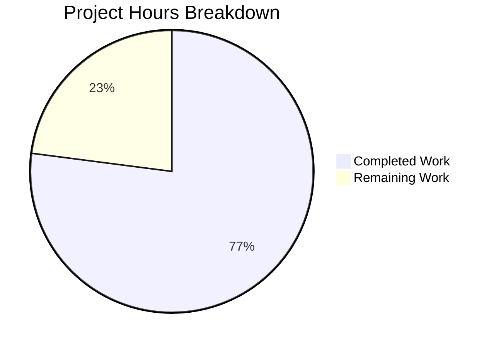

# Project Guide: Express.js Security Hardening Initiative

## 1. Executive Summary

This project implements a comprehensive security hardening initiative for the `hello_world` Express.js application, addressing 6 vulnerability categories: a high-severity CVE (CVE-2025-15284 in `qs`), missing security headers, absent rate limiting, undefined CORS policy, no HTTPS support, and no input validation.

**Completion Assessment: 47 hours completed out of 61 total hours = 77% complete**

All code implementation, testing, and validation work is finished. The 14 remaining hours consist of production deployment preparation tasks requiring human intervention (SSL certificate provisioning, production environment configuration, staging verification, and documentation updates).

### Key Achievements
- **CVE-2025-15284 PATCHED**: `qs` upgraded from 6.14.0 to 6.14.2 via npm overrides — `npm audit` reports 0 vulnerabilities
- **126/126 tests passing** across 8 test suites with 98.55% statement coverage
- **13 security response headers** set via Helmet.js on every response
- **Rate limiting active** at 100 requests per 15-minute window per IP with IETF RateLimit headers
- **CORS policy enforced** with restrictive origin whitelisting
- **HTTPS server support** with conditional TLS and certificate error fallback
- **Input validation** on all route handlers with query parameter sanitization
- **Full backward compatibility** — both `GET /` and `GET /evening` return identical responses

### Critical Unresolved Issues
- None — all code, tests, and security validations pass successfully

### Recommended Next Steps
1. Provision production SSL/TLS certificates for HTTPS deployment
2. Configure production environment variables (CORS origins, rate limit thresholds, trust proxy)
3. Evaluate external rate limiter store for multi-process deployments
4. Deploy to staging for end-to-end security verification

---

## 2. Validation Results Summary

### 2.1 Final Validator Accomplishments

The Final Validator confirmed production readiness across all 4 validation gates with zero fixes needed — all agent implementations were correct on first pass.

### 2.2 Test Results

| Test Suite | Tests | Status |
|-----------|-------|--------|
| tests/integration/endpoints.test.js | 25 | ✅ All passing |
| tests/unit/config.test.js | 32 | ✅ All passing |
| tests/unit/routes.test.js | 7 | ✅ All passing |
| tests/lifecycle/server.test.js | 8 | ✅ All passing |
| tests/security/headers.test.js | 11 | ✅ All passing |
| tests/security/rateLimit.test.js | 14 | ✅ All passing |
| tests/security/cors.test.js | 8 | ✅ All passing |
| tests/security/validation.test.js | 17 | ✅ All passing |
| **Total** | **126** | **100% passing** |

### 2.3 Code Coverage

| Module | Statements | Branches | Functions | Lines |
|--------|-----------|----------|-----------|-------|
| server.js | 100% | 100% | 100% | 100% |
| src/app.js | 100% | 100% | 100% | 100% |
| src/config/index.js | 100% | 100% | 100% | 100% |
| src/middleware/cors.js | 100% | 100% | 100% | 100% |
| src/middleware/helmet.js | 100% | 100% | 100% | 100% |
| src/middleware/index.js | 100% | 100% | 100% | 100% |
| src/middleware/rateLimiter.js | 100% | 100% | 100% | 100% |
| src/middleware/validator.js | 92.85% | 83.33% | 100% | 92.85% |
| src/routes/index.js | 100% | 100% | 100% | 100% |
| src/routes/main.routes.js | 100% | 100% | 100% | 100% |
| **Overall** | **98.55%** | **96.29%** | **100%** | **98.55%** |

### 2.4 Runtime Verification Results

- ✅ HTTP server starts and binds to configured host:port
- ✅ `GET /` returns `"Hello, World!\n"` with status 200
- ✅ `GET /evening` returns `"Good evening"` with status 200
- ✅ Content-Security-Policy header present on all responses
- ✅ Strict-Transport-Security header present on all responses
- ✅ X-Content-Type-Options header present on all responses
- ✅ X-Frame-Options header present on all responses
- ✅ X-Powered-By header correctly removed
- ✅ RateLimit-Policy header present on all responses
- ✅ Server shuts down cleanly

### 2.5 Security Audit Results

- ✅ `npm audit`: 0 vulnerabilities (CVE-2025-15284 patched via qs@6.14.2 override)
- ✅ Zero compilation errors
- ✅ Zero test failures
- ✅ Zero runtime errors
- ✅ Clean git working tree

### 2.6 Fixes Applied During Validation

No fixes were needed by the Final Validator — all implementations were correct. Earlier in the development cycle, 3 minor fixes were applied by agents:
1. **Express 5 compatibility fix** for validator middleware (dynamic express-validator chains)
2. **Rate limit header name correction** to match express-rate-limit draft-8 format
3. **Security header test assertion fix** (removed cross-origin-embedder-policy from expected headers)

---

## 3. Hours Calculation and Completion Percentage

### 3.1 Completed Work Hours (47h)

| Category | Work Completed | Hours |
|----------|---------------|-------|
| Dependency management | CVE-2025-15284 patch (package.json overrides, npm audit verification) | 1.5h |
| Helmet middleware | src/middleware/helmet.js — CSP + HSTS configuration (63 lines) | 2h |
| CORS middleware | src/middleware/cors.js — origin whitelisting (43 lines) | 1.5h |
| Rate limiter middleware | src/middleware/rateLimiter.js — IP throttling (51 lines) | 2h |
| Validator middleware | src/middleware/validator.js — query sanitization with Express 5 compat (122 lines) | 4h |
| Middleware barrel | src/middleware/index.js — aggregator module (62 lines) | 1h |
| App integration | src/app.js — middleware stack restructuring (56 lines) | 2h |
| Config expansion | src/config/index.js — 7 security properties (106 lines) | 2h |
| HTTPS server | server.js — conditional TLS + error fallback (123 lines) | 3h |
| Route validation | src/routes/main.routes.js — validation middleware (51 lines) | 1.5h |
| Jest config | jest.config.js — coverage update | 0.5h |
| Security header tests | tests/security/headers.test.js (168 lines, 11 tests) | 3h |
| Rate limit tests | tests/security/rateLimit.test.js (364 lines, 14 tests) | 5h |
| CORS tests | tests/security/cors.test.js (166 lines, 8 tests) | 3h |
| Validation tests | tests/security/validation.test.js (249 lines, 17 tests) | 4h |
| Integration test updates | tests/integration/endpoints.test.js (76 lines added) | 2h |
| Config test updates | tests/unit/config.test.js (131 lines added) | 2h |
| Lifecycle test updates | tests/lifecycle/server.test.js (184 lines added) | 3h |
| Debugging and fixes | Express 5 compat, header names, test assertions | 4h |
| **Total Completed** | **19 files, 1,984 lines added, 14 commits** | **47h** |

### 3.2 Remaining Work Hours (14h)

| Task | Hours | Priority |
|------|-------|----------|
| Production SSL/TLS certificate provisioning and HTTPS verification | 4h | High |
| Production environment variable configuration | 2h | High |
| External rate limiter store for multi-process deployment | 3h | Medium |
| Staging environment security verification | 2.5h | Medium |
| Security documentation and runbook update | 2.5h | Low |
| **Total Remaining** | **14h** | |

*Note: Remaining hours include enterprise multipliers (1.15× compliance + 1.25× uncertainty = 1.4375× applied to raw estimates of ~10h)*

### 3.3 Completion Calculation

```
Completed Hours:  47h
Remaining Hours:  14h
Total Hours:      61h
Completion:       47 / 61 = 77.0%
```

---

## 4. Visual Representation


```mermaid
pie title Project Hours Breakdown
    "Completed Work" : 47
    "Remaining Work" : 14
```

---

## 5. Detailed Human Task Table

All remaining tasks requiring human developer intervention, summing to exactly 14 hours (matching the pie chart "Remaining Work" value).

| # | Task | Description | Action Steps | Hours | Priority | Severity | Confidence |
|---|------|-------------|-------------|-------|----------|----------|------------|
| 1 | Production SSL/TLS Certificate Provisioning | HTTPS server code is implemented with conditional TLS and error fallback, but production certificates are needed to activate HTTPS | 1. Obtain SSL certificates from a Certificate Authority (Let's Encrypt, AWS ACM, etc.) 2. Store certificates securely on the server 3. Set `HTTPS_ENABLED=true`, `SSL_KEY_PATH`, `SSL_CERT_PATH` environment variables 4. Verify HTTPS server starts and TLS handshake succeeds 5. Test certificate renewal process | 4h | High | High | High |
| 2 | Production Environment Variable Configuration | Security middleware is configurable via env vars but production values need to be set for each deployment | 1. Set `CORS_ORIGIN` to production domain(s) 2. Configure `RATE_LIMIT_MAX` and `RATE_LIMIT_WINDOW_MS` for production traffic patterns 3. Set `TRUST_PROXY=true` if behind reverse proxy (nginx, ALB) 4. Create `.env.example` template with all security variables documented 5. Verify each variable takes effect | 2h | High | Medium | High |
| 3 | External Rate Limiter Store for Multi-Process | Current in-memory rate limit store is acceptable for single-process (Constraint C-001) but won't share state across processes in scaled deployments | 1. Evaluate need based on deployment architecture 2. Install `rate-limit-redis` or similar store package 3. Configure Redis connection for rate limiter 4. Test rate limiting across multiple process instances 5. Update rate limiter module to use external store | 3h | Medium | Medium | Medium |
| 4 | Staging Environment Security Verification | All security features are tested in CI but need end-to-end verification in a staging environment that mirrors production | 1. Deploy to staging environment 2. Verify CORS with actual production frontend origins 3. Verify rate limiting under realistic traffic load 4. Verify Helmet security headers with browser DevTools 5. Run `npm audit` on staging to confirm clean dependency tree 6. Test HTTPS with production certificates | 2.5h | Medium | Medium | Medium |
| 5 | Security Documentation and Runbook Update | README and project docs need updating to reflect the new security middleware, environment variables, and operational procedures | 1. Update README.md with security middleware section 2. Document all new environment variables with descriptions and defaults 3. Create security operations runbook (rate limit tuning, CORS updates, cert rotation) 4. Add troubleshooting section for common security configuration issues | 2.5h | Low | Low | High |
| | **Total Remaining Hours** | | | **14h** | | | |

---

## 6. Development Guide

### 6.1 System Prerequisites

| Software | Required Version | Verification Command |
|----------|-----------------|---------------------|
| Node.js | v20.x (v20.20.0 verified) | `node --version` |
| npm | v11.x (v11.1.0 verified) | `npm --version` |
| Operating System | Linux, macOS, or Windows with WSL | — |

### 6.2 Environment Setup

#### Clone and Navigate
```bash
git clone <repository-url>
cd hello_world
```

#### Environment Variables (Optional)
All security features work with sensible defaults. Override via environment variables:

```bash
# Server binding (defaults shown)
export HOST=127.0.0.1
export PORT=3000
export NODE_ENV=development

# CORS (default: http://localhost:3000)
export CORS_ORIGIN=http://localhost:3000

# Rate Limiting (defaults: 100 requests per 15 minutes)
export RATE_LIMIT_WINDOW_MS=900000
export RATE_LIMIT_MAX=100

# HTTPS (disabled by default)
export HTTPS_ENABLED=false
export SSL_KEY_PATH=
export SSL_CERT_PATH=

# Reverse proxy support
export TRUST_PROXY=false
```

### 6.3 Dependency Installation

```bash
# Install all dependencies (production + dev)
npm install

# Verify zero vulnerabilities
npm audit --audit-level=high
```

**Expected output for npm audit:**
```
found 0 vulnerabilities
```

### 6.4 Running Tests

```bash
# Run full test suite with coverage
CI=true npx jest --ci --watchAll=false --verbose --coverage

# Run security tests only
CI=true npx jest tests/security/ --verbose

# Run integration tests only
CI=true npx jest tests/integration/ --verbose

# Run with coverage report
npm run test:ci
```

**Expected output:**
```
Test Suites: 8 passed, 8 total
Tests:       126 passed, 126 total
```

### 6.5 Application Startup

#### HTTP Mode (Default)
```bash
npm start
```
**Expected output:**
```
Server running at http://127.0.0.1:3000/
```

#### HTTPS Mode (Requires certificates)
```bash
HTTPS_ENABLED=true SSL_KEY_PATH=./key.pem SSL_CERT_PATH=./cert.pem npm start
```
**Expected output:**
```
HTTPS Server running at https://127.0.0.1:3000/
```

If certificate files are missing/unreadable, server falls back to HTTP with an error message.

### 6.6 Verification Steps

#### Verify Endpoints
```bash
# Test root endpoint
curl -s http://localhost:3000/
# Expected: Hello, World!

# Test evening endpoint
curl -s http://localhost:3000/evening
# Expected: Good evening
```

#### Verify Security Headers
```bash
curl -sI http://localhost:3000/ | head -20
```
**Expected headers present:**
- `content-security-policy`
- `strict-transport-security`
- `x-content-type-options: nosniff`
- `x-frame-options: SAMEORIGIN`
- `ratelimit-policy`
- NO `x-powered-by` header

#### Verify Rate Limiting
```bash
# Check rate limit headers
curl -sI http://localhost:3000/ | grep -i ratelimit
# Expected: ratelimit-policy and ratelimit headers present
```

#### Verify Dependency Security
```bash
npm audit --audit-level=high
# Expected: found 0 vulnerabilities
```

### 6.7 Troubleshooting

| Issue | Cause | Solution |
|-------|-------|---------|
| `npm audit` shows qs vulnerability | npm overrides not applied | Run `rm -rf node_modules package-lock.json && npm install` |
| HTTPS server falls back to HTTP | Invalid certificate paths | Verify `SSL_KEY_PATH` and `SSL_CERT_PATH` point to valid PEM files |
| CORS errors in browser | Origin not whitelisted | Set `CORS_ORIGIN` to match your frontend URL |
| 429 Too Many Requests | Rate limit exceeded | Wait for window reset or increase `RATE_LIMIT_MAX` |

---

## 7. Git Repository Analysis

### 7.1 Commit History

- **Branch:** `blitzy-c2322049-a1d2-4e03-875e-a2755673b11e`
- **Total commits:** 14
- **Files changed:** 19 (17 JavaScript, 2 JSON)
- **Lines added:** 1,984
- **Lines removed:** 42
- **Net change:** +1,942 lines
- **Working tree:** Clean (all changes committed)

### 7.2 Files Changed Inventory

**New Files Created (9):**
| File | Lines | Purpose |
|------|-------|---------|
| src/middleware/helmet.js | 63 | Helmet security headers configuration |
| src/middleware/cors.js | 43 | CORS policy middleware |
| src/middleware/rateLimiter.js | 51 | IP-based rate limiting |
| src/middleware/validator.js | 122 | Input validation and sanitization |
| src/middleware/index.js | 62 | Middleware barrel export |
| tests/security/headers.test.js | 168 | Security header verification (11 tests) |
| tests/security/rateLimit.test.js | 364 | Rate limiting behavior (14 tests) |
| tests/security/cors.test.js | 166 | CORS policy enforcement (8 tests) |
| tests/security/validation.test.js | 249 | Input validation tests (17 tests) |

**Updated Files (10):**
| File | Change | Purpose |
|------|--------|---------|
| package.json | +9/-1 lines | Added 4 dependencies + qs override |
| package-lock.json | +102 lines | Regenerated lockfile |
| server.js | +93/-10 lines | HTTPS server support |
| src/app.js | +35/-2 lines | Security middleware stack |
| src/config/index.js | +75/-4 lines | 7 security config properties |
| src/routes/main.routes.js | +32/-8 lines | Validation middleware on routes |
| jest.config.js | +1 line | Middleware coverage |
| tests/integration/endpoints.test.js | +76 lines | Security header assertions |
| tests/unit/config.test.js | +131 lines | Security config tests |
| tests/lifecycle/server.test.js | +184 lines | HTTPS lifecycle tests |

### 7.3 Dependencies

| Package | Version | Purpose |
|---------|---------|---------|
| helmet | 8.1.0 | Security HTTP response headers |
| cors | 2.8.6 | Cross-Origin Resource Sharing |
| express-rate-limit | 8.2.1 | IP-based rate limiting |
| express-validator | 7.3.1 | Input validation and sanitization |
| qs (override) | ≥6.14.1 (resolved 6.14.2) | CVE-2025-15284 patch |

---

## 8. Security Feature Implementation Summary

### 8.1 CVE-2025-15284 — qs DoS Vulnerability (PATCHED)

- **Before:** `qs@6.14.0` — arrayLimit bypass via bracket notation allowing memory exhaustion
- **After:** `qs@6.14.2` — enforced via npm `overrides` block in package.json
- **Verification:** `npm audit` returns 0 vulnerabilities

### 8.2 Helmet Security Headers

- **13 protective headers** set on every response including CSP, HSTS, X-Content-Type-Options
- **X-Powered-By removed** to prevent Express framework fingerprinting
- **CSP configured** with `'self'` defaults for development safety
- **HSTS** set to 365-day max-age with includeSubDomains

### 8.3 Rate Limiting

- **100 requests per 15-minute window per IP** (configurable via environment)
- **IETF RateLimit draft-8 headers** on all responses
- **HTTP 429** returned with descriptive JSON error when threshold exceeded
- **In-memory store** (acceptable for single-process per Constraint C-001)

### 8.4 CORS Policy

- **Restrictive origin** — defaults to `http://localhost:3000`, configurable via `CORS_ORIGIN`
- **Limited methods** — GET, POST, PUT, DELETE, OPTIONS
- **Credentials support** enabled for cookie-based auth
- **Preflight handling** via automatic OPTIONS response

### 8.5 HTTPS Support

- **Conditional TLS** — activates when `HTTPS_ENABLED=true` with valid certificate paths
- **Error fallback** — gracefully falls back to HTTP if certificates are missing/unreadable
- **Node.js native** — uses built-in `https.createServer()` module

### 8.6 Input Validation

- **Query parameter sanitization** on all route handlers (trim + escape)
- **Express 5 compatible** — uses `req.sanitizedQuery` since Express 5 `req.query` is immutable
- **Non-breaking** — routes behave identically when no query parameters present
- **400 Bad Request** response with structured error details on validation failure

---

## 9. Risk Assessment

### 9.1 Technical Risks

| Risk | Severity | Likelihood | Mitigation |
|------|----------|------------|------------|
| Helmet CSP `upgrade-insecure-requests` causes Safari to redirect localhost to HTTPS | Low | Medium | CSP is configured with development-safe defaults; can be customized per environment |
| In-memory rate limiter resets on server restart | Low | High (by design) | Acceptable for single-process; evaluate Redis store for multi-process deployments |
| Express 5 `req.query` immutability requires `req.sanitizedQuery` pattern | Low | N/A (handled) | Validator middleware stores sanitized values on `req.sanitizedQuery`; documented in code |

### 9.2 Security Risks

| Risk | Severity | Likelihood | Mitigation |
|------|----------|------------|------------|
| Production deployment without HTTPS exposes traffic to interception | High | Medium | HTTPS code is ready; requires certificate provisioning (Task #1) |
| Default CORS origin may not match production domain | Medium | High | Set `CORS_ORIGIN` environment variable for production domain (Task #2) |
| Rate limiter in-memory store allows bypass across multiple processes | Medium | Low | Only relevant if app scales beyond single process; Redis store addresses this (Task #3) |

### 9.3 Operational Risks

| Risk | Severity | Likelihood | Mitigation |
|------|----------|------------|------------|
| SSL certificates expire without renewal process | Medium | Medium | Establish certificate rotation process as part of deployment (Task #1) |
| Rate limit thresholds may not match production traffic patterns | Low | Medium | Monitor and adjust `RATE_LIMIT_MAX` and `RATE_LIMIT_WINDOW_MS` post-deployment |
| Missing application-level logging for security events | Low | High | Rate limit violations logged via default handler; consider structured logging for production |

### 9.4 Integration Risks

| Risk | Severity | Likelihood | Mitigation |
|------|----------|------------|------------|
| CORS restrictive defaults may block legitimate cross-origin clients | Medium | Medium | Configure `CORS_ORIGIN` with production frontend URLs before deployment |
| Reverse proxy not configured for `TRUST_PROXY` | Low | Medium | Set `TRUST_PROXY=true` when behind nginx, ALB, or other reverse proxies |

---

## 10. Architecture: Middleware Stack

The security middleware is mounted in strict order in `src/app.js`:

```
Incoming Request
  → Helmet (sets 13 security response headers)
  → CORS (handles preflight, enforces origin policy)
  → Rate Limiter (throttles per-IP, returns 429 if exceeded)
  → JSON Body Parser (parses request bodies)
  → Route Handlers (with per-route input validation)
  → Response (with security headers)
```

This ordering ensures: (1) all responses include security headers regardless of outcome, (2) CORS preflight requests are handled before rate limiting counts them, and (3) rate limiting rejects excess traffic before expensive body parsing and route processing.
