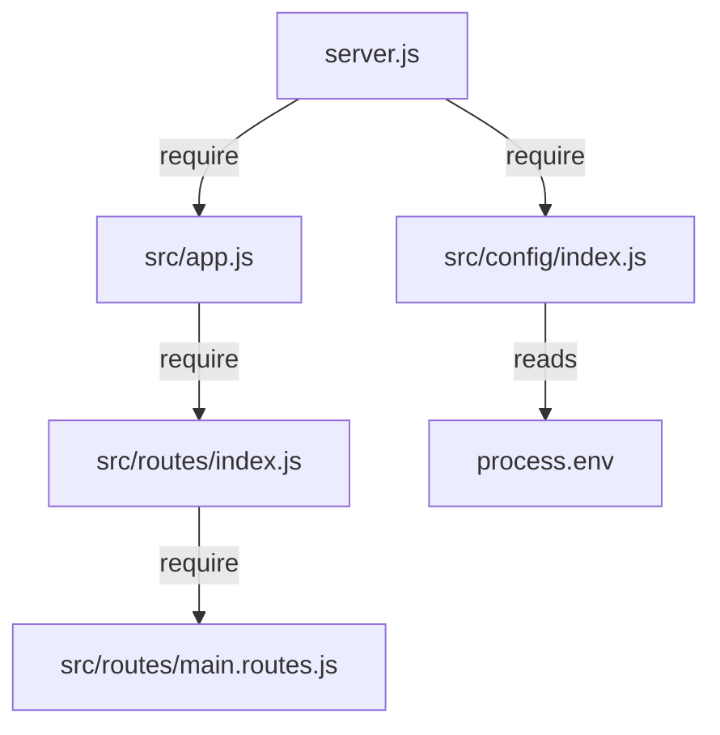
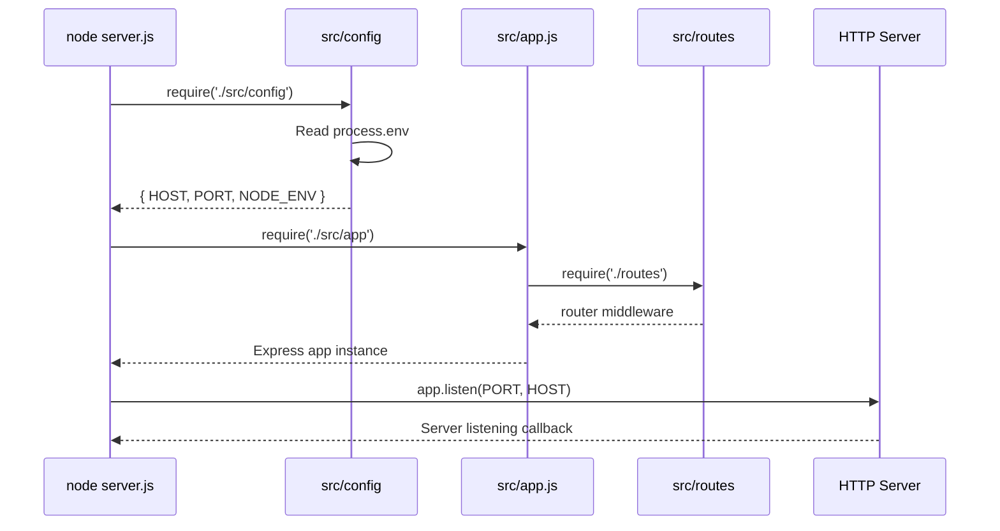

# Technical Specification

# 0. Agent Action Plan

## 0.1 Intent Clarification


### 0.1.1 Core Documentation Objective

Based on the provided requirements, the Blitzy platform understands that the documentation objective is to **enhance and formalize the documentation layer** of the `hello_world` Express.js tutorial server (repository: `hao-backprop-test`, version `1.0.0`) through two complementary documentation activities:

- **Add JSDoc comments to `server.js` functions** — Enrich the entry-point module with comprehensive, standards-compliant JSDoc annotations covering all functions, constants, imported modules, and code behaviors
- **Create a comprehensive README** — Produce a thorough root `README.md` that consolidates setup instructions, API documentation, a deployment guide, and inline code explanations into a single authoritative onboarding document

**Request Category:** Update existing documentation + Fix documentation gaps

**Documentation Types Identified:**
- **Inline code documentation** (JSDoc comments in `server.js`)
- **Project README** (comprehensive `README.md` with multiple documentation domains)
- **API documentation** (HTTP endpoint reference within README)
- **Deployment guide** (production-oriented deployment instructions within README)
- **Code walkthrough** (inline code explanations within README)

**Requirements Breakdown with Enhanced Clarity:**

| # | Stated Requirement | Technical Interpretation |
|---|---|---|
| R-DOC-001 | Add JSDoc comments to `server.js` functions | Enhance `server.js` with complete JSDoc annotations including `@module`, `@requires`, `@type`, `@example`, `@see`, and `@listens` tags for all declarations and the `app.listen()` invocation |
| R-DOC-002 | Create a comprehensive README | Produce a fully consolidated `README.md` covering all aspects of the project: overview, prerequisites, installation, configuration, usage, API, architecture, testing, deployment, and code explanations |
| R-DOC-003 | Setup instructions (within README) | Document Node.js/npm prerequisites, dependency installation, environment variable configuration, and first-run verification steps |
| R-DOC-004 | API documentation (within README) | Provide complete HTTP endpoint reference for `GET /` and `GET /evening` with request/response contracts, status codes, content types, and curl examples |
| R-DOC-005 | Deployment guide (within README) | Create a new section covering production deployment considerations including environment binding, process management, containerization guidance, and health verification |
| R-DOC-006 | Inline code explanations (within README) | Add a code walkthrough section that explains the purpose and mechanics of each source module with annotated code excerpts |

**Inferred Documentation Needs:**

- `server.js` currently has partial JSDoc (module-level `@module server`, `@type` annotations for `app` and `config`) but lacks `@requires`, `@example`, `@see`, and `@listens` tags — these must be added to satisfy comprehensive JSDoc coverage
- The existing `README.md` (338 lines) already contains substantial content covering prerequisites, installation, usage, API reference, architecture, testing, and troubleshooting — the task is to **update and enhance** this file rather than create from scratch
- The README currently **lacks** a dedicated deployment guide section and inline code explanations section — these are the primary content gaps to address
- Since `server.js` JSDoc enhancement is requested, related source files (`src/app.js`, `src/config/index.js`, `src/routes/index.js`, `src/routes/main.routes.js`) already contain adequate JSDoc annotations and are not explicitly in scope for JSDoc changes, but their existing JSDoc should be referenced for cross-module `@see` tags

### 0.1.2 Special Instructions and Constraints

- **No explicit style guide provided** — The existing codebase uses a consistent JSDoc style with `@module`, `@type`, `@returns`, and `@route` tags; new JSDoc must follow this established pattern
- **No template requirements specified** — The README structure should follow the existing README.md organizational pattern while adding missing sections
- **No Figma attachments** — No visual design references were provided
- **No user-provided setup instructions** — Standard Node.js environment setup applies
- **Implicit constraint: Maintain tutorial context** — All documentation must remain accessible to learners as the project is a pedagogical Express.js tutorial (Source: `README.md` line 337)
- **Implicit constraint: CommonJS conventions** — JSDoc annotations must use CommonJS-compatible `@type {import('...')}` patterns rather than ES module syntax (Source: all `.js` files use `require`/`module.exports`)

### 0.1.3 Technical Interpretation

These documentation requirements translate to the following technical documentation strategy:

- To **document `server.js` functions**, we will **update** `server.js` by adding enhanced JSDoc annotations with `@requires` tags for imported modules, `@example` tags demonstrating usage, `@see` tags cross-referencing related modules, and `@listens` or inline documentation for the `app.listen()` startup callback — all while preserving the existing code logic and behavior
- To **create a comprehensive README**, we will **update** the existing `README.md` by adding a dedicated **Deployment Guide** section covering production configuration, process management, and container-readiness, plus an **Inline Code Explanations** section providing annotated walkthroughs of each source module's purpose and mechanics
- To **document setup instructions**, we will **verify and enhance** the existing prerequisites, installation, and configuration sections in `README.md` to ensure completeness
- To **document the API**, we will **verify and enhance** the existing API Reference section in `README.md`, ensuring endpoint contracts, response examples, and error handling are fully documented
- To **create a deployment guide**, we will **create** a new `## Deployment` section in `README.md` covering production-oriented HOST/PORT binding, NODE_ENV production mode, process management recommendations, and container deployment patterns
- To **add inline code explanations**, we will **create** a new `## Code Walkthrough` section in `README.md` that explains the purpose and behavior of `server.js`, `src/app.js`, `src/config/index.js`, `src/routes/index.js`, and `src/routes/main.routes.js` with annotated code excerpts

### 0.1.4 Inferred Documentation Needs

- **Based on code analysis:** `server.js` contains an `app.listen()` call with an arrow function callback that lacks a standalone JSDoc block — this anonymous function's documentation should be enriched with inline explanation
- **Based on structure:** The project spans 5 source modules across 3 directories (`server.js`, `src/app.js`, `src/config/index.js`, `src/routes/index.js`, `src/routes/main.routes.js`), requiring a consolidated code walkthrough in the README that ties them together
- **Based on dependencies:** The integration between `server.js` → `src/app.js` → `src/routes/` and `server.js` → `src/config/` requires clear `@see` and `@requires` JSDoc cross-references
- **Based on user journey:** Developers encountering this tutorial need a progression from setup → run → understand the code → deploy, which maps to the README sections: Prerequisites → Installation → Code Walkthrough → Deployment Guide


## 0.2 Documentation Discovery and Analysis


### 0.2.1 Existing Documentation Infrastructure Assessment

Repository analysis reveals a **README-based documentation structure** with comprehensive per-directory Markdown files and partial JSDoc annotations in source code. No dedicated documentation generation framework is in use.

**Documentation Files Discovered:**

| File Path | Type | Status | Lines |
|---|---|---|---|
| `README.md` | Project README | Comprehensive but incomplete | ~338 lines |
| `src/README.md` | Source directory guide | Complete | ~70 lines |
| `src/config/README.md` | Config module guide | Complete | ~45 lines |
| `src/routes/README.md` | Routes module guide | Complete | ~55 lines |
| `tests/README.md` | Test suite guide | Complete | ~50 lines |

**Documentation Generator Configuration:** None detected — no `mkdocs.yml`, `docusaurus.config.js`, `sphinx/conf.py`, `.readthedocs.yml`, or JSDoc configuration files exist in the repository.

**API Documentation Tools in Use:** JSDoc annotations exist inline within source files but no external API documentation generator (e.g., `jsdoc`, `typedoc`, `express-jsdoc-swagger`) is installed as a dependency in `package.json`.

**Diagram Tools Detected:** No Mermaid, PlantUML, or other diagram generation tools are configured. The existing `README.md` uses ASCII-style tree diagrams for project structure visualization.

**Documentation Hosting/Deployment:** No documentation hosting or deployment pipeline is configured.

### 0.2.2 Repository Code Analysis for Documentation

**Search patterns used for code requiring documentation:**

- Public APIs: `server.js`, `src/app.js` containing `module.exports` and `require()` patterns
- Module interfaces: `src/routes/index.js` (barrel export), `src/config/index.js` (configuration object)
- Configuration options: `src/config/index.js` exporting `HOST`, `PORT`, `NODE_ENV`
- Route handlers: `src/routes/main.routes.js` defining `GET /` and `GET /evening`

**Key directories examined:**

| Directory | Purpose | Documentation Status |
|---|---|---|
| `/` (root) | Entry point, project config | `README.md` present, `server.js` has partial JSDoc |
| `src/` | Application source code | `src/README.md` present, module-level JSDoc exists |
| `src/config/` | Environment configuration | `src/config/README.md` present, good JSDoc coverage |
| `src/routes/` | Express route definitions | `src/routes/README.md` present, `@route`/`@returns` tags present |
| `tests/` | Test suites (unit, integration, lifecycle) | `tests/README.md` present, not in scope for JSDoc |

**Existing JSDoc Annotations Inventory (via `grep` analysis):**

| File | Existing Tags | Missing Tags |
|---|---|---|
| `server.js` | `@module server`, `@type {Express}`, `@type {Object}` | `@requires`, `@example`, `@see`, `@listens`, `@description` for callback |
| `src/app.js` | `@module app` | `@requires`, `@function`, `@returns`, `@example` |
| `src/config/index.js` | `@module config`, `@type {string}`, `@default` | Adequate — no changes required |
| `src/routes/index.js` | `@module routes` | `@requires`, `@see` |
| `src/routes/main.routes.js` | `@module main.routes`, `@route`, `@returns` | `@param` for `req`/`res` |

### 0.2.3 Web Search Research Conducted

- **JSDoc best practices for Node.js/Express.js:** Research confirms that JSDoc comments should be placed immediately before the code being documented, use `/**` block syntax, and leverage tags like `@module`, `@requires`, `@param`, `@returns`, `@example`, and `@see` for comprehensive coverage (Source: jsdoc.app, HackerOne JSDoc documentation guide)
- **CommonJS module documentation:** For Node.js CommonJS modules, the `@module` tag identifies the file as a module, and `@requires` documents imported dependencies — this aligns with the existing `require()`-based import style in the repository
- **IDE integration value:** JSDoc annotations provide hover-documentation in editors like VS Code and JetBrains without requiring a separate generation step — this is the primary value for this project since no JSDoc generator is configured
- **README structure conventions:** A production-quality README for a Node.js Express server should include: overview, prerequisites, installation, configuration, usage, API reference, architecture overview, deployment guide, contributing, and license sections


## 0.3 Documentation Scope Analysis


### 0.3.1 Code-to-Documentation Mapping

**Module: `server.js` (Entry Point — Primary JSDoc Target)**

- **Public APIs:**
  - Imports: `require('./src/app')`, `require('./src/config')`
  - Constants: `app` (Express instance), `config` (configuration object), `HOST` (destructured), `PORT` (destructured)
  - Server lifecycle: `app.listen(PORT, HOST, callback)` with startup logging callback
- **Current documentation:** `@module server` present; `@type` annotations for `app` and `config` present; section headers via `//` comment blocks present
- **Documentation needed:** Enhanced `@module` with `@description`; `@requires` for both imports; `@example` for running the server; `@see` cross-references to app and config modules; `@listens` for the HTTP server binding; inline explanation of the listen callback

**Module: `src/app.js` (Express Factory — Reference Only)**

- **Public APIs:** `createApp()` function exported via `module.exports`
- **Current documentation:** `@module app` present
- **Documentation needed:** Already adequate for scope — referenced in `server.js` `@see` tags and in README Code Walkthrough

**Module: `src/config/index.js` (Configuration — Reference Only)**

- **Public APIs:** Exports `{ HOST, PORT, NODE_ENV }` with defaults (`'localhost'`, `3000`, `'development'`)
- **Current documentation:** `@module config`, `@type`, `@default` annotations present — best-documented module in the project
- **Documentation needed:** No JSDoc changes required — referenced in README Deployment Guide for environment variable documentation

**Module: `src/routes/index.js` (Route Barrel — Reference Only)**

- **Public APIs:** Re-exports `mainRoutes` from `./main.routes`
- **Current documentation:** `@module routes` present
- **Documentation needed:** No JSDoc changes required — referenced in README Code Walkthrough

**Module: `src/routes/main.routes.js` (Route Handlers — Reference Only)**

- **Endpoints:**
  - `GET /` → Returns `{ message: 'Hello World!' }` with status 200
  - `GET /evening` → Returns `{ message: 'Good Evening!' }` with status 200
- **Current documentation:** `@module main.routes`, `@route {GET}`, `@returns` present
- **Documentation needed:** No JSDoc changes required — referenced in README API Documentation

**Configuration options requiring documentation in README Deployment Guide:**

| Config Key | Default Value | Environment Variable | README Coverage |
|---|---|---|---|
| `HOST` | `'localhost'` | `HOST` | Existing env vars section covers basics; deployment guide needs production binding (`0.0.0.0`) |
| `PORT` | `3000` | `PORT` | Existing env vars section covers basics; deployment guide needs port mapping |
| `NODE_ENV` | `'development'` | `NODE_ENV` | Existing env vars section covers basics; deployment guide needs `production` mode explanation |

### 0.3.2 Documentation Gap Analysis

Given the requirements and repository analysis, documentation gaps include:

**JSDoc Gaps in `server.js`:**
- Missing `@requires` tags for `./src/app` and `./src/config` imports
- Missing `@example` tag demonstrating how to start the server
- Missing `@see` cross-references to `module:app` and `module:config`
- Missing `@listens` tag for the HTTP server binding
- The `app.listen()` callback arrow function lacks inline JSDoc explanation of its logging behavior
- The destructuring `const { HOST, PORT } = config;` lacks a descriptive comment block

**README Gaps:**
- **Deployment Guide section:** Completely absent — no guidance exists for production deployment, container readiness, process management, or production-specific environment configuration
- **Inline Code Explanations section:** Completely absent — no consolidated walkthrough exists that explains the purpose and mechanics of each source file with annotated code excerpts
- **Existing sections adequacy:** The setup instructions, API documentation, and architecture sections are present and substantively complete; they require only minor verification rather than rewriting

**Cross-Documentation Gaps:**
- No `@see` links between `server.js` JSDoc and the sub-module READMEs (`src/README.md`, `src/config/README.md`, `src/routes/README.md`)
- README does not reference the JSDoc annotations as a documentation resource for developers


## 0.4 Documentation Implementation Design


### 0.4.1 Documentation Structure Planning

The documentation hierarchy for this project centers on two locations: inline JSDoc within `server.js` and the root `README.md`. No additional documentation directories or files need to be created.

**Target `README.md` Structure (after update):**

```
README.md
├── # Hello World Express Server (existing — verify)
├── ## Prerequisites (existing — verify)
├── ## Installation (existing — verify)
├── ## Usage (existing — verify)
├── ## API Reference (existing — verify)
│   ├── ### GET / (existing — verify)
│   └── ### GET /evening (existing — verify)
├── ## Project Structure (existing — verify)
├── ## Environment Variables (existing — verify)
├── ## Architecture (existing — verify)
├── ## Design Patterns (existing — verify)
├── ## Deployment Guide (NEW — create)
│   ├── ### Production Environment Configuration
│   ├── ### Process Management
│   └── ### Container Deployment
├── ## Code Walkthrough (NEW — create)
│   ├── ### server.js — Application Entry Point
│   ├── ### src/app.js — Express Factory
│   ├── ### src/config/index.js — Configuration Module
│   └── ### src/routes/ — Routing Layer
├── ## Dependencies (existing — verify)
├── ## Scripts (existing — verify)
├── ## Testing (existing — verify)
├── ## Troubleshooting (existing — verify)
└── ## License (existing — verify)
```

**Target `server.js` JSDoc Enhancement:**

```
server.js (enhanced annotations)
├── /** @module server */ (existing — enhance with @description, @requires, @example, @see)
├── /** @type {Express} */ const app (existing — enhance with @description)
├── /** @type {Object} */ const config (existing — enhance with @description)
├── /* Inline documentation for destructuring */ const { HOST, PORT }
└── /** @listens {http.Server} */ app.listen() (NEW — add comprehensive block)
```

### 0.4.2 Content Generation Strategy

**Information Extraction Approach:**

- Extract API signatures from `src/routes/main.routes.js` using the existing `@route` and `@returns` JSDoc tags to verify README API documentation accuracy
- Generate deployment examples by analyzing `src/config/index.js` defaults (`HOST='localhost'`, `PORT=3000`, `NODE_ENV='development'`) and their production overrides
- Create code walkthrough content by analyzing module-level `@module` tags and `require()`/`module.exports` patterns across all five source files
- Reference test files (`tests/lifecycle/server.test.js`, `tests/integration/endpoints.test.js`) for verification commands in the deployment guide

**Documentation Standards Applied:**

- **JSDoc format:** Multi-line `/** ... */` blocks using standard JSDoc 3 tags (`@module`, `@requires`, `@type`, `@example`, `@see`, `@listens`, `@description`)
- **Markdown formatting:** Proper header hierarchy (`#` through `####`), fenced code blocks with language identifiers, tables for structured data
- **Code examples:** All code snippets use fenced blocks with `bash`, `javascript`, or `json` language identifiers
- **Source citations:** Inline references as `Source: /path/to/file.js:LineRange` footnotes
- **Consistency:** Follow the existing README tone (instructional, tutorial-oriented) and JSDoc style (descriptive with practical examples)

### 0.4.3 Diagram and Visual Strategy

**Mermaid Diagrams to Include in README Code Walkthrough:**

- **Module Dependency Graph:** A flowchart showing the import relationships: `server.js` → `src/app.js` → `src/routes/` and `server.js` → `src/config/`


```mermaid
graph TD
    A[server.js] -->|require| B[src/app.js]
    A -->|require| C[src/config/index.js]
    B -->|require| D[src/routes/index.js]
    D -->|require| E[src/routes/main.routes.js]
    C -->|reads| F[process.env]
```

- **Server Startup Sequence Diagram:** A sequence diagram showing the initialization flow from `node server.js` through configuration loading, app creation, and HTTP binding


```mermaid
sequenceDiagram
    participant CLI as node server.js
    participant Config as src/config
    participant App as src/app.js
    participant Routes as src/routes
    participant HTTP as HTTP Server

    CLI->>Config: require('./src/config')
    Config->>Config: Read process.env
    Config-->>CLI: { HOST, PORT, NODE_ENV }
    CLI->>App: require('./src/app')
    App->>Routes: require('./routes')
    Routes-->>App: router middleware
    App-->>CLI: Express app instance
    CLI->>HTTP: app.listen(PORT, HOST)
    HTTP-->>CLI: Server listening callback
```

These diagrams will be embedded in the README Code Walkthrough section using fenced `mermaid` code blocks for rendering on GitHub and compatible Markdown viewers.


## 0.5 Documentation File Transformation Mapping


### 0.5.1 File-by-File Documentation Plan

| Target Documentation File | Transformation | Source Code/Docs | Content/Changes |
|---|---|---|---|
| `server.js` | UPDATE | `server.js` | Add comprehensive JSDoc annotations: `@requires` for imports, `@example` for server startup, `@see` cross-references to app and config modules, `@listens` for HTTP binding, inline documentation for the listen callback and config destructuring |
| `README.md` | UPDATE | `README.md`, `src/config/index.js`, `src/routes/main.routes.js`, `src/app.js`, `server.js` | Add new "Deployment Guide" section with production environment configuration, process management, and container deployment subsections. Add new "Code Walkthrough" section with annotated explanations of each source module and Mermaid dependency diagrams |

### 0.5.2 Documentation Files to Update — Detail

**`server.js` — Enhanced JSDoc Annotations**

```
File: server.js
Type: Inline JSDoc (code comments)
Source Code: server.js (self-referencing)
Sections to Enhance:
    - Module-level block: Add @description, @requires, @example, @see
    - const app: Enhance @type with @description explaining factory pattern
    - const config: Enhance @type with @description explaining 12-factor config
    - const { HOST, PORT }: Add inline JSDoc explaining destructuring purpose
    - app.listen(): Add @listens tag, document callback logging behavior
Key Citations: src/app.js, src/config/index.js
```

Specific JSDoc additions for `server.js`:

- **Module block enhancement** — Expand the existing `@module server` with:
  - `@description` — Entry point for the Hello World Express server, responsible for importing the configured Express application and binding it to a network interface
  - `@requires module:app` — Express application factory
  - `@requires module:config` — Environment configuration module
  - `@example` — `node server.js` or `PORT=8080 node server.js`
  - `@see` — `module:app` for Express app creation, `module:config` for environment variables

- **`app` constant** — Enhance existing `@type {Express}`:
  - Add `@description` — Fully configured Express application instance created by the app factory module, pre-loaded with JSON parsing middleware and all route handlers

- **`config` constant** — Enhance existing `@type {Object}`:
  - Add `@description` — Server configuration object providing HOST, PORT, and NODE_ENV values sourced from environment variables with sensible defaults
  - Add `@property {string} HOST` — Network interface to bind to
  - Add `@property {number} PORT` — Port number for the HTTP server
  - Add `@property {string} NODE_ENV` — Runtime environment identifier

- **`{ HOST, PORT }` destructuring** — Add new inline documentation:
  - Explain that destructuring extracts the specific network binding parameters needed for `app.listen()`

- **`app.listen()` call** — Add new JSDoc block:
  - `@listens` — Documents the HTTP server binding
  - Inline comment explaining the callback logs the bound address for operational verification

**`README.md` — New Sections**

```
File: README.md
Type: Project README (Markdown)
Source Code: server.js, src/app.js, src/config/index.js, src/routes/index.js, src/routes/main.routes.js
New Sections:
    - ## Deployment Guide
        - ### Production Environment Configuration
            - Environment variable overrides for production (HOST=0.0.0.0, NODE_ENV=production)
            - Port binding and network interface guidance
        - ### Process Management
            - Running with PM2 or systemd for production process supervision
            - Graceful shutdown considerations
        - ### Container Deployment
            - Dockerfile example for containerized deployment
            - Docker Compose considerations
            - Health check verification with curl commands
    - ## Code Walkthrough
        - ### server.js — Application Entry Point
            - Annotated explanation of imports, configuration loading, and server binding
            - Module dependency diagram (Mermaid)
        - ### src/app.js — Express Factory
            - Explanation of the Factory Pattern and why createApp() exists
            - Middleware pipeline walkthrough
        - ### src/config/index.js — Configuration Module
            - 12-Factor App methodology explanation
            - Environment variable mapping table
        - ### src/routes/ — Routing Layer
            - Barrel Pattern explanation for src/routes/index.js
            - Route handler walkthrough for main.routes.js
            - Server startup sequence diagram (Mermaid)
Diagrams:
    - Module dependency graph (Mermaid flowchart)
    - Server startup sequence diagram (Mermaid sequence)
Key Citations: server.js, src/app.js, src/config/index.js, src/routes/index.js, src/routes/main.routes.js
```

### 0.5.3 Documentation Configuration Updates

No documentation configuration files need to be created or updated. The project does not use a documentation generator framework (no `mkdocs.yml`, `docusaurus.config.js`, or similar). All documentation is self-contained in Markdown files and inline JSDoc comments.

### 0.5.4 Cross-Documentation Dependencies

- **`server.js` JSDoc ↔ `README.md` Code Walkthrough:** The JSDoc `@see` tags in `server.js` reference `module:app` and `module:config`, which are explained in detail in the README Code Walkthrough section. These must be consistent in terminology.
- **`README.md` Deployment Guide ↔ `src/config/index.js`:** The deployment guide references the environment variables (`HOST`, `PORT`, `NODE_ENV`) and their defaults defined in `src/config/index.js`. Any configuration changes in the source must be reflected in the deployment guide.
- **`README.md` API Reference ↔ `src/routes/main.routes.js`:** The existing API Reference section documents the same endpoints defined in `main.routes.js`. The Code Walkthrough must not contradict the API Reference.
- **Sub-module READMEs (`src/README.md`, `src/config/README.md`, `src/routes/README.md`, `tests/README.md`):** These existing documentation files are **not modified** but should remain consistent with the root README. No navigation link updates are needed since the root README already references the project structure.


## 0.6 Dependency Inventory


### 0.6.1 Documentation Dependencies

No dedicated documentation generation tools are required for this documentation task. The JSDoc annotations are for IDE hover-documentation and code readability only — no JSDoc HTML generation is in scope. The README is standard Markdown requiring no build step.

**Project Runtime Dependencies (referenced in documentation):**

| Registry | Package Name | Version | Purpose |
|---|---|---|---|
| npm | express | ^5.1.0 | Core Express.js web framework — documented in README and JSDoc |
| npm | jest | ^30.2.0 | Test framework — documented in README Testing section |
| npm | supertest | ^7.1.0 | HTTP assertion library — documented in README Testing section |

**Documentation Tooling Status:**

| Tool | Status | Rationale |
|---|---|---|
| `jsdoc` (npm) | Not installed / Not required | JSDoc annotations serve IDE support and code readability; no HTML generation requested |
| `typedoc` (npm) | Not installed / Not required | Project uses JavaScript (not TypeScript) |
| `mkdocs` (pip) | Not installed / Not required | No documentation site generation requested |
| `mermaid-cli` (npm) | Not installed / Not required | Mermaid diagrams in README render natively on GitHub |

### 0.6.2 Documentation Reference Updates

No link updates are required. The existing `README.md` does not contain links to documentation that would change. The new Deployment Guide and Code Walkthrough sections are additive and do not alter existing internal link structures.

**Table of Contents impact:** If the existing README contains a table of contents, it must be updated to include the two new sections:
- `## Deployment Guide`
- `## Code Walkthrough`


## 0.7 Coverage and Quality Targets


### 0.7.1 Documentation Coverage Metrics

**Current JSDoc Coverage Analysis:**

| Source File | Declarations | Documented | Coverage | Target |
|---|---|---|---|---|
| `server.js` | 5 (`app`, `config`, `{ HOST, PORT }`, `app.listen()`, module) | 3 (`@module`, `@type` ×2) | 60% | 100% |
| `src/app.js` | 3 (`createApp`, `express`, module) | 1 (`@module`) | 33% | Not in scope |
| `src/config/index.js` | 5 (`HOST`, `PORT`, `NODE_ENV`, exports, module) | 5 (`@module`, `@type` ×3, `@default` ×3) | 100% | Maintain |
| `src/routes/index.js` | 2 (`mainRoutes`, module) | 1 (`@module`) | 50% | Not in scope |
| `src/routes/main.routes.js` | 4 (`router`, `GET /`, `GET /evening`, module) | 4 (`@module`, `@route` ×2, `@returns` ×2) | 100% | Maintain |

**Current README Coverage Analysis:**

| Documentation Domain | Existing Section | Completeness | Target |
|---|---|---|---|
| Setup instructions | Prerequisites, Installation | Complete | Verify accuracy |
| API documentation | API Reference (GET /, GET /evening) | Complete | Verify accuracy |
| Configuration reference | Environment Variables | Complete | Verify accuracy |
| Architecture overview | Architecture, Design Patterns | Complete | Verify accuracy |
| Deployment guide | **Missing** | 0% | Create new section |
| Inline code explanations | **Missing** | 0% | Create new section |
| Testing documentation | Testing, Scripts | Complete | Verify accuracy |
| Troubleshooting | Troubleshooting | Complete | Verify accuracy |

**Coverage Targets:**
- `server.js` JSDoc: **100%** — All 5 declarations fully annotated with appropriate tags
- `README.md` domain coverage: **100%** — All 8 documentation domains addressed with dedicated sections

### 0.7.2 Documentation Quality Criteria

**Completeness requirements:**
- All `server.js` declarations have `@description`, appropriate type tags, and cross-references
- The module-level JSDoc block includes `@requires`, `@example`, and `@see` tags
- The Deployment Guide covers production configuration, process management, and containerization
- The Code Walkthrough covers all 5 source modules with annotated explanations
- Both new README sections include practical code examples

**Accuracy validation:**
- JSDoc `@type` annotations match actual runtime types (verified via test suite — 41/41 passing with 100% code coverage)
- Environment variable defaults documented in the Deployment Guide match `src/config/index.js` source values: `HOST='localhost'`, `PORT=3000`, `NODE_ENV='development'`
- API endpoint documentation matches route handler implementations in `src/routes/main.routes.js`
- Code examples in the README are runnable as documented (verified via `npm start` and `npm test`)

**Clarity standards:**
- Technical accuracy maintained with accessible tutorial-oriented language
- Progressive disclosure: setup → usage → understanding → deployment
- Consistent terminology: "Express application factory", "configuration module", "route barrel pattern" — matching terms used in existing sub-module READMEs

**Maintainability:**
- JSDoc annotations reference source modules using `@see module:name` for traceability
- README Code Walkthrough includes file path citations (`Source: server.js:L5-L8`) for each explained code block
- Both new sections follow the established heading structure of the existing README

### 0.7.3 Example and Diagram Requirements

- **Minimum examples per documented entity:** 1 executable example per JSDoc `@example` tag, 1 command-line example per README subsection
- **Diagram types required:** 1 Mermaid flowchart (module dependency graph), 1 Mermaid sequence diagram (server startup flow) — both in the Code Walkthrough section
- **Code example validation:** All `bash` commands verified in the project environment (`node server.js`, `curl` commands, `npm test`)
- **Visual content freshness:** Diagrams are generated from source analysis and reflect the current module structure exactly as discovered during repository exploration


## 0.8 Scope Boundaries


### 0.8.1 Exhaustively In Scope

**JSDoc Annotation Updates (inline documentation comments):**
- `server.js` — Full JSDoc enhancement: `@module` expansion, `@requires`, `@type` enhancement, `@example`, `@see`, `@listens`, inline callback documentation

**README Content Updates:**
- `README.md` — Add new `## Deployment Guide` section with subsections for production environment configuration, process management, and container deployment
- `README.md` — Add new `## Code Walkthrough` section with subsections for each source module: `server.js`, `src/app.js`, `src/config/index.js`, `src/routes/index.js`, `src/routes/main.routes.js`
- `README.md` — Verify accuracy of existing sections (Prerequisites, Installation, Usage, API Reference, Environment Variables, Architecture, Design Patterns, Testing, Troubleshooting) against current codebase behavior

**Documentation Assets (embedded in README):**
- Mermaid module dependency graph diagram
- Mermaid server startup sequence diagram
- Annotated code excerpts for each source module in the Code Walkthrough

### 0.8.2 Explicitly Out of Scope

- **Source code logic modifications** — No functional changes to `server.js`, `src/app.js`, `src/config/index.js`, `src/routes/index.js`, or `src/routes/main.routes.js` beyond JSDoc comment additions
- **JSDoc changes to files other than `server.js`** — The user specifically requested "Add JSDoc comments to server.js functions"; `src/app.js`, `src/config/index.js`, `src/routes/index.js`, and `src/routes/main.routes.js` are excluded from JSDoc modifications
- **Test file modifications** — No changes to any files in `tests/` (unit, integration, lifecycle test suites)
- **Sub-module README updates** — `src/README.md`, `src/config/README.md`, `src/routes/README.md`, and `tests/README.md` are not modified
- **Documentation generator installation** — No `jsdoc`, `typedoc`, `mkdocs`, or similar tools will be added as project dependencies
- **CI/CD pipeline changes** — No modifications to build or deployment scripts
- **New file creation** — No new documentation files are created; all changes are to existing files (`server.js` and `README.md`)
- **Feature additions or code refactoring** — No structural changes to the application codebase
- **Package.json modifications** — No new dependencies, scripts, or configuration changes
- **External documentation hosting setup** — No GitHub Pages, Read the Docs, or similar configurations


## 0.9 Execution Parameters


### 0.9.1 Documentation-Specific Instructions

| Parameter | Value |
|---|---|
| **Documentation build command** | N/A — No documentation generator is configured; JSDoc annotations render in IDE hover-docs, Markdown renders natively on GitHub |
| **Documentation preview command** | `cat README.md` or open `README.md` in any Markdown viewer |
| **Diagram generation command** | N/A — Mermaid diagrams are embedded inline in Markdown and render on GitHub natively |
| **Documentation deployment command** | N/A — No documentation hosting is configured |
| **Default format** | Markdown (`.md`) for README; JSDoc 3 comment syntax (`/** ... */`) for inline annotations |
| **Citation requirement** | Every Code Walkthrough subsection must reference its source file path and relevant line ranges |
| **Style guide** | Follow existing README tone (instructional, tutorial-oriented) and existing JSDoc style (`@module`, `@type`, `@route`, `@returns` patterns observed in codebase) |
| **Documentation validation** | Verify JSDoc syntax correctness by checking that annotations follow `/**` block format; verify README accuracy by cross-referencing documented behavior against test suite results (41/41 passing, 100% coverage) |

### 0.9.2 Verification Commands

- **Test suite verification:** `cd /tmp/blitzy/test-spec/0101 && CI=true npx jest --ci --coverage`
- **Server startup verification:** `cd /tmp/blitzy/test-spec/0101 && timeout 5 node server.js &` followed by `curl http://localhost:3000/`
- **JSDoc syntax check:** `grep -n '/\*\*' server.js` — Ensure all JSDoc blocks open with `/**` and close with `*/`
- **README section check:** `grep -n '^## ' README.md` — Verify all expected top-level sections exist including new Deployment Guide and Code Walkthrough


## 0.10 Rules for Documentation


The following rules govern documentation generation for this task. They are derived from the user's requirements, codebase conventions, and best practices:

- **Follow existing JSDoc style:** All new JSDoc annotations in `server.js` must use the same multi-line `/** ... */` block format and tag conventions (`@module`, `@type`, `@description`) observed in the existing codebase
- **Preserve existing code behavior:** JSDoc additions to `server.js` must not alter any functional code — only comment blocks are added or enhanced
- **Maintain CommonJS compatibility:** JSDoc `@requires` and `@type` tags must use CommonJS-compatible syntax (e.g., `@requires module:app` rather than ES module import syntax)
- **Keep README tutorial-friendly:** Both new sections (Deployment Guide, Code Walkthrough) must use accessible language appropriate for developers learning Express.js, consistent with the existing instructional tone of the README
- **Include practical code examples:** Every new README subsection and every JSDoc `@example` tag must include runnable command-line or code examples
- **Embed Mermaid diagrams for architecture visualization:** The Code Walkthrough section must include at least one module dependency diagram and one server startup sequence diagram using fenced Mermaid blocks
- **Cite source files:** Every code explanation in the Code Walkthrough must reference the source file path (e.g., `Source: server.js`) for traceability
- **Document all environment variables for production:** The Deployment Guide must cover all three environment variables (`HOST`, `PORT`, `NODE_ENV`) with their defaults and production-recommended values
- **No new dependencies:** Documentation changes must not introduce new npm packages, build tools, or configuration files
- **Preserve existing README content:** All existing sections in `README.md` must be retained; new sections are additive insertions, not replacements


## 0.11 References


### 0.11.1 Repository Files and Folders Searched

**Source Files (read in full):**

| File Path | Purpose | Relevance to Documentation Task |
|---|---|---|
| `server.js` | Application entry point | Primary JSDoc enhancement target |
| `src/app.js` | Express application factory | Referenced in JSDoc `@see` and README Code Walkthrough |
| `src/config/index.js` | Environment configuration module | Referenced in JSDoc `@requires` and README Deployment Guide |
| `src/routes/index.js` | Route barrel re-export | Referenced in README Code Walkthrough (Barrel Pattern) |
| `src/routes/main.routes.js` | Route handler definitions | Referenced in README API Reference verification and Code Walkthrough |
| `package.json` | Project metadata and dependencies | Verified dependency versions for Dependency Inventory |
| `jest.config.js` | Jest test configuration | Verified test setup for coverage metrics |
| `.gitignore` | Git exclusion patterns | Confirmed no documentation files are gitignored |

**Documentation Files (read in full):**

| File Path | Purpose | Status |
|---|---|---|
| `README.md` | Root project documentation | Primary README update target |
| `src/README.md` | Source directory guide | Read for context — not modified |
| `src/config/README.md` | Config module documentation | Read for context — not modified |
| `src/routes/README.md` | Routes module documentation | Read for context — not modified |
| `tests/README.md` | Test suite documentation | Read for context — not modified |

**Test Files (read in full):**

| File Path | Purpose | Relevance |
|---|---|---|
| `tests/unit/config.test.js` | Config module unit tests | Verified environment variable defaults |
| `tests/unit/routes.test.js` | Route handler unit tests | Verified endpoint response contracts |
| `tests/integration/endpoints.test.js` | Endpoint integration tests | Verified HTTP status codes and response bodies |
| `tests/lifecycle/server.test.js` | Server lifecycle tests | Verified server binding behavior |

**Folders Explored:**

| Folder Path | Depth | Children Examined |
|---|---|---|
| `/` (root) | 0 | `server.js`, `package.json`, `README.md`, `jest.config.js`, `.gitignore`, `src/`, `tests/`, `blitzy/` |
| `src/` | 1 | `app.js`, `README.md`, `config/`, `routes/` |
| `src/config/` | 2 | `index.js`, `README.md` |
| `src/routes/` | 2 | `index.js`, `main.routes.js`, `README.md` |
| `tests/` | 1 | `unit/`, `integration/`, `lifecycle/`, `README.md` |
| `blitzy/` | 1 | Technical specification files |

### 0.11.2 Technical Specification Sections Retrieved

| Section Heading | Purpose |
|---|---|
| 1.1 Executive Summary | Project overview and architectural context |
| 2.1 Feature Catalog | Feature requirements and categorization |
| 3.3 Open Source Dependencies | Dependency versions and purposes |
| 5.2 Component Details | Module architecture and component relationships |

### 0.11.3 External Research Sources

| Source | Topic Researched |
|---|---|
| jsdoc.app | JSDoc 3 tag reference and CommonJS module documentation conventions |
| HackerOne / PullRequest blog | JSDoc best practices: documentation-as-you-code, descriptive-but-concise, Markdown support in JSDoc |
| Medium / The Startup (JSDoc documentation) | Namespace and `@typedef` patterns for organizing complex JSDoc annotations |

### 0.11.4 Attachments and Figma References

- **Attachments provided:** None
- **Figma screens provided:** None
- **User-provided templates:** None
- **User-provided examples:** None


