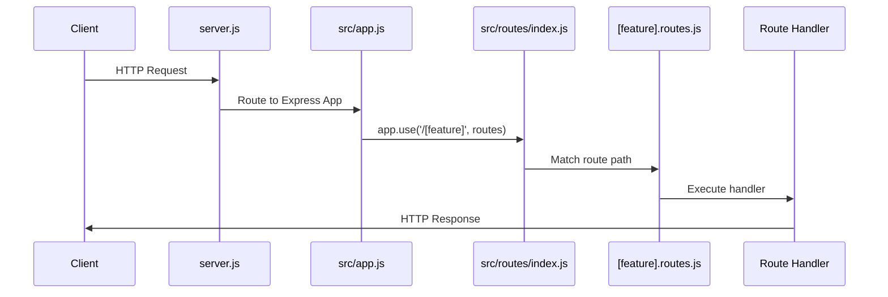

# Technical Specification

# 0. Agent Action Plan

## 0.1 Intent Clarification

### 0.1.1 Core Feature Objective

Based on the prompt, the Blitzy platform understands that the new feature requirement is to add unspecified functionality to the existing `hello_world` Node.js/Express.js HTTP service. However, the user-provided input consists of placeholder text repeated multiple times without defining specific feature requirements.

**User Input Received:**
```
Describe the new functionality you'd like to add to your existing codebase [repeated 10 times]
```

**Interpretation:**
The request appears to be a template or placeholder text rather than a concrete feature specification. The Blitzy platform requires specific feature details to generate an actionable implementation plan.

#### Feature Requirements Analysis

| Requirement Aspect | Status | Notes |
|-------------------|--------|-------|
| Feature Name | ❌ Not Provided | No specific feature name specified |
| Functional Description | ❌ Not Provided | No description of what the feature should do |
| Technical Requirements | ❌ Not Provided | No technical constraints or requirements specified |
| Integration Points | ❌ Not Provided | No integration requirements identified |
| User Stories | ❌ Not Provided | No user-facing behavior described |

#### Implicit Requirements Detected

Despite the absence of explicit feature requirements, the following implicit constraints apply based on the existing repository:

| Implicit Requirement | Rationale |
|---------------------|-----------|
| Maintain Express.js 5.x compatibility | Repository uses Express ^5.1.0 as the core framework |
| Follow CommonJS module pattern | All existing modules use `require`/`module.exports` |
| Preserve Factory Pattern architecture | `src/app.js` separates app creation from server binding |
| Maintain Barrel Pattern for routes | `src/routes/index.js` aggregates all route exports |
| Achieve ≥80% test coverage | `jest.config.js` enforces coverage thresholds |
| Support environment variable configuration | Twelve-Factor App methodology already implemented |

### 0.1.2 Special Instructions and Constraints

**CRITICAL: Clarification Required**

The current request lacks sufficient detail for implementation planning. To proceed with feature addition, the following information must be provided:

| Required Information | Purpose |
|---------------------|---------|
| Feature name and identifier | For naming new modules and routes |
| Functional behavior description | To define endpoint contracts and business logic |
| HTTP method and path (if API endpoint) | For route registration in Express Router |
| Response format and status codes | To implement proper HTTP responses |
| Input validation requirements | For request parameter handling |
| Error handling behavior | To define failure modes and error responses |
| Security requirements | For authentication/authorization if needed |
| Performance constraints | For timeout and throughput considerations |

**Architectural Requirements (Inferred):**
- Use existing service pattern in `src/routes/` for new endpoints
- Follow repository conventions for file naming and structure
- Maintain backward compatibility with existing endpoints (GET `/` and GET `/evening`)
- Ensure non-breaking changes to `src/app.js` router mounting

### 0.1.3 Technical Interpretation

These feature requirements translate to the following technical implementation strategy (pending clarification):

| Implementation Pattern | Technical Approach |
|----------------------|-------------------|
| New HTTP Endpoint | Create new route file in `src/routes/[feature].routes.js` and register in barrel |
| Configuration Extension | Add feature-specific settings to `src/config/index.js` via environment variables |
| Business Logic | Implement handlers directly in route file (simple) or create `src/services/` layer (complex) |
| Testing | Create unit tests in `tests/unit/[feature].test.js` and integration tests in `tests/integration/[feature].test.js` |

**General Implementation Framework:**
- To add a new HTTP endpoint, we will create a new route module in `src/routes/[feature].routes.js`
- To integrate with the application, we will export from `src/routes/index.js` barrel and mount in `src/app.js`
- To maintain testability, we will create corresponding test files following existing patterns
- To preserve configuration flexibility, we will add environment variables to `src/config/index.js` if needed

## 0.2 Repository Scope Discovery

### 0.2.1 Comprehensive File Analysis

The repository has been exhaustively analyzed to identify all components relevant to feature additions. The following inventory represents every file and folder in the codebase.

#### Existing Source Files to Potentially Modify

| File Path | Purpose | Modification Likelihood |
|-----------|---------|------------------------|
| `server.js` | HTTP server entry point with port binding | Low (unless adding startup hooks) |
| `src/app.js` | Express application factory with route mounting | **High** (route registration) |
| `src/config/index.js` | Environment variable configuration | Medium (new config values) |
| `src/routes/index.js` | Route aggregator (barrel pattern) | **High** (new route exports) |
| `src/routes/main.routes.js` | Existing route handlers | Low (maintain existing) |

#### Existing Test Files to Update

| File Path | Test Type | Test Count | Update Required |
|-----------|-----------|------------|-----------------|
| `tests/unit/config.test.js` | Unit | 11 tests | If config changes |
| `tests/unit/routes.test.js` | Unit | 8 tests | If routes change |
| `tests/integration/endpoints.test.js` | Integration | 14 tests | For new endpoints |
| `tests/lifecycle/server.test.js` | Lifecycle | 5 tests | If startup changes |

#### Configuration Files

| File Path | Purpose | Update Required |
|-----------|---------|-----------------|
| `package.json` | npm manifest, dependencies, scripts | If new dependencies needed |
| `package-lock.json` | Dependency lockfile | Auto-updated on `npm install` |
| `jest.config.js` | Test framework configuration | If coverage paths change |
| `.gitignore` | Git ignore patterns | Rarely modified |

#### Documentation Files

| File Path | Purpose | Update Required |
|-----------|---------|-----------------|
| `README.md` | Project documentation | Yes (document new feature) |
| `blitzy/documentation/Project Guide.md` | Implementation guide | Yes (update deliverables) |
| `blitzy/documentation/Technical Specifications.md` | Technical specs | Yes (add feature spec) |

### 0.2.2 Integration Point Discovery

#### API Endpoints That Connect to Features

| Endpoint | Method | File | Handler | Response Contract |
|----------|--------|------|---------|-------------------|
| `/` | GET | `src/routes/main.routes.js` | `router.get('/', ...)` | `Hello, World!\n` (200) |
| `/evening` | GET | `src/routes/main.routes.js` | `router.get('/evening', ...)` | `Good evening` (200) |
| `/*` (undefined) | ANY | Express default | Built-in 404 handler | Error page (404) |

#### Application Bootstrap Chain

```
server.js
    └─> require('./src/app')     → Express Application instance
    └─> require('./src/config')  → { host, port, env } configuration
         ↓
    app.listen(port, host, cb)   → HTTP server binding
```

#### Route Mounting Architecture

```
src/app.js
    └─> const { mainRoutes } = require('./routes')
    └─> app.use('/', mainRoutes)
         ↓
src/routes/index.js (barrel)
    └─> const mainRoutes = require('./main.routes')
    └─> module.exports = { mainRoutes }
         ↓
src/routes/main.routes.js
    └─> router.get('/', handler)
    └─> router.get('/evening', handler)
```

### 0.2.3 New File Requirements (Template Structure)

When specific feature requirements are provided, the following new files will be created:

#### New Source Files Template

| File Path | Purpose | Template Pattern |
|-----------|---------|------------------|
| `src/routes/[feature].routes.js` | Feature-specific route handlers | Based on `main.routes.js` |
| `src/services/[feature].service.js` | Business logic (if complex) | New pattern if needed |
| `src/middleware/[feature].middleware.js` | Request middleware (if needed) | Express middleware pattern |

**Example Route File Structure:**
```javascript
// src/routes/[feature].routes.js
const express = require('express');
const router = express.Router();

router.get('/[path]', (req, res) => { });

module.exports = router;
```

#### New Test Files Template

| File Path | Test Type | Coverage Target |
|-----------|-----------|-----------------|
| `tests/unit/[feature].test.js` | Unit tests | Module contracts |
| `tests/integration/[feature].test.js` | Integration tests | HTTP behavior |

**Example Test File Structure:**
```javascript
// tests/integration/[feature].test.js
const request = require('supertest');
const app = require('../../src/app');

describe('[Feature] Endpoints', () => { });
```

### 0.2.4 Directory Structure Impact

Current structure with placeholders for feature additions:

```
hello_world/
├── server.js                      # Entry point (minimal changes)
├── package.json                   # Update for new dependencies
├── jest.config.js                 # Update coverage paths
├── README.md                      # Document new feature
├── src/
│   ├── app.js                     # ADD: mount new routes
│   ├── config/
│   │   └── index.js               # ADD: new config values
│   └── routes/
│       ├── index.js               # ADD: export new routes
│       ├── main.routes.js         # Unchanged
│       └── [feature].routes.js    # CREATE: new feature routes
├── tests/
│   ├── unit/
│   │   ├── config.test.js         # Update if config changes
│   │   ├── routes.test.js         # Update for new routes
│   │   └── [feature].test.js      # CREATE: unit tests
│   ├── integration/
│   │   ├── endpoints.test.js      # Extend or keep separate
│   │   └── [feature].test.js      # CREATE: integration tests
│   └── lifecycle/
│       └── server.test.js         # Minimal changes
└── blitzy/
    └── documentation/             # Update documentation
```

## 0.3 Dependency Inventory

### 0.3.1 Private and Public Packages

The following packages are currently installed and available for feature development:

#### Runtime Dependencies

| Package Registry | Package Name | Version | Purpose |
|-----------------|--------------|---------|---------|
| npm (public) | express | ^5.1.0 | Web framework for HTTP handling, routing, and middleware |

#### Development Dependencies

| Package Registry | Package Name | Version | Purpose |
|-----------------|--------------|---------|---------|
| npm (public) | jest | ^30.2.0 | JavaScript testing framework and test runner |
| npm (public) | supertest | ^7.1.4 | HTTP assertion library for Express endpoint testing |

#### Dependency Manifest Reference

From `package.json`:
```json
{
  "dependencies": {
    "express": "^5.1.0"
  },
  "devDependencies": {
    "jest": "^30.2.0",
    "supertest": "^7.1.4"
  }
}
```

### 0.3.2 Dependency Considerations for Feature Addition

Depending on the feature requirements (once clarified), the following additional packages may be considered:

| Feature Type | Potential Package | Purpose | Registry |
|-------------|-------------------|---------|----------|
| Request Validation | express-validator | Input validation middleware | npm (public) |
| JSON Parsing | body-parser | Request body parsing (built into Express 5.x) | Built-in |
| CORS Support | cors | Cross-origin resource sharing | npm (public) |
| Rate Limiting | express-rate-limit | API rate limiting | npm (public) |
| Logging | morgan / winston | HTTP request logging | npm (public) |
| Environment Variables | dotenv | `.env` file support | npm (public) |

**Note:** Express 5.x includes built-in body parsing via `express.json()` and `express.urlencoded()`, reducing the need for external body-parser.

### 0.3.3 Import Structure Patterns

#### Current Import Pattern (CommonJS)

All modules in this repository use CommonJS imports:

**Application Imports:**
```javascript
// Server entry point imports
const app = require('./src/app');
const config = require('./src/config');

// Route imports (barrel pattern)
const { mainRoutes } = require('./routes');
```

**Test Imports:**
```javascript
// Integration test imports
const request = require('supertest');
const app = require('../../src/app');

// Unit test imports
const router = require('../../src/routes/main.routes');
```

#### Import Transformation for New Features

When adding new routes, follow this pattern:

**Step 1: Create Route Module**
```javascript
// src/routes/[feature].routes.js
const express = require('express');
const router = express.Router();
module.exports = router;
```

**Step 2: Update Barrel Export**
```javascript
// src/routes/index.js
const mainRoutes = require('./main.routes');
const featureRoutes = require('./[feature].routes'); // ADD

module.exports = {
  mainRoutes,
  featureRoutes  // ADD
};
```

**Step 3: Update App Registration**
```javascript
// src/app.js
const { mainRoutes, featureRoutes } = require('./routes'); // UPDATE

app.use('/', mainRoutes);
app.use('/[feature]', featureRoutes); // ADD
```

### 0.3.4 Configuration Updates (If Applicable)

If the new feature requires configuration values, update `src/config/index.js`:

**Current Configuration Export:**
```javascript
module.exports = {
  host: process.env.HOST || '127.0.0.1',
  port: parseInt(process.env.PORT, 10) || 3000,
  env: process.env.NODE_ENV || 'development'
};
```

**Extended Configuration Pattern:**
```javascript
module.exports = {
  host: process.env.HOST || '127.0.0.1',
  port: parseInt(process.env.PORT, 10) || 3000,
  env: process.env.NODE_ENV || 'development',
  // Feature-specific config (ADD)
  [feature]: {
    enabled: process.env.[FEATURE]_ENABLED === 'true',
    setting: process.env.[FEATURE]_SETTING || 'default'
  }
};
```

### 0.3.5 Version Compatibility Matrix

| Component | Current Version | Compatible Range | Notes |
|-----------|----------------|------------------|-------|
| Node.js | 20.19.6 | ≥18.x | Recommended: 20.19.x LTS |
| npm | 11.1.0 | ≥8.x | Lock file version 3 |
| Express | 5.1.0 | ^5.1.0 | Latest Express 5.x features |
| Jest | 30.2.0 | ^30.2.0 | Latest testing framework |
| Supertest | 7.1.4 | ^7.1.4 | HTTP testing integration |

## 0.4 Integration Analysis

### 0.4.1 Existing Code Touchpoints

The following files require direct modifications to integrate new features into the application:

#### Critical Integration Points

| File | Line Reference | Modification Type | Integration Purpose |
|------|---------------|-------------------|---------------------|
| `src/app.js` | Lines 15-16 | ADD import | Import new route from barrel |
| `src/app.js` | Line 25 | ADD `app.use()` | Mount new feature routes |
| `src/routes/index.js` | Lines 15-18 | ADD require + export | Register in barrel pattern |

**src/app.js Integration Detail:**

Current implementation (lines 14-27):
```javascript
const express = require('express');
const { mainRoutes } = require('./routes');  // Line 15 - UPDATE

const app = express();

app.use('/', mainRoutes);  // Line 25 - ADD parallel route mount

module.exports = app;
```

Required changes:
```javascript
const { mainRoutes, [feature]Routes } = require('./routes');

app.use('/', mainRoutes);
app.use('/[feature]', [feature]Routes);  // New mount point
```

**src/routes/index.js Integration Detail:**

Current implementation (lines 15-19):
```javascript
const mainRoutes = require('./main.routes');

module.exports = {
  mainRoutes
};
```

Required changes:
```javascript
const mainRoutes = require('./main.routes');
const [feature]Routes = require('./[feature].routes');

module.exports = {
  mainRoutes,
  [feature]Routes
};
```

### 0.4.2 Dependency Injection Points

The application uses direct module imports rather than dependency injection containers. New features integrate through:

| Injection Point | Method | File |
|----------------|--------|------|
| Route Registration | `app.use(path, router)` | `src/app.js` |
| Configuration Access | `require('./config')` | Consumer files |
| Express Router | `express.Router()` | Route files |

**Configuration Injection Pattern:**
```javascript
// Access configuration in route handlers if needed
const config = require('../config');

router.get('/status', (req, res) => {
  res.json({ environment: config.env });
});
```

### 0.4.3 Test Integration Requirements

New features must integrate with the existing test infrastructure:

#### Unit Test Integration

| Test File | Required Updates | Purpose |
|-----------|-----------------|---------|
| `tests/unit/routes.test.js` | Update route count assertions | Verify new routes exist |
| New: `tests/unit/[feature].test.js` | Create new test file | Test feature module contracts |

**Route Count Assertion (tests/unit/routes.test.js line ~23):**
```javascript
// Current: "should have two route handlers defined"
test('should have two route handlers defined', () => {
  const layers = getRouteLayers(router);
  expect(layers.length).toBe(2);
});

// May need adjustment if adding to main.routes.js
```

#### Integration Test Integration

| Test File | Required Updates | Purpose |
|-----------|-----------------|---------|
| `tests/integration/endpoints.test.js` | Add describe blocks for new endpoints | HTTP contract tests |
| New: `tests/integration/[feature].test.js` | Create feature-specific tests | Isolated feature testing |

**Integration Test Pattern:**
```javascript
describe('[Feature] Endpoints', () => {
  describe('GET /[feature]', () => {
    test('should return 200 status code', async () => {
      const response = await request(app)
        .get('/[feature]')
        .expect(200);
    });
  });
});
```

### 0.4.4 Database/Schema Updates

**Current State:** This application has NO database integration.

| Database Component | Status | Notes |
|-------------------|--------|-------|
| Database connection | Not present | Application is stateless |
| Schema migrations | Not applicable | No data persistence |
| Models | Not present | No data models |

**If Feature Requires Data Persistence:**

New infrastructure would need to be created:
- `src/db/` - Database connection and models
- `migrations/` - Schema migration files
- Additional dependencies (e.g., `pg`, `mongoose`, `sequelize`)

### 0.4.5 Middleware Integration

Current middleware stack (minimal):

| Middleware | Status | Registration Point |
|------------|--------|-------------------|
| Express Router | Active | `app.use('/', mainRoutes)` |
| Body Parser | Available | Built into Express 5.x |
| Error Handler | Default | Express 5.x built-in 404 |

**Adding Custom Middleware:**
```javascript
// src/middleware/[feature].middleware.js
const validateRequest = (req, res, next) => {
  // Validation logic
  next();
};

module.exports = { validateRequest };

// Usage in route file
const { validateRequest } = require('../middleware/[feature].middleware');
router.get('/path', validateRequest, handler);
```

### 0.4.6 Event/Lifecycle Hooks

The server entry point provides limited lifecycle hooks:

| Hook | Location | Current Usage |
|------|----------|---------------|
| Server Start | `server.js` line 49 | `app.listen()` callback |
| Error Events | `server.js` (implicit) | Express default handling |
| Graceful Shutdown | Not implemented | Could be added if needed |

**Lifecycle Integration Pattern:**
```javascript
// For features requiring startup initialization
const server = app.listen(config.port, config.host, () => {
  console.log(`Server running at http://${config.host}:${config.port}/`);
  // Add feature initialization here
});

// For graceful shutdown
process.on('SIGTERM', () => {
  server.close(() => {
    // Cleanup feature resources
  });
});
```

## 0.5 Technical Implementation

### 0.5.1 File-by-File Execution Plan

**CRITICAL:** The following execution plan is a template pending specific feature requirements. Each file listed MUST be created or modified according to the patterns established in the existing codebase.

#### Group 1 - Core Feature Files (Creation Priority: HIGH)

| Action | File Path | Implementation Notes |
|--------|-----------|---------------------|
| CREATE | `src/routes/[feature].routes.js` | New Express Router with feature endpoints |
| MODIFY | `src/routes/index.js` | Add require and export for new routes |
| MODIFY | `src/app.js` | Import and mount new route module |

**Template: src/routes/[feature].routes.js**
```javascript
/**
 * [Feature] Routes Module
 * @module src/routes/[feature].routes
 */
const express = require('express');
const router = express.Router();

router.get('/', (req, res) => {
  res.send('[Response body]');
});

module.exports = router;
```

#### Group 2 - Configuration (Creation Priority: MEDIUM)

| Action | File Path | Implementation Notes |
|--------|-----------|---------------------|
| MODIFY | `src/config/index.js` | Add feature-specific configuration (if needed) |
| UPDATE | `.env.example` | Document new environment variables (if created) |

**Configuration Extension Pattern:**
```javascript
module.exports = {
  // Existing config
  host: process.env.HOST || '127.0.0.1',
  port: parseInt(process.env.PORT, 10) || 3000,
  env: process.env.NODE_ENV || 'development',
  // New feature config (conditional)
  [featureName]: {
    enabled: process.env.[FEATURE]_ENABLED !== 'false'
  }
};
```

#### Group 3 - Tests (Creation Priority: HIGH)

| Action | File Path | Test Type | Coverage Target |
|--------|-----------|-----------|-----------------|
| CREATE | `tests/unit/[feature].test.js` | Unit | Module exports, router structure |
| CREATE | `tests/integration/[feature].test.js` | Integration | HTTP contracts |
| MODIFY | `tests/unit/routes.test.js` | Unit | Update route count if applicable |

**Template: tests/unit/[feature].test.js**
```javascript
'use strict';
const router = require('../../src/routes/[feature].routes');

describe('[Feature] Routes Module', () => {
  test('should export an Express Router', () => {
    expect(router).toBeDefined();
    expect(typeof router.handle).toBe('function');
  });
});
```

**Template: tests/integration/[feature].test.js**
```javascript
'use strict';
const request = require('supertest');
const app = require('../../src/app');

describe('[Feature] HTTP Endpoints', () => {
  describe('GET /[feature]', () => {
    test('should return 200', async () => {
      const response = await request(app)
        .get('/[feature]');
      expect(response.status).toBe(200);
    });
  });
});
```

#### Group 4 - Documentation (Creation Priority: MEDIUM)

| Action | File Path | Update Content |
|--------|-----------|----------------|
| MODIFY | `README.md` | Add API documentation for new endpoint |
| MODIFY | `blitzy/documentation/Project Guide.md` | Update deliverables list |
| MODIFY | `blitzy/documentation/Technical Specifications.md` | Add feature specification |

### 0.5.2 Implementation Approach per File

The implementation follows a systematic approach to ensure consistency and maintainability:

| Phase | Files | Purpose |
|-------|-------|---------|
| 1. Foundation | `src/routes/[feature].routes.js` | Establish feature core with route handlers |
| 2. Integration | `src/routes/index.js`, `src/app.js` | Connect feature to application |
| 3. Configuration | `src/config/index.js` | Add runtime configuration (if needed) |
| 4. Testing | `tests/unit/*.test.js`, `tests/integration/*.test.js` | Validate behavior and contracts |
| 5. Documentation | `README.md`, `blitzy/documentation/*.md` | Document usage and API |

### 0.5.3 Request/Response Flow Architecture


```mermaid
sequenceDiagram
    participant Client
    participant Server as server.js
    participant App as src/app.js
    participant Router as src/routes/index.js
    participant Feature as [feature].routes.js
    participant Handler as Route Handler

    Client->>Server: HTTP Request
    Server->>App: Route to Express App
    App->>Router: app.use('/[feature]', routes)
    Router->>Feature: Match route path
    Feature->>Handler: Execute handler
    Handler->>Client: HTTP Response
```

### 0.5.4 Error Handling Strategy

New features should leverage Express 5.x error handling:

| Error Type | Handling Method | Response |
|------------|-----------------|----------|
| Invalid Route | Express default 404 | 404 Not Found |
| Invalid Method | Express default 404 | 404 Not Found |
| Handler Error | Express error middleware | 500 Internal Server Error |
| Validation Error | Custom response | 400 Bad Request |

**Error Response Pattern:**
```javascript
router.get('/[path]', (req, res) => {
  try {
    // Feature logic
    res.send('Success');
  } catch (error) {
    res.status(500).json({ error: 'Internal error' });
  }
});
```

### 0.5.5 Test Coverage Requirements

All new code must meet the existing coverage thresholds defined in `jest.config.js`:

| Metric | Threshold | Enforcement |
|--------|-----------|-------------|
| Line Coverage | ≥80% | `npm test` will fail below threshold |
| Branch Coverage | ≥75% | All conditionals must be tested |
| Function Coverage | ≥90% | All exported functions must be called |
| Statement Coverage | ≥80% | Most statements must execute |

**Coverage Verification:**
```bash
npm run test:coverage
# Review coverage/lcov-report/index.html for details
```

### 0.5.6 User Interface Design

**Current State:** This application provides HTTP API endpoints only with no user interface.

| UI Component | Status | Notes |
|--------------|--------|-------|
| Web Frontend | Not present | API-only service |
| Figma Screens | Not provided | No visual designs available |
| HTML Templates | Not used | Responses are text/JSON |

If UI requirements are specified in future clarifications, additional infrastructure will be identified.

## 0.6 Scope Boundaries

### 0.6.1 Exhaustively In Scope

The following files and patterns are within scope for feature addition (using trailing wildcards where applicable):

#### Source Files

| Pattern | Purpose | Modification Type |
|---------|---------|-------------------|
| `src/routes/[feature].routes.js` | New feature route module | CREATE |
| `src/routes/index.js` | Route aggregator barrel | MODIFY |
| `src/app.js` | Express application factory | MODIFY |
| `src/config/index.js` | Configuration module | MODIFY (if needed) |

#### Test Files

| Pattern | Purpose | Modification Type |
|---------|---------|-------------------|
| `tests/unit/[feature].test.js` | Feature unit tests | CREATE |
| `tests/integration/[feature].test.js` | Feature integration tests | CREATE |
| `tests/unit/routes.test.js` | Existing route tests | MODIFY (update counts) |
| `tests/unit/config.test.js` | Existing config tests | MODIFY (if config changes) |

#### Configuration Files

| Pattern | Purpose | Modification Type |
|---------|---------|-------------------|
| `package.json` | Dependencies manifest | MODIFY (if new deps) |
| `jest.config.js` | Test configuration | UNLIKELY to change |
| `.env.example` | Environment documentation | CREATE (if new env vars) |

#### Documentation Files

| Pattern | Purpose | Modification Type |
|---------|---------|-------------------|
| `README.md` | Project documentation | MODIFY (add API docs) |
| `blitzy/documentation/**/*.md` | Technical documentation | MODIFY (update specs) |

### 0.6.2 Comprehensive In-Scope File List

**All files that MAY require modification for ANY feature addition:**

```
IN SCOPE FILES
==============

src/
├── app.js                         # Route mounting
├── config/
│   └── index.js                   # Configuration values
└── routes/
    ├── index.js                   # Barrel exports
    ├── main.routes.js             # Reference only (no changes)
    └── [feature].routes.js        # NEW FILE

tests/
├── unit/
│   ├── config.test.js             # If config changes
│   ├── routes.test.js             # Route count assertions
│   └── [feature].test.js          # NEW FILE
├── integration/
│   ├── endpoints.test.js          # Reference only
│   └── [feature].test.js          # NEW FILE
└── lifecycle/
    └── server.test.js             # Unlikely to change

Root files:
├── package.json                   # Dependencies (if needed)
├── README.md                      # Documentation
└── .env.example                   # NEW FILE (if env vars added)

Documentation:
└── blitzy/documentation/
    ├── Project Guide.md           # Update deliverables
    └── Technical Specifications.md # Add feature spec
```

### 0.6.3 Integration Point Summary

| Integration Point | File | Line/Location | Change Required |
|-------------------|------|---------------|-----------------|
| Route import | `src/app.js` | Line 15 | Add destructured import |
| Route mount | `src/app.js` | After line 25 | Add `app.use()` call |
| Barrel require | `src/routes/index.js` | Line 15 | Add `require()` |
| Barrel export | `src/routes/index.js` | Lines 17-18 | Add export property |
| Config export | `src/config/index.js` | After line 40 | Add new property (if needed) |

### 0.6.4 Explicitly Out of Scope

The following items are explicitly excluded from this feature addition exercise:

| Out of Scope Item | Rationale |
|-------------------|-----------|
| Modifying existing endpoint behavior | Backward compatibility requirement |
| Refactoring `server.js` architecture | Entry point should remain stable |
| Changing existing response formats | Breaking change to API contract |
| Adding database layer | Not specified in requirements |
| Authentication/Authorization | Not specified in requirements |
| CI/CD pipeline changes | Infrastructure concern, not feature |
| Docker/containerization | Deployment concern, not feature |
| Performance optimization | Not a functional requirement |
| Logging infrastructure | Not specified (could be added if needed) |
| ESM migration | Current CommonJS pattern is standard |

#### Files Explicitly NOT to Modify

| File | Reason |
|------|--------|
| `server.js` | Entry point stability |
| `src/routes/main.routes.js` | Existing endpoint preservation |
| `tests/lifecycle/server.test.js` | Lifecycle tests unchanged |
| `package-lock.json` | Auto-generated (do not manually edit) |

### 0.6.5 Scope Decision Matrix

| Requirement Type | In Scope? | Condition |
|-----------------|-----------|-----------|
| New HTTP endpoint | ✅ Yes | Primary feature type |
| New route file | ✅ Yes | Required for endpoints |
| Test coverage | ✅ Yes | Mandatory for all code |
| Documentation | ✅ Yes | Required for new features |
| New npm dependency | ⚠️ Conditional | Only if feature requires |
| Configuration change | ⚠️ Conditional | Only if feature requires |
| Database integration | ❌ No | Not in current requirements |
| Frontend/UI | ❌ No | Not in current requirements |
| CI/CD changes | ❌ No | Infrastructure scope |

### 0.6.6 Impact Assessment

| Component | Impact Level | Risk |
|-----------|--------------|------|
| `src/app.js` | Low | Adding route mount is minimal change |
| `src/routes/index.js` | Low | Barrel pattern supports extension |
| `src/config/index.js` | Low | Additional exports are non-breaking |
| Test coverage | Medium | Must maintain ≥80% thresholds |
| Documentation | Low | Additive changes only |
| Existing endpoints | None | No changes to `/` or `/evening` |

## 0.7 Rules for Feature Addition

### 0.7.1 Architectural Patterns to Follow

The following patterns MUST be adhered to when adding new features:

| Pattern | Implementation | Reference File |
|---------|---------------|----------------|
| Factory Pattern | Create modules that export configured instances | `src/app.js` |
| Barrel Pattern | Aggregate exports through index files | `src/routes/index.js` |
| CommonJS Modules | Use `require`/`module.exports` throughout | All `.js` files |
| Twelve-Factor Config | Environment variables with sensible defaults | `src/config/index.js` |
| Separation of Concerns | Separate routing from server binding | `server.js` vs `src/app.js` |

### 0.7.2 Code Style Requirements

| Rule | Requirement | Example |
|------|-------------|---------|
| Strict Mode | Add `'use strict';` to all new files | First line of file |
| JSDoc Comments | Document all exported functions and modules | `/** @module ... */` |
| Explicit Exports | Use named exports in barrel files | `module.exports = { name }` |
| Router Pattern | Use `express.Router()` for route modules | `const router = express.Router()` |
| Handler Signature | Use `(req, res)` or `(req, res, next)` | Standard Express handlers |

**Example Compliant File:**
```javascript
/**
 * [Feature] Routes Module
 * @module src/routes/[feature].routes
 */
'use strict';

const express = require('express');
const router = express.Router();

/**
 * [Description] handler
 * @route GET /[path]
 * @returns {string} [Response]
 */
router.get('/[path]', (req, res) => {
  res.send('[Response]');
});

module.exports = router;
```

### 0.7.3 Testing Requirements

All new features MUST include comprehensive test coverage:

| Test Type | Required? | Coverage Target | Location |
|-----------|-----------|-----------------|----------|
| Unit Tests | ✅ Yes | Router exports, structure | `tests/unit/` |
| Integration Tests | ✅ Yes | HTTP contracts | `tests/integration/` |
| Lifecycle Tests | ⚠️ If applicable | Startup/shutdown | `tests/lifecycle/` |

**Mandatory Coverage Thresholds:**

| Metric | Minimum | Enforcement |
|--------|---------|-------------|
| Lines | 80% | `jest.config.js` |
| Branches | 75% | `jest.config.js` |
| Functions | 90% | `jest.config.js` |
| Statements | 80% | `jest.config.js` |

### 0.7.4 Integration Requirements

When integrating new features with existing codebase:

| Requirement | Details |
|-------------|---------|
| Non-Breaking Changes | Existing endpoints `/` and `/evening` must remain functional |
| Route Ordering | New routes should not interfere with existing route matching |
| Export Compatibility | Barrel exports must use object spread pattern |
| Config Backward Compatibility | Existing config properties must not be renamed |

### 0.7.5 Response Format Standards

| Standard | Requirement |
|----------|-------------|
| Content-Type | Use Express defaults (`text/html; charset=utf-8`) or explicit JSON |
| Status Codes | Use standard HTTP status codes (200, 201, 400, 404, 500) |
| Body Format | Plain text for simple responses, JSON for structured data |
| Error Responses | Include meaningful error messages |

**Response Pattern Examples:**
```javascript
// Plain text response
res.send('Success message');

// JSON response
res.json({ status: 'success', data: { } });

// Error response
res.status(400).json({ error: 'Invalid request' });
```

### 0.7.6 Documentation Requirements

All new features MUST include documentation updates:

| Document | Required Update | Location |
|----------|-----------------|----------|
| README.md | API endpoint documentation | Root directory |
| JSDoc | Module and function comments | Source files |
| Technical Specs | Feature specification | `blitzy/documentation/` |

**README API Documentation Format:**
```
### GET /[feature]

[Description]

**Request:**
curl http://127.0.0.1:3000/[feature]

**Response:**
- Status Code: 200 OK
- Content-Type: text/html; charset=utf-8
- Body: [response body]
```

### 0.7.7 User-Specified Rules (Pending)

**No specific rules were provided by the user.** The following rules would typically be captured in this section:

| Rule Category | Status | Notes |
|---------------|--------|-------|
| Custom patterns | ❌ Not provided | Awaiting user specification |
| Integration requirements | ❌ Not provided | Awaiting user specification |
| Performance considerations | ❌ Not provided | Awaiting user specification |
| Security requirements | ❌ Not provided | Awaiting user specification |

### 0.7.8 Validation Checklist

Before marking feature implementation complete, verify:

- [ ] New route file created with JSDoc documentation
- [ ] Route exported through barrel (`src/routes/index.js`)
- [ ] Route mounted in application (`src/app.js`)
- [ ] Unit tests created and passing
- [ ] Integration tests created and passing
- [ ] Coverage thresholds maintained (≥80% lines, ≥75% branches, ≥90% functions)
- [ ] README.md updated with endpoint documentation
- [ ] Existing endpoints still functional (GET `/` and GET `/evening`)
- [ ] All tests passing: `npm test`
- [ ] Coverage report generated: `npm run test:coverage`

## 0.8 References

### 0.8.1 Files and Folders Searched

The following comprehensive file and folder analysis was conducted to derive conclusions in this Agent Action Plan:

#### Root Level Files

| File Path | Purpose | Analysis Outcome |
|-----------|---------|------------------|
| `package.json` | npm manifest | Dependencies: express ^5.1.0, jest ^30.2.0, supertest ^7.1.4 |
| `package-lock.json` | Dependency lock | Node ≥18.x engine constraint verified |
| `server.js` | Entry point | Server binding pattern identified |
| `jest.config.js` | Test configuration | Coverage thresholds: 80/75/90/80 |
| `README.md` | Documentation | Node ≥18.x (recommended 20.19.x), API contracts documented |
| `.gitignore` | Git exclusions | Standard Node.js patterns |

#### Source Directory (src/)

| File Path | Purpose | Analysis Outcome |
|-----------|---------|------------------|
| `src/app.js` | Express factory | Factory pattern, route mounting at line 25 |
| `src/config/index.js` | Configuration | Environment variables: HOST, PORT, NODE_ENV |
| `src/routes/index.js` | Route barrel | Barrel pattern exports `{ mainRoutes }` |
| `src/routes/main.routes.js` | Route handlers | GET `/` and GET `/evening` endpoints |

#### Test Directory (tests/)

| File Path | Purpose | Analysis Outcome |
|-----------|---------|------------------|
| `tests/unit/config.test.js` | Config tests | 11 tests covering defaults and edge cases |
| `tests/unit/routes.test.js` | Route tests | 8 tests verifying router structure |
| `tests/integration/endpoints.test.js` | HTTP tests | 14 tests covering endpoint contracts |
| `tests/lifecycle/server.test.js` | Lifecycle tests | 5 tests covering startup/shutdown |

#### Documentation Directory (blitzy/)

| Folder Path | Purpose | Analysis Outcome |
|-------------|---------|------------------|
| `blitzy/documentation/` | Project docs | Contains Project Guide.md and Technical Specifications.md |

### 0.8.2 Tech Spec Sections Retrieved

The following technical specification sections were consulted during analysis:

| Section | Content Retrieved |
|---------|-------------------|
| 1.1 Executive Summary | Project overview, stakeholders, value proposition |
| 1.2 System Overview | Architecture, components, success criteria |
| 2.1 Feature Catalog | Feature inventory (F-001 through F-008) |
| 9.5 FILE AND FOLDER STRUCTURE | Complete project structure documentation |

### 0.8.3 Attachments Provided

| Attachment Type | Status | Description |
|-----------------|--------|-------------|
| User Files | None provided | No files uploaded by user |
| Figma URLs | None provided | No design screens referenced |
| External Documents | None provided | No external documentation attached |

### 0.8.4 Environment and Setup Verification

| Component | Version Verified | Method |
|-----------|-----------------|--------|
| Node.js | v20.19.6 | `node --version` |
| npm | 11.1.0 | `npm --version` |
| Express | ^5.1.0 | package.json |
| Jest | ^30.2.0 | package.json |
| Supertest | ^7.1.4 | package.json |

**Installation Verification:**
```bash
cd /tmp/blitzy/test-spec/0101
npm install
npm test  # 41 tests passing
```

### 0.8.5 User Input Summary

**Original User Request:**
```
Describe the new functionality you'd like to add to your existing codebase
[Repeated 10 times]
```

**Interpretation:**
The user input appears to be placeholder/template text rather than a specific feature request. This Agent Action Plan has been structured to:
- Document the existing codebase comprehensively
- Provide a template framework for feature addition
- Identify all integration points and touchpoints
- Establish rules and patterns to follow
- Note that specific feature details are required to proceed with implementation

### 0.8.6 Setup Instructions Provided

| Instruction Type | Status |
|------------------|--------|
| User Setup Instructions | None provided |
| Environment Variables | None configured |
| Secrets | None configured |
| Internal Packages | None specified |

### 0.8.7 Web Search Research Conducted

No web search was required for this analysis as:
- The codebase is self-documenting
- Dependencies are standard npm packages
- Patterns follow established Express.js conventions
- Version compatibility is documented in package.json

### 0.8.8 Summary of Findings

| Finding | Detail |
|---------|--------|
| Repository Type | Node.js Express 5.x HTTP service |
| Architecture | Modular with Factory and Barrel patterns |
| Test Coverage | 100% (41 tests across 4 suites) |
| Dependencies | Minimal (Express, Jest, Supertest) |
| Documentation | Comprehensive README and tech specs |
| Feature Readiness | Ready for extension via standard patterns |
| Missing Information | Specific feature requirements from user |

### 0.8.9 Next Steps Required

To proceed with feature implementation, the following information must be provided:

| Required Input | Purpose |
|----------------|---------|
| Feature name | Module and route naming |
| HTTP method(s) | GET, POST, PUT, DELETE, etc. |
| Endpoint path(s) | URL path for routes |
| Request format | Expected input parameters |
| Response format | Expected output structure |
| Business logic | What the feature should do |
| Error scenarios | How to handle failures |
| Security requirements | Authentication, authorization needs |

